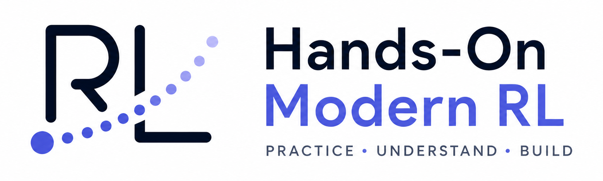
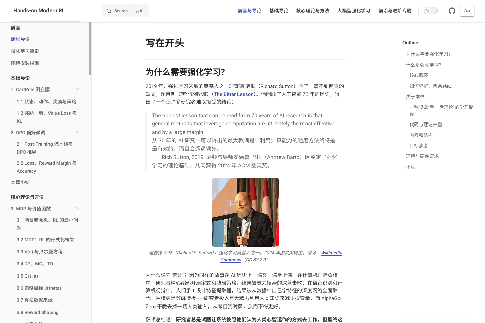
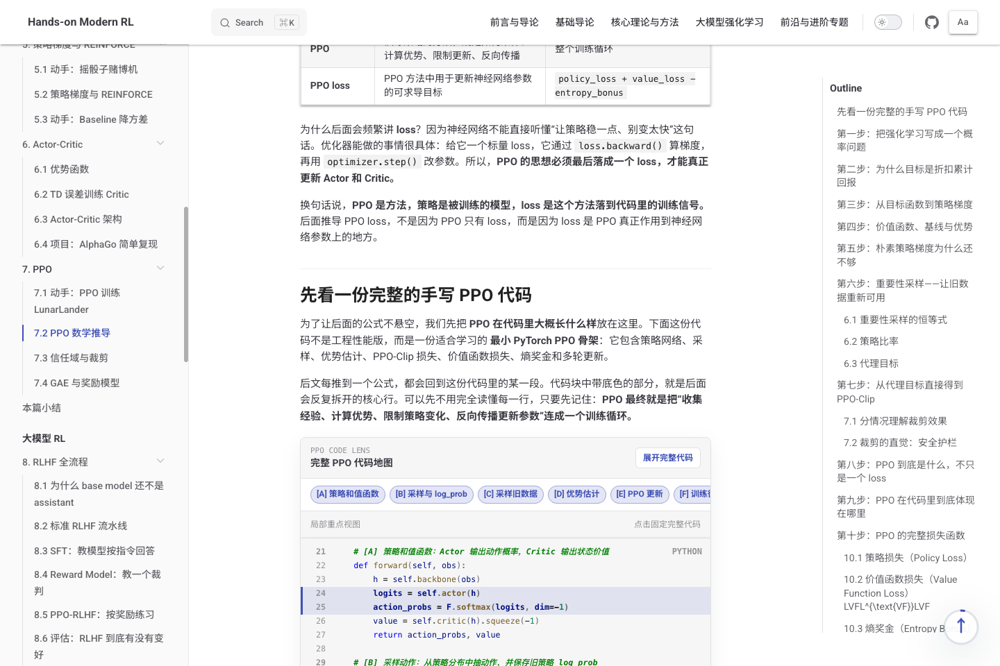
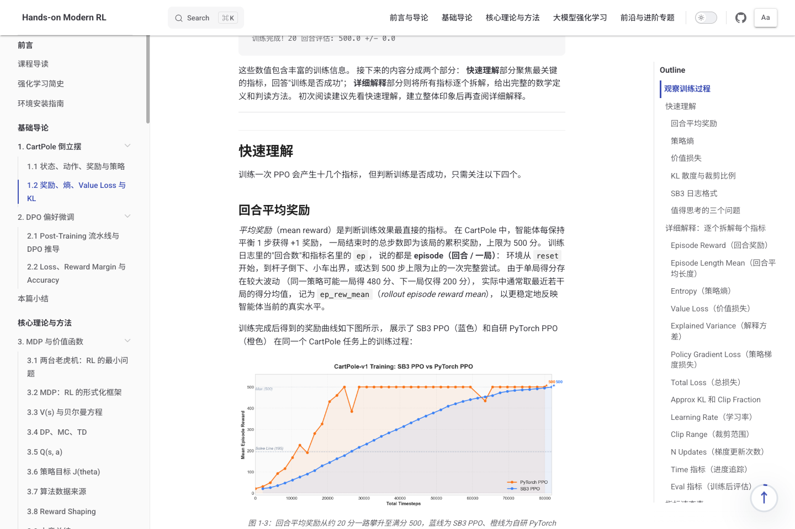
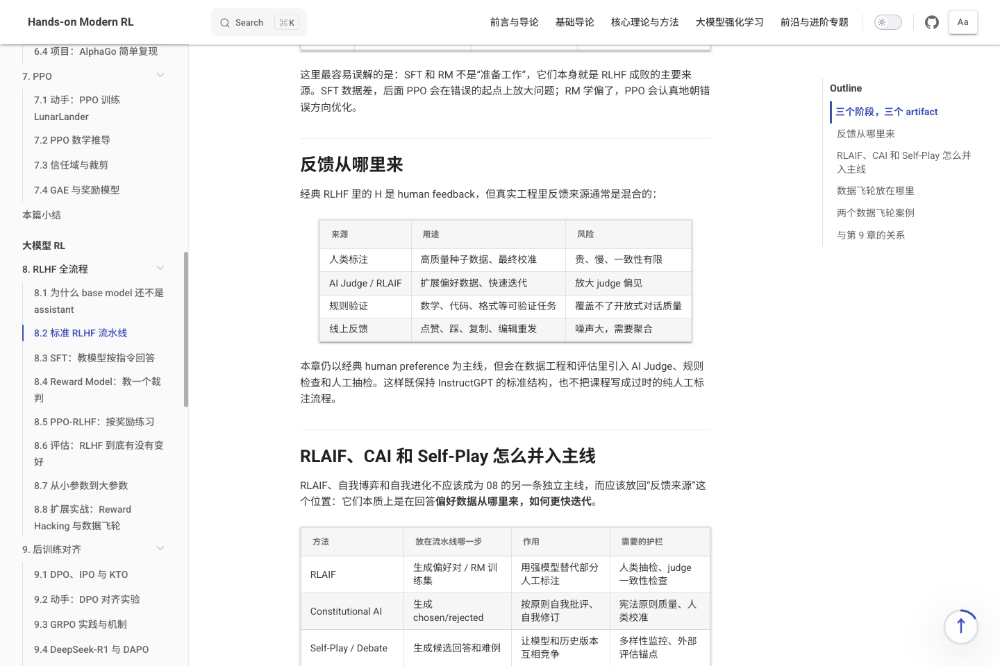
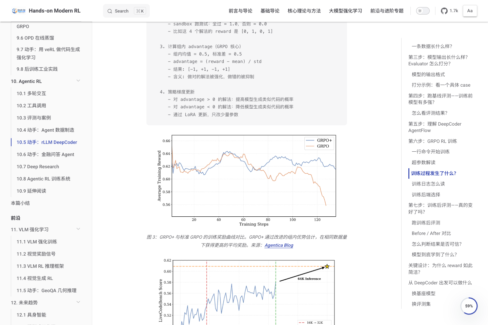
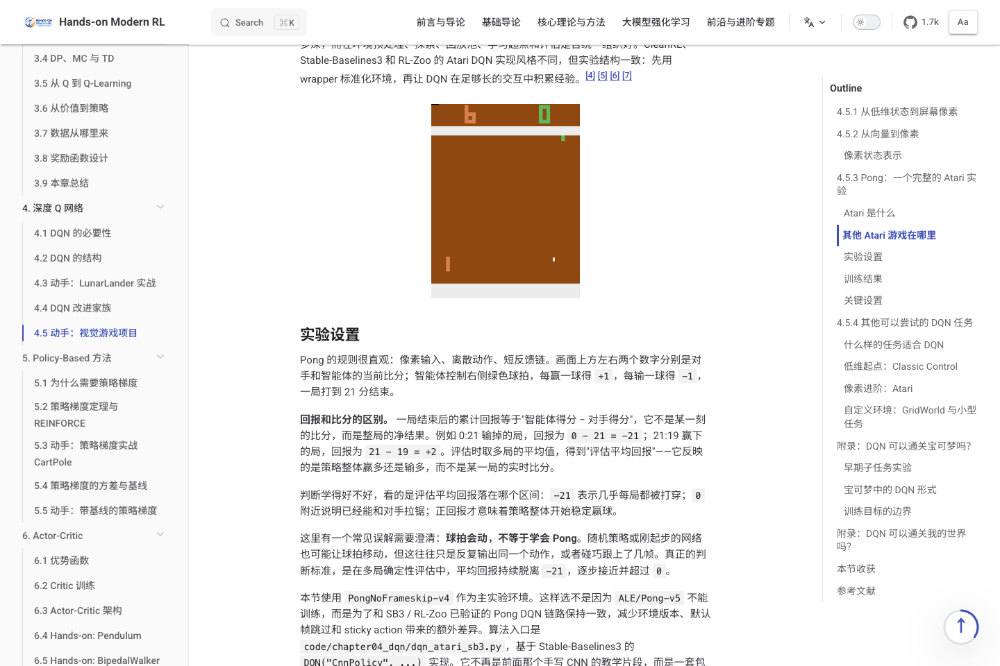

<div align="center">
  
  <p><em>：、LLM 、RLVR 。</em></p>

  <p>
    <a href="https://letslego.github.io/hands-on-modern-rl/"></a>
    <a href="https://github.com/letslego/hands-on-modern-rl/releases/latest"></a>
    <a href="https://github.com/letslego/hands-on-modern-rl/blob/main/LICENSE"></a>
    = 18" />
    
  </p>

  <p>
    <a href="README.md">English</a> ·
    <a href="README.zh.md"></a>
  </p>

  <p>
    <a href="#">（）</a>
  </p>

  <p>
    <a href="#"></a> ·
    <a href="#"></a> ·
    <a href="#🔥--news"></a> ·
    <a href="#"></a> ·
    <a href="#"></a> ·
    <a href="#"></a> ·
    <a href="#"></a> ·
    <a href="#"></a>
  </p>
</div>

## 

<table>
  <tr>
    <td width="50%" align="center">
      
      <br />
      <strong></strong>
      <br />
      <sub>、，。</sub>
    </td>
    <td width="50%" align="center">
      
      <br />
      <strong></strong>
      <br />
      <sub>PPO、DPO、GRPO ，。</sub>
    </td>
  </tr>
  <tr>
    <td width="50%" align="center">
      
      <br />
      <strong></strong>
      <br />
      <sub>、，。</sub>
    </td>
    <td width="50%" align="center">
      
      <br />
      <strong>LLM </strong>
      <br />
      <sub>RLHF、DPO、GRPO、RLVR 、artifact 。</sub>
    </td>
  </tr>
  <tr>
    <td width="50%" align="center">
      
      <br />
      <strong>Agentic RL </strong>
      <br />
      <sub>DeepCoder  GRPO ，、。</sub>
    </td>
    <td width="50%" align="center">
      
      <br />
      <strong>Atari </strong>
      <br />
      <sub>Atari Pong  DQN ，。</sub>
    </td>
  </tr>
</table>

---

> [!NOTE]
> ， AGI 。
>
> 。 🚧 ，🚧， 。

> ****
>
> ，， amitabha.karmakar@gmail.com。

## 

- [](#)
- [](#)
- [](#)
- [](#)
- [](#)
- [](#)
- [](#)
- [](#)

## 

**Hands-On Modern RL** 。“， API”， **“”** ：，，、、、。

， AI ，（LLM）、（DPO/GRPO）、（RLVR）、 Agentic RL （VLM）。

—— CartPole ，。

### 

：

1. **。** 、、，。
2. **。** MDP、、、GAE、PPO 、DPO  GRPO ，。
3. **，。** ， RLHF、、RLVR、VLM 。
4. **。** 、（Reward hacking）、KL 、、OOM ，。
5. **。** 、，。

### 

。

：

- ；
- ；
-  RLHF、DPO、GRPO、RLVR （LLM）；
- 、Web 、；
- 、。

：

- Python ；
-  PyTorch ；
- 、；
- 。

，。

### 

，：

- ：、、、；
-  MDP、、、TD 、；
-  DQN、REINFORCE、Actor-Critic、PPO、DPO、GRPO ；
- （LLM）， SFT、、PPO  RLHF、DPO （RLVR）；
- ，、 Agentic RL ；
-  VLM（）、；
- ， RL 、。

### 

。，、。

- : [letslego.github.io/hands-on-modern-rl](https://letslego.github.io/hands-on-modern-rl/)
- : [`docs/`](docs/)
- : [`code/`](code/)
- : `npm run verify`
- : [CC BY-NC-SA 4.0](LICENSE)

 Issue  Pull Request 、、、。

## 🔥  (News)

> ⚠️ ****： AI ，，。 Issue  PR 。

- **[2026-05-15]** 📖 ** PDF **：， PDF  CI 。
- **[2026-05-13]** 🚀 ****： **Agentic RL**（Deep Research / rLLM） ** RL**（Actor-Critic ）。 Agentic ， VLM （GeoQA ）！
- **[2026-05-02]** 🎉 ，。

## 🗺️  (Roadmap)

，：

- [x] **2026-05-02**：，。
- [x] **2026-05-10**：，，（）（）。
- [x] **2026-05 **：， RLVR（）。
- [ ] **2026-06 **： Agentic RL （ Deep Research ）。
- [ ] **2026-06 **： Unity （Embodied RL）。
- [ ] **2026-07 **：， VLM  Diffusion RL 。

## 

。README ；、、。

### 

|                                                 |                                      |
| :-------------------------------------------------- | :--------------------------------------- |
| [](docs/preface/intro.md)                   | 、。       |
| [](docs/preface/brief-history/index.md) |  AlphaGo、RLHF  LLM 。 |
| [](docs/preface/env-setup.md)           | 。       |

### ：

|  |                                             |                                                                          |
| :--- | :-------------------------------------------------- | :------------------------------------------------------------------------------- |
| 01   | [CartPole ](docs/chapter01_cartpole/intro.md) | 、、、、、。         |
| 02   | [DPO ](docs/chapter02_dpo/intro.md)         | 、DPO 、、， RL 。 |
|  | [](docs/summaries/part1-summary.md)         | 。                                     |

### ：

|  |                                                         |                                                                                       |
| :--- | :-------------------------------------------------------------- | :-------------------------------------------------------------------------------------------- |
| 03   | [MDP ](docs/chapter03_mdp/intro.md)                   | 、MDP、、、TD 、Q-learning、、。    |
| 04   | [ Q ](docs/chapter04_dqn/intro.md)                      |  Q-learning  DQN，、、CNN 、LunarLander、Atari 。 |
| 05   | [ REINFORCE](docs/chapter05_policy_gradient/intro.md) | 、、baseline 。                                               |
| 06   | [Actor-Critic](docs/chapter06_actor_critic/intro.md)            | Actor-Critic 、、 TD  Critic 。                         |
| 07   | [PPO](docs/chapter07_ppo/intro.md)                              | PPO 、、、GAE、、 BipedalWalker 。              |
|  | [](docs/summaries/part2-summary.md)                     | 。                                                      |

### ： RL

|  |                                          |                                                                                                               |
| :--- | :----------------------------------------------- | :-------------------------------------------------------------------------------------------------------------------- |
| 08   | [ RLHF ](docs/chapter08_rlhf/intro.md) | SFT、、PPO  RLHF、、。                                                                |
| 09   | [](docs/chapter09_alignment/intro.md)  | DPO 、GRPO、DeepSeek-R1  DAPO、RLVR、 GRPO、、。                    |
| 10   | [Agentic RL](docs/chapter10_agentic_rl/intro.md) | 、、、SWE/DeepCoder/FinQA 、Deep Research  Agentic 。 |
|  | [](docs/summaries/part3-summary.md)      |  RL 、，。                                                      |

### ：

|  |                                           |                                                                      |
| :--- | :------------------------------------------------ | :--------------------------------------------------------------------------- |
| 11   | [VLM ](docs/chapter11_vlm_rl/intro.md)    | VLM GRPO、、、 RL  EasyR1 GeoQA 。       |
| 12   | [](docs/chapter12_future_trends/intro.md) | 、Model-Based RL、、、。 |
|  | [](docs/summaries/part4-summary.md)       | 。                                       |

### 

|  |                                                        |                                                            |
| :--- | :------------------------------------------------------------- | :----------------------------------------------------------------- |
| A    | [](docs/appendix_common_pitfalls/intro.md)         | 、、。                   |
| B    | [RL ](docs/appendix_industrial_training/intro.md)      | 、Agent 、、、、。 |
| C    | [](docs/appendix_code_cheatsheet/intro.md)         | SFT、PPO、DPO、GRPO、、 DAPO 。          |
| D    | [](docs/appendix_game_projects/intro.md) | ，。                         |
| E    | [](docs/appendix_math/intro.md)              | 、、、。               |

## 

[`code/`](code/) 。，、。

|            |                                                                                                            |                                                      |
| :------------- | :----------------------------------------------------------------------------------------------------------------- | :------------------------------------------------------------- |
|        | [`code/chapter01_cartpole/`](code/chapter01_cartpole/)                                                             |  CartPole，， PPO 。             |
|        | [`code/chapter02_dpo/`](code/chapter02_dpo/)                                                                       | ， DPO ，。      |
| MDP  | [`code/chapter03_mdp/`](code/chapter03_mdp/)                                                                       | ，，。       |
|  Q     | [`code/chapter04_dqn/`](code/chapter04_dqn/)                                                                       | 、 Double DQN 。                     |
|        | [`code/chapter05_policy_gradient/`](code/chapter05_policy_gradient/)                                               |  REINFORCE、 Actor-Critic 。                 |
| PPO            | [`code/chapter07_ppo/`](code/chapter07_ppo/)                                                                       |  LunarLander，， GAE，。 |
| RLHF           | [`code/chapter08_rlhf/`](code/chapter08_rlhf/)                                                                     |  SFT、、PPO  veRL/GSM8K 。   |
|  RLVR    | [`code/chapter09_alignment/`](code/chapter09_alignment/), [`code/chapter09_grpo_rlvr/`](code/chapter09_grpo_rlvr/) |  DPO 、GRPO 。             |
| VLM    | [`code/chapter10_agentic_rl/`](code/chapter10_agentic_rl/), [`code/chapter11_vlm_rl/`](code/chapter11_vlm_rl/)     | ，。         |
|        | [`code/chapter12_future_trends/`](code/chapter12_future_trends/)                                                   | 、Model-Based RL。           |

 [`code/README.md`](code/README.md) 。

## 

：

1. [](docs/preface/intro.md) CartPole 。
2.  DPO （），。
3.  03-07 ；。
4.  PPO ， RLHF、DPO、GRPO  RLVR。
5. ，。
6. ：VLM 、Agentic RL、、。

## 

### 

：

```text
https://letslego.github.io/hands-on-modern-rl/
```

### 

：

- Node.js >= 18.0.0
- npm

```bash
git clone https://github.com/letslego/hands-on-modern-rl.git
cd hands-on-modern-rl
npm install
npm run dev
```

 VitePress ，：

```text
http://localhost:5173
```

### 

、、、 Pull Request ，：

```bash
npm run verify
```

，Lint VitePress ，，。

### 

 Python，。

```bash
cd code
python -m venv .venv
source .venv/bin/activate
pip install -r requirements.txt
```

， requirements ：

```bash
pip install -r chapter01_cartpole/requirements.txt
python chapter01_cartpole/1-ppo_cartpole.py
```

、GPU 、。 LLM、VLM ， 01 。

## 

```text
hands-on-modern-rl/
├── docs/                      # VitePress 
│   ├── .vitepress/            # 、、
│   ├── public/                # 
│   ├── preface/               # 
│   ├── chapter*/              # 
│   ├── appendix*/             # 
│   └── summaries/             # 
├── code/                      # 
├── scripts/                   # 
├── package.json               # 
├── AGENTS.md                  # 
└── README.md                  # 
```

## 

```bash
npm run dev           # 
npm run build         # 
npm run preview       # 
npm run format        #  Prettier 
npm run format:check  # 
npm run lint          # Lint VitePress 
npm run verify        # 、Lint、
```

## 

、、。

：

- 、、、；
- ；
- 、；
- 、、；
- 、。

 Pull Request 。 PR 、、。

：

1.  [`docs/`](docs/) 。
2.  kebab-case（）。
3. （ `index.md`）。
4. ， [`docs/.vitepress/config.mjs`](docs/.vitepress/config.mjs)。
5. 、、， Review  `npm run verify`。
6.  Conventional Commits ， `docs: clarify ppo clipping`  `fix: repair chapter link`。

， [`AGENTS.md`](AGENTS.md)。

## 

！：

- [**Learn Harness Engineering**](https://github.com/letslego/learn-harness-engineering) —  AI  Harness Engineering 。 12  6 ，、、，。
- [**Modern LLM Notebook**](https://github.com/letslego/modern-llm-notebook) —  23  Jupyter Notebook， PyTorch  LLM ， Tokenizer、Transformer、、、。

## （）

 / ，（）：


## 

、，：

```bibtex
@misc{hands_on_modern_rl,
  title        = {Hands-On Modern RL: Practice-first reinforcement learning from CartPole to LLM post-training and agentic systems},
  author       = {letslego},
  year         = {2026},
  howpublished = {\url{https://github.com/letslego/hands-on-modern-rl}},
  note         = {Open courseware repository}
}
```

## 

 [Creative Commons Attribution-NonCommercial-ShareAlike 4.0 International License](LICENSE) 。

，，。

## Star History

<a href="https://star-history.com/#letslego/hands-on-modern-rl&Date">
  <picture>
    <source media="(prefers-color-scheme: dark)" srcset="https://api.star-history.com/svg?repos=letslego/hands-on-modern-rl&type=Date&theme=dark" />
    <source media="(prefers-color-scheme: light)" srcset="https://api.star-history.com/svg?repos=letslego/hands-on-modern-rl&type=Date" />
    
  </picture>
</a>

---

<div align="center">
  <sub> letslego 。</sub>
</div>
