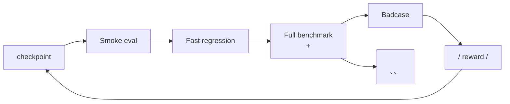
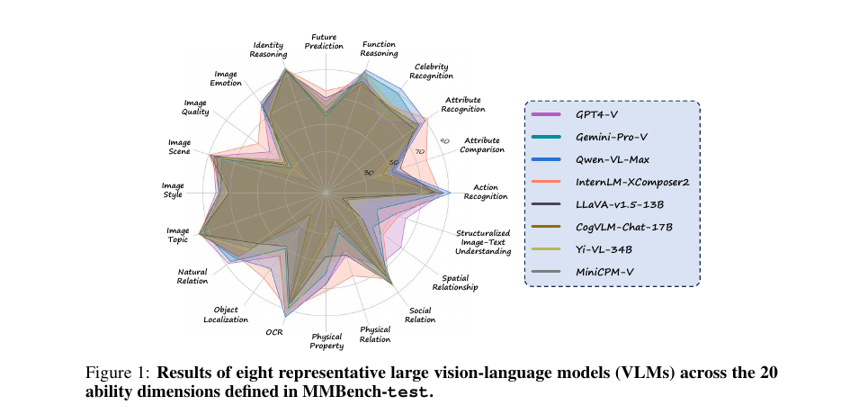
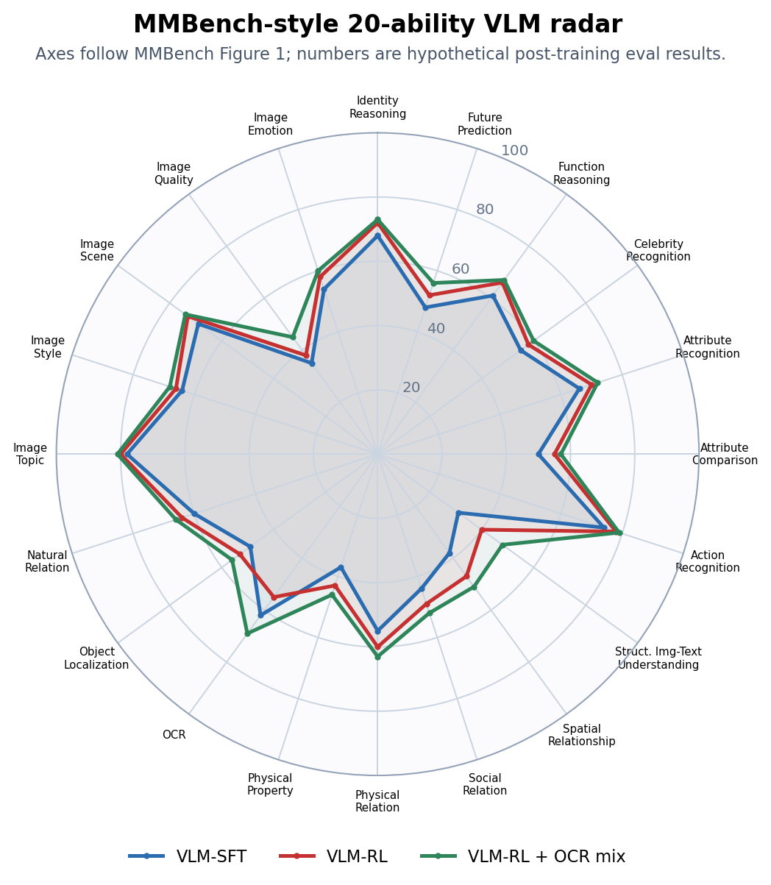
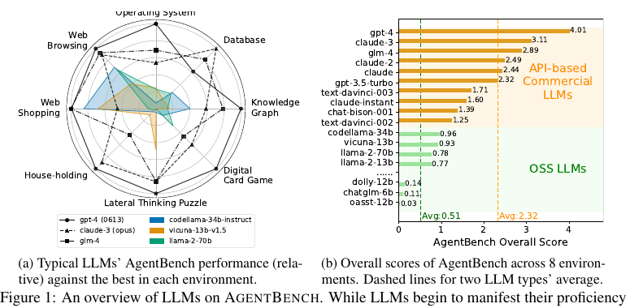
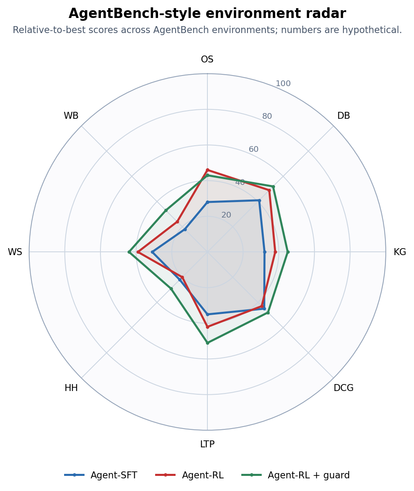

# B.3 RL  Agentic RL Benchmark

>  optimizer ，benchmark 。
>
>  RL ，reward ； Agentic RL ， agent 。： [B.1 RL ](./rl-infrastructure)  [B.2 Agentic RL ](./agentic-rl-infra) ， benchmark  checkpoint 、，。

## Benchmark 

 benchmark ，****。：

1. ****：，、、。 agent  bug ，、。
2. ****：、、、、。，。
3. ****：、verifier、； LLM-as-Judge。，benchmark 。
4. ****： checkpoint  SFT、 RL checkpoint，。，。
5. ****：、、。，，。
6. ** taxonomy**： badcase 、reward、、、。，、reward 。

 HELM ：，、[^helm]。 RL ，， reward，。



： checkpoint ，，。、prompt  reward ，。

##  Benchmark 

“、、”。、 Hugging Face ； benchmark ，。

|            | Benchmark              |                                                                                                                                                 |                                     |                                             |
| -------------- | ---------------------- | --------------------------------------------------------------------------------------------------------------------------------------------------- | ----------------------------------------- | --------------------------------------------------------- |
|  LLM       | MMLU                   | [HF ](https://huggingface.co/datasets/cais/mmlu)                                                                                              | accuracy                                  | [^mmlu]                         |
|  LLM       | MMLU-Pro               | [HF ](https://huggingface.co/datasets/TIGER-Lab/MMLU-Pro), [GitHub](https://github.com/TIGER-AI-Lab/MMLU-Pro)                                 | accuracy                                  | ， MMLU[^mmlupro]       |
|  LLM       | GPQA                   | [HF ](https://huggingface.co/datasets/Idavidrein/gpqa), [GitHub](https://github.com/idavidrein/gpqa)                                          | accuracy                                  | ，[^gpqa]           |
|  / RLVR    | GSM8K                  | [HF ](https://huggingface.co/datasets/openai/gsm8k)                                                                                           | exact match, pass@k                       | ， smoke eval[^gsm8k]             |
|  / RLVR    | MATH                   | [GitHub](https://github.com/hendrycks/math)                                                                                                         | exact match, pass@k                       | [^math]                               |
|            | HumanEval              | [GitHub](https://github.com/openai/human-eval)                                                                                                      | pass@1, pass@k                            | Python [^humaneval]               |
|            | LiveCodeBench          | [](https://livecodebench.github.io/), [GitHub](https://github.com/LiveCodeBench/LiveCodeBench)                                                  | pass@1, pass@k                            | ，[^livecodebench]        |
|        | IFEval                 | [](https://github.com/google-research/google-research/tree/master/instruction_following_eval)                                               | prompt-level / instruction-level accuracy | 、、[^ifeval]             |
|  / RM      | AlpacaEval             | [](https://tatsu-lab.github.io/alpaca_eval/), [GitHub](https://github.com/tatsu-lab/alpaca_eval)                                                | win rate, LC win rate                     | [^alpacaeval]                     |
|  / RM      | RewardBench            | [HF ](https://huggingface.co/datasets/allenai/reward-bench), [GitHub](https://github.com/allenai/reward-bench)                                | pairwise accuracy                         | reward model [^rewardbench]             |
| VLM            | MMMU                   | [](https://mmmu-benchmark.github.io/), [GitHub](https://github.com/MMMU-Benchmark/MMMU), [HF ](https://huggingface.co/datasets/MMMU/MMMU) | accuracy                                  | 、、[^mmmu]                   |
| VLM            | MMBench                | [](https://opencompass.openxlab.space/omnimmbench), [GitHub](https://github.com/open-compass/MMBench)                                           | accuracy, circular eval accuracy          | 、、、 VLM [^mmbench]         |
| VLM            | MathVista              | [](https://mathvista.github.io/)                                                                                                                | accuracy                                  | 、、[^mathvista]              |
| VLM            | ChartQA                | [GitHub](https://github.com/vis-nlp/ChartQA)                                                                                                        | relaxed accuracy, exact match             | 、、[^chartqa]                    |
| VLM            | DocVQA                 | [](https://site.docvqa.org/datasets/docvqa)                                                                                                     | ANLS                                      | 、OCR、[^docvqa]                      |
|        | BFCL                   | [](https://gorilla.cs.berkeley.edu/leaderboard), [](https://sky.cs.berkeley.edu/project/berkeley-function-calling-leaderboard/)         | AST match, executable accuracy            | 、、[^bfcl]                     |
|        | API-Bank               | [GitHub](https://github.com/AlibabaResearch/DAMO-ConvAI/tree/main/api-bank)                                                                         | API call accuracy, response quality       | API 、、[^apibank]                |
|  Agent | SWE-bench              | [](https://www.swebench.com/), [GitHub](https://github.com/SWE-bench/SWE-bench)                                                                 | resolved rate, pass@1                     |  GitHub issue [^swebench]             |
| Web Agent      | WebArena               | [](https://webarena.dev/), [GitHub](https://github.com/web-arena-x/webarena)                                                                    | task success                              | 、、、GitLab [^webarena]  |
|  Agent     | GAIA                   | [HF ](https://huggingface.co/datasets/gaia-benchmark/GAIA), [](https://huggingface.co/spaces/gaia-benchmark/leaderboard)                | final answer accuracy                     | 、、、[^gaia]                   |
|  Agent   | Claw-Eval-Live         | [](https://claw-eval-live.github.io/), [](https://arxiv.org/abs/2604.28139)                                                               | pass rate, completion score               | [^clawevallive]         |
|  Agent   | ClawWork               | [GitHub](https://github.com/HKUDS/ClawWork), [](https://hkuds.github.io/ClawWork/)                                                            | net income, survival, task quality        |  agent [^clawwork]    |
|  Agent     | OSWorld                | [](https://os-world.github.io/)                                                                                                                 | task success                              | [^osworld]                      |
|  Agent | tau-bench / tau2-bench | [](https://www.taubench.com/), [GitHub](https://github.com/sierra-research/tau2-bench)                                                          | pass^k, database state                    | 、、-[^taubench]            |
|  Agent   | AgentBench             | [GitHub](https://github.com/THUDM/AgentBench)                                                                                                       | environment success rate                  | Web、、、 agent [^agentbench] |

## RL  Benchmark

“RL ” RLHF、RLAIF、DPO/IPO/KTO、PPO、GRPO、RLVR 。“”，：

- ****：、、、、。
- ****：。
- ****：reward model / verifier 。

### 

|       |  benchmark                 |                                       |                      |                                                  |
| ----------- | ------------------------------ | ------------------------------------------- | ---------------------------------- | ------------------------------------------------------ |
|     | IFEval, MT-Bench, AlpacaEval   | 、pairwise win rate               | ， | LLM judge 、、[^mtbench][^ifeval]  |
|  RLVR | GSM8K, MATH, AIME    | exact match, pass@k, verifier accuracy      |                  | 、[^gsm8k][^math]              |
|         | HumanEval, MBPP, LiveCodeBench | pass@1, pass@k,                   |              | 、[^humaneval][^livecodebench] |
|     | HELM             | accuracy, robustness, calibration, toxicity |              | ，[^helm]                          |
|     | RewardBench,         | pairwise accuracy, segment accuracy         | reward           | RM [^rewardbench]              |

 benchmark “”。** + **：

|      |                                                                      |
| -------- | ------------------------------------------------------------------------ |
|    |  RLVR  MATH / AIME pass@1； RL  LiveCodeBench pass@1 |
|    | ，                               |
|  | 、、                               |
|  | 、、、KL、entropy、reward margin                     |

### 

，。RL ：

```yaml
model: qwen-rl-step-1800
baseline: qwen-sft
sampling:
  temperature: 0.6
  top_p: 0.95
  n: 1
  max_tokens: 4096
judge:
  type: rule_then_llm_judge
  order_randomization: true
  tie_policy: count_as_half
split:
  dev: visible_for_iteration
  test_public: reported_every_night
  test_private: release_gate_only
```

，、 verifier。、、 LLM-as-Judge，、 judge 。MT-Bench  Chatbot Arena ，LLM judge ，、[^mtbench]。

### 

，“ judge”，。、“”；LLM-as-Judge “”；“agent ，”。，。

|        |                       |                                                                                                                              |                            |
| ---------- | ------------------------- | -------------------------------------------------------------------------------------------------------------------------------------- | ---------------------------------------- |
| G-Eval     | LLM-as-Judge          |  rubric ， BLEU/ROUGE 、、[^geval]                                   | 、             |
| MAJ-EVAL   | Multi-Agent-as-Judge  |  persona ， judge [^majeval]                                                           | 、// |
| DeepEval   | LLM           |  eval， G-Eval、RAG、agent task completion、tool correctness [^deepeval]                                     | 、CI             |
| agentevals | Agent         |  reference matching、LLM judge  trace ；LangChain ，OpenTelemetry  trace [^agentevals] | Agent 、badcase              |

：**G-Eval  MAJ-EVAL ，DeepEval  agentevals **。“”，“”。 RL ， verifier；、、，。LLM judge 、、。

### 

RL  `pass@k`。 `pass@8` ，“”， `pass@1` 。：

|          |                         |                               |
| ------------ | --------------------------- | --------------------------------------- |
| `pass@1`     |               | 、                  |
| `pass@k`     |         | search / rerank / self-consistency  |
| `majority@k` |           | 、                        |
| `best-of-n`  |  reward / verifier  |  reward           |

， `pass@k`。，： 1  token、 verifier 、。

## Agentic RL Benchmark

Agentic RL ，****：

```text
 →  → / →  →  →  → ... → 
```

 agent benchmark ：

- ：、、、API、。
- ：、、、 API。
- ：、 diff、、。
- ：、、 token、。
- ： observation、action、tool result、。

### Benchmark 

|               |  benchmark                |                          |                                               |
| ----------------- | ----------------------------- | ---------------------------------- | ----------------------------------------------------- |
| API /     | API-Bank, BFCL          | 、、   | JSON / API [^apibank]           |
|       | WebArena                      | 、、、   | [^webarena]                     |
|  agent    | SWE-bench, SWE-bench Verified |  GitHub issue              | [^swebench]                             |
|           | GAIA                          | 、、、       | [^gaia]                                 |
|         | Claw-Eval-Live                | 、、   |  +  +  judge[^clawevallive] |
|           | ClawWork                      | 、、       | 、API 、、[^clawwork]             |
| /     | OSWorld                       | GUI 、、         | [^osworld]                        |
| - | tau-bench                     | 、、 |  + [^taubench]                    |
|  agent      | AgentBench                    | Web、、、  | [^agentbench]                             |

 benchmark “ agent ”。 agent，SWE-bench  GAIA ；//CRM agent，tau-bench ； agent，WebArena 。

### Agent 

Agentic RL 、。

|                  |                            |                             |
| -------------------- | ------------------------------ | ------------------------------------- |
| `task_success`       |                | ， reward               |
| `state_success`      |            |       |
| `tool_success`       | 、 |                       |
| `recovery_rate`      |    |                     |
| `steps_to_success`   |                    |                     |
| `cost_to_success`    | token、、API           |                               |
| `safety_violation`   | 、、         | agent  LLM  |
| `trajectory_quality` | 、     | ， reward         |

，。 agent ，， agent。：， badcase 。

### Rollout Cards：

Agent benchmark ，，。 `task_success = 62%`， run 、、、，。**Rollout Cards** ： rollout ，[^rolloutcards]。

 rollout card ：

- ****： observation、action、tool result、、。
- ****： run ，，、、。
- ****：token、、API 、。
- ****：、、、。
- **drops manifest**：、、，。

 RL ：， trajectory / rollout 。 Agentic RL ，rollout card “ A  B  3 ”：，？，？，？

## 

， benchmark 。，： LLM、VLM、 / agent。、、badcase 。

###  LLM：MMLU + GSM8K + IFEval

“RL ”。：MMLU-Pro  MMLU ，GSM8K ，IFEval 。

```yaml
suite: llm_core_regression_v1
model: qwen2.5-7b-grpo-step-1800
baseline: qwen2.5-7b-sft
generation:
  temperature: 0.0
  top_p: 1.0
  max_tokens: 2048
datasets:
  - name: mmlu_pro
    split: test
    metric: accuracy
  - name: gsm8k
    split: test
    metric: exact_match
  - name: ifeval
    split: test
    metric: prompt_level_accuracy
```

：

```text
checkpoint: qwen2.5-7b-grpo-step-1800
baseline: qwen2.5-7b-sft
mmlu_pro_accuracy: 44.8% -> 44.1% (-0.7)
gsm8k_exact_match: 72.4% -> 77.9% (+5.5)
ifeval_prompt_accuracy: 63.0% -> 57.2% (-5.8)
response_length_mean: 612 -> 941 (+53.8%)
badcase_top:
  - ifeval_keyword_missing: 74 cases
  - ifeval_length_constraint_violation: 61 cases
  - gsm8k_final_answer_format_error: 19 cases
release_decision: block
```

 RLVR ，，。，：

-  IFEval “、、、”，。
-  reward “”“”，。
- ， `response_length_mean`  judge。
-  GSM8K  verifier：。

### VLM：MMMU + MathVista + ChartQA

VLM ， OCR、、、。 MMMU ，MathVista ，ChartQA 。

```yaml
suite: vlm_reasoning_regression_v1
model: qwen-vl-rl-step-900
baseline: qwen-vl-sft
generation:
  temperature: 0.0
  max_tokens: 1024
input:
  image_resolution: 1344
  preserve_aspect_ratio: true
metrics:
  - accuracy
  - relaxed_numeric_accuracy
  - ocr_error_rate
  - answer_parse_fail_rate
```

：

```text
checkpoint: qwen-vl-rl-step-900
mmmu_val_accuracy: 42.0% -> 44.6% (+2.6)
mathvista_accuracy: 37.5% -> 38.1% (+0.6)
chartqa_relaxed_accuracy: 61.8% -> 54.7% (-7.1)
answer_parse_fail_rate: 3.2% -> 4.9% (+1.7)
badcase_top:
  - chart_axis_value_misread: 88 cases
  - table_header_binding_error: 43 cases
  - geometry_diagram_spatial_relation_error: 31 cases
release_decision: block_for_chart_tasks
```

“VLM ”，。：

-  ChartQA 、、 header  SFT / RLVR 。
-  `exact + relaxed numeric` ，、。
-  OCR / visual grounding ，。
-  resize，；。

###  Agent：BFCL + API-Bank + SWE-bench

 BFCL  API-Bank，“、、”； agent  SWE-bench Verified 。 SWE-bench resolved rate， JSON 。

```yaml
suite: agent_tool_regression_v1
model: code-agent-rl-step-2400
baseline: code-agent-sft
tool_protocol:
  parallel_tool_calls: true
  max_tool_calls: 50
  max_wall_time_minutes: 20
datasets:
  - name: bfcl_v3
    metric: executable_accuracy
  - name: api_bank
    metric: api_call_accuracy
  - name: swebench_verified
    metric: resolved_rate
```

：

```text
checkpoint: code-agent-rl-step-2400
bfcl_executable_accuracy: 82.1% -> 85.6% (+3.5)
api_bank_call_accuracy: 68.4% -> 66.9% (-1.5)
swebench_verified_resolved: 28.0% -> 32.4% (+4.4)
avg_tool_calls_successful_tasks: 18.6 -> 27.9 (+50.0%)
tool_error_recovery_rate: 41.2% -> 37.5% (-3.7)
safety_violation_rate: 0.3% -> 0.9% (+0.6)
release_decision: research_only
```

 SWE-bench ，。：

- ，“、、”。
-  curriculum：、、、JSON schema 。
- ，、 CI、、。
-  `resolved_rate`  `cost_to_success` ，。

## 

 radar chart “”。： checkpoint 、， agent 。，：

1. ****：。 `safety_violation_rate`  `safety_score = 100 * (1 - violation_rate / max_bad_rate)`。
2. ****： 0-100。accuracy  100；、、 min-max 。
3. ****：，，。

### 

“”，，**、、**：

- **MMBench  VLM 20 **：MMBench  Figure 1  8  VLM  20 ， action recognition、OCR、spatial relationship、physical relation、identity reasoning [^mmbench]。：VLM ，？
- **AgentBench  Agent **：AgentBench  agent  OS、DB、KG、DCG、LTP、HH、WS、WB [^agentbench]。： agent  SQL / shell，、、？

****，；，， leaderboard / JSON 。

### 

 `scripts/plot_paper_style_radar.py`：

```bash
python -m pip install matplotlib
python scripts/plot_paper_style_radar.py
```

```python
from pathlib import Path
import math
import matplotlib.pyplot as plt

OUT = Path("docs/appendix_industrial_training/images")
OUT.mkdir(parents=True, exist_ok=True)

COLORS = ["#2b6cb0", "#c53030", "#2f855a", "#6b46c1"]


def closed(values):
    return values + values[:1]


def plot_paper_radar(title, metrics, series, output_path, subtitle=None):
    angles = [2 * math.pi * i / len(metrics) for i in range(len(metrics))]
    angles = closed(angles)

    fig, ax = plt.subplots(figsize=(7.6, 6.4), subplot_kw={"polar": True})
    fig.patch.set_facecolor("white")
    ax.set_facecolor("#fbfbfd")
    ax.set_theta_offset(math.pi / 2)
    ax.set_theta_direction(-1)
    ax.set_ylim(0, 100)
    ax.set_xticks(angles[:-1])
    ax.set_xticklabels(metrics, fontsize=9)
    ax.set_yticks([20, 40, 60, 80, 100])
    ax.set_yticklabels(["20", "40", "60", "80", "100"], fontsize=8, color="#64748b")
    ax.grid(color="#cbd5e1", linewidth=0.9)
    ax.spines["polar"].set_color("#94a3b8")

    for idx, (name, values) in enumerate(series.items()):
        color = COLORS[idx % len(COLORS)]
        values = closed(values)
        ax.plot(angles, values, color=color, linewidth=2.4, marker="o", markersize=3.2, label=name)
        ax.fill(angles, values, color=color, alpha=0.08)

    ax.set_title(title, y=1.12, fontsize=13, fontweight="bold")
    if subtitle:
        fig.text(0.5, 0.905, subtitle, ha="center", va="center", fontsize=9, color="#475569")
    ax.legend(loc="upper center", bbox_to_anchor=(0.5, -0.08), ncol=min(3, len(series)), frameon=False)
    fig.tight_layout(pad=2.0)
    fig.savefig(output_path, dpi=180, bbox_inches="tight")
    plt.close(fig)


mmbench_metrics = [
    "Identity\nReasoning",
    "Future\nPrediction",
    "Function\nReasoning",
    "Celebrity\nRecognition",
    "Attribute\nRecognition",
    "Attribute\nComparison",
    "Action\nRecognition",
    "Struct. Img-Text\nUnderstanding",
    "Spatial\nRelationship",
    "Social\nRelation",
    "Physical\nRelation",
    "Physical\nProperty",
    "OCR",
    "Object\nLocalization",
    "Natural\nRelation",
    "Image\nTopic",
    "Image\nStyle",
    "Image\nScene",
    "Image\nQuality",
    "Image\nEmotion",
]
mmbench_series = {
    "VLM-SFT": [68, 48, 61, 55, 66, 50, 74, 31, 38, 44, 55, 37, 62, 49, 60, 78, 64, 69, 35, 54],
    "VLM-RL": [72, 52, 66, 58, 70, 55, 78, 40, 47, 49, 60, 43, 55, 53, 64, 80, 66, 73, 38, 58],
    "VLM-RL + OCR mix": [73, 56, 67, 60, 72, 57, 79, 48, 51, 52, 63, 46, 69, 56, 66, 81, 68, 74, 45, 60],
}
plot_paper_radar(
    "MMBench-style 20-ability VLM radar",
    mmbench_metrics,
    mmbench_series,
    OUT / "radar-llm-core-regression.png",
    "Axes follow MMBench Figure 1; numbers are hypothetical post-training eval results.",
)

agentbench_metrics = ["OS", "DB", "KG", "DCG", "LTP", "HH", "WS", "WB"]
agentbench_series = {
    "Agent-SFT": [28.0, 41.0, 32.0, 45.0, 35.0, 22.0, 31.0, 18.0],
    "Agent-RL": [46.0, 49.0, 38.0, 43.0, 42.0, 20.0, 39.0, 24.0],
    "Agent-RL + guard": [43.0, 52.0, 45.0, 48.0, 51.0, 29.0, 44.0, 33.0],
}
plot_paper_radar(
    "AgentBench-style environment radar",
    agentbench_metrics,
    agentbench_series,
    OUT / "radar-code-agent-tool-bench.png",
    "Relative-to-best scores across AgentBench environments; numbers are hypothetical.",
)
```

### ： MMBench 20  VLM 

****：Liu et al., _MMBench: Is Your Multi-modal Model an All-around Player?_  Figure 1  8  VLM  MMBench-test  20 [^mmbench]。



_ 1：MMBench  Figure 1 。 20 ， overall accuracy。：MMBench [^mmbench]。_

****： MMBench  L-3 ability ， 20 ； `mmbench_series`。， 20 。

|              | Action | OCR | Spatial | Physical Relation | Identity | Image Quality |
| ---------------- | ------ | --- | ------- | ----------------- | -------- | ------------- |
| VLM-SFT          | 74     | 62  | 38      | 55                | 68       | 35            |
| VLM-RL           | 78     | 55  | 47      | 60                | 72       | 38            |
| VLM-RL + OCR mix | 79     | 69  | 51      | 63                | 73       | 45            |



_ 2： MMBench  20 。`VLM-RL`  action、spatial、physical relation ， OCR ； OCR /  / ，`VLM-RL + OCR mix`  OCR ，。_

，：

- OCR ： ChartQA、DocVQA、 UI、 header 。
- Spatial / physical relation  OCR ： reward，。
- Image quality / image emotion ：，。

### ： AgentBench 

****：Liu et al., _AgentBench: Evaluating LLMs as Agents_  Figure 1(a)  LLM  8 ，Figure 1(b)  overall score [^agentbench]。



_ 3：AgentBench  Figure 1 。 8 ， overall score 。：AgentBench [^agentbench]。_

****：AgentBench ， `relative_score = 100 * model_score / best_score_in_this_environment`，。 agent 。

|              | OS  | DB  | KG  | DCG | LTP | HH  | WS  | WB  |
| ---------------- | --- | --- | --- | --- | --- | --- | --- | --- |
| Agent-SFT        | 28  | 41  | 32  | 45  | 35  | 22  | 31  | 18  |
| Agent-RL         | 46  | 49  | 38  | 43  | 42  | 20  | 39  | 24  |
| Agent-RL + guard | 43  | 52  | 45  | 48  | 51  | 29  | 44  | 33  |



_ 4： AgentBench 。`Agent-RL`  OS、DB、WS ， HH  DCG ； guard、 curriculum ，“”。_

：

- OS / DB ：，。
- HH / WB ：、、，。
- DCG ：，；、、。

##  Benchmark 

 benchmark ， benchmark 。 benchmark 。

### 1. 

，。“ agent”：

|            | Easy | Medium | Hard |
| ------------------ | ---- | ------ | ---- |
|  bug     | 30   | 40     | 20   |
|      | 10   | 30     | 30   |
|        | 20   | 30     | 20   |
|  /     | 10   | 20     | 20   |
|  | 10   | 20     | 20   |

，。

### 2. 

。 agent ：

```yaml
id: codeagent-medium-042
split: private_release
domain: software_engineering
difficulty: medium
initial_state:
  repo: internal/payment-service
  commit: 8f31c2a
  setup: npm install
prompt: '，。'
allowed_tools:
  - shell
  - file_edit
  - test_runner
budget:
  max_steps: 40
  max_minutes: 20
  max_tokens: 60000
success_verifier:
  type: unit_tests
  command: npm test
process_checks:
  - no_unrelated_file_rewrite
  - no_snapshot_deletion
tags:
  - decimal
  - regression-test
  - money-safety
```

、 badcase 。，“ checkpoint ”。

### 3. 

：

1. ****：、 diff、、。
2. ****：、、、。
3. ****：。
4. **LLM-as-Judge**：，。
5. ****：， judge 。

Agent benchmark “”。 agent “”，、。

### 4. 

RL ： test set  prompt， benchmark ，reward model ，。

：

-  n-gram / embedding 。
- ，。
-  benchmark ， `math-rlvr-v3.2`。
-  anchor set， benchmark 。

LiveCodeBench “”“”， RL benchmark[^livecodebench]。

### 5. 

 benchmark ，。：

|                |                      |
| ------------------ | ------------------------ |
| SFT            |  RL  |
|      |              |
|  |    |

 0 ，；，benchmark 。 benchmark  40%-80% ，。

## 

Benchmark “”，“”。RL  benchmark 。

|               |          |                           |
| ----------------- | ---------------- | --------------------------------- |
| training reward   |          | reward  benchmark       |
| KL divergence     |    | ，        |
| entropy           |          |  0，          |
| response length   |        |  judge  |
| verifier accuracy |    | verifier        |
| win rate          |  | ，/     |
| cost / latency    |          | agent         |

：**reward ，KL ，entropy ，benchmark **。“”， reward 。， reward  benchmark ， reward、verifier  judge。

：

```text
 2  1% ：
：
 reward ： checkpoint， badcase 
 agent  30%：，
```

## Badcase  RL

Badcase ，。

|                    |                     |                           |
| -------------------------- | --------------------------- | --------------------------------- |
|              | ，verifier  |  RLVR ， verifier |
|              | reward              |  reward  reward     |
| judge            | LLM judge           |           |
|  |               |               |
| agent      | /             |  SFT，    |
| agent        |             | 、      |
|      |             | ，          |

，：

```text
checkpoint: grpo-agent-step-2400
primary_metric: swebench_verified_pass@1 = 34.2% (+3.1)
regressions:
  - bfcl_call_accuracy: -1.8
  - avg_tool_calls_successful_tasks: +22%
badcase_clusters:
  - missing_repo_search_before_edit: 17 cases
  - tests_not_run_after_patch: 11 cases
  - tool_timeout_no_recovery: 8 cases
next_actions:
  - add 200 trajectories with mandatory test execution
  - add timeout recovery reward
  - keep previous checkpoint as release candidate
```

 benchmark ， RL ：，badcase  reward，。

## 

RL  benchmark **、 reward **；Agentic RL benchmark **、、**。

： reward 。 benchmark、 badcase 。

## 

[^helm]: Percy Liang et al. [Holistic Evaluation of Language Models](https://arxiv.org/abs/2211.09110), arXiv 2022.

[^mmlu]: Dan Hendrycks et al. [Measuring Massive Multitask Language Understanding](https://arxiv.org/abs/2009.03300), ICLR 2021.

[^mmlupro]: Yubo Wang et al. [MMLU-Pro: A More Robust and Challenging Multi-Task Language Understanding Benchmark](https://arxiv.org/abs/2406.01574), NeurIPS 2024 Datasets and Benchmarks Track.

[^gpqa]: David Rein et al. [GPQA: A Graduate-Level Google-Proof Q&A Benchmark](https://arxiv.org/abs/2311.12022), arXiv 2023.

[^mtbench]: Lianmin Zheng et al. [Judging LLM-as-a-Judge with MT-Bench and Chatbot Arena](https://arxiv.org/abs/2306.05685), NeurIPS 2023.

[^geval]: Yang Liu et al. [G-EVAL: NLG Evaluation using GPT-4 with Better Human Alignment](https://arxiv.org/abs/2303.16634), EMNLP 2023.

[^majeval]: Weiqi Wang et al. [Multi-Agent-as-Judge: Aligning LLM-Agent-Based Automated Evaluation with Multi-Dimensional Human Evaluation](https://arxiv.org/abs/2507.21028), arXiv 2025.

[^deepeval]: Confident AI. [DeepEval Documentation](https://deepeval.com/docs/introduction), accessed 2026-05-14.

[^agentevals]: LangChain. [agentevals: Readymade evaluators for agent trajectories](https://github.com/langchain-ai/agentevals), accessed 2026-05-14; AgentEvals. [Score Agent Behavior from OpenTelemetry Traces](https://aevals.ai/), accessed 2026-05-14.

[^ifeval]: Jeffrey Zhou et al. [Instruction-Following Evaluation for Large Language Models](https://arxiv.org/abs/2311.07911), arXiv 2023.

[^gsm8k]: Karl Cobbe et al. [Training Verifiers to Solve Math Word Problems](https://arxiv.org/abs/2110.14168), arXiv 2021.

[^math]: Dan Hendrycks et al. [Measuring Mathematical Problem Solving With the MATH Dataset](https://arxiv.org/abs/2103.03874), NeurIPS 2021.

[^humaneval]: Mark Chen et al. [Evaluating Large Language Models Trained on Code](https://arxiv.org/abs/2107.03374), arXiv 2021.

[^livecodebench]: Naman Jain et al. [LiveCodeBench: Holistic and Contamination Free Evaluation of Large Language Models for Code](https://arxiv.org/abs/2403.07974), arXiv 2024.

[^rewardbench]: Nathan Lambert et al. [RewardBench: Evaluating Reward Models for Language Modeling](https://arxiv.org/abs/2403.13787), arXiv 2024.

[^alpacaeval]: Yann Dubois et al. [AlpacaFarm: A Simulation Framework for Methods that Learn from Human Feedback](https://arxiv.org/abs/2305.14387), NeurIPS 2023.

[^mmmu]: Xiang Yue et al. [MMMU: A Massive Multi-discipline Multimodal Understanding and Reasoning Benchmark for Expert AGI](https://arxiv.org/abs/2311.16502), CVPR 2024.

[^mmbench]: Yuan Liu et al. [MMBench: Is Your Multi-modal Large Language Model an All-around Player?](https://arxiv.org/abs/2307.06281), ECCV 2024.

[^mathvista]: Pan Lu et al. [MathVista: Evaluating Mathematical Reasoning of Foundation Models in Visual Contexts](https://arxiv.org/abs/2310.02255), ICLR 2024.

[^chartqa]: Ahmed Masry et al. [ChartQA: A Benchmark for Question Answering about Charts with Visual and Logical Reasoning](https://arxiv.org/abs/2203.10244), ACL Findings 2022.

[^docvqa]: Minesh Mathew et al. [DocVQA: A Dataset for VQA on Document Images](https://arxiv.org/abs/2007.00398), WACV 2021.

[^bfcl]: UC Berkeley Sky Computing Lab. [Berkeley Function Calling Leaderboard](https://gorilla.cs.berkeley.edu/leaderboard), 2024.

[^apibank]: Minghao Li et al. [API-Bank: A Comprehensive Benchmark for Tool-Augmented LLMs](https://arxiv.org/abs/2304.08244), EMNLP 2023.

[^webarena]: Shuyan Zhou et al. [WebArena: A Realistic Web Environment for Building Autonomous Agents](https://arxiv.org/abs/2307.13854), ICLR 2024.

[^swebench]: Carlos E. Jimenez et al. [SWE-bench: Can Language Models Resolve Real-World GitHub Issues?](https://arxiv.org/abs/2310.06770), ICLR 2024.

[^gaia]: Grégoire Mialon et al. [GAIA: a Benchmark for General AI Assistants](https://arxiv.org/abs/2311.12983), ICLR 2024.

[^clawevallive]: Chenxin Li et al. [Claw-Eval-Live: A Live Agent Benchmark for Evolving Real-World Workflows](https://arxiv.org/abs/2604.28139), arXiv 2026.

[^clawwork]: HKUDS. [ClawWork: OpenClaw as Your AI Coworker](https://github.com/HKUDS/ClawWork), accessed 2026-05-14.

[^rolloutcards]: Charlie Masters, Ziyuan Liu, and Stefano V. Albrecht. [Rollout Cards: A Reproducibility Standard for Agent Research](https://arxiv.org/abs/2605.12131), arXiv 2026.

[^osworld]: Tianbao Xie et al. [OSWorld: Benchmarking Multimodal Agents for Open-Ended Tasks in Real Computer Environments](https://arxiv.org/abs/2404.07972), NeurIPS 2024.

[^taubench]: Shunyu Yao et al. [τ-bench: A Benchmark for Tool-Agent-User Interaction in Real-World Domains](https://arxiv.org/abs/2406.12045), arXiv 2024.

[^agentbench]: Xiao Liu et al. [AgentBench: Evaluating LLMs as Agents](https://arxiv.org/abs/2308.03688), ICLR 2024.
