# B.1 RL ：Rollout、Buffer 

：，PPO/GRPO ，reward 。，：**，。**

，。RL（）。，；，。

 LLM RL（），，、verifier  judge 。 CartPole ， action， observation  reward。，：

> **？？？？**

 RL 。

“”“”“”：“、、、”； LLM RL，/rollout 、/ vLLM/SGLang  OpenRLHF、veRL、slime； LLM RL ， Gymnasium、IMPALA、Sample Factory、Isaac Gym ；。 RL ****；、、，、 **[B.2 Agentic RL ](./agentic-rl-infra)**。

## ：

B.1 ：、、，， GPU 。、 Actor worker。

|                                                  |                                 |
| -------------------------------------------------------- | --------------------------------------------- |
| LLM rollout engine  token 、KV cache、     | Agent 、、  |
| OpenRLHF、veRL、slime                    | 、        |
| rollout/training 、buffer、policy version、staleness |  Agent  |
| FSDP、ZeRO、TP、PP、EP             | Web// Agent     |

：“ completion， verifier  reward ”， B.1； action  GPU，、、、， B.2。

## RL 

RL ：

```
 →  →  → 
```

 LLM RL ， vLLM/SGLang  rollout engine； OpenRLHF、veRL、slime  trainer。 LLM RL ，、 Actor； Learner。“、、、”。

：

|                           |                                                                                             |
| ----------------------------- | ----------------------------------------------------------------------------------------------- |
| policy /                  | 。 action，。               |
| environment /             |  action  observation、reward ，、。           |
| observation / action / reward | observation ，action ，reward 。                      |
| transition                    | ，、、。                                          |
| episode                       |  reset 。                                                           |
| trajectory / rollout          | 。 LLM RL ；LLM RL  prompt  completion 。 |
| token / completion            | token ，completion  prompt 。             |
| Actor / rollout worker        |  worker。，。                                   |
| Learner / Trainer             |  worker。                                                           |
| Buffer / Queue                | 。，，。                                      |
| weight sync /         | Trainer ，。                                                        |
| on-policy / off-policy        | on-policy ；off-policy 。                                 |
| KV cache                      | LLM ， token。                                    |

## ：LLM RL  LLM RL

RL ：**LLM RL**  ** LLM RL**。、。

|       |                                             |                          |                                                 |
| --------- | --------------------------------------------------- | -------------------------------- | ------------------------------------------------------- |
| LLM RL    |  completion，reward/verifier/judge  | token、completion、rollout batch |  token 、KV cache、、、 |
|  LLM RL |  observation / reward               | transition、episode、trajectory  |  step、、Actor/Learner                  |

：**/** ，**/** 、，。LLM RL ，/rollout ；/ rollout、reward、buffer  weight sync 。

|       | /                                                                        | /                          |
| --------- | ------------------------------------------------------------------------------------ | -------------------------------------- |
| LLM RL    | vLLM、SGLang                                                                         | OpenRLHF、veRL、slime                  |
|  LLM RL | Gymnasium VectorEnv、IMPALA Actor、Sample Factory rollout worker、Isaac Gym  | IMPALA Learner、Sample Factory Learner |

LLM RL  rollout engine ，vLLM  SGLang  token；/，OpenRLHF、veRL  slime  rollout、reward、buffer、trainer 。 LLM RL 、Actor、rollout worker ，/ Learner  trajectory 。

##  RL 

：

```
 → DataLoader →  →  → 
```

RL ：

```
 → / →  →  →  → 
```

DataLoader “”。 DataLoader ；RL  DataLoader 。，、、、、、 episode ， learner。

 RL ：

- ：`steps/s`、`tokens/s`、`samples/s`
- ：batch size、、
- ：、Reward Model（）、LLM-as-Judge（）、、 step

，。，。

|       | /                                          | /                                     |                                                    |
| --------- | -------------------------------------------------------- | --------------------------------------------------- | ---------------------------------------------------------------- |
| LLM RL    |  token decode、KV cache、 completion、 | reward/verifier、PPO/GRPO 、buffer、weight sync | rollout batch  actor ， off-policy |
|  LLM RL |  `step()`、、Actor 、CPU/GPU     | Learner 、Actor/Learner 、      | Actor ，trajectory  policy lag（） |

## 、LLM RL：，

LLM RL  prompt 。 completion（），、Reward Model、LLM-as-Judge  verifier（）。“” step， rollout、、。

LLM RL ：

|               |                                                             |                   |
| ----------------- | --------------------------------------------------------------- | --------------------- |
| /rollout  |  token， KV cache、batch 、、 | vLLM、SGLang          |
| /     |  rollout、reward、training、buffer、weight sync   | OpenRLHF、veRL、slime |

### 1.1 /rollout ：

 LLM RL ，rollout engine “”。。；RL  rollout engine 。，、、、， buffer  trainer。

 LLM RL step ：

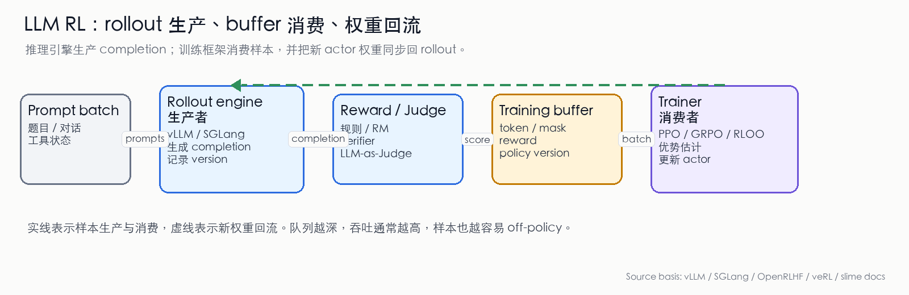

_ 1：LLM RL /。Rollout engine  completion，reward/verifier/judge ，training buffer  token、mask、reward  policy version  batch，trainer  batch  actor  rollout engine。，。（ vLLM、SGLang、OpenRLHF、veRL、slime  [^vllm_rlhf][^sglang_rl][^openrlhf_readme][^verl_readme][^slime_readme]）_

rollout engine ：

- token ids： token ， loss  token 
- attention mask / response mask： prompt、response、padding 
- finish reason：、、 stop token，
- sampling metadata： temperature、top-p、top-k、seed， prompt 
- policy version： actor 
-  logprob： token 。 old logprob，，/ kernel 

，；LLM RL  rollout engine 。

### 1.2 /rollout ：

LLM serving  API 。LLM serving  LLM RL rollout ，：

|        |  serving                                      | RL rollout engine                                     |
| ---------- | ------------------------------------------------- | ----------------------------------------------------- |
|    |  SLA                                    |                                 |
|    |                                   | trainer  prompt， prompt  |
|    |                                     | 、、 CoT、                  |
|    |                                   | ，                        |
|  |                                   | token、mask、logprob、            |
|    | p50/p99 latency， | tokens/s、samples/s、、GPU              |

GRPO  `num_generations=8`  `16`  prompt 。、、：， decode。 batch  completion ；“”，。

### 1.3 /rollout ：Prefill、decode、KV cache 

LLM ：

- **Prefill**： prompt， KV cache。，prompt 。
- **Decode**： token  response。 memory bandwidth ，。

，prefill ；decode  token  token 。

RL rollout ：

1. ****。 prompt  system prompt、few-shot 、，。Prefix cache  prefill 。
2. ****。 token， token。batch  rollout batch。
3. **KV cache **。KV cache ，、head 、、。，，。
4. ****。serving  checkpoint，RL rollout  trainer 。 rollout GPU ；。

vLLM  PagedAttention  KV cache  block ，， [^vllm][^vllm_blog]。

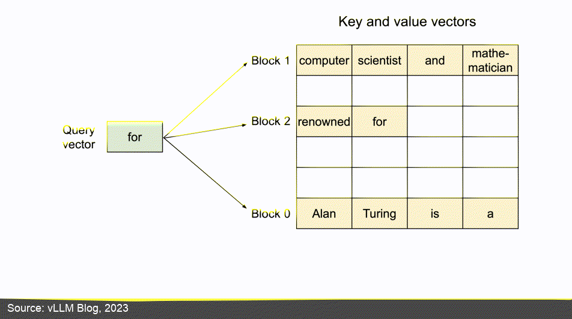

_ 2：vLLM  PagedAttention 。 LLM RL ，rollout  KV cache 、。（：vLLM  [^vllm_blog]）_

SGLang ：RadixAttention ，router/gateway ，PD disaggregation  prefill  decode ，RL 、pause generation、deterministic inference  [^sglang_rl][^sglang_pd][^sglang_router]。

### 1.4 /rollout ：

 LLM RL ，rollout engine 。

**，。**  prompt ， prompt 。 `generate`， prefill、decode、padding、stop condition  batch 。

**，KV cache 。** PagedAttention、prefix caching、RadixAttention、chunked prefill、KV eviction  `tokens/s` 。 RL ，prompt ， cache 。

**，。** RL rollout ， batch。。、early stop、、partial batch return、。

**，。** Trainer  actor ，rollout engine 。、FSDP/Megatron 、LoRA adapter、GPU 、sleep/wake、pause/resume generation。vLLM  RLHF  sleep mode、 [^vllm_rlhf][^vllm_sleep]。

**，。** rollout ，。 on-policy ，；，， staleness（）、importance sampling（）、KL 。“”。

### 1.5 /rollout ：vLLM  SGLang

vLLM  SGLang  LLM RL  rollout engine，：

|    |                                                                           |  RL rollout                                         |
| ------ | ------------------------------------------------------------------------------------- | ------------------------------------------------------------- |
| vLLM   | PagedAttention、continuous batching、、prefix caching、sleep mode、RLHF   |  rollout engine， OpenRLHF、veRL  |
| SGLang | RadixAttention、structured generation、router/gateway、PD disaggregation、RL  | 、、MoE、SGLang-native          |

OpenRLHF  Ray + vLLM + DeepSpeed；veRL  vLLM、SGLang、HF Transformers  rollout ；slime  SGLang  rollout 。，vLLM/SGLang ，TRL/OpenRLHF/veRL/slime 。

### 1.6 /：TRL 

TRL（Transformer Reinforcement Learning） HuggingFace  RL  [^trl]。 DPO（ 2 ） GRPO（ 9 ） TRL 。：TRL —— Ray ， rollout engine  trainer ， GPU  weight sync。 DPO/PPO/GRPO/REINFORCE++  `DPOTrainer`、`GRPOTrainer`  Trainer ， GPU  [^trl]。

 TRL  OpenRLHF/veRL/slime ：

```
 completion → reward/verifier  → Trainer  loss → 
```

 rollout workers， buffer queue， weight sync。 Python 。——。，。

TRL ：(1) —— reward 、 loss 、；(2) —— GPU  SFT/DPO/GRPO 。、rollout ， OpenRLHF/veRL/slime 。

ms-swift（ModelScope Swift） TRL ， [^msswift]。 SFT/DPO/GRPO/RLHF  CLI ， ModelScope Hub ， ModelScope 。、。

|      |         |         |       |                         |
| -------- | ----------- | ----------------- | ------------- | ------------------------------- |
| TRL      | HuggingFace |  / accelerate |  ~  | 、、    |
| ms-swift | ModelScope  |  /      |  ~  | 、    |
| OpenRLHF | Ray + vLLM  | Ray           |       |  PPO/GRPO       |
| veRL     |   | FSDP / Megatron   |       | 、 rollout  |
| slime    | Megatron    | Megatron + SGLang |     |  MoE、 rollout    |
| Miles    | Megatron    | Megatron + SGLang |     |  MoE          |

### 1.7 /：OpenRLHF、veRL、slime

OpenRLHF、veRL、slime 。 vLLM  SGLang  rollout，。，、、、：

- Rollout workers：， vLLM、SGLang 
- Reward/Judge workers：，、、LLM-as-Judge 
- Training workers： PPO/GRPO/RLOO/REINFORCE++  loss，
- Buffer/Queue：，，
- Weight sync： trainer  rollout 

PPO/GRPO  loss、；，：

|                 |                                                            |
| ------------------- | ---------------------------------------------------------------------- |
| Rollout plane       | ，、、、、                   |
| Reward plane        | 、RM、Judge  verifier，            |
| Training plane      |  DeepSpeed、FSDP、Megatron-LM ， |
| Data / Weight plane | 、、、                   |

HybridFlow  DeepSpeed-Chat、OpenRLHF、NeMo-Aligner  HybridFlow：parallelism（）、actor weights（actor ）、model placement（ GPU ） execution pattern（）[^hybridflow]。

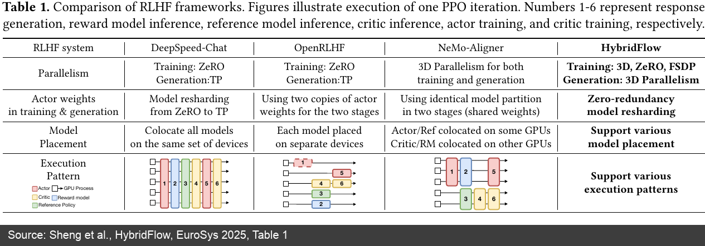

_ 3：HybridFlow  RLHF 。OpenRLHF  actor weights /；HybridFlow  zero-redundancy model resharding  flexible placement。（：HybridFlow  [^hybridflow]）_

### 1.8 /：OpenRLHF  Ray + vLLM + DeepSpeed

OpenRLHF  README  Ray + vLLM ：Ray  worker  GPU ，vLLM  rollout ，DeepSpeed  Actor/Critic/Reward/Reference ，Transformers ， NCCL / CUDA IPC  [^openrlhf][^openrlhf_readme]。

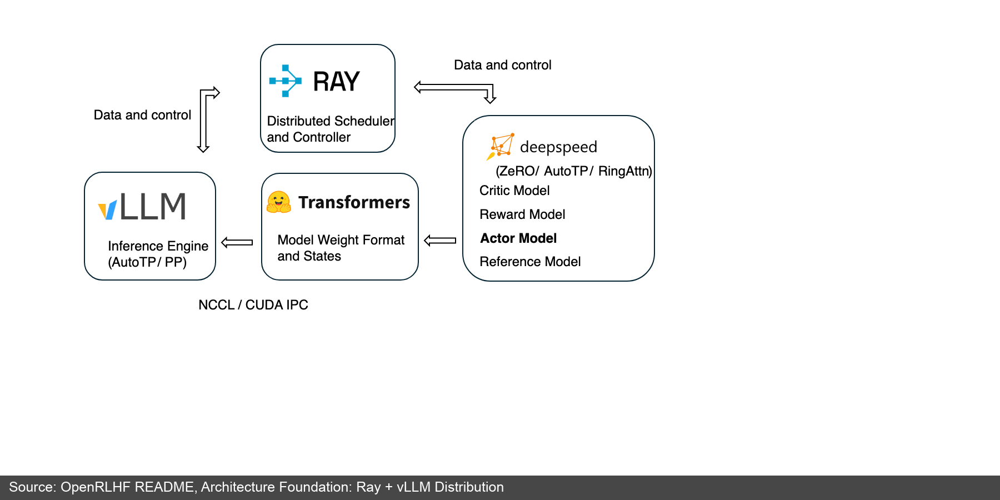

_ 4：OpenRLHF README  Ray + vLLM 。 LLM RL ：、、、、GPU 。（：OpenRLHF README [^openrlhf_readme]）_

 4 ：

- Ray  Actor、Critic、Reward、Reference、vLLM engine  GPU 
- vLLM ， rollout 
- DeepSpeed 
- Transformers 
- NCCL / CUDA IPC  GPU 

OpenRLHF 。 colocated “ GPU”，async “”。

|                       |                                            |                                          |                               |
| ------------------------- | -------------------------------------------------- | ------------------------------------------------ | --------------------------------- |
| Hybrid Engine / colocated | `--train.colocate_all`、`--vllm.enable_sleep`      |  GPU ，        | ， rollout  |
| Async Training            | `--train.async_enable`、`--train.async_queue_size` | rollout  training ，   | ， off-policy       |
| Async + Partial Rollout   | `--train.partial_rollout_enable`                   |  vLLM pause/resume， | in-flight     |

： GPU、 on-policy、。OpenRLHF 。 colocated ； async； off-policy ， partial rollout  [^openrlhf_async]。

### 1.9 /：veRL  HybridFlow 

veRL  HybridFlow 。 single-controller（）、 model engine / rollout engine， rollout  training  [^hybridflow][^verl_readme]。

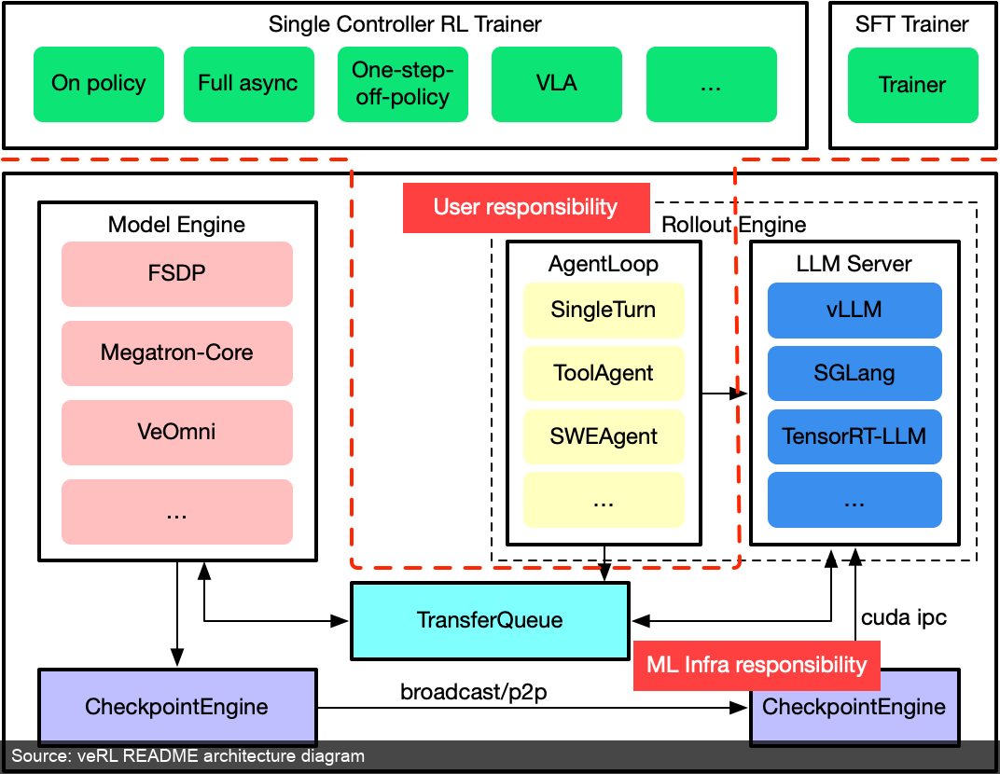

_ 5：veRL README 。 TransferQueue、Rollout Engine、Model Engine  CheckpointEngine  LLM RL 、、。（：veRL README [^verl_readme]）_

 5  veRL  LLM RL 。Rollout engine  vLLM、SGLang  TensorRT-LLM；Model engine  FSDP、Megatron-Core ；TransferQueue ；CheckpointEngine 。

veRL  RL  worker。README  hybrid-controller programming model、flexible device mapping， FSDP/FSDP2、Megatron-LM、vLLM、SGLang、HF Transformers  LLM infra  [^verl_readme]。： GPU ，rollout 。：

-  FSDP  Megatron 
-  vLLM、SGLang  HF Transformers
- rollout、reference logprob、actor update、critic update 
- 、off-policy、/

 OpenRLHF “Ray + vLLM + DeepSpeed  RLHF ”，veRL  RL 。、 rollout engine、 reward、 VLM/multi-turn/tool calling，。

### 1.10 /：slime  Megatron + SGLang + Data Buffer

slime  RL scaling。 README ： Megatron + SGLang ， server-based engine  rollout [^slime_readme]。 Megatron ，SGLang  rollout 。

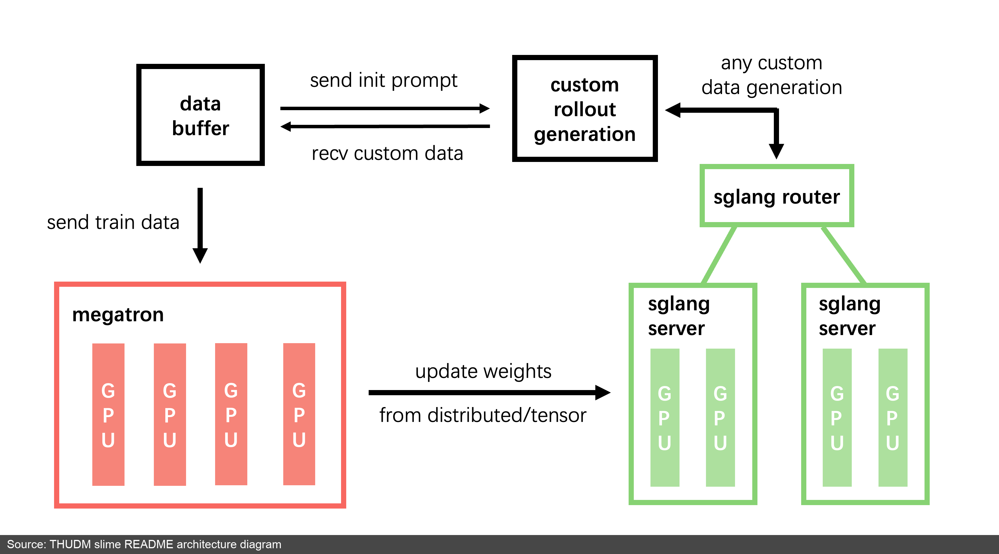

_ 6：slime README 。 Megatron， SGLang server/router， data buffer  prompt、rollout 。（：slime README [^slime_readme]）_

slime ：

- **training (Megatron)**： Data Buffer ， rollout 
- **rollout (SGLang + router)**：， reward/verifier ， Data Buffer
- **data buffer**： prompt 、 rollout 

 OpenRLHF / veRL ，slime  SGLang ，。slime ： server  SGLang，SGLang  `--sglang-*` ， `--debug-rollout-only`  rollout  [^slime_intro]。 Megatron ， TP/PP/EP/CP ， `--debug-train-only`  [^slime_intro]。

slime README ：APRIL  rollout ；TritonForge、RLVE、P1  slime 、 [^slime_readme]。：rollout engine、training backend、data buffer、。 Agentic RL 、， B.2 。

slime  release note ：RL  GPU ， decode ； inference batch  off-policy  [^slime_release]。，slime  KV cache 、MoE fp8 rollout、DeepEP、Megatron offload、NCCL group 。 PPO loop ， RL 。

Miles（[radixark/miles](https://github.com/radixark/miles)） slime ， LMSYS  [^miles_blog]。 slime  Megatron + SGLang ， MoE  RL。slime ，Miles 、， [^miles_readme]。

### 1.11 LLM RL 

LLM RL “ rollout”。，、 verifier，。

|               |      |                                     |                                |                                                       |
| ----------------- | -------- | --------------------------------------- | -------------------------------------- | ------------------------------------------------------------- |
| /rollout  | vLLM     |  LLM rollout engine                 | token / completion                     | KV cache、continuous batching、 decode、sleep/weight sync |
| /rollout  | SGLang   |  RL  rollout engine | token / completion / structured output | RadixAttention、router、PD disaggregation、           |
| /     | OpenRLHF | Ray + vLLM + DeepSpeed        | rollout batch                          | PPO/GRPO/RLOO 、colocated/async                   |
| /     | veRL     |  RL               | sample stream / rollout batch          | rollout、model engine、TransferQueue、checkpoint          |
| /     | Seer     | ：        | rollout batch                          | divided rollout、context-aware scheduling、speculative decode |
| /     | slime    | SGLang-native + Megatron      | data buffer / rollout batch            |  rollout、Megatron 、MoE fp8 rollout  DeepEP      |
| /     | Miles    | slime ， MoE        | data buffer / rollout batch            | 、、                        |
| /     | ms-swift | ModelScope            | rollout batch                          | SFT/DPO/GRPO/RLHF 、、 hub          |
| /     | TRL      | ，HuggingFace           | rollout batch                          | DPO/PPO/GRPO Trainer 、、         |

## 、 LLM RL：

 LLM RL 、、。： action， observation、reward， terminated/truncated “”。， CPU 、GPU  learner 。

 LLM RL / trajectory，/ trajectory 。Gymnasium  Isaac Gym ，IMPALA  Sample Factory //。

### 2.1 /：Gymnasium VectorEnv

Gymnasium ****，。 `reset()`、`step(action)`、observation、reward、terminated/truncated 。CartPole、LunarLander、Atari、MuJoCo 。

，GPU  CPU  `env.step()`。，Gymnasium ， [^gym_vec]。

```python
from gymnasium.vector import SyncVectorEnv, AsyncVectorEnv

envs = SyncVectorEnv([lambda: gym.make("CartPole-v1") for _ in range(8)])
obs, info = envs.reset()                 # shape: (8, obs_dim)
actions = policy(obs)                    #  8 
obs, rewards, terms, truncs, infos = envs.step(actions)
```

 `obs`  observation ，`terms`  `truncs` 。 8 ， 8  observation。

|              |               |                                |
| ---------------- | ----------------- | -------------------------------------- |
| `SyncVectorEnv`  |  step | ， CartPole、 Atari  |
| `AsyncVectorEnv` |  step   | step ，        |

 batch 、episode reset、。。

### 2.2 //：IMPALA

 Atari、DeepMind Lab、ViZDoom、MuJoCo ，“”“”。 learner  GPU ， learner 。

 RL  Actor  Learner：Actor  trajectory，Learner 。

IMPALA 。 Actor  trajectory， Learner；Actor ，， Learner  GPU  batch。 Actor ，IMPALA  V-trace  off-policy ；V-trace “”， [^impala]。：**，，**。

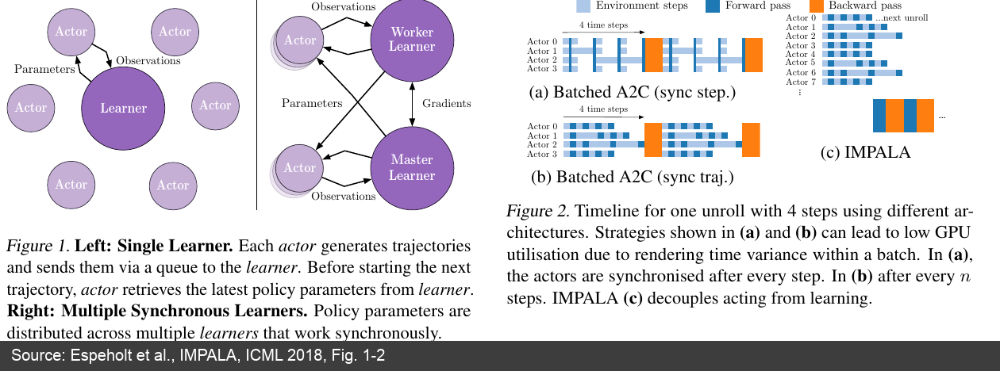

_ 7：IMPALA  Actor-Learner 。 Actor  Learner ； IMPALA  Actor ， acting  learning 。（：IMPALA  [^impala]）_

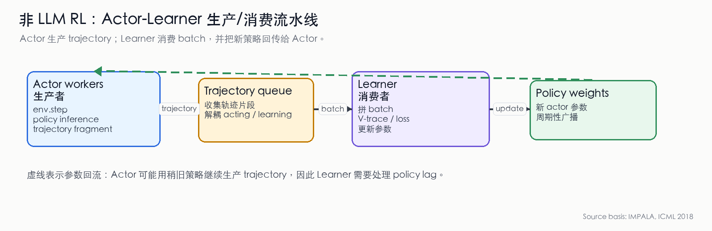

_ 8：IMPALA Actor-Learner /。Actor  trajectory ，Learner  batch ； Actor。， policy lag。（ IMPALA  [^impala] ）_

### 2.3 //：Sample Factory

Sample Factory  Actor-Learner ： Actor-Learner、、 Python ， Atari/3D  100K+ fps（） [^sf]。，：

- Rollout worker：CPU ，，
- Policy worker：GPU  action generation， observation  forward batch
- Learner：， GPU 

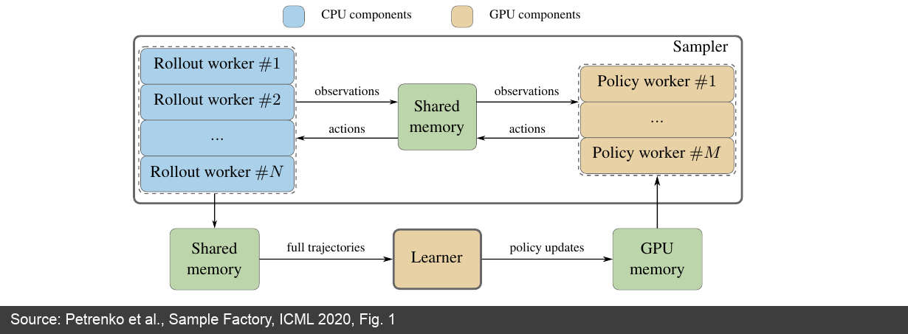

_ 9：Sample Factory 。、、， FIFO queue 。（：Sample Factory  [^sf]）_

：observation  rollout worker  shared memory  policy worker，action  rollout worker； trajectory  learner； GPU ， policy worker 。

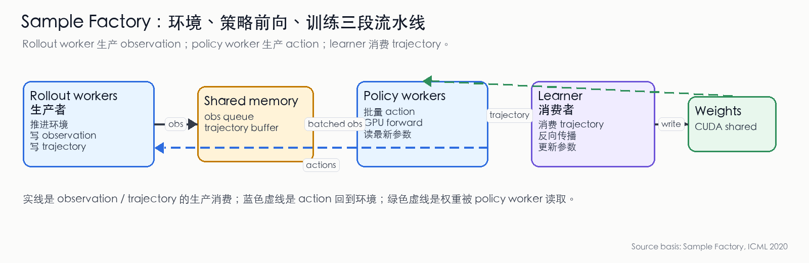

_ 10：Sample Factory /。Rollout workers  observation  trajectory；policy workers  observation  action；Learner  trajectory 。 Python 。（ Sample Factory  [^sf] ）_

### 2.4 /：Isaac Gym GPU 

：， CPU  GPU 。

NVIDIA Isaac Gym  GPU ，， CPU  GPU  [^isaac]。

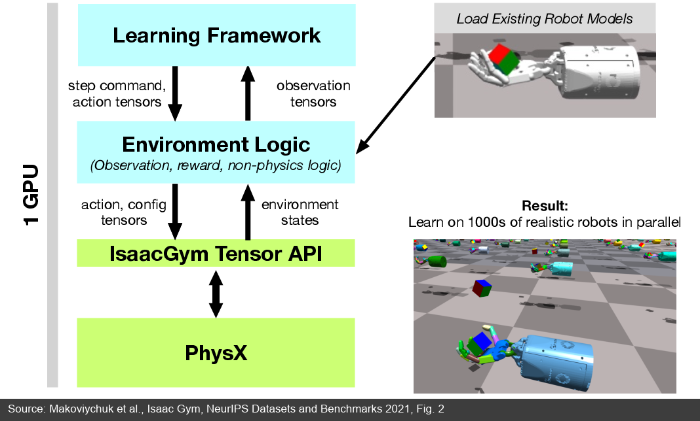

_ 11：Isaac Gym  GPU pipeline。Learning Framework、Environment Logic、IsaacGym Tensor API  PhysX  GPU tensor 、， CPU/GPU 。（：Isaac Gym  [^isaac]）_

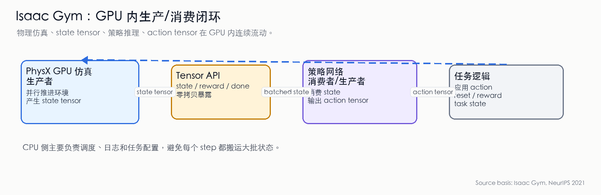

_ 12：Isaac Gym  GPU /。PhysX  GPU  state tensor， state tensor  action tensor， action 。 step  CPU/GPU 。（ Isaac Gym  [^isaac] ）_

```
：  CPU  × 64  → GPU 
Isaac Gym： GPU  × 4096  + GPU 
```

|      | CPU  (MuJoCo × 64) | GPU  (Isaac Gym × 4096) |
| -------- | ---------------------- | --------------------------- |
|  | ~10K fps               | ~1M fps                     |
|  | CPU→GPU            |                       |
|  |            | 、          |

### 2.5  LLM RL 

 LLM RL “”。， transition、episode  trajectory。

|           |                                           |                   |              |                                  |
| ------------- | --------------------------------------------- | --------------------- | -------------------- | ---------------------------------------- |
| / | Gymnasium VectorEnv                           | / | transition / episode | Python `env.step()`                      |
| / | IMPALA Actor                                  |     | trajectory           | Actor 、、policy lag         |
| / | IMPALA Learner                                |           | trajectory batch     | Learner 、、V-trace      |
| / | Sample Factory rollout worker / policy worker |     | trajectory buffer    | CPU rollout、GPU policy worker、 |
| / | Sample Factory Learner                        |       | trajectory batch     | learner 、           |
| / | Isaac Gym                                     | GPU       | GPU tensor state     | CPU/GPU            |

## 、：

LLM RL ：**，， GPU **。 GRPO ， step ， loss 。 GPU ， rollout GPU 。，。

 GRPO step ：

```
①  rollout batch      ← ，
②  reward / advantage
③  actor   ← ，
④  rollout
```

：

|      |                                         |        |                           |
| -------- | ----------------------------------------------- | -------------- | --------------------------------- |
|  |  GPU，                        |              | 、、 on-policy  |
|  |  GPU，rollout  training           | ， | GPU         |
|  | rollout GPU  training GPU ， buffer |              |                     |

：，，。，。 GPU ， FSDP  vLLM ，。 GPU，。

 RL ：rollout GPU ， token、mask、reward、policy version  buffer；training GPU  buffer ； rollout engine。

```
Rollout GPU:   [ b0] [ b1] [ b2] [ b3] ...
                   ↓         ↓         ↓
Buffer:          [b0]      [b1]      [b2]
                   ↓         ↓         ↓
Training GPU:       [ b0] [ b1] [ b2] ...
                       ↑         ↑
                 weight sync weight sync
```

：****，****。

### 

Trainer  actor ，rollout engine 。：

|                  |      |                        |
| -------------------- | ------------ | -------------------------- |
| NCCL         |      | ， GPU     |
|              |      |          |
| GPU          |      |              |
|  LoRA adapter  | adapter  | ， LoRA  |
|  checkpoint  |          | ，           |

 LoRA adapter，：rollout  adapter，。 LoRA + 。

，rollout engine 。：、、、 batch 。，；，。

### 

，。 on-policy ；，。

|              |                                   |                      |
| ---------------- | ------------------------------------- | ------------------------ |
|        |  policy version， | ，     |
|  buffer  |  batch              |  staleness     |
|    |           | ， |
|          |  +  +         |          |

： buffer ，； policy version； KL、clip  truncated importance sampling 。，“”，、 [^async_landscape]。

## 、：

RL 。PPO  Actor、Critic、Reference、Reward Model； GRPO  Critic， actor、reference、rollout engine、reward/verifier 。， GPU 。

### 

|           |                   |                      |                 |
| ------------- | ----------------------- | ---------------------------- | ----------------------- |
| DP    |  GPU  batch |  AllReduce               |         |
| TP    |             |  forward/backward  | ， NVLink |
| PP  |             |  stage       |             |
| EP    | MoE  GPU  | token              | MoE                 |

70B  DP + TP + PP ；MoE  EP。TP ，PP ，DP  batch 。

### FSDP  ZeRO

“”，FSDP  ZeRO “”。

**FSDP（Fully Sharded Data Parallel）** 、、 GPU ，。 PyTorch ，。

**DeepSpeed ZeRO** 、、。ZeRO-3 ，，。

，FSDP / ZeRO  TP / PP ：，。

###  RL 

|       |           |                                               |
| --------- | ------------- | ------------------------------------------------- |
| BF16      |           | ， FP16                         |
| FP16      |           | ， loss scaling                 |
| FP32      |       | 、                                  |
| FP8       | / | ，                  |
| INT8/INT4 |           |  serving / rollout ， |

RL  rollout  training ：rollout ， KV cache、；training ，、。 GPU ，； GPU，。

：

|                    |                                       |       |
| ---------------------- | ----------------------------------------- | ----------- |
| Reference      | Reference ， Actor  | PPO / GRPO  |
| LoRA Rollout           | rollout  + adapter              | LoRA  |
| Gradient Checkpointing |                         |   |
|      |  padding  rank                |     |

MoE  PRM 。MoE 、/；PRM  step-level scoring GPU， reward  [^deepseek_v3]。

## 

|                                   |                                                 |   | /                                | /                           |
| ----------------------------------------- | ------------------------------------------------------- | --------- | -------------------------------------------- | --------------------------------------- |
| LLM RL                                |                                       | LLM RL    | vLLM / SGLang                                | TRL / OpenRLHF / veRL                   |
| 7B-70B LLM PPO/GRPO/RLOO                  | rollout、reward、training、buffer、weight sync  | LLM RL    | vLLM / SGLang                                | OpenRLHF / veRL / slime                 |
| CartPole / LunarLander /      |                                       |  LLM RL | Gymnasium VectorEnv                          |  PPO/DQN                    |
| Atari / ViZDoom / DeepMind Lab  |  CPU 、policy forward、learner    |  LLM RL | IMPALA Actor / Sample Factory rollout worker | IMPALA Learner / Sample Factory Learner |
| 、、              |                       |  LLM RL | Isaac Gym                                    | PPO/SAC  learner                      |

 LLM RL。LLM RL /rollout ， reward、training、buffer、weight sync ； LLM RL 。，。

： LLM RL  LLM RL；；、； FSDP、ZeRO、TP、PP、EP 。、、、，“ rollout batch”， **[B.2 Agentic RL ](./agentic-rl-infra)**。

## 

[^gym_vec]: Gymnasium Documentation, [Vector Environments (SyncVectorEnv / AsyncVectorEnv)](https://gymnasium.farama.org/api/vector/).

[^impala]: Espeholt L, Soyer H, Munos R, et al. [IMPALA: Scalable Distributed Deep-RL with Importance Weighted Actor-Learner Architectures](https://proceedings.mlr.press/v80/espeholt18a.html), ICML 2018.

[^sf]: Petrenko A, Huang Z, Kumar T, Sukhatme G S, Koltun V. [Sample Factory: Egocentric 3D Control from Pixels at 100000 FPS with Asynchronous Reinforcement Learning](https://arxiv.org/abs/2006.11751), ICML 2020.

[^isaac]: Makoviychuk V, Wawrzyniak L, Guo Y, et al. [Isaac Gym: High Performance GPU Based Physics Simulation For Robot Learning](https://research.nvidia.com/labs/srl/publication/makoviychuk-2021-isaac/), NeurIPS 2021 (Datasets and Benchmarks).

[^vllm]: Kwon W, Li Z, Zhuang S, et al. [Efficient Memory Management for Large Language Model Serving with PagedAttention](https://arxiv.org/abs/2309.06180), 2023. (vLLM / PagedAttention)

[^vllm_blog]: vLLM Team, [vLLM: Easy, Fast, and Cheap LLM Serving with PagedAttention](https://vllm.ai/blog/vllm), 2023.

[^vllm_rlhf]: vLLM Documentation, [Reinforcement Learning from Human Feedback](https://docs.vllm.ai/en/stable/training/rlhf/), 2026.

[^vllm_sleep]: vLLM Documentation, [Sleep Mode](https://docs.vllm.ai/en/stable/features/sleep_mode/), 2026.

[^sglang_rl]: SGLang Documentation, [SGLang for RL Systems](https://docs.sglang.io/advanced_features/sglang_for_rl.html), 2026.

[^sglang_pd]: SGLang Documentation, [PD Disaggregation](https://docs.sglang.io/docs/advanced_features/pd_disaggregation), 2026.

[^sglang_router]: SGLang Documentation, [SGLang Router](https://docs.sglang.io/advanced_features/router.html), 2026.

[^openrlhf]: OpenRLHF Team, [OpenRLHF: An Easy-to-use, Scalable and High-performance RLHF Framework](https://arxiv.org/abs/2405.11143), 2024. [GitHub](https://github.com/OpenRLHF/OpenRLHF).

[^hybridflow]: Sheng G, Zhang C, Ye Z, et al. [HybridFlow: A Flexible and Efficient RLHF Framework](https://arxiv.org/abs/2409.19256), 2024. [veRL GitHub](https://github.com/verl-project/verl).

[^openrlhf_readme]: OpenRLHF Project, [Architecture Foundation: Ray + vLLM Distribution](https://github.com/OpenRLHF/OpenRLHF#architecture-foundation-ray--vllm-distribution), README.

[^openrlhf_async]: OpenRLHF Documentation, [Async Training & Partial Rollout](https://openrlhf.readthedocs.io/en/latest/async_training.html), 2026.

[^verl_readme]: veRL Project, [README and architecture diagram](https://github.com/verl-project/verl), 2026.

[^slime_readme]: THUDM slime Project, [slime: An LLM post-training framework for RL Scaling](https://github.com/THUDM/slime), README.

[^slime_intro]: slime Documentation, [slime： RL Scaling  SGLang-Native ](https://thudm.github.io/slime/zh/blogs/introducing_slime.html), 2025.

[^slime_release]: slime Documentation, [v0.1.0: Redefining High-Performance RL Training Frameworks](https://thudm.github.io/slime/blogs/release_v0.1.0.html), 2025.

[^async_landscape]: HuggingFace Blog, [Async RL Training Landscape — 16 Open-Source Libraries Compared](https://huggingface.co/blog/async-rl-training-landscape), 2026.

[^pytorch_posttraining]: PyTorch Blog, [A Primer on LLM Post-Training](https://pytorch.org/blog/a-primer-on-llm-post-training/), 2025.

[^deepseek_v3]: DeepSeek-AI, [DeepSeek-V3 Technical Report](https://arxiv.org/abs/2412.19437), 2024.

[^miles_readme]: radixark Miles Project, [Miles: Enterprise-ready RL Framework for LLM/VLM Post-Training](https://github.com/radixark/miles), README, 2025.

[^miles_blog]: LMSYS Blog, [Introducing Miles](https://lmsys.org/blog/2025-11-19-miles/), 2025.

[^msswift]: ModelScope Swift Project, [ms-swift: ModelScope Framework for LLM/AIGC Training & Inference](https://github.com/modelscope/ms-swift), 2025.

[^trl]: HuggingFace TRL Project, [TRL: Transformer Reinforcement Learning](https://github.com/huggingface/trl), 2025.
