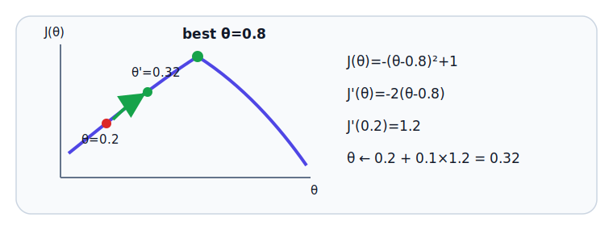

# E.3 

，——，。：""，""，。

。，、、，、Taylor 、PPO  GRPO 。

## 

|                                                           |                               |                |
| ------------------------------------------------------------- | ------------------------------------- | ------------------------------ |
| [E.3.1 、](./calculus-basics)               |  →  →  →          |        |
| [E.3.2 ](./calculus-policy-gradient)          | log  →  →     | “” |
| [E.3.3 ：PPO  Adam](./calculus-ppo)               |  →  →             |      |
| [E.3.4 ：log trick  Taylor](./calculus-derivations) |  → Taylor  →  |  PPO   |
| [E.3.5 ](./calculus-advanced-formulas)            | PG、DQN、GAE、PPO、GRPO       |  RL            |
| [E.3.6 、](./calculus-formulas-exercises)       |  →  →                 |                  |
