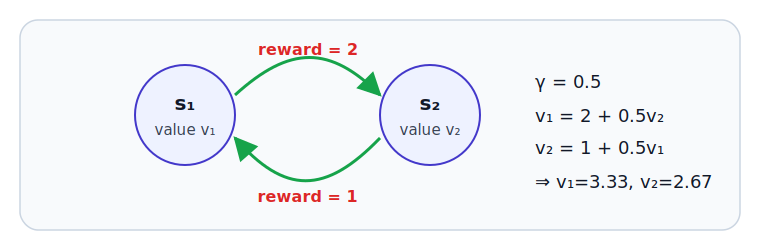

# E.1 

 3  $V(s) = R(s) + \gamma\sum_{s'}P(s'|s,a)V(s')$，。：、、。E.1 ，。

## 

|          |                       |            |                   | 3      |
| ------------ | ------------------------- | ------------------------ | ------------------------- | -------------- |
|  | 1000  = 1000  | 、、   | **v** = (I − γP)⁻¹**r**   | DP   |
|  |       | 、、     | v̂(s) = **w**ᵀ**x **(s)    | DQN  |
|    | //    | 、、 | ρ(γP) ≤ γ < 1，ΔθᵀFΔθ ≤ δ | PPO  |

## 

|                                                            |                                    |              |
| -------------------------------------------------------------- | ---------------------------------------------- | -------------------- |
| [E.1.1 、](./linear-algebra-basics)              | 、？       | （） |
| [E.1.2 ](./linear-algebra-bellman)         | 1000 ？            |          |
| [E.1.3 、](./linear-algebra-function-approx) | ？？ |          |
| [E.1.4 、](./linear-algebra-advanced)      | ？？           |            |
| [E.1.5 ](./linear-algebra-formulas-exercises)    |  3                             |              |

 E.1.1  E.1.4， E.1.5 。，。
