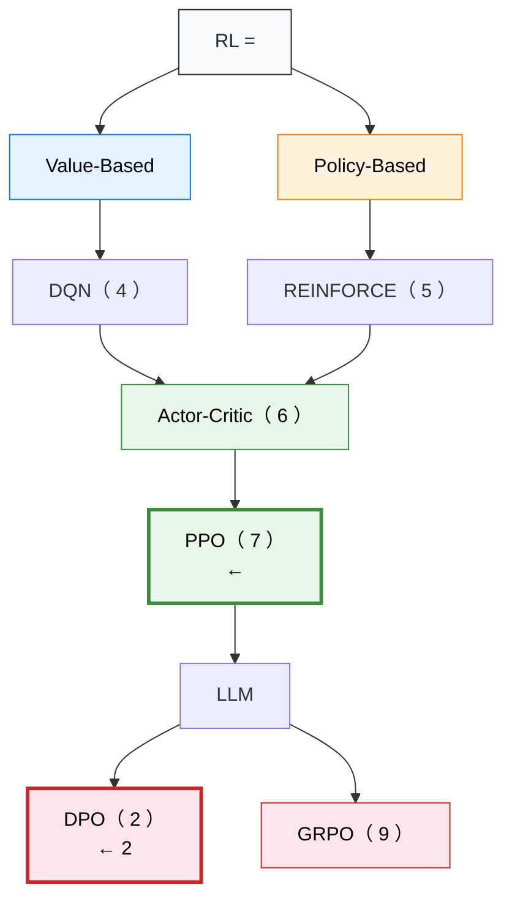

# 1.2 、、Value Loss  KL

> 📁 ****：[1-ppo_cartpole.py](https://github.com/letslego/hands-on-modern-rl/blob/main/code/chapter01_cartpole/1-ppo_cartpole.py) · [2-pytorch_ppo.py](https://github.com/letslego/hands-on-modern-rl/blob/main/code/chapter01_cartpole/2-pytorch_ppo.py) · [requirements.txt](https://github.com/letslego/hands-on-modern-rl/blob/main/code/chapter01_cartpole/requirements.txt)

## 

，
。

（2026-04-21，`code/chapter01_cartpole/swanlog/` ）：

```
------------------------------------------------------------
    1/20 | :  98 | :   20.8 | KL: 0.0047 | clip%: 6.2%
    7/20 | :  10 | :  196.5 | KL: 0.0027 | clip%: 6.0%
   13/20 | :   4 | :  410.0 | KL: 0.0075 | clip%: 10.6%
   18/20 | :   4 | :  500.0 | KL: 0.0050 | clip%: 4.5%
   19/20 | :   4 | :  500.0 | KL: 0.0041 | clip%: 4.0%
   20/20 | :   4 | :  500.0 | KL: 0.0005 | clip%: 0.0%
------------------------------------------------------------
！20 : 500.0 +/- 0.0
```

。
：
****，""；
****，。
，。

---

## 

 PPO ，
，。

### 

__（mean reward）。
 CartPole ， 1  +1 ，
， 500 。
"" `ep`，
 **episode（ / ）**：
 `reset` ，、， 500 。

（ 480 、 200 ），
，
 `ep_rew_mean`（_rollout episode reward mean_），
。

，
 SB3 PPO（） PyTorch PPO（）
 CartPole ：


<div style="text-align: center; font-size: 0.9em; color: var(--vp-c-text-2); margin-top: -10px; margin-bottom: 20px;">
  <em> 1-3： 20  500， SB3 PPO、 PyTorch PPO。 195 。</em>
</div>

：

1. **（0 ~ 5K Total Timesteps）**：
    `20 ~ 50` ，
   **（random policy），
   。
2. **（5K ~ 25K Total Timesteps）**：
    100  300 ，
    195 （），
   。
   PyTorch PPO（），
   。
3. **（25K Total Timesteps ）**：
    `400 ~ 500` ，
    `500`。
    `500.0 +/- 0.0` 。

：**，。**
，
。

### 

__（policy entropy）。
，：
（），
（）。

****，
""——
，。
 0，
，
**（premature convergence）。


<div style="text-align: center; font-size: 0.9em; color: var(--vp-c-text-2); margin-top: -10px; margin-bottom: 20px;">
  <em> 1-4：，""——。</em>
</div>

### 

PPO  _Critic_ ，
**——
"，"。
__（value loss） Critic 。

，Critic （value_loss ）。
，Critic （value_loss ）。

：
**value_loss 。**
 Critic 。
。
 value_loss ，
 Critic 。


<div style="text-align: center; font-size: 0.9em; color: var(--vp-c-text-2); margin-top: -10px; margin-bottom: 20px;">
  <em> 1-5：Value Loss ， Critic 。</em>
</div>

### KL 

PPO ""。
，：
_ KL _（approximate KL divergence）**（clip fraction）。

KL 。
KL = 0 ，KL 。
，KL  `0.001 ~ 0.02` ；
 `0.03` ，。

，
 PPO 。
""。
 `5% ~ 15%`，
， `30%` 。


<div style="text-align: center; font-size: 0.9em; color: var(--vp-c-text-2); margin-top: -10px; margin-bottom: 20px;">
  <em> 1-6：Value Loss 、Entropy 、KL  0.01、Clip Fraction  10% —— PPO 。</em>
</div>

：
**Value Loss 、Entropy 、
KL 、Clip Fraction **——
 PPO""。

### SB3 

 `1-ppo_cartpole.py`（Stable-Baselines3 ），
：

```
-----------------------------------------
| time/              |                  |
|    fps             | 5342             |
|    iterations      | 1                |
|    time_elapsed    | 3                |
|    total_timesteps | 2048             |
| train/             |                  |
|    entropy_loss    | -0.683           |
|    learning_rate   | 0.0003           |
|    loss            | 0.0124           |
|    policy_gradient_loss | -0.0187     |
|    value_loss      | 8.2741           |
-----------------------------------------
```

： `total_timesteps` ，
 `value_loss`  `entropy_loss` 。
SB3  80K ，
 `500.0 +/- 0.0`，
 5  `500.0`。

，：

```bash
swanlab watch swanlog
```

### 

，，
。

<details>
<summary><strong>：？</strong></summary>

。
 1  `20.8`，
。
CartPole-v1  500 （ 500），
 20 。

</details>

<details>
<summary><strong>：，？</strong></summary>

，
。
，
：
 9  `319.0`， 10  `276.9`，
 11  `238.9`，
 13  `410.0`。
，
，。

</details>

<details>
<summary><strong>： <code>total_timesteps</code>  5000，？</strong></summary>

，
" 500 "。
，
 13 。
，
 `100 ~ 300` ——
，。

</details>

> ****： `total_timesteps`  5000、10000、50000，
> ，
> """"。

---

## ：

""。
 SwanLab ****，
、。
，。

，SwanLab ，
：

|                     |                    |             |
| ----------------------- | ---------------------- | --------------- |
| **Rollout（）** | `ep_rew_mean`          |     |
|                         | `ep_len_mean`          |     |
| **Train（）**   | `value_loss`           | Critic  |
|                         | `entropy_loss`         |       |
|                         | `policy_gradient_loss` |         |
|                         | `approx_kl`            |     |
|                         | `clip_fraction`        |     |
|                         | `explained_variance`   | Critic  |
|                         | `learning_rate`        |       |
|                         | `loss`                 | （SB3）   |
|                         | `clip_range`           |         |
|                         | `n_updates`            |     |
| **Time（）**    | `total_timesteps`      |     |
|                         | `iterations`           | PPO     |
|                         | `fps`                  | （SB3） |
|                         | `time_elapsed`         | （SB3） |

 SB3 PPO  PyTorch PPO
 CartPole 
（ 80K Total Timesteps、40 ）：


<div style="text-align: center; font-size: 0.9em; color: var(--vp-c-text-2); margin-top: -10px; margin-bottom: 20px;">
  <em> 1-7：SB3 PPO  PyTorch PPO  CartPole ， 500 。</em>
</div>

### Episode Reward（）

__（episode reward）。
 CartPole ， +1，
。
SwanLab  `rollout/ep_rew_mean`，
 _Rollout_（）
：

$$G = \sum_{t=0}^{T} r_t = T$$

 $T$ 。
 CartPole-v1 ，$T$  500。

，
 25K~80K Total Timesteps  500 ：
PyTorch PPO（） 25K ，
SB3 PPO（） 80K  500。
， PyTorch 。

。
：

- ****：。
  ，。
- ****：
  """"，；
  ，。
- ****：
  ，
  。
  。

，：

|                  |                    |  |
| ------------------------ | -------------------------- | -------- |
|  0             | ，       |      |
| （ 20 ） | ， |      |
|            | ， |      |
|  100   | ，     |      |

### Episode Length Mean（）

SwanLab  `rollout/ep_len_mean` 
 Rollout 。
 CartPole ，
 +1，
——
 200 ， 200。


<div style="text-align: center; font-size: 0.9em; color: var(--vp-c-text-2); margin-top: -10px; margin-bottom: 20px;">
  <em> 1-8： CartPole 。</em>
</div>

，？
****。
，：

- ****： +0.1， +10，
  。
- ****：（ -5），
  。
- ****：
  （），
  。

，
__（episode length mean）
。
。

### Entropy（）

 `entropy_loss` **（policy entropy）。
，。
，：

$$H(\pi) = -\sum_{a} \pi(a | s) \log \pi(a | s)$$

 CartPole （），：

-  $\pi(\text{}) = \pi(\text{}) = 0.5$ ，
  ，$H = \ln 2 \approx 0.69$。
-  $\pi(\text{}) = 1, \pi(\text{}) = 0$ ，
  ，$H = 0$。


<div style="text-align: center; font-size: 0.9em; color: var(--vp-c-text-2); margin-top: -10px; margin-bottom: 20px;">
  <em> 1-9： $\ln 2 \approx 0.69$ ，。</em>
</div>

，
""""。
 SwanLab  Episode Reward  Entropy，
、——
，
。

。
 0，
，
**（premature convergence）。
**（entropy regularization）
， 6 。

> ****： [2-pytorch_ppo.py](https://github.com/letslego/hands-on-modern-rl/blob/main/code/chapter01_cartpole/2-pytorch_ppo.py)，
>  SwanLab  `rollout/ep_rew_mean`  `train/entropy_loss`，
> 。

### Value Loss（）

 `value_loss`  Critic 。
Critic **（state value function）$V(s)$，
"，"。
__（value loss） Critic ：

$$\mathcal{L}_{\text{value}} = \frac{1}{|B|} \sum_{i \in B} \left(V(s_i) - G_i\right)^2$$

 $V(s_i)$  Critic  $s_i$ ，
$G_i$ ，
$B$ （batch）。


<div style="text-align: center; font-size: 0.9em; color: var(--vp-c-text-2); margin-top: -10px; margin-bottom: 20px;">
  <em> 1-10：Value Loss ，Critic 。</em>
</div>

，Critic 
（value_loss ）。
，Critic 
（value_loss ）。

：
**value_loss 。**
 Critic 。
 Episode Reward。
 value_loss ，
 Critic 。

### Explained Variance（）

__（explained variance） Critic 。
：

$$EV = 1 - \frac{\text{Var}(G - V(s))}{\text{Var}(G)}$$

 $G$ ，$V(s)$  Critic 。
：

- **EV = 1**：Critic ，。
- **EV = 0**：Critic ，。
- **EV < 0**：Critic 。


<div style="text-align: center; font-size: 0.9em; color: var(--vp-c-text-2); margin-top: -10px; margin-bottom: 20px;">
  <em> 1-11：Explained Variance  1  Critic ；。</em>
</div>

 EV （Critic ），
 EV ，
 0.9 。
：
**（ 500 ），EV **。
（variance  0），
Critic 。
 Critic ——Value Loss  0，，
 EV 。

 Value Loss ：
Value Loss ""，
Explained Variance ""。
** Critic ， Value Loss 、EV **。

### Policy Gradient Loss（）

 `policy_gradient_loss` 。
「」 PPO ：

$$\mathcal{L}_{\text{policy}} = -\min(r_t \hat{A}_t, \text{clip}(r_t, 1-\epsilon, 1+\epsilon) \hat{A}_t)$$

，
：

- ，
  （ -0.01  -0.02）。
- ，
  。


<div style="text-align: center; font-size: 0.9em; color: var(--vp-c-text-2); margin-top: -10px; margin-bottom: 20px;">
  <em> 1-12：Policy Gradient Loss ，——。</em>
</div>

### Total Loss（）

SB3  `loss` 
（ PPO ，
）。
、：

$$\mathcal{L}_{\text{total}} = \mathcal{L}_{\text{policy}} + c_1 \cdot \mathcal{L}_{\text{value}} - c_2 \cdot H(\pi)$$

 $c_1 = 0.5$（），
$c_2 = 0.01$（）。
。
——
，。
，
Total Loss 。

### Approx KL  Clip Fraction

 PPO ****。
「」：
PPO ""，
——
"？？"

**Approx KL** ，
 _KL _（Kullback-Leibler Divergence）：

$$\text{KL}(\pi_{\text{old}} \| \pi_{\text{new}}) \approx \mathbb{E}\left[\log \frac{\pi_{\text{old}}(a|s)}{\pi_{\text{new}}(a|s)}\right]$$

：KL = 0 ；
KL ，。
PPO ，
。


<div style="text-align: center; font-size: 0.9em; color: var(--vp-c-text-2); margin-top: -10px; margin-bottom: 20px;">
  <em> 1-13：SB3 PPO（） PyTorch PPO（） Approx KL  0.02 ， 0.03 ，， PPO""。</em>
</div>

**Clip Fraction** ，
 PPO 
（** $r_t$  $[1-\epsilon, 1+\epsilon]$ ）：

$$\text{ClipFrac} = \frac{1}{|B|} \sum_{i \in B} \mathbb{1}[|r_t - 1| > \epsilon]$$

""——
。
Clip Fraction 。
， 15%~20% ，
，。


<div style="text-align: center; font-size: 0.9em; color: var(--vp-c-text-2); margin-top: -10px; margin-bottom: 20px;">
  <em> 1-14：SB3 PPO  PyTorch PPO  Clip Fraction ，。</em>
</div>

|               |      |    |                                            |
| ----------------- | ------------ | ---------- | ---------------------------------------------- |
| **Approx KL**     | 0.001 ~ 0.02 | > 0.03     | ，                   |
| **Clip Fraction** | 0% ~ 20%     |  > 30% | ； |

> ****： [2-pytorch_ppo.py](https://github.com/letslego/hands-on-modern-rl/blob/main/code/chapter01_cartpole/2-pytorch_ppo.py)，
>  `clip_eps` ， `0.2`  `0.5`，。
>  Clip Fraction （，），
>  Approx KL （""，）。

### Learning Rate（）

 `learning_rate = 0.0003`  Adam **（learning rate），
：

$$\theta \leftarrow \theta - \alpha \nabla_\theta \mathcal{L}$$

（ 0.01），
，；
（ 0.000001），
，。
SB3  0.0003  CartPole 。


<div style="text-align: center; font-size: 0.9em; color: var(--vp-c-text-2); margin-top: -10px; margin-bottom: 20px;">
  <em> 1-15：SB3（）， PPO（）—— CartPole 。</em>
</div>

：
**SB3 **（ 0.0003），
** PPO **（ 0.0003  0）。
 CartPole ，
，
。
，
。

> ****： [2-pytorch_ppo.py](https://github.com/letslego/hands-on-modern-rl/blob/main/code/chapter01_cartpole/2-pytorch_ppo.py)，
>  `3e-4`  `3e-2`（ 100 ），。
> 。

### Clip Range（）

`train/clip_range`  PPO  $[1-\epsilon, 1+\epsilon]$  $\epsilon$ ，
 0.2。
**（hyperparameter），。
""——
 Clip Fraction 
（）。

### N Updates（）

`train/n_updates` ，
**（gradient update）。
，：

$$n_{\text{updates}} = \text{iterations} \times \text{epochs} \times \frac{\text{steps\_per\_rollout}}{\text{batch\_size}}$$

（10 epochs, 2048 steps, batch_size=64），
 $10 \times 2048 / 64 = 320$ 。
——
，。

### Time （）

`time/` ，
：

|               |            |                                   |
| ----------------- | -------------- | ------------------------------------- |
| `total_timesteps` |    | （） 1    |
| `iterations`      | PPO    | " → "       |
| `fps`             |    | （ SB3 ）           |
| `time_elapsed`    | （） | （ SB3 ） |

。
 `fps = 5000`  10000 ， 2 。

### Eval （）

 PPO  20 
（，），：

|                |                 |
| ------------------ | ------------------- |
| `eval/mean_reward` | 20    |
| `eval/std_reward`  | 20  |

Eval  `rollout/ep_rew_mean` ——
 Agent （），
**（deterministic policy，）。
 eval  Agent 。
 CartPole ，eval  `500.0 +/- 0.0`，
。

---

## 

### （）

|                      | SwanLab Key                  |                                                                    |                    |                          |
| ------------------------ | ---------------------------- | -------------------------------------------------------------------------- | -------------------------- | -------------------------------- |
| **Episode Reward**       | `rollout/ep_rew_mean`        | $G = \sum_{t=0}^{T} r_t$                                                   |  →         |  0 /               |
| **Episode Length**       | `rollout/ep_len_mean`        |                                                              |  Reward          |  Reward                |
| **Entropy**              | `train/entropy_loss`         | $H = -\sum_a \pi(a\|s) \log \pi(a\|s)$                                     |            |  0 /             |
| **Value Loss**           | `train/value_loss`           | $\frac{1}{\|B\|}\sum(V(s_i) - G_i)^2$                                      |                    |  /               |
| **Explained Variance**   | `train/explained_variance`   | $1 - \frac{\text{Var}(G-V)}{\text{Var}(G)}$                                |  1                     |  ≤ 0                         |
| **Policy Gradient Loss** | `train/policy_gradient_loss` | $-\min(r_t \hat{A}_t, \text{clip}(r_t, 1-\epsilon, 1+\epsilon) \hat{A}_t)$ |                  |                    |
| **Total Loss**           | `train/loss`                 | $\mathcal{L}_{\text{policy}} + 0.5 \mathcal{L}_{\text{value}} - 0.01 H$    |        |                          |
| **Approx KL**            | `train/approx_kl`            | $\mathbb{E}[\log \pi_{\text{old}}(a\|s) - \log \pi_{\text{new}}(a\|s)]$    | 0.001 ~ 0.02               | > 0.03               |
| **Clip Fraction**        | `train/clip_fraction`        | $\frac{1}{\|B\|}\sum \mathbb{1}[\|r_t - 1\| > \epsilon]$                   | 0% ~ 20%                   | > 30%                  |
| **Learning Rate**        | `train/learning_rate`        | $\theta \leftarrow \theta - \alpha \nabla \mathcal{L}$                     | SB3 ；PyTorch  |  → ； →  |

### （）

|                 | SwanLab Key            |                             |
| ------------------- | ---------------------- | ------------------------------- |
| **Clip Range**      | `train/clip_range`     |  $\epsilon$， |
| **N Updates**       | `train/n_updates`      |                 |
| **Total Timesteps** | `time/total_timesteps` |                 |
| **Iterations**      | `time/iterations`      | PPO                     |
| **FPS**             | `time/fps`             | （ SB3）          |
| **Time Elapsed**    | `time/time_elapsed`    | （ SB3）              |
| **Eval Mean**       | `eval/mean_reward`     |         |
| **Eval Std**        | `eval/std_reward`      |                   |

## 

 1 ，：

1. ** RL **：
    CartPole 。
2. ****：
    Episode Reward、Entropy、Value Loss、KL ，
   。
3. ** RL **：
   、、、——
   。
4. ** SB3 **：
    PyTorch  PPO ——
   Actor-Critic 、Rollout 、GAE 、PPO ——
    SB3 。

：

""。
，
 +1 。

## ：RL 

 CartPole  PPO。
，
。

：
" Agent ？"
：



- **Value-Based**（）：""（Q ），
  。 4  DQN。
- **Policy-Based**（）：，
  ""。
   5  REINFORCE。
-  **Actor-Critic** ——
  Actor ，Critic 。
   PPO 。
-  LLM ，
  DPO  PPO ，
  GRPO  Critic ——
  ，。

。
：
** PPO，。
 2  DPO， PPO  LLM 。**

，——
。
、、、。

## 

[^1]: Mnih, V., et al. (2013). Playing Atari with Deep Reinforcement Learning. _arXiv preprint_. [arXiv:1312.5602](https://arxiv.org/abs/1312.5602)

[^2]: Raffin, A., et al. (2021). Stable-Baselines3: Reliable Reinforcement Learning Implementations. _Journal of Machine Learning Research_, 22(268), 1-8.

[^3]: Sutton, R. S., et al. (1999). Policy Gradient Methods for Reinforcement Learning with Function Approximation. _Advances in Neural Information Processing Systems_, 12.
