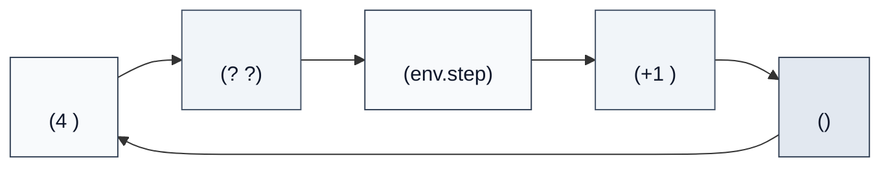

# 1.1 、、

> 📁 ****：[1-ppo_cartpole.py](https://github.com/letslego/hands-on-modern-rl/blob/main/code/chapter01_cartpole/1-ppo_cartpole.py) · [2-pytorch_ppo.py](https://github.com/letslego/hands-on-modern-rl/blob/main/code/chapter01_cartpole/2-pytorch_ppo.py) · [requirements.txt](https://github.com/letslego/hands-on-modern-rl/blob/main/code/chapter01_cartpole/requirements.txt)

， CartPole ，。，。，，。 RL ，——""（trial-and-error learning）。 20 ， Edward Thorndike ""（Law of Effect）：，。 80  Andrew Barto  Richard Sutton ，（Markov Decision Process, MDP） RL ，、、、（Sutton & Barto, 1998）。

。 CartPole ，（Silver et al., 2016）、（Levine et al., 2016） RLHF （Ouyang et al., 2022）。、、，。 CartPole，、、。

### 1.1.1 （State）：？

，CartPole  4 。， Gymnasium 。：

```python
import gymnasium as gym
import numpy as np

env = gym.make("CartPole-v1")
print(f": {env.observation_space.high}")
print(f": {env.observation_space.low}")
print(f":  ±{env.unwrapped.x_threshold}, "
      f" ±{env.unwrapped.theta_threshold_radians:.4f} rad "
      f"(≈ ±{np.degrees(env.unwrapped.theta_threshold_radians):.0f}°)")
```

：

```
: [4.8         inf 0.41887903  inf]
: [-4.8         -inf -0.41887903 -inf]
:  ±2.4,  ±0.2094 rad (≈ ±12°)
```

， 4 ：

|  |        |                    |      |
| ---- | ---------- | ------------------------------ | ---------------- |
| 0    |    | -4.8 ~ 4.8                     | -4.8 ~ 4.8       |
| 1    |    | （Gymnasium  inf） |  -3 ~ +3       |
| 2    |    | -0.4189 ~ 0.4189 rad (≈ ±24°)  | -0.21 ~ 0.21 rad |
| 3    |  | （Gymnasium  inf） |  -3 ~ +3       |

::: warning  inf？
——，。Gymnasium  `inf`。，（ reset）， **-3 ~ +3** ，""。
:::

 4 。， 4 。

，""。——，， CartPole  4 。， RL 。，（）。，，（），（Mnih et al., 2013）。——。

### 1.1.2 （Action）：？

CartPole ：。

|  |        |
| ---- | ---------- |
| 0    |  |
| 1    |  |

""，""——，。、 RL （ `Discrete` ）。，。 11 ，——，。，（ vs ）。Q-learning ，（ PPO）—— PPO 。

### 1.1.3 （Reward）：？

::: tip 

- ** → +1 **（）
- ****： ±12°， ±2.4
- ** = 500 **（CartPole-v1 ）
  :::

（±2.4  ±12°），：`env.unwrapped.x_threshold`  2.4，`env.unwrapped.theta_threshold_radians`  0.2094 rad（ 12°）。500  `env.spec.max_episode_steps` ：

```python
print(f": {env.spec.max_episode_steps}")  # : 500
```

，。Richard Sutton ""（Reward Hypothesis）：""（Sutton & Barto, 2018）。 CartPole ， +1——，。

，：**、**。 +1，。" 50 "， 23 ，。

"，"， RL 。，； RL ，，。，" 30%， 20%"，。

### 1.1.4 （Policy）：？

， RL ——**（Policy）**。

" s  a "。 CartPole ，：**"、、、，？"**

，：π(a|s)。，。，π() ≈ 0.5, π() ≈ 0.5（）；，π  π() ≈ 0.95。

```mermaid
flowchart LR
    subgraph [" (State)"]
        s1[""]
        s2[""]
        s3[""]
        s4[""]
    end

    subgraph [" π (PolicyNetwork)"]
        h1["\n64 "]
        h2["\n64 "]
    end

    subgraph [""]
        a1["π() = 0.3"]
        a2["π() = 0.7"]
    end

    s1 & s2 & s3 & s4 --> h1 --> h2 --> a1 & a2

    style  fill:#f8fafc,stroke:#334155,color:#0f172a
    style  fill:#f1f5f9,stroke:#475569,color:#0f172a
    style  fill:#e2e8f0,stroke:#334155,color:#0f172a
```

：**？**

****。，。，，RL ：

- **（Tabular Policy）**：，。，。，（ 10^170 ），。
- **（Linear Policy）**： π(a|s) = softmax(W·s + b) 。、，——""，。
- **（Neural Network Policy）**： π(a|s)。 1.1.6  4→64→64→2 。，——，。

 CartPole ，。 4  84×84×4 （Atari  [^1]），（），——，。

，。2012 ，（SIFT、SURF、HOG）， AlexNet ；RL （）（）。——、，。

，** RL ，，。**  CartPole  Atari  LLM，——：，，。

### 1.1.5 ：RL 

，：



 CartPole ，：

1. ****： 4 （、、、）
2. ****： 4 ，""""
3. ****：，
4. ****：， +1 ， 4 
5. ****：（），

 CartPole—— RL 。""""，""""，"+1 """， AI 。"4 """，""""，。

、、，。

### 1.1.6 ：SB3 ？

， CartPole ，，、、、 RL 。，—— `model.learn(total_timesteps=80000)` 。，。

SB3 ——。，（ 5 ） PPO（ 7 ）。，——，。

，，。

`model.learn()` ：** Actor-Critic 、 Rollout 、 PPO **。 PyTorch ， [2-pytorch_ppo.py](https://github.com/letslego/hands-on-modern-rl/blob/main/code/chapter01_cartpole/2-pytorch_ppo.py)。。

#### 1.1.6.1 Actor-Critic ：

 1.1.4 ， π "、"。，——（Williams, 1992）。，：。，。，""—— Actor-Critic （Sutton et al., 2000; Mnih et al., 2016）。

Actor-Critic ：

- **Actor（）**：，，。
- **Critic（）**：，——"，"。

```python
class ActorCritic(nn.Module):
    def __init__(self, obs_dim=4, act_dim=2, hidden=64):
        super().__init__()
        self.actor = nn.Sequential(
            nn.Linear(obs_dim, hidden), nn.ReLU(),
            nn.Linear(hidden, hidden), nn.ReLU(),
            nn.Linear(hidden, act_dim),
        )
        self.critic = nn.Sequential(
            nn.Linear(obs_dim, hidden), nn.ReLU(),
            nn.Linear(hidden, hidden), nn.ReLU(),
            nn.Linear(hidden, 1),
        )

    def forward(self, x):
        logits = self.actor(x)       # 
        value = self.critic(x)       # 
        return logits, value
```

Actor  Critic ****，。Actor  logits（ [0.3, 0.7]）， softmax ——" 30%， 70%"。Critic ，""。

：****。Actor  gain（0.01），（50/50），。 SB3 。

#### 1.1.6.2 （Rollout）：

，，。 **Rollout**：

```python
def collect_rollout(model, env, num_steps=2048):
    obs, _ = env.reset()
    transitions = []

    for _ in range(num_steps):
        obs_tensor = torch.FloatTensor(obs)
        with torch.no_grad():
            action, log_prob, value = model.get_action(obs_tensor)

        next_obs, reward, terminated, truncated, _ = env.step(action.item())

        transitions.append({
            "obs": obs, "action": action.item(),
            "log_prob": log_prob.item(), "value": value.item(),
            "reward": float(reward),
            "terminated": terminated,  # ，
            "truncated": truncated,    # （）
            "next_obs": next_obs if truncated and not terminated else None,
        })

        obs = next_obs
        if terminated or truncated:
            obs, _ = env.reset()

    return transitions, last_bootstrap
```

****： `terminated`（，） `truncated`（ 500 ，）。—— truncated  `terminated` ，，" 500 "，。 RL ，。

：，****：

```python
dist = torch.distributions.Categorical(logits=logits)
action = dist.sample()  # ， argmax
```

 90%， 10% 。，（1.2 ）""。

#### 1.1.6.3 GAE ：？

，PPO ：**""？** "（Advantage）"。

，""（Temporal Difference Learning） TD （Sutton, 1988）。TD ""。， TD ，；，。 Schulman  2016  GAE（Generalized Advantage Estimation）， λ ：

```python
def compute_gae(model, transitions, last_bootstrap, gamma=0.99, lam=0.95):
    for step in reversed(range(len(transitions))):
        t = transitions[step]
        if t["terminated"]:
            # ：V(s') = 0
            delta = rewards[step] - values[step]
            gae = delta
        elif t["truncated"]:
            # ： V(next_obs) bootstrap
            delta = rewards[step] + gamma * bootstrap_values[step] - values[step]
            gae = delta
        else:
            # 
            delta = rewards[step] + gamma * next_value - values[step]
            gae = delta + gamma * lam * gae  # 

        next_value = values[step]
```

，`delta` " +  - "。 `delta > 0`，； `delta < 0`，。GAE  `gamma * lam * gae`  delta ，、。 λ = 0 ，GAE  TD （）； λ = 1 ，GAE （）。 λ = 0.95，。

#### 1.1.6.4 PPO ：

。 PPO ，：，。2015 ，Schulman  TRPO（Trust Region Policy Optimization）， KL 。TRPO ，——。2017 ，Schulman  PPO（Proximal Policy Optimization）， KL ，：

```python
def ppo_update(model, optimizer, transitions, advantages, returns, clip_eps=0.2):
    for epoch in range(10):  #  10 
        for batch in mini_batches:
            logits, values = model(batch_obs)
            new_log_probs = dist.log_prob(batch_actions)

            # ：
            ratio = exp(new_log_probs - old_log_probs)

            # PPO ： ratio  [0.8, 1.2] 
            surr1 = ratio * advantages
            surr2 = clamp(ratio, 1-clip_eps, 1+clip_eps) * advantages
            policy_loss = -min(surr1, surr2).mean()

            # Critic 
            value_loss = ((values - returns) ** 2).mean()

            # ：
            entropy = dist.entropy().mean()

            loss = policy_loss + 0.5 * value_loss - 0.0 * entropy
            loss.backward()
            optimizer.step()
```

： 20%（`clip_eps=0.2`），。，，。

 PPO ：**KL **（）****（）。 SwanLab ——KL ，，。

#### 1.1.6.5 

：Actor-Critic 、Rollout 、PPO 。 [2-pytorch_ppo.py](https://github.com/letslego/hands-on-modern-rl/blob/main/code/chapter01_cartpole/2-pytorch_ppo.py)，：

```mermaid
flowchart LR
    START["\nπ()≈0.5 π()≈0.5"]

    subgraph LOOP[" ( 40 )"]
        direction TB
        A["①  Rollout\n 2048 \n (, , , )"]
        B["②  GAE \n？\n+ PPO "]
        C["③ \nActor + Critic\n → Adam"]
        A --> B --> C
    end

    END["\n → π()≈0.95"]

    START --> LOOP
    C -->|""| A
    LOOP --> END

    style START fill:#f8fafc,stroke:#334155,color:#0f172a
    style A fill:#f1f5f9,stroke:#475569,color:#0f172a
    style B fill:#f8fafc,stroke:#334155,color:#0f172a
    style C fill:#f1f5f9,stroke:#475569,color:#0f172a
    style END fill:#e2e8f0,stroke:#334155,color:#0f172a
```

```python
model = ActorCritic()
optimizer = Adam(model.parameters(), lr=3e-4)
env = gym.make("CartPole-v1")

for iteration in range(40):
    # ：（2048 ）
    transitions, bootstrap = collect_rollout(model, env, 2048)

    # ： GAE 
    advantages, returns = compute_gae(model, transitions, bootstrap)

    # ：PPO （ 10  epoch）
    metrics = ppo_update(model, optimizer, transitions, advantages, returns)
```

， `model.learn(total_timesteps=80000)` 。SB3 ，（、、、GAE ），。

 [2-pytorch_ppo.py](https://github.com/letslego/hands-on-modern-rl/blob/main/code/chapter01_cartpole/2-pytorch_ppo.py)  PyTorch —— Actor-Critic 、、 truncated 、GAE 、PPO 、SwanLab —— SB3 ，20  500 。

> ****：， SwanLab  SB3  PPO ：
>
> ```bash
> python 1-ppo_cartpole.py      # SB3 
> python 2-pytorch_ppo.py       # 
> swanlab watch swanlog          # 
> ```

， 1.1  `model.learn()`，：、、。，——，。，，。

> ****：， RL  `model.learn()`  `trainer.train()` ，。——""""。，。

## 

[^1]: Mnih, V., et al. (2013). Playing Atari with Deep Reinforcement Learning. _arXiv preprint_. [arXiv:1312.5602](https://arxiv.org/abs/1312.5602)

[^2]: Raffin, A., et al. (2021). Stable-Baselines3: Reliable Reinforcement Learning Implementations. _Journal of Machine Learning Research_, 22(268), 1-8.

[^3]: Williams, R. J. (1992). Simple statistical gradient-following algorithms for connectionist reinforcement learning. _Machine Learning_, 8(3-4), 229-256. [DOI](https://doi.org/10.1007/BF00992696)

[^4]: Sutton, R. S., & Barto, A. G. (2018). _Reinforcement Learning: An Introduction_ (2nd ed.). MIT Press.

[^5]: Schulman, J., et al. (2017). Proximal Policy Optimization Algorithms. _arXiv preprint_. [arXiv:1707.06347](https://arxiv.org/abs/1707.06347)

[^6]: Schulman, J., et al. (2016). High-Dimensional Continuous Control Using Generalized Advantage Estimation. _ICLR 2016_.

[^7]: Silver, D., et al. (2016). Mastering the Game of Go with Deep Neural Networks and Tree Search. _Nature_, 529(7587), 484-489.

[^8]: Ouyang, L., et al. (2022). Training language models to follow instructions with human feedback. _NeurIPS 2022_.
