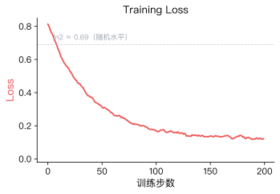
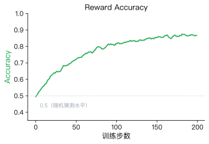

# 2.2 Loss、Reward Margin  Accuracy

 2.1.4.2 ， DPO 。， `DPOTrainer.train()` 。

 1  CartPole  `Episode Reward`（），，。 `trainer.train()` ，：

```
Step  Training Loss  Rewards/Margins  Rewards/Chosen  Rewards/Rejected  Rewards/Accuracies
  5       0.6821          0.0312          -0.0156          -0.0468              0.52
 10       0.6543          0.1247           0.0891          -0.0356              0.58
 15       0.5987          0.3421           0.2314          -0.1107              0.72
 ...
 45       0.2103          1.5632           0.9201          -0.6431              0.92
```

 SwanLab  TensorBoard，。。

### Training Loss（）

Training Loss  DPO  $\mathcal{L}_{DPO}$ —— `Training Loss` 。

，，$\pi_\theta$  $\pi_{ref}$ ， 0，$\sigma(0) = 0.5$，Loss  $-\ln(0.5) = \ln 2 \approx 0.693$。， 5  `0.6821` 。

**，。**  Loss ——，（Overfitting），""，。



 Loss ：

- ** $\ln 2 \approx 0.69$ **：，。
- ****：。
- ****：，Loss  0。

|                    |                    |  |
| -------------------------- | -------------------------- | -------- |
| （ 0.69 ） |        |      |
|              |  |      |
|  0             | ， |      |

<details>
<summary><strong>（ chosen），Loss ？</strong></summary>

Loss 。，""—— chosen  rejected 。。

 Post-Training ：**，garbage in, garbage out。**

</details>

### Reward Margin（）

Reward Margin  Sigmoid ，—— `Rewards/Margins` ：

$$\text{Margin} = \beta \ln \frac{\pi_\theta(y_w | x)}{\pi_{ref}(y_w | x)} - \beta \ln \frac{\pi_\theta(y_l | x)}{\pi_{ref}(y_l | x)}$$

Margin ，""。****。


- ****：Margin ，。
- ****：Margin ，。：、、。

<details>
<summary><strong> <code>beta</code>  0.1  1.0，Reward Margin ？</strong></summary>

`beta` —— [3-train_dpo.py](../../code/chapter02_dpo/3-train_dpo.py)  `DPOConfig(beta=0.1)` 。

- `beta` （ 1.0）：，，Margin 。
- `beta` （ 0.01）： Margin ，。

> ****： [3-train_dpo.py](../../code/chapter02_dpo/3-train_dpo.py)， `DPOConfig`  `beta` ， 0.01  0.5，， Margin 。

</details>

### Reward Accuracy（）

Reward Accuracy  `Rewards/Accuracies` 。：，：

$$\text{Accuracy} = \frac{\#\{i \in B : r(x_i, y_w^{(i)}) > r(x_i, y_l^{(i)})\}}{|B|}$$

 $\#\{\cdot\}$ ，$|B|$ 。，。



，，Accuracy  0.5 （）。， 5  `0.52` 。，Accuracy ， 0.8 ~ 0.95 。 Accuracy  0.5 ，。

Accuracy  Margin 。Accuracy ""（）， Margin ""（）。，：Accuracy  Margin 。 Accuracy  Margin ，，。

### Chosen Reward  Rejected Reward（ Margin）

Reward Margin ，。Margin  0  2.0，：

-  2.0，——""。
- ， 2.0——""。
-  3.0， 1.0——，。

 Margin ，。，TRL  Chosen Reward  Rejected Reward —— `Rewards/Chosen`  `Rewards/Rejected` 。：

$$r_{\text{chosen}} = \beta \ln \frac{\pi_\theta(y_w | x)}{\pi_{ref}(y_w | x)}, \quad r_{\text{rejected}} = \beta \ln \frac{\pi_\theta(y_l | x)}{\pi_{ref}(y_l | x)}$$

，$r_{\text{chosen}}$ （），$r_{\text{rejected}}$ （）。， Margin  Loss 。

<details>
<summary><strong>： log </strong></summary>

 $r_{\text{chosen}}$ ：

$$\beta \ln \frac{\pi_\theta(y_w | x)}{\pi_{ref}(y_w | x)} = \beta \ln \pi_\theta(y_w | x) - \beta \ln \pi_{ref}(y_w | x)$$

 $\ln \pi_{ref}(y_w | x)$ （）， $r_{\text{chosen}}$  $\ln \pi_\theta(y_w | x)$ 。TRL  DPOTrainer  `logps/chosen`  `logps/rejected` ， $\ln \pi_\theta(y_w)$  $\ln \pi_\theta(y_l)$ ，。

</details>

---

## 

|                   | TRL  Key         |                      |                    |
| --------------------- | -------------------- | ---------------------------- | -------------------------- |
| **Training Loss**     | `loss`               |  ln2 ≈ 0.69  |  0.69 /  0 |
| **Reward Margin**     | `rewards/margins`    |  0           |  /         |
| **Reward Accuracy**   | `rewards/accuracies` |  0.5  0.8~0.95       |  0.5             |
| **Chosen Reward**     | `rewards/chosen`     |                      |                  |
| **Rejected Reward**   | `rewards/rejected`   |                      |                        |
| **Chosen Log Prob**   | `logps/chosen`       |                | —                          |
| **Rejected Log Prob** | `logps/rejected`     |                | —                          |

---

## 

 2 ，：

1. ** RL **： DPO  5 ，，。
2. ** Post-Training **： Pre-training → SFT → RL ， DPO 。
3. ** DPO **： RLHF ， DPO ，。
4. ****： Training Loss、Reward Margin、Reward Accuracy、Chosen/Rejected Reward 。

 1  CartPole ，。，，。

## 

[^1]: Schulman, J., et al. (2017). Proximal Policy Optimization Algorithms. _arXiv preprint_. [arXiv:1707.06347](https://arxiv.org/abs/1707.06347)

[^2]: Ouyang, L., et al. (2022). Training language models to follow instructions with human feedback. _arXiv preprint_. [arXiv:2203.02155](https://arxiv.org/abs/2203.02155)

[^3]: Rafailov, R., et al. (2023). Direct Preference Optimization: Your Language Model is Secretly a Reward Model. _arXiv preprint_. [arXiv:2305.18290](https://arxiv.org/abs/2305.18290)

[^4]: Christiano, P. F., et al. (2017). Deep reinforcement learning from human preferences. _Advances in Neural Information Processing Systems_, 30.
