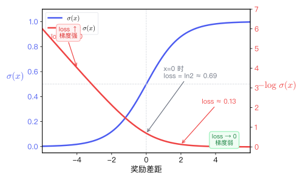

# 2.1 Post-Training  DPO 

， DPO ，，。？，， DPO 。

**（Pre-training）** **（Post-Training）** 。，，。Post-Training ，。Post-Training ：（SFT）（RL / Alignment）。 [^1][^2]：

$$\text{Pre-training} \;\xrightarrow{\text{Base Model}}\; \underbrace{\text{SFT} + \text{RL}}_{\text{Post-Training}} \;\xrightarrow{\text{Chat Model}}$$

， DPO 。

### 2.1.1 ：（Pre-training）

，""（Next-Token Prediction）。，。

- ****：、、。
- ****：。
- ****：，（Base Model）。
- **（）**：
  ```json
  {
    "text": "，，1400..."
  }
  ```

""——，。""，""。 CartPole ， token，""。

### 2.1.2 ：（Supervised Fine-Tuning, SFT）

，。

- ****： (Prompt, Response) 。
- ****： Next-Token Prediction，。
- ****：（Instruct Model）。
- **（）**：

  ```json
  {
    "messages": [
      { "role": "user", "content": "？" },
      {
        "role": "assistant",
        "content": "。。"
      }
    ]
  }
  ```

   HuggingFace transformers （ `apply_chat_template` ），TRL  `SFTTrainer` 。

 SFT，""。 SFT （Behavior Cloning）——，。 SFT ""，""，；，、、。

SFT ——""，""，。。

### 2.1.3 ：（RL / Alignment）

 DPO 。（），。

- ****：(Prompt, Chosen, Rejected) 。
- ****：。
- ****：、（Chat Model）。
- **（）**——（ [1-generate_data.py](../../code/chapter02_dpo/1-generate_data.py) ）：
  ```json
  {
    "prompt": "，。",
    "chosen": "。，，。",
    "rejected": "？！。"
  }
  ```

 [3-train_dpo.py](../../code/chapter02_dpo/3-train_dpo.py)， `preference_data.json` 。 JSON  `prompt`、`chosen`、`rejected` ， $x$、$y_w$、$y_l$：

```python
data_dict = {
    "prompt": [item["prompt"] for item in data_list],    # → x
    "chosen": [item["chosen"] for item in data_list],     # → y_w
    "rejected": [item["rejected"] for item in data_list]  # → y_l
}
train_dataset = Dataset.from_dict(data_dict)
```

，：，；，""；，""。""""""——。

：

```mermaid
flowchart TD
    subgraph phase1 ["：Pre-training"]
        A[/""/] -->|Next-Token Prediction| B("Base Model\n,")
    end

    subgraph phase2 ["：SFT"]
        C[/"\nPrompt-Response "/] -->|| D("Instruct Model\n,")
    end

    subgraph phase3 ["：RL / Alignment"]
        E[/"\nPrompt-Chosen-Rejected"/] -->|DPO | F("Chat Model\n、、")
    end

    B --> C
    D --> E

    style A fill:#f3e5f5,stroke:#9c27b0
    style B fill:#e1bee7,stroke:#8e24aa
    style C fill:#e8f4fd,stroke:#2196f3
    style D fill:#bbdefb,stroke:#1e88e5
    style E fill:#e8f5e9,stroke:#4caf50
    style F fill:#c8e6c9,stroke:#43a047
```

 Post-Training ：SFT ""，（RL / DPO）""。 DPO 。：DPO ？？。

<details>
<summary><strong>： SFT  RL（ DPO）？ SFT ？</strong></summary>

。

SFT  token ：

$$\mathcal{L}_{SFT} = -\mathbb{E}_{(x, y_w) \sim \mathcal{D}} \left[ \log \pi_\theta(y_w | x) \right]$$

****：。""。""，""。，SFT ，—— SFT ，。

DPO ****：

$$\mathcal{L}_{DPO} = -\ln \sigma \left( \beta \ln \frac{\pi_\theta(y_w | x)}{\pi_{ref}(y_w | x)} - \beta \ln \frac{\pi_\theta(y_l | x)}{\pi_{ref}(y_l | x)} \right)$$

 $y_w$  $y_l$，****。： $\pi_\theta(y_w | x)$ ， $\pi_\theta(y_l | x)$ （""，），。

，。SFT ""，（、），""。DPO ，****——（、、）。

 DPO  SFT：SFT ， DPO ，****，。

</details>

<details>
<summary><strong>：（Pre-training）， SFT  DPO ？</strong></summary>

。，SFT  RL 。
（）， DPO ，""。

</details>

### 2.1.4 DPO 

， SB3  `model.learn()`，： →  → 。 `DPOTrainer.train()` ——，DPO 。

 DPO ，。

#### 2.1.4.1  RLHF  DPO：

 RLHF（）（Christiano et al., 2017; Ouyang et al., 2022），：

1. **（Reward Model）**：，——，。
2. **（Policy Model）**：，，。 PPO（Schulman et al., 2017）。

，：，。，， [^3]。

**DPO（）**（Rafailov et al., 2023）：，？[^4]

， PPO ：， KL 。，——，。 1.1.6.4  PPO ：，。

Rafailov （2023）， KL ，：

$$ r(x, y) \propto \log \frac{\pi_{\theta}(y | x)}{\pi_{ref}(y | x)} $$

 $r(x,y)$，""""。，。，—— $\pi_{ref}$ ， $\pi_\theta$ 。

，DPO ：（），，、。， PPO ，。

 [3-train_dpo.py](../../code/chapter02_dpo/3-train_dpo.py) ，`DPOTrainer`  `model` ：

```python
trainer = DPOTrainer(
    model=model,              # π_θ：
    args=training_args,
    train_dataset=train_dataset,
    processing_class=tokenizer,  # TRL 0.24  processing_class  tokenizer/processor
)
```

，。`DPOTrainer`  `model`  $\pi_{ref}$， $\pi_\theta$  $\pi_{ref}$ 。$\beta$  `DPOConfig`  0.1——。

#### 2.1.4.2 

DPO ：

<!-- prettier-ignore -->
$$ \mathcal{L}_{DPO} = -\ln \sigma \left( \beta \ln \frac{\pi_\theta(y_w | x)}{\pi_{ref}(y_w | x)} - \beta \ln \frac{\pi_\theta(y_l | x)}{\pi_{ref}(y_l | x)} \right) $$

，：， Sigmoid  $-\ln$。，。

：

|   |                |           |
| ----- | ------------------ | ----------------- |
| x     |        | Prompt / Context  |
| y_w   | （Winner） | Chosen Response   |
| y_l   | （Loser）  | Rejected Response |
| π_θ   |  | Policy Model      |
| π_ref |    | Reference Model   |

**：。**  token 。 $x$， $y$  token ，， $\pi_\theta(y | x)$。 DPO ，：$\pi_\theta(y_w | x)$ ，$\pi_\theta(y_l | x)$ 。

**：，。** ， $\pi_\theta(y_w | x)$ 、$\pi_\theta(y_l | x)$ 。，。 $\pi_{ref}$ 。$\pi_{ref}$ ， DPO 。 $\pi_\theta(y_w | x)$， $\pi_{ref}(y_w | x)$ ：

<!-- prettier-ignore -->
$$ \frac{\pi_\theta(y_w | x)}{\pi_{ref}(y_w | x)} $$

：，""——，；，。，，。，：，。

**：，。**  $y_l$ ：

<!-- prettier-ignore -->
$$ \frac{\pi_\theta(y_l | x)}{\pi_{ref}(y_l | x)} $$

DPO ——。，，。 token ，。 $\log$ ：，（$\log \frac{a}{b} = \log a - \log b$），，。，$\log$  $\ln$（ $e$）， $\log_2$  $\log_{10}$。 $\beta$  $\pi_{ref}$ （$\beta$ ，），：

<!-- prettier-ignore -->
$$ \text{} = \beta \ln \frac{\pi_\theta(y_w | x)}{\pi_{ref}(y_w | x)} - \beta \ln \frac{\pi_\theta(y_l | x)}{\pi_{ref}(y_l | x)} $$

 $\ln \frac{\pi_\theta}{\pi_{ref}} > 0$ ，； 0 。DPO 。

**：。** ，""""。 Sigmoid ：

$$ \sigma(x) = \frac{1}{1 + e^{-x}} $$

Sigmoid  $x$  $(0, 1)$ ：$x$ ，$\sigma(x)$  1；$x$ ，$\sigma(x)$  0；$x = 0$  $\sigma(0) = 0.5$。 $-\ln$，。 Sigmoid ：



， Sigmoid $\sigma(x)$， $-\ln\sigma(x)$。，（，）。：

- **（）**：， 0，——，。
- **（）**：，，——，""。

， DPO ：

<!-- prettier-ignore -->
$$ \mathcal{L}_{DPO} = -\ln \sigma \left( \beta \ln \frac{\pi_\theta(y_w | x)}{\pi_{ref}(y_w | x)} - \beta \ln \frac{\pi_\theta(y_l | x)}{\pi_{ref}(y_l | x)} \right) $$

 DPO ：

```mermaid
flowchart LR
    X[/" (x)\n'，？'"/] --> Policy("\n(Policy: π_θ)")
    X --> Ref("\n(Reference: π_ref)")

    subgraph calc [""]
        P_w(" (y_w) ")
        P_l(" (y_l) ")
    end

    Policy --> P_w
    Policy --> P_l
    Ref --> P_w
    Ref --> P_l

    P_w -->|| Ratio_w("\n()")
    P_l -->|| Ratio_l("\n()")

    Ratio_w & Ratio_l --> Loss("DPO Loss\n()")
    Loss -.->|| Policy

    style Policy fill:#fff3e0,stroke:#ff9800,color:#000
    style Ref fill:#e0e0e0,stroke:#9e9e9e,color:#000
    style Ratio_w fill:#e8f5e9,stroke:#4caf50,color:#000
    style Ratio_l fill:#fce4ec,stroke:#e91e63,color:#000
    style Loss fill:#e3f2fd,stroke:#03a9f4,color:#000
```

**：DPO ，""""。**

，DPO ： Bradley-Terry （Bradley & Terry, 1952）。， PPO ；DPO ——，。

，， Loss、Reward Margin、Accuracy 。

<details>
<summary><strong>：DPO ， Rejected ， Chosen ，？</strong></summary>

。DPO ，。
，，** Rejected ， Chosen 、**。 Rejected 、（ Hard Negative），。

</details>

<details>
<summary><strong>（）：DPO  PPO ——？</strong></summary>

""，。，。

---

**：PPO **

PPO ，，：。 KL ，：

$$\max_{\pi_\theta} \; \mathbb{E}_{x, y \sim \pi_\theta}\left[r(x, y)\right] - \beta \, D_{\text{KL}}\left(\pi_\theta(\cdot|x) \;\|\; \pi_{\text{ref}}(\cdot|x)\right)$$

 $r(x,y)$ ，$\beta$ ，$D_{\text{KL}}$ 。

---

**： KL **

KL ：

$$D_{\text{KL}}(\pi_\theta \| \pi_{\text{ref}}) = \mathbb{E}_{y \sim \pi_\theta}\left[\log \frac{\pi_\theta(y|x)}{\pi_{\text{ref}}(y|x)}\right]$$

，：

$$\max_{\pi_\theta} \; \mathbb{E}_{y \sim \pi_\theta}\left[r(x, y) - \beta \log \frac{\pi_\theta(y|x)}{\pi_{\text{ref}}(y|x)}\right]$$

---

**： $y$ **

 $\pi_\theta$ （$\pi_\theta$  1）。， $\pi_\theta(y|x)$ ，：

$$\pi^*(y|x) \propto \pi_{\text{ref}}(y|x) \cdot \exp\!\left(\frac{1}{\beta} r(x, y)\right)$$

：， $\exp(r/\beta)$ 。，。

---

**：**

，：

$$r(x, y) = \beta \log \frac{\pi^*(y|x)}{\pi_{\text{ref}}(y|x)} + \beta \log Z(x)$$

 $Z(x) = \sum_y \pi_{\text{ref}}(y|x) \exp(r(x,y)/\beta)$ （ $y$ ， $x$）。

：$\beta \log Z(x)$  $x$ 。 DPO ， $x$ ，：

$$r(x, y_w) - r(x, y_l) = \beta \log \frac{\pi^*(y_w|x)}{\pi_{\text{ref}}(y_w|x)} - \beta \log \frac{\pi^*(y_l|x)}{\pi_{\text{ref}}(y_l|x)}$$

---

****

，。 DPO 。 Bradley-Terry （ $y_w$  $y_l$ ），， DPO 。

</details>

## 

[^1]: Ouyang, L., et al. (2022). Training language models to follow instructions with human feedback. _NeurIPS 2022_. [arXiv:2203.02155](https://arxiv.org/abs/2203.02155)

[^2]: Touvron, H., et al. (2023). LLaMA: Open and Efficient Foundation Language Models. _arXiv preprint_. [arXiv:2302.13971](https://arxiv.org/abs/2302.13971)

[^3]: Christiano, P. F., et al. (2017). Deep reinforcement learning from human preferences. _Advances in Neural Information Processing Systems_, 30. [](https://arxiv.org/abs/1706.03741)

[^4]: Rafailov, R., et al. (2023). Direct Preference Optimization: Your Language Model is Secretly a Reward Model. _arXiv preprint_. [arXiv:2305.18290](https://arxiv.org/abs/2305.18290)
