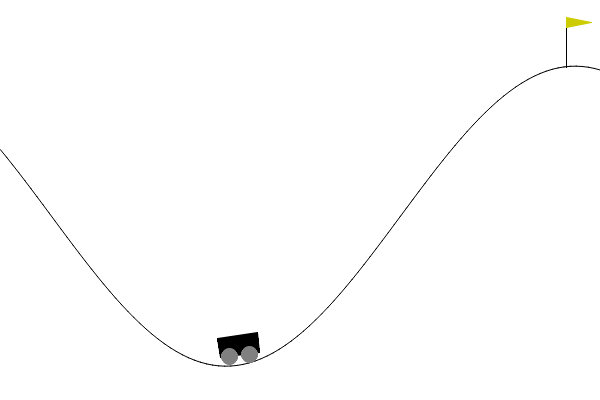

# 3.6 

## 

****

- **Value-Based **：$\arg\max_a Q(s,a)$ /。
- ****： $\pi_\theta(a \mid s)$ ， $Q$ 。
- ****： $J(\theta)$ ，。
- **REINFORCE **：，，。

****（Value-Based RL）：”-” $Q(s,a)$， $\arg\max_a Q(s,a)$ 。——CartPole 、， $Q$ 。

 $\arg\max_a Q(s,a)$ ：**。**

，。 6 ：

$$
a=(\tau_1,\tau_2,\ldots,\tau_6)\in\mathbb{R}^6.
$$

 $Q(s,a)$ ，： $a$ 

$$
\arg\max_a Q(s,a)?
$$

、；。，””，。

，，？

**：。** ，，。****（Policy-Based RL）。

::: info 
。

**Value-Based**  $Q(s,a)$， $\arg\max_a Q(s,a)$ 。Q-Learning  DQN 。、， CartPole “”“”；， replay buffer 。

**Policy-Based** ， $\pi_\theta(a\mid s)$： $s$ ， $a$。REINFORCE 。

$$
J(\theta)=\mathbb{E}_{\tau\sim\pi_\theta}[G_0].
$$

，，。，、、LLM 。， REINFORCE ， **On-policy**[^1][^5][^6]。
:::

## 

，**** $Q(s,a)$  $s$  $a$ 。 CartPole  $s$，””””。**** $Q(s,\text{})$  $Q(s,\text{})$，。

。、， $s$ ****。""；""。，****： $s$ ， $70\%$ ， $30\%$ 。， $70\%$ 、$20\%$ 、$10\%$ 。

。，。****，****；****，****。

，****： $Q$ ""，，""。，。

## 

，****。 $\pi(a\mid s)$  $s$  $a$ 。，

$$
\pi_\theta(a\mid s)=P_\theta(A_t=a\mid S_t=s).
$$

 $\theta$ ，****；$S_t$  $t$ ，$A_t$  $t$ 。，$\pi_\theta(a\mid s)$  $\theta$ ， $s$  $a$ 。

****，**** $z_\theta(s,a)$。， $1$。，。 **softmax** ：

$$
\pi_\theta(a\mid s)
=
\frac{\exp(z_\theta(s,a))}
{\sum_{a'}\exp(z_\theta(s,a'))}.
$$

 $a'$ ，。， $1$。 CartPole ，“”“”， softmax 。

****，。，****。，****：

$$
a\sim\mathcal{N}\left(\mu_\theta(s),\sigma_\theta(s)^2\right).
$$

， $s$  $\mu_\theta(s)$  $\sigma_\theta(s)$。，。，，。

，$Q(s,a)$  $\pi_\theta(a\mid s)$ ：

$$
Q(s,a)\quad\text{}\quad \pi_\theta(a\mid s).
$$

$Q(s,a)$  $s$  $a$ ；$\pi_\theta(a\mid s)$  $s$  $a$ 。，。

##  J(θ)

，： $\theta$ ？

 $Q(s,a)$ 。：，。CartPole  reset ，； prompt。，，。

 $\rho_0$，：

$$
J(\theta)
=
\mathbb{E}_{s_0\sim\rho_0}
\left[
V^{\pi_\theta}(s_0)
\right].
$$

 $s_0$ ，$\rho_0$ ；$V^{\pi_\theta}(s_0)$  $s_0$ ， $\pi_\theta$ 。：，。

。

$$
\tau=(s_0,a_0,r_0,s_1,a_1,r_1,\ldots)
$$

，$G_0$ ：

$$
G_0=\sum_{t=0}^{\infty}\gamma^t r_t.
$$

 $r_t$  $t$ ，$\gamma\in[0,1]$ 。

$$
J(\theta)
=
\mathbb{E}_{\tau\sim\pi_\theta}[G_0]
=
\mathbb{E}_{\tau\sim\pi_\theta}
\left[
\sum_{t=0}^{\infty}\gamma^t r_t
\right].
$$

$\tau\sim\pi_\theta$ ：，。，。

 $J(\theta)$ ：

$$
J(\theta)=\text{。}
$$


$$
\theta^*=\arg\max_\theta J(\theta).
$$

 $\theta$， $a$。

$$
\arg\max_a Q(s,a)
$$

；

$$
\arg\max_\theta J(\theta)
$$

。：，。

## 

 $J(\theta)$，：

$$
\nabla_\theta J(\theta).
$$

 loss 。：，。。 $\theta$ ，，，。

。

$$
\tau=(s_0,a_0,r_0,s_1,a_1,r_1,\ldots)
$$

 $\theta$ 

$$
P_\theta(\tau)
=
\rho_0(s_0)
\prod_t
\pi_\theta(a_t\mid s_t)
P(s_{t+1}\mid s_t,a_t).
$$

。$\rho_0(s_0)$  $s_0$ ；$\pi_\theta(a_t\mid s_t)$  $s_t$  $a_t$ ；$P(s_{t+1}\mid s_t,a_t)$ 。

：， $\pi_\theta(a_t\mid s_t)$  $\theta$。，。

，

$$
J(\theta)
=
\sum_\tau P_\theta(\tau)G(\tau).
$$

$G(\tau)$  $\tau$ 。：“”“”，。。

## 

 $J(\theta)$ ：

$$
\nabla_\theta J(\theta)
=
\sum_\tau \nabla_\theta P_\theta(\tau)G(\tau).
$$

 $\tau$ ，、、， $G(\tau)$ 。 $\theta$ ，。

， $\nabla_\theta P_\theta(\tau)$。“”，

$$
\sum_\tau P_\theta(\tau)(\cdots),
$$

，。：

$$
\nabla_\theta P_\theta(\tau)
=
P_\theta(\tau)\nabla_\theta\log P_\theta(\tau).
$$


$$
\nabla_\theta\log f(\theta)
=
\frac{\nabla_\theta f(\theta)}{f(\theta)}.
$$

， $\nabla_\theta f(\theta)=f(\theta)\nabla_\theta\log f(\theta)$。 $f(\theta)$  $P_\theta(\tau)$，。

：

$$
\nabla_\theta J(\theta)
=
\sum_\tau
P_\theta(\tau)
\nabla_\theta\log P_\theta(\tau)
G(\tau).
$$

：

$$
\nabla_\theta J(\theta)
=
\mathbb{E}_{\tau\sim\pi_\theta}
\left[
\nabla_\theta\log P_\theta(\tau)G(\tau)
\right].
$$

：。，。

 $\log P_\theta(\tau)$。，：

$$
\log P_\theta(\tau)
=
\log\rho_0(s_0)
+
\sum_t\log\pi_\theta(a_t\mid s_t)
+
\sum_t\log P(s_{t+1}\mid s_t,a_t).
$$

 $\theta$ ，$\rho_0$  $P$ ， 0。：

$$
\nabla_\theta\log P_\theta(\tau)
=
\sum_t\nabla_\theta\log\pi_\theta(a_t\mid s_t).
$$

：

$$
\nabla_\theta J(\theta)
=
\mathbb{E}_{\tau\sim\pi_\theta}
\left[
\sum_t
\nabla_\theta\log\pi_\theta(a_t\mid s_t)
G(\tau)
\right].
$$

， $t$ ， $t$  $G_t$ ：

$$
G_t=\sum_{k=t}^{\infty}\gamma^{k-t}r_k.
$$

：

$$
\nabla_\theta J(\theta)
=
\mathbb{E}_{\tau\sim\pi_\theta}
\left[
\sum_t
\nabla_\theta\log\pi_\theta(a_t\mid s_t)
G_t
\right].
$$

 $\nabla_\theta\log\pi_\theta(a_t\mid s_t)$ ：，“ $s_t$  $a_t$”。$G_t$ 。，；，。

：

> 。，；，。

## 

， A、B 。 $\theta$  A ：

$$
p=\pi_\theta(A)=\sigma(\theta),\qquad
\pi_\theta(B)=1-p.
$$

$\sigma(\theta)$  sigmoid 。， $\theta$ ，$p$ ， A 。

：

$$
\nabla_\theta\log\pi_\theta(A)=1-p,
$$

$$
\nabla_\theta\log\pi_\theta(B)=-p.
$$

 $p=0.7$。 A， $G=10$，

$$
(1-p)G=0.3\times 10=3
$$

。，$\theta$ ，A  $p$ 。

 B， $G=10$，

$$
(-p)G=-0.7\times 10=-7
$$

。，$\theta$ ，A ， B  $1-p$ 。

””。。 B， A  B。，： A ， A ； B ， B 。

### CartPole  REINFORCE

，。 CartPole-v1 ， **REINFORCE**。 Gymnasium CartPole-v1 ——，，：


<p align="center">
  <em>：<a href="https://gymnasium.farama.org/environments/classic_control/cart_pole/" target="_blank" rel="noopener noreferrer">Gymnasium Documentation - Cart Pole</a></em>
</p>

REINFORCE ：

1.  $\pi_\theta$  CartPole （episode）， $s_t$、 $a_t$  $r_t$；
2.  $G_t = \sum_{k=t}^{T} \gamma^{k-t} r_k$；
3. ：$\theta \leftarrow \theta + \alpha \nabla_\theta \log \pi_\theta(a_t | s_t) \, G_t$。

CartPole  4 （、、、），””””。 MLP： 4 ， 2 ， softmax 。

，，（ 10-20 ）。，”，”，。Gymnasium  CartPole-v1  500 ，REINFORCE  episode 。

 REINFORCE ： $G_t$ ，。（baseline） Actor-Critic 。 CartPole  [Gymnasium ](https://gymnasium.farama.org/environments/classic_control/cart_pole/)。

### REINFORCE 

 CartPole-v1  REINFORCE， RL ：

```python
import gymnasium as gym
import numpy as np
import torch
import torch.nn as nn
import torch.optim as optim

# ： → 
class PolicyNet(nn.Module):
    def __init__(self, state_dim=4, action_dim=2, hidden=128):
        super().__init__()
        self.net = nn.Sequential(
            nn.Linear(state_dim, hidden),
            nn.ReLU(),
            nn.Linear(hidden, action_dim),
            nn.Softmax(dim=-1),
        )

    def forward(self, x):
        return self.net(x)

    def select_action(self, state):
        state_t = torch.FloatTensor(state).unsqueeze(0)
        probs = self.forward(state_t)
        dist = torch.distributions.Categorical(probs)
        action = dist.sample()
        return action.item(), dist.log_prob(action)

# 
env = gym.make("CartPole-v1")
policy = PolicyNet()
optimizer = optim.Adam(policy.parameters(), lr=1e-2)
gamma = 0.99

for episode in range(500):
    state, _ = env.reset()
    log_probs = []
    rewards = []

    # 
    done = False
    while not done:
        action, log_prob = policy.select_action(state)
        next_state, reward, terminated, truncated, _ = env.step(action)
        done = terminated or truncated

        log_probs.append(log_prob)
        rewards.append(reward)
        state = next_state

    #  G_t
    returns = []
    G = 0
    for r in reversed(rewards):
        G = r + gamma * G
        returns.insert(0, G)
    returns = torch.FloatTensor(returns)
    returns = (returns - returns.mean()) / (returns.std() + 1e-8)  # 

    # 
    loss = -sum(lp * Gt for lp, Gt in zip(log_probs, returns))
    optimizer.zero_grad()
    loss.backward()
    optimizer.step()

    if (episode + 1) % 50 == 0:
        avg_len = sum(len(rewards) for _ in range(10))  # 
        print(f"Episode {episode+1}, length: {len(rewards)}")

env.close()
```

 40-48 ：， $G_t = r_t + \gamma G_{t+1}$ ；（），，； $-\sum_t \log \pi_\theta(a_t|s_t) \cdot G_t$  loss 。 PyTorch ，。

### MountainCar：

CartPole （$+1$），。。Gymnasium  **MountainCar-v0** ：



<p align="center">
  <em>：<a href="https://gymnasium.farama.org/environments/classic_control/mountain_car/" target="_blank" rel="noopener noreferrer">Gymnasium Documentation - Mountain Car</a></em>
</p>

，。，，。

|      |                                                        |
| -------- | ---------------------------------------------------------- |
|      | 2 ： $x \in [-1.2, 0.6]$， $v \in [-0.07, 0.07]$ |
|      | 3 ：（0）、（1）、（2）                  |
|      |  $-1$， $x \geq 0.5$  episode            |
|  | 200                                                      |

：****。200 ，。 REINFORCE （ $-200$），—— $G_t$ ，。

****。Q-Learning  MountainCar ： TD ， episode ，Q 。 REINFORCE  episode  $G_t$， episode ，。

###  Q-Learning 

 Q-Learning ：

|              | **Q-Learning** ()                                                      | **REINFORCE** ()                                                                       |
| :------------------- | :--------------------------------------------------------------------------- | :----------------------------------------------------------------------------------------- |
| ****         |  $Q(s,a)$                                                            |  $\theta$                                                                          |
| ****         | $Q(s,a) \leftarrow Q(s,a) + \alpha [r + \gamma \max_{a'} Q(s',a') - Q(s,a)]$ | $\theta \leftarrow \theta + \alpha \sum_t \nabla_\theta \log \pi_\theta(a_t \mid s_t) G_t$ |
| ****         |                                                                      |                                                                                  |
| ****         | Off-policy:                                                      | On-policy:                                                             |
| ****     | 、                                                                   |                                                                                  |
| **CartPole **    | ，                                                             | ，                                                                         |
| **MountainCar ** | （TD ）                                                |                                                                      |
| ****         |  $\arg\max$，                                            | ，                                                                 |

，。Q-Learning ，。 Actor-Critic  PPO ： Critic（）， Actor（）。

## 

，：。

，。CartPole  190 ， 40 ；，，。 $G_t$  log probability ，。

。，。CartPole  $+1$。 $G_t$，；“”，：

$$
\text{？}
$$

。 $V^\pi(s)$ ，“ $s$ ，”。 $Q^\pi(s,a)$ “ $s$  $a$，，”。：

$$
A^\pi(s,a)=Q^\pi(s,a)-V^\pi(s).
$$

 $A^\pi(s,a)>0$， $a$ ，； $A^\pi(s,a)<0$，，。

 Actor-Critic 。Actor  $\pi_\theta$，；Critic  $V_\phi(s)$  $Q_\phi(s,a)$， Actor 。。，；， Critic ， Actor 。

REINFORCE ：， $G_t$ [^1]。Actor-Critic ，[^2]。PPO ，[^3]。， $J(\theta)$ 。

## 

。

 value-based  $Q(s,a)$，“ $s$ ，”。、， Q-Learning  Q 。

 policy-based  $\pi_\theta(a\mid s)$，“，”。、，， REINFORCE、Actor-Critic、PPO、GRPO 。

：。 $Q(s,a)$， $\nabla_\theta J(\theta)$，、、。：？ DQN  replay buffer ，？

：，。

## 

：。

1.  $Q(s,a)$， $\arg\max_a Q(s,a)$ ； $\pi_\theta(a\mid s)$，。
2.  $\theta$ 。 softmax ，。
3.  $J(\theta)=\mathbb{E}_{\tau\sim\pi_\theta}[G_0]$ ，。
4.  $P_\theta(\tau)$ 、； $\theta$ ，。
5. ：

$$
\nabla_\theta J(\theta)
=
\mathbb{E}_{\tau\sim\pi_\theta}
\left[
\sum_t
\nabla_\theta\log\pi_\theta(a_t\mid s_t)
G_t
\right].
$$

6. ：，。
7. ，、 Critic，。

：[](./value-q)

：[](./algorithm-taxonomy)

## 

[^1]: Williams, R. J. (1992). Simple statistical gradient-following algorithms for connectionist reinforcement learning. _Machine Learning_, 8, 229-256.

[^2]: Sutton, R. S., McAllester, D., Singh, S., & Mansour, Y. (1999). Policy gradient methods for reinforcement learning with function approximation. _Advances in Neural Information Processing Systems_, 12.

[^3]: Schulman, J., Wolski, F., Dhariwal, P., Radford, A., & Klimov, O. (2017). Proximal Policy Optimization Algorithms. arXiv:1707.06347.

[^5]: Sutton, R. S., & Barto, A. G. (2018). _Reinforcement Learning: An Introduction_ (2nd ed.), Chapter 13: Policy Gradient Methods. MIT Press.

[^6]: OpenAI Spinning Up. "[Vanilla Policy Gradient](https://spinningup.openai.com/en/latest/algorithms/vpg.html)."  VPG  on-policy 。
