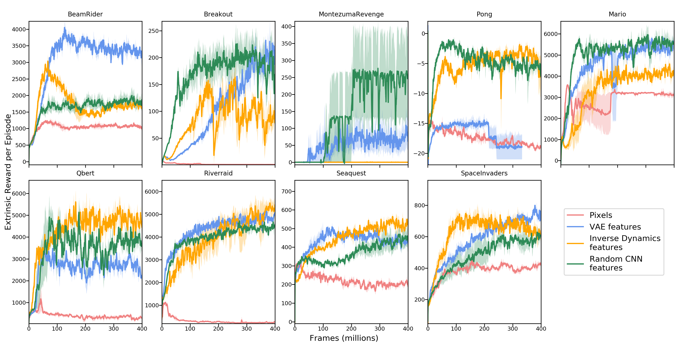
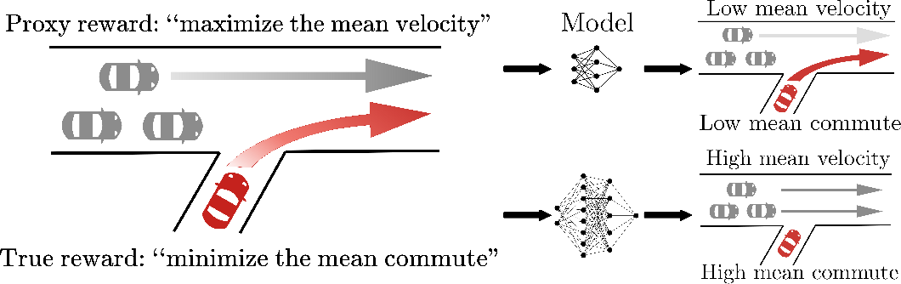
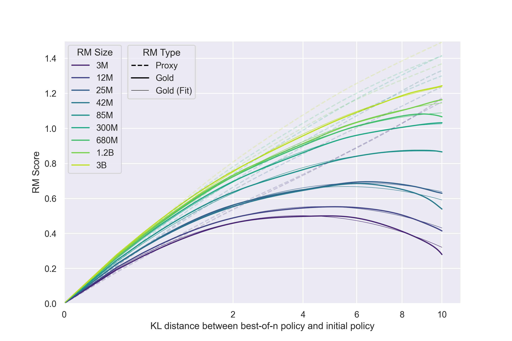
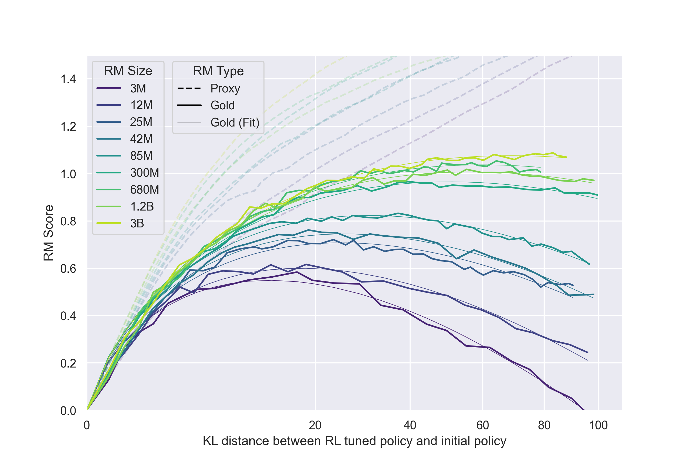
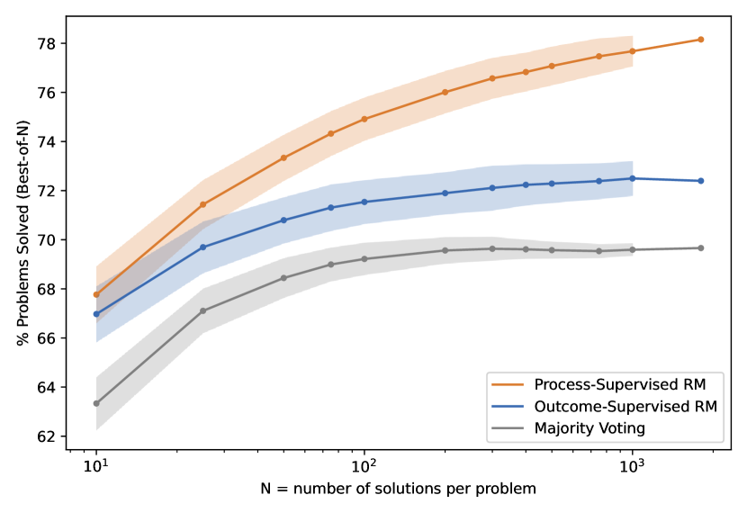

# 3.8 ：

， DP、MC、TD， on-policy  off-policy，：。""，：**？？**

::: info 
""。，。，，。
:::

。，。。：

|  |  |  |  |
| -------- | ---------- | -------- | ---------- |
|  A   | $0$        | $+1$     | $0$        |
|  B   | $-0.01$    | $+1$     | $0$        |
|  C   | $+0.02$    | $+1$     | $0$        |

、，。 A ； B ""； C "、"。， C ，，。

：**，，**。""，""，""。

## 

 MDP  $\langle \mathcal{S}, \mathcal{A}, P, R, \gamma \rangle$ ，

$$
R(s,a)
$$


$$
R(s,a,s').
$$

： $s$  $a$， $s'$，。，。

，：

$$
G_t=R_{t+1}+\gamma R_{t+2}+\gamma^2R_{t+3}+\cdots .
$$

 $\gamma$ 。$\gamma$  1，；$\gamma$ ，。，，。

。，。""""""；。，，。

，。 3.3 ：

$$
V^\pi(s)=\mathbb{E}_\pi[G_t\mid S_t=s].
$$

 $R$ ； $V^\pi$  $\pi$ ，。，。

 3.3 ：

$$
S\xrightarrow{-1}M\xrightarrow{-1}G.
$$

 $S$  $M$  $-1$， $M$  $G$  $-1$。 $\gamma=1$，

$$
V(S)=-2,\qquad V(M)=-1,\qquad V(G)=0.
$$

，。 $-1$  $+1$，，。；。

## 

 MDP ，：？。

。 $+1$， $0$：

$$
R(s,a,s')=
\begin{cases}
+1, & s'\text{ },\\
0, & \text{}.
\end{cases}
$$

****。：，。：。，， 0。，。

****。，：

$$
R_{\text{dense}}(s,a,s')=d(s,\text{goal})-d(s',\text{goal}).
$$

 $d(s,\text{goal})$  $s$ 。，；，。：，""。

****。，。CartPole  $+1$，。，：，，。 LLM 。，。

，、、，：，，、。

## 

，。，？**（Reward Shaping）**。

 $R$  $F(s, s')$，：

$$
R'(s, a, s') = R(s, a, s') + F(s, s').
$$

 $F$ 。——""。Ng、Harada  Russell  1999 ：**（Potential-Based Reward Shaping, PBRS）**，[^6]。

$$
F(s, s') = \gamma \Phi(s') - \Phi(s).
$$

 $\Phi(s)$ ****。：，。， $Q$ ，。

： $\Phi(s) = -d(s, \text{goal})$（）。，。，；。""， PBRS ，。

PBRS ：。，。，PBRS ****，——。

> ****：""（、），PBRS 。，。

## 

，，。：，，。。

**：**

**OpenAI Gym Humanoid** [^7]：

$$
r = r_{\text{forward}} + r_{\text{alive}} + r_{\text{ctrl}}.
$$

|                |          |      |
| -------------------- | ------------ | -------------- |
| $r_{\text{forward}}$ |      | $0 \sim 5$     |
| $r_{\text{alive}}$   |  | $+1$           |
| $r_{\text{ctrl}}$    |  | $-10^2 \sim 0$ |

。$r_{\text{ctrl}}$  $r_{\text{forward}}$ ，。Gym  $r_{\text{ctrl}}$  $0.001$——：，。

，****。，。

**Ant-v4** （Gymnasium ）：

```python
forward_reward = x_velocity                # r1: 
healthy_reward = 1.0                        # r2: 
ctrl_cost = 0.5 * sum(a^2)                  # r3: 
contact_cost = 0.5 * 1e-3 * sum(c^2)       # r4: 
reward = forward_reward + healthy_reward - ctrl_cost - contact_cost
```

$r_4$（）。， $0.5 \times 10^{-3}$ ，。，，——""。：，，；，。

**HalfCheetah-v4** （Gymnasium ）：

```python
forward_reward = x_velocity          # r1: 
ctrl_cost = 0.1 * sum(a^2)           # r2: 
reward = forward_reward - ctrl_cost
```

，：、。$r_2$  $0.1$ ，。HalfCheetah ""——、，。


<div style="text-align: center; font-size: 0.9em; color: var(--vp-c-text-2); margin-top: -10px; margin-bottom: 20px;">
  <em> 6：HalfCheetah-v4（） Ant-v4（）。HalfCheetah ，；Ant 、、、，，。</em>
</div>

**BipedalWalker** —— PBRS （OpenAI Gym ）：

```python
shaping = 130 * pos.x / SCALE          # r1: 
shaping -= 5.0 * abs(hull_angle)       # r2: 
reward = shaping - self.prev_shaping    # PBRS 
reward -= 0.00035 * MOTORS_TORQUE * sum(|a|)  # r3: 
```

：

- $r_1$（） PBRS ——，
- $r_2$（）——
- $r_3$（）——

 $r_2$  PBRS ， hull_angle。""：，。BipedalWalker  GitHub ， $r_2$ 。


<div style="text-align: center; font-size: 0.9em; color: var(--vp-c-text-2); margin-top: -10px; margin-bottom: 20px;">
  <em> 7：BipedalWalker-v3 。。（PBRS ）、，。</em>
</div>

**RLHF **。，，：

$$
\max_\pi \mathbb{E}[r_\phi(x, y) - \beta \cdot D_{\text{KL}}(\pi(y|x) \| \pi_{\text{ref}}(y|x))].
$$

|                         |          |                      |
| ----------------------------- | ------------ | ------------------------ |
| $r_\phi(x, y)$                |  |      |
| $- \beta \cdot D_{\text{KL}}$ | KL   |  |

$r_\phi$  KL ：$r_\phi$ ""，KL 。$\beta$ 。$\beta$ ，（）；$\beta$ ，，RLHF 。 InstructGPT ，$\beta$ """"[^3]。

**：**

****[^9]：

$$
r = r_{\text{reach}} + r_{\text{grasp}} + r_{\text{lift}} + r_{\text{target}}.
$$

|               |      |          |
| ------------------- | ------------ | ------------ |
| $r_{\text{reach}}$  |  | "" |
| $r_{\text{grasp}}$  |  | "" |
| $r_{\text{lift}}$   |  | "" |
| $r_{\text{target}}$ |  |  |

""。 $r_{\text{reach}}$  $r_{\text{grasp}}$ ， $r_{\text{target}}$ ，""。

**（Curriculum Reward）**：，。（Curriculum Learning）——，。

**→：**

Nair  CoRL 2020  **Dense2Sparse**[^12]：""，。：，；，。

$$
\text{ 1: } r = r_{\text{dense}} \quad \xrightarrow{\text{}} \quad \text{ 2: } r = r_{\text{sparse}}.
$$

 Sawyer ： 1 ""，； 2 ""，""。，Dense2Sparse 。

**：**

Ho  Ermon  **GAIL（Generative Adversarial Imitation Learning）**[^13] ，****。 $D(s, a)$ """"，—— $D(s, a)$  $1$。

$$
r(s, a) = -\log(1 - D(s, a)).
$$

，。：，。，。

GAIL 。AIRL ，；DAC  GAIL  off-policy ，。：**，**。

**：**

Andrychowicz  **HER（Hindsight Experience Replay）**[^14] ：，****，""。

（）， A —— B。HER ： A  B，" B"。

$$
\text{: } r(s, a, g_{\text{original}}) = 0 \quad \xrightarrow{\text{HER}} \quad r(s, a, g_{\text{achieved}}) = 1.
$$

HER ，。""——-，。，HER  0  70% 。

**： + **

Achiam  **CPO（Constrained Policy Optimization）**[^15] ： + 。，""，""""。

$$
\max_\pi \mathbb{E}[r_{\text{main}}] \quad \text{s.t.} \quad \mathbb{E}[c_i] \leq d_i, \quad \forall i.
$$

CPO （$r = r_{\text{main}} - \lambda c$），。 $\lambda$ ：，$\lambda$ ，。""——。

** + ：**

（ Montezuma's Revenge），。Pathak  **ICM**[^10] ：

$$
r = r_{\text{extrinsic}} + \beta \cdot r_{\text{curiosity}}.
$$

- $r_{\text{extrinsic}}$：（）
- $r_{\text{curiosity}}$：

$\beta$ 。；""[^11]——，。



<div style="text-align: center; font-size: 0.9em; color: var(--vp-c-text-2); margin-top: -10px; margin-bottom: 20px;">
  <em> 5： Atari 。（Random CNN features） Montezuma's Revenge ，。：Burda et al. (2018)</em>
</div>

**：**

DeepSeek  **GRPO** ：，。 8 ， 3 、5 。GRPO " 1 、 0 "，：

$$
A_i = \frac{R_i - \text{mean}(R)}{\text{std}(R)}.
$$

- ，
- ，

。，——""，""。

****

，：

****。$r_{\text{forward}}$  $0\sim5$，$r_{\text{ctrl}}$  $-100\sim0$。。PopArt[^16] ，。

****。Humanoid  $0.001$  $0.003$，""""。

****。，。""""。

****。，。（ GAE ）。

****。（GAIL、RLHF），。，。

，：

****。。 $r_{\text{ctrl}}$  $100$ ， $[-1, 1]$。，""。

**PopArt **。van Hasselt  PopArt[^16] ，：

$$
\hat{r}_i = \frac{r_i - \mu_i}{\sigma_i}.
$$

$\mu_i$  $\sigma_i$ ，。，。

**（Reward Clipping）**。， $[-1, 1]$。Atari  DQN  $[-1, 1]$，。——$+0.1$  $+10$  $+1$。

****。GRPO ，。，""。

****。（ MORL），，。""，。

## 

——，。，****。

 Goodhart ：**"，。"** 。 $R^*$（）， $R$。 $R \neq R^*$，。

，。 Coast Runners[^1]：，""。，。""，。，，""，——，。

 Minecraft 。、，。、，——"+"。""""[^9]。

。Pathak **（ICM）**：""[^10]。—— Montezuma's Revenge ，ICM 。：，，。**""（Noisy-TV Problem）**[^11]：。

 1  CartPole。 $+1$，""。，：""，""。

$$
R(s,a)=1-c_1|\theta|-c_2|x|,
$$

 $\theta$ ，$x$ ，。 $c_1$  $c_2$ ：，，；，。

。Pan [^2]：

- ****：，。CartPole  $c_1$  $c_2$ 。
- ****：。Coast Runners """"，。
- ****：，。，。

LLM 。RLHF ，"、"。，——，[^3]。，RLHF ""：，[^4]。

：** $R$  $R^*$ ，**。、，$R$  $R^*$ 。



<div style="text-align: center; font-size: 0.9em; color: var(--vp-c-text-2); margin-top: -10px; margin-bottom: 20px;">
  <em> 1：。“”，“”；、。、：，。：、，。：Pan et al. (2022), <a href="https://arxiv.org/abs/2201.03544" target="_blank" rel="noopener noreferrer">The Effects of Reward Misspecification</a></em>
</div>

## 

，，。？""？ $R(s,a)$，。

。， $y_A$  $y_B$，。 $r_\phi(x,y)$ ， $x$ ，$y$ ，$\phi$ 。


<div style="text-align: center; font-size: 0.9em; color: var(--vp-c-text-2); margin-top: -10px; margin-bottom: 20px;">
  <em> 2： RLHF “”“”。，；，；， PPO 。，。：OpenAI <a href="https://openai.com/index/instruction-following/" target="_blank" rel="noopener noreferrer">Aligning language models to follow instructions</a></em>
</div>

。 $y_A$  $y_B$，

$$
r_\phi(x,y_A)>r_\phi(x,y_B).
$$

""，"，"。， $(x, y_w, y_l)$， $y_w$ （win），$y_l$ （lose）。 Bradley-Terry ：。，$r_\phi$ ， $(x, y)$ 。（ PPO） $r_\phi$ 。

""""" + "，。， $R \neq R^*$ 。

### 

Gao [^5]。（6B ）""（gold reward），（3M  3B ），。：，，。

。，""，——""""。，：、，。""，。

，**，**。 Goodhart  RLHF 。





<div style="text-align: center; font-size: 0.9em; color: var(--vp-c-text-2); margin-top: -10px; margin-bottom: 20px;">
  <em> 3：：，。，。，；，，，，。 Best-of-N ， RL 。：Gao et al. (2023), <a href="https://arxiv.org/abs/2210.10760" target="_blank" rel="noopener noreferrer">Scaling Laws for Reward Model Overoptimization</a></em>
</div>

### 

，**（Outcome Reward Model, ORM）**。，——、、。

**（Process Reward Model, PRM）** ：，。，"、"。，，。

：，。，。



<div style="text-align: center; font-size: 0.9em; color: var(--vp-c-text-2); margin-top: -10px; margin-bottom: 20px;">
  <em> 4：“” ORM “” PRM。，；。PRM ，：，。：。：Lightman et al. (2023), <a href="https://arxiv.org/abs/2305.20050" target="_blank" rel="noopener noreferrer">Let’s Verify Step by Step</a></em>
</div>

### AI 

 RLHF 。： AI ？ **RLAIF（Reinforcement Learning from AI Feedback）** 。Constitutional AI ： AI ，""（） AI ， AI 。

RLAIF ，：AI ？ AI ， $R \neq R^*$ """AI "。

### ：GRPO

。 $R \neq R^*$ 。**GRPO（Group Relative Policy Optimization）** ：（ 8 ），（），，。

GRPO ：。，。""——，。 9  GRPO 。

### 

 $R \neq R^*$ ，：

|   |                 |      |          |
| ----- | ----------------------- | -------------- | -------------------- |
| ORM   |     |    | 、 |
| PRM   |         |  |            |
| RLAIF |  AI       |    | AI       |
| GRPO  | ， RM | RM   |  |

 $R \neq R^*$ 。。

，。：，。：，？？，？，？ LLM ，，？，？

。CartPole ；；LLM 。，，：**，——。**

## 

。

1.  MDP ，。，。，；，。
2. ，；，；。
3. **（PBRS）**： $F(s,s') = \gamma\Phi(s') - \Phi(s)$ ，。，。
4. ****。；Pareto ；。
5. Goodhart ： $R$  $R^*$，。、。
6. ，。，。、GRPO 。

 MDP、、、、。，，：、、。

← ：[](./algorithm-taxonomy) | ：[](./panorama)

## 

[^1]: Amodei, D., Olah, C., Steinhardt, J., Christiano, P., Schulman, J., & Mané, D. (2016). Concrete problems in AI safety. _arXiv preprint arXiv:1606.06565_.

[^2]: Pan, A., Bhat, M., Shern, C., Phadnis, S., Guss, W., & Amodei, D. (2022). The effects of reward misspecification: Mapping and mitigating misaligned models. _arXiv preprint arXiv:2201.03544_.

[^3]: Ouyang, L., Wu, J., Jiang, X., Almeida, D., Wainwright, C. L., Mishkin, P., Zhang, C., Agarwal, S., Slama, K., Ray, A., Schulman, J., Hilton, J., Kelton, F., Miller, L., Simens, M., Askell, A., Welinder, P., Christiano, P. F., Leike, J., & Lowe, R. (2022). Training language models to follow instructions with human feedback. _NeurIPS_.

[^4]: Wen, J., Zhong, R., Khan, A., Jørgensen, E., Wu, J., Tran, D., Peng, Z., Peng, B., & He, H. (2024). Language models learn to mislead humans via RLHF. _arXiv preprint arXiv:2409.12822_.

[^5]: Gao, L., Schulman, J., & Hilton, J. (2022). Scaling laws for reward model overoptimization. _ICML_.

[^6]: Ng, A. Y., Harada, D., & Russell, S. (1999). Policy invariance under reward transformations: Theory and application to reward shaping. _ICML_.

[^7]: Xu, J., Tian, Y., Ma, P., Rus, D., Sueda, S., & Matusik, W. (2020). Prediction-guided multi-objective reinforcement learning for continuous robot control. _ICML_.

[^8]: Huang, S., Ontañón, S., & Mak, H. Y. (2022). A constrained multi-objective reinforcement learning framework. _ICML Workshop_.

[^9]: Amin, S., et al. (2024). Comprehensive overview of reward engineering and shaping in advancing reinforcement learning applications. _arXiv preprint arXiv:2408.10215_.

[^10]: Pathak, D., Agrawal, P., Efros, A. A., & Darrell, T. (2017). Curiosity-driven exploration by self-supervised prediction. _ICML_.

[^11]: Burda, Y., Edwards, H., Pathak, D., Storkey, A., Darrell, T., & Efros, A. A. (2018). Large-scale study of curiosity-driven learning. _ICLR_.

[^12]: Nair, S., Savarese, S., & Finn, C. (2020). Goal-aware prediction: Learning to model what matters. _CoRL_.

[^13]: Ho, J., & Ermon, S. (2016). Generative adversarial imitation learning. _NeurIPS_.

[^14]: Andrychowicz, M., Wolski, F., Ray, A., Schneider, J., Fong, R., Welinder, P., McGrew, B., Tobin, J., Pieter Abbeel, O., & Zaremba, W. (2017). Hindsight experience replay. _NeurIPS_.

[^15]: Achiam, J., Held, D., Tamar, A., & Abbeel, P. (2017). Constrained policy optimization. _ICML_.

[^16]: van Hasselt, H., Hessel, M., & Aslanides, J. (2016). When using function approximation, a simpler target often yields better results. _Deep Reinforcement Learning Workshop, NeurIPS_.
