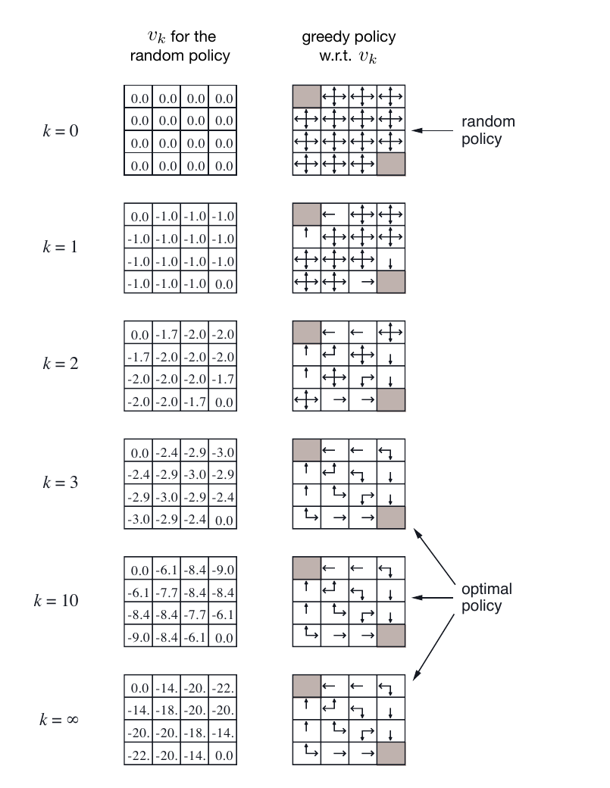

# 3.3 V(s)：

## 

****

- $V^\pi(s)$： $\pi$  $s$ 。
- ：“”“ + ”。
- ：， $V(s)$ 。
-  $V$  $Q$：，，。

 RL ：MDP ，$G_t$ ， $\pi$ 。，。****。****：，，。，“”，：**？**

**** $V^\pi(s)$ 。： $s$， $\pi$ ，？，$V^\pi(s)$ ，** $\pi$  $s$ **。 CartPole ，，；，，。

 $V^\pi(s)$  $s$ ，。****，：**，**。，，。

>  $\pi$，？，，“”“”？

::: info 
“”“”： $V^\pi$ ， $Q$ ，。
:::

****

$$
V^\pi(s)=\mathbb{E}_\pi\left[\sum_{k=0}^{\infty}\gamma^k r_{t+k}\mid s_t=s\right] \quad \text{（： $\pi$  $s$ ）}
$$

$$
V^\pi(s)=\sum_{a\in\mathcal{A}}\pi(a\mid s)\left[R(s,a)+\gamma\sum_{s'\in\mathcal{S}}P(s'\mid s,a)V^\pi(s')\right] \quad \text{（：）}
$$

$$
V^*(s)=\max_a\left[R(s,a)+\gamma\sum_{s'\in\mathcal{S}}P(s'\mid s,a)V^*(s')\right] \quad \text{（：）}
$$

> ** (State Value and Bellman Equation)：**
>
> - $V^\pi(s)$： $\pi$  $s$ （Value）， $s$  $\pi$ 。
> - $r_{t+k}$： $k$ （Reward）。
> - $\gamma$：（Gamma），（$0 \sim 1$）。
> - $\mathcal{A}$：，。 CartPole “”“”。
> - $\pi(a\mid s)$：（Policy）， $s$  $a$ 。
> - $P(s'\mid s,a)$：， $s$  $a$ ， $s'$ 。

。：

|            |                                  |
| -------------- | ---------------------------------------------- |
| $s_t$          |  $t$ ，、      |
| $a_t$          |  $t$ ，、    |
| $\mathcal{A}$  | ，                   |
| $r_t$          |  $t$                         |
| $\pi(a\mid s)$ |  $s$  $a$            |
| $\gamma$       | ，                   |
| $G_t$          |  $t$                 |
| $V^\pi(s)$     |  $s$ ， $\pi$  |

：

- $r_t$ 。，。
- $G_t$  $t$ ，。， $G_t$。
- $V^\pi(s)$ ， $s$ 、 $\pi$ ， $G_t$ 。

:::details G  V ？

。 $G_t$ ：

$$
G_t
=
\sum_{k=0}^{\infty}\gamma^k r_{t+k}
$$

，：

$$
G_t
=
r_t+\gamma r_{t+1}+\gamma^2 r_{t+2}
+\gamma^3 r_{t+3}
+\cdots
$$

， $\gamma=0.9$， $s$ ，，。：

$$
G_t
=
r_t+\gamma r_{t+1}+\gamma^2r_{t+2}
$$

， $2,4,6$。：

$$
G_t^{(1)}
=
\underbrace{2}_{r_t}
+
0.9\times \underbrace{4}_{r_{t+1}}
+
0.9^2\times \underbrace{6}_{r_{t+2}}
$$

：

$$
G_t^{(1)}
=
10.46
$$

， $2,1,-3$。：

$$
G_t^{(2)}
=
\underbrace{2}_{r_t}
+
0.9\times \underbrace{1}_{r_{t+1}}
+
0.9^2\times \underbrace{(-3)}_{r_{t+2}}
$$

：

$$
G_t^{(2)}
=
0.47
$$

， $r_t=2$，， $G_t$ 。 $V^\pi(s)$  $G_t$ ；，：

$$
V^\pi(s)\approx \frac{10.46+0.47}{2}=5.465
$$

，$r_t$ ，$G_t$ ， $V^\pi(s)$ ： $s$ ，。

:::

## ：

 MDP 、$G_t$ 、，$\pi$ 。，“”，。“”，“，”。

“”。，；** $s$ 、 $\pi$ ，**。，， $s$ ，， $G_t$。

： $s$ ， $G_t=10.46$， $G_t=0.47$。“”。 $\pi$ ， $60\%$， $40\%$，：

$$
V^\pi(s)=0.6\times 10.46+0.4\times 0.47=6.464
$$

，$G_t$ “”， $V^\pi(s)$ “， $s$，”。

**** $V^\pi(s)$： $G_t$ “”“** $s$ ，**”。， $G_t$  $s_t=s$ ：

：

$$
V^\pi(s)
=
\mathbb{E}_\pi[G_t\mid s_t=s]
$$

 $G_t$ ，：

$$
V^\pi(s)
=
\mathbb{E}_\pi
\left[
\sum_{k=0}^{\infty}\gamma^k r_{t+k}
\mid s_t=s
\right]
$$

：

1. $\sum_{k=0}^{\infty}\gamma^k r_{t+k}$：，。
2. $\gamma^k$：。$\gamma=0$ ，$\gamma$  1 。
3. $\mathbb{E}_\pi[\cdot]$：，。

：

$$
V^\pi(s) = \mathbb{E}_\pi\big[r_t + \gamma\, r_{t+1} + \gamma^2\, r_{t+2} + \gamma^3\, r_{t+3} + \cdots \mid s_t=s\big]
$$

：$r_t$ （），$\gamma\, r_{t+1}$ ，$\gamma^2\, r_{t+2}$ ……， $\gamma$ ，。 CartPole ： $r=+1$，$\gamma=0.9$， $V^\pi(s) \approx 1 + 0.9 + 0.81 + 0.729 + \cdots = \frac{1}{1-0.9} = 10$（）。

：**$V^\pi(s)$ ” $s$ ， $\pi$ ，”。**

 $\pi$？，，。，，。 $V^\pi(s)$ ， $V^\pi(s)$ 。RL ，。

## 

。 $\pi$  $s$ ， $s$ ，。，。，：$G_t = r_t + \gamma G_{t+1}$。 $V^\pi(s) = \mathbb{E}_\pi[G_t \mid s_t = s]$。，： $G_t$ ， $V^\pi(s)$ ？

。****。， $V^\pi(s)$ ， $G_t$ ，“”“ + ”。，：

 $V^\pi(s)$：。，：，？

：

1. ****：（），？
2. ****：，。，。

，1950 ，**·（Richard Bellman）** （Dynamic Programming），**（Principle of Optimality）**。：，**“”，“”**。

。 30 ，：“ =  + ”。，“”“”，。

，**（Bellman Equation）**。“”，。， DP、MC、TD 。

，”” $V^\pi(s)$ 。

### 

，。****。：，**，“”。**

，：

$$
\begin{aligned}
V^\pi(s) &= \mathbb{E}_\pi[G_t \mid s_t = s] \\
&= \mathbb{E}_\pi[r_t + \gamma r_{t+1} + \gamma^2 r_{t+2} + \dots \mid s_t = s] \\
&= \mathbb{E}_\pi[r_t \mid s_t = s] + \gamma \mathbb{E}_\pi[r_{t+1} + \gamma r_{t+2} + \dots \mid s_t = s] \\
&= r_\pi(s) + \gamma \mathbb{E}_\pi[G_{t+1} \mid s_t = s]
\end{aligned}
$$

 $r_\pi(s)$  $\pi$ ， $s$ 。：

$$
r_\pi(s)=\sum_a \pi(a\mid s)R(s,a)
$$

： $\mathbb{E}_\pi[G_{t+1} \mid s_t = s]$ “”， $V^\pi(s_{t+1})$。

**。**

：

- $\mathbb{E}_\pi[G_{t+1} \mid s_t = s]$ ：**（ $s_t$）** **（$G_{t+1}$）** 。，“”。
- $V^\pi(s_{t+1})$ ：**（ $s_{t+1}$）** 。，$s_{t+1}$ ， $V^\pi(s_{t+1})$ 。

，：

$$
\mathbb{E}_\pi[G_{t+1} \mid s_t = s] = V^\pi(s_{t+1})
$$

 $s_t=s$ ，。：

$$
\mathbb{E}_\pi[G_{t+1} \mid s_t = s]
=
\mathbb{E}_\pi[V^\pi(s_{t+1}) \mid s_t = s]
$$

（） $s_t$  $s_{t+1}$，，：****、**（Marginalization）**，——**（Markov Property）**。

:::details ：？

， $s_t$（）、$s_{t+1}$（） $G_{t+1}$（）。
：$\mathbb{E}_\pi[G_{t+1} \mid s_t] = \mathbb{E}_\pi[V^\pi(s_{t+1}) \mid s_t]$。

，：**？（$\mathbb{E}$）？**

>  $X$  $Y$。， $X$ （），？
> ：（16），（1/6），。：$\mathbb{E}[X] = \sum_x x \cdot P(x)$。。
> ：“，$Y$  6”。，$Y$ ****（）。 $Y=6$  $X$，，****。：$\mathbb{E}[X \mid Y] = \sum_x x \cdot P(x \mid Y)$。
>
> “ $\mathbb{E}$  $\sum$  $P$ ”，。： `|` ，“”。

**： $V^\pi(s_{t+1})$ **

，$V^\pi(s_{t+1})$  $s_{t+1}$  $\pi$ ， $G_{t+1}$ 。：
$V^\pi(s_{t+1}) = \mathbb{E}_\pi[G_{t+1} \mid s_{t+1}] = \sum_{G_{t+1}} G_{t+1} \cdot P_\pi(G_{t+1} \mid s_{t+1})$。

， $\mathbb{E}_\pi[V^\pi(s_{t+1}) \mid s_t]$，：

$$
\mathbb{E}_\pi[V^\pi(s_{t+1}) \mid s_t] = \mathbb{E}_\pi \left[ \sum_{G_{t+1}} G_{t+1} P_\pi(G_{t+1} \mid s_{t+1}) \;\middle|\; s_t \right]
$$

**： $s_{t+1}$ **

 $\mathbb{E}[\dots \mid s_t]$。，**（$s_{t+1}$）**。

“”， $s_{t+1}$ 。？：**，，**。

， $\mathbb{E}_\pi[\dots \mid s_t]$  $\sum_{s_{t+1}} (\dots) \cdot P_\pi(s_{t+1} \mid s_t)$：

$$
\begin{aligned}
\mathbb{E}_\pi[V^\pi(s_{t+1}) \mid s_t] &= \sum_{s_{t+1}} \underbrace{\left( \sum_{G_{t+1}} G_{t+1} P_\pi(G_{t+1} \mid s_{t+1}) \right)}_{\text{ } V^\pi(s_{t+1})} \cdot \underbrace{P_\pi(s_{t+1} \mid s_t)}_{\text{}} \\
&= \sum_{s_{t+1}} \sum_{G_{t+1}} G_{t+1} P_\pi(G_{t+1} \mid s_{t+1}) P_\pi(s_{t+1} \mid s_t)
\end{aligned}
$$

：， $P_\pi(s_{t+1} \mid s_t)$ 。

**：（！）**

 $P_\pi(G_{t+1} \mid s_{t+1})$。， $\pi$ ， $G_{t+1}$ **** $s_{t+1}$ ， $s_t$ 。
，，。， $s_t$，：$P_\pi(G_{t+1} \mid s_{t+1}) = P_\pi(G_{t+1} \mid s_{t+1}, s_t)$。：

$$
\mathbb{E}_\pi[V^\pi(s_{t+1}) \mid s_t] = \sum_{s_{t+1}} \sum_{G_{t+1}} G_{t+1} P_\pi(G_{t+1} \mid s_{t+1}, s_t) P_\pi(s_{t+1} \mid s_t)
$$

**：**

，。
：$P(A \mid B) = \frac{P(A, B)}{P(B)}$，“ B ，A ”“A  B ”“B ”。
，****：$P(A, B) = P(A \mid B) \cdot P(B)$。

 $C$ ，：
$P(A, B \mid C) = P(A \mid B, C) \cdot P(B \mid C)$。

， $G_{t+1}$  $A$，$s_{t+1}$  $B$，$s_t$  $C$。：$P_\pi(G_{t+1} \mid s_{t+1}, s_t) \cdot P_\pi(s_{t+1} \mid s_t) = P_\pi(G_{t+1}, s_{t+1} \mid s_t)$。
：

$$
\begin{aligned}
\mathbb{E}_\pi[V^\pi(s_{t+1}) \mid s_t] &= \sum_{s_{t+1}} \sum_{G_{t+1}} G_{t+1} P_\pi(G_{t+1}, s_{t+1} \mid s_t) \\
&= \sum_{G_{t+1}} G_{t+1} \sum_{s_{t+1}} P_\pi(G_{t+1}, s_{t+1} \mid s_t) \quad \text{()} \\
&= \sum_{G_{t+1}} G_{t+1} P_\pi(G_{t+1} \mid s_t) \quad \text{( $s_{t+1}$ ， $s_{t+1}$)} \\
&= \mathbb{E}_\pi[G_{t+1} \mid s_t] \quad \text{(！)}
\end{aligned}
$$

！：$\mathbb{E}_\pi[G_{t+1} \mid s_t] = \mathbb{E}_\pi[V^\pi(s_{t+1}) \mid s_t]$。
:::

，：

$$
\begin{aligned}
V^\pi(s) &= r_\pi(s) + \gamma \mathbb{E}_\pi[V^\pi(s_{t+1}) \mid s_t = s] \\
&= r_\pi(s) + \gamma \sum_{s_{t+1}} P_\pi(s_{t+1} \mid s_t = s) V^\pi(s_{t+1})
\end{aligned}
$$

****。 $X$  $Y$：

$$
\mathbb{E}[X \mid Y] = \sum_{x} x \cdot P(x \mid Y)
$$

： $x$， $Y$ ，。 $X$  $V^\pi(s_{t+1})$， $Y$  $s_t = s$，$s_{t+1}$ ，：

$$
\mathbb{E}_\pi[V^\pi(s_{t+1}) \mid s_t = s] = \sum_{s_{t+1}} V^\pi(s_{t+1}) \cdot P_\pi(s_{t+1} \mid s_t = s)
$$

： $s$ ， $\pi$ ， $P_\pi(s_{t+1} \mid s_t = s)$  $s_{t+1}$， $s_{t+1}$  $V^\pi(s_{t+1})$。，""。

：**，。**

### 

 $s$ 。——CartPole ，。，****：$V^\pi(s)$  $V^\pi(s_{t+1})$， $V^\pi(s_{t+1})$  $V^\pi(s)$。，****。

， $\pi$。，：

$$
r_\pi(s)=\sum_a \pi(a\mid s)R(s,a)
$$

$$
P_\pi(s'\mid s)=\sum_a \pi(a\mid s)P(s'\mid s,a)
$$

，$P_\pi$  $P(s'\mid s,a)$，“，”。

（$N$ ）， $N$ ：

$$
\underbrace{
\begin{pmatrix}
V^\pi(s_1) \\
V^\pi(s_2) \\
\vdots \\
V^\pi(s_N)
\end{pmatrix}
}_{\boldsymbol{v}_\pi}
=
\underbrace{
\begin{pmatrix}
r_\pi(s_1) \\
r_\pi(s_2) \\
\vdots \\
r_\pi(s_N)
\end{pmatrix}
}_{\boldsymbol{r}_\pi}
+ \gamma
\underbrace{
\begin{pmatrix}
P_\pi(s_1 \mid s_1) & P_\pi(s_2 \mid s_1) & \dots & P_\pi(s_N \mid s_1) \\
P_\pi(s_1 \mid s_2) & P_\pi(s_2 \mid s_2) & \dots & P_\pi(s_N \mid s_2) \\
\vdots & \vdots & \ddots & \vdots \\
P_\pi(s_1 \mid s_N) & P_\pi(s_2 \mid s_N) & \dots & P_\pi(s_N \mid s_N)
\end{pmatrix}
}_{\boldsymbol{P}_\pi}
\underbrace{
\begin{pmatrix}
V^\pi(s_1) \\
V^\pi(s_2) \\
\vdots \\
V^\pi(s_N)
\end{pmatrix}
}_{\boldsymbol{v}_\pi}
$$

：

- $\boldsymbol{v}_\pi$  $N \times 1$ ， $\pi$ 。
- $\boldsymbol{r}_\pi$  $N \times 1$ ， $\pi$ 。
- $\boldsymbol{P}_\pi$  $N \times N$ ，、。

，，：

$$
\boldsymbol{v}_\pi = \boldsymbol{r}_\pi + \gamma \boldsymbol{P}_\pi \boldsymbol{v}_\pi
$$

:::details  $\boldsymbol{v}_\pi$，“”？

：，，：

$$
V^\pi(s)
=
r_\pi(s)
+
\gamma\sum_{s'}P_\pi(s'\mid s)V^\pi(s')
$$

 $V^\pi(s)$， $V^\pi(s')$。， $\boldsymbol{v}_\pi$？

：，。， $s_i$。：

$$
V^\pi(s_i)
=
r_\pi(s_i)
+
\gamma\sum_j P_\pi(s_j\mid s_i)V^\pi(s_j)
$$

：

|  |                          |
| ------------------ | ---------------------------------------- |
|  $s$       |  $i$ ， $s_i$  |
|  $s'$      |  $j$ ， $s_j$        |
| $P_\pi(s'\mid s)$  |  $P_\pi(s_j\mid s_i)$            |
| $V^\pi(s')$        |  $j$  $V^\pi(s_j)$   |

， $\boldsymbol{v}_\pi$，：

$$
\boldsymbol{P}_\pi\boldsymbol{v}_\pi
$$

$\boldsymbol{v}_\pi$ “”：

$$
\boldsymbol{v}_\pi=
\begin{pmatrix}
V^\pi(s_1)\\
V^\pi(s_2)\\
\vdots\\
V^\pi(s_N)
\end{pmatrix}
$$

“、”， $\boldsymbol{P}_\pi$。 $i$ ：

$$
(\boldsymbol{P}_\pi\boldsymbol{v}_\pi)_i
=
\sum_j P_\pi(s_j\mid s_i)V^\pi(s_j)
$$

：

$$
\sum_{s'}P_\pi(s'\mid s_i)V^\pi(s')
$$

 $s_1$ ：

$$
(\boldsymbol{P}_\pi\boldsymbol{v}_\pi)_1
=
P_\pi(s_1\mid s_1)V^\pi(s_1)
+
P_\pi(s_2\mid s_1)V^\pi(s_2)
+
\cdots
+
P_\pi(s_N\mid s_1)V^\pi(s_N)
$$

“ $s_1$ ，”。 $s_2$， $V^\pi(s_2)$； $s_1$， $V^\pi(s_1)$。 $\boldsymbol{v}_\pi$ ，。

：

-  $\boldsymbol{v}_\pi$：。
-  $\boldsymbol{v}_\pi$：。
-  $\boldsymbol{P}_\pi$：“”，。
-  $\boldsymbol{P}_\pi\boldsymbol{v}_\pi$：，。

“”，：

$$
\text{}=\text{}+\gamma\times\text{}
$$

:::

 $\boldsymbol{v}_\pi$ ， $\boldsymbol{v}_\pi$：

$$
\begin{aligned}
\boldsymbol{v}_\pi - \gamma \boldsymbol{P}_\pi \boldsymbol{v}_\pi &= \boldsymbol{r}_\pi \\
(\boldsymbol{I} - \gamma \boldsymbol{P}_\pi) \boldsymbol{v}_\pi &= \boldsymbol{r}_\pi \\
\boldsymbol{v}_\pi &= (\boldsymbol{I} - \gamma \boldsymbol{P}_\pi)^{-1} \boldsymbol{r}_\pi
\end{aligned}
$$

（： $\boldsymbol{I}$ 。）

， $\pi$ **（Analytic Solution）**。，（） $\pi$ ，。

**，？**

。 $(\boldsymbol{I} - \gamma \boldsymbol{P}_\pi)$ ， $O(N^3)$。（ $10^{170}$ ），。，“”。，（DP）、（MC）（TD）****。

##  Q(s,a)

：“， $\pi$ ，？”  $V^\pi(s)$。，。：$V^\pi(s)$ ****，“”。

：，$V^\pi(s)$ “”。：**，？** “”，“，”。CartPole ：，，，。

，：** $s$ ， $a$， $\pi$ ，？**  **Q **（Q-function），****。

 $V^\pi(s)$ ，$Q^\pi(s,a)$ ： $a$。：

::: info V  Q 

|        | $V^\pi(s)$                                  | $Q^\pi(s,a)$                                                    |
| ------------ | ------------------------------------------- | --------------------------------------------------------------- |
|      |  $s$， $\pi$ ，？ |  $s$，** $a$**， $\pi$ ，？ |
|  | ， $\pi$        |  $a$                                            |
|    |  $\pi$                  |                                                 |
|      | ？                        | ？                                        |

:::

，$V$ “”，$Q$ “”。。

**Q **：

$$
Q^\pi(s_t, a_t) = \mathbb{E}_\pi[G_t \mid s_t, a_t]
$$

 $Q^\pi(s_t,a_t)$： $s_t$， $a_t$， $\pi$ ， $G_t$ 。

**V  Q **：$V$ “，”；$Q$ “，”。

 $s_t$。：。 $\pi$ ，、：

|  $a_t$ |  $\pi(a_t\mid s_t)$ |  $Q^\pi(s_t,a_t)$ |  $V^\pi(s_t)$  |
| ---------- | ------------------------------- | ------------------------- | ---------------------- |
|        | $0.7$                           | $10$                      | $0.7\times 10=7$       |
|        | $0.3$                           | $4$                       | $0.3\times 4=1.2$      |

 $Q^\pi(s_t,\text{})=10$，：**， $\pi$ ， 10 **。$Q^\pi(s_t,\text{})=4$， 4 。

 $V^\pi(s_t)$ “”，“ $\pi$ ，”。：

$$
0.7 \times 10 + 0.3 \times 4 = 8.2
$$

，：

$$
V^\pi(s_t)=8.2
$$

，$V^\pi(s_t)$ ， $Q^\pi(s_t,a_t)$ ：

$$
V^\pi(s_t) = \sum_{a_t \in \mathcal{A}} \pi(a_t \mid s_t) Q^\pi(s_t, a_t)
$$

，$Q^\pi(s,a)$ ： $a$ ，。

$$
\begin{aligned}
Q^\pi(s_t, a_t) &= \mathbb{E}_\pi[G_t \mid s_t, a_t] \\
&= \mathbb{E}_\pi[r_t + \gamma G_{t+1} \mid s_t, a_t] \\
&= R(s_t, a_t) + \gamma \mathbb{E}_\pi[G_{t+1} \mid s_t, a_t] \\
&= R(s_t, a_t) + \gamma \mathbb{E}_\pi[V^\pi(s_{t+1}) \mid s_t, a_t] \\
&= R(s_t, a_t) + \gamma \sum_{s_{t+1} \in \mathcal{S}} P(s_{t+1} \mid s_t, a_t) V^\pi(s_{t+1})
\end{aligned}
$$

： $a_t$  =  $a_t$  +  $a_t$ 。

## 

 $V$  $Q$ ，，****。

 $V$  $Q$ ， $Q^\pi(s_t, a_t)$ ：

$$
\begin{aligned}
V^\pi(s_t)
&= \sum_{a_t \in \mathcal{A}} \pi(a_t \mid s_t) Q^\pi(s_t,a_t) \\
&= \sum_{a_t \in \mathcal{A}} \pi(a_t \mid s_t)
\left[
R(s_t, a_t)
+ \gamma \sum_{s_{t+1} \in \mathcal{S}} P(s_{t+1} \mid s_t, a_t) V^\pi(s_{t+1})
\right]
\end{aligned}
$$

，：

|    |                      |                                   |
| ------ | ------------------------------ | ----------------------------------------- |
|  |            | $\sum_{a_t} \pi(a_t \mid s_t)$            |
|  |  | $\sum_{s_{t+1}} P(s_{t+1} \mid s_t, a_t)$ |

::: info ：
 5 ，。。 1 ， $-1$；， $0$。

。：** 5 ，， 0。**

|   |                |  |
| ----- | -------------------------- | ---- |
| 5 | ，       | $0$  |
| 4 | 5：$-1 + 0$    | $-1$ |
| 3 | 4：$-1 + (-1)$ | $-2$ |
| 2 | 3：$-1 + (-2)$ | $-3$ |
| 1 | 2：$-1 + (-3)$ | $-4$ |

：

$$
[-4,\,-3,\,-2,\,-1,\,0]
$$

：**，“ + ”。** 。
:::

## 

：**“ $\pi$ ， $s_t$ ？”**
 RL ****。：**“， $s_t$ ？”**

 $V^*(s_t)$  $Q^*(s_t, a_t)$。
， $Q^*(s_t, a_t)$ ：

$$
V^*(s_t) = \max_{a_t \in \mathcal{A}} Q^*(s_t, a_t)
$$

， $Q^*(s_t, a_t)$ （）：

$$
Q^*(s_t, a_t) = R(s_t, a_t) + \gamma \sum_{s_{t+1} \in \mathcal{S}} P(s_{t+1} \mid s_t, a_t) V^*(s_{t+1})
$$

 $Q^*(s_t, a_t)$  $V^*(s_t)$ ，****：

$$
V^*(s_t) = \max_{a_t \in \mathcal{A}} \left[ R(s_t, a_t) + \gamma \sum_{s_{t+1} \in \mathcal{S}} P(s_{t+1} \mid s_t, a_t) V^*(s_{t+1}) \right]
$$

，：**（）（$\max$）**。

- **** $\sum_{a_t} \pi(a_t \mid s_t)$：。
- **** $\max_{a_t}$：，。，（ $\arg\max_{a_t} Q^*(s_t,a_t)$ ）。

。 $s$，：。：

|  |  |  |
| -------- | -------- | -------- |
|      | $+1$     | $s_R$    |
|      | $+0$     | $s_L$    |

“，”。：

|  |  $\pi$  |  |
| ---------- | --------------------------- | ------------------------ |
| $s_R$      |  $5$              |  $7$           |
| $s_L$      |  $2$              |  $4$           |

： $s_R$， $\pi$ 、， $5$； $s_R$ ， $7$。 $s_L$， $2$；， $4$。

 $Q$ 。 $\pi$。$Q^\pi(s,a)$ ：** $a$， $\pi$ **。

|  |  |  |  $\pi$  | $Q^\pi$                    |
| ---- | ---- | -------- | --------------------- | -------------------------- |
|  | $+1$ | $s_R$    | $5$                   | $Q^\pi(s,\text{})=1+5=6$ |
|  | $+0$ | $s_L$    | $2$                   | $Q^\pi(s,\text{})=0+2=2$ |

 $\pi$  $s$ ， $40\%$ 、$60\%$ ， $Q^\pi$ ：

$$
V^\pi(s)=0.4\times Q^\pi(s,\text{})+0.6\times Q^\pi(s,\text{})
=0.4\times 6+0.6\times 2=3.6
$$

。$Q^*(s,a)$ ：** $a$，**。 $s_R$  $7$， $5$：

|  |  |  |  | $Q^*$                    |
| ---- | ---- | -------- | ------------------ | ------------------------ |
|  | $+1$ | $s_R$    | $7$                | $Q^*(s,\text{})=1+7=8$ |
|  | $+0$ | $s_L$    | $4$                | $Q^*(s,\text{})=0+4=4$ |

， 8， 4，：

$$
V^*(s)=\max_a Q^*(s,a)=\max(8,4)=8
$$

：

|              |  Q |                    |  V |
| ---------------- | ------------ | ---------------------------------- | ---------- |
|  $V^\pi$ | $Q^\pi$      | ：$0.4$ 、$0.6$  | $3.6$      |
|  $V^*$   | $Q^*$        | ：$\max_a Q^*(s,a)$      | $8$        |

“”， $Q^\pi$ ；“，”， $Q^*$ 。

## ：

， $V^\pi(s)$ ，。： $\pi$ ，“ + ”。

，****，——“ $V$ ”。，；， $V(s)$ 。

，，，、——****。

，，。 $S,M,G$，：

|  $s$ |  $V(s)$ |                          |
| -------- | --------------- | ---------------------------- |
| $S$      | $0$             |  $S$     |
| $M$      | $0$             |  $M$     |
| $G$      | $0$             | ， |

“ $\rightarrow$ ”，****。， $V$ 。， $\boldsymbol{v}$；， NumPy 、Python 、，。

，****（tabular methods）。，：，-，[^3]。“”；。

：

- ****：，“、、、”。，；，。
- ****：，“，”。

。 Sutton  Barto  Gridworld 。 GridWorld ：，， $V_k(s)$ 。

 $k=0,1,2,3,10,\infty$ ；，。



<p align="center">
  <em>：Sutton and Barto, <a href="http://incompleteideas.net/book/RLbook2020.pdf" target="_blank" rel="noopener noreferrer">Reinforcement Learning: An Introduction</a>, 2nd ed., Figure 4.1。 CC BY-NC-ND 2.0 。</em>
</p>

。$k=0$ ，， 0 ；，，。“”，“，，”。

，：

**：**

|  |  |  |  |
| -------- | ---- | -------- | ---- |
| $S$      |  | $M$      | $-1$ |
| $M$      |  | $G$      | $-1$ |
| $G$      |  |        | $0$  |

**：**

|  $s$ |  $V(s)$ |                       |
| -------- | --------------- | ------------------------- |
| $S$      | $-2$            |  $S$  |
| $M$      | $-1$            |  $M$  |
| $G$      | $0$             | ，  |

，“”；，。，， $P(s'\mid s,a)$。，。，；，。

， $-2,-1,0$ 。， 0：

|  $s$ |  $V(s)$ |
| -------- | --------------- |
| $S$      | $0$             |
| $M$      | $0$             |
| $G$      | $0$             |

 0  0 ，“， 0 ”。 DP、MC、TD ，， $V^\pi$。

：——****。，；，，。

。；“-”， $Q(s,a)$。 3.5  Q ，“”“”。 TD [^4]；Q-learning 、[^5]。

### 

：，。：？

。，“”：

$$
V^\pi(s)=
\sum_a\pi(a\mid s)
\left[
R(s,a)+\gamma\sum_{s'}P(s'\mid s,a)V^\pi(s')
\right].
$$

 $V^\pi$，。 $V^\pi$， $V_k$。：**，**。

，：

- ****：“”，： $s$  $a$ ， $s'$，。 $P(s'\mid s,a)$  $R(s,a)$，。
- ****：，，。

。

 $\pi$， $V_k$。 $V^\pi$， $V_k(s')$ ：

$$
\text{BellmanTarget}_k(s)=
\sum_a\pi(a\mid s)
\left[
R(s,a)+\gamma\sum_{s'}P(s'\mid s,a)V_k(s')
\right].
$$

：

-  $\sum_{s'}P(s'\mid s,a)V_k(s')$，“ $a$ ，”。
-  $\sum_a\pi(a\mid s)$， $\pi$ 。
-  $R(s,a)$  $\gamma$ ，“ $s$ ”。

：

$$
V_{k+1}(s)\leftarrow \text{BellmanTarget}_k(s).
$$

， $V_{k+1}$。 **Bellman backup（）**：，。

，：

$$
V(s)\leftarrow V(s)+\alpha\left[\text{BellmanTarget}_k(s)-V(s)\right].
$$

 $\alpha$ 。$\alpha=1$ ；$\alpha=0.1$  10%。，，：**，**。

。，：， $s$。

|  $s$ |  $V(s)$ |
| -------- | --------------- |
| $s$      | $0$             |

 A，， $s$。： A。：

> ，，？

：

- ，。
-  A 。
- A  60%  $+1$，40%  $-1$。
-  $\gamma=0.9$。

：

$$
R=0.6\times(+1)+0.4\times(-1)=0.2
$$

，， $V(s)$。，：

$$
V(s)=0.2+0.9V(s)
$$

****：，$V(s)-0.9V(s)=0.2$， $V(s)=2.0$。 $2.0$ ， $s$ ，“，”。

****：（）， $V_0(s)=0$ ，， $s$ ：

$$
V_{k+1}(s)\leftarrow R+\gamma V_k(s)
$$

：

|     |               |  $V(s)$  |
| ------- | --------------------- | ------------------ |
|     | -                     | $0$                |
|  1  | $0.2+0.9\times0$      | $0.2$              |
|  2  | $0.2+0.9\times0.2$    | $0.38$             |
|  3  | $0.2+0.9\times0.38$   | $0.542$            |
|  4  | $0.2+0.9\times0.542$  | $0.6878$           |
|  5  | $0.2+0.9\times0.6878$ | $0.81902$          |

“ $0.2$ + ”。，；，。 $2.0$ ，。

```python
R = 0.2
gamma = 0.9
V = 0.0

for i in range(50):
    V = R + gamma * V

print(round(V, 6))
```

:::output
1.998698
:::

：，，。 $\pi$ ，；“”“”，。

### ：TD 

。 $V(s)=0.2+0.9V(s)$，： $0.2$，。，，“”。

。，。，，。TD ：，“”“”。

，。 DP、MC、TD ，。：**，；TD **。

。， Bellman target：

$$
\sum_a\pi(a\mid s)
\left[
R(s,a)+\gamma\sum_{s'}P(s'\mid s,a)V(s')
\right].
$$

 $R(s,a)$ ，；$P(s'\mid s,a)$ ，。：、，。

TD 。，： $r$， $s'$。：

$$
\text{Target} = r + \gamma V(s')
$$

 $r$  $s'$，：，。 target ，；，。

：

|               |          |                                | target         |
| ----------------- | ------------------ | -------------------------------------------- | -------------------- |
|  Bellman  |  $R(s,a)$  |  $s'$， $P(s'\mid s,a)$  |              |
| TD            |  $r$ |  $s'$                        |  |

。 $s$ ，：

|  |  |  |  |
| -------- | ---- | ---------- | ------------ |
| $s_1$    | 70%  | $+1$       | $V(s_1)=5$   |
| $s_2$    | 30%  | $-1$       | $V(s_2)=0$   |

 $\gamma=0.9$。，：

$$
\text{BellmanTarget}
=0.7\times(1+0.9\times5)+0.3\times(-1+0.9\times0)
=3.55.
$$

 Bellman ：， $s$ ，， $3.55$。

TD 。， 70%  30% 。“”，：，。“ $s_1$、 $s_2$”， $s$ ， $s_1$， $s_2$。，TD 。

 $V(s)=3$， $\alpha=0.1$。

 $s_1$， $r=1$，TD ：

$$
\text{TD Target}=1+0.9\times5=5.5,
$$

$$
\delta=5.5-3=2.5,
$$

 $V(s)$ ：

$$
V(s)\leftarrow 3+0.1\times2.5=3.25.
$$

 $s_2$， $r=-1$，TD ：

$$
\text{TD Target}=-1+0.9\times0=-1,
$$

$$
\delta=-1-3=-4,
$$

 $V(s)$ ：

$$
V(s)\leftarrow 3+0.1\times(-4)=2.6.
$$

：

|     | TD Target | TD  $\delta$ |  $V(s)$ |
| --------------------- | --------- | ---------------- | ------------- |
|  $s_1$， $+1$ | $5.5$     | $2.5$            | $3.25$        |
|  $s_2$， $-1$ | $-1$      | $-4$             | $2.6$         |

：**TD **。

， Bellman target  $3.55$， $V(s)=3$， $0.55$。 $s_1$， $3.25$， $3.55$； $s_2$， $2.6$， $3.55$ 。

， TD 。TD ，“”，“”。，。

：

$$
0.7\times3.25+0.3\times2.6=3.055.
$$

， $V(s)=3$ ， TD “” $3.055$。 $3.55$， $3$  $3.55$ 。

， TD ：

$$
0.7\times2.5+0.3\times(-4)=0.55.
$$

 TD ，， $V(s)=3$ ，。。

“ 70%  30% ”，：TD 。，。， Bellman 。

 $\delta$ ****（Temporal Difference Error， TD Error）。“”“”：

$$
\delta = \underbrace{r + \gamma V(s')}_{\text{Bellman target}} - \underbrace{V(s)}_{\text{}}
$$

“”？： $s$ ， $s'$  $r+\gamma V(s')$ 。

：

| TD Error   |                             |   |
| ---------- | ------------------------------- | ----------- |
| $\delta>0$ | target ， |  $V(s)$ |
| $\delta<0$ | target ， |  $V(s)$ |
| $\delta=0$ |  target     |   |

：

$$
V(s)\leftarrow V(s)+\alpha\delta.
$$

 $3.25$  $2.6$， $\alpha=0.1$ 。

 TD ：，“ + ”。，， $V^\pi$。

DP、MC、TD ， [：DP、MC  TD](./dp-mc-td) 。

## 

，：

1. $V^\pi(s)$  $s$ ， $\pi$ 。
2. ：$G_t=r_t+\gamma G_{t+1}$。
3. ：。
4. ，。
5. ，。
6. ， $V(s)$ ，。
7. ， Bellman target  TD Error  $V(s)$。

$V(s)$ “”，。

：**， $V$？**  $P(s'\mid s,a)$  $R(s,a)$，。 DP、MC、TD，。

：**$V$ 。**  $V(s)=80$，，、，。：

$$
Q(s,a)
$$

 $Q$。： $V(s)$ ， $Q(s,a)$ “ $s$  $a$”。，， $V$ ；， $Q$ ，。

： [DP、MC  TD](./dp-mc-td)，“ $V$”；[](./value-q)，“”。

## 

[^1]: Bellman, R. (1957). _Dynamic Programming_. Princeton University Press.

[^2]: Puterman, M. L. (1994). _Markov Decision Processes: Discrete Stochastic Dynamic Programming_. John Wiley & Sons.

[^3]: Sutton, R. S., & Barto, A. G. (2018). _Reinforcement Learning: An Introduction_ (2nd ed.). MIT Press.  Part I  “Tabular Solution Methods”， 4  Figure 4.1  Gridworld 。MIT Press Open Access ：<https://mitpress.mit.edu/9780262039246/reinforcement-learning/>； PDF：<http://incompleteideas.net/book/RLbook2020.pdf>。

[^4]: Sutton, R. S. (1988). Learning to predict by the methods of temporal differences. _Machine Learning_, 3(1), 9-44. DOI: <https://doi.org/10.1007/BF00115009>.

[^5]: Watkins, C. J. C. H., & Dayan, P. (1992). Q-learning. _Machine Learning_, 8, 279-292. DOI: <https://doi.org/10.1007/BF00992698>；：<https://www.gatsby.ucl.ac.uk/~dayan/papers/wd92.html>.
