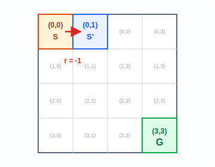
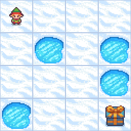
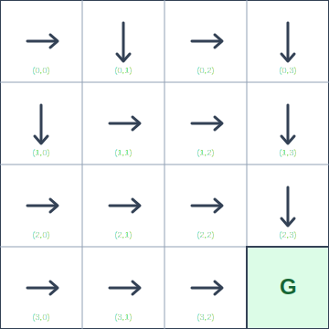
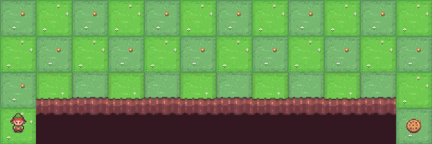

# 3.5  Q  Q-Learning

****

****

- ** V **：，。
- **（Q ）**："-"。
- **（）**： $\pi$，； $Q$ 。
- ****： Q 。
- **Q-Learning**：， TD Target，。
- **Off-policy **：，。

 DP、MC、TD 。**** $V(s)$：，，。

。""，"，"。，：。，、、。

。 CartPole ，"，"。。，：

-  $s$ ， $a_1$，，；
-  $a_2$，，。

，""，"，"。 $Q(s,a)$ 。

， $V^\pi$ 。 $\pi$， $s$  $a$， $R(s,a)$， $P(s'\mid s,a)$  $s'$。， $V^\pi(s')$ 。：

$$
Q^\pi(s,a) = R(s,a) + \gamma \sum_{s'} P(s'|s,a) \, V^\pi(s'),
$$

：""，""。， $R$  $P$。，；， $r$  $s'$。

，： $P$  $R$ ， $V(s)$ ，**-**。""""。， $Q$ 。

 $Q(s,a)$，：

$$
\pi(s) = \operatorname*{arg\,max}_a Q(s,a).
$$

::: info 
：**$Q(s,a)$**  **Q-Learning**。

$Q(s,a)$ ****，****。 $V(s)$， $Q(s,a)$。，$Q(s,a)$ ""，"，，"。

，**Q-Learning**（Watkins & Dayan, 1992）**、（off-policy） TD **： $Q(s,a)$， $\max_{a'} Q(s',a')$ “”， $Q^*$[^2][^3]。

，Q-Learning  $Q$ 。 $(s,a,r,s')$，" +  Q "；， Q ，。
:::

****

$$
Q^\pi(s,a)=\mathbb{E}_\pi[G_t\mid S_t=s,A_t=a]
\quad \text{（：，）}
$$

$$
Q^*(s,a) = \mathbb{E}\left[ r+\gamma\max_{a'}Q^*(s',a') \mid s,a \right]
\quad \text{（： Q ）}
$$

$$
Q(s,a) \leftarrow Q(s,a) + \alpha\left[ r+\gamma\max_{a'}Q(s',a')-Q(s,a) \right]
\quad \text{（Q-Learning ：）}
$$

> **：**
>
> - **** $Q(s,a)$ ： $s$  $a$， $\pi$ ，。
> - ********： Q ，" + "。
> - ********：， Q ，。

<span id="q-function"></span>

##  Q(s,a)

::: info ：（Action）（Policy）

- ****、。 $(0,0)$，“”，。“”。
- ****“”。，，（），。， $\pi(s)$ 。

，；，。
:::

**** $Q(s,a)$。“-”，“ $s$  $a$，”。， $V(s)$， $P(s'\mid s,a)$ ；，。

****

 $V(s)$ “”， $Q(s,a)$ ：**，。** ，$V$ “”， $Q$ “，”。

、，$Q(s,a)$ ：

|  $s$ |  |  |  |  |
| -------- | ------ | ------ | ------ | ------ |
| $(0,0)$  | -5.1   | -4.6   | -4.6   | -5.2   |
| $(0,1)$  | -4.2   | -3.4   | -3.8   | -4.8   |

：**，，“，，”。** 

$$
Q((0,0), \text{})=-4.6
$$

： $(0,0)$，，， $-4.6$。，。

，。 $s$，“”，。，。

 $(0,0)$， $Q$ ： $-5.1$、 $-4.6$、 $-4.6$、 $-5.2$。，，“”“”“”“”。

** Q **

$$
\pi(s) = \operatorname*{arg\,max}_a Q(s,a).
$$

： $s$ ， $Q$ ，。，$Q(s,a)$ ，$\arg\max$ 。，，。

“”，****。，，： $Q(s,a)$ ，。

，。，，。“ Q ”，、。

****

，$Q^\pi(s,a)$ ：

$$
Q^\pi(s,a)
= \mathbb{E}_\pi \bigl[G_t \mid S_t=s, A_t=a\bigr]
= \mathbb{E}_\pi \bigl[R_{t+1} + \gamma R_{t+2} + \gamma^2 R_{t+3} + \cdots \mid S_t=s, A_t=a\bigr].
$$

 $S_t=s,A_t=a$ ：。，$Q^\pi(s,a)$ ： $s$  $a$， $\pi$ ，。，

$$
R_{t+1} + \gamma R_{t+2} + \gamma^2 R_{t+3} + \cdots .
$$

<span id="bellman-optimal"></span>

## 

 $Q^\pi(s,a)$ ，：，，？

。 $Q^*(s,a)$ ： $s$  $a$，，。，，；"" $s'$ 。 $s'$， Q ， $Q^*(s',a')$ 。

，$Q^*(s,a)$ ：

$$
Q^*(s,a) = \mathbb{E}\left[ r + \gamma \max_{a'} Q^*(s',a') \mid s,a \right].
$$

 $Q$ ****。：

- $r$ ；
- $\gamma\max_{a'}Q^*(s',a')$ ， $\gamma$ 。

 Q-Learning ： Q 。 $Q^*(s,a)$，"，"。，；，。

Q-Learning ，，， $Q$ 。

<span id="q-learning-update"></span>

## Q-Learning 

，。， $s'$ ； Q-Learning ，。：

$$
(s,a,r,s').
$$

，： $Q(s,a)$ " + "。， Q ：

$$
\text{target} = r + \gamma \max_{a'} Q(s',a').
$$

。，target  $(r,s')$， $P(s'\mid s,a)$。，target  $\max_{a'}Q(s',a')$  Q 。""**（bootstrapping）**。

，。 Q-Learning  TD ：

$$
\delta = \text{target} - Q(s,a).
$$

 $\delta>0$， $Q(s,a)$ ，； $\delta<0$，，。 $\alpha$ ，：

$$
Q(s,a) \leftarrow Q(s,a) + \alpha \delta.
$$

 target  TD ， Q-Learning ：

$$
Q(s,a) \leftarrow Q(s,a) + \alpha\left[ r + \gamma \max_{a'} Q(s',a') - Q(s,a) \right].
$$

：

1. ， $(s,a,r,s')$；
2.  $r+\gamma\max_{a'}Q(s',a')$ ""；
3. ， $\alpha$ 。

 TD 

$$
V(s) \leftarrow V(s) + \alpha[r + \gamma V(s') - V(s)]
$$

，Q-Learning  $V$  $Q$。，target  $V(s')$  $\max_{a'}Q(s',a')$。 Q-Learning ，""。，，。

<span id="numerical-example"></span>

## GridWorld：

 4×4 GridWorld ， $-1$， $\gamma=0.9$，Q  0。 $(0,0)$ ， $(0,1)$， $r=-1$。



Gymnasium  FrozenLake-v1  4×4 ，：



<p align="center">
  <em>：<a href="https://gymnasium.farama.org/environments/toy_text/frozen_lake/" target="_blank" rel="noopener noreferrer">Gymnasium Documentation - Frozen Lake</a></em>
</p>

： $(0,0)$，""， $(0,1)$。： $-1$。，Q-Learning ：$Q((0,0), \text{})$。 $(0,0)$ ""、""、""，。

：？Q-Learning ，，。 Q  0， $(0,1)$，， 0：

$$
\max_{a'}Q((0,1), a') = 0
$$

，：

$$
\text{target} = -1 + 0.9 \times 0 = -1
$$

： 1 ，，"" $-1$。

 Q-Learning  0  $-1$。。 $\alpha=0.1$，：

$$
Q((0,0), \text{}) = 0 + 0.1 \times (-1 - 0) = -0.1
$$

，，： $(0,0)$ ，。；， Q ， Q 。， Q 。

<span id="code"></span>

### 

 RL  Q-Learning 。

```python
import numpy as np

rng = np.random.default_rng(0)

N = 4
START = (0, 0)
GOAL = (3, 3)
ACTIONS = [(-1, 0), (0, 1), (1, 0), (0, -1)]  # 、、、
ARROWS = np.array(["↑", "→", "↓", "←"])

def to_state(pos):
    return pos[0] * N + pos[1]

def to_pos(state):
    return divmod(state, N)

def step(state, action):
    row, col = to_pos(state)
    if (row, col) == GOAL:
        return state, 0, True

    dr, dc = ACTIONS[action]
    next_row = min(max(row + dr, 0), N - 1)
    next_col = min(max(col + dc, 0), N - 1)
    next_state = to_state((next_row, next_col))
    done = (next_row, next_col) == GOAL
    return next_state, -1, done

Q = np.zeros((N * N, len(ACTIONS)))
alpha = 0.1
gamma = 0.9
epsilon0 = 0.3

for episode in range(2000):
    state = to_state(START)
    # 
    epsilon = max(0.02, epsilon0 * (0.995**episode))

    for _ in range(100):
        # 1. （）
        if rng.random() < epsilon:
            action = int(rng.integers(len(ACTIONS)))
        else:
            best_actions = np.flatnonzero(Q[state] == Q[state].max())
            action = int(rng.choice(best_actions))

        # 2. 
        next_state, reward, done = step(state, action)

        # 3.  TD Target  Q 
        bootstrap = 0 if done else Q[next_state].max()
        target = reward + gamma * bootstrap
        Q[state, action] += alpha * (target - Q[state, action])

        state = next_state
        if done:
            break

print(" Q ：")
print(dict(zip(ARROWS, Q[to_state(START)].round(3))))

print("\n：")
for row in range(N):
    cells = []
    for col in range(N):
        if (row, col) == GOAL:
            cells.append("G")
        else:
            state = to_state((row, col))
            cells.append(ARROWS[int(Q[state].argmax())])
    print(" ".join(cells))
```

：

```text
 Q ：
{'↑': -4.797, '→': -4.686, '↓': -4.686, '←': -4.919}
```

：



 Q  $-4.686$，（6 ）：

$$
-1 - 0.9 - 0.9^2 - 0.9^3 - 0.9^4 - 0.9^5 = -4.68559.
$$

Q-Learning 。，—— TD  $V(s)$ 。

<span id="exploration"></span>

****

： Q  0， Q —— Q ，。，。

**（Exploration）**：， Q 。 **$\varepsilon$-**： $1-\varepsilon$ ， $\varepsilon$ 。$\varepsilon$ ，、。

$\varepsilon$-：** Q **。

- ****：$\varepsilon$-，；
- ****：， $\max_{a'} Q(s',a')$，。

**** **Off-policy（）**。Q-Learning ，****，。

<span id="cliff-walking"></span>

**：Q-Learning  SARSA**

 Off-policy  On-policy ，：**（Cliff Walking）**。 Sutton & Barto ， Gymnasium 。

 4  × 12 。 S ， G。、、、。

|      |                                         |
| -------- | ------------------------------------------- |
|      |  S（ 4  1 ）                  |
|      |  G（ 4  12 ）                 |
|    |  $-1$                                   |
|  |  $-100$， S，episode  |
|      | ， $-1$                         |
|      |  G  episode                       |

 S  G ， 11 。——，， 100 。



<p align="center">
  <em>：<a href="https://gymnasium.farama.org/environments/toy_text/cliff_walking/" target="_blank" rel="noopener noreferrer">Gymnasium Documentation - Cliff Walking</a>， Sutton and Barto, <em>Reinforcement Learning: An Introduction</em>, Example 6.6。</em>
</p>

**Q-Learning**（Off-policy） $\max_{a'} Q(s',a')$，，。

**SARSA**（On-policy） $r + \gamma Q(s', a')$， $a'$ （$\varepsilon$-）。 SARSA ，，。

""：

- Q-Learning ****，；
- SARSA ****，。

，。Q-Learning "，"；SARSA "，"。

<span id="limitations"></span>

## 

，Q-Learning ：，，，4×4 GridWorld 。

：**，。**

4×4 GridWorld  16  × 4  = 64  Q 。，，。，，。。

，Q-Learning —— TD ——"-"。 4 ：，"" Q ？ Q （DQN）。

：[DP、MC  TD](./dp-mc-td) | ：[](./policy-objective)

****

- ** $Q(s,a)$** -， Q ，。
- **Q-Learning**  TD  $r+\gamma\max_{a'}Q(s',a')$  Q ，。
- **$\varepsilon$-** $\varepsilon$ 、 $1-\varepsilon$ ，。
- **Off-policy**：Q-Learning （$\varepsilon$-）（），。
- ，，（）。

****

1.  4×4 GridWorld ， $\gamma=1$，？ 8 ，？
2. " +10， 0"，？？
3.  Q-Learning ， $\max_{a'}Q(s',a')$ ，？
4.  Q-Learning ， SARSA ？

****

[^1]: Watkins, C. J. C. H. (1989). _Learning from delayed rewards_. PhD thesis, King's College, Cambridge.

[^2]: Watkins, C. J. C. H., & Dayan, P. (1992). Q-learning. _Machine Learning_, 8(3-4), 279-292. DOI: <https://doi.org/10.1007/BF00992698>；：<https://www.gatsby.ucl.ac.uk/~dayan/papers/wd92.html>.

[^3]: Sutton, R. S., & Barto, A. G. (2018). _Reinforcement Learning: An Introduction_ (2nd ed.). MIT Press.
