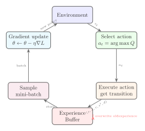

# 4.2 DQN ：Q 、

## 

****

-  Q ： $Q(s,a)$， TD Error 。
- （Experience Replay）、。
- （Target Network）。

****

$$
\mathcal{L}(\theta) = \mathbb{E}\left[\left( r + \gamma (1 - d) \max_{a'} Q(s', a'; \theta^-) - Q(s, a; \theta) \right)^2\right]
$$

> ** Q （MSE TD Error）：**
>
> - $\theta$：Q ——""。
> - $\theta^-$：——，""。
> - $Q(s, a; \theta)$：Q -，""。
> - $d$：。 episode ，$d=1$，； $d=0$。
> - $r + \gamma (1-d) \max_{a'} Q(s', a'; \theta^-)$：TD Target，，""。
> -  $\mathbb{E}$： $(s, a, r, s')$ ，。

” DQN”：Q ， Q-Learning 。：**DQN ？**

——、 Q ， TD Target——？。

**： TD Target。**  $Q(s, a) = 5.0$， $\max Q(s', a') = 8.0$。：

$$\text{TD Target} = r + \gamma \times 8.0 = 1.0 + 0.99 \times 8.0 = 8.92$$

$$\text{TD Error} = 8.92 - 5.0 = 3.92$$

**：。**  TD Error ， $Q(s, a)$  8.92 。。

**：。** ——$s'$  Q 。，$\max Q(s', a')$ ， 8.0  4.0。 TD Target ：

$$\text{TD Target}' = 1.0 + 0.99 \times 4.0 = 4.96$$

“” 8.92  4.96，。 8.92， 4.96； 4.96，。Q 。

 Sutton & Barto ””（deadly triad）： +  + ，。

DQN 。Q ，；， batch ； Q ， TD Target， C  Q ，。， Q 。

： 3  **TD **——，。TD Target = $r + \gamma V(s')$，" + "。 Q  TD Target ， $V(s')$  $\max_{a'} Q(s', a')$—— Q-Learning ，。

。

## Q 

， TD Target 。DQN ****：

- **Q **（ $\theta$）：，。””。
- ****（ $\theta^-$）：Q ， TD Target。 C  Q ，。””。

，。””””， Q 。

### Q 

Q ： $s$， Q 。 LunarLander ， 8 ，、、； 4  Q ，””””””””。

```python
import torch
import torch.nn as nn

class QNetwork(nn.Module):
    """Q-Network：， Q """

    def __init__(self, state_dim, action_dim, hidden_dim=128):
        super().__init__()
        self.net = nn.Sequential(
            nn.Linear(state_dim, hidden_dim),
            nn.ReLU(),
            nn.Linear(hidden_dim, hidden_dim),
            nn.ReLU(),
            nn.Linear(hidden_dim, action_dim)
        )

    def forward(self, x):
        return self.net(x)  # : (batch_size, action_dim)
```

：， 128 ， ReLU 。， Q 。 LunarLander（`state_dim=8, action_dim=4`），——，。

 Q ？，。 `argmax`—— Q 。

 Atari ， 84×84×4 ，——，。DeepMind （CNN）：， Q 。 LunarLander ， MLP 。 MLP  LunarLander  DQN， CNN 。

Q  Q "" Q 。 Q ——，。 Q-Learning ：

$$\text{TD Target} = r + \gamma (1-d) \max_{a'} Q(s', a')$$

 TD Target ：

$$\mathcal{L}(\theta) = \mathbb{E}\left[\left( r + \gamma (1-d) \max_{a'} Q(s', a'; \theta^-) - Q(s, a; \theta) \right)^2\right]$$

，""：

|                                              | （）                                 |                          |
| ------------------------------------------------ | ------------------------------------------------ | ---------------------------- |
| $\theta$                                         | Q-Network （）         | ——           |
| $\theta^-$                                       | （Q ）               | —— |
| $Q(s, a; \theta)$                                | ：" $X$ "            |                    |
| $r$                                              |                          |            |
| $d$                                              |                                      |            |
| $\gamma (1-d) \max_{a'} Q(s', a'; \theta^-)$     | ，， | ""         |
| $r + \gamma (1-d) \max_{a'} Q(s', a'; \theta^-)$ | TD Target——""                  |                      |

：

**：TD Target——**

$$y = r + \gamma (1-d) \max_{a'} Q(s', a'; \theta^-)$$

TD Target " + "。，$d=1$，， $r$。 $Q$  $\theta^-$， $\theta$——。

**：TD Error——**

$$\delta = y - Q(s, a; \theta) = r + \gamma (1-d) \max_{a'} Q(s', a'; \theta^-) - Q(s, a; \theta)$$

TD Error ""。， Q  TD Target  $\alpha \cdot \delta$。， Q —— $\theta$  Q 。

**：——，**

$$\mathcal{L}(\theta) = \mathbb{E}\left[\delta^2\right] = \mathbb{E}\left[\left(y - Q(s, a; \theta)\right)^2\right]$$

 $\delta$ ？。，$\delta$ ，， 0，——。，。，（ 0.1  0.01），（ 1.0  1.0， 3.0  9.0）——。

**：——**

$$\mathcal{L}(\theta) = \mathbb{E}\left[\left(y - Q(s, a; \theta)\right)^2\right]$$

 $\mathbb{E}$ " $(s, a, r, s')$ "。，，—— SGD（）""。

： Q ， TD Target（），（），， $\theta$。 Q-Learning ——，。

：""""？？。

## 

 $\mathbb{E}$ ——""？，、， mini-batch 。： $(s, a, r, s', d)$，。

，——CartPole 。（i.i.d.），，，""。

。DeepMind  2015  DQN ：，Atari Breakout（）""，；，，。， batch """"""，。： 10 ，""，。

（Experience Replay）： $(s, a, r, s', d)$ ，。—— batch ，。

？：

|  |        | CartPole                                             |
| ---- | ---------- | -------------------------------------------------------- |
| $s$  |    | `[0.03, 0.12, -0.05, -0.32]`（、、、） |
| $a$  |  | `0`（）                                              |
| $r$  |  | `1.0`（， +1）                               |
| $s'$ |    | `[0.03, -0.05, -0.06, 0.18]`（）           |
| $d$  |    | `False`（）                                  |

。，。 CartPole ：

| #   | $s$（）                  | $a$（） | $r$（） | $s'$（）             | $d$（） |                |
| --- | ---------------------------- | ----------- | ----------- | ---------------------------- | ----------- | ------------------ |
| 1   | `[0.01, 0.12, 0.05, -0.32]`  | `1`（） | `1.0`       | `[0.01, 0.15, 0.04, -0.28]`  | `False`     |  2 ，      |
| 2   | `[0.02, 0.31, -0.12, 0.89]`  | `0`（） | `1.0`       | `[0.01, 0.28, -0.10, 0.85]`  | `False`     |  8 ，      |
| 3   | `[0.05, 0.44, 0.21, 1.02]`   | `1`（） | `1.0`       | `[0.06, 0.48, 0.24, 1.10]`   | `True`      |  8 ，  |
| 4   | `[0.00, 0.02, 0.01, -0.05]`  | `0`（） | `1.0`       | `[0.00, -0.01, 0.01, -0.03]` | `False`     |  45 ， |
| 5   | `[-0.03, -0.18, 0.08, 0.55]` | `1`（） | `1.0`       | `[-0.03, -0.14, 0.09, 0.50]` | `False`     |  102 ，    |

：

-  3  $d=\text{True}$：，。TD Target  $(1-d)=0$，， $r=1.0$。""。
-  4  45 ：，。""。
- 、。，、、，。

 64 ，："，，。" Q ，。



```python
import random
from collections import deque

class ReplayBuffer:
    """： (s, a, r, s', done) """

    def __init__(self, capacity=10000):
        self.buffer = deque(maxlen=capacity)  # 

    def push(self, state, action, reward, next_state, done):
        """"""
        self.buffer.append((state, action, reward, next_state, done))

    def sample(self, batch_size):
        """"""
        batch = random.sample(self.buffer, batch_size)
        states, actions, rewards, next_states, dones = zip(*batch)
        return (torch.FloatTensor(states),
                torch.LongTensor(actions),
                torch.FloatTensor(rewards),
                torch.FloatTensor(next_states),
                torch.FloatTensor(dones))

    def __len__(self):
        return len(self.buffer)
```

：

1. ****：，，。
2. ****：，。， Q ，。
3. ****：，。

。，，。，（ Q ），。 $10^4$  $10^6$。

""""。： TD Target $r + \gamma \max_{a'} Q(s', a'; \theta^-)$ 。 TD Target ，，。、。

## 

Q-Learning  $r + \gamma \max_{a'} Q(s', a')$。，—— $Q(s', a')$ ， $Q(s, a)$  $Q(s', a')$。，： $Q(s, a)$ ， $Q(s', a')$ 。，，。

（Target Network）：， Q-Network $\theta$ ， $\theta^-$  TD Target。， Q-Network ：

```python
#  target_update ， Q 
if step % target_update == 0:
    target_net.load_state_dict(q_net.state_dict())
```

 TD Target ：

```python
#  TD Target（）
with torch.no_grad():
    td_target = reward + gamma * target_net(next_state).max() * (1 - done)
```

，，TD Target ——。Q-Network ，。，， Q-Network 。

。（）， Q-Network ，。（ 10000 ）， TD Target ，Q-Network 。 100  1000 。

##  DQN

 Q 、。： DQN，？

——，，，。 CartPole （`state_dim=4, action_dim=2`），。、。

###  Q 

：，， Q 。CartPole  4 （、、、）， 2 （、）。 4  2 。

```python
import torch
import torch.nn as nn

class QNetwork(nn.Module):
    def __init__(self, state_dim, action_dim, hidden_dim=128):
        super().__init__()
        self.net = nn.Sequential(
            nn.Linear(state_dim, hidden_dim),   #  → 
            nn.ReLU(),                          # 
            nn.Linear(hidden_dim, hidden_dim),  #  → 
            nn.ReLU(),
            nn.Linear(hidden_dim, action_dim),  #  → 
        )

    def forward(self, x):
        return self.net(x)  # : (batch_size, action_dim)
```

：

- ****：， 4 。。
- **`hidden_dim=128`**： $4 \times 128 + 128 \times 128 + 128 \times 2 \approx 17000$ 。64 、256 ，128 ， LunarLander 。Atari  CNN  MLP。
- **ReLU **：（）、 1 、 Q 。Sigmoid/Tanh 。
- ****：Q 。ReLU ，Sigmoid/Tanh 。
- ** Q **： `argmax`，。， Actor-Critic（ 6 ）。

::: details ？
**？** ，——。-，"，"。， CartPole  4 ，、。

** `hidden_dim=128`？** 64 ，，Q ；256  512  CartPole （ 10 ），。128 —— 17000 ， CPU 。 LunarLander（`state_dim=8, action_dim=4`）。 Atari ， CNN  MLP。

** ReLU  Sigmoid  Tanh？** 。，ReLU —— 0，Sigmoid  Tanh 。，ReLU  1，——Sigmoid  0.25， 0.0625。，Q （CartPole  200），Sigmoid  $(0, 1)$、Tanh  $(-1, 1)$， Q 。

**？** Q ，。 ReLU， Q （""） 0，""。 Sigmoid  Tanh，Q  $(0,1)$  $(-1,1)$， CartPole 。

** Q ？** "， Q "—— `argmax`，。，（ Actor-Critic ， 6 ）。
:::

### 

：，。 $(s, a, r, s', d)$，。

```python
import random
from collections import deque

class ReplayBuffer:
    def __init__(self, capacity=10000):
        self.buffer = deque(maxlen=capacity)

    def push(self, state, action, reward, next_state, done):
        self.buffer.append((state, action, reward, next_state, done))

    def sample(self, batch_size):
        batch = random.sample(self.buffer, batch_size)
        states, actions, rewards, next_states, dones = zip(*batch)
        return (
            torch.FloatTensor(states),      # (B, state_dim)
            torch.LongTensor(actions),       # (B,)
            torch.FloatTensor(rewards),      # (B,)
            torch.FloatTensor(next_states),  # (B, state_dim)
            torch.FloatTensor(dones),        # (B,)
        )

    def __len__(self):
        return len(self.buffer)
```

：

- **`capacity=10000`**：CartPole 500 ，10000 。，。LunarLander  $10^4$  $10^5$，Atari  $10^5$  $10^6$。
- **`deque(maxlen=capacity)`**：， `list`  $O(1)$， numpy 。
- **`FloatTensor`  `LongTensor`**：、 `FloatTensor` ； `LongTensor`  `gather` 。`dones`  `FloatTensor`  `(1 - dones)` 。

::: details  capacity  10000？
CartPole  10\~200 ，500 。10000 ，。（ 1000），；（ $10^6$）， Q ，""，。
:::

### 

：。 DQN —— Q 、，。 `DQNAgent` ， `update` 。

？Q  Q ，。 Q ， TD Target。，、""，——。：Q ""，""。（），，。

```python
import torch.optim as optim
from torch.nn.utils import clip_grad_norm_

class DQNAgent:
    def __init__(self, state_dim, action_dim, lr=1e-3, gamma=0.99):
        self.action_dim = action_dim
        self.gamma = gamma

        # Q （）（）
        self.q_net = QNetwork(state_dim, action_dim)
        self.target_net = QNetwork(state_dim, action_dim)
        self.target_net.load_state_dict(self.q_net.state_dict())
        self.target_net.eval()

        self.optimizer = optim.Adam(self.q_net.parameters(), lr=lr)
        self.buffer = ReplayBuffer(capacity=10000)
```

：

- **`lr=1e-3`**：Adam ， DQN 。 Q ， 500 。 $5 \times 10^{-4}$。
- **`gamma=0.99`**：。0.99  100  $0.99^{100} \approx 0.366$，。0.9 ，0.999 。
- **`target_net` **：， TD Target  Q 。
- **`target_net.eval()`**： Dropout  BatchNorm 。 MLP ，。
- ** `q_net` **：， `update_target()` 。

::: details ？
Q  $\theta$ 。TD Target  $y = r + \gamma \max_{a'} Q(s', a'; \theta)$—— Q ， $\theta$ ，TD Target 。： TD Target  5.0，"" 3.0，。

：。Q  $\theta$ ； $\theta^-$  TD Target， C  Q 。，TD Target ——，Q 。

 Q-Learning ， $Q(s, a)$  $Q(s', a')$ ，。，，。
:::

::: details  target_net ？
， Q ， Q —— Q  -5.0， 200.0。 TD Target ，MSE loss ，。`load_state_dict(q_net.state_dict())` ， TD Target  Q 。
:::

::: details  lr  1e-3 ？
。$10^{-3}$  Adam 。 Q —— 5.0， -3.0，TD Target ，。，500 。， $5 \times 10^{-4}$  $1 \times 10^{-4}$，。
:::

::: details  gamma  0.99？
。0.99  100  $0.99^{100} \approx 0.366$。0.9 ，$0.9^{100} \approx 2.7 \times 10^{-5}$，。0.999 ，Q ——，。0.99  RL 。
:::

 `update` ：

```python
    def update(self, batch_size):
        """： batch  + """
        if len(self.buffer) < batch_size:
            return 0.0

        #  batch
        states, actions, rewards, next_states, dones = self.buffer.sample(batch_size)

        # Q 
        q_values = self.q_net(states).gather(1, actions.unsqueeze(1)).squeeze(1)

        # 
        with torch.no_grad():
            next_q_max = self.target_net(next_states).max(dim=1)[0]
            targets = rewards + self.gamma * next_q_max * (1 - dones)

        #  MSE Loss
        loss = nn.MSELoss()(q_values, targets)

        # 
        self.optimizer.zero_grad()
        loss.backward()
        clip_grad_norm_(self.q_net.parameters(), max_norm=10)
        self.optimizer.step()

        return loss.item()
```

`update()`  DQN 。：

- ****：`len(self.buffer) < batch_size` 。 64 ，`random.sample` 。
- **`gather`**： `(B, action_dim)` ， Q 。
- **`torch.no_grad()`**：，。 `q_values`，`targets` 。
- **`.max(dim=1)[0]`**：， $\max_{a'} Q(s', a'; \theta^-)$。`[0]` ，`[1]` 。
- **TD Target**：`rewards + gamma * next_q_max * (1 - dones)`。 `dones=1`，。
- **MSE Loss**：$\frac{1}{B}\sum (y_i - Q_i)^2$。 L1 （ 2  MSE  4  L1  2）。
- **`zero_grad` → `backward` → `clip` → `step`**：PyTorch 。

::: details gather 
`self.q_net(states)`  `(B, 2)`， Q 。 Q 。`gather(1, actions.unsqueeze(1))`  `actions` ，：

```
q_net ：                 actions:    gather ：
[[ 0.3,  0.8],              [1,          [0.8,    ←  0  1 
 [ 1.2, -0.5],               0,           1.2,    ←  1  0 
 [-0.1,  0.6],               1,           0.6,    ←  2  1 
 ...]                         ...]         ...]
```

`actions.unsqueeze(1)`  `(B,)`  `(B, 1)`——`gather` 。`.squeeze(1)`  `(B, 1)`  `(B,)`。
:::

::: details  max_norm=10？
 loss —— batch  TD Error  0.1  TD Error  50 ，。`max_norm=10` ，OpenAI  10  0.5。（100），（1）。 loss ，。
:::

::: details  Adam  SGD？
Adam ，（）（），。DQN —— batch ，Adam 。 SGD ，。
:::

### 

：。

```python
    def select_action(self, state, epsilon):
        """ε-greedy """
        if random.random() < epsilon:
            return random.randint(0, self.action_dim - 1)
        with torch.no_grad():
            q_values = self.q_net(torch.FloatTensor(state).unsqueeze(0))
        return q_values.argmax(dim=1).item()

    def update_target(self):
        """： Q """
        self.target_net.load_state_dict(self.q_net.state_dict())
```

：

- **ε-greedy**： Q ， `argmax` 。ε-greedy  $\varepsilon$ ，。
- **`unsqueeze(0)`**：`state`  `(4,)`， `(B, 4)`。`unsqueeze(0)`  batch  `(1, 4)`。
- **`argmax(dim=1).item()`**：`(1, 2)` → `argmax` → `(1,)` → `.item()` → Python int。`env.step()` ，。
- ****： $\theta^- \leftarrow \theta$， DQN 。 $\theta^- \leftarrow \tau \theta + (1-\tau) \theta^-$ ， DDPG 。

::: details  ε-greedy ？
 Q ， `argmax`，，。ε-greedy  $\varepsilon$ ，-。 $\varepsilon$ ，。（ Noisy Networks、）。
:::

### 

：。

```python
import gymnasium as gym

num_episodes = 500
batch_size = 64
epsilon_start, epsilon_end, epsilon_decay = 1.0, 0.01, 0.995
target_update_freq = 10

env = gym.make("CartPole-v1")
agent = DQNAgent(state_dim=4, action_dim=2)
epsilon = epsilon_start

for episode in range(num_episodes):
    state, _ = env.reset()
    while True:
        action = agent.select_action(state, epsilon)
        next_state, reward, done, truncated, _ = env.step(action)
        agent.buffer.push(state, action, reward, next_state, float(done))
        agent.update(batch_size)
        state = next_state
        if done or truncated:
            break

    epsilon = max(epsilon_end, epsilon * epsilon_decay)
    if (episode + 1) % target_update_freq == 0:
        agent.update_target()
```

：

- **`num_episodes=500`**：CartPole-v1 "" 100  $\geq 475$，DQN  200\~400 。500 。，。
- **`batch_size=64`**：32 ，256 。64  128  DQN 。
- **`epsilon_start=1.0`**：，Q ，100% 。
- **`epsilon_end=0.01`**： 1% 。，Q 。
- **`epsilon_decay=0.995`**：100  $\approx 0.61$，200  $\approx 0.37$，400  $\approx 0.14$。，。0.95 ，0.999 。
- **`target_update_freq=10`**： 10 。，。LunarLander ， 1000 。
- **`float(done)`**：Gymnasium ， `(1 - dones)` 。
- ** `update`**：，。 batch  `update` 。

::: details epsilon 
 $\varepsilon \leftarrow \varepsilon \times \text{epsilon\_decay}$。：

|   | 100   | 200   | 400   |                            |
| --------- | --------- | --------- | --------- | ------------------------------ |
| 0.95      | 0.006     | —         | —         | ，       |
| 0.99      | 0.366     | 0.134     | 0.018     | ，             |
| **0.995** | **0.606** | **0.368** | **0.135** | **，** |
| 0.999     | 0.905     | 0.819     | 0.670     | ，500          |

:::

::: details  update？
，。 DQN ——，。，，。 batch ，`update` ，。
:::

， DQN 。 `update()` —— Q  TD Target，MSE  loss，。（、、、）。

## ：

 Q ，：

|          | （）                            | （）                                 |
| -------- | --------------------------------------- | -------------------------------------------- |
|  | ε-greedy： $\varepsilon$  | ：$a = \arg\max_{a'} Q(s, a'; \theta)$ |
|  |                           |                                        |
|  | ， loss，       |                                    |
|  |  TD Target，            |                                        |
|  | `q_net.train()`                         | `q_net.eval()`                               |

——，。****，。

：

```python
# ：
action = agent.select_action(state, epsilon=0.1)

# ：
action = agent.select_action(state, epsilon=0.0)
```

`epsilon=0.0` ，`random.random() < 0.0` ， `argmax` 。——，。

##  Q 

：

```mermaid
flowchart TD
    subgraph DQN Training Loop
        A[""] --> B[" (s,a,r,s') "]
        B --> C[""]
        C --> D["Q-Network  Q(s,a; θ)"]
        C --> E["Target-Net  r + γ(1-d) max Q(s',a'; θ⁻)"]
        D --> F[" Loss = MSE(TD Target - Q)"]
        E --> F
        F --> G[" Q-Network  θ"]
        G --> H{" C ？"}
        H -->|""| I["θ⁻ ← θ（）"]
        H -->|""| A
        I --> A
    end

    style D fill:#fff3e0,stroke:#f57c00,color:#000
    style E fill:#e8f5e9,stroke:#388e3c,color:#000
    style F fill:#fce4ec,stroke:#c62828,color:#000
    style I fill:#e3f2fd,stroke:#1976d2,color:#000
```

， Q ：

$$
\begin{aligned}
& \textbf{Algorithm: Deep Q-Network (DQN)} \\[6pt]
& \textbf{1:}\ \text{ Q  } \theta\text{， } \theta^- \leftarrow \theta\text{， } \mathcal{D} \\
& \textbf{2:}\ \textbf{for}\ \mathrm{episode} = 1, 2, \ldots\ \textbf{do} \\
& \textbf{3:}\ \quad \text{ } s \\
& \textbf{4:}\ \quad \textbf{for}\ t = 1, 2, \ldots\ \textbf{do} \\
& \textbf{5:}\ \qquad a \leftarrow \varepsilon\text{-greedy}(Q(s, \cdot\,; \theta)) \\
& \textbf{6:}\ \qquad \text{ } a\text{， } r, s', d \\
& \textbf{7:}\ \qquad \mathcal{D}.\mathrm{push}(s, a, r, s', d) \\
& \textbf{8:}\ \qquad \text{ } \mathcal{D}\text{  batch } \{(s_i, a_i, r_i, s'_i, d_i)\}_{i=1}^{B} \\
& \textbf{9:}\ \qquad y_i \leftarrow r_i + \gamma (1 - d_i) \max_{a'} Q(s'_i, a'; \theta^-) \\
& \textbf{10:}\ \qquad \mathcal{L}(\theta) \leftarrow \frac{1}{B} \sum_{i=1}^{B} \bigl(y_i - Q(s_i, a_i; \theta)\bigr)^2 \\
& \textbf{11:}\ \qquad \theta \leftarrow \theta - \alpha \nabla_\theta \mathcal{L} \\
& \textbf{12:}\ \qquad \text{ } C\text{ ：} \theta^- \leftarrow \theta \\
& \textbf{13:}\ \qquad s \leftarrow s' \\
& \textbf{14:}\ \quad \textbf{end for} \\
& \textbf{15:}\ \textbf{end for}
\end{aligned}
$$

 $\varepsilon\text{-greedy}$  $\varepsilon$ ，$1-\varepsilon$  $a = \arg\max_{a'} Q(s, a'; \theta)$。

 3  Q-Learning ， Q ：（）、（）、（）。 TD Error ——""——。

<details>
<summary>：，。""（）？</summary>

，（FIFO）。，，。，DQN ——Prioritized Experience Replay（）—— TD Error ，""。。

</details>

 Q ， LunarLander ——[：LunarLander ](./lunar-lander)。

## 

- **Q ** $Q(s,a)$， Q ， `gather` 。
- ****：TD Target（）、TD Error（）、（）、（batch ）。
- ****，，。
- **** `torch.no_grad()`  TD Target，""。
- **** Q ： ε-greedy  + ， + 。
- ： batch → Q  →  → TD Target → MSE Loss →  → 。
