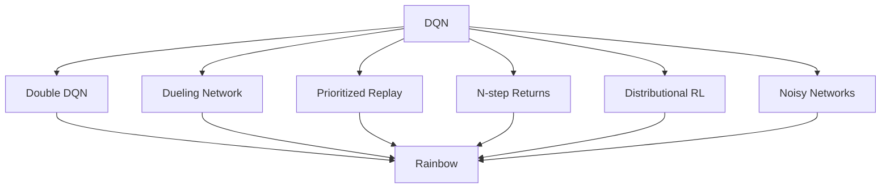

# 4.4 DQN 

， `LunarLander-v3`  DQN 。
：， Q-Learning ；
，，， episode 。

。 DQN  Q-Learning、、，
。
，TD ；
 Q “”；
。

 DQN 。
“”，
 TD 、、 DQN。
：
 DQN ，、、，。

## Double DQN

 DQN  TD 。
$(s,a,r,s',d)$， $d$ ，
DQN  $Q(\cdot,\cdot;\theta^-)$ 

$$
y = r + \gamma (1-d)\max_{a'} Q(s',a';\theta^-).
$$

：
，
。
，
。
， Q ，
$\max$ 。
，，

$$
\mathbb{E}\left[\max_a \hat{Q}(s,a)\right]
\geq
\max_a \mathbb{E}\left[\hat{Q}(s,a)\right].
$$

Double DQN “”“”。


$$
a^\ast = \arg\max_{a'} Q(s',a';\theta),
$$

：

$$
y_{\text{Double}}
=
r + \gamma(1-d) Q(s',a^\ast;\theta^-).
$$

 DQN ， TD 。
 $\theta$ ，
 $\theta^-$ 。
，
Q 。

，：

```python
with torch.no_grad():
    best_actions = q_net(next_states).argmax(dim=1)
    next_q = target_net(next_states)
    next_q_selected = next_q.gather(1, best_actions[:, None]).squeeze(1)
    target = rewards + gamma * (1 - dones) * next_q_selected
```

Double DQN ，
，
 DQN 。
， Double DQN  DQN 。

## Dueling DQN

 DQN  $Q(s,a)$。
，
：
，
。

 3 ， $V(s)$  $Q(s,a)$。
 $A(s,a)$  $a$ ，


$$
Q(s,a)=V(s)+A(s,a).
$$

。
 $V(s)$ ， $A(s,a)$ ，
 $Q(s,a)$ 。
，Dueling DQN  Q ：

$$
Q(s,a)
=
V(s)
+
A(s,a)
-
\frac{1}{|\mathcal{A}|}\sum_{a'\in\mathcal{A}} A(s,a').
$$

，$\mathcal{A}$ 。
， 0，
 $V(s)$ ，
$A(s,a)$ 。

，Dueling DQN ，
：
 $V(s)$，
 $A(s,a)$。
 Q 。

```python
features = backbone(states)

values = value_head(features)          # shape: [batch_size, 1]
advantages = advantage_head(features)  # shape: [batch_size, num_actions]
q_values = values + advantages - advantages.mean(dim=1, keepdim=True)
```

。
 LunarLander ，
，
；
、。
Dueling ，
 Q 。

## 

。
 $N$ ，
 $1/N$。
，
。

 TD 。
 $i$ ，

$$
\delta_i = y_i - Q(s_i,a_i;\theta).
$$

 $|\delta_i|$ ，
 TD 。
Prioritized Experience Replay（PER）

$$
p_i = |\delta_i| + \epsilon,
$$

 $\epsilon>0$  0。


$$
P(i)=\frac{p_i^\alpha}{\sum_k p_k^\alpha}.
$$

 $\alpha$ 。
 $\alpha=0$ ，$P(i)$ ；
 $\alpha=1$ ，。
，
 TD ，
。

，。
，
PER 

$$
w_i = \left(\frac{1}{N P(i)}\right)^\beta,
$$

 $w_i$  batch ，。
 $\beta$ 。
，

$$
L(\theta)=\mathbb{E}_{i\sim P}\left[w_i\delta_i^2\right].
$$

，PER ：
 TD ，
。
 Bellman ，
。

## 、

Rainbow  DQN 。
、。

 _n-step returns_。
 DQN  TD ：

$$
y_t = r_t + \gamma \max_a Q(s_{t+1},a;\theta^-).
$$

，。
 $n$ ，

$$
y_t^{(n)}
=
\sum_{k=0}^{n-1}\gamma^k r_{t+k}
+
\gamma^n \max_a Q(s_{t+n},a;\theta^-).
$$

。
，
；
。

 _distributional RL_。
 DQN  $Q(s,a)$。
：
，。
，
 $Z(s,a)$ ，
 Bellman 

$$
Z(s,a) \overset{D}{=} R + \gamma Z(S',A').
$$

 $\overset{D}{=}$ 。
 C51 ，，
。
。

 _Noisy Networks_。
epsilon-greedy ，
。
NoisyNet ，

$$
W = \mu_W + \sigma_W \odot \epsilon_W.
$$

 $\mu_W$  $\sigma_W$ ，
$\epsilon_W$ ，
$\odot$ 。
，
，
。

：
，
，
。
，
 Double DQN、Dueling DQN  PER 。

## Rainbow

Rainbow  DQN 。
：
Double DQN、Dueling 、、、 Noisy Networks。



，
。
Double DQN ；
Dueling ；
PER ；
；
；
Noisy Networks 。

 Atari ，
：
，，
，
。
，。
，。
，，
 Rainbow。

## 

。
，，
。
。

epsilon-greedy ：
 $\epsilon$ ，
 $1-\epsilon$  Q 。
，
、。

**（intrinsic reward）。
，
。


$$
r_t^{\text{total}}
=
r_t^{\text{extrinsic}}
+
\beta r_t^{\text{intrinsic}},
$$

 $\beta$ 。

ICM 。
 $\phi(s)$ ，
 $\phi(s_t)$  $a_t$
 $\hat{\phi}(s_{t+1})$。


$$
r_t^{\text{intrinsic}}
=
\left\|
\phi(s_{t+1})-\hat{\phi}(s_{t+1})
\right\|^2.
$$

，
，
。
ICM  $\phi(s_t)$  $\phi(s_{t+1})$
 $a_t$，
。

RND 。
 $f^\ast$，
 $f_\theta$ 。
 $s_t$，

$$
r_t^{\text{intrinsic}}
=
\left\|f_\theta(s_t)-f^\ast(s_t)\right\|^2.
$$

，
；
，
。
，
。
，、，。

## 

-  DQN  TD ， Q 。
- Double DQN ，。
- Dueling DQN  $Q(s,a)$  $V(s)$  $A(s,a)$，。
-  TD ，。
- 、、。
- Rainbow  DQN ，，。
- ，、。

 DQN 。
 Atari ，，
、 wrapper、。
[：](./visual-game-projects)

## 

1.  4 ， Q  0， $0.1,-0.2,0.4,-0.1$。 DQN ？？
2.  Double DQN  TD ： $a^\ast$， $y_{\text{Double}}$。？
3.  Dueling DQN ， $Q(s,a)=V(s)+A(s,a)$？？
4.  PER  $\alpha=0$，？ $\beta=0$，？
5. ，？
6.  LunarLander ， Double DQN ，？

## 

[^1]: Mnih, V., et al. (2015). Human-level control through deep reinforcement learning. _Nature_, 518(7540), 529-533.

[^2]: van Hasselt, H., Guez, A., & Silver, D. (2016). Deep Reinforcement Learning with Double Q-learning. _AAAI_.

[^3]: Wang, Z., et al. (2016). Dueling Network Architectures for Deep Reinforcement Learning. _ICML_.

[^4]: Schaul, T., et al. (2016). Prioritized Experience Replay. _ICLR_.

[^5]: Hessel, M., et al. (2018). Rainbow: Combining Improvements in Deep Reinforcement Learning. _AAAI_.

[^6]: Pathak, D. et al. (2017). Curiosity-driven Exploration by Self-supervised Prediction. _ICML_.

[^7]: Burda, Y. et al. (2019). Exploration by Random Network Distillation. _ICLR_.
