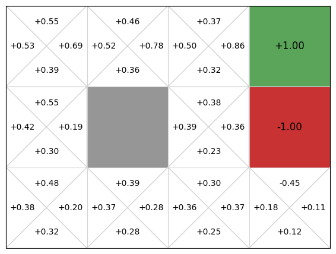
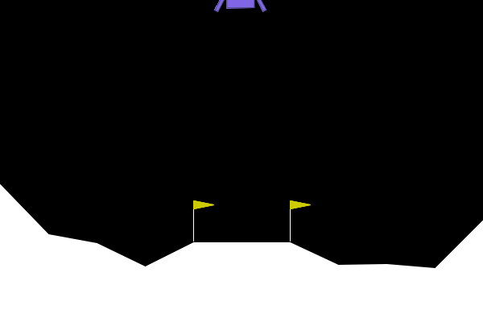

# 4.1 DQN ：Q 

## 

****

-  Q-Learning  TD 。
-  Q “”。
-  DQN  $Q(s,a)$，。

****

$$
Q(s, a) \leftarrow Q(s, a) + \alpha \left[ r + \gamma \max_{a'} Q(s', a') - Q(s, a) \right] \quad \text{（Q-Learning ： Q ）}
$$

> **Q-Learning  (Q-Learning Update Rule)：**
>
> - $Q(s,a)$：-。
> - $r+\gamma\max_{a'}Q(s',a')$： TD ，。
> - $\alpha$：， TD 。

$$
\text{TD Target} = r + \gamma \max_{a'} Q(s', a') \quad \text{（TD ：""）}
$$

> **TD Target ()：**
>
> - $r$：。
> - $\gamma\max_{a'}Q(s',a')$： $s'$ ，。
> - ， $Q(s,a)$ 。

$$
\delta = \text{TD Target} - Q(s, a) \quad \text{（TD Error：，）}
$$

> **TD Error ()：**
>
> - $\delta>0$：，。
> - $\delta<0$：，。
> - $\delta=0$：。

## Q-Learning 

 3  $Q(s,a)$  Q-Learning。：，-，。

 3.5 ：

$$Q(s, a) \leftarrow Q(s, a) + \alpha \left[ r + \gamma \max_{a'} Q(s', a') - Q(s, a) \right]$$

“”。：

$$
\text{TD Target}=r+\gamma\max_{a'}Q(s',a').
$$

： $r$， $s'$ 。：

$$
\delta=\text{TD Target}-Q(s,a).
$$

 TD Error。，， $Q(s,a)$  $\alpha$ 。，，。

 0。，-。，； TD  $\max_{a'}Q(s',a')$ 。，，： Q 。

，：**-。**  $Q(s,a)$， $Q(s',a')$。 GridWorld ，；，。

## 

Q  Q-Learning ，。-，、、。，“”。

。 2 ，Q  4 。 $3^9 \approx 20{,}000$ ，。 $10^{47}$ ——。 $3^{361} \approx 10^{170}$ ， $\sim 10^{80}$ 。

，：。。

LunarLander  8 ，、、、。 6 。， $x\in[-1,1]$，；6 ，。

，。 6  50 ， $50^6 \approx 1.56 \times 10^{10}$； 4 ，-。。

Atari 。 4  $84 \times 84$ ， 28224 ， 256 。 $256^{28224}$。，：。

****（curse of dimensionality）。：Q-Learning  TD ，“ $Q(s,a)$”。，；。

， Q-Learning， $Q(s,a)$ 。

## 

， TD ，“Q ”。：**，？**

****（function approximation）。 Q-Learning ，：-，，。

 3.4 “”。 $V(s)$；Q  $Q(s,a)$。，、，Q-Learning “ × ”：

|   |   |   |  |  |
| ----- | ----- | ----- | -------- | ---- |
| $s_1$ | 0.10  | 0.05  | 0.40     | 0.00 |
| $s_2$ | -0.20 | 0.15  | 0.30     | 0.10 |
| $s_3$ | 0.00  | -0.10 | 0.20     | 0.05 |

。 $s_2$ ，：

$$
Q(s_2,\cdot)=[-0.20,\ 0.15,\ 0.30,\ 0.10].
$$

，，。， $(s,a,r,s')$，Q-Learning  TD  $Q(s,a)$。，-，。

，：。LunarLander  8 ，Atari ，。，“”，“”。

：，。， $\theta$ ：

$$
Q(s,\cdot;\theta)
=[Q(s,a_1;\theta),Q(s,a_2;\theta),\ldots,Q(s,a_m;\theta)].
$$

：

|                 |                                                        |
| ------------------- | ---------------------------------------------------------- |
| $s$                 | ， LunarLander  8 。               |
| $a_i$               |  $i$ 。                                        |
| $\theta$            | ， DQN 。                    |
| $Q(s,a_i;\theta)$   |  $\theta$ ， $s$  $a_i$ 。 |
| $Q(s,\cdot;\theta)$ |  $s$ ， Q 。             |

： Q “”，。 LunarLander，

$$
s=[x,y,\dot{x},\dot{y},\theta,\dot{\theta},c_L,c_R]
$$

， 4 ：

$$
Q(s,\cdot;\theta)
=[Q(s,\text{}),Q(s,\text{}),Q(s,\text{}),Q(s,\text{})].
$$

， Q-Learning ， Q 。 $|S|\times|A|$ ； $\theta$。：，。， DQN 。

。Sutton  1988  TD($\lambda$)  [^sutton1988]。1990 ，Lin [^lin1993]  Rummery & Niranjan [^rummery1994]  Q-Learning 。——、， Atari ，。

 2013 。DeepMind  Mnih  Q-Learning ， $Q^*(s, a)$：

$$Q(s, a; \theta) \approx Q^*(s, a)$$

** Q **（Deep Q-Network, DQN）， “Deep”  [^mnih2013]。

DQN ： $s$ ， Q ——，。 LunarLander ， 8 ， 4  Q ； Atari ， $84 \times 84 \times 4$ ，。

，DQN ：** Q-Learning ，“ Q ”“ $Q(s,\cdot;\theta)$”。** 2015 ， Nature ， [^mnih2015]。

## 

，“”。： $Q(s,\cdot;\theta)$， Q-Learning ，？

 DQN ，。：，。

****。 Atari ，。 Pong ， $84 \times 84$ ，。 batch，，。

。 batch ，，。，。 DQN ：，。

****。Q-Learning  TD 

$$
r+\gamma\max_{a'}Q(s',a').
$$

， $Q(s,a)$ 。， Q  $\theta$ 。 $Q(s,a;\theta)$， $Q(s',a';\theta)$。，，。

。 2  2 ，$\gamma=0.99$。：

$$Q_\theta: \quad Q(s_1, a_1)=2.0,\; Q(s_1, a_2)=5.0,\; Q(s_2, a_1)=3.0,\; Q(s_2, a_2)=8.0$$

 $(s_1,a_2,r=+1,s_2)$，TD ：

$$\text{TD Target} = r + \gamma \max_{a'} Q_\theta(s_2, a') = 1 + 0.99 \times 8.0 = 8.92$$

 $Q_\theta(s_1,a_2)$  8.92 。，，。：

$$Q_{\theta'}: \quad Q(s_1, a_1)=2.3,\; Q(s_1, a_2)=6.5,\; Q(s_2, a_1)=2.7,\; Q(s_2, a_2)={\color{red}6.3}$$

 $Q(s_2,a_2)$： 8.0， 6.3。 $s_2$  TD ，。， $Q(s_1,a_2)$  $Q(s_2,a_2)$；，。

， Q-Learning ，：，；TD ，。DQN ，“”，。

 DeepMind DQN 。 Q ；： **Q **，****，**** TD 。，“ DQN”，“DQN ”。

：1990  Q-Learning， 2013 ？

。，：1990 。，：， Q-Learning 。，：Atari （Arcade Learning Environment）、、，。

， DQN ：[Q 、](./dqn-components)。

## 

[^sutton1988]: Sutton, R. S. (1988). Learning to predict by the methods of temporal differences. _Machine Learning_, 3(1), 9-44.

[^lin1993]: Lin, L.-J. (1993). _Reinforcement learning for robots using neural networks_. PhD thesis, Carnegie Mellon University.

[^rummery1994]: Rummery, G. A., & Niranjan, M. (1994). _On-line Q-learning using connectionist systems_. Technical Report CUED/F-INFENG/TR 166, Cambridge University.

[^mnih2013]: Mnih, V., et al. (2013). Playing Atari with deep reinforcement learning. _arXiv preprint_, arXiv:1312.5602.

[^mnih2015]: Mnih, V., et al. (2015). Human-level control through deep reinforcement learning. _Nature_, 518(7540), 529-533.
