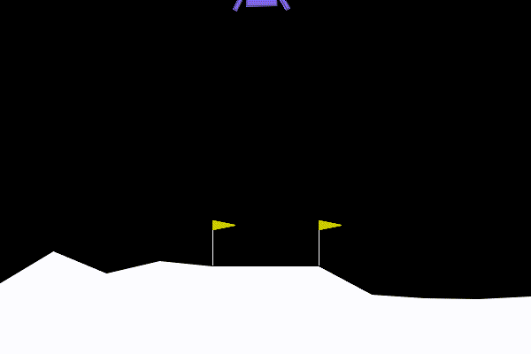

# 4.3 ：LunarLander 

> ****：， DQN  `LunarLander-v3`，、 GIF 。

> ****：[dqn_gym_sb3.py](https://github.com/letslego/hands-on-modern-rl/blob/main/code/chapter04_dqn/dqn_gym_sb3.py) · [export_dqn_curves.py](https://github.com/letslego/hands-on-modern-rl/blob/main/code/chapter04_dqn/export_dqn_curves.py) · [render_lunarlander_split.py](https://github.com/letslego/hands-on-modern-rl/blob/main/code/chapter04_dqn/render_lunarlander_split.py) · [requirements.txt](https://github.com/letslego/hands-on-modern-rl/blob/main/code/chapter04_dqn/requirements.txt)

## 4.3.1  LunarLander 

 DQN ： Q ，，。，。

LunarLander ：，，。 CartPole ，“”，、、、。


<div style="text-align: center; font-size: 0.9em; color: var(--vp-c-text-2); margin-top: -10px; margin-bottom: 20px;">
  <em> 4.3-1：LunarLander ，。</em>
</div>

 CPU 。 CartPole ， Box2D  DQN ； 100k 。， `--total-timesteps` ；， 100k 。

：

```bash
pip install -r code/chapter04_dqn/requirements.txt
```

 LunarLander ：

```bash
python code/chapter04_dqn/dqn_gym_sb3.py \
  --env-id LunarLander-v3 \
  --total-timesteps 100000 \
  --learning-rate 0.0005 \
  --buffer-size 100000 \
  --learning-starts 1000 \
  --batch-size 64 \
  --target-update-interval 1000 \
  --exploration-fraction 0.4 \
  --exploration-final-eps 0.05 \
  --eval-freq 10000 \
  --eval-episodes 5 \
  --checkpoint-freq 25000 \
  --log-dir output/dqn_gym_runs \
  --no-swanlab
```

 loss ，。， `10000` ， `5` ，、 CSV  `output/dqn_gym_runs/LunarLander-v3/`。

，：

|               |                       |                    |
| ----------------------- | ------------------------- | -------------------------- |
| `final_model.zip`       |  DQN  |      |
| `eval/eval_metrics.csv` |             |        |
| `eval/eval_curve.png`   |     |            |
| `checkpoints/`          |                   |  |

 TensorBoard ，：

```bash
tensorboard --logdir output/dqn_gym_runs/LunarLander-v3/tb
```

 CSV ，：

```bash
python code/chapter04_dqn/export_dqn_curves.py --run lunarlander
```

“”； GIF 。

## 4.3.2 

，，。：“”，“”。 GIF，。

 100k ：

```text
timesteps  mean_reward  std_reward
10000       -225.79        23.73
20000       -124.22        11.11
30000        -82.83        31.28
40000         50.68       101.36
50000         25.80        79.58
60000        109.07       130.97
70000         85.07        41.98
80000        -45.77        12.47
90000         -6.32        12.60
100000       253.12        15.37
```


<div style="text-align: center; font-size: 0.9em; color: var(--vp-c-text-2); margin-top: -10px; margin-bottom: 20px;">
  <em> 4.3-2：LunarLander-v3 DQN 。，。</em>
</div>

 `253.12`，。 `175.30 ± 64.79`，“”。，，、。

：

```bash
python code/chapter04_dqn/render_lunarlander_split.py \
  --model output/dqn_gym_runs/LunarLander-v3/final_model.zip \
  --output-dir output/lunarlander_episodes \
  --episodes 3 \
  --seeds 9 10019 171 \
  --max-steps 1000 \
  --max-frames 150 \
  --fps 30
```

 `final_model.zip`， seed ， GIF。`--max-steps 1000`  1000 ，`--max-frames 150`  GIF 。， 150 ， episode 。

## 4.3.3 

，。LunarLander “”，。：

- ，。
- ，。
- ，。
- ，。
- ，、。

 `200` ；`100`  `200` ，、； `100` 、、。“”， `200`。

。Gymnasium  LunarLander 、、、、。，；。、，，，。，，，。

。，：

```python
import gymnasium as gym
import numpy as np

env = gym.make("LunarLander-v3")
rng = np.random.default_rng(0)

returns = []
for ep in range(50):
    obs, _ = env.reset(seed=ep)
    total_reward = 0.0
    for step in range(1000):
        action = int(rng.integers(env.action_space.n))
        obs, reward, terminated, truncated, _ = env.step(action)
        total_reward += reward
        if terminated or truncated:
            break
    returns.append(total_reward)

print(f": {np.mean(returns):.1f}")
print(f": {np.max(returns):.1f}")
print(f": {np.min(returns):.1f}")
```

：

```text
: -210.2
: 8.3
: -460.8
```

： DQN  `-200` ，。，、，。

## 4.3.4 ：、

。， Q ；，。 GIF ， reset seed，。

**Episode 1（ 313.7，263 ）** 。，，。，、、。



**Episode 2（ 173.2，676 ）** 。，，。，； 100 ，、。


**Episode 3（ 5.9，104 ）** 。，，“/”，。


。Episode 1 ；Episode 2 ；Episode 3 ， 100k 。，： DQN  LunarLander ，。

## 4.3.5 、

LunarLander  8 ， 4 。8 ：

|         |                    |          |
| ----------- | ---------------------- | ---------------------------- |
| `x, y`      |  | ，？ |
| `vx, vy`    |          | ，？ |
| `angle`     |              | ？       |
| `angular`   |                  | ？       |
| `left_leg`  |      | ？           |
| `right_leg` |      | ？         |

4 ：、、、。，，；，。

，DQN ，。， 4  Q ，epsilon-greedy 。 `learning_starts=1000` ，，：，，。

，。DQN  Q ，。，； checkpoint  5 ，。“”，、。

。，；，、。，LunarLander 。

## 4.3.6 

， DQN “ LunarLander”。DQN ，。。

，。 epsilon-greedy ，。，，。

， `learning_starts`。 `learning_starts=1000`， 1000 ；，。，。

，。LunarLander ，。 1 ， 5  10 ；，。

，。：

|                      |  |                                          |
| ------------------------ | -------- | -------------------------------------------------------- |
| `learning_rate`          | `0.0005` |  Q ，                        |
| `buffer_size`            | `100000` | ，             |
| `learning_starts`        | `1000`   | ， |
| `target_update_interval` | `1000`   | ，             |
| `exploration_fraction`   | `0.4`    | ，           |
| `eval_episodes`          | `5`      |                                |

。Gymnasium  LunarLander  `1000` ；，。，。：Episode 3  104 ，，。

## 4.3.7  LunarLander

 LunarLander  DQN 。CartPole ， DQN ；MountainCar ， DQN ；LunarLander ：，，、、、。

，LunarLander ，。 DQN ：，，epsilon-greedy 。

： DQN ，、Q ，？ Double DQN、Dueling DQN、PER  Rainbow。[ Q ](./dqn-family)

## 

- `LunarLander-v3`  DQN ：、、 CartPole 。
-  `code/chapter04_dqn/dqn_gym_sb3.py`， `export_dqn_curves.py`， GIF  `render_lunarlander_split.py`。
- ，、。
-  `200` ，`100`  `200` ， `100` 。
- LunarLander ；，、、checkpoint  seed 。

## 

[^1]: Mnih, V., et al. (2015). Human-level control through deep reinforcement learning. _Nature_, 518(7540), 529-533.

[^2]: Raffin, A., et al. (2021). Stable-Baselines3: Reliable reinforcement learning implementations. _Journal of Machine Learning Research_, 22(268), 1-8.
