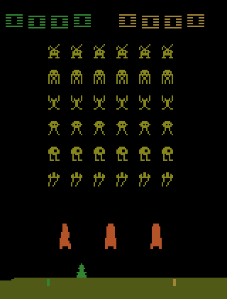
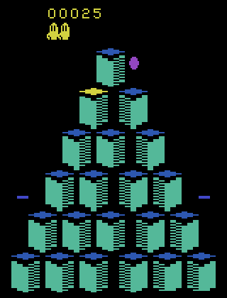
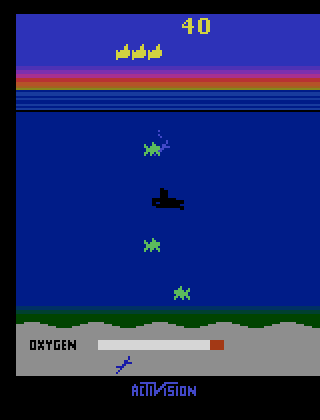
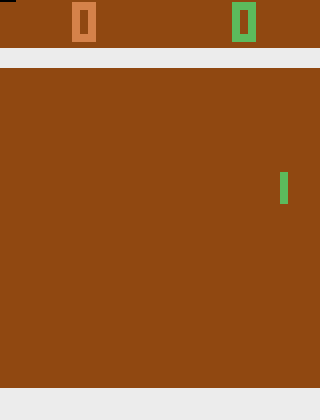
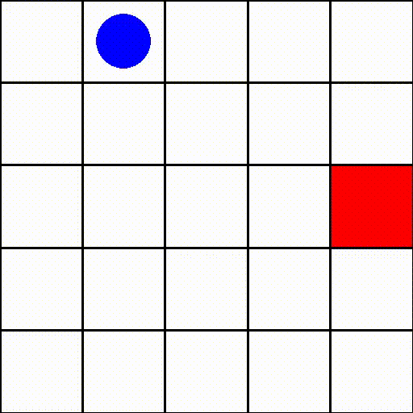
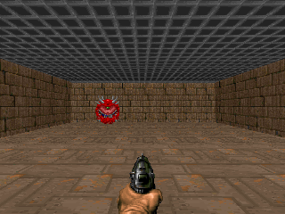
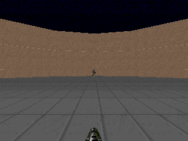
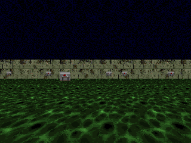
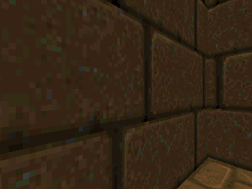
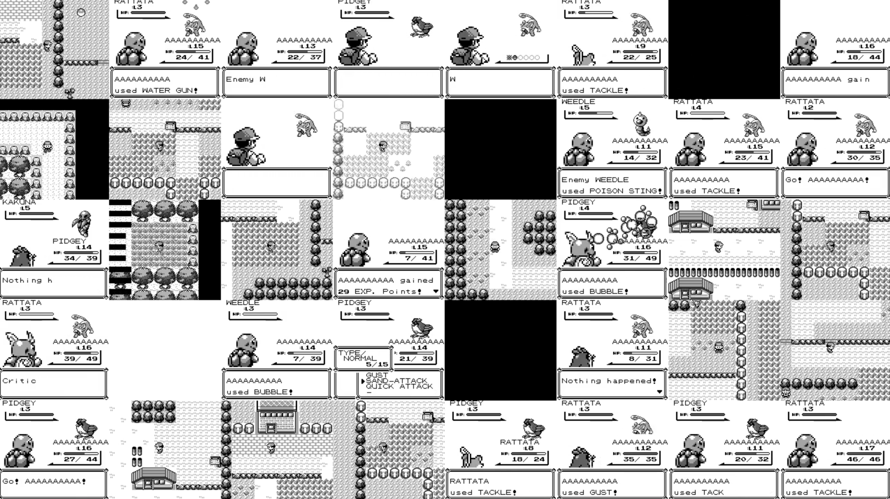

---
outline:
  level: [2, 3]
---

# 4.5 ：

 DQN ：
Q ，
，
 TD Target。
4.3  LunarLander ：
、，
、Q 。
，：
 DQN  8  4 。

：
，
，
DQN ？

 TD Target。
 LunarLander  Atari，
 TD ，
：
MLP  CNN，
，
、checkpoint 。
，ViZDoom、 Minecraft ：
 DQN 。

****

****

-  LunarLander ，，， TD Target 。
-  CNN、、Atari wrapper、。
-  Pong DQN ， checkpoint GIF 。
-  DQN ：Atari、Classic Control、LunarLander、GridWorld、 2D 。
-  ViZDoom、 Minecraft ，、 DQN 。

****

$$
y_i = r_i + \gamma(1-d_i)\max_{a'}Q(s'_i,a';\theta^-)
\quad \text{（ TD Target）}
$$

$$
\mathcal{L}(\theta)
=
\frac{1}{B}\sum_{i=1}^{B}
\left(y_i-Q(s_i,a_i;\theta)\right)^2
\quad \text{（ TD Error）}
$$

：
。
：
 Q  $Q(s_i,a_i;\theta)$
。
，
 $y_i$ ，
 $\theta$ 。

## 4.5.1 

 LunarLander ，：`x`、`y`、、、。Q  8 ， 4 。 4.3 、； DQN 。

。Pong ，“”“”“”。。，，。

。TD Target 

$$
r+\gamma\max_{a'}Q(s',a';\theta^-)
$$

 $s$ ：，。，： DQN， DQN 、、。

， LunarLander ，： MLP ； CNN ，。， Atari DQN 。

## 4.5.2 

DQN ，。

DeepMind 2015  Nature [^mnih2015]：， 29  Atari 。， Q-Learning ——、，。

 DQN ， Q ：

, Figure 1）](./images/dqn-architecture.png)

LunarLander  8 ，Q  MLP。Atari Pong ：，。 TD Target，DQN 

$$
r+\gamma\max_{a'}Q(s',a';\theta^-)
$$

 $Q(s,a;\theta)$ 。

，。LunarLander ： 8 。Atari ：。

。

LunarLander  8  MLP，，。Atari Pong  4  84×84  CNN ，、，。

。

""，""。，。，。

Gymnasium 。，——： CNN 。

```python
import gymnasium as gym

def make_atari_env(game_id="ALE/Pong-v5"):
    env = gym.make(game_id)
    env = gym.wrappers.AtariPreprocessing(
        env,
        grayscale_obs=True,
        scale_obs=True,
        frame_skip=4,
    )
    env = gym.wrappers.FrameStackObservation(env, stack_size=4)
    return env

env = make_atari_env()
state, _ = env.reset()
print(state.shape)  # (4, 84, 84)
```

：， 84×84 ，。， CNN 。，。

### 

```python
class CNNQNetwork(nn.Module):
    def __init__(self, input_channels=4, num_actions=6):
        super().__init__()
        self.conv = nn.Sequential(
            nn.Conv2d(input_channels, 32, kernel_size=8, stride=4),
            nn.ReLU(),
            nn.Conv2d(32, 64, kernel_size=4, stride=2),
            nn.ReLU(),
            nn.Conv2d(64, 64, kernel_size=3, stride=1),
            nn.ReLU(),
        )
        self.fc = nn.Sequential(
            nn.Linear(64 * 7 * 7, 512),
            nn.ReLU(),
            nn.Linear(512, num_actions),
        )

    def forward(self, x):
        x = x / 255.0
        x = self.conv(x)
        x = x.view(x.size(0), -1)
        return self.fc(x)
```

。 Q ，。： 8 ，。、，。

MLP  CNN 。MLP ；CNN 。 Pong，、，。

 LunarLander ，Atari 。

，MLP ， CNN。，。，、。 Atari ，。CNN ，，。，，。

， LunarLander  Atari  `env_id`。

TD ；。， Atari ，、。

## 4.5.3 Pong： Atari 

 Pong ，
"Atari"。
，
 Atari 。
，
Atari ，
 Atari 2600 。

### Atari 

Atari 2600  1970  1980 。
，，——
、。

 Atari  RL  ALE（Arcade Learning Environment）。[^ale-envs]
ALE  Atari 2600 ：
`reset()` ，`step(action)` ，、。
 DQN  Pong  Breakout  Space Invaders， ID。

，Atari " CartPole"，：
CartPole  4 ，
Atari ——、、， 84×84 。

ALE ，。
 Pong ：、， 21 。
，，——。
， Pong  DQN 。

###  Atari 

Pong ，ALE  Breakout、Space Invaders、Seaquest ，
 `gymnasium[atari,accept-rom-license]`  `ale-py`  Gymnasium  ID 。[^ale-complete-list]
， `code/chapter04_dqn/dqn_atari_sb3.py`， `--env-id`：

```bash
python code/chapter04_dqn/dqn_atari_sb3.py \
  --env-id BreakoutNoFrameskip-v4 \
  --total-timesteps 5000000 \
  --learning-starts 100000 \
  --optimize-memory-usage
```

 Atari 。
`NoFrameskip-v4`  SB3 / RL-Zoo  DQN ；
`ALE/...-v5`  Gymnasium / ALE 。
，
 sticky action ，
 `PongNoFrameskip-v4`。

 ALE ，
，
 DQN 。

|                                                                                          |            |  ID                   |  ID            |                      |
| -------------------------------------------------------------------------------------------- | -------------- | ----------------------------- | ---------------------- | ---------------------------------- |
|                      | Pong           | `PongNoFrameskip-v4`          | `ALE/Pong-v5`          | 、， |
|              | Breakout       | `BreakoutNoFrameskip-v4`      | `ALE/Breakout-v5`      | 、   |
|  | Space Invaders | `SpaceInvadersNoFrameskip-v4` | `ALE/SpaceInvaders-v5` | 、           |
|          | Beam Rider     | `BeamRiderNoFrameskip-v4`     | `ALE/BeamRider-v5`     | 、           |
|                  | Enduro         | `EnduroNoFrameskip-v4`        | `ALE/Enduro-v5`        | 、           |
|          | Ms. Pac-Man    | `MsPacmanNoFrameskip-v4`      | `ALE/MsPacman-v5`      | 、     |
|                    | Qbert          | `QbertNoFrameskip-v4`         | `ALE/Qbert-v5`         | 、     |
|              | Seaquest       | `SeaquestNoFrameskip-v4`      | `ALE/Seaquest-v5`      | 、、 |

 Atari ：

```bash
python - <<'PY'
import gymnasium as gym
import ale_py

gym.register_envs(ale_py)
for env_id in sorted(gym.envs.registry):
    if env_id.startswith("ALE/") or env_id.endswith("NoFrameskip-v4"):
        print(env_id)
PY
```

 Pong 。CNN ，，，、、、。CleanRL、Stable-Baselines3  RL-Zoo  Atari DQN ，： wrapper ， DQN 。[^cleanrl-dqn] [^sb3-dqn] [^sb3-atari] [^rlzoo-dqn]



### 

Pong ：、、。；， `+1`， `-1`， 21 。

**。** " − "，，。 0:21 ， `0 − 21 = −21`；21:19 ， `21 − 19 = +2`。，""——，。

，：`-21` ；`0` ；。

：**， Pong**。，，。，， `-21`， `0`。

 `PongNoFrameskip-v4` 。 `ALE/Pong-v5` ， SB3 / RL-Zoo  Pong DQN ，、 sticky action 。 `code/chapter04_dqn/dqn_atari_sb3.py`， Stable-Baselines3  `DQN("CnnPolicy", ...)` 。 CNN ， Atari wrapper、、、。

，，。， DQN ，“、”，。 Atari wrapper ， 84×84 ， 4 ， CNN。 Pong ， `NOOP`、`FIRE`、`RIGHT`、`LEFT`、`RIGHTFIRE`  `LEFTFIRE`。，“”，、、，。

### 

Atari Pong ：ALE ，wrapper ，CNN policy ，、 GIF 。**，。** ，、、， checkpoint 。

::: details 

```bash
pip install -r code/chapter04_dqn/requirements.txt

# ：
python code/chapter04_dqn/dqn_atari_sb3.py \
  --env-id PongNoFrameskip-v4 \
  --total-timesteps 10000000 \
  --buffer-size 10000 \
  --learning-starts 100000 \
  --exploration-fraction 0.1 \
  --exploration-final-eps 0.01 \
  --eval-freq 250000 \
  --eval-episodes 5 \
  --checkpoint-freq 500000 \
  --optimize-memory-usage \
  --output-dir output/dqn_atari_long \
  --run-name PongNoFrameskip-v4_dqn_seed0_10m_zoo_aligned \
  --no-swanlab \
  --device auto
```

 `output/dqn_atari_long/PongNoFrameskip-v4_dqn_seed0_10m_zoo_aligned/`。
，
，
 loss ：

```bash
tensorboard --logdir output/dqn_atari_long

#  eval CSV 
python code/chapter04_dqn/export_dqn_curves.py --run pong
```

 GIF ， checkpoint ：

```bash
python code/chapter04_dqn/render_atari.py \
  --env-id PongNoFrameskip-v4 \
  --model output/dqn_atari_long/PongNoFrameskip-v4_dqn_seed0_10m_zoo_aligned/checkpoints/dqn_atari_500000_steps.zip \
  --output docs/chapter04_dqn/images/dqn-atari-pong-500k.gif \
  --max-steps 1800 \
  --render-every 6 \
  --fps 20 \
  --scale 2
```

 1M  best model， `--model` 
`checkpoints/dqn_atari_1000000_steps.zip`
 `best_model/best_model.zip`，
 `--output`  GIF 。

:::

。 `10M` ； MPS ， `1.25M` ， `10M` 。， `1.25M`  checkpoint，。


|  |  |  |  episode  |                                              |
| -------- | ------------ | ------ | ----------------- | ------------------------------------------------ |
| `250k`   | `-21.0`      | `0.0`  | `3056`            |                        |
| `500k`   | `-17.0`      | `1.10` | `10550`           | ，                     |
| `750k`   | `-2.6`       | `3.88` | `11297`           | ，               |
| `1M`     | `-4.2`       | `3.43` | `15637`           | ，                   |
| `1.25M`  | `11.6`       | `3.32` | `13830`           | ， DQN |

 GIF 。，； episode ，“”。 `250k`  `1.25M`，， `0`。：，。

 GIF 。， DQN  checkpoint。

**500k checkpoint：，。**

 `-17.0`。，，。， Pong。


**1M checkpoint：。**

 `-4.2`，。 episode ：，。


**1.25M best model：。**

 5  `11.6`， `+17`（ 21:4 ）。 Pong ：，，。


### 

Atari DQN ，
。
：
，
，
。

|                       |             |                                                                                       |
| ----------------------------- | ----------------------- | ----------------------------------------------------------------------------------------- |
| `AtariWrapper`                | `make_atari_env(...)`   |  no-op reset、max-and-skip、life-loss episode、Fire reset、84×84  |
| `VecFrameStack(..., 4)`       | `build_env`             |  4 ，                                                   |
| `CnnPolicy`                   | `DQN("CnnPolicy", ...)` |                                                           |
| `buffer_size=10000`           | DQN                 |  RL-Zoo Pong DQN ，         |
| `learning_starts=100000`      | DQN                 | ，                                          |
| `exploration_fraction=0.1`    | DQN                 |  10%  epsilon  1.0  0.01，，            |
| `train_freq=4`                | DQN                 | ，                                                  |
| `target_update_interval=1000` | DQN                 |  TD Target                                                      |
| `optimize_memory_usage=True`  | DQN                 |  Atari replay buffer ，                                   |
| `EvalCallback`  checkpoint  | callbacks               |                                                   |

。
`NoopReset` ，
。
`EpisodicLife`  episode ，
 Pong、Breakout 。
`MaxAndSkip`  4 ，
，
 Atari 。[^sb3-atari]

 Gymnasium  `ALE/Pong-v5` ，
 sticky action。

`frameskip=1`、`repeat_action_probability=0.0`，
 `AtariWrapper` 。
 `PongNoFrameskip-v4`，
 frame skip  wrapper ，
 Pong DQN 。

。
、wrapper、，
`100k`  `200k` ；
 CPU ，
。
 Pong ，
 `1M`  `2M` ，
 GPU。
 Atari DQN ，
 `5M`  `10M`，
 checkpoint、、。

Atari DQN ，
，
：
，
，
，
，
，
，
。
CleanRL、RL-Zoo  SB3 ，
 Atari DQN 。

## 4.5.4  DQN 

 LunarLander  Atari， DQN 。

、、， DQN 。""""——，。

###  DQN

 `0, 1, ..., n_actions-1` 。

 Q 。、， DQN ， DDPG、TD3、SAC 。

。

。、， DQN ，、 RAM ，。

。

DQN  TD Target 。，。，。

，ε-。

、episode 、，。、，。

 DQN ，：，，。

，。

### ：Classic Control

Gymnasium  CartPole、MountainCar  Acrobot ，。

 CartPole ，、、，。 DQN ，： CartPole ，、、。

MountainCar ，，。

。，MountainCar  CartPole 。


::: details ：Classic Control

```bash
cd code
pip install -r chapter04_dqn/requirements.txt

python chapter04_dqn/dqn_gym_sb3.py \
  --env-id CartPole-v1 \
  --total-timesteps 100000 \
  --learning-starts 1000

python chapter04_dqn/dqn_gym_sb3.py \
  --env-id MountainCar-v0 \
  --total-timesteps 300000 \
  --learning-starts 5000
```

:::

 CartPole ，，。

 MountainCar ，，。：CartPole ，MountainCar 。

### ：Atari

，Atari 。

Atari  TD Target，。Pong、Breakout ，，。LunarLander ，Atari ， CNN、。

。

84×84 、、4 、、 replay buffer， `learning_starts`——。Atari  DQN ，。


::: details ：Atari Pong

```bash
python chapter04_dqn/dqn_atari_sb3.py \
  --env-id PongNoFrameskip-v4 \
  --total-timesteps 10000000 \
  --buffer-size 10000 \
  --learning-starts 100000 \
  --eval-freq 250000 \
  --checkpoint-freq 500000 \
  --optimize-memory-usage
```

:::

### ：GridWorld 

GridWorld 。

、、、，。、one-hot ，。， Q-Learning ；， DQN  Q 。

，：，，episode 。

， GridWorld  DQN 、。




， `gym.spaces.Discrete(n_actions)`  DQN。

 `MlpPolicy`， `CnnPolicy`。""——、，， DQN 。

，DQN 、、episode 。

、， Double DQN、Dueling DQN、、n-step return 。

：ViZDoom ，，Minecraft 、。

ViZDoom  + Q-learning + 。[^vizdoom-paper] DQN ，：、、、episode 。



 `examples/python/learning_pytorch.py`[^vizdoom-learning-pytorch] ：、（ 30×45 ）、（ 0/1 ）、（`frame_repeat=12`）、/、 Double DQN 。 DQN 。

：

```bash
git clone https://github.com/Farama-Foundation/ViZDoom.git
cd ViZDoom
python -m venv .venv
source .venv/bin/activate
pip install vizdoom torch numpy scikit-image tqdm
python examples/python/learning_pytorch.py
```

：（ epoch /），（）。 loss ，。



 `simpler_basic.cfg`  `basic.cfg`：、、。 84×84 ；（、、、），。



（ HealthGathering、MyWayHome）。Lample  Chaplot  DQN 。[^lample-chaplot] 、， CNN-DQN 。



ViZDoom  DQN，：，。 DRQN ，。

|          |                            |  DQN                         |
| ------------ | ------------------------------ | ------------------------------------ |
|  |            |              |
| 3D       | 、   |          |
|      |  | TD Target  |
|      | 、、         | ， |
|    |  cfg   |    |

## ：DQN ？

《》 DQN ：， A/B/Start ，。[^pyboy]  Pong ，，。

|        | Pong                   |                                     |
| ---------- | ---------------------- | ------------------------------------------- |
|  |        |                         |
|    |          |                         |
|    | 、     | 、、、 flag、、 |
|    |  |               |



### 

Alec Letsinger  PyBoy ， DQN  flag。[^pokemon-dqn-house] （、、flag ）， DQN ，，、、，Q 。

PWhiddy  `PokemonRedExperiments`[^pokemon-red-experiments] ：PyBoy 、ROM 、、。 `model.learn(...)`，： RAM、、、。

， DQN ：

|          |                          |                        |                                 |
| ---------------- | -------------------------------- | ------------------------------ | --------------------------------------- |
|      | 、、 flag        | 、                 |  DQN  |
|  Pallet Town |                | 、               |                     |
|      | 、、flag                 | flag 、        |  TD Target          |
|          | 、、、 | ， |  DQN        |

###  DQN 

 DQN，： $s$，。 84×84  4 ；RAM 、。

|      | Atari Pong                   |                      |
| -------- | ---------------------------- | ---------------------------------- |
|      | 84×84 ，4          | ； RAM               |
|      | Atari                | Game Boy ， 7–8          |
|      |                      | 、、 shaping |
|    | 、、 | 、、   |
|  |      | 、、   |


**。**

```bash
cd code
pip install -r chapter04_dqn/requirements.txt
```

 `PokemonRed.gb`， `start.state` （）：

```bash
python chapter04_dqn/dqn_pokemon_red_pyboy.py \
  --rom /path/to/PokemonRed.gb \
  --state /path/to/start.state \
  --total-timesteps 500000 \
  --learning-starts 20000

tensorboard --logdir output/dqn_pokemon_red/tb
```

 `unique_positions` ，，、，、。，，。

### 

，、，DQN  replay buffer 。，、、， DQN 。

|  DQN   |                      |                       |
| ---------------- | ------------------------------------ | ------------------------------- |
|      | 、、 | 、、    |
|  |  flag  | 、RAM 、DRQN          |
| Q          |          | Double DQN、Dueling DQN、n-step |
|          | 、                 | action mask、anti-loop      |
| episode      |                  | 、、checkpoint  |

，"DQN ？"：DQN ；，、。：DQN ""，、、， Q 。

## ：DQN ？

Minecraft ，，： →  →  →  →  →  →  → 。


，Minecraft ：，，。[^malmo] [^minerl] ""，，。

MineDojo  Minecraft ，、、。[^minedojo]  Q ，。

，" DQN  Minecraft "——、、 episode ，。 CNN-DQN 。

" DQN "。、、、、， Atari DQN 。（ VPT[^vpt]）、（ DreamerV3[^dreamerv3]）（ Voyager[^voyager]）。

|                | DQN      |                            |
| ------------------ | ---------------- | ---------------------------------- |
|  |      | 、、episode        |
|  |          |                |
|            |  | ，             |
|            |  DQN   | 、、 |

，DQN  Minecraft ；，，、。， Minecraft ：，。

## 

-  LunarLander  Atari，，：MLP ，CNN ，。
- Pong ， `-21`、 `0`  `0`。
-  Atari DQN  wrapper 、、、 checkpoint；，。
- DQN 、、episode 。
- ViZDoom ：，DQN 。
- ：DQN  Q ，、。
- Minecraft ：，、、。

， 4  Q-Learning  Q ，。：，。[ REINFORCE](../chapter05_policy_gradient/intro)

## 

[^mnih2015]: Mnih, V., et al. (2015). Human-level control through deep reinforcement learning. _Nature_, 518(7540), 529-533. <https://www.nature.com/articles/nature14236>

[^ale-envs]: Farama Foundation. Arcade Learning Environment documentation. <https://ale.farama.org/>

[^ale-complete-list]: Farama Foundation. Arcade Learning Environment environment list. <https://ale.farama.org/environments/>

[^cleanrl-dqn]: CleanRL. DQN implementations and Atari DQN training scripts. <https://docs.cleanrl.dev/rl-algorithms/dqn/>

[^sb3-dqn]: Stable-Baselines3. DQN documentation. <https://stable-baselines3.readthedocs.io/en/master/modules/dqn.html>

[^sb3-atari]: Stable-Baselines3. Atari wrappers documentation. <https://stable-baselines3.readthedocs.io/en/master/common/atari_wrappers.html>

[^rlzoo-dqn]: RL-Baselines3-Zoo. DQN hyperparameter configuration for Atari. <https://github.com/DLR-RM/rl-baselines3-zoo/blob/master/hyperparams/dqn.yml>

[^gym-classic]: Gymnasium. Classic Control environments. <https://gymnasium.farama.org/environments/classic_control/>

[^gym-env-creation]: Gymnasium. Environment creation tutorial. <https://gymnasium.farama.org/tutorials/gymnasium_basics/environment_creation/>

[^vizdoom-official]: ViZDoom. A Doom-based AI research platform for visual reinforcement learning. <https://github.com/Farama-Foundation/ViZDoom>

[^vizdoom-paper]: Kempka, M., Wydmuch, M., Runc, G., Toczek, J., & Jaśkowski, W. (2016). ViZDoom: A Doom-based AI Research Platform for Visual Reinforcement Learning. <https://arxiv.org/abs/1605.02097>

[^vizdoom-learning-pytorch]: ViZDoom official examples. `examples/python/learning_pytorch.py`. <https://github.com/Farama-Foundation/ViZDoom/blob/master/examples/python/learning_pytorch.py>

[^lample-chaplot]: Lample, G., & Chaplot, D. S. (2016). Playing FPS Games with Deep Reinforcement Learning. <https://arxiv.org/abs/1609.05521>

[^pyboy]: PyBoy. Python API documentation for emulator control, memory and screen access. <https://docs.pyboy.dk/>

[^pyboy-screen]: PyBoy. Screen API documentation. <https://docs.pyboy.dk/api/screen.html>

[^pokemon-dqn-house]: Alec Letsinger. Reinforcement Learning: Pokemon Red. <https://aletsinger.com/projects/project-one/>

[^pokemon-red-experiments]: PWhiddy. PokemonRedExperiments. <https://github.com/PWhiddy/PokemonRedExperiments>

[^malmo]: Johnson, M., Hofmann, K., Hutton, T., & Bignell, D. (2016). The Malmo Platform for Artificial Intelligence Experimentation. <https://arxiv.org/abs/1607.05077>

[^minerl]: Guss, W. H., et al. (2019). MineRL: A Large-Scale Dataset of Minecraft Demonstrations. <https://arxiv.org/abs/1907.13440>

[^minedojo]: Fan, L., et al. (2022). MineDojo: Building Open-Ended Embodied Agents with Internet-Scale Knowledge. <https://arxiv.org/abs/2206.08853>

[^vpt]: Baker, B., et al. (2022). Video PreTraining (VPT): Learning to Act by Watching Unlabeled Online Videos. <https://arxiv.org/abs/2206.11795>

[^dreamerv3]: Hafner, D., et al. (2023). Mastering Diverse Domains through World Models. <https://arxiv.org/abs/2301.04104>

[^voyager]: Wang, G., et al. (2023). Voyager: An Open-Ended Embodied Agent with Large Language Models. <https://arxiv.org/abs/2305.16291>
