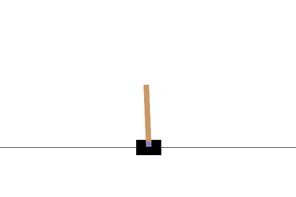
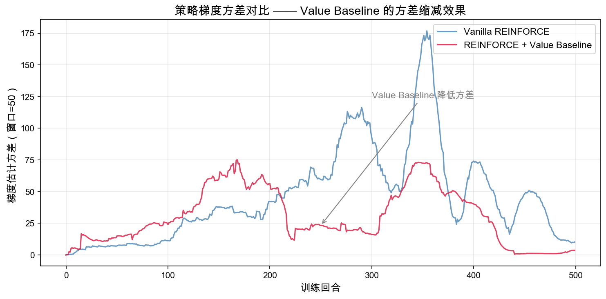

# 5.5 ：

> ****： `CartPole-v1`  REINFORCE  REINFORCE + Value Baseline， $V(s)$ 、。

> ****：[reinforce_with_baseline.py](https://github.com/letslego/hands-on-modern-rl/blob/main/code/chapter05_policy_gradient/reinforce_with_baseline.py) · [render_cartpole_baseline.py](https://github.com/letslego/hands-on-modern-rl/blob/main/code/chapter05_policy_gradient/render_cartpole_baseline.py) · [reinforce_cartpole.py](https://github.com/letslego/hands-on-modern-rl/blob/main/code/chapter05_policy_gradient/reinforce_cartpole.py) · [requirements.txt](https://github.com/letslego/hands-on-modern-rl/blob/main/code/chapter05_policy_gradient/requirements.txt)

 vanilla REINFORCE 。， $G_t - V(s_t)$  $G_t$ 。

## 

```bash
pip install -r code/chapter05_policy_gradient/requirements.txt
```

```bash
python code/chapter05_policy_gradient/reinforce_with_baseline.py
```

：

|                        |        |       |                              |
| -------------------------- | -------------- | ------------- | ------------------------------------ |
| Vanilla REINFORCE          | $G_t$          |             |        |
| REINFORCE + Value Baseline | $G_t - V(s_t)$ | Value Network |  |

 CartPole 。： $G_t$；Value Baseline  $V(s_t)$， $G_t - V(s_t)$ 。

：

|                                             |                        |
| --------------------------------------------------- | -------------------------- |
| `output/reinforce_baseline_reward_comparison.png`   |      |
| `output/reinforce_baseline_variance_comparison.png` |  |

 GIF：

```bash
python code/chapter05_policy_gradient/render_cartpole_baseline.py \
  --episodes 500 \
  --seed 0
```

## 


 episode ，。

， REINFORCE  50  `95.1`——，，。， 50  `493.0`， CartPole  `500` 。

：。，""，。

## 

，。

**Vanilla REINFORCE：，。**
 `166`。，。



**REINFORCE + Value Baseline：。**
 `355`。，。


## 

""。：？



。， episode ；，。

， REINFORCE  `100.41`，Value Baseline  `38.27`。Value Baseline  `38.1%`。：，""。

## 

 REINFORCE ：

```python
returns_t = torch.FloatTensor(returns)
log_probs = torch.log(action_probs + 1e-8)
loss = -(log_probs * returns_t).mean()
```

 `returns_t`  $G_t$。，——""。

，：

```python
values = value_net(states_t)
value_loss = nn.MSELoss()(values, returns_t)
```

： $s_t$ ，。 $G_t$，：

```python
with torch.no_grad():
    values_pred = value_net(states_t)

advantages = returns_t - values_pred
policy_loss = -(log_probs * advantages).mean()
```

 `advantages` ，，；，，。

，。——""。

## 

。，——。 $V(s_t)$ ，，。

，，，。 $G_t - V(s_t)$ ，。

""： 100 ， 100 ， 100 ，。

## 

**：。**
。CartPole  `+1`。。

**：。**
，。 $V(s)$，，。。

**： Actor-Critic。**
 REINFORCE with Value Baseline。 episode ， Monte Carlo  $G_t$ 。 Actor-Critic  TD ，。

## 

1.  `num_episodes`  `200`，。
2.  `1e-3`  `5e-4`  `2e-3`，。
3.  `advantages.mean()`  `advantages.std()`， 0 。
4.  Value Network  `128`  `32`，。
