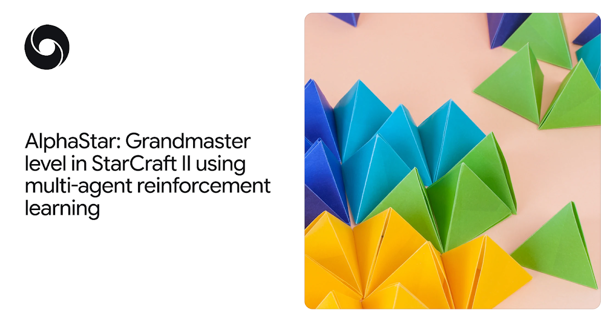
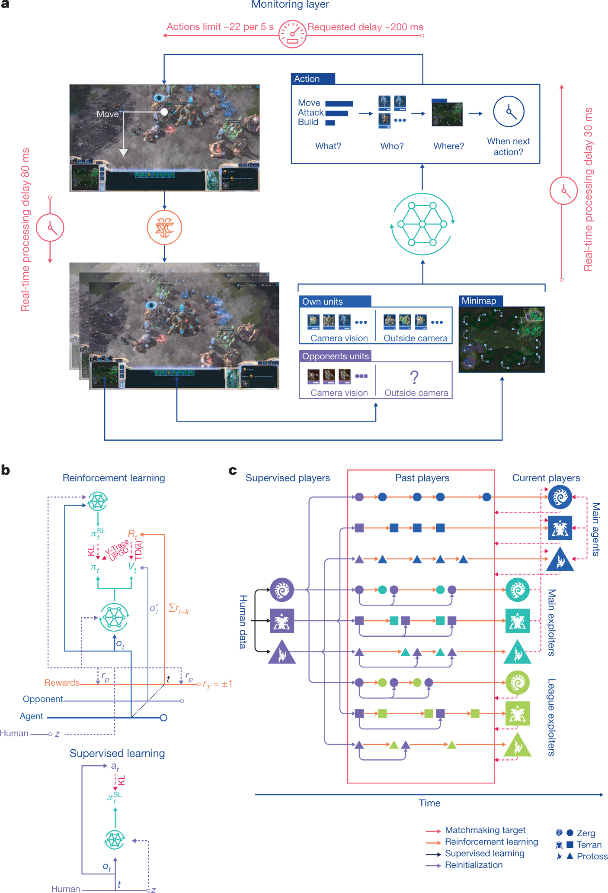
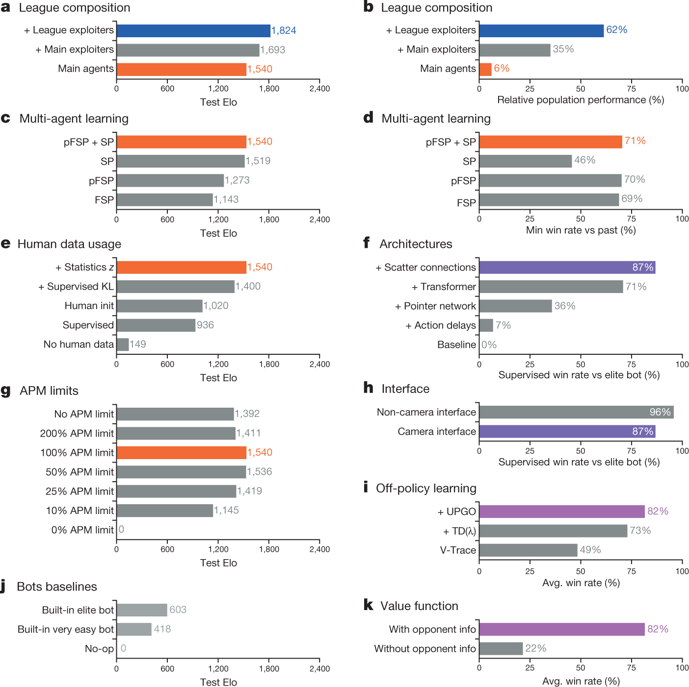
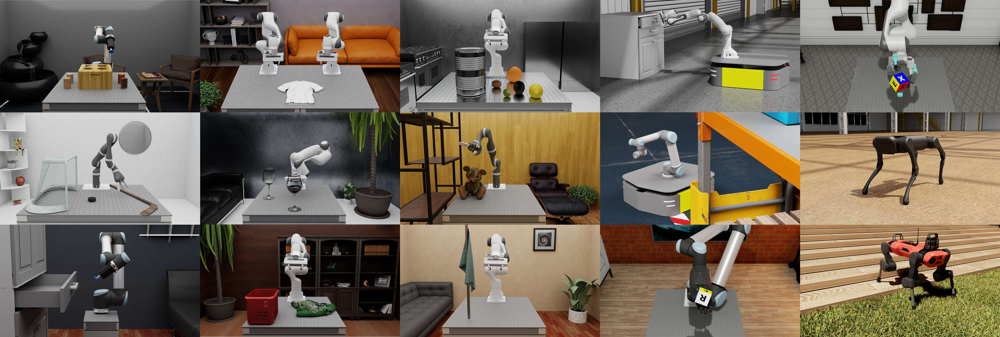

# 6.4 Actor-Critic 

 CartPole、LunarLander ——、，CPU 。 Actor-Critic ：****。 Actor-Critic ，： AI、、。

|              |             |                      |                                 |
| ---------------- | --------------- | ------------------------ | ----------------------------------- |
| AlphaStar        | DeepMind        |  II              | Grandmaster ，Top 0.2%  |
| SAC    | DeepMind / BAIR |  |               |
| NVIDIA Isaac Lab | NVIDIA          |        | GPU ，          |

## AlphaStar： Actor-Critic  Grandmaster

** II**（StarCraft II） 2010 ****（RTS）。——**Terran**（）、**Protoss**（） **Zerg**（），（）、、、，。，****：，""，——、、、、、，** APM**（） 300-500。

  <em> II 。，（），。</em>

### 

AlphaGo  2016 ， II  AI 。****：， 19×19 ， 361 。 II ****：，、、，、、—— $10^{26}$ 。 10,000 ， ~250 。

  <em>AlphaStar：Grandmaster level in StarCraft II using multi-agent reinforcement learning， <a href="https://doi.org/10.1038/s41586-019-1724-z" target="_blank" rel="noopener noreferrer">Nature 2019</a>。</em>

2019 ，DeepMind  AlphaStar  II  Grandmaster  AI， Battle.net  0.2% [^vinyals2019]。

### AlphaStar 

AlphaStar  Actor-Critic 。（、、、）， Transformer torso ， LSTM core ，。

  <em> 1：AlphaStar 。(a) ：；(b) ：（）（）；(c) （PBT）：。：<a href="https://doi.org/10.1038/s41586-019-1724-z" target="_blank" rel="noopener noreferrer">Vinyals et al., 2019, Fig.1</a>。</em>

**Actor（）** 。"/"，Actor ****（autoregressive policy head）：（move、attack、build...），，，。

**Critic（）**  $V(s)$，。 Critic —— 4  CartPole ， 2 。

### ：V-trace Actor-Critic

AlphaStar  **V-trace**， off-policy  Actor-Critic  [^espeholt2018]。

 Actor-Critic ：

$$\nabla_\theta J \approx \nabla_\theta \log \pi_\theta(a|s) \cdot \hat{A}(s,a)$$

 $\hat{A}(s,a)$  TD Error ：$\hat{A}(s,a) = r + \gamma V(s') - V(s)$。

V-trace  **off-policy** 。，AlphaStar ，。， Actor （）。——V-trace ****：

$$v_s = V(s) + \sum_{t=s}^{s+n-1} \gamma^{t-s} \left(\prod_{k=s}^{t-1} \gamma c_k\right) \rho_t (r_t + \gamma V(s_{t+1}) - V(s_t))$$

 $\rho_t = \min\left(\bar{\rho}, \frac{\pi(a_t|s_t)}{\mu(a_t|s_t)}\right)$ ，$c_k = \min\left(\bar{c}, \frac{\pi(a_k|s_k)}{\mu(a_k|s_k)}\right)$ 。：V-trace  Actor ""，。

### 

AlphaStar **（League Training）**。：

- **Main Agent**：，
- **Main Exploiter**：，
- **League Exploiter**：

  <em> 2：AlphaStar 。（Self-play），； Exploiter ，Exploiter ，、。：<a href="https://doi.org/10.1038/s41586-019-1724-z" target="_blank" rel="noopener noreferrer">Vinyals et al., 2019</a>。</em>

 Actor-Critic 。，。 AlphaStar ——。

### 

 **44 **，，**** self-play 。 **2 **， TPU  **12,000 **。

  <em> 3：AlphaStar  TrueSkill 。(a) AlphaStar Final ；(b) （Terran/Protoss/Zerg） TrueSkill ；(c) 。AlphaStar  Grandmaster 。：<a href="https://doi.org/10.1038/s41586-019-1724-z" target="_blank" rel="noopener noreferrer">Vinyals et al., 2019, Fig.3</a>。</em>

::: tip AlphaStar 
Actor = （），Critic = （ $V(s)$）， = V-trace TD Error， =  Actor-Critic 。 Actor-Critic  AI 。
:::

****：Vinyals, O., et al. (2019). Grandmaster level in StarCraft II using multi-agent reinforcement learning. _Nature_, 575, 350-354. [DOI](https://doi.org/10.1038/s41586-019-1724-z)

****：[google-deepmind/alphastar](https://github.com/google-deepmind/alphastar) — DeepMind  AlphaStar （PyTorch + JAX）

****：AlphaStar Unplugged (2023)  AlphaStar  RL， II  RL  [^alphastar_unplugged]。

## SAC：Actor-Critic 

###  SAC

 A2C  CartPole ，：（）（）。**SAC（Soft Actor-Critic）** [^haarnoja2018]  Tuomas Haarnoja  UC Berkeley  BAIR ， Actor-Critic ****：

$$J(\pi) = \mathbb{E}_{\pi} \left[ \sum_t \gamma^t \left( r(s_t, a_t) + \alpha \, \mathcal{H}(\pi(\cdot|s_t)) \right) \right]$$

 $r(s_t, a_t)$ ，$\mathcal{H}(\pi(\cdot|s_t)) = -\mathbb{E}_{a \sim \pi}[\log \pi(a|s)]$ （""），$\alpha$ ，""""。

SAC ，。，—— sim-to-real 。

### SAC  Critic 

 A2C ，SAC  Critic （Twin Q-Networks） $Q(s,a)$，Actor 。

 Critic  $\min(Q_1, Q_2)$  Q —— Actor ，。

**Actor **：：

$$\nabla_\theta J(\pi_\theta) \approx \nabla_\theta \mathbb{E}_{s} \left[ \mathbb{E}_{a \sim \pi_\theta} \left[ \min_{i=1,2} Q_i(s,a) - \alpha \log \pi_\theta(a|s) \right] \right]$$

**Critic **： Bellman （）：

$$\mathcal{L}(Q_i) = \mathbb{E} \left[ \left( Q_i(s,a) - \left( r + \gamma \min_{j=1,2} Q_j(s',a') - \alpha \log \pi(a'|s') \right) \right)^2 \right]$$

### 

SAC ，：

  <em> 4：SAC 。：<a href="https://bair.berkeley.edu/blog/2018/12/14/sac/" target="_blank" rel="noopener noreferrer">BAIR Blog, 2018</a>。</em>

|          |        |               |                          |
| ------------ | ------------ | --------------------- | ---------------------------- |
|  | Shadow Hand  | 24 ， | ，   |
|    | Sawyer       | 7 ，    |  90%+  |
|      | ANYmal       | 12 ，   | ，   |
|    | Franka Emika | ，  |          |

： SAC ，。SAC ， sim-to-real 。

### SAC  Benchmark 

BAIR  SAC  DDPG、TD3、PPO  MuJoCo 。 HalfCheetah  Humanoid ，SAC（）、：

  <em> 5：SAC  HalfCheetah-v2 。SAC（） PPO  DDPG，。：<a href="https://bair.berkeley.edu/blog/2018/12/14/sac/" target="_blank" rel="noopener noreferrer">BAIR Blog</a>。</em>

<!-- TODO:  SAC Humanoid-v2  -->

  <em> 6：SAC  Humanoid-v2（17 ）。，SAC 。：<a href="https://bair.berkeley.edu/blog/2018/12/14/sac/" target="_blank" rel="noopener noreferrer">BAIR Blog</a>。</em>

::: tip SAC 
Actor = （ $\mu$  $\sigma$），Critic =  Q （$Q_1, Q_2$）， = $Q(s,a) - V(s)$  $Q$  Critic ， = 。SAC  Actor-Critic  Critic 。
:::

****：

- Haarnoja, T., et al. (2018). Soft Actor-Critic: Off-Policy Maximum Entropy Deep RL with a Stochastic Actor. _ICML_. [arXiv](https://arxiv.org/abs/1801.01290)
- Haarnoja, T., et al. (2018). Soft Actor-Critic Algorithms and Applications. [arXiv](https://arxiv.org/abs/1812.05905)

****：[rail-berkeley/softlearning](https://github.com/rail-berkeley/softlearning) — SAC 

****：[Soft Actor-Critic: Deep RL with Real-World Robots](https://bair.berkeley.edu/blog/2018/12/14/sac/) — BAIR 

## NVIDIA Isaac Lab： Actor-Critic 

### 

、、CPU 。：

|        |               |                                   |
| ---------- | --------------------- | --------------------------------------- |
|  | 1                     |                               |
|    | Gymnasium（） | GPU /                   |
|  |               | （、、、...） |
|    |                 |                             |
|    |                 |                               |

NVIDIA Isaac Lab（ Isaac Orbit）。 Isaac Sim 。Isaac Lab  Actor-Critic ： RL （PPO、SAC、TD3 ） Actor-Critic —— **Actor**（）， **Critic**（），Learner  rollout  Actor  Critic 。Isaac Lab " Actor 、 Critic " CartPole  GPU  [^mittal2023]。

  <em> 7：NVIDIA Isaac Lab 。 GPU  Isaac Sim ，。：<a href="https://isaac-sim.github.io/IsaacLab/" target="_blank" rel="noopener noreferrer">NVIDIA Isaac Lab</a>。</em>

### 

Isaac Lab ，：

  <em> 8：Isaac Lab 。：、、，、。：<a href="https://isaac-sim.github.io/IsaacLab/" target="_blank" rel="noopener noreferrer">NVIDIA Isaac Lab</a>。</em>

|              |            |                      |
| ------------------ | -------------- | ---------------------------- |
| Franka Emika Panda | 7  | 、、         |
| ANYmal             |      | 、               |
| Unitree Go1/H1     | /      | 、               |
| Shadow Hand        |          | （、） |

，Isaac Lab  RL （rl_games、skrl、rlrig ）， PPO、SAC、DDPG、TD3、A2C  Actor-Critic 。

### ：Sim-to-Real 

——、、。Isaac Lab ****： episode 。

：""，。OpenAI  2019 —— Shadow Hand。

### 

|          |                           |
| ------------ | ----------------------------- |
|    |  GPU  2,000~16,000      |
|    | ~100,000 steps/（ GPU）   |
|  | 1-8 （）  |
| GPU      | NVIDIA RTX 3090 / A100 / H100 |

::: tip Isaac Lab 
 Actor-Critic " CartPole"""。（PPO、SAC  AC），、。Actor-Critic "，"， GPU 。
:::

****：[isaac-sim/IsaacLab](https://github.com/isaac-sim/IsaacLab) — NVIDIA （MIT License）

****：[Isaac Lab Documentation](https://isaac-sim.github.io/IsaacLab/)

****：Mittal, M., et al. (2023). Orbit: A Unified Simulation Framework for Interactive Robot Learning Environments. _IEEE RA-L_. [arXiv](https://arxiv.org/abs/2301.04195)

## 

|                 | AlphaStar                | SAC                    | Isaac Lab                 |
| --------------- | ------------------------ | ---------------------------- | ------------------------- |
| ****        |  AI                  |                    |               |
| **AC **     | V-trace off-policy AC    |  AC（ Q ）       | PPO / SAC / TD3     |
| **Actor **  | （） | （+）      |           |
| **Critic ** | $V(s)$（）           | $Q_1(s,a), Q_2(s,a)$（ Q） | $V(s)$  $Q(s,a)$        |
| ****    | ，44             | ，             | ，          |
| ****    |  + V-trace   |  +  Critic         | GPU  +        |
| ****        | Grandmaster          |                |  sim-to-real  |

：** Actor + Critic **。（V-trace vs  vs  PPO）、（ vs  GPU ）（ vs ）。Actor-Critic  CartPole ，"，"。

， Pendulum  Actor-Critic ：[：Pendulum ](./pendulum)。

---

[^vinyals2019]: Vinyals, O., et al. (2019). Grandmaster level in StarCraft II using multi-agent reinforcement learning. _Nature_, 575, 350-354. [DOI](https://doi.org/10.1038/s41586-019-1724-z)

[^espeholt2018]: Espeholt, L., et al. (2018). IMPALA: Scalable Distributed Deep-RL with Importance Weighted Actor-Learner Architectures. _ICML_. [arXiv](https://arxiv.org/abs/1802.01561)

[^haarnoja2018]: Haarnoja, T., et al. (2018). Soft Actor-Critic: Off-Policy Maximum Entropy Deep Reinforcement Learning with a Stochastic Actor. _ICML_. [arXiv](https://arxiv.org/abs/1801.01290)

[^alphastar_unplugged]: AlphaStar Unplugged: Large-Scale Offline Reinforcement Learning. (2023). [arXiv](https://arxiv.org/abs/2308.03526)

[^mittal2023]: Mittal, M., et al. (2023). Orbit: A Unified Simulation Framework for Interactive Robot Learning Environments. _IEEE RA-L_. [arXiv](https://arxiv.org/abs/2301.04195)
