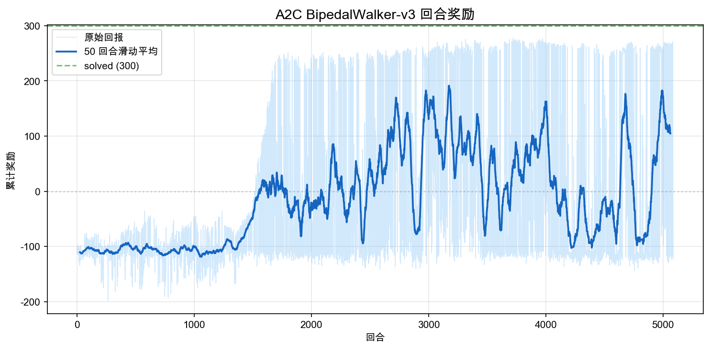
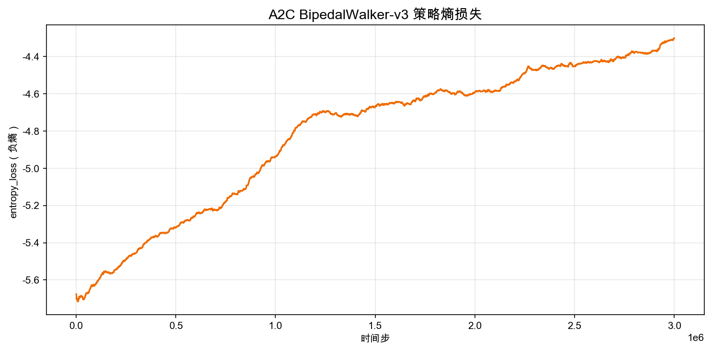

# 6.5 ：BipedalWalker 

> ****： A2C  `BipedalWalker-v3`， Actor-Critic —— PPO。

> ****：[actor_critic_bipedalwalker.py](https://github.com/letslego/hands-on-modern-rl/blob/main/code/chapter06_actor_critic/actor_critic_bipedalwalker.py) · [render_bipedalwalker.py](https://github.com/letslego/hands-on-modern-rl/blob/main/code/chapter06_actor_critic/render_bipedalwalker.py) · [requirements.txt](https://github.com/letslego/hands-on-modern-rl/blob/main/code/chapter06_actor_critic/requirements.txt)

 Pendulum  1 、3 。BipedalWalker ：24 （、、），4 （），。

## 6.5.1 ：BipedalWalker-v3

```
        O          ← 
       /|\
      / | \        ← 
     /  |  \
    🔶   🔶       ← 
    |     |        ← 
    🔷   🔷       ← 
    |     |        ← 
   ___   ___       ← 
```

|           |                                                   |
| ------------- | --------------------------------------------------- |
|       | 24（、、、10 ） |
|       | 4（、、、， $[-1, 1]$） |
|           |  +  -                       |
|           | （）                          |
| "Solved"  |  > 300                                      |

BipedalWalker ****：4 ，。

 Pendulum  BipedalWalker， 3  24、 1  4。： 4 ****——、、。""，。

|          | Pendulum   | BipedalWalker         |
| -------- | ---------- | --------------------- |
|  | 3          | 24                    |
|  | 1          | 4                     |
|  |      |               |
|      |  |  +  |

## 6.5.2 

：

```bash
pip install -r code/chapter06_actor_critic/requirements.txt
```

：

```bash
python code/chapter06_actor_critic/actor_critic_bipedalwalker.py \
  --total-timesteps 100000
```

 Stable-Baselines3  A2C ， Pendulum ， BipedalWalker ：16 、`[128, 128]` 。：

```bash
python code/chapter06_actor_critic/actor_critic_bipedalwalker.py \
  --total-timesteps 3000000
```

BipedalWalker  Pendulum 。A2C  300 ， CPU  8-10 。， `--total-timesteps 100000` 。

A2C  BipedalWalker ：

```python
model = A2C(
    policy="MlpPolicy",               # 
    env=vec_env,                       # 16 
    learning_rate=7e-4,                # 
    n_steps=32,                        #  rollout 
    gamma=0.99,                        # 
    gae_lambda=0.95,                   # GAE λ
    ent_coef=0.0,                      # 
    vf_coef=0.5,                       # 
    max_grad_norm=0.5,                 # 
    policy_kwargs=dict(net_arch=[128, 128]),  #  128 
)
```

 Pendulum ， 8  16 （BipedalWalker episode ，）， `[64, 64]`  `[128, 128]`（24 ）。

 `output/` 、：

|                                      |                   |
| ---------------------------------------- | --------------------- |
| `actor_critic_bipedalwalker.zip`         |  A2C      |
| `actor_critic_bipedalwalker_500k.zip`    | 500k          |
| `actor_critic_bipedalwalker_1000k.zip`   | 1M            |
| `actor_critic_bipedalwalker_2000k.zip`   | 2M            |
| `actor_critic_bipedalwalker_reward.png`  |           |
| `actor_critic_bipedalwalker_entropy.png` |         |
| `actor_critic_bipedalwalker_loss.png`    | Actor/Critic  |

## 6.5.3 ：，

 3M 。A2C  PPO  noisy、—— Actor-Critic 。

### 



<div style="text-align: center; font-size: 0.9em; color: var(--vp-c-text-2); margin-top: -10px; margin-bottom: 20px;">
  <em> 6.5-1：。， 50 。 solved （300 ）。</em>
</div>

：

- **0-1M **： -110  -40 。""""。 PPO ，。
- **1M-2M **：。，—— 200+ ， -120 。 0-100 。 A2C ：，。
- **2M-3M **：""。 100-150 ，（ -80  +200）。

 Pendulum ，BipedalWalker 。Pendulum ， BipedalWalker ——""。

### 



<div style="text-align: center; font-size: 0.9em; color: var(--vp-c-text-2); margin-top: -10px; margin-bottom: 20px;">
  <em> 6.5-2：（）。 -5.37  -4.38， 5.37  4.38。</em>
</div>

 5.37  4.38， Pendulum 。 BipedalWalker ，A2C ——4 。

， Pendulum ""。 A2C （on-policy），。 rollout ，；，，。

### 


<div style="text-align: center; font-size: 0.9em; color: var(--vp-c-text-2); margin-top: -10px; margin-bottom: 20px;">
  <em> 6.5-3：Policy loss  Value loss。 Y —— spike 。</em>
</div>

** spike**。Value loss（） 100-200， Critic 。——，Critic 。

 spike ： → Critic  →  Actor  advantage  → 。 vanilla Actor-Critic 。

## 6.5.4 

 A2C ，。，。

， GIF：

```bash
python code/chapter06_actor_critic/render_bipedalwalker.py \
  --model output/actor_critic_bipedalwalker.zip \
  --output-dir output/bipedalwalker_a2c_episodes \
  --episodes 3 --seeds 0 1 2
```

### （500k ， -52.9）

500k 。 1600 ，——。 PPO  100k ，A2C ""。


### （2M ， 263.8）

2M ，。20 ， 15%  100 ，。——。，。


### （3M ， 274.2）

3M 。 271-276 ， 10-15% （-47  -59 ）。 A2C ：**， PPO **。


（20 ）：

|  |  |  |                                  |
| -------- | -------- | ------ | ------------------------------------ |
| 500k     | -50.0    | 5.7    | ， 1600  |
| 2M       | -66.4    | 97.0   | ： 15% ，  |
| 3M       | 221.8    | 107.6  |  270+， 10-15%   |

## 6.5.5 A2C vs PPO：，

 7  7.1 （BipedalWalker-v3）， A2C  PPO 。：

|             | A2C（） | PPO（7.1 ） |
| --------------- | ----------- | ------------- |
|         | 3M          | 2M            |
| 20  | 221.8       | 282.5         |
|           | 107.6       | 59.7          |
|     | 271-276     | 293-299       |
|           | ~15%        | ~5%           |
|     |     |       |

： Actor-Critic，Actor ，Critic  $V(s)$。****：

- **A2C**：， advantage 。，。
- **PPO**： A2C （clipping），。（epoch），。

 Pendulum （）， BipedalWalker ：

1. ****：A2C ，""""。PPO 。
2. ****：A2C  276 ，PPO  295+。，****。
3. ****：A2C  3M  PPO 2M 。PPO （ epoch ）。

## 6.5.6 

BipedalWalker 。，。

，。300  A2C ，。，。A2C ， `--total-timesteps` 。

，。16 。A2C ， 4 ，。

，""。 -50 ，""，。 `ent_coef`  0.01 。

，。 `[128, 128]`  24 。 `[256, 256]`：

```python
model = A2C(
    policy="MlpPolicy",
    policy_kwargs=dict(net_arch=[256, 256]),
    ...
)
```

：

|             |      |                       |
| --------------- | ------------ | ------------------------------------- |
| `learning_rate` | `7e-4`       | ，      |
| `n_steps`       | `32`         |  advantage ， |
| `num_envs`      | `16`         | ，  |
| `net_arch`      | `[128, 128]` | ，    |
| `gamma`         | `0.99`       | ，  |

## 

 REINFORCE ， Actor-Critic ： Critic  $V(s)$ ， Actor 。 CartPole（） Pendulum（1 ） BipedalWalker（4 ）， Actor-Critic 。

 BipedalWalker  vanilla Actor-Critic ：****。，A2C ， PPO。

， Actor-Critic —— PPO ：[ 7  PPO](../chapter07_ppo/intro)。
