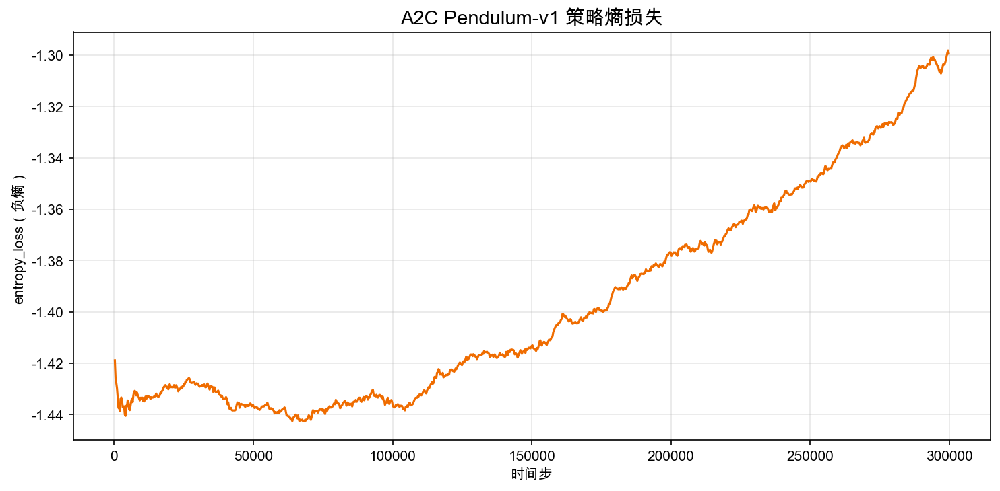
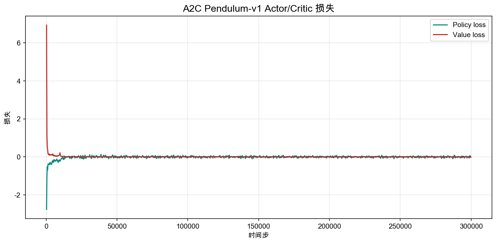

# 6.4 ：Pendulum 

> ****： A2C  `Pendulum-v1`， Actor-Critic ， Critic  Actor 。

> ****：[actor_critic_pendulum.py](https://github.com/letslego/hands-on-modern-rl/blob/main/code/chapter06_actor_critic/actor_critic_pendulum.py) · [render_pendulum.py](https://github.com/letslego/hands-on-modern-rl/blob/main/code/chapter06_actor_critic/render_pendulum.py) · [requirements.txt](https://github.com/letslego/hands-on-modern-rl/blob/main/code/chapter06_actor_critic/requirements.txt)

 CartPole、LunarLander “”。 DQN， Softmax ：、、、，。

。`Pendulum-v1` ，。 -2， 0.17， 1.843。， $[-2, 2]$。 Actor-Critic ：**，“”？**

## 6.4.1 ：，

Pendulum ：，，，。

 3 ：

|      |                |
| ------------ | ------------------ |
| $\cos\theta$ |  |
| $\sin\theta$ |  |
| $\dot\theta$ |          |

 1 ：

|  |                                |
| -------- | ---------------------------------- |
| $a$      | ， $[-2, 2]$ |

：

$$
r = -(\theta^2 + 0.1\dot\theta^2 + 0.001a^2)
$$

 $\theta$ ，$\dot\theta$ ，$a$ 。：，；，；，。、 0、， 0。

 Pendulum 。 -1200  -900 ； -500、-300  0 。，“”， 0。

## 6.4.2  DQN 

 DQN 。DQN  $Q(s,a)$，：

$$
a^* = \arg\max_a Q(s,a)
$$

。CartPole ， $Q(s,\text{left})$  $Q(s,\text{right})$，。

 Pendulum  $[-2,2]$ 。 $\arg\max_a Q(s,a)$， $Q$ 。“”，。

 $[-2,2]$ ， 21 ：

$$
\{-2.0,-1.8,-1.6,\ldots,1.8,2.0\}
$$

 DQN ，。，， 0.37 。，，。Pendulum  1 ，BipedalWalker  4 ， 21 ， $21^4=194481$。

，“DQN ”，：**。**

## 6.4.3  Actor：

，：

$$
\pi(a|s) = [0.2, 0.8]
$$

，。 Actor 。 Pendulum ，：

$$
a \sim \mathcal{N}(\mu_\theta(s), \sigma_\theta(s)^2)
$$

 $\mu_\theta(s)$  $s$ ，$\sigma_\theta(s)$ 。，：Actor “ 0.7”，“ 0.7 ，”。

：

```python
class ActorCriticContinuous(nn.Module):
    def __init__(self, state_dim=3, action_dim=1, hidden_dim=128):
        super().__init__()
        self.shared = nn.Sequential(
            nn.Linear(state_dim, hidden_dim),
            nn.ReLU(),
            nn.Linear(hidden_dim, hidden_dim),
            nn.ReLU(),
        )
        self.mu_head = nn.Linear(hidden_dim, action_dim)
        self.log_std = nn.Parameter(torch.zeros(action_dim))
        self.value_head = nn.Linear(hidden_dim, 1)

    def forward(self, state):
        features = self.shared(state)
        mu = torch.tanh(self.mu_head(features)) * 2.0
        std = torch.exp(self.log_std).expand_as(mu)
        value = self.value_head(features)
        return mu, std, value
```

。

，`mu_head` 。 Pendulum  $[-2,2]$， `tanh`  $[-1,1]$， 2。

，`log_std` 。 $\sigma$， $\log\sigma$， `exp` 。。

，`value_head`  Critic， $V(s)$。， Actor  Critic 。 Actor-Critic：Actor ，Critic 。

## 6.4.4 Critic  Actor 

 Actor 。“”。Critic 。

，Critic  $V(s_t)$， TD ：

$$
y_t = r_t + \gamma V(s_{t+1})
$$

 TD ：

$$
\delta_t = y_t - V(s_t)
$$

 $\delta_t$  Actor  advantage 。 $\delta_t>0$， Critic ，Actor ； $\delta_t<0$，，Actor 。

，：

```python
td_target = reward + gamma * not_done * next_value
advantage = td_target - value

actor_loss = -(log_prob * advantage.detach())
critic_loss = advantage.pow(2).mean()
loss = actor_loss + 0.5 * critic_loss - 0.001 * entropy
```

`actor_loss` ，。： advantage ， `log_prob`； advantage ， `log_prob`。 loss ， `-(log_prob * advantage)`。

`critic_loss`  Critic  TD 。 `entropy` ，。

## 6.4.5 

：

```bash
pip install -r code/chapter06_actor_critic/requirements.txt
```

：

```bash
python code/chapter06_actor_critic/actor_critic_pendulum.py \
  --total-timesteps 20000
```

 Stable-Baselines3  **A2C（Advantage Actor-Critic）** 。A2C  Actor-Critic：Actor ，Critic  $V(s)$，，。：

```bash
python code/chapter06_actor_critic/actor_critic_pendulum.py \
  --total-timesteps 300000
```

 `output/` 、：

|                                      |                   |
| ---------------------------------------- | --------------------- |
| `actor_critic_pendulum.zip`              |  A2C      |
| `actor_critic_pendulum_vecnormalize.pkl` |   |
| `actor_critic_pendulum_reward.png`       |           |
| `actor_critic_pendulum_entropy.png`      |         |
| `actor_critic_pendulum_loss.png`         | Actor/Critic  |

，：

```bash
cp output/actor_critic_pendulum_*.png docs/chapter06_actor_critic/images/
```

， GIF：

```bash
python code/chapter06_actor_critic/render_pendulum.py \
  --model output/actor_critic_pendulum.zip \
  --output output/pendulum_actor_critic.gif
```

## 6.4.6 ：，

 300k 。 A2C  on-policy Actor-Critic，， 7  PPO ；，。


<div style="text-align: center; font-size: 0.9em; color: var(--vp-c-text-2); margin-top: -10px; margin-bottom: 20px;">
  <em> 6.4-1：A2C  Pendulum 。 -761，，。</em>
</div>


<div style="text-align: center; font-size: 0.9em; color: var(--vp-c-text-2); margin-top: -10px; margin-bottom: 20px;">
  <em> 6.4-2：。， 20 ， A2C  -800。</em>
</div>

 **-780 ± 39**（20 ）， **-750**。，。： Pendulum ，，“ Actor +  Critic + advantage ”。

。

- ****： -1200 。，。
- ****：。，。
- ****： -1000  -800 。，。

Pendulum  CartPole ，，。，；，。：“/”，。

## 6.4.7 ：

，。 $\sigma$ ，；，。



<div style="text-align: center; font-size: 0.9em; color: var(--vp-c-text-2); margin-top: -10px; margin-bottom: 20px;">
  <em> 6.4-3：。SB3  entropy_loss，； 0，。</em>
</div>

，。，。 Critic  advantage ，Actor ，。

。，，，。A2C、PPO ，。

 `ent_coef=0.0`，， Pendulum 。，。

## 6.4.8 ：Actor  Critic 

“”，。



<div style="text-align: center; font-size: 0.9em; color: var(--vp-c-text-2); margin-top: -10px; margin-bottom: 20px;">
  <em> 6.4-4：Actor/Critic 。 Actor-Critic  noisy，。</em>
</div>

Critic loss  TD ：

$$
(\delta_t)^2 = (r_t + \gamma V(s_{t+1}) - V(s_t))^2
$$

 Critic loss ，，Actor  advantage 。Actor loss  `log_prob * advantage` ，；，。

 loss。：， Critic loss ，。

## 6.4.9 

 Pendulum ，。

，。`--total-timesteps 20000` ，。 300k 。

， `VecNormalize`。Pendulum ，Critic 。 `actor_critic_pendulum_vecnormalize.pkl`，。

， Critic loss 。 TD ，Actor  advantage  noisy。，。

，。 -2  2，“”，。， PPO 。

：

|             |  |                       |
| --------------- | -------- | ------------------------------------- |
| `learning_rate` | `7e-4`   | ，              |
| `n_steps`       | `32`     |  advantage ， |
| `gamma`         | `0.99`   | ，  |
| `num_envs`      | `8`      | ，          |
| `VecNormalize`  |      |  Critic   |

## 6.4.10 

Pendulum 。，：Actor  Softmax ，，。

Critic 。 $V(s)$ ， TD  Actor：，。，。

， vanilla Actor-Critic ：，。 PPO  Actor-Critic “”，。

，：[：BipedalWalker ](./bipedalwalker)。
