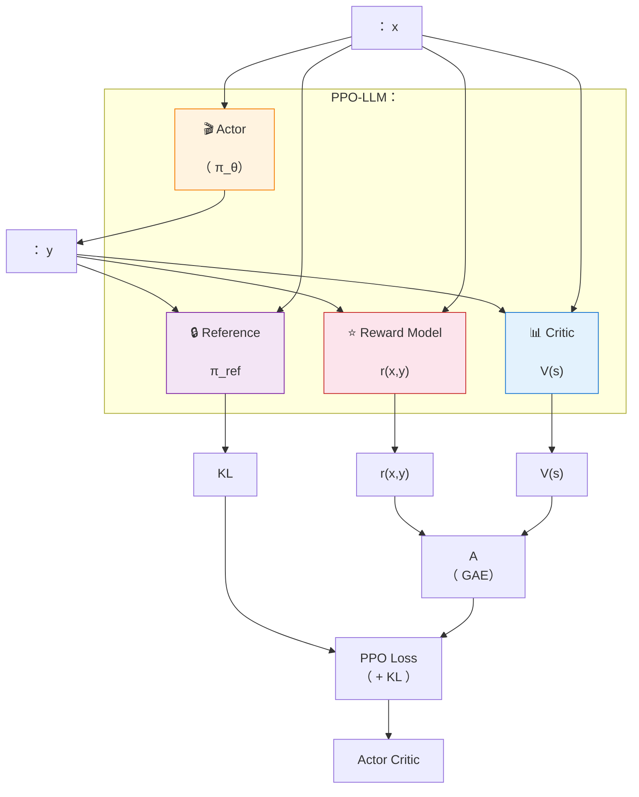

# 7.4 

## 

****

- ：TD （、），MC （、）
- GAE： $\lambda$  TD  MC 
- Reward Model： Bradley-Terry 
- LLM ：（500  1 ）

 PPO ——"""KL "（：[](./trust-region-clipping)）。 PPO  $r_t(\theta) \cdot A_t$ ：** $A_t$ ？**  GAE 。 LLM ，——****？ Reward Model 。

，： 5  episode， $1$， $0$。 LLM  5  token、 token ：

|  $t$ |  $r_t$ | Critic  $V(s_t)$ |  |
| ------ | -------------- | -------------------- | -------- |
| 0      | 0              | 0.1                  |        |
| 1      | 0              | 0.2                  |        |
| 2      | 0              | 0.3                  |        |
| 3      | 0              | 0.5                  |        |
| 4      | 1              | 0.8                  |        |

： TD  MC ， GAE ， LLM ，。

::: tip 

- [ $A(s,a) = Q - V$](../chapter06_actor_critic/advantage-function)——GAE 
- [TD Error $\delta = r + \gamma V(s') - V(s)$](../chapter06_actor_critic/critic-training)——GAE 
- [DP/MC/TD ](../chapter03_mdp/dp-mc-td)——GAE  TD  MC 
- [](../chapter03_mdp/reward-design)——RM  3 
  :::

## ：TD  MC

（：[ 6.1 ](../chapter06_actor_critic/advantage-function)）：

$$A(s_t, a_t) = Q(s_t, a_t) - V(s_t)$$

"，"。 $Q(s_t, a_t)$ ——""，。

 3 （：[DP/MC/TD ](../chapter03_mdp/dp-mc-td)）。 5  episode 。

### TD ：

TD （：[TD ](../chapter06_actor_critic/critic-training)） Critic ：

$$A_t^{\text{TD}} = r_t + \gamma V(s_{t+1}) - V(s_t) = \delta_t$$

 $\gamma = 1$，：

| $t$ | $r_t + V(s_{t+1}) - V(s_t)$ | $\delta_t$ |
| --- | --------------------------- | ---------- |
| 0   | $0 + 0.2 - 0.1$             | $0.1$      |
| 1   | $0 + 0.3 - 0.2$             | $0.1$      |
| 2   | $0 + 0.5 - 0.3$             | $0.2$      |
| 3   | $0 + 0.8 - 0.5$             | $0.3$      |
| 4   | $1 + 0 - 0.8$               | $0.2$      |

 $V(s_5) = 0$（episode ）。TD  $\delta_t$。——；—— Critic  $V$ ， $\gamma V(s_{t+1})$  $\delta_t$。

****。 Critic  $V(s_t) = V^*(s_t) + b_t$， $V^*$ 、$b_t$  Critic 。 TD：

$$\delta_t = r_t + \gamma V(s_{t+1}) - V(s_t) = \underbrace{r_t + \gamma V^*(s_{t+1}) - V^*(s_t)}_{\text{ TD}} + \underbrace{\gamma b_{t+1} - b_t}_{\text{Critic }}$$

$\gamma = 1$  Critic （$b_t \approx b$）——。 $\gamma < 1$  Critic ，$\gamma b_{t+1} - b_t \neq 0$，。**Critic 、，TD **。

### MC ：

MC （：[MC ](../chapter03_mdp/dp-mc-td)） episode ， $t$  $V(s_t)$：

$$A_t^{\text{MC}} = G_t - V(s_t), \qquad G_t = \sum_{k=0}^{\infty} \gamma^k r_{t+k}$$

 $G_t$（$\gamma = 1$）：

| $t$ |             | $G_t$ |
| --- | ------------------- | ----- |
| 4   | $r_4 = 1$           | $1.0$ |
| 3   | $r_3 + G_4 = 0 + 1$ | $1.0$ |
| 2   | $r_2 + G_3 = 0 + 1$ | $1.0$ |
| 1   | $r_1 + G_2 = 0 + 1$ | $1.0$ |
| 0   | $r_0 + G_1 = 0 + 1$ | $1.0$ |

 $V(s_t)$：

| $t$ | $G_t$ | $V(s_t)$ | $A_t^{\text{MC}} = G_t - V(s_t)$ |
| --- | ----- | -------- | -------------------------------- |
| 0   | $1.0$ | $0.1$    | $0.9$                            |
| 1   | $1.0$ | $0.2$    | $0.8$                            |
| 2   | $1.0$ | $0.3$    | $0.7$                            |
| 3   | $1.0$ | $0.5$    | $0.5$                            |
| 4   | $1.0$ | $0.8$    | $0.2$                            |

MC  Critic，，。 $G_t$  $t$ ，； episode ——LLM  episode 。

****。 $s_0$ ， 50% ""（ $r_4 = +1$）、50% ""（ $r_4 = -1$）， 0。$V(s_0) = 0.1$ ：

| Episode | $G_0$        | $A_0^{\text{MC}} = G_0 - V(s_0)$ |
| ------- | ------------ | -------------------------------- |
|   | $+1$         | $+0.9$                           |
|   | $-1$         | $-1.1$                           |

 $+0.9$  $-1.1$  2.0 ，。TD ——$\delta_0 = V(s_1) - V(s_0)$， Critic  $V(s_1)$ ，$\delta_0$  episode 。**TD  Critic ， Critic **。

，：

| $t$ | $A_t^{\text{TD}}$ | $A_t^{\text{MC}}$ |
| --- | ----------------- | ----------------- |
| 0   | $0.1$             | $0.9$             |
| 1   | $0.1$             | $0.8$             |
| 2   | $0.2$             | $0.7$             |
| 3   | $0.3$             | $0.5$             |
| 4   | $0.2$             | $0.2$             |

 5  episode，TD  0.1，MC  0.9——**"" TD **， Critic 。MC ，、。

## GAE：

2016 ， Schulman， GAE（Generalized Advantage Estimation）—— $\lambda$  TD  MC ：

$$\hat{A}_t^{\text{GAE}(\gamma, \lambda)} = \sum_{k=0}^{\infty} (\gamma \lambda)^k \delta_{t+k}$$

 $\delta_t = r_t + \gamma V(s_{t+1}) - V(s_t)$  TD Error。：

- $\lambda = 0$：$\hat{A}_t = \delta_t$， TD
- $\lambda = 1$：$\hat{A}_t = \sum_{k=0}^{\infty} \gamma^k \delta_{t+k} = G_t - V(s_t)$， MC
- $0 < \lambda < 1$： $\delta_{t+k}$  $(\gamma\lambda)^k$ 

### 

—— $(\gamma\lambda)^k$，？。

 TD  MC  $\hat{A}_t = \alpha \cdot \delta_t + (1-\alpha) \cdot (G_t - V(s_t))$。 $G_t - V(s_t) = \sum_{k=0}^{\infty} \gamma^k \delta_{t+k}$——**MC  TD ， TD **。""""， $\delta_t$  $\delta_t$，。

 $\delta$ 。 $\hat{A}_t = \sum_{k=0}^{\infty} w_k \delta_{t+k}$，TD  $w_0 = 1,\; w_{k>0} = 0$，MC  $w_k = \gamma^k$。， $w_k$  $\gamma^k$ ， $\lambda^k$ ：

$$w_k = (\gamma\lambda)^k$$

- $\lambda = 0$： $w_0 = 1$ ， TD
- $\lambda = 1$：$w_k = \gamma^k$， MC
- $0 < \lambda < 1$： $\delta$  $\lambda^k$ ， MC  $\gamma^k$ 

——、， $O(N)$ 。GAE ""， $\delta$ 。

### ： $O(N^2)$  $O(N)$

 $\hat{A}_t$  $t$ ， $O(N^2)$。 $\hat{A}_t$ ：

$$\hat{A}_t = \delta_t + (\gamma\lambda)\delta_{t+1} + (\gamma\lambda)^2 \delta_{t+2} + (\gamma\lambda)^3 \delta_{t+3} + \cdots$$

 $\gamma\lambda$ ：

$$\hat{A}_t = \delta_t + \gamma\lambda \cdot \underbrace{\left[\delta_{t+1} + (\gamma\lambda)\delta_{t+2} + (\gamma\lambda)^2 \delta_{t+3} + \cdots\right]}_{\hat{A}_{t+1}}$$

 $\hat{A}_{t+1}$（ $\hat{A}_t$  $\delta_t$  $\delta_{t+1}$ ）。：

$$\hat{A}_t = \delta_t + \gamma\lambda \cdot \hat{A}_{t+1}$$

。 $\hat{A}_t$ " $\delta_t$ + "，， $O(N)$。****—— $(\gamma\lambda)^k$ 。

### 

（ $\hat{A}_t$  $\hat{A}_{t+1}$）：

$$\hat{A}_t = \delta_t + \gamma\lambda \cdot \hat{A}_{t+1}$$

 5  episode ，$\gamma = 1$：

| $t$ | $\delta_t$ | $\gamma\lambda \cdot \hat{A}_{t+1}$ | $\hat{A}_t$ |
| --- | ---------- | ----------------------------------- | ----------- |
| 4   | $0.2$      | $0$（）                         |             |
| 3   | $0.3$      | $\lambda \cdot 0.2$                 |             |
| 2   | $0.2$      | $\lambda \cdot \hat{A}_3$           |             |
| 1   | $0.1$      | $\lambda \cdot \hat{A}_2$           |             |
| 0   | $0.1$      | $\lambda \cdot \hat{A}_1$           |             |

 $\lambda$，（$\gamma=1$）：

| $t$ | $\delta_t$ | $\lambda=0$ | $\lambda=0.5$ | $\lambda=0.95$ | $\lambda=1$ |
| --- | ---------- | ----------- | ------------- | -------------- | ----------- |
| 4   | $0.2$      | $0.20$      | $0.20$        | $0.20$         | $0.20$      |
| 3   | $0.3$      | $0.30$      | $0.40$        | $0.49$         | $0.50$      |
| 2   | $0.2$      | $0.20$      | $0.40$        | $0.67$         | $0.70$      |
| 1   | $0.1$      | $0.10$      | $0.30$        | $0.73$         | $0.80$      |
| 0   | $0.1$      | $0.10$      | $0.25$        | $0.80$         | $0.90$      |

：

- $\lambda=0$  TD （）
- $\lambda=1$  MC （）
- $\lambda=0.95$ ， MC，

""， $\lambda=0.95$ （$\gamma=1$）：

| $t$ | $\hat{A}_t$                                   |      |
| --- | ------------------------------------------------------- | ------ |
| 4   | $\delta_4$                                              | $0.20$ |
| 3   | $\delta_3 + 0.95\,\delta_4$                             | $0.49$ |
| 2   | $\delta_2 + 0.95\,\delta_3 + 0.90\,\delta_4$            | $0.67$ |
| 1   | $\delta_1 + 0.95\,\delta_2 + 0.90\,\delta_3 + 0.86\,\delta_4$ | $0.73$ |
| 0   | $\delta_0 + 0.95\,\delta_1 + 0.90\,\delta_2 + 0.86\,\delta_3 + 0.81\,\delta_4$ | $0.80$ |

 $1$  $0.95 \to 0.90 \to 0.86 \to 0.81$ ， 0.95 。 $\delta_4 = 0.2$  4  $0.81 \times 0.2 \approx 0.16$  $\hat{A}_0$——""。

 $\lambda$ ， $0.1$  $0.9$——****，（ $\delta$ ）。PPO  $\lambda = 0.95$， MC ，。

| $\lambda$  |  |  |      |                   |
| ------------ | ------ | ---- | -------- | ------------------------- |
| 0.0          |  TD  |    |        | 、Critic      |
| 0.9          |  TD  |  |  |                   |
| 0.95         |    |  |      | **PPO **            |
| 0.99         |  MC  |    |      | Critic 、 |
| 1.0          |  MC  |    |        |  episode、      |

```python
# ==========================================
#  GAE 
# ==========================================
import numpy as np

def compute_gae(rewards, values, dones, gamma=0.99, lam=0.95):
    """
     GAE（）

    :
        rewards: 
        values: Critic  V(s)
        dones: 
        gamma: 
        lam: GAE  λ 

    :
        advantages: 
        returns: （ Critic）
    """
    advantages = []
    gae = 0  #  GAE 

    # （ Â_t  δ）
    for t in reversed(range(len(rewards))):
        if t == len(rewards) - 1:
            next_value = 0  #  0
        else:
            next_value = values[t + 1]

        # TD Error: δ_t = r_t + γ * V(s_{t+1}) - V(s_t)
        delta = rewards[t] + gamma * next_value * (1 - dones[t]) - values[t]

        # GAE ：Â_t = δ_t + γλ * δ_{t+1} + (γλ)² * δ_{t+2} + ...
        gae = delta + gamma * lam * (1 - dones[t]) * gae
        advantages.insert(0, gae)

    #  =  + 
    advantages = np.array(advantages)
    returns = advantages + np.array(values[:len(rewards)])

    return advantages, returns

# ： 5  episode
rewards = [0.0, 0.0, 0.0, 0.0, 1.0]  # 
values  = [0.1, 0.2, 0.3, 0.5, 0.8]  # Critic 
dones   = [0,   0,   0,   0,   1  ]  # 

advantages, returns = compute_gae(rewards, values, dones)
print(":", advantages)
print(":", returns)
```

（$\gamma = 0.99$、$\lambda = 0.95$， $\gamma = 1$ ）：

```
: [0.6203 0.4951 0.4159 0.3222 0.2   ]
: [0.7203 0.6951 0.7159 0.8222 1.0   ]
```

 $t = 0$  $0.62$  $t = 4$  $0.20$ —— $r_4 = 1$  GAE ， $t = 4$  $\delta_4 = 1 - 0.8 = 0.2$。 GAE  TD ：** token **。 $\lambda = 0$， $[0.1, 0.1, 0.2, 0.3, 0.2]$（ TD ），。`returns`  $V(s_t)$， Critic ——""， $\delta$  $V(s_t)$ 。

## 

（CartPole、LunarLander），——、。LLM ：""，。 Reward Model（RM）。

### 

LLM ：

- ****（、、）：， RM
- ****（、）：，（[ 9  RLVR](../chapter09_grpo_rlvr/rlvr) ）

—— PPO  LLM 。

### Bradley-Terry 

（" 87 "），（" A  B "）。**Bradley-Terry **：

$$P(y_w > y_l \mid x) = \sigma(r(x, y_w) - r(x, y_l))$$

 $r(x, y)$  RM " $x$  $y$"，$\sigma$  Sigmoid 。， 1。

###  RM 

```python
# ==========================================
# RM （）
# ==========================================
# ： prompt +  + 
# training_data = [
#     {"prompt": "xxx", "chosen": "", "rejected": ""},
#     ...
# ]

# RM （Bradley-Terry ）
def reward_model_loss(rm, prompt, chosen, rejected):
    """
    rm: ， (prompt, response)，
    """
    r_chosen = rm(prompt, chosen)     # 
    r_rejected = rm(prompt, rejected) # 

    #  r_chosen > r_rejected
    #  Bradley-Terry ： P(chosen > rejected)
    loss = -torch.log(torch.sigmoid(r_chosen - r_rejected))
    return loss.mean()
```

### RM 

 RM  RLHF ：

1. ****：，。OpenAI  InstructGPT  40 ，。

2. **（Reward Hacking）**：RM ""，""。（RM ）、（）、。，。

3. ****：RM 。 RL ，——RM ""，。

## 

LLM  500  token——RL  500 。RM ** token** 。：500 、1 。

 5  episode ： $t=4$ ， 4  0。** 4 ， 1 ？** **（Credit Assignment）** 。

 GAE 。$\lambda=0$（ TD）， 4  $\delta_t$ ——；$\lambda=0.95$ ，$t=0$  $0.80$——。**GAE  PPO **： $\lambda$，" token"。

，PPO  token 

$$\nabla_\theta L \propto A_t \cdot \nabla_\theta \log \pi_\theta(a_t \mid s_t)$$

 token  $A_t$—— token 、。 KL （），PPO  token 。

## PPO  LLM 

 PPO  LLM ，****——，：



：

|          |                              |             |  |
| ------------ | -------------------------------- | --------------- | -------- |
| Actor        | ，     | 7B-70B          |      |
| Critic       | ，           |  Actor    |        |
| Reference    | ， KL  |  Actor    |        |
| Reward Model |              |  Actor  |      |

， RLHF 。 7B ， 4  A100（80GB）； 70B ， 16-32  A100。 SFT  RM 。

PPO  LLM ——、GAE、。 LLM ：

1. ** RM**——，LLM 
2. ****——500  1 
3. ****——

，RM 。， hack，。：** RM？**

<details>
<summary>： RM ""（），？</summary>

RM ****。 RM （"''"），。

：

1. **（Reward Hacking）**： RM ""（""），，。 Reward ，。

2. ****：， RM ——，。

 RM —— RM ""，""。

</details>

<details>
<summary>：Critic （），GAE  $\lambda=0$  $\lambda=1$ ？？</summary>

$\lambda=0$  $\hat{A}_t = \delta_t = r_t + \gamma V(s_{t+1}) - V(s_t)$。Critic  $V$ ，$\delta_t$ ——****。

$\lambda=1$  $\hat{A}_t = G_t - V(s_t)$。$V(s_t)$ ， $G_t$ ——GAE ** baseline  MC**，， $V(s_t)$ 。

：$\lambda=1$  GAE  Critic 。 $\lambda$（ 0.95）：** Critic ——Critic  MC**。，$\lambda=0$  Critic ，Critic 。

 $\lambda=1$ 。$\lambda$ "Critic """—— 0.95 。

</details>

**RM  PPO  LLM ——，， reward hacking 。？** ，DPO ——[ 9 ：DPO——](../chapter09_alignment/intro)。
