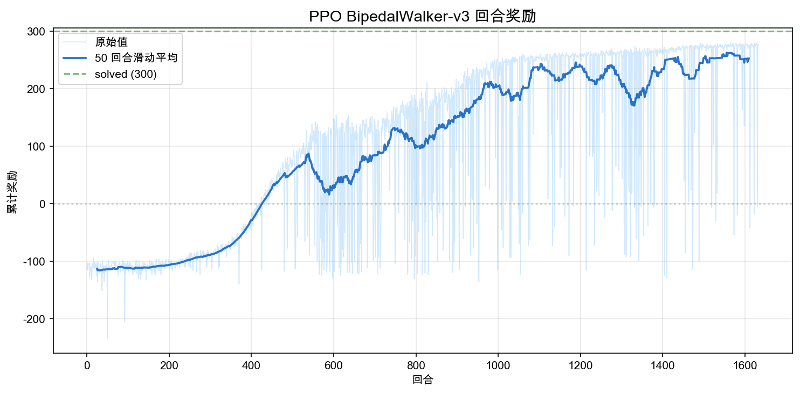

# 7.1 ：BipedalWalker 

> ****： PPO ，。

> ****：[ppo_bipedal_walker.py](https://github.com/letslego/hands-on-modern-rl/blob/main/code/chapter07_ppo/ppo_bipedal_walker.py) · [render_bipedal_walker.py](https://github.com/letslego/hands-on-modern-rl/blob/main/code/chapter07_ppo/render_bipedal_walker.py) · [requirements.txt](https://github.com/letslego/hands-on-modern-rl/blob/main/code/chapter07_ppo/requirements.txt)

 CartPole  LunarLander ：。——、、——****。PPO ：，，。BipedalWalker-v3 。

## 7.1.1  BipedalWalker 

BipedalWalker 。 24 （、）， 4 （）。 LunarLander ，，。


<div style="text-align: center; font-size: 0.9em; color: var(--vp-c-text-2); margin-top: -10px; margin-bottom: 20px;">
  <em> 7.1-1：BipedalWalker ，。</em>
</div>

：

```bash
pip install -r code/chapter07_ppo/requirements.txt
```

：

```bash
python code/chapter07_ppo/ppo_bipedal_walker.py \
  --total-timesteps 2000000
```

BipedalWalker 。 LunarLander  20 ，BipedalWalker  200 。 CPU ，200  60-90 。， `--total-timesteps 100000` 。

PPO  BipedalWalker ：

```python
model = PPO(
    policy="MlpPolicy",       # 
    env=vec_env,              # 8 
    learning_rate=3e-4,       # 
    n_steps=2048,             #  rollout 
    batch_size=256,           # 
    n_epochs=10,              # 
    clip_range=0.2,           # PPO 
    ent_coef=0.005,           # （，）
    gamma=0.99,               # 
    gae_lambda=0.95,          # GAE λ
)
```

`batch_size`  256，，。`ent_coef`  0.005，（），。 8 ， BipedalWalker  episode （ 1600 ），。

## 7.1.2 

 **Stable-Baselines3（SB3）**  PPO 。SB3  RL ，PPO 。：8  `DummyVecEnv` ，`MlpPolicy`（）， `3e-4`，`batch_size=256`，`clip_range=0.2`， 2M 。 `output/`  4 。

PPO  4 ，。。

### （Episode Reward）

—— episode 。BipedalWalker  -110（） +340（）。



<div style="text-align: center; font-size: 0.9em; color: var(--vp-c-text-2); margin-top: -10px; margin-bottom: 20px;">
  <em> 7.1-2：。， 50 。 solved （300 ）。</em>
</div>

：

- ** 300 （~500k ）**： -110  0 。""—— 1600 。 PPO ，。
- **300-800 （500k-1.3M ）**：， 0  230 。，""""。——（100+ ），（-100 ）。
- **800 （1.3M ）**： 200-260 ，。，。

—— 200 。 BipedalWalker ：。，（），。

### （Policy Entropy）

""。，，；，。


<div style="text-align: center; font-size: 0.9em; color: var(--vp-c-text-2); margin-top: -10px; margin-bottom: 20px;">
  <em> 7.1-3：（SB3 ）。 =  = 。</em>
</div>

 Y ：****， 0  -5.8  -3.5。 Stable-Baselines3 —— `entropy_loss = -H(π)`，。， Y 。

：

- ****（）： ≈ 5.8。 $\sigma$ ，，。
- ** 2M **： ≈ 3.5。 $\sigma$ ，，""。
- ****： 5.8  3.5，。，。

（ 5.8  1.0），，——""，。PPO  `ent_coef` ：，，。

### （Clip Fraction）

 PPO 。， $r_t(\theta) = \pi_{new}(a|s) / \pi_{old}(a|s)$  $[1-\varepsilon, 1+\varepsilon]$ （ $\varepsilon = 0.2$）。


<div style="text-align: center; font-size: 0.9em; color: var(--vp-c-text-2); margin-top: -10px; margin-bottom: 20px;">
  <em> 7.1-4：。 clip_range=0.2 。</em>
</div>

****：

- **0.05-0.15**：，。
- **> 0.2**：，，。。
- ** 0**：，。，。

，（，）， 0.1 。 spikes（ 0.15），。

 0，：，。。

###  KL （Approximate KL Divergence）

KL  $D_{KL}(\pi_{old} \| \pi_{new})$ 。PPO ——，。


<div style="text-align: center; font-size: 0.9em; color: var(--vp-c-text-2); margin-top: -10px; margin-bottom: 20px;">
  <em> 7.1-5： KL 。KL  =  = 。</em>
</div>

，KL  0.016，。 PPO  BipedalWalker ——。

 KL ，：，KL 。—— = 。：""，KL ""。

KL  0.05 ，， PPO 。。

### 

，：

|      |      |    |    | KL      |
| -------- | -------- | -------- | ---------- | ----------- |
|  |  |  | 0.05-0.15  | 0.01-0.03   |
|  |  |  |  > 0.2 |  > 0.05 |
|  |  |  0   |  0     |  0      |
|  |  |  |    |     |

 KL 。，， `n_steps`（ rollout ）。

## 7.1.3 

BipedalWalker-v3 ：

- ****：，。
- ****：，。
- ****：（）， 100 。

"" 100  $\geq$ 300。，：

- **$\geq$ 300**：，、、。
- **200-300**：，。
- **100-200**：，。
- **$<$ 100**：，。

：

```python
import gymnasium as gym
import numpy as np

env = gym.make("BipedalWalker-v3")
rng = np.random.default_rng(0)

returns = []
for ep in range(50):
    obs, _ = env.reset(seed=ep)
    total_reward = 0.0
    for step in range(1600):
        action = rng.uniform(-1, 1, size=4)
        obs, reward, terminated, truncated, _ = env.step(action)
        total_reward += reward
        if terminated or truncated:
            break
    returns.append(total_reward)

print(f": {np.mean(returns):.1f}")
print(f": {np.max(returns):.1f}")
print(f": {np.min(returns):.1f}")
```

 -100  -50 ，（ 100 ）。 PPO ，。

：

```text
: -103.7
: 12.6
: -77.8
: -124.7
```

## 7.1.4 

 PPO ，。，。

， GIF：

```bash
python code/chapter07_ppo/render_bipedal_walker.py \
  --model output/ppo_bipedal_walker.zip \
  --output-dir output/bipedalwalker_episodes \
  --episodes 10 --seeds 0 1 2 3 4 5 6 7 8 9
```

### （100k ， -35.8）

100k ""。 1600 ，——。 -35.8 。


### （500k ， 109.3）

500k 。： 100 ， -100 。——，，。


### （2M ， 295.1）

2M 。，1118 （100k  500k  1600 ）。


（20 ）：

|  |  |  |                                  |
| -------- | -------- | ------ | ------------------------------------ |
| 100k     | -34.1    | 3.3    | ， 1600  |
| 500k     | -65.2    | 73.1   | ： 15% ，  |
| 2M       | 282.5    | 59.7   | ， 290+      |

PPO ：""（100k），""（500k），""（2M）。500k —— 100+  -100 ，。，，，。

## 7.1.5 、

BipedalWalker  24 ：

|                      |  |                          |
| ---------------------------- | ---- | ---------------------------- |
| `hull_angle`                 | 1    |                    |
| `hull_angular_velocity`      | 1    |                    |
| `vx, vy`                     | 2    | /            |
| `hip1, hip2`                 | 2    |            |
| `knee1, knee2`               | 2    |            |
| `leg1_contact, leg2_contact` | 2    |            |
| `lidar[0..9]`                | 10   | （） |
| `hip_speed1, hip_speed2`     | 2    |                  |
| `knee_speed1, knee_speed2`   | 2    |                  |

 4 ， $[-1, 1]$ ：

|     |             |
| ----------- | --------------- |
| `action[0]` |  1  |
| `action[1]` |  1  |
| `action[2]` |  2  |
| `action[3]` |  2  |

PPO 。，，。，—— $\mu(s)$  $\sigma(s)$， $\mathcal{N}(\mu, \sigma^2)$ ：

$$a \sim \mathcal{N}(\mu_\theta(s), \sigma_\theta(s)^2)$$

 PPO 。，： -1、0、+1 ，。 0.37  -0.82 ，。

BipedalWalker ：

1. **（0-500k ）**：。 -110  0 ，""" 1600 "。，。
2. **（500k-1M ）**：，。 100+ ， -100 。 73，""""。
3. **（1M ）**：，。2M  290-299 ，（20  1-2 ）。

， run 。：""，""，""。

## 7.1.6 

BipedalWalker 。，。

，。100 ，。，：

```python
from stable_baselines3 import PPO
model = PPO.load("output/ppo_bipedal_walker.zip")
model.learn(total_timesteps=2_000_000, reset_num_timesteps=False)
```

， batch_size 。，`batch_size=64` 。 256，， 512。

，。，（）。 `ent_coef`  0.01。

，。 `MlpPolicy`  64 。 24 ，。 `policy_kwargs` ：

```python
model = PPO(
    policy="MlpPolicy",
    policy_kwargs=dict(net_arch=[128, 128]),
    ...
)
```

：

|             |  |                                      |
| --------------- | -------- | ---------------------------------------------------- |
| `learning_rate` | `3e-4`   | ，           |
| `batch_size`    | `256`    | ，                 |
| `n_steps`       | `2048`   |  rollout ，      |
| `ent_coef`      | `0.005`  | ， |
| `clip_range`    | `0.2`    | ，                   |
| `gamma`         | `0.99`   | ，                 |

## 7.1.7  BipedalWalker

BipedalWalker ：

- ****。BipedalWalker  4 。 PPO  DQN ——DQN ，， PPO 。
- ****。24  10 ，（、）。，。
- ****。BipedalWalker ，、。，。

 CartPole（ 5 ） BipedalWalker，。 PPO ：，，Actor-Critic 。，。

 PPO ——[PPO ](./ppo-math)。

## 

- `BipedalWalker-v3`  PPO：4 、24 、。
- PPO （，），。
- BipedalWalker "→→"，。
-  Stable-Baselines3  PPO ， `code/chapter07_ppo/ppo_bipedal_walker.py`， GIF  `render_bipedal_walker.py`。
- "" 100  $\geq$ 300； 2M  282.5 ± 59.7， 290-299 。

## 

[^1]: Raffin, A., et al. (2021). Stable-Baselines3: Reliable reinforcement learning implementations. _Journal of Machine Learning Research_, 22(268), 1-8.

[^2]: Schulman, J., et al. (2017). Proximal policy optimization algorithms. _arXiv preprint arXiv:1707.06347_.
