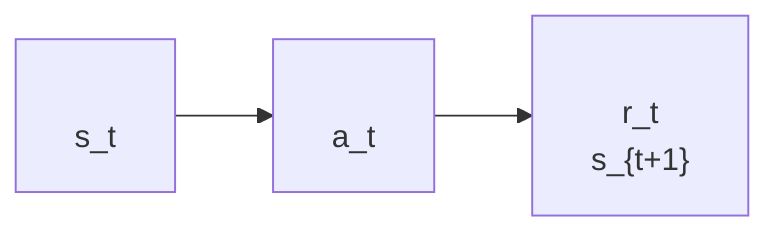

# 7.2 PPO 

 SB3  PPO ， reward、entropy、clip fraction 。：**PPO ？ loss？**

::: tip 
 PPO-Clip。，；，[](#-)，：

- ****：$\nabla_\theta J(\theta) = \mathbb{E}_t[\nabla_\theta \log \pi_\theta(a_t\mid s_t)\hat{A}_t]$
- ** $A_t$**：， Critic 
- **Actor-Critic **：Actor ，Critic 
  :::

 Actor-Critic ：Actor ，Critic ， $\hat{A}_t$ 。

，；，。。

，。

**：？** 。， rollout ，。

**：？** ，。，，，。

，PPO ：**，。**  Actor-Critic ，” Actor”。

 PPO ，：

```mermaid
flowchart LR
    A[" Actor "] --> B["Critic <br/>"]
    B --> C[" PPO-Clip  Actor"]
    C --> D[" Critic"]
    D --> E[""]
```

PPO  **Proximal Policy Optimization**——Policy ，Optimization ，Proximal ””：，。

**PPO **。 loss， PyTorch 。，””””， `loss.backward()` 。

## PPO 

，。。

**，？** ——，。 `[A] forward` 。

**，？** Actor ，（log_prob）。 `[B] act / evaluate` 。

**，？** 、、，——，。 `[C] collect_rollout` 。

**，？** ，""。（advantage）。 `[D] compute_gae` 。

**，？** 、，——，。`actor_loss_fn`  ratio  clip ，`critic_loss_fn` 。 `[E]` 。

**，？** （ clip ），，。 `[F]` 。

<PpoCodeFocus focus="overview" />

### 

，。。

**，？** ——，。 `[A] forward` 。

**，？** ，（log_prob）。 `[B] act / evaluate` 。

**，？** 、、，——，。 `[C] collect_rollout` 。

**，？** ，""。（advantage）。 `[D] compute_gae` 。

**，？** 、，——，。`actor_loss_fn`  ratio  clip ，`critic_loss_fn` 。 `[E]` 。

**，？** （ clip ），，。 `[F]` 。

<PpoCodeFocus focus="overview" />

 PPO ，。

## 

：****。，。

 $\pi_\theta$ ， $\hat{A}_t$ ：

$$
\nabla_\theta J(\theta)
= \mathbb{E}_t\left[
\nabla_\theta \log \pi_\theta(a_t\mid s_t)\hat{A}_t
\right].
$$

：**， $\pi_\theta$**。

 $\mathbb{E}_t[\cdot]$ 。：****——，；，。

。：
-  80% ""
-  20% ""

 100 ， 80 ""，20 ""。 80/20 ， $\mathbb{E}_t[\cdot]$ 。

 100 —— 60% ""，40% ""—— 60 ""、40 ""。

**（60/40）（80/20）**，——""，""。

， $\theta$， $\pi_\theta$。 rollout  $\pi_{\text{old}}$， $\pi_\theta$——**，，**。，；，。， on-policy  rollout 。

？。、、LLM ， rollout 。

PPO ，：**，？**

。

## 

（Importance Sampling）：**，。**

。：

$$
\nabla_\theta J(\theta)
= \mathbb{E}_t\left[
\nabla_\theta \log \pi_\theta(a_t\mid s_t)\hat{A}_t
\right].
$$

 $\nabla_\theta \log \pi_\theta(a_t\mid s_t)\hat{A}_t$。 $f(a_t)$，： $\pi_\theta$ ，：

$$
\mathbb{E}_{a\sim\pi_\theta}[f(a_t)].
$$

， $f(a_t)$ 。， $\pi_{\text{old}}$ 。，。

：——，””。，””。：

$$
\frac{\pi_\theta(a\mid s)}{\pi_{\text{old}}(a\mid s)}
$$

，：

$$
\mathbb{E}_{a \sim \pi_\theta} [f(a_t)]
=
\mathbb{E}_{a \sim \pi_{\text{old}}}
\left[
\frac{\pi_\theta(a\mid s)}{\pi_{\text{old}}(a\mid s)}
f(a_t)
\right].
$$

， 1，；， 1，。：，。

 PPO ，[C] `collect_rollout`  `old_logprobs`：

<PpoCodeFocus focus="oldLogprobs" />

 `old_logprobs`  $\log \pi_{\text{old}}(a_t\mid s_t)$。， `new_logprobs`，。

### 

 $\pi_\theta/\pi_{\text{old}}$ ，。PPO ：**，，。**

 $s_t$，：

|  |  $\pi_{\text{old}}(a\mid s_t)$ |  $\pi_\theta(a\mid s_t)$ |  $r=\pi_\theta/\pi_{\text{old}}$ |
| ---- | ---------------------------------------- | ---------------------------------- | ------------------------------------ |
|    | 0.50                                     | 0.25                               | 0.5                                  |
|    | 0.25                                     | 0.50                               | 2.0                                  |
|    | 0.25                                     | 0.25                               | 1.0                                  |

””，（ 2.0），。””，（ 0.5），。

，****（Policy Ratio）：

$$r_t(\theta) = \frac{\pi_\theta(a_t \mid s_t)}{\pi_{\text{old}}(a_t \mid s_t)}$$

 $a_t$ 。$r_t=1$ ；$r_t>1$ ；$r_t<1$ 。

 log ，：

<PpoCodeFocus focus="ratio" />

，：

$$
\mathbb{E}_{a \sim \pi_\theta} [f(a_t)]
=
\mathbb{E}_{a \sim \pi_{\text{old}}}
\left[
r_t(\theta) \cdot f(a_t)
\right].
$$

——，""。

### 

，$f(a_t)$  $A_t$。：，。

，：

$$L^{\text{IS}}(\theta) = \mathbb{E}_t \left[ r_t(\theta) \cdot A_t \right]$$

 `actor_loss_fn`  `surr1 = ratio * advantages`：

<PpoCodeFocus focus="surr1" />

****（Surrogate Objective）。，；。

：
- $A_t$ ：，。
- $r_t$ ：，；，。

 $r_t$  1 。 $r_t$ ——（$A_t > 0$） 5、10、100，，，。

## PPO-Clip

**，。**

，：** $r_t$ **。，——$r_t=5$  5 ，。

：

1. ****：$r_t$ ，，。
2. ****：$r_t$ ，，。

**PPO-Clip ：，。**

：

$$
\overline{r}_t(\theta)
= \text{clip}(r_t(\theta), 1-\varepsilon, 1+\varepsilon)
$$

$\varepsilon=0.2$ ， $[0.8, 1.2]$。，：

$$
J^{\text{CLIP}}(\theta)
= \mathbb{E}_t
\left[
\min \left(
r_t(\theta)A_t,\;
\overline{r}_t(\theta)A_t
\right)
\right]
$$

 `surr1` ，`surr2` ，`policy_loss = -torch.min(surr1, surr2).mean()`：

<PpoCodeFocus focus="clip" title="PPO-Clip " />

 PPO-Clip ：

**：**。 `torch.exp(new_logprobs - old_logprobs)` ，（ 0.01），； log  exp，。 `ratio`  $r_t(\theta)$，****。

**：**。`advantages`  $\hat{A}_t$， Critic —— Actor ，****。`surr1 = ratio * advantages` ；`surr2 = torch.clamp(ratio, ...) * advantages` —— ratio  $[1-\varepsilon, 1+\varepsilon]$ ，。

**：**。`torch.min(surr1, surr2)` ，。

PPO-Clip ：

**：。**  $r_t = \pi_\theta/\pi_{\text{old}}$ ——""，。 PPO-Clip ，，PPO 。

**：。** $\text{clip}(r_t, 1-\varepsilon, 1+\varepsilon)$  PPO ——，。

`torch.min(surr1, surr2)` ，：

- ****： ratio ，，$\min$ ，
- ****：ratio ，surr1  surr2 ，；ratio ，，loss 

 `torch.min` 。 $A_t = 2$（），$\varepsilon = 0.2$， $[0.8, 1.2]$：

| ratio  | surr1 = ratio × 2 | surr2 = clipped × 2 | torch.min  |                |
| ------ | ----------------- | ------------------- | ---------------- | ---------------------- |
| 0.7    | 1.4               | 1.6                 | surr1            | ，     |
| 1.0    | 2.0               | 2.0                 |              | ratio = 1， |
| 1.1    | 2.2               | 2.2                 |              | ， |
| **1.3**  | **2.6**            | **2.4**             | **surr2**        | **，**    |
| 2.0    | 4.0               | 2.4                 | surr2            | ，     |

 $A_t = -2$：

| ratio  | surr1 = ratio × (-2) | surr2 = clipped × (-2) | torch.min  |                |
| ------ | -------------------- | ---------------------- | ---------------- | ---------------------- |
| 0.7    | -1.4                 | -1.6                   | surr2            | ，       |
| 1.0    | -2.0                 | -2.0                   |              | ratio = 1， |
| 1.1    | -2.2                 | -2.2                   |              | ， |
| **1.3**  | **-2.6**              | **-2.4**               | **surr2**        | **，**    |
| 2.0    | -4.0                 | -2.4                   | surr2            | ，     |

，`torch.min` ** surr1 ，**。

， `torch.min(surr1, surr2)` **PPO-Clip **—— surr1（）， surr2（）。

——""， PyTorch " loss"。： loss。

**：**

****

PPO **** $J(\theta)$——。 $\nabla_\theta J(\theta)$ 。

 $J(\theta)$ ：

1. ****：$J(\theta)$  $\pi_\theta$ ， $\pi_{\text{old}}$
2. ****：，

—— $r_t$ ""， $J(\theta)$ 。

——$r_t$ ，ratio ，，。

****——$\text{clip}(r_t, 1-\varepsilon, 1+\varepsilon)$  ratio ，。

**`torch.min(surr1, surr2)` **：surr1 ，surr2 ，。

，**PPO-Clip  $J^{\text{CLIP}}(\theta)$  $J(\theta)$ **——，，****。

****： `torch.min(surr1, surr2)` **PPO-Clip **， `-torch.min(surr1, surr2).mean()`  PyTorch  loss。：**，。**

** `.mean()`？**

`surr1`  `surr2` ——batch 。`.mean()` ， `loss.backward()`  batch 。 sum  mean， batch size ，。

### 

**$A_t > 0$（）**： $r_t$ 。$r_t \leq 1+\varepsilon$ ，，。$r_t > 1+\varepsilon$ ，，$\min$ ，—— $1+\varepsilon$ 。

**$A_t < 0$（）**： $r_t$ 。$r_t < 1-\varepsilon$ ，，$\min$ ，—— $1-\varepsilon$ 。

**$A_t = 0$**：$r_t \cdot A_t = 0$，PPO 。

：**PPO ；，。**

```mermaid
flowchart LR
    subgraph safe [": r_t ∈ [1-ε, 1+ε]"]
        direction TB
        S1[" = "]
        S2[""]
    end

    subgraph clip_high ["r_t > 1+ε"]
        direction TB
        H1[""]
        H2[""]
        H3[""]
    end

    subgraph clip_low ["r_t < 1-ε"]
        direction TB
        L1[""]
        L2[""]
        L3[""]
    end

    safe -->|""| clip_high
    safe -->|""| clip_low
    clip_high -->|""| safe
    clip_low -->|""| safe

    style safe fill:#e8f5e9,stroke:#4caf50
    style clip_high fill:#fff3e0,stroke:#ff9800
    style clip_low fill:#fce4ec,stroke:#e91e63
```

<details>
<summary>（）</summary>

 $A_t > 0$ ，$r_t \leq 1+\varepsilon$ ，$\min$ 。$r_t$  $1+\varepsilon$ ， $(1+\varepsilon) \cdot A_t$，，$\min$ ，。

| $r_t$                |  $r_t \cdot A_t$ |  $\overline{r}_t \cdot A_t$   | $\min$     |
| -------------------------- | ------------------------ | ----------------------------------- | ---------------- |
| $r_t \leq 1 + \varepsilon$ | $r_t \cdot A_t$          | $r_t \cdot A_t$                     | ，   |
| $r_t > 1 + \varepsilon$    | $r_t \cdot A_t$（）  | $(1+\varepsilon) \cdot A_t$（） | ， |

 $A_t < 0$ 。 $A_t=-2$，$\varepsilon=0.2$。$r_t=0.7$  $= -1.4$， $= -1.6$，$\min$  $-1.6$（），。

| $r_t$                |  $r_t \cdot A_t$  |  $\overline{r}_t \cdot A_t$   | $\min$           |
| -------------------------- | ------------------------- | ----------------------------------- | ---------------------- |
| $r_t < 1 - \varepsilon$    | ， $-1.4$ | $(1-\varepsilon) \cdot A_t$（） | ，       |
| $r_t \geq 1 - \varepsilon$ |                   |                           | ， |

```python
import numpy as np
import matplotlib.pyplot as plt

epsilon = 0.2
r = np.linspace(0.0, 2.0, 500)

def clip_objective(r, A, eps=0.2):
    r_clipped = np.clip(r, 1 - eps, 1 + eps)
    return np.minimum(r * A, r_clipped * A)

fig, axes = plt.subplots(1, 3, figsize=(15, 4))

for ax, (A_val, title) in zip(axes, [
    (1.0, "A > 0 ()"),
    (-1.0, "A < 0 ()"),
    (0.0, "A = 0 ()")
]):
    obj = clip_objective(r, A_val)
    ax.plot(r, r * A_val, 'b--', alpha=0.4, label=' r·A')
    ax.plot(r, obj, 'r-', linewidth=2, label='PPO-Clip min(...)')
    ax.axvspan(1 - epsilon, 1 + epsilon, alpha=0.1, color='green', label='')
    ax.set_title(title)
    ax.set_xlabel(' r_t(θ)')
    ax.set_ylabel('')
    ax.legend(fontsize=8)

plt.suptitle('PPO-Clip  (ε=0.2)', fontsize=13)
plt.tight_layout()
plt.savefig("ppo_clip_three_cases.png", dpi=150)
```

</details>

## PPO 

PPO-Clip 。 loss， `loss.backward()` 。

PPO  loss ，：**** $L^{\text{CLIP}}$  Actor ；**** $L^{\text{VF}}$  Critic ；**** $c_2 H[\pi_\theta]$ 。， Actor  Critic。

$$
L^{\text{PPO}}(\theta)
= L^{\text{CLIP}}(\theta)
+ c_1 L^{\text{VF}}(\theta)
- c_2 H[\pi_\theta]
$$

### 

PPO-Clip ****（Policy Loss）——， Actor 。

 PPO-Clip ， Actor 。：

-  $A_t > 0$（）， $r_t$ ——
-  $A_t < 0$（）， $r_t$ ——

 $r_t$  $[1-\varepsilon, 1+\varepsilon]$ ，。 PyTorch  loss，：

$$
L^{\text{CLIP}}(\theta)
= -\mathbb{E}_t
\left[
\min \left(
r_t(\theta) \cdot A_t,\;
\overline{r}_t(\theta) \cdot A_t
\right)
\right]
$$

 `actor_loss_fn`  `policy_loss = -torch.min(surr1, surr2).mean()`。 Actor ——**、**，。

### 

Critic  $V_\theta(s_t)$  $V_t^{\text{targ}}$（ GAE ，）。：

$$L^{\text{VF}}(\theta) = \mathbb{E}_t \left[ \left( V_\theta(s_t) - V_t^{\text{targ}} \right)^2 \right]$$

**Critic  $A_t$ 。** Critic ，$A_t$ ， Actor 。 `critic_loss_fn`  MSE （value clipping）， Critic ：

<PpoCodeFocus focus="loss" title="PPO " />

### 

：

$$H[\pi_\theta] = -\mathbb{E}_t \left[ \sum_a \pi_\theta(a|s_t) \log \pi_\theta(a|s_t) \right]$$

，；，。PPO ，—— loss  $c_2 H[\pi_\theta]$ 。 `entropy_bonus = entropy.mean()`， loss 。

### 

， `ppo_update` ：

```python
loss = pg_loss + vf_coef * vf_loss - ent_coef * entropy_bonus
```

（DeepSpeed-Chat、VeRL、OpenRLHF）：`actor_loss_fn` ，`critic_loss_fn` ，`ppo_update` 。

```mermaid
flowchart TD
    subgraph Actor_update ["Actor （）"]
        A1["L^CLIP: "]
        A2[" ↑  ↓"]
        A3[""]
    end

    subgraph Critic_update ["Critic （）"]
        C1["L^VF: "]
        C2[" V(s) "]
        C3[" A_t"]
    end

    subgraph Exploration ["（）"]
        E1["H[π_θ]: "]
        E2[""]
        E3[""]
    end

    C3 -->|" A_t"| A1
    A3 -->|""| E2

    style Actor_update fill:#fff3e0,stroke:#ff9800
    style Critic_update fill:#e3f2fd,stroke:#2196f3
    style Exploration fill:#e8f5e9,stroke:#4caf50
```

### 

|           |          |   |                        |      |
| ------------- | ------------ | ------- | -------------------------- | ------------ |
| $\varepsilon$ |      | 0.1–0.2 |      | `clip_eps`   |
| $c_1$         |  | 0.5     |  | `vf_coef`    |
| $c_2$         |    | 0.01    |                    | `ent_coef`   |
| $\gamma$      |      | 0.99    |          | `gamma`      |
| $\lambda$     | GAE      | 0.95    | -  | `lam`        |
| $T$           | rollout  | 2048    |          | `steps`      |
| $K$           | epoch      | 10      |          | `epochs`     |

## 

，PPO ：

```mermaid
flowchart TD
    A[<br/> pi_theta] --> B[1.  T ]
    B --> C[2.  GAE <br/> A_hat_t<br/> V_t^targ]
    C --> D[3.  K <br/> mini-batch ]
    D --> E[<br/>r_t = pi_theta / pi_old]
    E --> F[<br/>L^CLIP]
    F --> G[<br/>L^VF]
    G --> H[<br/>H[pi_theta]]
    H --> I[<br/>L = L^CLIP + c1 L^VF - c2 H]
    I --> J[<br/>theta]
    J --> K{K ?}
    K --  --> D
    K --  --> L[<br/>]
    L -.  .-> A
```

，：

<PpoCodeFocus focus="overview" title=" PPO " />

：

- ** K **：（），。。
- **Mini-batch **： $T$  mini-batch， mini-batch ，。
- ** r_t**：， $\theta$ ，$r_t$ ，。

<details>
<summary>：TRPO  PPO-Penalty</summary>

TRPO（Trust Region Policy Optimization） PPO ：。TRPO ：

$$
\max_\theta L^{\text{IS}}(\theta)
\quad \text{s.t.} \quad
\bar{D}_{\text{KL}}(\theta_{\text{old}}, \theta) \leq \delta
$$

， KL  $\delta$。，、。

PPO ，。PPO  **PPO-Penalty** ， KL ：

$$L^{\text{KL}}(\theta) = \mathbb{E}_t \left[ r_t(\theta) \cdot A_t - \beta \cdot D_{\text{KL}}(\pi_{\text{old}}, \pi_\theta) \right]$$

$\beta$ 。PPO-Penalty ， PPO-Clip ， PPO-Clip 。

PPO  "Proximal" ， **`ratio`、`clamp`、`min` **。

</details>

<details>
<summary><strong>： ε  0，PPO-Clip ？</strong></summary>

 $\varepsilon = 0$ ， $[1, 1]$， $\overline{r}_t(\theta) = 1$。PPO-Clip ：

$$L^{\text{CLIP}}(\theta) = \mathbb{E}_t \left[ \min \left( r_t(\theta) \cdot A_t, \; 1 \cdot A_t \right) \right]$$

 $A_t > 0$，$r_t > 1$  $A_t$，；$r_t < 1$  $r_t \cdot A_t$， $1$ 。

 $A_t < 0$，$r_t < 1$  $A_t$，；$r_t > 1$  $r_t \cdot A_t$， $1$ 。

$\varepsilon = 0$ ：，。$\varepsilon$ """"。

</details>

<details>
<summary><strong>：PPO  KL ？</strong></summary>

**** $r_t$， KL 。，， $\delta = 0.01$  KL 。， LLM ， KL —— RLHF  `clip_fraction`  `approx_kl`。

</details>

<details>
<summary><strong>： PPO  K ？</strong></summary>

（ $K \times T$ ），。

" K 、"，。，—— LLM ，，。

"、 K "，，， $\theta$  $\theta_{\text{old}}$，。：，，。""""。

，$K$  3-10，。

</details>

---

， **PPO **：， **`ratio`、`clamp`、`min`  PPO-Clip **，****。：

- ****：[](./trust-region-clipping)
- **GAE  LLM **：[](./gae-reward-model)

## ：

、 Actor-Critic ， RL ， PPO 。

### A.1 

：



 $t$ 。$s_t$  agent  $t$ ，$a_t$ ，$r_t$ 。**。**

[（MDP）](../chapter03_mdp/mdp)：

$$
\mathcal{M} = (\mathcal{S}, \mathcal{A}, P, R, \gamma)
$$

（：[MDP ](../chapter03_mdp/mdp)）：

- $\mathcal{S}$：，。
- $\mathcal{A}$：，。
- $P(s_{t+1}\mid s_t,a_t)$：。
- $R(s_t,a_t)$：。
- $\gamma$：[](../chapter03_mdp/mdp)，。

**。** ：

$$
\pi_\theta(a_t \mid s_t)
$$

" $\theta$ ， $s_t$  $a_t$ "。，Actor ， `dist`：

<PpoCodeFocus focus="dist" />

`action_probs`  $\pi_\theta(\cdot \mid s_t)$，。`dist` ，：

|                     |                                  |                               |
| ----------------------- | ------------------------------------ | ------------------------------------- |
| `dist.sample()`         |                | $a_t \sim \pi_\theta(\cdot \mid s_t)$ |
| `dist.log_prob(action)` |                    | $\log \pi_\theta(a_t \mid s_t)$       |
| `dist.entropy()`        | ，           | $H[\pi_\theta]$                       |

，：

$$
\tau = (s_0,a_0,r_0,s_1,a_1,r_1,\ldots,s_T)
$$

 $\pi_\theta$ ，：

$$
p_\theta(\tau)
= \rho_0(s_0)
\prod_{t=0}^{T-1}
\pi_\theta(a_t\mid s_t)
P(s_{t+1}\mid s_t,a_t)
$$

：**， $\pi_\theta(a_t\mid s_t)$  $\theta$。**  $P$ 、、。 `log_prob`，。

### A.2 

 $r_t$，agent 。****：

$$
G_t = r_t + \gamma r_{t+1} + \gamma^2 r_{t+2} + \cdots = \sum_{k=0}^{T-t-1}\gamma^k r_{t+k}
$$

****：

$$
G_t = r_t + \gamma G_{t+1}
$$

：

```python {4}
G = 0
returns = []
for reward in reversed(rewards):
    G = reward + gamma * G
    returns.insert(0, G)
```

，：

$$
J(\theta) = \mathbb{E}_{\tau \sim \pi_\theta}\left[\sum_{t=0}^{T-1}\gamma^t r_t\right]
$$

$J(\theta)$ " $\theta$ "。****，。

### A.3 

 $\theta$  $J(\theta)$ ？：

$$
J(\theta) = \sum_{\tau} p_\theta(\tau)R(\tau)
$$

 $\theta$ ， $\nabla_\theta p_\theta(\tau) = p_\theta(\tau)\nabla_\theta \log p_\theta(\tau)$：

$$
\nabla_\theta J(\theta) = \mathbb{E}_{\tau\sim\pi_\theta}\left[\nabla_\theta \log p_\theta(\tau)R(\tau)\right]
$$

 $\log p_\theta(\tau)$ ， $\theta$  $P$  $\rho_0$ ， REINFORCE ：

$$
\nabla_\theta J(\theta) = \mathbb{E}_{\tau\sim\pi_\theta}\left[\sum_{t=0}^{T-1}\nabla_\theta \log \pi_\theta(a_t\mid s_t)G_t\right]
$$

 loss，：

```python {1-2}
policy_loss = -(log_probs * returns).mean()
policy_loss.backward()
```

### A.4 、

 REINFORCE ****。 $G_t$ ""，""。，，。

：LunarLander  $G_t=80$。， $120$，。：$G_t$ ，$V^\pi$  $Q^\pi$ 。

[](../chapter03_mdp/value-bellman)：

$$
V^\pi(s_t) = \mathbb{E}_{\pi}[G_t \mid s_t]
$$

$V^\pi(s_t)$ ： $s_t$， $\pi$ ，****。： $\pi(\cdot\mid s_t)$ ，。，$V^\pi$ ""，。

[](../chapter03_mdp/value-q)：

$$
Q^\pi(s_t,a_t) = \mathbb{E}_{\pi}[G_t \mid s_t,a_t]
$$

$Q^\pi(s_t,a_t)$ ： $s_t$ ** $a_t$**， $\pi$ ，。 $V^\pi$ ：$Q^\pi$ ，$V^\pi$  $\pi$ 。

：

$$
V^\pi(s_t) = \sum_a \pi(a\mid s_t) Q^\pi(s_t,a)
$$

，$V^\pi(s_t)$ 。， $Q^\pi$  $V^\pi$ 。

[](../chapter06_actor_critic/advantage-function)：

$$
A^\pi(s_t,a_t) = Q^\pi(s_t,a_t) - V^\pi(s_t)
$$

：**。**

- $A_t > 0$：，
- $A_t < 0$：，
- $A_t = 0$：，

 $Q - V$ ""？ $Q^\pi(s_t,a_t)$ ""， $V^\pi(s_t)$ ""。，""，""。

， $V^\pi$  $Q^\pi$，。""""：

- $G_t$： $t$ ，。
- $Q^\pi(s_t,a_t)$： $s_t,a_t$ ， $G_t$ 。
- $V^\pi(s_t)$： $s_t$ ， $\pi(\cdot\mid s_t)$ ， $G_t$ 。

。 LunarLander  $s_t$ ，： $a_L$  $a_R$。， $t$  $G_t$：

|  |  |  $G_t$ |
| ---- | -------- | -------------- |
| 1    | $a_L$    | 80             |
| 2    | $a_L$    | 100            |
| 3    | $a_L$    | 70             |
| 4    | $a_R$    | 120            |
| 5    | $a_R$    | 140            |
| 6    | $a_R$    | 130            |

 $a_L$， 80、100、70，：

$$
Q^\pi(s_t,a_L) \approx \frac{80+100+70}{3}=83.3
$$

 $a_R$， 120、140、130，：

$$
Q^\pi(s_t,a_R) \approx \frac{120+140+130}{3}=130
$$

 $Q^\pi$：，，。

 $V^\pi(s_t)$。 $a_L$， $a_R$，：

$$
V^\pi(s_t) \approx 0.5\times 83.3 + 0.5\times 130 = 106.7
$$

：

$$
A^\pi(s_t,a_L) \approx 83.3-106.7=-23.4
$$

$$
A^\pi(s_t,a_R) \approx 130-106.7=23.3
$$

，，$a_R$ ，$a_L$ 。。

。， $s_t,a_t$ 。 rollout ，。 1  $a_L$， $G_t=80$； 80  $Q^\pi(s_t,a_L)$ 。 2  100、 3  70，。

：**$Q^\pi$  $G_t$ ， $G_t$ 。** ， rollout ，：

$$
G_t \approx Q^\pi(s_t,a_t)
$$

 $A^\pi = Q^\pi - V^\pi$，：

$$
\hat{A}_t \approx G_t - V^\pi(s_t)
$$

：$V^\pi(s_t)$ 。 **Critic **。Critic  Actor ， $s_t$， $V_\theta(s_t)$，："，。"

： Critic  $G_t$ ， $G_t - V_\theta(s_t)$， $V_\theta(s_t)$  $G_t$，， 0？

。，Critic ， $G_t$：

$$
V^\pi(s_t)=\mathbb{E}_\pi[G_t\mid s_t]
$$

。 80， 100， 70，Critic  80、 100、 70。，，。，$G_t$  Critic ，$V_\theta(s_t)$  Critic 。

，$G_t - V_\theta(s_t)$ ：

$$
\text{} - \text{}
$$

。 $G_t$  Critic ，；，。，Critic  $V^\pi$ 。：

$$
\hat{A}_t \approx G_t - V_\theta(s_t)
$$

 $G_t$ ，$V_\theta(s_t)$ 。（$G_t > V_\theta(s_t)$），，$\hat{A}_t$ ； $\hat{A}_t$ 。

：

<PpoCodeFocus focus="advantages" />

 GAE， `advantages = returns - values`。 GAE  `advantages`， GAE。" Critic "。

 $G_t$  $A_t$？ $b(s_t)$，（：[](../chapter05_policy_gradient/pg-improvements)）：

$$
\mathbb{E}_{a_t\sim\pi_\theta}\left[\nabla_\theta\log\pi_\theta(a_t\mid s_t)b(s_t)\right] = b(s_t)\nabla_\theta\sum_{a_t}\pi_\theta(a_t\mid s_t) = b(s_t)\nabla_\theta 1 = 0
$$

：**，。**  Actor-Critic ：

$$
\nabla_\theta J(\theta) = \mathbb{E}_t\left[\nabla_\theta \log \pi_\theta(a_t\mid s_t)\hat{A}_t\right]
$$

 **Actor  Critic **：Critic  $V_\theta(s_t)$，"" Actor；Actor  $\hat{A}_t$ 。
