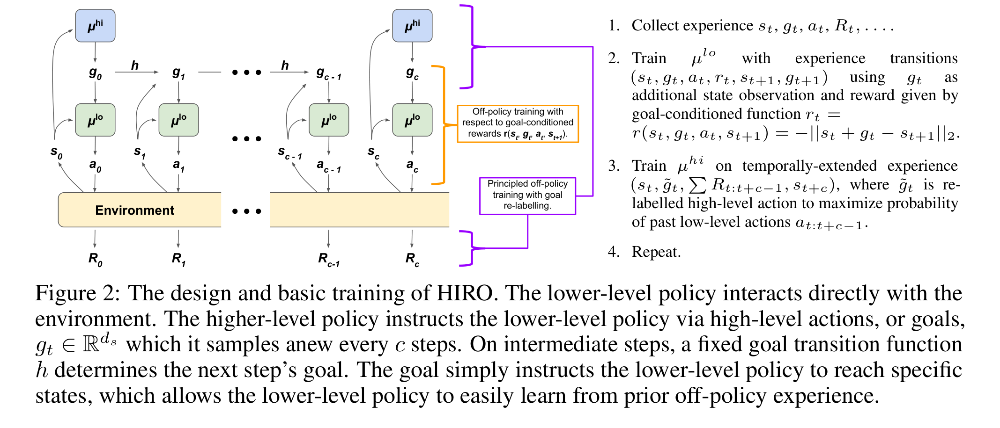
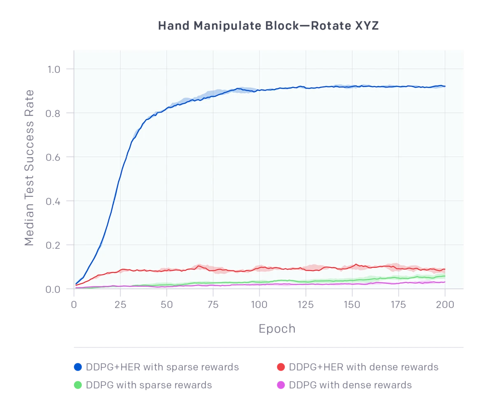
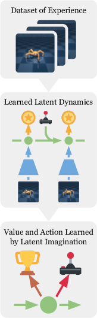
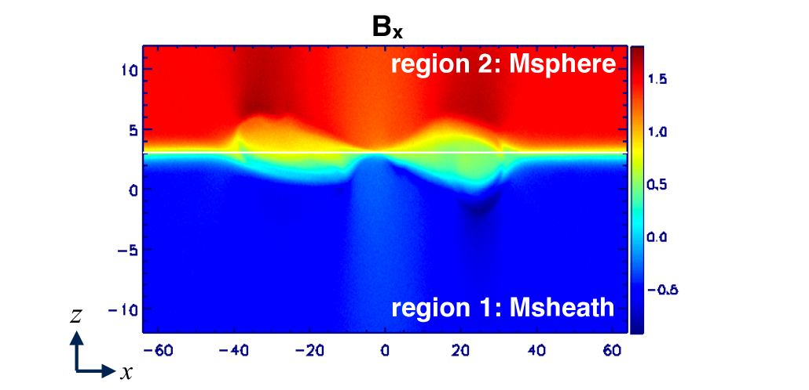

# 7.6 

 PPO  BipedalWalker，。，。：" →  →  →  → "， Minecraft 、。****（Long-Horizon Task），，。

（ LLM），、、。， LLM + RL 。

## 

，、：

### 

，（、）。 $r_t = 0$，。****（Sparse Reward Problem）。

 CartPole： $r_t = 1$，。""，。， episode  $T$ ， $A$ ， $A^{-T}$—— $T=100, A=4$ ， $10^{-60}$，。

""。—— Montezuma's Revenge ， 100 ， 24 ，。

### 

，****。 1000  episode， $+1$， 37  892 ，？****（Credit Assignment Problem）， horizon 。

： horizon 。 REINFORCE ：

$$\nabla_\theta J(\theta) \approx \frac{1}{N} \sum_{i=1}^{N} \sum_{t=0}^{T} \nabla_\theta \log \pi_\theta(a_t^{(i)} | s_t^{(i)}) \cdot \left(\sum_{t'=t}^{T} \gamma^{t'-t} r_{t'}^{(i)}\right)$$

 $T$ ， $G_t = \sum_{t'=t}^{T} \gamma^{t'-t} r_{t'}$ 。 Actor-Critic  GAE（Generalized Advantage Estimation）——""，。

### 

。 4 ，100  $4^{100}$ 。。****（Exploration Bottleneck）。

：，；，""。$\epsilon$-greedy ，——，""。

 RL ，——，。

## 

（Hierarchical Reinforcement Learning, HRL）：，，""，""。

""： CEO →  → ，CEO ，。HRL ——""，""。

HRL ，：

- ****： $c$ （$c \gg 1$）， horizon  $T$  $T/c$
- ****：，，
- ****：，



<div style="text-align: center; font-size: 0.9em; color: var(--vp-c-text-2); margin-top: -10px; margin-bottom: 20px;">
  <em> 1：HIRO 。 Manager （subgoal）， Worker 。：<a href="https://arxiv.org/abs/1805.08296" target="_blank" rel="noopener noreferrer">Nachum et al., 2018</a></em>
</div>

### Options 

Sutton  1999  **Options ** HRL 。 Option $o$ ：

- **** $\mathcal{I}_o \subseteq \mathcal{S}$： Option
- **** $\pi_o: \mathcal{S} \times \mathcal{A} \to [0,1]$：
- **** $\beta_o: \mathcal{S} \to [0,1]$： Option

 Option ""（macro-action），，。，"" Option，， Option 。

 Options，——1000 ， 10  Option 。。

### 

****（Goal-Conditioned RL）。 $s$， $g$：

$$\pi(a | s, g)$$

，"，"。——""，""。： $s_0$  $s_T$ ， $s_5, s_{10}, s_{50}$ ，" $s_0$  $s_T$"，" $s_0$  $s_5$"、" $s_5$  $s_{10}$"。

UVFA（Universal Value Function Approximator, Schaul et al., 2015）： $Q(s, a, g)$，-。HIRO（Nachum et al., 2018）（ 1）：

- **** $\pi^{hi}$： $c$  $s_t$， $g_t$（）
- **** $\pi^{lo}$： $a_t = \pi^{lo}(a_t | s_t, g_t)$
- ****（goal relabeling）：， $g_t$ ，""， HER 

HIRO ——，。HIRO 。

### 

HRL ：**？** ， RL""。：

- ****：，""。，——，。betweenness centrality  spectral clustering 
- ****： DIAYN（Diversity is All You Need），，。，""（、），
- ****：。 Option-Critic  Option ——Option 、，

::: info 
"Does Hierarchical Reinforcement Learning Outperform Standard RL?"  HRL ，：，HRL  RL；， PPO  SAC 。。
:::

## 

 RL 。****—— **Hindsight Experience Replay（HER）**， Andrychowicz  2017  OpenAI 。

### 

HER ： $g$ ， $s_T$。 $g$  episode ，** $s_T$**，。


<div style="text-align: center; font-size: 0.9em; color: var(--vp-c-text-2); margin-top: -10px; margin-bottom: 20px;">
  <em> 2：Goal-Conditioned 。（），—— 0 ， -1 。：<a href="https://openai.com/index/ingredients-for-robotics-research/" target="_blank" rel="noopener noreferrer">OpenAI Blog</a></em>
</div>

，：

1. ， $g$
2. episode ， $(s_0, a_0, r_0, s_1, \ldots, s_T)$
3.  $s_T$（）**** $g' = \phi(s_T)$
4.  $g'$  $g$， $r'_t = r(s_t, a_t, g')$
5.  $(s_t, a_t, r'_t, s_{t+1}, g')$ 

，——，。，HER """"，。


<div style="text-align: center; font-size: 0.9em; color: var(--vp-c-text-2); margin-top: -10px; margin-bottom: 20px;">
  <em> 3：HER ——（Virtual Goal）。（），（）。HER ""，。：<a href="https://openai.com/index/ingredients-for-robotics-research/" target="_blank" rel="noopener noreferrer">OpenAI Blog</a></em>
</div>

###  Goal-Conditioned RL 

HER  $\pi(a|s,g)$ 。，。DQN + HER  DDPG + HER ， OpenAI  Fetch  100% 。

：

- **final**： episode （，）
- **episode**：
- **future**： $t$ ****（，""）
- **random**： episode 

 **future** ——""，。，HER ：""，。



<div style="text-align: center; font-size: 0.9em; color: var(--vp-c-text-2); margin-top: -10px; margin-bottom: 20px;">
  <em> 4：DDPG + HER  ShadowHand （Hand Manipulate Block—Rotate XYZ）。DDPG + HER + （）， 100%。：<a href="https://openai.com/index/ingredients-for-robotics-research/" target="_blank" rel="noopener noreferrer">OpenAI Blog</a></em>
</div>

### 

HER ，：

- ****：""。（""），HER 。，——""
- ****：，。，，""。 + 
- ****：（" →  →  → "），。HER ""，""——""，
- ****：， HER 。Multi-goal HER 

## （Model-Based Planning）

：，**（World Model），**。



<div style="text-align: center; font-size: 0.9em; color: var(--vp-c-text-2); margin-top: -10px; margin-bottom: 20px;">
  <em> 5：Dreamer 。， Actor-Critic，。：<a href="https://arxiv.org/abs/1912.01603" target="_blank" rel="noopener noreferrer">Hafner et al., 2020</a></em>
</div>

### MBPO：

MBPO（Model-Based Policy Optimization, Janner et al., 2019）： $\hat{T}(s'|s,a)$，****。：

1.  $(s, a, r, s')$
2.  $\hat{T}$（ ensemble ）
3. ， $\hat{T}$  $k$ （$k$ ， 5 ），""（branched rollout）
4. ， SAC  PPO 

MBPO ：，。 $\epsilon$， $k$  $O(\epsilon \cdot \frac{\gamma^k}{1-\gamma})$。Janner ： $k$ ，。 $k$  5 。

MBPO  HalfCheetah  5-10 。：""，，。，MBPO 。


<div style="text-align: center; font-size: 0.9em; color: var(--vp-c-text-2); margin-top: -10px; margin-bottom: 20px;">
  <em> 6：MBPO 。" $a$，？"，。：<a href="http://bair.berkeley.edu/blog/2019/12/12/mbpo/" target="_blank" rel="noopener noreferrer">BAIR Blog</a></em>
</div>

### MCTS：

MBPO  Dreamer ****（）。：**，**。（Monte Carlo Tree Search, MCTS）。

MCTS ：（），。，：

1. **（Selection）**：， UCB（Upper Confidence Bound），。UCB ：

$$\text{UCB}(a) = Q(s, a) + c \cdot \sqrt{\frac{\ln N(s)}{N(s, a)}}$$

 $Q(s,a)$ ，$N(s)$  $N(s,a)$ ，$c$ 。，。

2. **（Expansion）**：，，

3. **（Rollout）**：，（），

4. **（Backpropagation）**：， $Q$ 

MCTS ****：，。——，。

**AlphaZero **

 MCTS  $Q$ 。AlphaZero（Silver et al., 2017） MCTS ，：

- ** rollout**：， $v_\theta(s)$ 。""，
- ****： $\pi_\theta(a|s)$ ，MCTS 。
- **MCTS **：MCTS ""； MCTS 。

```mermaid
graph LR
    A[/] -->|| B[MCTS ]
    B -->|| C[]
    C -->|| D[]
    D -->|| A
```

AlphaZero 、、 AI 。：**，**——（），（MCTS），。

 MCTS ：（），。AlphaZero **、、**，、、。

### Dreamer：

Dreamer （Hafner et al., 2020-2023）——，****。

Dreamer  **RSSM**（Recurrent State-Space Model）。RSSM ：

- **** $h_t$：（GRU）， RNN ，
- **** $z_t$：，（）

""（），""（）。

 Dreamer ：

**：**

 RSSM ，：

- ：
- ：
- KL ： $q(z_t | o_{\leq t}, a_{<t})$  $p(z_t | h_t)$

**：**

， $z_1, z_2, \ldots, z_H$（$H$ ）， Actor-Critic：

- Actor 
- Critic ， $\lambda$-return 

**：**

，，。

1. ****（Representation Model）：（） $z_t$
2. ****（Transition Model）： $p(z_{t+1}|z_t, a_t)$
3. ****（Policy Model）： $\pi(a|z_{1:t})$


<div style="text-align: center; font-size: 0.9em; color: var(--vp-c-text-2); margin-top: -10px; margin-bottom: 20px;">
  <em> 7：Dreamer 。(a) （ + RSSM + ）；(b)  Actor-Critic；(c) 。：<a href="https://arxiv.org/abs/1912.01603" target="_blank" rel="noopener noreferrer">Hafner et al., 2020</a></em>
</div>

，，**""**——。，""。

Dreamer-V3（2023  Nature） 150 **** SOTA ， Atari  Minecraft ，。Dreamer-V3 ：

- **symlog **：（、）， $[-1, 1]$  $[-1000, 1000]$ 
- ****： Dreamer ，Dreamer-V3 （dynamic loss scaling）
- **robust critic**：（quantile regression），，


<div style="text-align: center; font-size: 0.9em; color: var(--vp-c-text-2); margin-top: -10px; margin-bottom: 20px;">
  <em> 8：DreamerV3  Minecraft 。（、） Minecraft ， 17000 。：<a href="https://arxiv.org/abs/2301.04104" target="_blank" rel="noopener noreferrer">Hafner et al., 2023</a></em>
</div>

::: tip 
""""：，，。Dreamer ，""。
:::

## 

（ RL、HER、）。：。、，——****。

### Go-Explore：

Go-Explore（Ecoffet et al., 2019, 2021）。：**""，""**。，， episode 。

Go-Explore ：**，**。：

**：（Explore）**

1. ****（archive），""
2. ，（""）
3. ，
4. （ Cell ""），
5. 

：，——。

**：（Robustify）**

，——，。****（），""。

Go-Explore  Montezuma's Revenge  40,000 ， 10 。 Pitfall "" Atari 。

Go-Explore ****——。（/），。"" Go-Explore，，。

### 

，****（intrinsic reward），。：

$$r_t^{\text{total}} = r_t^{\text{extrinsic}} + \beta \cdot r_t^{\text{intrinsic}}$$

 $\beta$ 。：

- ****（Count-based）：（-） $N(s)$， $r_t^{\text{int}} = 1/\sqrt{N(s_{t+1})}$。，。（""）
- **RND（Random Network Distillation）**： $f$ ""， $\hat{f}$  $f$ 。 $\|f(s) - \hat{f}(s)\|^2$ ——，""（），
- **ICM（Intrinsic Curiosity Module）**： $\hat{s}_{t+1} = f(s_t, a_t)$，。""（）

——，。**"noisy TV"**：（），，""。ICM ，。

## 

，****。

### 

****（Reward Shaping）****。 Ng （1999）：

$$F(s, s') = \gamma \Phi(s') - \Phi(s)$$

（）， $\Phi$ 。""。

：，" $+1$"。 $\Phi(s)$  $s$ ， $F(s, s') = \gamma \cdot (-\text{dist}(s')) - (-\text{dist}(s))$，""。 $\Phi$ ，——，。



<div style="text-align: center; font-size: 0.9em; color: var(--vp-c-text-2); margin-top: -10px; margin-bottom: 20px;">
  <em> 9：。（），。：<a href="https://arxiv.org/abs/1907.02025" target="_blank" rel="noopener noreferrer">Singh et al., 2019</a></em>
</div>

 $\Phi$ ——""。，：

- ****（Inverse RL, IRL）：。，。 MaxEnt IRL  GAIL（Generative Adversarial Imitation Learning）
- ****（Preference-based RL）：（"A  B "），。 RLHF ——
- ****：，（Curiosity-driven）。 RND（Random Network Distillation），

### 

****（Curriculum Learning）：，，。 Bengio （2009），——，。


<div style="text-align: center; font-size: 0.9em; color: var(--vp-c-text-2); margin-top: -10px; margin-bottom: 20px;">
  <em> 10：RL 。""（），""（）。：<a href="https://lilianweng.github.io/posts/2020-01-29-curriculum-rl/" target="_blank" rel="noopener noreferrer">Lilian Weng, 2020</a></em>
</div>

Lilian Weng（2020） RL ， 10 """"：

**1. （Task-Specific Curriculum）**

：。：

- ：，
- ：，
- ：，

，。OpenAI 。

**2. （Teacher-Guided Curriculum）**

""""。，——，。 Prioritized Level Replay（PLR）：，（ TD error ）。

**3. （Self-Play Curriculum）**

。AlphaGo  AlphaZero ：，，。，。OpenAI Five  Dota 2  + ， 1v1  5v5。

**4. （Automatic Goal Generation）**

****，。：

- **ALP-GMM**（Absolute Learning Progress - Gaussian Mixture Model）：，""（learning progress）。，
- **GoalGAN**：""——，
- **SPDL**（Self-Paced Deep Learning）：，""""

**5. （Skill-Based / Distillation Curriculum）**

，。。 Distral （Policy Distillation）。

#### RL 

， RL ：

- ****：，。， 1 ， 5 、10 、50 
- ****：，。""，""，""
- ****：（、），。Domain Randomization ——，

####  HER 

 HER （Curriculum-guided HER）：HER ，。： HER ——，。 HER """"。

## 

，。****（demonstration），——""。****（Imitation Learning, IL）。

### 

****（Behavioral Cloning, BC）：， $\pi_\theta(a|s)$ ：

$$\min_\theta \sum_{(s_i, a_i) \in \mathcal{D}_{\text{expert}}} \mathcal{L}(\pi_\theta(\cdot|s_i), a_i)$$

BC 。，""——、，。

 BC ：****（Distribution Shift， covariate shift）。 $p_{\text{expert}}(s)$，，，，：

$$s_0 \sim p_{\text{expert}} \to a_0 \text{ } \to s_1 \notin p_{\text{expert}} \to a_1 \text{ } \to s_2 \text{ }$$

 compounding error ——，。， $\epsilon$， $T$  $1 - (1-\epsilon)^T \approx T\epsilon$， horizon 。

### DAgger：

DAgger（Dataset Aggregation, Ross et al., 2011）。：，****。

：

1.  $\pi_1$
2.  $\pi_1$ ， $\{s_1, s_2, \ldots\}$
3.  $\{a_1^*, a_2^*, \ldots\}$
4. ， $\pi_2$
5. 

DAgger ：，DAgger  $O(1/T)$ ， BC  $O(T)$。****——（）。（），。

### ：GAIL

，？**GAIL**（Generative Adversarial Imitation Learning, Ho & Ermon, 2016）， GAN（）：

- **** $G$： $\pi_\theta$，
- **** $D_\phi$：""""

，""：

$$\min_\theta \max_\phi \; \mathbb{E}_{\pi_\theta}[\log(1 - D_\phi(s, a))] + \mathbb{E}_{\pi_E}[\log D_\phi(s, a)]$$

，，。GAIL ****——：$r(s, a) = \log D(s, a)$。 $(s, a)$ ，。

GAIL 、，（GAN ）。 DAC（Deep Adversarial Control） AIRL（Adversarial Inverse Reinforcement Learning） GAIL 。

::: info  RL 
。，** BC ， RL **。 AlphaStar（ II AI） OpenAI Five（Dota 2 AI）：BC （ RL ），RL 。，"BC  + RL "（RLHF）——SFT  BC，PPO/DPO  RL 。
:::

## 

 RL ：

|      |                  |                  |                        |                            |
| ------------ | ------------------------ | ------------------------ | -------------------------- | ------------------------------ |
|  RL      |      | Options、HIRO、DIAYN     | ，   | ，       |
| HER          |  | DDPG+HER                 | ，       | ，     |
|  |  /       | MBPO、Dreamer、AlphaZero |    | ，   |
|      |  /     | Go-Explore、RND、ICM     |    | ， noisy TV  |
|      |      | 、IRL        |      |                    |
|      |          | ALP-GMM、GoalGAN、PLR    | ，         |                |
|      |          | BC、DAgger、GAIL         | ， | ，     |

、 AI、。（、、、），。，LLM ——、、，。

## 

 PPO ，，。—— RL、HER、（MBPO、MCTS/AlphaZero、Dreamer）、（Go-Explore、）、、—— LLM + RL 。

 PPO ，** RL** ： RLHF  DPO  GRPO， PPO 。
