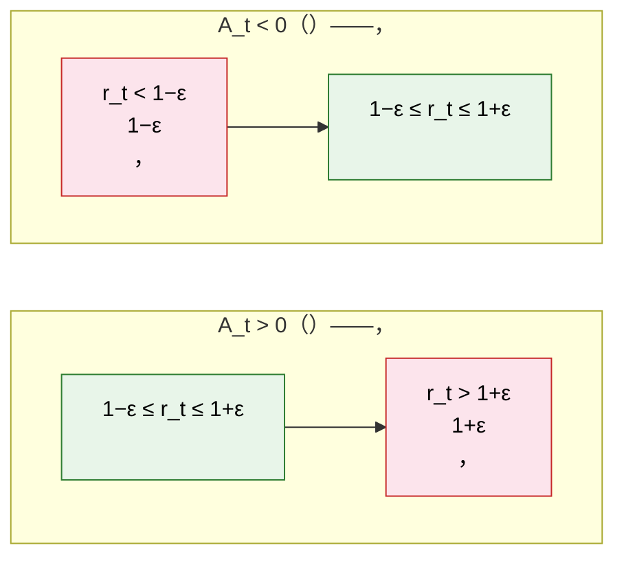

# 7.3 

## 

 7.2  PPO ：

$$L^{\text{CLIP}}(\theta) = \mathbb{E}_t \left[ \min \left( r_t(\theta) \cdot A_t, \; \text{clip}(r_t(\theta), 1-\varepsilon, 1+\varepsilon) \cdot A_t \right) \right]$$

 $r_t$、 clip  min。：**？？**

： →  → TRPO  KL  → PPO 。：**，**。

，： $s$  $a_1, a_2$， $\pi(a_1\mid s) = 0.6$、$\pi(a_2\mid s) = 0.4$。： $\pi(a_1\mid s)$  $0.99$，？

::: tip 

- [](../chapter05_policy_gradient/reinforce)——
- [ $A(s,a)$](../chapter06_actor_critic/advantage-function)——
  :::

## 

 5 （[REINFORCE](../chapter05_policy_gradient/reinforce)）：

$$\theta \leftarrow \theta + \alpha \cdot \nabla_\theta \log \pi_\theta(a\mid s) \cdot A(s,a)$$

 $a$  $A(s,a) > 0$（）， $\pi(a\mid s)$ 。**：**。

。 $(s, a_1)$， $A(s, a_1) = 2$， $\alpha = 0.5$。：

|                  |  |  |
| ---------------- | ------ | ------ |
| $\pi(a_1\mid s)$ | 0.6    | 0.99   |
| $\pi(a_2\mid s)$ | 0.4    | 0.01   |

，$a_1$  0.6  0.99。****——， 0.01。**，**。

。 $\pi_{\text{old}}$ ，，$a_1$  0.99， 0.6 。****。

：**，**。。

> ，""，""？

## 

。$(s, a_1)$  $\pi_{\text{old}}(a_1\mid s) = 0.6$ ， $\pi_\theta(a_1\mid s) = 0.99$ ？

，****（Importance Sampling）。：

$$\mathbb{E}_{a \sim \pi_{\text{old}}} \left[ \frac{\pi_\theta(a\mid s)}{\pi_{\text{old}}(a\mid s)} \cdot f(a) \right] = \mathbb{E}_{a \sim \pi_\theta} [f(a)]$$

 $r_t(\theta) = \frac{\pi_\theta(a_t\mid s_t)}{\pi_{\text{old}}(a_t\mid s_t)}$ ****（Policy Ratio）， $(s,a)$ 。

：

|                        | $\pi(a_1\mid s)$ |
| -------------------------- | ---------------- |
|  $\pi_{\text{old}}$  | 0.6              |
|  $\pi_\theta$        | 0.99             |
| $r_t(\theta) = 0.99 / 0.6$ | **1.65**         |

 $a_1$  1.65 。，：

$$L^{\text{IS}}(\theta) = \mathbb{E}_t \left[ r_t(\theta) \cdot A_t \right]$$

，。 1.65 ：** 1.65 **。 $\pi(a_1\mid s)$  0.999， $r_t = 1.665$； 0.9999， $r_t = 1.6665$。$r_t$ ，， $r_t$ ——****。

，。

> ， $r_t$ 。""？

## TRPO  KL 

2015 ，Schulman  TRPO（Trust Region Policy Optimization，）。：****。 KL （Kullback-Leibler divergence），：

$$\max_\theta \; \mathbb{E}_t \left[ r_t(\theta) \cdot A_t \right] \quad \text{s.t.} \quad \mathbb{E}_t \left[ D_{\text{KL}}(\pi_{\text{old}} \| \pi_\theta) \right] \leq \delta$$

： $\max_\theta \; \mathbb{E}_t[r_t(\theta) \cdot A_t]$ ——，； $\mathbb{E}_t[D_{\text{KL}}(\pi_{\text{old}} \| \pi_\theta)] \leq \delta$ 。 "s.t."  "subject to"（）。

KL ，：

$$D_{\text{KL}}(P \| Q) = \sum_i P(i) \log \frac{P(i)}{Q(i)}$$

，$D_{\text{KL}} = 0$；，$D_{\text{KL}}$ （）。 $\pi_{\text{old}}$ ，$\pi_\theta$ ， $D_{\text{KL}}(\pi_{\text{old}} \| \pi_\theta)$ 。 $\delta$。

。$\pi_{\text{old}}(a_1) = 0.6$，$\pi_\theta(a_1) = 0.99$，：

$$D_{\text{KL}}(\pi_{\text{old}} \| \pi_\theta) = 0.6 \ln\frac{0.6}{0.99} + 0.4 \ln\frac{0.4}{0.01} \approx 0.6 \times (-0.50) + 0.4 \times 3.69 \approx 1.18$$

 1.18， $\delta = 0.01$。TRPO ，。

$\delta$  0.01， 1%。****（trust region）：，。

，。 Hessian （）。，Hessian ，。 LLM ， 70B ， Hessian 。TRPO ，。****。

> TRPO ，。， TRPO ，？

## PPO 

2017 ，Schulman  PPO（Proximal Policy Optimization）。，TRPO  KL  Hessian ，。PPO ：**""，， $r_t$ **。

 $r_t$ ：$r_t = \pi_\theta(a_t\mid s_t) / \pi_{\text{old}}(a_t\mid s_t)$。 $r_t = 1$ ，；$r_t$  1 ，。， $r_t$  $[1-\varepsilon, 1+\varepsilon]$ ，——""、， KL ， Hessian。

PPO ：

$$L^{\text{CLIP}}(\theta) = \mathbb{E}_t \left[ \min \left( r_t(\theta) \cdot A_t, \; \text{clip}(r_t(\theta), 1-\varepsilon, 1+\varepsilon) \cdot A_t \right) \right]$$

 1.65 （ $\varepsilon = 0.2$、$A_t = 2$）。 $r_t = 1.65$，：

****：$r_t \cdot A_t = 1.65 \times 2 = 3.30$。

****： $r_t = 1.65 > 1 + \varepsilon = 1.2$，， $r_t$  $1.2$。 $= 1.2 \times 2 = 2.40$。

****：$\min(3.30,\; 2.40) = 2.40$。

|         |                                                  |          |
| --------- | ---------------------------------------------------- | ---------- |
|     | $r_t \cdot A_t = 1.65 \times 2$                      | $3.30$     |
|     | $\text{clip}(1.65, 0.8, 1.2) \cdot 2 = 1.2 \times 2$ | $2.40$     |
| $\min$  | $\min(3.30,\; 2.40)$                                 | **$2.40$** |

（3.30） 2.40。，** $\theta$ ， $\pi(a_1\mid s)$**。

### 

""， clip 。$\text{clip}(x, a, b)$ ：

$$\text{clip}(x, a, b) = \begin{cases} a & x < a \\ x & a \leq x \leq b \\ b & x > b \end{cases}$$

 $a = 1 - \varepsilon = 0.8$、$b = 1 + \varepsilon = 1.2$，：（ $0.8$  $1.2$）， 1 。

| $r_t$             | clip   |  $\theta$ |
| ----------------------- | ---------- | --------------- |
| $r_t < 0.8$             |  $0.8$ | （）    |
| $0.8 \leq r_t \leq 1.2$ | $r_t$  |               |
| $r_t > 1.2$             |  $1.2$ | （）    |

。 $r_t(\theta)$ ：

$$r_t(\theta) = \frac{\pi_\theta(a_t\mid s_t)}{\pi_{\text{old}}(a_t\mid s_t)}$$

 $\pi_{\text{old}}$ ，（ $\pi_{\text{old}}(a_1\mid s) = 0.6$）。$\theta$  $\pi_\theta$  $r_t$。

：

$$\nabla_\theta\left[\text{clip}(r_t(\theta), 0.8, 1.2) \cdot A_t\right] = A_t \cdot \underbrace{\frac{\partial \,\text{clip}}{\partial r_t}}_{\text{clip }} \cdot \underbrace{\nabla_\theta r_t(\theta)}_{\text{ } \theta}$$

 $\theta \xrightarrow{\nabla \pi_\theta} r_t \xrightarrow{\partial \text{clip}/\partial r_t} \text{clip} \xrightarrow{\times A_t} L$。，**，**。clip ，：

| $r_t$             | clip  $\partial \text{clip}/\partial r_t$ |
| ----------------------- | --------------------------------------------- |
| $r_t < 0.8$             | $0$（）                                 |
| $0.8 \leq r_t \leq 1.2$ | $1$（）                                 |
| $r_t > 1.2$             | $0$（）                                 |

：$\pi_{\text{old}}(a_1\mid s) = 0.6$、$A_t = 2$、$\nabla_\theta r_t = \nabla_\theta \pi_\theta / 0.6$。

**：$r_t = 1.65$（，）**。clip ， $0$：

$$\nabla_\theta[\text{clip}(r_t,0.8,1.2)\cdot A_t] = 2 \cdot 0 \cdot \frac{\nabla_\theta \pi_\theta}{0.6} = 0$$

 $\partial \text{clip}/\partial r_t = 0$  $\theta \to L$ —— $\nabla_\theta \pi_\theta$ ，。$\min$ （$2.40 < 3.30$），，。** PPO ： 1.65 ，**。

**：$r_t = 0.5$（，）**。clip ， $0$：

$$\nabla_\theta[\text{clip}(r_t,0.8,1.2)\cdot A_t] = 2 \cdot 0 \cdot \frac{\nabla_\theta \pi_\theta}{0.6} = 0$$

——$A_t = 2$ ， $r_t$，$r_t$  $0.5$，""。**， $0.5$， $[0.8, 1.2]$ **。

：——，；——。

""：** $\theta$ **，。：，（）。

，：

- **** $r_t(\theta) \cdot A_t$：，。
- **** $\text{clip}(r_t(\theta), 1-\varepsilon, 1+\varepsilon) \cdot A_t$： $r_t$  $[1-\varepsilon, 1+\varepsilon]$ 。$\varepsilon$  0.1  0.2， 10%  20%。
- **** $\min(\cdot, \cdot)$：。

### 

 $A_t$ ，：

** $A_t > 0$（）**： $r_t(\theta)$。 $r_t$  $1+\varepsilon$，。，。

** $A_t < 0$（）**： $r_t(\theta)$。 $r_t$  $1-\varepsilon$，。



，$r_t$  1 ""：$A_t > 0$  $1+\varepsilon$ ，$A_t < 0$  $1-\varepsilon$ 。 $r_t$ ，，。

： $r_t$ ****—— $A_t > 0$  $r_t$， $r_t$  $1-\varepsilon$——？ $\min$ 。

### min 

， $\min$ ？：$\min$ ，**，？**

。$\min$ ****， clip """"。。

 $A_t > 0$（ $r_t$），。

****（$r_t > 1+\varepsilon$）。clip  $1+\varepsilon$：

|      |                 | （$r_t=1.65$、$\varepsilon=0.2$、$A_t=2$） |
| ------ | --------------------- | ---------------------------------------------- |
|  | $r_t \cdot A_t$       | $1.65 \times 2 = 3.30$（）                   |
|    | $(1+\varepsilon) A_t$ | $1.2 \times 2 = 2.40$（）                    |

 $r_t > 1+\varepsilon$  $r_t A_t > (1+\varepsilon) A_t$，$\min$ ，。****：，。

****（$r_t < 1-\varepsilon$）。clip  $1-\varepsilon$：

|      |                 | （$r_t=0.5$、$\varepsilon=0.2$、$A_t=2$） |
| ------ | --------------------- | --------------------------------------------- |
|  | $r_t \cdot A_t$       | $0.5 \times 2 = 1.0$（）                    |
|    | $(1-\varepsilon) A_t$ | $0.8 \times 2 = 1.6$（）                    |

 $r_t < 1-\varepsilon$  $r_t A_t < (1-\varepsilon) A_t$，$\min$ 。 $r_t(\theta)$，， $r_t$：

$$\nabla_\theta[r_t \cdot A_t] = A_t \cdot \nabla_\theta r_t = 2 \cdot \frac{\nabla_\theta \pi_\theta(a_t\mid s_t)}{0.6} = \tfrac{10}{3}\,\nabla_\theta \pi_\theta(a_t\mid s_t) \neq 0$$

 $[1-\varepsilon, 1+\varepsilon]$ 。

$A_t < 0$（， $r_t$）——，""、。

****（$r_t < 1-\varepsilon$）。clip  $1-\varepsilon$：

|      |                 | （$r_t=0.5$、$\varepsilon=0.2$、$A_t=-2$） |
| ------ | --------------------- | ---------------------------------------------- |
|  | $r_t \cdot A_t$       | $0.5 \times (-2) = -1.0$（）           |
|    | $(1-\varepsilon) A_t$ | $0.8 \times (-2) = -1.6$（）           |

 $A_t=-2$ ： $r_t < 1-\varepsilon$  $r_t A_t > (1-\varepsilon) A_t$， $-1.0 > -1.6$，$\min$  $-1.6$，。****：，。

****（$r_t > 1+\varepsilon$）。clip  $1+\varepsilon$：

|      |                 | （$r_t=1.65$、$\varepsilon=0.2$、$A_t=-2$） |
| ------ | --------------------- | ----------------------------------------------- |
|  | $r_t \cdot A_t$       | $1.65 \times (-2) = -3.30$（）          |
|    | $(1+\varepsilon) A_t$ | $1.2 \times (-2) = -2.40$（）           |

 $r_t > 1+\varepsilon$  $r_t A_t < (1+\varepsilon) A_t$， $-3.30 < -2.40$，$\min$  $-3.30$，， $r_t$——。

：

| $A_t$ | $r_t$         |         | $\min$  |              |          |
| ----- | ----------------- | --------------- | ----------- | ---------------- | ---------------- |
| $>0$  | $> 1+\varepsilon$ |  $>$  |       | （）     | ， |
| $>0$  | $< 1-\varepsilon$ |  $<$  |     | ， $r_t$ |        |
| $<0$  | $< 1-\varepsilon$ |  $>$  |       | （）     | ， |
| $<0$  | $> 1+\varepsilon$ |  $<$  |     | ， $r_t$ |        |

<details>
<summary>（）</summary>

 min 。，？，。

****： $r_t > 0$  $A_t \neq 0$，PPO  $L(r_t, A_t) = \min(r_t A_t,\; c \cdot A_t)$（ $c = \text{clip}(r_t, 1-\varepsilon, 1+\varepsilon)$） $r_t$ ：

$$\frac{\partial L}{\partial r_t} \in \{0,\; A_t\}$$

****：$A_t \cdot \frac{\partial L}{\partial r_t} \in \{0,\; A_t^2\} \geq 0$。， $A_t$ ——****。

****：min ——，。$c$  $r_t$ ：

| $r_t$                                 | $c$             | $\frac{dc}{dr_t}$ |
| ------------------------------------------- | --------------- | ----------------- |
| $r_t < 1-\varepsilon$                       | $1-\varepsilon$ | $0$               |
| $1-\varepsilon \leq r_t \leq 1+\varepsilon$ | $r_t$           | $1$               |
| $r_t > 1+\varepsilon$                       | $1+\varepsilon$ | $0$               |

 $L$ ：

- **$r_t \in [1-\varepsilon, 1+\varepsilon]$**：$c = r_t$，，$L = r_t A_t$，$\frac{\partial L}{\partial r_t} = A_t$。
- **$r_t > 1+\varepsilon$**：$c = 1+\varepsilon$ 。
  - $A_t > 0$：$r_t A_t > (1+\varepsilon) A_t$，min （），$\frac{\partial L}{\partial r_t} = 0$。
  - $A_t < 0$：，$r_t A_t < (1+\varepsilon) A_t$，min ，$\frac{\partial L}{\partial r_t} = A_t$。
- **$r_t < 1-\varepsilon$**：$c = 1-\varepsilon$ 。
  - $A_t > 0$：$r_t A_t < (1-\varepsilon) A_t$，min ，$\frac{\partial L}{\partial r_t} = A_t$。
  - $A_t < 0$： $r_t A_t > (1-\varepsilon) A_t$，min （），$\frac{\partial L}{\partial r_t} = 0$。

（ + ） $\frac{\partial L}{\partial r_t} \in \{0, A_t\}$。。$\square$

****：$L$  $r_t$ ，——$0$  $A_t$。 $A_t$ （ $r_t$）； $0$ （）。 $-A_t$，**""**。

 $\nabla_\theta L = \frac{\partial L}{\partial r_t} \cdot \nabla_\theta r_t$， $r_t(\theta) = \pi_\theta(a_t\mid s_t) / \pi_{\text{old}}(a_t\mid s_t)$（$\pi_{\text{old}}$ ）：

- $\frac{\partial L}{\partial r_t} = A_t > 0$ ，$\nabla_\theta L$  $\pi_\theta(a_t\mid s_t)$ ——。
- $\frac{\partial L}{\partial r_t} = A_t < 0$ ，$\nabla_\theta L$  $\pi_\theta(a_t\mid s_t)$ ——。
- $\frac{\partial L}{\partial r_t} = 0$ ，，——，。

**PPO ，——，。**

</details>

，$\min$ ""（）： clip ，；，。**""""**——。

>  $\min$  $\max$，""：（），（）。，$\min$  $\max$。

## 

：

```python
import numpy as np
import matplotlib.pyplot as plt

# ==========================================
#  PPO Clip 
# ==========================================
epsilon = 0.2
r = np.linspace(0.0, 2.0, 500)  #  r_t(θ)

def ppo_clip_objective(r, A, eps=0.2):
    """PPO ：L = min(r * A, clip(r, 1-eps, 1+eps) * A)"""
    r_clipped = np.clip(r, 1 - eps, 1 + eps)
    return np.minimum(r * A, r_clipped * A)

fig, (ax1, ax2) = plt.subplots(1, 2, figsize=(12, 5))

# A > 0 
A_pos = 1.0
obj_pos = ppo_clip_objective(r, A_pos)
ax1.plot(r, r * A_pos, 'b--', alpha=0.5, label=': r × A')
ax1.plot(r, obj_pos, 'r-', linewidth=2, label='PPO: min(r×A, clip(r)×A)')
ax1.axvline(x=1+epsilon, color='gray', linestyle=':', label=f'1+ε={1+epsilon}')
ax1.axvline(x=1-epsilon, color='gray', linestyle=':', label=f'1-ε={1-epsilon}')
ax1.set_title('A > 0（）')
ax1.set_xlabel(' r_t(θ)')
ax1.set_ylabel('')
ax1.legend()

# A < 0 
A_neg = -1.0
obj_neg = ppo_clip_objective(r, A_neg)
ax2.plot(r, r * A_neg, 'b--', alpha=0.5, label=': r × A')
ax2.plot(r, obj_neg, 'r-', linewidth=2, label='PPO: min(r×A, clip(r)×A)')
ax2.axvline(x=1+epsilon, color='gray', linestyle=':', label=f'1+ε={1+epsilon}')
ax2.axvline(x=1-epsilon, color='gray', linestyle=':', label=f'1-ε={1-epsilon}')
ax2.set_title('A < 0（）')
ax2.set_xlabel(' r_t(θ)')
ax2.legend()

plt.suptitle('PPO Clip （ε=0.2）', fontsize=14)
plt.tight_layout()
plt.savefig("ppo_clip_visualization.png", dpi=150)
print("")
```

： $A > 0$ ， $r_t > 1.2$ （，）； $A < 0$ ， $r_t < 0.8$ 。 PPO ——，。

## ε 

$\varepsilon$ ，：

| ε  |  |    |    |                    |
| ---- | -------- | ---------- | -------- | -------------------------- |
| 0.05 |      |        |  |          |
| 0.1  |      |        |      | LLM （，） |
| 0.2  |      |        |      | /（）    |
| 0.3  |      |        |    | /          |
| 0.5  |      |  |  |                      |

 LLM ， $\varepsilon$（0.1 ），、，（）。

<details>
<summary>： PPO ""，？</summary>

：

1. ** ε**：PPO-PPG（Phasic Policy Gradient） ε，。"，"。
2. ****：PPO  10  epoch。， epoch 。
3. **KL **： KL ， epoch  KL —— TRPO  PPO 。

， 2 ——PPO  `n_epochs=10` 。

</details>

<details>
<summary>：TRPO ， PPO？</summary>

，""""。TRPO （Hessian ），，， bug。PPO  `torch.clamp` ， 10 。

OpenAI  2017 ：PPO  TRPO 。 TRPO ， PPO 。

 LLM ——70B ，。OpenAI  InstructGPT  GPT-4  PPO， TRPO。

</details>

，PPO ：，， TRPO  KL  PPO 。 PPO ：GAE（）， LLM ——。 [](./gae-reward-model)。
