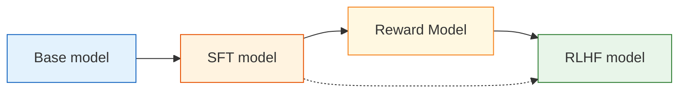

# 8.1  base model  assistant

## 

****

-  base model “”，“”。
- ：、、、。
-  SFT  RLHF ：，。

****

$$
\mathcal{L}_{LM}(\theta) = -\sum_{t=1}^{T}\log \pi_\theta(x_t \mid x_{<t})
\quad \text{（： token）}
$$

$$
\pi_\theta(a_t \mid s_t) = P_\theta(y_t \mid x, y_{<t})
\quad \text{（LLM ： token）}
$$

$$
R(x,y) \approx \text{human preference}(x,y)
\quad \text{（RLHF ：）}
$$

> ****
>
> Base model “，”；assistant “，”。

 PPO ：，、 KL 。， PPO ，：**，？**

，。

Base model 。： token， token。，、、、。“，”。 prompt “”，base model ；、、，。

，：

1. **，。**
2. **，。**
3. **、。**

RLHF ，“”“”。



## Base model 

。 $x_1, x_2, \ldots, x_T$，：

$$
\mathcal{L}_{LM}(\theta)
= -\sum_{t=1}^{T}\log \pi_\theta(x_t \mid x_1,\ldots,x_{t-1})
$$

：

> ， token  $x_t$。 token ，loss 。

“”“”，“”“”“”“ JSON ”。。

：

```text
：。
```

 assistant ，。 base model ，。：

- ；
- ；
- ；
- ；
- “：……”。

“”，“”。

##  LLM  MDP

 3  MDP  CartPole、 RL 。， token 。

| MDP           |  RL                 | LLM                          |
| ----------------- | --------------------------- | ------------------------------------------ |
|  $s_t$        | CartPole 、、 | prompt  token：$(x, y_{<t})$ |
|  $a_t$        |  /              |  token $y_t$             |
|  $\pi_\theta$ |         |  next-token                |
|  $P$          |             |  token                   |
|  $R$          |  +1， 0             | RM /  /              |
| episode           |                     |  EOS             |

 CartPole ：LLM “”。 token ``， ``。，****： token，。

 RLHF ：

$$
R(x, y) = r_{RM}(x, y)
$$

 $x$  prompt，$y$ 。 $(prompt, response)$ ，。

：， 3  token ， 80  token ？PPO  Critic ， token 。

## ：Base model  Assistant

： prompt， base model ，。

```python
# ==========================================
#  base model  assistant
# ==========================================
from transformers import AutoModelForCausalLM, AutoTokenizer

model_name = "HuggingFaceTB/SmolLM2-360M"
tokenizer = AutoTokenizer.from_pretrained(model_name)
model = AutoModelForCausalLM.from_pretrained(model_name, device_map="auto")

prompts = [
    "。",
    " JSON， name  reason。",
    "，：2029 ？",
]

for prompt in prompts:
    inputs = tokenizer(prompt, return_tensors="pt").to(model.device)
    outputs = model.generate(
        **inputs,
        max_new_tokens=120,
        do_sample=True,
        temperature=0.7,
        top_p=0.9,
    )
    print("=" * 80)
    print(tokenizer.decode(outputs[0], skip_special_tokens=True))
```

“”， assistant ：

|      | base model          |                   |
| -------- | --------------------------- | --------------------------- |
|  |  prompt， |             |
|  |  JSON       | 、 JSON |
|    |                 |                 |
|    |         |       |
|  | 、                  | 、、        |
|      | ，    | 、、      |

“”。， assistant。 prompt 。

## 

：Base、SFT、RLHF。“”，。

|        |               |                  |                            |
| ---------- | --------------------- | -------------------------- | ---------------------------------- |
| Base model | next-token prediction | 、、、 | ，           |
| SFT model  | -     | 、 | ， |
| RLHF model |  + PPO        | ，     | reward hacking、、 |

SFT ：

$$
\mathcal{L}_{SFT}(\theta) = -\sum_{t=1}^{T}\log \pi_\theta(y_t \mid x, y_{<t})
$$

，： $x$， $y$。SFT “”。

RLHF ：，“”。。 PPO 。

## SFT  RLHF

SFT  base model  assistant， RLHF？。

**，SFT ，。**  
 prompt 。SFT “”，“”。： vs ， vs 。

**，SFT 。**  
SFT ；。，。RLHF ，。

**，。**  
“”“”“”“”，。RLHF 。

**，SFT 。**  
“”“”，“”“”“”。。

## 、

 prompt ：

```text
 PPO  KL ， 100 。
```

：

|  |                                                                                              |                     |
| ---- | ---------------------------------------------------------------------------------------------------- | ----------------------------- |
| Base | “ PPO  KL ， 100 。PPO ……”                     |  prompt， |
| SFT  | “KL ，。，，。”                  | ，          |
| RLHF | “KL ‘’。， PPO 。” | ，        |

：RLHF “”，。，；RLHF 。

##  Base model

。， RLHF 。

|                          |                                    |
| ---------------------------- | -------------------------------------------- |
| `HuggingFaceTB/SmolLM2-360M` | ，                     |
| `Qwen/Qwen2.5-0.5B`          | ，             |
| `EleutherAI/pythia-410m`     |  base， base  SFT  |

 7B  70B。RLHF ：Actor、Reference、Reward Model、Critic。，“”“”。

 artifact：

```text
 base checkpoint
  -> 
  -> SFT： assistant 
  -> RM：
  -> PPO：
  -> Eval：
```

## 

### ：Base model ， chat prompt 

Chat prompt ，。，。，。

### ：SFT  RLHF

SFT ，。；RLHF 。，。

### ：RLHF 

RLHF 。、、，。，、、 SFT 。

### ：Reward ，

Reward Model 。 RM，。。

## 

Base model  assistant ，“”，“”。Base model  next-token prediction，；assistant 、、、，。

 RLHF ：SFT、Reward Model、PPO ， artifact——[ RLHF ](./standard-rlhf-pipeline)。

## 

1.  5  prompt  base model， assistant。
2.  prompt  assistant ，：、、、。
3. ： SFT  5 ，？？
