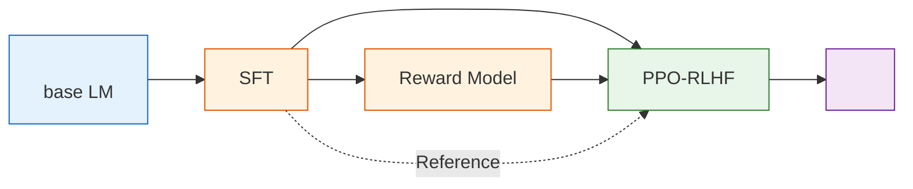

#  8 ： InstructGPT—— RLHF 

## 

****

-  base model ， assistant。
-  RLHF ：SFT、Reward Model、PPO。
- ， reward hacking、、。
-  TRL  OpenRLHF、NeMo RL / NeMo Aligner 。

****

$$
\mathcal{L}_{SFT}
=-\mathbb{E}_{(x,y)\sim\mathcal{D}_{SFT}}
\left[\log \pi_\theta(y\mid x)\right]
\quad \text{（SFT： assistant ）}
$$

$$
\mathcal{L}_{RM}
=-\mathbb{E}_{(x,y_w,y_l)\sim\mathcal{D}_{pref}}
\left[\log\sigma(r_\phi(x,y_w)-r_\phi(x,y_l))\right]
\quad \text{（RM：）}
$$

$$
R_{PPO}(x,y)
=r_\phi(x,y)-\beta D_{KL}(\pi_\theta(\cdot\mid x)\|\pi_{ref}(\cdot\mid x))
\quad \text{（PPO-RLHF：， SFT ）}
$$

****

 7  PPO ， RL 、。：prompt ，token ，，Reward Model ，Reference model  KL 。SFT、RM、PPO “”“”“”。

 PPO ：，、 KL 。， OpenAI InstructGPT  RLHF 。

：**RLHF **。 RLHF ， RLHF 。 base model ， `HuggingFaceTB/SmolLM2-360M`、`Qwen/Qwen2.5-0.5B`  `EleutherAI/pythia-410m`。，。、。

 OpenAI  InstructGPT：（SFT），（Reward Model, RM）， PPO 。 Hugging Face TRL ， OpenRLHF、NVIDIA NeMo RL / NeMo Aligner 。

## 

 M ， RLHF 。“ LLM ”， base model  checkpoint ，、、。

，“” artifact： base model，， SFT、RM、PPO 。， RLHF ；，。

## RL 

 3 ， MDP ：

$$
\mathcal{M}=\langle \mathcal{S},\mathcal{A},P,R,\gamma\rangle
$$

 LLM RLHF ，：

| MDP           | CartPole                 | LLM RLHF                    |
| ----------------- | ------------------------ | --------------------------- |
|  $s_t$        | 、、 | prompt +  token       |
|  $a_t$        |  /               |  token                |
|  $\pi_\theta$ |                  |                     |
|  $R$          |  +1                  | RM 、、 |
| episode           |          |  EOS  |

 RLHF “ RL  LLM ”， LLM 。：CartPole ，LLM ；CartPole ，LLM 。

 3 ：SFT ，RM ，PPO  KL 。

## 

|                                                             |                                                 |                              |
| --------------------------------------------------------------- | ------------------------------------------------------- | -------------------------------- |
| [ base model  assistant](./base-model-to-assistant) | pretrained checkpoint 、？                | base / SFT / RLHF      |
| [ RLHF ](./standard-rlhf-pipeline)                    | InstructGPT  SFT → RM → PPO ？      |  artifact        |
| [SFT：](./imitation-learning-pipeline)          | SFT ？                            | SFT  SFT           |
| [Reward Model：](./reward-function-design)            |  chosen/rejected ？     | Reward Model  RM       |
| [PPO-RLHF：](./ppo-rlhf-loop)                         | Actor、Reference、Reward Model、Critic ？       | PPO-RLHF  +  |
|                                   |  reward hacking？？ |  +  +    |
| [：veRL PPO  GSM8K](./verl-ppo-gsm8k)                   |  LLM RL  PPO？                        | veRL  +    |
| [：Reward Hacking ](./extended-practice)      |  hack？？           |  reward hacking        |

## 8.6 

RLHF ：，。RM  RM；；，、、。

， RLHF 。8.6 ：

- ** benchmark**：，、、、。
- ****： base / SFT / RLHF  pairwise battle， judge 。
- ****：， reward hacking、、、。

 RLHF ， “reward ”。：？？？

##  9 

** RLHF **。 9 ， post-training ：

- DPO  Reward Model。
- GRPO  Critic。
- RLVR 。
- DAPO、RLAIF、。

，08 “”，09 “”。 RLHF ，，。

，： pretrained base model  assistant——[ base model  assistant](./base-model-to-assistant)。

## 

，：

-  RL  LLM 、、、；
-  SFT、Reward Model、PPO-RLHF ；
-  Bradley-Terry ， margin、accuracy、reward ；
-  PPO-RLHF ， reward  reward hacking；
-  TRL 、OpenRLHF  NeMo RL / NeMo Aligner 。
