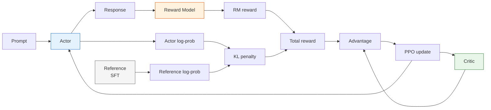
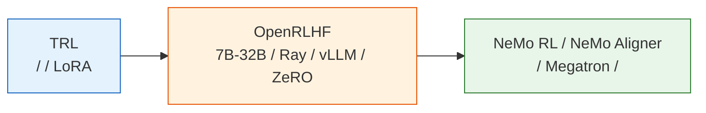

# 8.5 PPO-RLHF：

## 

****

-  PPO-RLHF  Actor、Reference、Reward Model、Critic 。
-  KL 、token-level reward、advantage、PPO clip  LLM 。
-  PPO-RLHF ：reward、KL、、entropy、value loss 。

****

$$
r_t =
\begin{cases}
-\beta(\log \pi_\theta(y_t\mid s_t)-\log \pi_{ref}(y_t\mid s_t)), & t<T \\
r_{RM}(x,y)-\beta(\log \pi_\theta(y_t\mid s_t)-\log \pi_{ref}(y_t\mid s_t)), & t=T
\end{cases}
\quad \text{（RLHF token ： KL， RM ）}
$$

$$
\rho_t(\theta)=\frac{\pi_\theta(y_t\mid s_t)}{\pi_{\theta_{old}}(y_t\mid s_t)}
\quad \text{（）}
$$

$$
\mathcal{L}_{clip}(\theta)
=-\mathbb{E}_t\left[
\min(\rho_t A_t,\ \mathrm{clip}(\rho_t,1-\epsilon,1+\epsilon)A_t)
\right]
\quad \text{（PPO ）}
$$

> ****
>
> PPO-RLHF “ reward”， Reference 、PPO 、Critic ，。

 SFT  Reward Model， RLHF  PPO 。InstructGPT ，PPO “”，：

|                  |                 |                               |
| -------------------- | ------------------- | --------------------------------- |
| Actor                | SFT     | ， PPO            |
| Reference            |  SFT      |  KL ， Actor  |
| Reward Model         |     |  Actor            |
| Critic / Value Model |  Actor  | ， PPO        |



##  LLM 

 3 ， RL ：

$$
s_0,a_0,r_0,s_1,a_1,r_1,\ldots
$$

 LLM ，prompt ，：

```text
s_0 = prompt
a_0 =  1  token
s_1 = prompt +  1  token
a_1 =  2  token
...
s_T = prompt + 
```

 token，：

$$
\pi_\theta(a_t\mid s_t)=P_\theta(y_t\mid x,y_{<t})
$$

 CartPole ，LLM  token 。Reward Model  $y$  $r_{RM}(x,y)$。 PPO  token ，：

1.  token  KL ， reference。
2.  token  EOS  RM 。

 token 。，：

> ，” SFT ”；，。

### Token  vs 

：**？**

。

**：。** ，RM  $R$。 $R$  token ——，。

$$
\nabla_\theta J \approx \frac{1}{T}\sum_{t=1}^{T} R \cdot \nabla_\theta \log \pi_\theta(y_t\mid s_t)
$$

**Token ： token 。** ， Critic  value， token  advantage $A_t$， PPO ：

$$
\mathcal{L}_{clip}(\theta) = -\frac{1}{T}\sum_{t=1}^{T}\min(\rho_t A_t,\ \mathrm{clip}(\rho_t,1-\epsilon,1+\epsilon)A_t)
$$

。"3 + 3 × 6 ？"， 9  token：

```text
              2  1
t1  t2  t3  t4  t5  t6  t7  t8  t9
```

RM  $R = +1.5$。

- ****： token  $R = +1.5$。t8 ”2” t1 ””。
- **Token **：” token ”。”21”，，；””，，。 token 。

 CartPole （）， LLM ： token，。 token ， token 。

|      |                     | Token                           |
| -------- | ------------------------- | --------------------------------- |
|  |  token  $R$ |  token  $A_t$         |
|  |  token  |  GAE          |
|  | ： token  | ： token  |
|  | REINFORCE                 | PPO、GRPO                         |

**，，。**  GRPO（ 9 ） Agentic RL（ 10 ），、。

#### 

：

- **Token 。** TDPO ，token  DPO  DPO；ReMax ， REINFORCE  token ，。
- **。** ， token， token 。PPO  Critic + GAE  token  advantage，GRPO  Critic，。
- **，token 。** DeepSeekMath ，，，token 。 GRPO 。
- **。** 、（）， token ；（、）， token 。（TRL、OpenRLHF、veRL） token 。

::: details 

 token ：**advantage **。

```python
# ----------  ----------
#  reward， token  advantage 
reward = rm_score - beta * kl_sum          # 
advantages = torch.full_like(logprobs, reward)  #  token 

loss_seq = -(advantages * logprobs).mean()

# ---------- Token  ----------
#  Critic  token  value， GAE  token  advantage
values = critic(prompt, response)          # [seq_len]
rewards = build_token_rewards(rm_score, kl_per_token)  #  token  rm_score
advantages = compute_gae(rewards, values)  #  token  advantage

loss_token = -(advantages * logprobs).mean()
```

 Critic， reward ；token  GAE ， token  advantage 。
:::

::: details 

—— `loss.backward()`  Actor 。****。

 $T$  token， token ：

$$
\Delta\theta_t \propto A_t \cdot \nabla_\theta \log \pi_\theta(y_t \mid s_t)
$$

- ****：$A_t = R$  $t$ ， token 。
- **Token **：$A_t$ 。 token（）$A_t$ ，； token $A_t$ ，。

， token 。 token ；token  token 。""。
:::

::: details ：Token 

- **InstructGPT** (Ouyang et al., 2022) — [arxiv.org/abs/2203.02155](https://arxiv.org/abs/2203.02155)。PPO  RLHF 。， token ， token 。
- **DeepSeekMath** (Shao et al., 2024) — [arxiv.org/abs/2402.03300](https://arxiv.org/abs/2402.03300)。 GRPO， token 。
- **TDPO** (Zeng et al., 2024) — [arxiv.org/abs/2404.11999](https://arxiv.org/abs/2404.11999)。Token-level Direct Preference Optimization， token  DPO。 Section 3  token 。
- **ReMax** (Li et al., 2024) — [arxiv.org/abs/2310.10505](https://arxiv.org/abs/2310.10505)。 token ， REINFORCE 。
- **Sutton & Barto, _Reinforcement Learning: An Introduction_**  13  — [incompleteideas.net/book](http://incompleteideas.net/book/the-book.html)。（per time-step）， token 。
  :::

## PPO-RLHF 

PPO-RLHF ：

1.  prompt 。
2. Actor 。
3. Reward Model 。
4. Reference  log-prob， KL 。
5. Critic  value， total reward  advantage。
6. PPO  Actor  Critic。

```python
# ==========================================
# PPO-RLHF ：
# ==========================================
for batch in prompt_dataloader:
    prompts = batch["prompt"]

    # 1. Actor 
    responses, actor_logprobs = actor.generate_with_logprobs(prompts)

    # 2. Reward Model 
    rm_scores = reward_model.score(prompts, responses)

    # 3. Reference  KL
    ref_logprobs = reference_model.logprobs(prompts, responses)
    kl_penalty = actor_logprobs - ref_logprobs

    # 4.  = RM  - KL 
    rewards = rm_scores - beta * kl_penalty

    # 5. Critic 
    values = critic.value(prompts, responses)
    advantages, returns = compute_gae(rewards, values)

    # 6. PPO  Actor  Critic
    ppo_update(
        actor=actor,
        critic=critic,
        prompts=prompts,
        responses=responses,
        old_logprobs=actor_logprobs,
        advantages=advantages,
        returns=returns,
    )
```

， RLHF ：Reward Model ，Reference ，Critic ，PPO 。

###  token  KL 

，Actor  Reference  token  log-prob ：

$$
\log \pi_\theta(y_t\mid s_t)=-1.2,\qquad
\log \pi_{ref}(y_t\mid s_t)=-1.6
$$

Actor  Reference  token， $-1.2$ 。KL ：

$$
\log \pi_\theta-\log \pi_{ref}=0.4
$$

 $\beta=0.05$， KL ：

$$
-\beta \cdot 0.4 = -0.02
$$

 RM  $1.3$ ，：

```text
 token： KL
 EOS token：RM  -  KL
```

 RLHF  reward  KL 。Actor ，， reference 。

## PPO 

 token，PPO “”“”。：

$$
\rho_t(\theta)=\frac{\pi_\theta(y_t\mid s_t)}{\pi_{\theta_{old}}(y_t\mid s_t)}
$$

 advantage $A_t>0$， token  Critic ，PPO ； $A_t<0$，，PPO 。

，：

|     | PPO       | clip                         |
| ------- | ----------------- | ---------------------------------- |
| $A_t>0$ |  token  |  $1+\epsilon$  |
| $A_t<0$ |  token  |  $1-\epsilon$    |

 7  PPO 。：“LunarLander ”“ token”。

###  PPO 

 token  $0.10$， $0.13$：

$$
\rho=\frac{0.13}{0.10}=1.3
$$

clip range  $\epsilon=0.2$， $1.2$。 token  advantage  $A=2$：

$$
\rho A=1.3\times2=2.6
$$

：

$$
\mathrm{clip}(\rho,0.8,1.2)A=1.2\times2=2.4
$$

PPO  $2.4$，： token ，，。

，LLM  PPO  reward ， token ，。

## PPO-RLHF 

PPO-RLHF ，“”。：

|             |                                             |                            |
| --------------- | ----------------------------------------------------- | ------------------------------------------ |
|       | Actor ，                | reward / KL / length           |
| RM    |  Reward Model 、    | reward ，                |
| Reference drift | Actor  SFT reference ， | 、、， |

 PPO-RLHF “ reward ”， reward  KL、、。

## Reference Model 

 RM ，Actor  SFT ， RM 。 RM ，、、，。

Reference “ assistant ”：

$$
R_{total}(x, y) = r_{RM}(x, y) - \beta D_{KL}(\pi_\theta(y|x) \| \pi_{ref}(y|x))
$$

 $\pi_{ref}$  SFT 。$\beta$ ，Actor  SFT；$\beta$ ，Actor ， reward hacking。

Reference “”， RM 。RM ， SFT 。Actor ，RM 。， PPO 。

 $\beta$ ：

| $\beta$ |                  |                            |
| ------- | ------------------------ | ------------------------------ |
|     | KL ，reward      | ，RLHF  SFT    |
|     | reward ，KL  |                        |
|     | reward ，KL  | reward hacking、、 |

## Critic 

PPO “”，“”。Critic  value， advantage：

$$
A_t = R_t - V_\phi(s_t)
$$

 Critic，，。 GRPO  Critic， RLHF ，Critic  PPO 。

，PPO-RLHF  GAE  advantage。 TD error：

$$
\delta_t = r_t + \gamma V(s_{t+1}) - V(s_t)
$$

 TD error ：

$$
A_t^{GAE} = \sum_{l=0}^{\infty}(\gamma\lambda)^l\delta_{t+l}
$$

 6、7  Actor-Critic / PPO 。LLM ， token，reward ， advantage  token 。

Critic 。 value ，advantage ； value loss ，Actor 。

## TRL 

 TRL ，，：

| TRL                         | RLHF     |
| ------------------------------- | ------------ |
| policy model                    | Actor        |
| ref model                       | Reference    |
| reward model  reward function | Reward Model |
| value head                      | Critic       |
| `kl_coef` / `target_kl`         | KL       |
| `ppo_epochs` / `cliprange`      | PPO  |

，。。

### Rollout batch  PPO batch 

PPO-RLHF  batch ，：

|           |                                     |                  |
| ------------- | --------------------------------------- | -------------------- |
| prompt batch  |  prompt                 | rollout          |
| rollout batch | Actor  prompt-response  | reward / KL      |
| mini-batch    | PPO                     |            |
| PPO epochs    |  rollout              |  |

On-policy PPO ：rollout ，。`ppo_epochs` ，“”， rollout ， on-policy 。

## 

PPO-RLHF “”，“”。 reward hacking  PPO ：

|            |                                |                    |
| -------------- | ---------------------------------- | -------------------------- |
| KL         |  Actor  SFT reference  | `kl_mean`  |
|  `beta`  | KL ，KL        | reward  KL   |
|  warmup  |                | loss / grad norm   |
|        |                | `grad_norm`        |
|      |  RM                    | reward         |
|  |  reward hacking                | 、n-gram     |

 PPO-RLHF  reward ， reward 、KL 、、。“reward ”，， RM 。

。KL ，warmup ， RM ， reward hacking。 KL ：

```python
def update_kl_coef(beta, observed_kl, target_kl, horizon=1000):
    """KL ，。"""
    error = (observed_kl - target_kl) / max(target_kl, 1e-8)
    multiplier = 1.0 + error / horizon
    return max(0.0, beta * multiplier)
```

 `beta` 。 Actor  reference ，reward ； Actor  RM 。 `reward_mean`、`kl_mean`、`response_length`、`entropy` ， reward 。

：

|            |                  |                   |                  |
| ------------------ | ------------------------ | ------------------------- | ------------------------ |
| Loss  NaN      |  /     |               | 、 |
|            |  KL  |  KL           |  `beta`  |
|        |            |  KL         |  `beta`、  |
|            |                |  entropy      | 、     |
|  | reward hacking           |  judge      | 、 |
|        |  hack                |  length-reward  | ， RM  |

## 

PPO-RLHF  reward。 reward ，：

|               |              |                |
| ----------------- | -------------------- | ---------------------- |
| `reward_mean`     |              |  |
| `kl_mean`         |      |  0       |
| `response_length` |  |  reward      |
| `entropy`         |        |            |
| `value_loss`      |              |          |
| `clip_fraction`   |      |  0       |
| `judge_win_rate`  |    |  RM reward       |

：

**：reward ，KL ，，win rate 。**  
， Actor  reference 。

**：reward ，KL ，，。**  
“”， reward hacking。 PPO， RM 、。

## 

 PPO-RLHF ，。：

1. ****：temperature、top_p、max_new_tokens 。
2. ** RM **：，。
3. ** KL  `beta`**： `kl_mean` 。
4. ** batch**：loss NaN  KL 、。
5. ****： reward ，， PPO。
6. ****： checkpoint  prompt 。

“”“”， reward。

## 

PPO-RLHF 。，。

 TRL ， RLHF 。： 360M、0.5B  7B、32B、70B ，。

：**，**。



### （TRL）

。 SFT  base model  assistant，Reward Model  chosen/rejected ，PPO  Actor、Reference、Reward Model  Critic。

 `transformers`、`datasets`、`peft`、`trl`、`accelerate`。 `HuggingFaceTB/SmolLM2-360M`、`Qwen/Qwen2.5-0.5B`、`EleutherAI/pythia-410m`  base model。

：

|                             |                            |
| ------------------------------- | ---------------------------------- |
| SFT  base ？    |  prompt  assistant |
| RM  chosen/rejected？ | held-out accuracy  margin    |
| PPO ？                  | reward ，KL      |
| ？                |  checkpoint        |
| badcase ？            |            |

 0.5B ， 7B 。

### （OpenRLHF）

 7B ，"""rollout "。PPO-RLHF ， RM ，， generate-train loop 。

OpenRLHF ：

|          |  TRL      |  OpenRLHF               |
| ------------ | --------------- | --------------------------------- |
| Rollout  |  `generate` |  vLLM / Ray         |
|      | LoRA      | ZeRO、、          |
|    |     | Actor、RM、Critic、Ref  |
|        | Python loop     |  rollout buffer       |
|          |         | 、checkpoint、    |

### （NeMo）

70B ，，、、。NVIDIA NeMo RL / NeMo Aligner ：、Megatron/FSDP、 checkpoint、、、。

 RLHF  PPO ，（Actor、Reference、Reward Model、Critic ）、、、KL 、checkpoint 、。

 PPO-RLHF ：

|          |  |                                |
| ------------ | ------------ | -------------------------------------- |
| Actor        |          | ，                 |
| Critic       |          |  Actor  backbone， |
| Reference    |        | ， log-prob              |
| Reward Model |        | ，             |

" 7B " 7B。 Reference  RM ，。：Actor  Critic  value head，Reference  offload，RM ，Rollout  PPO update  GPU。

### 

|     |                                            |
| ------- | -------------------------------------------------- |
| 135M-1B | TRL，                                  |
| 1B-7B   | TRL + Accelerate / DeepSpeed， LoRA      |
| 7B-32B  | OpenRLHF， rollout             |
| 70B+    | NeMo RL / NeMo Aligner， |

。 SFT、RM、PPO ， 7B/70B 。

### 

|          |                                   |
| ------------------ | ------------------------------------------------- |
| `SFTTrainer`       |  SFT， LoRA、FSDP、ZeRO  Megatron |
| `RewardTrainer`    |  RM ， RM accuracy / margin     |
| `PPOTrainer`       | Actor-RM-Critic-Ref  PPO                |
|  JSON  | 、、、        |
|  judge prompt  |  judge、 rubric、                   |
|        |  benchmark、A/B test、、          |

：，。 artifact ，。

## 

 RLHF  PPO ：** Actor  RM ， Reference  PPO ， Critic 。**

 TRL ， OpenRLHF  NeMo RL ——，。

PPO-RLHF ， reward 。 benchmark、， reward hacking ——[](./evaluation)。

## 

1.  Actor log-prob  -2.0，Reference log-prob  -2.4，$\beta=0.1$， token  KL 。
2.  `ppo_epochs` ？ on-policy 。
3. ， reward、KL、、entropy、judge win rate 。
4.  RLHF ， Actor、Reference、RM、Critic  GPU 。
5.  0.5B TRL  7B OpenRLHF 。
