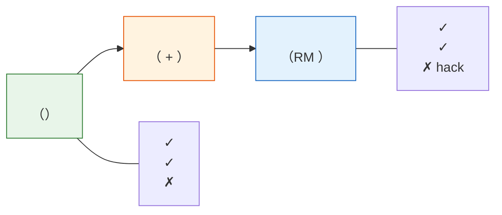

# 8.4 Reward Model：

## 

****

-  Reward Model  RLHF “”，。
-  Bradley-Terry 、pairwise loss、margin、accuracy、。
-  RM ，、。

****

$$
P(y_w \succ y_l \mid x)
= \sigma(r_\theta(x,y_w)-r_\theta(x,y_l))
\quad \text{（Bradley-Terry：，chosen ）}
$$

$$
\mathcal{L}_{RM}
=-\mathbb{E}_{(x,y_w,y_l)}
\left[\log \sigma(r_\theta(x,y_w)-r_\theta(x,y_l))\right]
\quad \text{（RM pairwise loss）}
$$

$$
R_{total}(x,y)
= \hat r_{RM}(x,y)
+ \alpha R_{format}
+ \beta R_{correctness}
- \lambda R_{length}
- \eta R_{repeat}
\quad \text{（： + ）}
$$

> ****
>
> Reward Model “”，。PPO ， RM  RM 。

 SFT 。 RLHF  artifact：Reward Model。 prompt  response，。，，，。

 RL ""——""。，。""，；"''"，。——，。

## 8.4.1 

，""""：



****——、、。，"hack"，，。

****（RM）， $(prompt, response)$，。RM ——""""。 RM ：，。""。

****—— RM ， RM 。：

$$R_{total} = R_{RM} + \alpha \cdot R_{format} + \beta \cdot R_{length} + \gamma \cdot R_{correctness}$$

 $\alpha, \beta, \gamma$ 。$R_{format}$ ，$R_{length}$ ，$R_{correctness}$ （、）。

## 8.4.2 Bradley-Terry 

。 prompt $x$  $y_w$（chosen） $y_l$（rejected）， $y_w$  $y_l$ 。RM  $r_\theta(x, y)$， $r_\theta(x, y_w) > r_\theta(x, y_l)$。

Bradley-Terry ：

$$P(y_w \succ y_l \mid x) = \sigma\left(r_\theta(x, y_w) - r_\theta(x, y_l)\right)$$

 $\sigma$  sigmoid  $\sigma(z) = \frac{1}{1 + e^{-z}}$。： RM  $y_w$  $y_l$ ， $y_w$  1；， 0.5。

：

$$\mathcal{L}_{RM} = -\mathbb{E}_{(x, y_w, y_l)} \left[ \log \sigma\left(r_\theta(x, y_w) - r_\theta(x, y_l)\right) \right]$$

：

|                  |           |                          |
| -------------------- | ------------- | ------------------------------ |
| $r_\theta(x, y)$     |       |  (, )      |
| $y_w$                | chosen    |            |
| $y_l$                | rejected  |            |
| $\sigma(\cdot)$      | sigmoid       |  $(0, 1)$  |
| $\log \sigma(\cdot)$ |       | —— RM    |

```python
# ==========================================
# ：Bradley-Terry 
# ==========================================
import torch
import torch.nn as nn

class RewardModel(nn.Module):
    """： (prompt, response)，"""
    def __init__(self, base_model, hidden_dim=1024):
        super().__init__()
        # （ SFT ）
        self.base = base_model
        # ，
        self.reward_head = nn.Linear(hidden_dim, 1)

    def forward(self, input_ids, attention_mask):
        #  token 
        outputs = self.base(input_ids=input_ids, attention_mask=attention_mask)
        last_hidden = outputs.last_hidden_state[:, -1, :]  # (batch, hidden_dim)
        reward = self.reward_head(last_hidden)  # (batch, 1)
        return reward.squeeze(-1)


def bradley_terry_loss(rm, chosen_ids, chosen_mask, rejected_ids, rejected_mask):
    """Bradley-Terry """
    r_chosen = rm(chosen_ids, chosen_mask)     # chosen 
    r_rejected = rm(rejected_ids, rejected_mask)  # rejected 

    # ： chosen  rejected 
    loss = -torch.nn.functional.logsigmoid(r_chosen - r_rejected).mean()
    return loss
```

。，RM —— 7B  3B  RM。 RM ， RM  RL （）， RM 。，RM  SFT ， base ——SFT ""，""。

###  Bradley-Terry loss

，。 prompt ，RM  chosen  rejected ：

$$
r_\theta(x,y_w)=2.0,\qquad r_\theta(x,y_l)=0.5
$$

：

$$
\Delta r = 2.0 - 0.5 = 1.5
$$

chosen ：

$$
\sigma(1.5)=\frac{1}{1+e^{-1.5}}\approx 0.818
$$

loss ：

$$
-\log 0.818 \approx 0.201
$$

 RM ，。， chosen  0.5，rejected  2.0：

$$
\Delta r=-1.5,\qquad \sigma(-1.5)\approx 0.182,\qquad -\log 0.182\approx 1.704
$$

loss ， chosen 、rejected 。

### 

： 1  10 ？。， 7 ， 9 ；。：A  B 。

：

|    |  |          |                |
| ---------- | ---------------- | ---------------- | ---------------------- |
|    |              |          |        |
|  |            | pairwise ranking |  prompt  |
|  |              |  |            |

： prompt  4  9 ，， chosen/rejected 。

## 8.4.3 

RM ，？， token ，？。

|            |                 |                |                        |         |
| -------------- | ------------------- | ------------------ | -------------------------- | --------------- |
| Sequence-level |     | ，         |  | PPO, GRPO       |
| Step-level     |       |  |              | PRM（） |
| Token-level    |  token  |              | ，     | RLHF    |

 **sequence-level**  ****。PPO  GRPO ， token-level （ token ）。

Step-level ， Process Reward Model（PRM）。OpenAI  2023  outcome supervision  process supervision， PRM800K step-level feedback 。[^process_supervision] ：，，step-level ；sequence-level 。

```python
# ==========================================
# 
# ==========================================
def sequence_reward(rm, prompt, response):
    """Sequence-level："""
    return rm.score(prompt, response)  # 

def step_reward(rm, prompt, reasoning_steps):
    """Step-level："""
    step_rewards = []
    for i, step in enumerate(reasoning_steps):
        #  i+1 
        partial = "\n".join(reasoning_steps[:i+1])
        step_rewards.append(rm.score(prompt, partial))
    return step_rewards  # 

def combined_reward(rm, prompt, response, reasoning_steps):
    """：sequence-level RM + step-level """
    r_rm = sequence_reward(rm, prompt, response)
    r_format = 0.2 if validate_format(response) else 0.0  # 
    r_correct = 1.0 if check_answer_correct(prompt, response) else 0.0  # 
    r_length = -0.01 * max(0, len(response) - 500)  # 

    return r_rm + r_format + r_correct + r_length
```

<details>
<summary>： token-level ？</summary>

Token-level  token 。——" 3  token ， 7  token "。：

，****。（"A  B "）， token （" token "）。 token-level ， token-level 。

，****。， token 。 token ——。Step-level ： sequence-level ， token-level 。

</details>

### LLM 

Sequence-level RM ：。 200  token，RM 。？

|            |     | sequence reward  |
| ------------------ | ----------- | ---------------------------- |
|  |  20 token |                          |
|        |     |                          |
|        |         |                          |
|        |         |                          |

 PPO-RLHF  Critic  advantage ：，“” token 。 GRPO、RLVR、，。

## 8.4.4 

，。

|              |                              | （RM）                 |
| ------------ | ------------------------------------ | ------------------------------ |
| ****     |                              |  +                 |
| ****   | ， hack                |                  |
| **** | ，                     | ，             |
| **** | ，           | ， RM  |
| **** | // | //   |
| **** | ""                 | ""           |

 RLVR（Reinforcement Learning with Verifiable Rewards），。，。、、，，。

：**，**。""—— RM hack，。

## 8.4.5 RM 

 RM， Bradley-Terry ，。

****， prompt  4-9 ，。——"A  B ""A  8 "。 RM。

****，RM ：

```python
# ==========================================
# RM 
# ==========================================
rm_config = {
    # ： SFT 
    "base_model": "sft_model_3b",

    # ： SFT 
    "learning_rate": 5e-6,  # SFT  1e-5  2e-5

    # ： warmup + 
    "warmup_steps": 100,
    "lr_scheduler": "cosine",

    # ：
    "max_grad_norm": 1.0,

    # ：
    "batch_size": 128,  #  128  (chosen, rejected)

    # ： 1-2  epoch
    "epochs": 1,  # RM ，
}
```

RM ——， RM 。1  epoch ， 2  epoch 。

**RM **。" held-out "——RM 。：""，""。 RM ， chosen  rejected ——， RL 。， RM （margin）。

### ： pair 

RM 。 prompt  6 ， pair  train  eval，： prompt，。 eval accuracy 。

 prompt ：

```python
def split_by_prompt(items, eval_ratio=0.1):
    """
    items: [{"prompt_id": str, "prompt": str, "chosen": str, "rejected": str}, ...]
    """
    import random
    prompt_ids = sorted({item["prompt_id"] for item in items})
    random.shuffle(prompt_ids)

    n_eval = int(len(prompt_ids) * eval_ratio)
    eval_ids = set(prompt_ids[:n_eval])

    train, eval_ = [], []
    for item in items:
        if item["prompt_id"] in eval_ids:
            eval_.append(item)
        else:
            train.append(item)
    return train, eval_
```

 prompt ：RM ，？

### RM ：PPO 

RM ，。， RM  $(2, 1)$， $(20, 10)$，， PPO 。

：

| RM  | PPO                        |
| ----------- | ---------------------------------------- |
|         | reward  KL ，Actor   |
|         | reward  KL，Actor  reference |
|     |  batch               |

：

```python
class RewardNormalizer:
    def __init__(self, mean, std, eps=1e-8):
        self.mean = mean
        self.std = std
        self.eps = eps

    def __call__(self, reward):
        return (reward - self.mean) / (self.std + self.eps)
```

 mean/std ， batch 。 reward  Actor ，。

### RM 

 RM ：

|                       |                                   |                  |
| ------------------------- | ------------------------------------- | ------------------------ |
| Pairwise accuracy         | held-out  chosen  |              |
| Mean margin               | chosen  rejected          |              |
| Margin distribution       |                       | “”     |
| Reward-length correlation |                   |          |
| Domain breakdown          |  accuracy/margin              |                  |
| Calibration samples       | /                   |  RM  |

：

```python
def rm_eval_metrics(r_chosen, r_rejected, chosen_lengths, rejected_lengths):
    import numpy as np

    margin = np.asarray(r_chosen) - np.asarray(r_rejected)
    accuracy = float((margin > 0).mean())

    rewards = np.concatenate([r_chosen, r_rejected])
    lengths = np.concatenate([chosen_lengths, rejected_lengths])
    length_corr = float(np.corrcoef(rewards, lengths)[0, 1])

    return {
        "pairwise_accuracy": accuracy,
        "mean_margin": float(margin.mean()),
        "median_margin": float(np.median(margin)),
        "length_reward_corr": length_corr,
    }
```

 `length_reward_corr` ，： chosen  rejected ？，RM “”，“”。

## 8.4.6 

 RM accuracy ， RM 。PPO  Actor ， RM 。 RM ，Actor 。

| RM        | Actor  |            |      |
| ------------- | -------------- | ------------------ | ------------ |
|     |        | reward         |  |
|   |        | judge  |      |
|  Markdown |  |          |  |
|   |        |            |    |
|   |        |          |      |

 RM “ PPO ”。 PPO ：

```python
stress_cases = [
    ("", ""),
    ("", "。" * 200),
    ("", "。：\n" * 50),
    ("", "PPO  1980 。"),
    ("", "PPO ，。"),
]

for name, response in stress_cases:
    print(name, reward_model.score(prompt, response))
```

“”“”， PPO。PPO 。

## 8.4.7 

，：

|     |                                                    |                          |
| --------- | ------------------------------------------------------ | -------------------------------- |
|   | ？                             |  |
|   | ？                       |      |
|   | ？                           |                |
|   | ？                         |  n-gram              |
| RM  | RM  chosen/rejected ？             |  margin > 1.0                |
| RM  | RM ？                            |  > 65%               |
|   | （、）？ |                |
|   | RM  PPO？                              | 、         |
|   | ？                               |            |

，。： RL ——，。

， SFT 、Reward Model、Reference  Critic  PPO-RLHF 。——[PPO-RLHF：](./ppo-rlhf-loop)。

## 

Reward Model 。， PPO ；，。

 RM ，Bradley-Terry loss “”。 RM ，、margin、、、。 RM  held-out accuracy ， PPO 。

## 

1.  RM  Bradley-Terry loss：$(r_w,r_l)=(1.0,0.0)$  $(0.0,1.0)$。
2.  5  stress case， RM 。
3.  RM  prompt  train/eval， pair 。

## 

[^process_supervision]: OpenAI. [Improving mathematical reasoning with process supervision](https://openai.com/research/improving-mathematical-reasoning-with-process-supervision), 2023.
