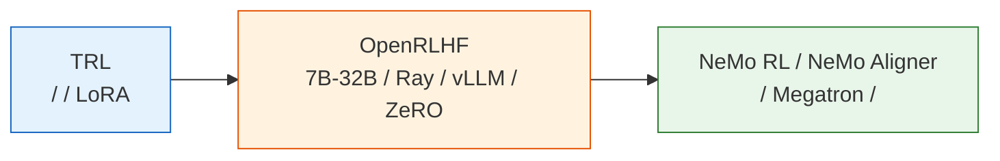
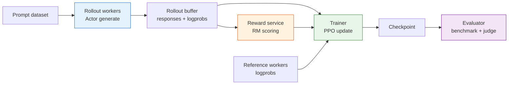

# ：—— RLHF 

## 

****

-  TRL  RLHF 。
-  RLHF ：rollout、、RM 、checkpoint、。
-  TRL， OpenRLHF、NeMo RL / NeMo Aligner 。

****

，RLHF  Python loop：

```text
generate -> reward -> PPO update
```

，：

```text
rollout workers -> reward service -> replay / rollout buffer -> trainer workers -> evaluator
```

 SFT、RM、PPO；。

 TRL ， RLHF 。： 360M、0.5B  7B、32B、70B ，。

：**，**。



## （TRL）

。：

- SFT  base model  assistant。
- Reward Model  chosen/rejected 。
- PPO  Actor、Reference、Reward Model  Critic。
- KL、、reward、。

 `transformers`、`datasets`、`peft`、`trl`、`accelerate`。 `HuggingFaceTB/SmolLM2-360M`、`Qwen/Qwen2.5-0.5B`、`EleutherAI/pythia-410m`  base model。

```text
base checkpoint
  -> SFTTrainer
  -> RewardTrainer
  -> PPOTrainer
  -> evaluation + human/LLM judge
```

， RLHF 。

：

|                             |                            |
| ------------------------------- | ---------------------------------- |
| SFT  base ？    |  prompt  assistant |
| RM  chosen/rejected？ | held-out accuracy  margin    |
| PPO ？                  | reward ，KL      |
| ？                |  checkpoint        |
| badcase ？            |            |

 0.5B ， 7B 。

## （OpenRLHF）

 7B ，“”“rollout ”。PPO-RLHF ， RM ，， generate-train loop 。

OpenRLHF ：

|          |  TRL      |  OpenRLHF               |
| ------------ | --------------- | --------------------------------- |
| Rollout  |  `generate` |  vLLM / Ray         |
|      | LoRA      | ZeRO、、          |
|    |     | Actor、RM、Critic、Ref  |
|        | Python loop     |  rollout buffer       |
|          |         | 、checkpoint、    |

 SFT、RM、PPO；。

 PPO-RLHF ：



 rollout 。Rollout ，、KV cache、 batching；PPO update ，、、optimizer state。 loop，，。

### Rollout 

；PPO-RLHF 。：

```text
Actor 
  -> Reference  log-prob
  -> Reward Model 
  -> Critic  value
  -> PPO 
```

 Actor ， token  token ；RM  Reference 。，。

：

|                    |                          |
| ---------------------- | -------------------------------- |
| vLLM /       |  rollout                 |
| Ray /        |  Actor、RM、Critic、Ref  |
| ZeRO / FSDP / Megatron |                  |
| Rollout buffer         |                    |
|                |                      |

## （NeMo）

70B ，，、、。NVIDIA NeMo RL / NeMo Aligner ：、Megatron/FSDP、 checkpoint、、、。

 RLHF  PPO ，：

- ****：Actor、Reference、Reward Model、Critic 。
- ****：rollout ，PPO update ，。
- ****：RM ，。
- **KL **：，，。
- **checkpoint **：，Actor、Critic、optimizer、scheduler、rollout 。
- ****： checkpoint  benchmark、。

### 

 PPO-RLHF ：

|          |  |                                |
| ------------ | ------------ | -------------------------------------- |
| Actor        |          | ，                 |
| Critic       |          |  Actor  backbone， |
| Reference    |        | ， log-prob              |
| Reward Model |        | ，             |

“ 7B ” 7B。 Reference  RM ，。，：

- Actor  Critic ， value head。
- Reference ， offload。
- RM 。
- Rollout  PPO update  GPU，。

，。

## 

|          |                                   |
| ------------------ | ------------------------------------------------- |
| `SFTTrainer`       |  SFT， LoRA、FSDP、ZeRO  Megatron |
| `RewardTrainer`    |  RM ， RM accuracy / margin     |
| `PPOTrainer`       | Actor-RM-Critic-Ref  PPO                |
|  JSON  | 、、、        |
|  judge prompt  |  judge、 rubric、                   |
|        |  benchmark、A/B test、、          |

：，。 artifact ，。

“”：

|         |                          |
| ----------------- | -------------------------------------- |
| `reward_mean`     | 、、 reward  |
| `kl_mean`         | / token/ KL            |
| `response_length` | 、、EOS                |
| `eval_win_rate`   |  judge、 A/B、           |
|           | SwanLab/W&B/               |
|  checkpoint   |  checkpoint +            |

## 

|     |                                            |
| ------- | -------------------------------------------------- |
| 135M-1B | TRL，                                  |
| 1B-7B   | TRL + Accelerate / DeepSpeed， LoRA      |
| 7B-32B  | OpenRLHF， rollout             |
| 70B+    | NeMo RL / NeMo Aligner， |

。 SFT、RM、PPO ， 7B/70B ，。

：

|                      |                             |
| -------------------------------- | --------------------------------------- |
| SFT loss                     | ，、mask、            |
| RM                     | ， RM             |
| PPO KL                       | ， beta、、reward scale |
|  Actor + Critic    | ， LoRA、ZeRO、FSDP             |
| rollout ，GPU  | ， vLLM / OpenRLHF              |
|              | ， checkpoint     |

，。

## 

，：

|        |                                                     |
| ------------ | ------------------------------------------------------- |
|      | SFT、RM、PPO prompt、eval set ？            |
|      | Actor、Reference、RM、Critic ？       |
| RM       | reward mean/std ，？              |
| KL       | target KL  beta ？                  |
| Rollout  | temperature、top_p、max length ？               |
|      | checkpoint  optimizer、scheduler、global step？ |
|      | ？                              |
|      |  reward、 KL、？                |

， RLHF “”。

## 

 RLHF ：base model  SFT， RM， PPO ， reward hacking 。，。

， 8  RLHF 。：，？ DPO、GRPO、RLVR  post-training ——[](../chapter09_alignment/intro)。

 9 ，：， reward hacking ，——[：Reward Hacking ](./extended-practice)。

## 

1.  RLHF ， Actor、Reference、RM、Critic  GPU 。
2.  rollout ， PPO update 。
3.  0.5B TRL  7B OpenRLHF 。
