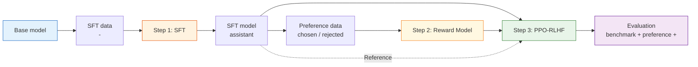

# 8.2  RLHF 

## 

****

-  InstructGPT  RLHF ：SFT、Reward Model、PPO。
- 、、。
-  artifact ：、、。

****

$$
\mathcal{L}_{SFT} = -\mathbb{E}_{(x,y)\sim \mathcal{D}_{SFT}}\left[\log \pi_\theta(y\mid x)\right]
\quad \text{（SFT：）}
$$

$$
\mathcal{L}_{RM} = -\mathbb{E}_{(x,y_w,y_l)\sim \mathcal{D}_{pref}}
\left[\log \sigma(r_\phi(x,y_w)-r_\phi(x,y_l))\right]
\quad \text{（RM：）}
$$

$$
\max_\theta\ \mathbb{E}_{y\sim \pi_\theta(\cdot\mid x)}
\left[r_\phi(x,y) - \beta D_{KL}(\pi_\theta(\cdot\mid x)\|\pi_{ref}(\cdot\mid x))\right]
\quad \text{（PPO-RLHF：，）}
$$

> ****
>
> RLHF ， artifact ：、、。

 OpenAI InstructGPT： SFT， Reward Model， PPO  RLHF。， DPO、GRPO、RLVR 。



## 

。 prompt：

```text
 PPO  clip ratio ，。
```

 RLHF  prompt ：

1. **SFT **：，“”。
2. **RM **： prompt ， judge 。
3. **PPO **：， RM ， PPO 。

：

```json
{
  "sft_item": {
    "prompt": " PPO  clip ratio ，。",
    "response": "clip ratio ..."
  },
  "preference_item": {
    "prompt": " PPO  clip ratio ，。",
    "chosen": "clip ratio ，...",
    "rejected": "PPO ，，。"
  },
  "ppo_prompt_item": {
    "prompt": " PPO  clip ratio ，。"
  }
}
```

 prompt  SFT、 PPO rollout ，： prompt 。

## 

|      |                        |                           |                             |                 |
| -------- | -------------------------- | ----------------------------- | ----------------------------------- | ------------------------- |
| SFT      | -              |  assistant  | SFT loss、、        |         |
| RM       | chosen/rejected      |  Reward Model   | held-out accuracy、margin、 | 、  |
| PPO-RLHF | SFT model + RM + prompt  |             | 、KL、、 benchmark  | reward  |

：SFT  RM “”， RLHF 。SFT ， PPO ；RM ，PPO 。

## Step 0： base checkpoint

RLHF 。 base model， artifact：

```text
artifacts/
  base/
    model_name.txt
    tokenizer_config.json
    generation_probe.jsonl
```

 base model ：

|    |                                    |              |
| ------ | -------------------------------------- | ------------------------ |
|  | ？ | 360M  0.5B             |
|    | ？               |  Qwen  |
|  | ？                   |  model card          |

，****： prompt 。， SFT  RLHF 。

## Step 1：SFT 

SFT 。 prompt $x$  $y$，：

$$
\mathcal{L}_{SFT} = -\sum_{t=1}^{T}\log \pi_\theta(y_t \mid x, y_{<t})
$$

：

> ， token。

SFT ：

```json
{
  "messages": [
    { "role": "system", "content": "、、。" },
    { "role": "user", "content": "。" },
    {
      "role": "assistant",
      "content": "，。"
    }
  ],
  "source": "human_written",
  "quality": "verified"
}
```

SFT  **loss mask**： assistant  token  loss， system  user 。，。

## Step 2：Reward Model 

RM “”，“”。：

```json
{
  "prompt": " PPO  KL 。",
  "chosen": "KL ，。",
  "rejected": "KL ，PPO ，。",
  "labeler": "human_or_judge",
  "rubric": ["accuracy", "helpfulness", "clarity"]
}
```

RM  $r_\phi(x,y)$。 chosen  rejected ，：

$$
r_\phi(x,y_w) > r_\phi(x,y_l)
$$

Bradley-Terry ：

$$
\mathcal{L}_{RM} =
-\log \sigma(r_\phi(x,y_w)-r_\phi(x,y_l))
$$

： chosen  rejected ，$\sigma$  1，loss ； RM ，loss 。

RM  accuracy， margin：

$$
\text{margin} = r_\phi(x,y_w)-r_\phi(x,y_l)
$$

accuracy ，margin 。 RM  70% ， chosen  rejected ；PPO 。

## Step 3：PPO 

PPO ：

|          |               |  |                   |
| ------------ | ----------------- | -------- | --------------------- |
| Actor        | SFT model         |        | ， PPO  |
| Reference    |  SFT model    |        |  KL           |
| Reward Model | RM        |        |         |
| Critic       |  Actor  |        |  value，  |

：

$$
R_{total}(x,y)
= r_\phi(x,y)
- \beta D_{KL}(\pi_\theta(\cdot\mid x)\|\pi_{ref}(\cdot\mid x))
$$

 RLHF ：

- RM  Actor ；
- Reference  Actor  SFT ；
- PPO 。

 KL ，Actor  RM ； KL ，Actor 。

## 

 RLHF  H  human feedback，：

|              |                          |                    |
| ---------------- | ---------------------------- | ---------------------- |
|          | 、     | 、、     |
| AI Judge / RLAIF | 、       |  judge         |
|          | 、、 |  |
|          | 、、、     | ，       |

 human preference ， AI Judge、。 InstructGPT ，。

## RLAIF、CAI  Self-Play

RLAIF、CAI  Self-Play ，：**，**。

|                |        |                        |                  |
| ------------------ | ---------------------- | -------------------------- | -------------------------- |
| RLAIF              |  / RM  |    | 、judge  |
| Constitutional AI  |  chosen/rejected   | 、   | 、     |
| Self-Play / Debate |      |    | 、   |
| Self-Rewarding     |            | 、、 |  RM  |

“”，** AI ，**。 AI Judge，judge 、，。

 RLAIF judge prompt ：

```python
rlaif_judge_prompt = """
。。

：
1. ：，
2. ：
3. ：，
4. ：、

：
{prompt}

 A：
{response_a}

 B：
{response_b}

 JSON：
{{"winner": "A"  "B"  "tie", "reason": ""}}
"""
```

 judge ，：

1. A/B 。
2.  judge ， winner。
3. 。
4. ， judge。

## 

， SFT、RM、PPO ：

```text

  ->  badcase、、
  ->  SFT / preference 
  ->  SFT  RM
  -> PPO-RLHF 
  -> 
```

、、。：， SFT/RM/PPO，。

，，“”。

|    |                        |                                     |
| ---------- | ------------------------------ | ------------------------------------------- |
|    | 、、、 | 、、、    |
|    |        |  pass@k  judge // |
|  | chosen  rejected   |  judge 、                     |
|    |            |  benchmark + badcase                |

## 

， artifact ：

```text
experiments/rlhf-smollm/
  data/
    sft_train.jsonl
    pref_train.jsonl
    prompts_ppo.jsonl
    eval_prompts.jsonl
  models/
    base.txt
    sft/
    reward_model/
    rlhf/
  reports/
    base_probe.md
    sft_eval.json
    rm_eval.json
    ppo_train_metrics.jsonl
    final_eval.md
```

。RLHF ：

-  PPO  RM？
-  RM ？
- ？
-  checkpoint ？

 artifact ，。

## 

|  |           |                        |                    |
| ---- | ----------------- | -------------------------- | ---------------------------- |
| Base |       |      | base probe               |
| SFT  |     |      | SFT              |
| RM   |         |  chosen  | reward-length          |
| PPO  | reward  | Actor  RM          |  reward            |
| Eval |         | judge        | 、A/B 、 |

## 

 RLHF ：

1. SFT  base model  assistant 。
2. Reward Model 。
3. PPO  KL 。

 RLHF ， artifact 、。：SFT ，、——[SFT：](./imitation-learning-pipeline)。

## 

1.  `sft_item`  `preference_item`， prompt ，。
2.  RM accuracy  PPO 。
3.  Reference model  PPO-RLHF 。
