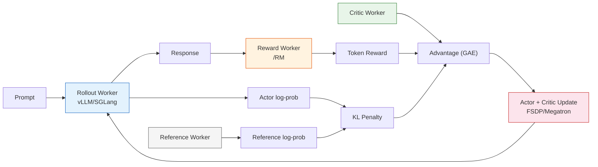

# 8.7 ： veRL  GSM8K  PPO 

8.5  PPO-RLHF ——Actor、Reference、Reward Model、Critic ， KL 、token-level reward、advantage 。： [veRL](https://github.com/volcengine/verl)， GSM8K  PPO 。

；veRL 。 7  Stable Baselines3  PPO——，、、。

## veRL 

[veRL](https://github.com/volcengine/verl)（Volcano Engine Reinforcement Learning） Seed ， LLM RL （GitHub 10k+ stars）， HybridFlow  EuroSys 2025。

 8.5  TRL ，veRL ：

|        | TRL           | veRL                                         |
| ---------- | ----------------------- | -------------------------------------------- |
|    | `model.generate()`  | vLLM / SGLang continuous batching            |
|    |  AdamW              | FSDP / FSDP2 / Megatron-LM                   |
|  | ，        | Ray ，Actor/RM/Critic/Ref  |
|    | LoRA              | ZeRO、、3D-HybridEngine  |
|      |                   | Ray ，                       |
|        | PPO                     | PPO / GRPO / DAPO / RLOO / ReMax  10+    |
|    | Reward Model            | Reward Model + （verifiable reward） |

veRL ****： RL （rollout）、（update）、（reward） worker， Ray  GPU 。 0.5B ， 70B+ 。



##  GSM8K

[GSM8K](https://huggingface.co/datasets/openai/gsm8k)（Grade School Math 8K） OpenAI ， 7,500  1,319 。 RL for LLM  benchmark ：

1. ****——， Reward Model。 8.5  RLHF ： RM ，。
2. ****—— 50~200 token，， PPO  token-level advantage 。
3. ****—— VKE  Qwen2.5-0.5B PPO （42.08% → 54.89%），。

 SOTA ， PPO ： →  →  →  → 。

## 

### 

** GPU**（24GB ， RTX 3090 / 4090 / A5000）：

|               |  |     |        |
| ----------------- | ------ | ----------- | -------------- |
| Qwen/Qwen2.5-0.5B | 0.5B   |     | ~16 GB（） |
| Qwen/Qwen2.5-0.5B | 0.5B   |  + vLLM | ~18 GB（） |
| Qwen/Qwen2.5-1.5B | 1.5B   |     | ~22 GB（） |
| Qwen/Qwen2.5-1.5B | 1.5B   | LoRA + vLLM | ~20 GB（） |

PPO-RLHF  Actor、Critic（） Reference、Reward（）， SFT 。0.5B  + 。

###  veRL

 conda  + pip ：

```bash
# 
conda create -n verl python==3.10 -y
conda activate verl

#  PyTorch（CUDA 12.x）
pip install torch torchvision --index-url https://download.pytorch.org/whl/cu121

#  veRL
git clone https://github.com/volcengine/verl.git
cd verl
pip install -e .

#  vLLM（）
pip install vllm==0.8.3

#  Flash Attention
pip install flash-attn --no-build-isolation
```

，：

```bash
python -c "import verl; print(verl.__version__)"
python -c "import vllm; print(vllm.__version__)"
```

::: details 

**Flash Attention **： CUDA toolkit  GCC。，——veRL  PyTorch  attention，。

**vLLM **：veRL  vLLM >= 0.8.2。 `ImportError: cannot import name 'ForkingPickler'`， `tensordict`  0.6.2：`pip install tensordict==0.6.2`。
:::

### 

veRL  GSM8K ，：

```bash
#  veRL  GSM8K
python3 examples/data_preprocess/gsm8k.py --local_dir ~/data/gsm8k
```

 GSM8K ， `####`  `ground_truth`， veRL  parquet 。 `~/data/gsm8k/`  `train.parquet`  `test.parquet` 。

::: details parquet 

，parquet ：

```json
{
  "prompt": "Natalia sold clips to 48 of her friends in April, and then she sold half as many clips in May. How many clips did Natalia sell altogether in April and May?",
  "reward_model": { "ground_truth": "72" },
  "data_source": "openai/gsm8k"
}
```

- **`prompt`**：，PPO  Actor 
- **`reward_model`**：，`ground_truth` ，reward function 
- **`data_source`**：，

：

```python
from datasets import load_dataset

ds = load_dataset("openai/gsm8k", "main")
for split in ["train", "test"]:
    df = ds[split].to_pandas()
    df = df.rename(columns={"question": "prompt", "answer": "reward_model"})
    df["reward_model"] = df["reward_model"].apply(
        lambda x: {"ground_truth": x.split("####")[-1].strip()}
    )
    df["data_source"] = "openai/gsm8k"
    df.to_parquet(f"~/data/gsm8k/{split}.parquet")
```

 veRL —— veRL ，。
:::

## Reward 

GSM8K  reward  Reward Model——。 8.5  RLHF ：RLHF  RM ，****（verifiable reward）。9.4  RLVR ，。

：[`code/chapter08_rlhf/verl_gsm8k/gsm8k_reward.py`](../../../code/chapter08_rlhf/verl_gsm8k/gsm8k_reward.py)。 veRL ，：

```python
# gsm8k_reward.py

import re
from typing import Any

REWARD_NAME = "gsm8k"
REWARD_TYPE = "sequential"


def extract_answer(response: str) -> str | None:
    """。

     \\boxed{}  <answer> 。
    """
    #  \\boxed{...}
    boxed = re.findall(r"\\boxed\{([^}]+)\}", response)
    if boxed:
        return boxed[-1].strip()

    #  <answer>...</answer>
    ans = re.search(r"<answer>(.*?)</answer>", response, re.DOTALL)
    if ans:
        return ans.group(1).strip()

    # 
    lines = response.strip().split("\n")
    for line in reversed(lines):
        nums = re.findall(r"-?\d+\.?\d*", line)
        if nums:
            return nums[-1]

    return None


def check_answer(predicted: str | None, ground_truth: str) -> float:
    """。"""
    if predicted is None:
        return 0.0
    try:
        # ，
        pred_val = float(predicted.replace(",", ""))
        gt_val = float(ground_truth.replace(",", ""))
        return 1.0 if abs(pred_val - gt_val) < 1e-6 else 0.0
    except (ValueError, TypeError):
        return 1.0 if predicted.strip() == ground_truth.strip() else 0.0


def compute_score(reward_input: dict[str, Any], **kwargs) -> dict[str, float]:
    """ reward 。veRL  reward_input 。"""
    response = reward_input["response"]
    ground_truth = reward_input["ground_truth"]

    predicted = extract_answer(response)
    accuracy = check_answer(predicted, ground_truth)

    return {
        "overall": accuracy,
        "accuracy": accuracy,
        "format": 1.0 if predicted is not None else 0.0,
    }
```

 reward ：

- **`extract_answer`**：。 `\\boxed{}` （）、`<answer>` （prompt ），""。
- **`check_answer`**：。`1,000`  `1000` ，`42`  `42.0` 。
- **`compute_score`**： `overall`（PPO ）（`accuracy`  `format`），。

 Reward Model？ GSM8K ****—— 1.0， 0.0。（ 0/1），、、 hack 。 9.4  RLVR 。

## 

 veRL  PPO ， + 0.5B ：[`code/chapter08_rlhf/verl_gsm8k/run_qwen2_5_0_5b_ppo_single_gpu.sh`](../../../code/chapter08_rlhf/verl_gsm8k/run_qwen2_5_0_5b_ppo_single_gpu.sh)。：

```bash
#!/bin/bash
# run_qwen2.5_0.5b_ppo_single_gpu.sh
# PPO | GSM8K |  | Qwen2.5-0.5B-Instruct

set -xeuo pipefail

# ====================  ====================
MODEL_PATH=${MODEL_PATH:-Qwen/Qwen2.5-0.5B-Instruct}
CRITIC_MODEL_PATH=${CRITIC_MODEL_PATH:-$MODEL_PATH}  # Critic 

# 
NNODES=${NNODES:-1}
NDEVICES_PER_NODE=${NDEVICES_PER_NODE:-1}

# （）
TRAIN_BATCH_SIZE=${TRAIN_BATCH_SIZE:-128}      #  rollout  prompt 
PPO_MINI_BATCH_SIZE=${PPO_MINI_BATCH_SIZE:-64}  # PPO  mini-batch
MAX_PROMPT_LENGTH=${MAX_PROMPT_LENGTH:-512}     # prompt 
MAX_RESPONSE_LENGTH=${MAX_RESPONSE_LENGTH:-256}  # 

# 
ACTOR_LR=${ACTOR_LR:-1e-6}
CRITIC_LR=${CRITIC_LR:-1e-5}

# 
ROLLOUT_TP=${ROLLOUT_TP:-1}                     # （=1）
ROLLOUT_GPU_MEM_UTIL=${ROLLOUT_GPU_MEM_UTIL:-0.4}  # vLLM 
ROLLOUT_N=${ROLLOUT_N:-1}                       #  prompt 

# 
TOTAL_EPOCHS=${TOTAL_EPOCHS:-20}
SAVE_FREQ=${SAVE_FREQ:-20}
TEST_FREQ=${TEST_FREQ:-5}

# 
GSM8K_TRAIN_FILE=${GSM8K_TRAIN_FILE:-$HOME/data/gsm8k/train.parquet}
GSM8K_TEST_FILE=${GSM8K_TEST_FILE:-$HOME/data/gsm8k/test.parquet}

# 
EXPERIMENT_NAME=${EXPERIMENT_NAME:-qwen2.5_0.5b_ppo_gsm8k_$(date +%Y%m%d_%H%M)}
# ====================  ====================

# ----  ----
DATA=(
    algorithm.adv_estimator=gae
    data.train_files="['$GSM8K_TRAIN_FILE']"
    data.val_files="['$GSM8K_TEST_FILE']"
    data.train_batch_size=${TRAIN_BATCH_SIZE}
    data.max_prompt_length=${MAX_PROMPT_LENGTH}
    data.max_response_length=${MAX_RESPONSE_LENGTH}
    data.filter_overlong_prompts=True
)

# ----  ----
MODEL=(
    actor_rollout_ref.model.path="$MODEL_PATH"
    actor_rollout_ref.model.use_remove_padding=True
    actor_rollout_ref.model.enable_gradient_checkpointing=True
)

# ---- Actor  ----
ACTOR=(
    actor_rollout_ref.actor.optim.lr=${ACTOR_LR}
    actor_rollout_ref.actor.ppo_mini_batch_size=${PPO_MINI_BATCH_SIZE}
    actor_rollout_ref.actor.use_dynamic_bsz=True
    actor_rollout_ref.actor.ppo_max_token_len_per_gpu=16384
    actor_rollout_ref.actor.entropy_coeff=0
    actor_rollout_ref.actor.clip_ratio=0.2
    actor_rollout_ref.actor.fsdp_config.param_offload=False
    actor_rollout_ref.actor.fsdp_config.optimizer_offload=False
)

# ---- Rollout  ----
ROLLOUT=(
    actor_rollout_ref.rollout.name=vllm
    actor_rollout_ref.rollout.tensor_model_parallel_size=${ROLLOUT_TP}
    actor_rollout_ref.rollout.gpu_memory_utilization=${ROLLOUT_GPU_MEM_UTIL}
    actor_rollout_ref.rollout.n=${ROLLOUT_N}
    actor_rollout_ref.rollout.log_prob_use_dynamic_bsz=True
    actor_rollout_ref.rollout.log_prob_max_token_len_per_gpu=16384
)

# ---- Reference  ----
REF=(
    actor_rollout_ref.ref.log_prob_use_dynamic_bsz=True
    actor_rollout_ref.ref.log_prob_max_token_len_per_gpu=16384
    actor_rollout_ref.ref.fsdp_config.param_offload=True
)

# ---- Critic  ----
CRITIC=(
    critic.model.path="$CRITIC_MODEL_PATH"
    critic.model.use_remove_padding=True
    critic.model.enable_gradient_checkpointing=True
    critic.optim.lr=${CRITIC_LR}
    critic.use_dynamic_bsz=True
    critic.ppo_max_token_len_per_gpu=16384
    critic.fsdp.param_offload=False
    critic.fsdp.optimizer_offload=False
)

# ---- Trainer  ----
TRAINER=(
    trainer.balance_batch=True
    trainer.critic_warmup=0
    trainer.logger='["console","wandb"]'
    trainer.project_name=verl_ppo_gsm8k
    trainer.experiment_name=${EXPERIMENT_NAME}
    trainer.n_gpus_per_node=${NDEVICES_PER_NODE}
    trainer.nnodes=${NNODES}
    trainer.save_freq=${SAVE_FREQ}
    trainer.test_freq=${TEST_FREQ}
    trainer.total_epochs=${TOTAL_EPOCHS}
)

# ----  ----
python3 -m verl.trainer.main_ppo \
    "${DATA[@]}" \
    "${MODEL[@]}" \
    "${ACTOR[@]}" \
    "${ROLLOUT[@]}" \
    "${REF[@]}" \
    "${CRITIC[@]}" \
    "${TRAINER[@]}" \
    "$@"
```

### 

，：

**1. ：`TRAIN_BATCH_SIZE=128, PPO_MINI_BATCH_SIZE=64`**

 PPO  128  prompt ， 2  mini-batch（128/64）。 2  × 2 GPU  `train_batch_size=256`，。（A100 80GB）， batch size  256，。

**2. ：`MAX_PROMPT_LENGTH=512, MAX_RESPONSE_LENGTH=256`**

GSM8K  50~150 token， 50~200 token。 `max_response_length=256`， GSM8K 。——。

**3. ：`ROLLOUT_GPU_MEM_UTIL=0.4`**

vLLM  KV cache 。 vLLM ， vLLM  40% 。 OOM， 0.3。

**4. Critic  > Actor ：`ACTOR_LR=1e-6, CRITIC_LR=1e-5`**

 PPO-RLHF 。Critic  value function（ advantage ）， Actor 。Actor ，， PPO clip  KL 。

###  8.5 

 8.5 ， veRL ：

| 8.5  | veRL                        |                                |
| ---------- | ------------------------------- | ---------------------------------- |
| Actor      | `actor_rollout_ref.actor.*`     | ，         |
| Reference  | `actor_rollout_ref.ref.*`       |  SFT ， KL       |
| Critic     | `critic.*`                      | ，GAE  advantage |
| RM/Reward  | `gsm8k_reward.py:compute_score` | （GSM8K  RM）    |
| KL     |  KL reward penalty          |  Actor  Reference          |
| PPO clip   | `actor.clip_ratio=0.2`          |                    |
| GAE        | `algorithm.adv_estimator=gae`   | advantage                  |

：** reward**（） 8.5  **Reward Model**。 RM，。 reward  0/1 （""），，0/1 。

## 

### ：

```bash
# 
chmod +x run_qwen2.5_0.5b_ppo_single_gpu.sh

# 
bash run_qwen2.5_0.5b_ppo_single_gpu.sh
```

### ：

veRL ，：

```bash
#  1.5B 
MODEL_PATH=Qwen/Qwen2.5-1.5B-Instruct \
TRAIN_BATCH_SIZE=64 \
PPO_MINI_BATCH_SIZE=16 \
bash run_qwen2.5_0.5b_ppo_single_gpu.sh
```

```bash
#  batch size 
TRAIN_BATCH_SIZE=64 \
PPO_MINI_BATCH_SIZE=16 \
ROLLOUT_GPU_MEM_UTIL=0.4 \
bash run_qwen2.5_0.5b_ppo_single_gpu.sh
```

Ray  `main_ppo` —— Ray 。， worker（actor、critic、rollout、ref、reward） GPU ， 3D-HybridEngine ，。

### 

，：

```
[Step 1]  train | reward/overall=0.05 | reward/accuracy=0.05 | kl=0.000 | actor_loss=0.82 | critic_loss=2.41
[Step 5]  val   | reward/overall=0.12 | reward/accuracy=0.12
[Step 6]  train | reward/overall=0.18 | reward/accuracy=0.18 | kl=0.002 | actor_loss=0.67 | critic_loss=1.89
[Step 10] val   | reward/overall=0.31 | reward/accuracy=0.31
...
```

 WandB，， WandB dashboard 。

## 

PPO-RLHF "reward "。8.5 ：

### 

|               |                |               |
| ----------------- | ---------------------- | --------------------- |
| `reward/accuracy` |                |     |
| `kl`              | ， |     |
| `actor_loss`      |  0.5~1.0     |  >10  NaN |
| `critic_loss`     |      |             |
| `response_length` |          |  reward     |
| `entropy`         |                |  0        |

### GSM8K 

** 1：（step 1~10）**。`accuracy`  5%~15% ，。`kl`  0， reference。`critic_loss` ——Critic  value function。

** 2：（step 10~40）**。`accuracy` ， 30%~50%。`kl`  0.01~0.05 。 PPO ——Actor  reference 。

** 3：（step 40+）**。`accuracy` ，。 0.5B —— RL ，。

###  veRL  baseline 

 VKE （2  × 2 × NVIDIA L20） veRL  20  epoch（580 steps） PPO ， [EvalScope](https://github.com/modelscope/evalscope) ：

|                                    |           | GSM8K  |
| -------------------------------------- | ------------- | ------------ |
| Qwen2.5-0.5B-Instruct（）          |     | 42.08%       |
| Qwen2.5-0.5B-Instruct + PPO（step580） | veRL PPO  | 54.89%       |

 42.08%  54.89%，PPO  0.5B  **12.8 **。""， PPO —— reward ，、、""。。

> ****： VKE （2  × 2 × NVIDIA L20，`train_batch_size=256`）。 batch size  128，（、 accuracy），。

## 

， checkpoint ， PPO 。 [EvalScope](https://github.com/modelscope/evalscope)（） GSM8K  zero-shot ：

```bash
#  EvalScope
pip install evalscope

#  GSM8K 
evalscope eval \
    --model /path/to/merged_model \
    --datasets gsm8k
```

：

- ** test **： GSM8K  test split（1319 ），，。
- ** baseline**： RL  SFT （ `Qwen/Qwen2.5-0.5B-Instruct`）， PPO 。
- ****：，——PPO 、。

### Checkpoint 

veRL  checkpoint  Actor  Critic （FSDP ）。 veRL  HuggingFace ：

```bash
#  FSDP  HF 
python scripts/model_merger.py merge \
    --backend fsdp \
    --local_dir /path/to/checkpoints/global_step_580/actor \
    --target_dir ./merged_model
```

 transformers ：

```python
from transformers import AutoModelForCausalLM

model = AutoModelForCausalLM.from_pretrained("./merged_model")
```

## veRL 

， veRL 。 Hydra override ，：

```mermaid
flowchart TD
    Entry["python3 -m verl.trainer.main_ppo"] --> Data["data\n"]
    Entry --> Model["actor_rollout_ref.model\n"]
    Entry --> Actor["actor_rollout_ref.actor\nActor "]
    Entry --> Rollout["actor_rollout_ref.rollout\n"]
    Entry --> Ref["actor_rollout_ref.ref\nReference "]
    Entry --> Critic["critic\nCritic "]
    Entry --> Trainer["trainer\n"]

    Data --> D1["train_files, val_files"]
    Data --> D2["train_batch_size"]
    Data --> D3["max_prompt/response_length"]

    Actor --> A1["optim.lr, clip_ratio"]
    Actor --> A2["ppo_mini_batch_size"]
    Actor --> A3["fsdp_config"]

    Rollout --> R1["name (vllm/sglang)"]
    Rollout --> R2["tensor_model_parallel_size"]
    Rollout --> R3["gpu_memory_utilization"]

    Critic --> C1["model.path, optim.lr"]
    Critic --> C2["ppo_max_token_len_per_gpu"]

    Trainer --> T1["total_epochs, save_freq"]
    Trainer --> T2["logger (wandb/console)"]
    Trainer --> T3["n_gpus_per_node, nnodes"]

    style Entry fill:#e3f2fd,stroke:#1565c0
    style Data fill:#fff3e0,stroke:#e65100
    style Actor fill:#e8f5e9,stroke:#2e7d32
    style Critic fill:#f3e5f5,stroke:#6a1b9a
    style Rollout fill:#e1f5fe,stroke:#0277bd
```



（ `actor_rollout_ref.actor.optim.lr=1e-6`） Hydra  OmegaConf 。 YAML ，。

::: details 

，：

```bash
# 8 
NNODES=1 NDEVICES_PER_NODE=8 \
TRAIN_BATCH_SIZE=1024 \
PPO_MINI_BATCH_SIZE=256 \
ROLLOUT_TP=2 \
bash run_qwen2.5_0.5b_ppo_single_gpu.sh
```

|                    |  | 8  |                                  |
| ---------------------- | ---- | ---- | ------------------------------------ |
| `NDEVICES_PER_NODE`    | 1    | 8    | GPU                              |
| `TRAIN_BATCH_SIZE`     | 128  | 1024 |  batch（ FSDP ） |
| `PPO_MINI_BATCH_SIZE`  | 64   | 256  |                                  |
| `ROLLOUT_TP`           | 1    | 2    | vLLM                       |
| `ROLLOUT_GPU_MEM_UTIL` | 0.4  | 0.6  |                |

（、clip_ratio、GAE ）****——，。
:::

## Reward 

 `gsm8k_reward.py`  0/1  accuracy reward。，。：[`code/chapter08_rlhf/verl_gsm8k/gsm8k_reward_advanced.py`](../../../code/chapter08_rlhf/verl_gsm8k/gsm8k_reward_advanced.py)。

```python
# gsm8k_reward_advanced.py

import re
from typing import Any

REWARD_NAME = "gsm8k_advanced"
REWARD_TYPE = "sequential"


def format_reward(response: str) -> float:
    """。

    ：
    1. （）
    2. （ ####  <answer>）
    """
    # （）
    lines = [l.strip() for l in response.strip().split("\n") if l.strip()]
    has_reasoning = len(lines) >= 2

    # 
    has_answer_marker = bool(
        re.search(r"####|\\boxed|<answer>", response)
    )

    score = 0.0
    if has_reasoning:
        score += 0.3
    if has_answer_marker:
        score += 0.2
    return score


def accuracy_reward(response: str, ground_truth: str) -> float:
    """。"""
    #  #### （GSM8K ）
    answer_match = re.search(r"####\s*(.+)", response)
    if answer_match:
        predicted = answer_match.group(1).strip()
    else:
        # ：
        nums = re.findall(r"-?\d+\.?\d*", response)
        predicted = nums[-1] if nums else None

    if predicted is None:
        return 0.0

    try:
        pred_val = float(predicted.replace(",", ""))
        gt_val = float(ground_truth.replace(",", ""))
        return 1.0 if abs(pred_val - gt_val) < 1e-6 else 0.0
    except (ValueError, TypeError):
        return 1.0 if predicted.strip() == ground_truth.strip() else 0.0


def compute_score(reward_input: dict[str, Any], **kwargs) -> dict[str, float]:
    """ reward：accuracy  75%，format  25%。"""
    response = reward_input["response"]
    ground_truth = reward_input["ground_truth"]

    acc = accuracy_reward(response, ground_truth)
    fmt = format_reward(response)

    return {
        "overall": 0.75 * acc + 0.25 * fmt,
        "accuracy": acc,
        "format": fmt,
    }
```

 reward ，—— reward 。veRL  `custom_reward_function.path`  `custom_reward_function.name`  reward 。

### Reward 

|           | `accuracy` | `format` |                                        |
| ----------------- | ---------- | -------- | ------------------------------------------ |
|  accuracy       | 1.0        | 0.0      |              |
| accuracy + format | 0.75       | 0.25     | ，accuracy         |
| accuracy + format | 0.5        | 0.5      | ， |

****：accuracy  0.7。format reward ， PPO （""），。

## PPO 

 veRL  GSM8K ，：

### ：

```bash
ACTOR_LR=1e-6    # Actor ：1e-7 ~ 5e-6 
CRITIC_LR=1e-5   # Critic ： Actor  5~10 
```

Actor 。（>1e-5） KL ；（<1e-7） reward 。 `1e-6` 。

### ：KL 

veRL PPO  KL reward penalty。：

```bash
#  override
algorithm.use_kl_in_reward=True
algorithm.kl_ctrl.kl_coef=0.001
algorithm.kl_ctrl.type=fixed
```

`kl_coef` KL 。8.5  $\beta$ ：， reward hacking。GSM8K  reward  0/1 （ hack），KL 。

### ：PPO 

```bash
actor_rollout_ref.actor.ppo_epochs=1       #  rollout  1 
actor_rollout_ref.actor.clip_ratio=0.2     # 
```

`ppo_epochs=1`  on-policy RL 。PPO ，`ppo_epochs` ""， rollout 。

### 

|                          |               |                             |
| ---------------------------- | --------------------- | ------------------------------- |
| Loss  NaN                  |  /  |  `ACTOR_LR`，   |
| accuracy  0              |  KL   |  `ACTOR_LR`， `kl_coef` |
| KL                   |  reference    |  `kl_coef`， `ACTOR_LR` |
|  accuracy  |  hack             |  reward       |
|                  | vLLM          |  `ROLLOUT_GPU_MEM_UTIL`     |

##  8.5 

 veRL  PPO ， 8.5  PPO-RLHF ，：

**1. Reward **：8.5  Reward Model （，），（0/1 ，）。 RLVR ——9.4 。

**2. **：8.5  TRL ，。veRL  Ray + FSDP  Actor/Critic（） Reference/Reward（） GPU ， 3D-HybridEngine ，。

**3. **：TRL  `model.generate()` ，veRL  vLLM  continuous batching， 5~10 。 on-policy RL ，——PPO ，。

， 8.5 ： prompt → Actor  → Reward  → Reference  KL → Critic  advantage → PPO 。 veRL 。

## 

1. ****： `MODEL_PATH`  `Qwen/Qwen2.5-1.5B-Instruct`， accuracy。 accuracy 。
2. ** LoRA**： 24GB  1.5B  3B ， `actor_rollout_ref.actor.lora.rank=16`  LoRA， `param_offload=True` 。
3. ****： `algorithm.adv_estimator`  `gae`（PPO） `grpo`， PPO  GRPO 。GRPO  Critic，，。
4. ****： `NDEVICES_PER_NODE`  `TRAIN_BATCH_SIZE`，、 accuracy 。
5. ** MATH **： `data.train_files`  GSM8K  MATH ，。

## 

 veRL， veRL 。：

|                                                                                                                                               |                           |
| ------------------------------------------------------------------------------------------------------------------------------------------------- | ----------------------------- |
| [`code/chapter08_rlhf/verl_gsm8k/README.md`](../../../code/chapter08_rlhf/verl_gsm8k/README.md)                                                   |  veRL       |
| [`code/chapter08_rlhf/verl_gsm8k/gsm8k_reward.py`](../../../code/chapter08_rlhf/verl_gsm8k/gsm8k_reward.py)                                       |  0/1 accuracy reward      |
| [`code/chapter08_rlhf/verl_gsm8k/gsm8k_reward_advanced.py`](../../../code/chapter08_rlhf/verl_gsm8k/gsm8k_reward_advanced.py)                     | accuracy + format  reward |
| [`code/chapter08_rlhf/verl_gsm8k/run_qwen2_5_0_5b_ppo_single_gpu.sh`](../../../code/chapter08_rlhf/verl_gsm8k/run_qwen2_5_0_5b_ppo_single_gpu.sh) |  0.5B PPO         |
| [`code/chapter08_rlhf/verl_gsm8k/run_qwen2_5_0_5b_ppo_8gpu.sh`](../../../code/chapter08_rlhf/verl_gsm8k/run_qwen2_5_0_5b_ppo_8gpu.sh)             |  8  PPO         |

## 

1.  GSM8K  PPO  reward  0/1 ， 8.5  RLHF  reward ？ PPO ？
2.  `ACTOR_LR`  `1e-6`  `1e-4`，。 8.5 。
3.  `compute_score` ""，。 accuracy ？
4. ：" accuracy reward""accuracy + format reward"， accuracy ？？
5.  veRL  `verl/trainer/main_ppo.py` ， main function ， 8.5 。
