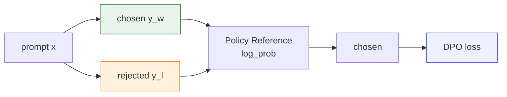
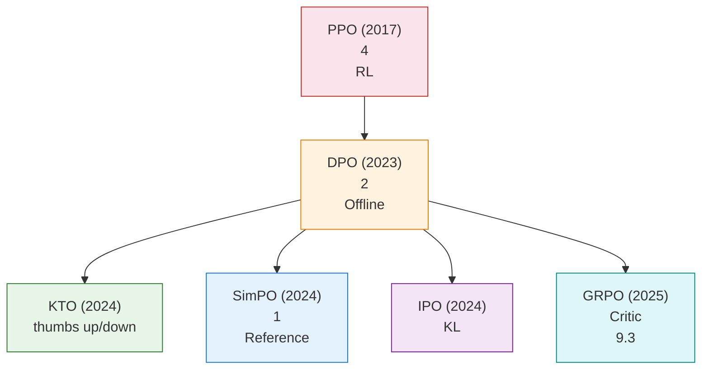

# 9.1 DPO 、

 DPO ， loss、accuracy、reward margin 。， DPO ：**， Reward Model， PPO，？**

DPO（Direct Preference Optimization）。 RLHF  KL ，**""**。 $(x, y_w, y_l)$ ：， RLHF  DPO loss， PyTorch 。



：**DPO ， loss。DPO **—— $\pi_\theta(y \mid x)$，""，""。 PPO ：**PPO ，；DPO ，""**。 DPO loss， loss  DPO 。

## 

， DPO 。。

### 

DPO ，****：

$$
(x,\;y_w,\;y_l)
$$

：

- $x$：prompt，。
- $y_w$：winner / chosen，。
- $y_l$：loser / rejected，。

 prompt ：

> 。

|  |                                                                                              |
| -------- | ------------------------------------------------------------------------------------------------ |
| chosen   | "，。，。" |
| rejected | "，。"                                                   |

DPO ""，：** prompt ， chosen  rejected ？**  DPO  $y_w$  $y_l$。

：

<DpoCodeFocus focus="data" />

### 

 RL  DPO， RL ：

|  |                                      |
| ------------ | ------------------------------------------------------ |
|  $s_t$   | prompt ， $(x, y_{<t})$        |
|  $a_t$   |  token， $y_t$                     |
|  $\pi$   |  token               |
|  $\tau$  |  prompt                    |
|  $r$     | 、， |

 prompt $x$ ， $y$ 。RLHF ：**，**。

### ：

 $y$ ， token  token 。 $y$  $T$  token ：

$$
y = (y_1, y_2, \ldots, y_T)
$$

：

$$
\pi_\theta(y \mid x) = \prod_{t=1}^{T} \pi_\theta(y_t \mid x, y_{<t})
$$

：

- $\pi_\theta(y \mid x)$： $\theta$ ， prompt $x$  $y$ 。
- $y_t$： $t$  token。
- $y_{<t}$： $t$  token  token。
- $\prod$：， token 。

—— 1 。，：

$$
\log \pi_\theta(y \mid x) = \sum_{t=1}^{T} \log \pi_\theta(y_t \mid x, y_{<t})
$$

 `sequence_logprob` ： token  log probability， token log probability 。

<DpoCodeFocus focus="logprob" />

### 

 DPO 。：

<DpoCodeFocus focus="overview" />

：

|     |                                 |                                   |
| ------- | --------------------------------------- | ----------------------------------------------- |
| **[A]** |                                 | $x$、$y_w$、$y_l$                     |
| **[B]** | `sequence_logprob`                      |  $\log \pi(y \mid x)$ |
| **[C]** | `dpo_forward`                     |  Policy  Reference              |
| **[D]** | `chosen_logratio` / `rejected_logratio` |                         |
| **[E]** | `dpo_logits`                            |                           |
| **[F]** | `-F.logsigmoid(...)`                    | DPO loss                        |
| **[G]** | `train_step`                            |  Policy， Reference           |
| **[H]** | `train_dpo`                             |  batch                      |

## RLHF ：DPO 

DPO ，：** RLHF ， PPO ，""**。

 RLHF ，：

```mermaid
flowchart TD
    subgraph step1 ["： Reward Model"]
        A["\n(y_w, y_l) "] --> B[" RM\n r(x,y)"]
        B --> C[""]
    end

    subgraph step2 ["： PPO "]
        C --> D[""]
        D --> E["Actor: "]
        D --> F["Critic: "]
        D --> G["Reference: KL "]
        D --> H["RM: "]
    end

    subgraph pain [""]
        P1["\n"]
        P2["Reward Hacking\n RM "]
        P3["\n4 "]
    end

    B -.-> P1
    H -.-> P2
    D -.-> P3

    style C fill:#fce4ec,stroke:#c62828
    style P1 fill:#fff3e0,stroke:#f57c00
    style P2 fill:#fff3e0,stroke:#f57c00
    style P3 fill:#fff3e0,stroke:#f57c00
```

### RLHF  KL 

RLHF ：

$$
\max_{\pi_\theta} \; \mathbb{E}_{x \sim \mathcal{D},\, y \sim \pi_\theta} \left[ r(x, y) - \beta \cdot D_{\text{KL}}(\pi_\theta(\cdot \mid x) \| \pi_{\text{ref}}(\cdot \mid x)) \right]
$$

：

- $\max_{\pi_\theta}$： $\pi_\theta$，。
- $x \sim \mathcal{D}$：prompt $x$  $\mathcal{D}$。
- $y \sim \pi_\theta$： $y$  $\pi_\theta$ 。
- $r(x, y)$：。
- $D_{\text{KL}}(\pi_\theta \| \pi_{\text{ref}})$： $\pi_\theta$  $\pi_{\text{ref}}$ 。
- $\beta$：KL 。$\beta$ ，。

KL ：

$$
D_{\text{KL}}(\pi_\theta \| \pi_{\text{ref}}) = \mathbb{E}_{y \sim \pi_\theta} \left[ \log \frac{\pi_\theta(y \mid x)}{\pi_{\text{ref}}(y \mid x)} \right]
$$

：**，，**。KL ，，""。

### DPO 

 RLHF ，PPO  RM  $r(x, y)$、Critic 、Reference  KL——。 DPO  RLHF ，， RLHF  **"simple classification loss"**， fine-tuning 。，DPO  PPO，：** $(x, y_w, y_l)$， RL **。


DPO ， **Policy + Reference + ** ：

<DpoCodeFocus focus="models" />

> ：PPO  Schulman  [Proximal Policy Optimization Algorithms](https://arxiv.org/abs/1707.06347)。DPO  Rafailov  [Direct Preference Optimization](https://arxiv.org/abs/2305.18290)。， KL  RLHF 。

## DPO 

DPO ：**RLHF  KL  $r(x,y)$ **。—— RLHF  $\pi^*$，（ $r$  $\pi$ ）， Bradley-Terry ，$r$ 。

****： $(x, y_w, y_l)$ ，：

1. （RLHF） RM  $r(x,y)$， $\pi_\theta$  $r - \beta D_{\text{KL}}(\pi_\theta \| \pi_{\text{ref}})$；
2. （DPO） $\mathcal{L}_{\text{DPO}} = -\log\sigma\!\left(\beta \log\frac{\pi_\theta(y_w \mid x)}{\pi_{\text{ref}}(y_w \mid x)} - \beta \log\frac{\pi_\theta(y_l \mid x)}{\pi_{\text{ref}}(y_l \mid x)}\right)$。

， $r(x,y)$—— DPO  RM 。

### ：

 prompt $x$。， $\pi(y \mid x)$  $q(y)$。：

$$
\max_q \sum_y q(y)\, r(x, y) - \beta \sum_y q(y) \log \frac{q(y)}{\pi_{\text{ref}}(y \mid x)}
$$

 $q(y)$ ，：

$$
\sum_y q(y) = 1
$$

 $\sum_y q(y) r(x, y)$ ****； KL ，。

" 1"， $\lambda$：

$$
\mathcal{L}(q, \lambda) = \sum_y q(y) r(x, y) - \beta \sum_y q(y) \log \frac{q(y)}{\pi_{\text{ref}}(y \mid x)} + \lambda \left(\sum_y q(y) - 1\right)
$$

 $y$  $q(y)$ ， 0：

$$
\frac{\partial \mathcal{L}}{\partial q(y)} = r(x, y) - \beta \left(\log \frac{q(y)}{\pi_{\text{ref}}(y \mid x)} + 1\right) + \lambda = 0
$$

：

$$
\log \frac{q(y)}{\pi_{\text{ref}}(y \mid x)} = \frac{r(x, y)}{\beta} + \frac{\lambda}{\beta} - 1
$$

：

$$
q(y) = C \cdot \pi_{\text{ref}}(y \mid x) \cdot \exp\left(\frac{r(x, y)}{\beta}\right)
$$

 $C = \exp(\lambda/\beta - 1)$， $y$，。 1， $\frac{1}{Z(x)}$，：

$$
\pi^*(y \mid x) = \frac{1}{Z(x)} \pi_{\text{ref}}(y \mid x) \cdot \exp\left(\frac{r(x, y)}{\beta}\right)
$$

：

$$
Z(x) = \sum_y \pi_{\text{ref}}(y \mid x) \cdot \exp\left(\frac{r(x, y)}{\beta}\right)
$$

$Z(x)$ ：** 1**。，，。

：** $\pi^*$  $r$  $\pi_{\text{ref}}$ **——。

### ：

，——？：

$$
\log \pi^*(y \mid x) = \log \pi_{\text{ref}}(y \mid x) + \frac{r(x, y)}{\beta} - \log Z(x)
$$

$$
r(x, y) = \beta \log \frac{\pi^*(y \mid x)}{\pi_{\text{ref}}(y \mid x)} + \beta \log Z(x)
$$

。：** $y$  $\pi^*$  $\pi_{\text{ref}}$ ，**。

 $Z(x)$  prompt $x$ 。 prompt  $y_w$  $y_l$ ，$\beta \log Z(x)$ ：

$$
\begin{aligned}
r(x, y_w) - r(x, y_l) &= \left[\beta \log \frac{\pi^*(y_w \mid x)}{\pi_{\text{ref}}(y_w \mid x)} + \beta \log Z(x)\right] \\
&\quad - \left[\beta \log \frac{\pi^*(y_l \mid x)}{\pi_{\text{ref}}(y_l \mid x)} + \beta \log Z(x)\right] \\
&= \beta \log \frac{\pi^*(y_w \mid x)}{\pi_{\text{ref}}(y_w \mid x)} - \beta \log \frac{\pi^*(y_l \mid x)}{\pi_{\text{ref}}(y_l \mid x)}
\end{aligned}
$$

 $\beta \log Z(x)$ 。DPO  **chosen  rejected **，。

， $\pi^*$， $\pi_\theta$ 。：

$$
r(x, y) = \beta \log \frac{\pi_\theta(y \mid x)}{\pi_{\text{ref}}(y \mid x)}
$$

 DPO ：****。 RM——。

 Policy  Reference  log probability，：

<DpoCodeFocus focus="ratio" />

### ： Bradley-Terry 

[ RLHF](../chapter08_rlhf/reward-function-design) [ 7  GAE](../chapter07_ppo/gae-reward-model)  Bradley-Terry ：

$$
P(y_w > y_l \mid x) = \sigma\left(r(x, y_w) - r(x, y_l)\right)
$$

 $\sigma$  sigmoid ：

$$
\sigma(z) = \frac{1}{1 + \exp(-z)}
$$

 $z$  $0$  $1$ ，。 $z = r(x, y_w) - r(x, y_l)$： chosen  rejected ，$z > 0$， $P(y_w > y_l \mid x) > 0.5$；， 1。

""：

$$
P(y_w > y_l \mid x) = \sigma\left(\beta \log \frac{\pi_\theta(y_w \mid x)}{\pi_{\text{ref}}(y_w \mid x)} - \beta \log \frac{\pi_\theta(y_l \mid x)}{\pi_{\text{ref}}(y_l \mid x)}\right)
$$

 $r$ ！****。

： $(x, y_w, y_l)$ ，$y_w$  $y_l$ 。。 $\log P(y_w > y_l \mid x)$，""，：

$$
\mathcal{L}_{\text{DPO}} = -\log P(y_w > y_l \mid x)
$$

， DPO ：

$$
\mathcal{L}_{\text{DPO}} = -\mathbb{E}_{(x, y_w, y_l)} \left[ \log \sigma\left(\beta \log \frac{\pi_\theta(y_w \mid x)}{\pi_{\text{ref}}(y_w \mid x)} - \beta \log \frac{\pi_\theta(y_l \mid x)}{\pi_{\text{ref}}(y_l \mid x)}\right) \right]
$$

[ 2 ](../chapter02_dpo/intro) `DPOTrainer` ：

<DpoCodeFocus focus="loss" />

### 

：

|    |       |                                                                                                      |                                 |
| ------ | --------- | -------------------------------------------------------------------------------------------------------- | --------------------------------------------------- |
|  | RLHF  | $\pi^*(y\mid x) = \frac{1}{Z(x)}\pi_{\text{ref}}(y\mid x)\exp(r/\beta)$                                  | ** $r$ **—— |
|  |     | $r(x,y) = \beta\log\frac{\pi^*(y\mid x)}{\pi_{\text{ref}}(y\mid x)} + \beta\log Z(x)$                    | **$r$  $\pi$ **；$Z(x)$   |
|  |  + BT | $\mathcal{L}_{\text{DPO}} = -\log\sigma(\beta\log\frac{\pi_\theta}{\pi_{\text{ref}}}\text{ })$ | **$r$ **； $\pi_\theta$     |

****：" $r_w - r_l$"，BT  $\sigma(r_w - r_l)$  sigmoid ，"chosen "。DPO ， $\beta\log\frac{\pi_\theta}{\pi_{\text{ref}}}$  $y_w$  $y_l$ ——**， Policy/Reference **。 DPO loss ""， RLHF  RM 。

****：DPO  RM，。： → Policy/Reference  log prob →  →  sigmoid →  loss。 DPO  PPO （ Critic  RM）、。

### DPO loss 

：

|                                                                  |              |                                            |
| ------------------------------------------------------------------------ | ---------------- | ---------------------------------------------- |
| $\beta \log \frac{\pi_\theta(y_w \mid x)}{\pi_{\text{ref}}(y_w \mid x)}$ |  | "Policy  Reference " |
| $\beta \log \frac{\pi_\theta(y_l \mid x)}{\pi_{\text{ref}}(y_l \mid x)}$ |  | "Policy  Reference " |
|                                                                  |  | ""                       |
| $\sigma(\cdot)$                                                          |  [0, 1]    | ""                       |
| $-\log \sigma(\cdot)$                                                    |        | ""                         |

：

- `chosen_logps`  $\log \pi_\theta(y_w \mid x)$。
- `rejected_logps`  $\log \pi_\theta(y_l \mid x)$。
- `ref_chosen_logps`  $\log \pi_{\text{ref}}(y_w \mid x)$。
- `ref_rejected_logps`  $\log \pi_{\text{ref}}(y_l \mid x)$。
- `chosen_logratio = chosen_logps - ref_chosen_logps`， $\log \frac{\pi_\theta(y_w \mid x)}{\pi_{\text{ref}}(y_w \mid x)}$。
- `rejected_logratio = rejected_logps - ref_rejected_logps`， $\log \frac{\pi_\theta(y_l \mid x)}{\pi_{\text{ref}}(y_l \mid x)}$。
- `dpo_logits = beta * (chosen_logratio - rejected_logratio)`， sigmoid 。
- `loss = -F.logsigmoid(dpo_logits).mean()`， $\mathcal{L}_{\text{DPO}}$。

### DPO 

```mermaid
flowchart LR
    subgraph inputs ["："]
        X["Prompt x\n''"]
        YW["Chosen y_w\n"]
        YL["Rejected y_l\n"]
    end

    subgraph models [""]
        Policy["Policy Model π_θ\n"]
        Ref["Reference Model π_ref\n"]
    end

    X --> Policy
    X --> Ref
    YW --> Policy
    YW --> Ref
    YL --> Policy
    YL --> Ref

    Policy --> P_w["log π_θ(y_w|x)"]
    Policy --> P_l["log π_θ(y_l|x)"]
    Ref --> R_w["log π_ref(y_w|x)"]
    Ref --> R_l["log π_ref(y_l|x)"]

    P_w --> RW["β · (log π_θ/π_ref)\n"]
    R_w --> RW
    P_l --> RL["β · (log π_θ/π_ref)\n"]
    R_l --> RL

    RW --> Diff["\nr_w - r_l"]
    RL --> Diff
    Diff --> Sigmoid["σ()"]
    Sigmoid --> Loss["DPO Loss = -log σ()\n = "]

    Loss -.->|"\n Policy"| Policy

    style Policy fill:#fff3e0,stroke:#f57c00
    style Ref fill:#e0e0e0,stroke:#9e9e9e
    style RW fill:#e8f5e9,stroke:#2e7d32
    style RL fill:#fce4ec,stroke:#c62828
    style Loss fill:#e3f2fd,stroke:#1976d2
```

：** Policy Model，Reference Model **。 DPO （Policy + Reference）， Reference ， PPO 。

：`loss.backward()`  `policy_model` 。

<DpoCodeFocus focus="train" />

 DPO ：

1.  $(x, y_w, y_l)$。
2. Policy  Reference  chosen / rejected  log probability。
3.  log probability ， Reference  log-ratio。
4. chosen  log-ratio  rejected  log-ratio，。
5.  `logsigmoid`，， loss。

，**DPO " loss"**。；loss  PyTorch 。

##  PPO  DPO：

， DPO  PPO 。" loss "，**、**。

 PPO/RLHF ，：

```python
# PPO / RLHF ：，，
responses = policy_old.generate(prompts)
logps_old = policy_logprob(policy_old, prompts, responses).detach()

rewards = reward_model(prompts, responses)
values = critic(prompts, responses)
advantages = rewards - values

logps_new = policy_logprob(policy, prompts, responses)
ratio = torch.exp(logps_new - logps_old)
policy_loss = -torch.min(
    ratio * advantages,
    torch.clamp(ratio, 1 - clip_eps, 1 + clip_eps) * advantages,
).mean()
```

，：****， **Reward Model **， **Critic **， PPO  `ratio + clip` 。

 DPO，：

```python
# DPO ：，
batch = {
    "prompt": prompt,
    "chosen": chosen_answer,
    "rejected": rejected_answer,
}

chosen_logps = sequence_logprob(policy, prompt, chosen_answer)
rejected_logps = sequence_logprob(policy, prompt, rejected_answer)

ref_chosen_logps = sequence_logprob(reference, prompt, chosen_answer)
ref_rejected_logps = sequence_logprob(reference, prompt, rejected_answer)

chosen_logratio = chosen_logps - ref_chosen_logps
rejected_logratio = rejected_logps - ref_rejected_logps
dpo_loss = -F.logsigmoid(beta * (chosen_logratio - rejected_logratio)).mean()
```

，：

```diff
- responses = policy_old.generate(prompts)
- rewards = reward_model(prompts, responses)
- values = critic(prompts, responses)
- advantages = rewards - values
- loss = ppo_clip_loss(logps_new, logps_old, advantages)

+ chosen_logratio = chosen_logps - ref_chosen_logps
+ rejected_logratio = rejected_logps - ref_rejected_logps
+ loss = -log_sigmoid(beta * (chosen_logratio - rejected_logratio))
```

，DPO "Direct"，**" → RM  → Critic  → PPO "**。。

TRL 。2026-05-01  Hugging Face TRL main ， [`DPOTrainer`](https://github.com/huggingface/trl/blob/main/trl/trainer/dpo_trainer.py) ：

1.  `DataCollatorForPreference`  `prompt_ids`、`chosen_ids`、`rejected_ids`。 batch  chosen， rejected。
2. Reference  `ref_chosen_logps`、`ref_rejected_logps`， reference model 。
3.  `chosen_logratios`  `rejected_logratios`，， sigmoid  `-logsigmoid`。

 [`PPOTrainer`](https://github.com/huggingface/trl/blob/main/trl/experimental/ppo/ppo_trainer.py)，：PPOTrainer  `policy model`、`ref_model`、`reward_model`、`value_model`； `generate`， reward  value， advantage。DPOTrainer  **Policy、Reference **。

## 

 $r(x, y) = \beta \log \frac{\pi_\theta(y \mid x)}{\pi_{\text{ref}}(y \mid x)}$ ——** Policy **。 RM， Policy  Reference  log-ratio ：

```python
# ==========================================
#  DPO 
# ==========================================
import torch

def implicit_reward(policy_model, ref_model, tokenizer, prompt, response, beta=0.1):
    """
     DPO ：r(x,y) = β * log(π_θ(y|x) / π_ref(y|x))
    """
    #  prompt  response
    text = prompt + response
    inputs = tokenizer(text, return_tensors="pt")

    #  log 
    with torch.no_grad():
        policy_outputs = policy_model(**inputs)
        ref_outputs = ref_model(**inputs)

        #  token  log 
        policy_log_probs = policy_outputs.logits.log_softmax(dim=-1)
        ref_log_probs = ref_outputs.logits.log_softmax(dim=-1)

    # ： log 
    #  token-level  log prob 
    reward = beta * (policy_log_probs.mean() - ref_log_probs.mean())
    return reward.item()

# ：
prompt = "。"
good_response = "..."
bad_response = "，..."

r_good = implicit_reward(model, ref_model, tokenizer, prompt, good_response)
r_bad = implicit_reward(model, ref_model, tokenizer, prompt, bad_response)

print(f": {r_good:.4f}")
print(f": {r_bad:.4f}")
print(f": {r_good - r_bad:.4f}")
```

：**DPO ，""**——。 DPO  "Direct" ：****，**** RM 。

<details>
<summary>：DPO  $r(x,y) = \beta \log(\pi_\theta / \pi_{\text{ref}})$ [ 7  PPO](../chapter07_ppo/trust-region-clipping)  KL ？</summary>

。PPO  $-\beta \cdot D_{\text{KL}}(\pi_\theta \| \pi_{\text{ref}})$ ，。 DPO  $\beta \log(\pi_\theta / \pi_{\text{ref}})$  KL —— KL ""。

PPO  KL ；DPO ""—— DPO ，KL 。 DPO ：，。

</details>

## DPO 

DPO ，：

1. ****：DPO  offline ，。，。
2. ****：PPO  RM ， DPO 。 DPO 。
3. ****：，DPO 。

——DPO ""（）， PPO ""（）。：

|                  | DPO                        | PPO                               |
| -------------------- | -------------------------- | --------------------------------- |
| ****         |  RL    |  RL +             |
| ** RM **       | （）         | （）                  |
| ** Critic **   |                      | （）              |
| ****   | （）     | （）              |
| **** | 2 （Policy + Reference） | 4 （Actor + Critic + Ref + RM） |
| ****         |                          | （ 2-4  DPO）             |
| ****       | （）         | （、）        |
| ****             |              | （）          |

DPO  PPO， PPO 。 trade-off  DPO-style ——：**？**

## DPO-style 

 DPO loss， DPO ，" DPO "：KTO、SimPO  IPO。

 **DPO-style **，，****。 DPO  loss，：" Reward Model +  PPO "，。

""：

- **KTO**：，/。
- **SimPO**： Reference Model， log 。
- **IPO**： Reference， DPO  log-sigmoid 。

### KTO

DPO  $(y_w, y_l)$，。KTO（Kahneman-Tversky Optimization）：**""""（thumbs up / thumbs down），**。

KTO ——""""。KTO ： negative  positive 。

，KTO 。 AI ： DPO  prompt、、——、； KTO """"——，。

### SimPO

DPO  Reference Model $\pi_{\text{ref}}$ 。SimPO（Simple Preference Optimization） log ：

$$
r_{\text{SimPO}}(x, y) = \beta \cdot \frac{1}{|y|} \sum_{t=1}^{|y|} \log \pi_\theta(y_t \mid x, y_{<t})
$$

 $\pi_{\text{ref}}$—— log 。（）、（ Reference Model ）、。 $\pi_{\text{ref}}$ ""，——，，。SimPO ，， Reference Model 。

### IPO

DPO 。IPO（Identity Preference Optimization） KL  DPO  log-ratio ：

$$
\mathcal{L}_{\text{IPO}} = \mathbb{E} \left[ \left( \log \frac{\pi_\theta(y_w \mid x)}{\pi_{\text{ref}}(y_w \mid x)} - \log \frac{\pi_\theta(y_l \mid x)}{\pi_{\text{ref}}(y_l \mid x)} - \frac{1}{2\beta} \right)^2 \right]
$$

IPO  log-sigmoid，""（$1/2\beta$），，。：DPO ""（），IPO " $1/2\beta$ "（）。""——，。， 1000 ，IPO  DPO； 10000 ，。

### 

|          | DPO                         | KTO                                   | SimPO                    | IPO                 |
| ------------ | --------------------------- | ------------------------------------- | ------------------------ | ------------------- |
| **** |  $(y_w, y_l)$         |  $(y, \text{thumbs up/down})$ |  $(y_w, y_l)$      |  $(y_w, y_l)$ |
| **** | （）    | （）              | （ DPO）             | （ DPO）        |
| ** Ref** |                         |                                   | ****               |                 |
| **** | Bradley-Terry + log-sigmoid |                       |  log             |  + KL   |
| **** | ，          | ，              | （） |       |
| **** |                     | 、                    |            |  1000     |

## 

，：

|                             |            |                                      |
| ------------------------------- | -------------- | ---------------------------------------- |
|                 | **DPO**        | ，，         |
|  thumbs up/down         | **KTO**        | ，         |
| （ 70B ） | **SimPO**      |  Reference Model， |
| （）          | **IPO**        | ，         |
|                     | **PPO / GRPO** | ，         |
|                 | **DPO**        | ，                   |



：**？**

- PPO → DPO： Reward Model  Critic， Policy  Reference
- DPO → KTO：，
- DPO → SimPO： Reference Model， Policy
- PPO → GRPO： Critic，

。"SimPO  DPO "——。，：、、、？

：****。DPO ——、，。PPO ，。，： DPO ， PPO/GRPO 。

：**，**。—— 100 。 DPO、KTO  IPO，，。

<details>
<summary>： DPO  Policy  Reference （π_θ = π_ref），？</summary>

 $r(x, y) = \beta \log(1) = 0$，。——。 $\beta$ （KL ，），、。 DPO ， Chosen Reward  Rejected Reward ，，。

</details>

<details>
<summary>： 👍/👎 ， DPO  KTO？</summary>

****，。： 👍/👎 （ 10000  vs 2000 ）， DPO——；， 👍/👎 （ 50000 ， 1000 ）， KTO——。

****： DPO ， KTO 。""。

</details>

DPO " RM"。——** RM， RM**？，。——[GRPO ](../chapter09_grpo_rlvr/grpo-practice-and-mechanism)。
