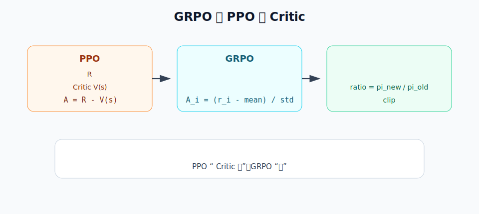
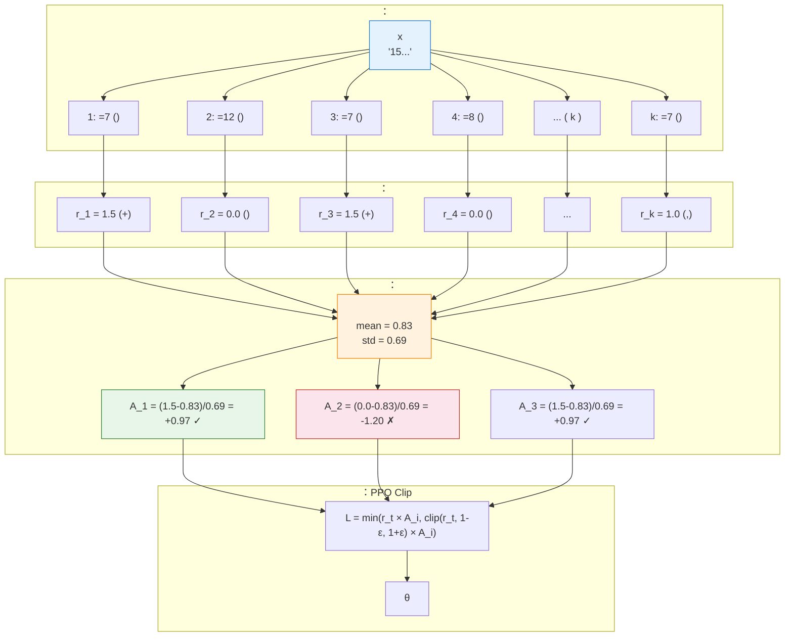

# 9.3 ：GRPO 

 DPO ，： prompt ，chosen  rejected 。****：，、、。

GRPO ****。，；；。""，：

> ** Critic ，，？**

：。GRPO ，。

 GRPO ：，"" Critic，、， GSM8K 。

```mermaid
flowchart LR
    X["（ x）"] --> Y1[" 1"]
    X --> Y2[" 2"]
    X --> Y3[" 3"]
    X --> Y4[" 4"]
    Y1 --> R[""]
    Y2 --> R
    Y3 --> R
    Y4 --> R
    R --> G["<br/>"]
    G --> U["<br/><br/>"]

    style X fill:#eef2ff,stroke:#4f46e5
    style G fill:#e8f5e9,stroke:#2e7d32
    style U fill:#fff3e0,stroke:#f57c00
```

：**，；，**。

## ：GRPO 

### 

。：

>  3 ， 2 ，？

 4 ，：

|  |                 |  |
| ---- | --------------------------- | ---- |
| 1    | "3 + 2 = 5， 5。" | 1.5  |
| 2    | " 5。"                | 1.0  |
| 3    | " 6。"                | 0.0  |
| 4    | "， 4。"        | 0.0  |

 4 ：

$$
\frac{1.5 + 1.0 + 0.0 + 0.0}{4} = 0.625
$$

：

|  |            |                      |
| ---- | ---------------------- | ------------------------------ |
| 1    | $1.5 - 0.625 = +0.875$ | ，**** |
| 2    | $1.0 - 0.625 = +0.375$ | ，       |
| 3    | $0.0 - 0.625 = -0.625$ | ，****     |
| 4    | $0.0 - 0.625 = -0.625$ | ，         |

"、"，****。，""。

### 

 RL  GRPO，：

|  |                                    |
| ------------ | -------------------------------------------------------- |
|  $s_t$   |  prompt ， $(x, y_{<t})$ |
|  $a_t$   |  token， $y_t$                         |
|  $\tau$  |                                  |
|  $R$     | 、                           |
|  $\pi$   |                                    |

 $x$ ， $y$ 。 $\pi_\theta(y \mid x)$。

：**GRPO ，""。GRPO 。** ： prompt ，，：**？**  PPO-style  `ratio + clip`，。

：

> **GRPO =  + / +  + PPO-style 。**

： 4 ，****；，**/**； $1.5-0.625$、$1.0-0.625$ ，****；、，， **PPO-style **。

## PPO Critic 

 GRPO ， Critic 。

### Critic 

 PPO  Actor-Critic ，**Actor** ，**Critic** ""：，"，"。：

$$
V_\phi(s_t)
$$

 $s_t$ ——"prompt  token"；$\phi$  Critic 。Critic ： Critic ，，；，。

 PPO ，：

$$
A_t \approx R - V_\phi(s_t)
$$

：**， Critic **。， LLM 。

### Critic  LLM 

**1. **：Critic  Actor ，PPO  Actor + Critic + Reference + RM 。

**2. **： $V(s)$ """"， LLM （500+ tokens），，。

**3. **：、、，。

[ 5 ](../chapter05_policy_gradient/pg-improvements)[ 6 ](../chapter06_actor_critic/advantage-function)，Critic ****。，Critic —— GRPO 。

## GRPO ： Critic

GRPO ：** Critic， prompt **。DeepSeekMath  GRPO ， **"foregoes the critic model"**，。



，GRPO  PPO ：

- PPO ： Critic ？
- GRPO ：？
- PPO  GRPO ，。

> ：GRPO  DeepSeekMath  [DeepSeekMath: Pushing the Limits of Mathematical Reasoning in Open Language Models](https://arxiv.org/abs/2402.03300)。 PPO， PPO  Critic，。

GRPO  PPO  Critic ""：" Critic "，""。""：**，，；，**。

### 

 GRPO 。 `trl` ， GRPO ：。

<GrpoCodeFocus focus="overview" />

：

|     |                           |                                  |
| ------- | --------------------------------- | ---------------------------------------------- |
| **[A]** | `sample_groups`                   |  prompt                |
| **[B]** | `rule_reward` / `score_responses` | ， RM            |
| **[C]** | `group_advantages`                |  Critic                    |
| **[D]** | `sequence_logprob`                |  $\log \pi_\theta(y \mid x)$ |
| **[E]** | `grpo_loss`                 | `ratio`、`clip`  PPO-style           |
| **[F]** | `approx_kl`                       |  Policy  Reference           |
| **[G]** | `train_step`                      | 、、、loss、     |
| **[H]** | `train_grpo`                      |  GRPO ，       |

##  PPO  GRPO：

 GRPO， PPO / RLHF ，：

```python
# PPO / RLHF：， Critic 
responses = policy_old.generate(prompts)
logps_old = sequence_logprob(policy_old, prompts, responses).detach()

rewards = reward_model(prompts, responses)
values = critic(prompts, responses)
advantages = rewards - values

logps_new = sequence_logprob(policy, prompts, responses)
ratio = torch.exp(logps_new - logps_old)
ppo_loss = -torch.min(
    ratio * advantages,
    torch.clamp(ratio, 1 - clip_eps, 1 + clip_eps) * advantages,
).mean()
```

 `critic` 。，：** prompt ，**。 PPO  `rewards - values` ，""""。

GRPO ：**、， Critic； prompt **。

```python
# GRPO： prompt  G ，
responses = generate_many(policy_old, prompts, num_generations=G)
logps_old = sequence_logprob(policy_old, prompts, responses).detach()

rewards = reward_fn(prompts, responses)
rewards_by_group = rewards.view(batch_size, G)

group_mean = rewards_by_group.mean(dim=1, keepdim=True)
group_std = rewards_by_group.std(dim=1, keepdim=True)
advantages = ((rewards_by_group - group_mean) / (group_std + 1e-4)).view(-1)

logps_new = sequence_logprob(policy, prompts, responses)
ratio = torch.exp(logps_new - logps_old)
grpo_loss = -torch.min(
    ratio * advantages,
    torch.clamp(ratio, 1 - clip_eps, 1 + clip_eps) * advantages,
).mean()
```

，：

```diff
  responses = policy_old.generate(prompts)
  rewards = reward_model_or_rule(prompts, responses)
- values = critic(prompts, responses)
- advantages = rewards - values

+ rewards_by_group = rewards.view(batch_size, G)
+ group_mean = rewards_by_group.mean(dim=1, keepdim=True)
+ group_std = rewards_by_group.std(dim=1, keepdim=True)
+ advantages = ((rewards_by_group - group_mean) / (group_std + 1e-4)).view(-1)

  loss = ppo_style_clipped_loss(logps_new, logps_old, advantages)
```

 GRPO " PPO "，""。，**GRPO  PPO  Critic **。

TRL 。2026-05-01  Hugging Face TRL main ， [`GRPOTrainer`](https://github.com/huggingface/trl/blob/main/trl/trainer/grpo_trainer.py) ：

1. `GRPOTrainer`  `reward_funcs`，， Python 。，， RM。
2. `self.num_generations = args.num_generations`  $G$，** prompt **。
3.  rewards reshape  `(-1, num_generations)`， `mean_grouped_rewards`  `std_rewards`， `advantages = rewards - mean_grouped_rewards`，。
4.  `coef_1 = exp(log_ratio)`， `torch.clamp`  `coef_2`， `coef_1 * advantages`  `coef_2 * advantages`  `min`。 PPO-style 。

 [`PPOTrainer`](https://github.com/huggingface/trl/blob/main/trl/experimental/ppo/ppo_trainer.py)，：PPOTrainer  `reward_model`  `value_model`， `value_model` ；GRPOTrainer  `value_model`，****。

## GRPO 

 diff  GRPO 。，：** Critic ，GRPO  PPO ——**。

****： $(x_j, \{y_{j,i}\}_{i=1}^G, \{r_{j,i}\}_{i=1}^G)$， $\hat A_{j,i} = (r_{j,i} - \bar r_j) / (s_j + \epsilon)$ ：

1. ****：$\hat A_{j,i} > 0 \Leftrightarrow r_{j,i} > \bar r_j$，""；
2. ****：$\mathbb{E}_i[\hat A_{j,i}] = 0$，， Critic ；
3. ****：$\text{Var}_i[\hat A_{j,i}] \approx 1$，。

、（ 1+2+3 ）、PPO Clip、KL ，。

### 

GRPO " prompt "，** prompt **。 batch ， $j$ ， $i$ ：

$$
x_j \quad \longrightarrow \quad \{y_{j,1}, y_{j,2}, \ldots, y_{j,G}\}
$$

：

- $x_j$： $j$  prompt，。
- $G$：group size， prompt 。 `num_generations=8`  $G=8$。
- $y_{j,i}$： $j$  prompt  $i$ 。
- $\pi_{\text{old}}$：。。
- $\pi_\theta$：。，。

：

$$
y_{j,i} \sim \pi_{\text{old}}(\cdot \mid x_j), \qquad i = 1, \ldots, G
$$

 $\sim$ ""。，：

$$
r_{j,i} = R(x_j, y_{j,i})
$$

 $R$ ，$r_{j,i}$ 。，$R$ ：，。GRPO ""，：****。

 **[A] **：

<GrpoCodeFocus focus="sampling" />

### ： Critic 

GRPO ： $x_j$， $G$  $G$  $\{r_{j,1}, \ldots, r_{j,G}\}$，——** Critic，**。：

$$
\hat A_{j,i} = \frac{r_{j,i} - \bar r_j}{s_j + \epsilon}
$$

 $\bar r_j = \frac{1}{G}\sum_i r_{j,i}$ ，$s_j = \sqrt{\frac{1}{G}\sum_i (r_{j,i}-\bar r_j)^2}$ ，$\epsilon$ （ $10^{-4}$）， 0  0。。

**： Critic**。 PPO  $A_t = R - V_\phi(s_t)$，""。Critic  $V_\phi(s_t)$ " prompt "。** $\bar r_j$ **—— $G$  $V(s_j)$  $G$ ，。：

$$
\underbrace{R - V_\phi(s_t)}_{\text{PPO }} \quad \longrightarrow \quad \underbrace{r_{j,i} - \bar r_j}_{\text{GRPO （）}}
$$

：$\hat A$ ""； $\mathbb{E}_i[r_{j,i} - \bar r_j] = 0$， Critic 。

**：**。—— $[1.0, 1.5]$ （$\bar r = 1.2$, $s = 0.2$）， $[0.0, 0.5]$ （$\bar r = 0.2$, $s = 0.2$）。，——，。 $s_j$  1：

$$
\text{Var}_i\left[\frac{r_{j,i} - \bar r_j}{s_j}\right] = \frac{\text{Var}_i[r_{j,i}]}{s_j^2} = \frac{s_j^2}{s_j^2} = 1
$$

 **z-score **，、，。

：$\hat A_{j,i} > 0$ ，；$\hat A_{j,i} < 0$ ，；$\hat A_{j,i} \approx 0$ ，。""—— prompt，。："A  B "，"A  87 "。

### 

，$s_j$  0， 0。：，，。$\epsilon$  $0/0$ 。

 **[C] **：

<GrpoCodeFocus focus="advantages" />

：

- `grouped_rewards = rewards.view(-1, group_size)`：" prompt、 $G$ "。
- `group_mean = grouped_rewards.mean(dim=1, keepdim=True)`： prompt  $\bar r_j$。
- `group_std = grouped_rewards.std(dim=1, keepdim=True)`： prompt  $s_j$。
- `advantages = (grouped_rewards - group_mean) / (group_std + eps)`： $\hat A_{j,i}$。
- `torch.where(group_std < eps, 0, advantages)`：，。

：**GRPO = PPO  +  Critic**。"PPO "。

###  PPO Clip

：

$$
\rho_{j,i}(\theta) = \frac{\pi_\theta(y_{j,i} \mid x_j)}{\pi_{\text{old}}(y_{j,i} \mid x_j)}
$$

， log probability，：

$$
\rho_{j,i}(\theta) = \exp\left(\log \pi_\theta(y_{j,i} \mid x_j) - \log \pi_{\text{old}}(y_{j,i} \mid x_j)\right)
$$

 $\rho=1$，； $\rho=1.2$， 20%； $\rho=0.8$， 20%。

，GRPO ：

$$
\mathcal{J}_{\text{GRPO}}^{\text{clip}}(\theta) = \mathbb{E}_{j,i} \left[\min\left(\rho_{j,i}(\theta)\,\hat A_{j,i},\; \operatorname{clip}(\rho_{j,i}(\theta), 1-\epsilon_{\text{clip}}, 1+\epsilon_{\text{clip}})\,\hat A_{j,i}\right)\right]
$$

：

- $\mathbb{E}_{j,i}$： batch  prompt 。
- $\hat A_{j,i}$：。
- $\epsilon_{\text{clip}}$：， 0.2。
- $\operatorname{clip}(\rho, 1-\epsilon_{\text{clip}}, 1+\epsilon_{\text{clip}})$：。 $\epsilon_{\text{clip}}=0.2$ ，$\rho$  $[0.8, 1.2]$。
- $\min(\cdot, \cdot)$：，。

？ $\pi_{\text{old}}$ 。 $\pi_\theta$  $\pi_{\text{old}}$ ，。：**，**。 7  PPO ，[](../chapter07_ppo/trust-region-clipping)。

<GrpoCodeFocus focus="clip" />

，`new_logprobs`  $\log \pi_\theta(y_{j,i} \mid x_j)$，`old_logprobs`  $\log \pi_{\text{old}}(y_{j,i} \mid x_j)$。：

- `ratio = torch.exp(new_logprobs - old_logprobs)`： $\rho_{j,i}(\theta)$。
- `surr1 = ratio * advantages`：。
- `clipped_ratio = torch.clamp(ratio, 1.0 - clip_eps, 1.0 + clip_eps)`： $\rho$  $[1-\epsilon_{\text{clip}}, 1+\epsilon_{\text{clip}}]$。
- `surr2 = clipped_ratio * advantages`：。
- `policy_loss = -torch.min(surr1, surr2).mean()`：， loss。

 $\mathcal{J}_{\text{GRPO}}^{\text{clip}}$ ""； loss，：

$$
\text{policy\_loss} = -\mathcal{J}_{\text{GRPO}}^{\text{clip}}(\theta)
$$

。

### KL ： Reference 

GRPO  KL ， Policy  Reference 。 KL：

$$
\widehat D_{\text{KL}} = \exp(\Delta) - \Delta - 1, \qquad \Delta = \log \pi_{\text{ref}}(y \mid x) - \log \pi_\theta(y \mid x)
$$

，。

**：**。 $u = \exp(\Delta)$， $\widehat D_{\text{KL}} = u - \log u - 1 \circeq g(u)$。 $g'(u) = 1 - 1/u$、$g''(u) = 1/u^2 > 0$， $g$ ， $u = 1$（ $\Delta = 0$） $g(1) = 0$。** $\Delta \neq 0$ **—— $-\Delta$ 。

**： $D_{\text{KL}}(\pi_\theta \| \pi_{\text{ref}})$ **。 $\exp(\Delta) = \pi_{\text{ref}}/\pi_\theta$， $\mathbb{E}_{y \sim \pi_\theta}[\exp(\Delta)] = \sum_y \pi_\theta(y) \cdot \pi_{\text{ref}}(y)/\pi_\theta(y) = 1$； $\mathbb{E}_{\pi_\theta}[\Delta] = -D_{\text{KL}}(\pi_\theta \| \pi_{\text{ref}})$。：

$$
\mathbb{E}_{\pi_\theta}[\widehat D_{\text{KL}}] = 1 - (-D_{\text{KL}}) - 1 = D_{\text{KL}}(\pi_\theta \| \pi_{\text{ref}})
$$

**：**。 $\exp(\Delta)$  $\Delta = 0$  Taylor ：$\exp(\Delta) = 1 + \Delta + \Delta^2/2 + O(\Delta^3)$，

$$
\widehat D_{\text{KL}} = \exp(\Delta) - \Delta - 1 = \frac{\Delta^2}{2} + O(\Delta^3)
$$

****：$\widehat D_{\text{KL}}$  $\Delta$  $U$ ， $\Delta = 0$（Policy = Reference）， $\Delta^2/2$ 。""——、，。

：

$$
\mathcal{L}_{\text{GRPO}} = -\mathcal{J}_{\text{GRPO}}^{\text{clip}}(\theta) + \beta_{\text{KL}}\,\widehat D_{\text{KL}}
$$

 $\beta_{\text{KL}}$  KL ， `kl_coef`。，；， Reference 。

<GrpoCodeFocus focus="kl" />

：

- `log_ratio_ref = ref_logprobs - new_logprobs`： $\Delta$。
- `approx_kl = (torch.exp(log_ratio_ref) - log_ratio_ref - 1.0).mean()`： $\widehat D_{\text{KL}}$。
- `loss = policy_loss + kl_coef * approx_kl`： $\mathcal{L}_{\text{GRPO}}$。

### 

，GRPO ：

1.  prompt  $G$ 。
2. 。
3.  prompt  $\bar r_j$、$s_j$  $\hat A_{j,i}$。
4.  log probability  $\rho_{j,i}(\theta)$。
5.  PPO-style clip 。
6.  Reference KL 。
7. ， Policy。

 GRPO ：



## GRPO ：GSM8K + 

， GRPO 。： GSM8K  Qwen2.5-1.5B。

### ： RM

GSM8K  8500 ，。""—— RM，：

- ：$+1.0$ 
- （）：$+0.5$ 
- ：$0$ 

```python
# 1. （ RM！）
import re

def rule_based_reward(prompt: str, response: str, ground_truth: str) -> float:
    reward = 0.0
    # ： \boxed{...}
    if re.search(r'\\boxed\{[^}]+\}', response):
        reward += 0.5
    # ：
    answer_match = re.search(r'\\boxed\{([^}]+)\}', response)
    if answer_match:
        model_answer = answer_match.group(1).strip()
        try:
            if abs(float(model_answer) - float(ground_truth)) < 0.01:
                reward += 1.0
        except ValueError:
            if model_answer == ground_truth:
                reward += 1.0
    return reward

# 
prompt = "Janet  16 。 3 ， 4 。？"
good = "：16 - 3 - 4 = 9 \n 7 ，：9 × 7 = 63 \n\\boxed{63}"
bad = " 50 。\\boxed{50}"
print(rule_based_reward(prompt, good, '63'))  # 1.5
print(rule_based_reward(prompt, bad, '63'))   # 0.5
```

：** RM，**。，。"" RLVR 。

， **[B]**。，：

<GrpoCodeFocus focus="reward" />

###  GRPO 

 `trl`  GRPO 。 PPO ，GRPO  Critic ：

```python
# 2. GRPO （）
from trl import GRPOTrainer, GRPOConfig
from transformers import AutoModelForCausalLM, AutoTokenizer
from datasets import load_dataset

model = AutoModelForCausalLM.from_pretrained("Qwen/Qwen2.5-1.5B-Instruct")
tokenizer = AutoTokenizer.from_pretrained("Qwen/Qwen2.5-1.5B-Instruct")
if tokenizer.pad_token is None:
    tokenizer.pad_token = tokenizer.eos_token
tokenizer.padding_side = "left"

config = GRPOConfig(
    output_dir="./grpo_gsm8k",
    num_generations=8,        #  k=8 （）
    per_device_train_batch_size=4,
    learning_rate=5e-6,
    num_train_epochs=1,
    #  Critic！ GRPO 
)

gsm8k = load_dataset("openai/gsm8k", "main")
trainer = GRPOTrainer(
    model=model,
    args=config,
    train_dataset=gsm8k["train"],
    reward_funcs=[rule_based_reward],  # 
    processing_class=tokenizer,
)

trainer.train()  # —— Critic， RM
trainer.save_model("./grpo_gsm8k/final_model")
```

 `GRPOTrainer` ，"，，，"：

<GrpoCodeFocus focus="train" />

### ：

GRPO ：

****（）：

```
： 15 ， 3 ， 5 ，？
： 7 。\boxed{7}
```

****（）：

```
： 15 ， 3 ， 5 ，？
：
：
-  15 
-  3 ：15 - 3 = 12
-  5 ：12 - 5 = 7
-  7 
\boxed{7}
```

""""——， GRPO ""。（）， GRPO 。

```mermaid
flowchart LR
    subgraph before [""]
        B1[""] --> B2["\n()"]
        B2 --> B3["\n ≈ 0"]
    end

    subgraph after [""]
        A1[""] --> A2["\n( →  → )"]
        A2 --> A3["\n ≈ 1.5"]
    end

    B3 -->|"GRPO \n' = '"| A1

    style B3 fill:#fce4ec,stroke:#c62828
    style A3 fill:#e8f5e9,stroke:#2e7d32
```

## 

### 

|  | PPO （4 ） | GRPO （2 ） |  |
| -------- | ------------------ | ------------------- | -------- |
| 1.5B     | ~24 GB             | ~14 GB              | ~42%     |
| 7B       | ~80 GB             | ~48 GB              | ~40%     |
| 14B      | ~160 GB            | ~96 GB              | ~40%     |
| 70B      | ~640 GB            | ~384 GB             | ~40%     |

GRPO  Critic（ Actor ） RM ， 30-40% 。， 8  A100 ， 5 。

### 

GRPO  Critic。， 8 （）。，（），。

```
（Episode 10）：
   "15 - 3 - 5 = ?"  8 ：[3, 7, 12, 7, 15, 7, 8, 10]
  ：（）
  ：[−1.2, +0.1, +0.8, +0.1, +1.5, +0.1, −0.3, +0.6]

（Episode 100）：
   8 ：[7, 7, 7, 8, 7, 7, 7, 7]
  ：（）
  ：[0, 0, 0, −0.5, 0, 0, 0, 0]

（Episode 300）：
   8 ：[7, 7, 7, 7, 7, 7, 7, 7]
  ：（）
  ： → 
```

，，——""。：。

### k 

k（） GRPO ，：

| k  |                 |                |      |
| ---- | ----------------------- | ------------------------ | ------------ |
| 2    | （ 2 ） | （） |      |
| 4    |                     |                      |    |
| 8    |                     |                      | **** |
| 16   |                       | （）     |      |
| 64   |                     |                      |    |

```python
# GRPO 
import numpy as np

def grpo_group_normalize(rewards: list[float]) -> list[float]:
    rewards = np.array(rewards, dtype=float)
    mean, std = rewards.mean(), rewards.std()
    if std < 1e-8:
        return np.zeros_like(rewards)
    return (rewards - mean) / std

# ：8 
rewards = [1.5, 0.0, 1.5, 0.0, 1.0, 1.5, 0.5, 1.5]
advantages = grpo_group_normalize(rewards)
# : [ 0.89 -1.48  0.89 -1.48  0.10  0.89 -0.69  0.89]
# : 0.9375, : 0.634
```

<details>
<summary>：GRPO ？</summary>

1. **k **：$k=2$ ，。
2. ****：，。
3. ****：，，——""。
4. ****： 0/1 ，，。

GRPO  DAPO ""——，。

</details>

### GRPO  PPO 

|            | PPO                               | GRPO                               |
| -------------- | --------------------------------- | ---------------------------------- |
| （Critic） |  $V(s)$                 |  $\bar{r}$                 |
|        | $A = R - V(s)$  GAE             | $A_i = (r_i - \bar{r}) / \sigma_r$ |
|        | 4 （Actor + Critic + Ref + RM） | 2 （Actor + Ref）                |
|        | PPO Clip                          |  PPO Clip                    |
|        |                           | （ prompt  k ）      |
|            |                                 |  30-40%                          |
|        |  Critic               |  $k$                     |
|    |  Critic               |  batch                   |

，GRPO  PPO ， GAE。 GRPO （/）， token 。，GAE  TD ，。

GRPO  Critic 。——，DeepSeek-R1-Zero  SFT  RL ，DAPO  GRPO 。——[DeepSeek-R1  DAPO](./deepseek-dapo)。
