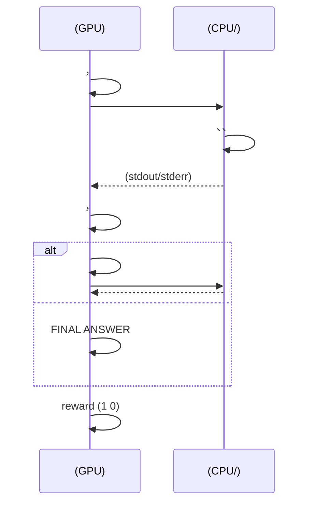
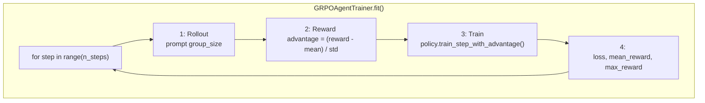

# 10.6 ： Agentic RL 

 10.1  10.2 ， Agentic RL ； 10.3  10.5 ， OpenRLHF、veRL、Relax 。，。

， Agent，：、、，，。 500 ， CPU 。

 [hyunwoongko/nanoRLHF](https://github.com/hyunwoongko/nanoRLHF) ——。""，****。 veRL  Relax ，。

 GitHub ：`https://github.com/letslego/hands-on-modern-rl/tree/main/docs/chapter10_agentic_rl/code/`。

## Agentic RL  Infra 

 Agentic RL  Relax  veRL ，——，** episode **。

###  episode 

 Agent ：



：

1. ****：，。 $t$  $a_t$  $t-1$  $o_{t-1}$，。
2. ****： **GPU（）→ CPU（）→ （）→ CPU（）→ GPU（）** ，， GPU 。

### 

 episode 。：

```mermaid
flowchart TD
    subgraph Rollout [Rollout ：]
        P["Prompt"]
        M1[" ( θ)"]
        E[""]
        P --> M1
        M1 -->| a₁| E
        E -->| o₁| M1
        M1 -->| a₂| E
        E -->| o₂| M1
        M1 -->|...| E
        E -->| reward r| M1
        M1 -->| τ| Buf[""]
    end
    subgraph Train [Train ：]
        Buf -->| τ| Adv[" advantage A"]
        Adv -->| loss| Grad[" θ → θ'"]
    end
    Grad -->|| M1
```

：

- **Rollout **： $π_θ$ ， episode， $τ = (s_0, a_0, o_0, s_1, a_1, o_1, ..., r)$。**on-policy**：，。
- **Reward **：（） reward。。
- **Advantage **： GRPO ， prompt ， advantage。
- ****： advantage  $θ$ （ advantage ）， $θ'$。
- ****： rollout  $θ'$ ，。

 **rollout → reward → train → repeat**。 RLHF ，rollout  train  batch ； Agentic RL ，rollout  I/O ，，train 。

###  RLHF 

 RLHF（、 PPO/GRPO）：

```mermaid
flowchart LR
    subgraph  [： GPU]
        P1["Prompt Batch"]
        G["model.generate()"]
        C["Completions"]
        P1 --> G --> C
    end
    subgraph  [： GPU]
        R["Reward Model "]
        T[""]
        C --> R --> T
    end
```

 RLHF ：

- **** batch  prompt **** completion， GPU ，。
- **** completion  reward、advantage，。
- ** GPU **， I/O ， batch ： → 。

 Agentic RL ，。****—— episode —— episode ，GPU ****。

 episode ，，。，**GPU **， GPU  I/O 。

### ：

，Agentic RL ：**（rollout）（train）**。

```mermaid
flowchart LR
    subgraph Rollout [Rollout ：]
        M1[" ()"]
        E[""]
        M1 -->|| E
        E -->|| M1
        M1 -->|| Q["TransferQueue<br/>/ "]
    end
    subgraph Train [Train ：]
        Q -->|| T[" ()"]
        T -->|| T
        T -->|| M1
    end
```

- **Rollout **：，，。
- **Train **：， advantage，。
- ****（ Relax  TransferQueue、veRL  ActorBuffer），，。

### 

""，：

- ****：Train ， Rollout ？ Rollout ，。
- ****：Rollout  Train ，？？
- ****：Train ，，****？

Relax、veRL  **DCS **、****、**PlacementGroup **、**** ，""。

，****——rollout ， rollout。。，、、，。

## 

：rollout → reward → train → repeat。，，。：，？

### Rollout 

Rollout "，"。：

- **？** Agent ，。 `while True: pass`，。****—— **Environment** 。
- **？**  `generate()` ， episode "→→→"。，—— **RolloutWorker** 。
- **、？** （rollout ），（ advantage ）。—— **Policy** 。

### Train 

Train " advantage，"。：

- **Advantage ？** GRPO  prompt ，。" →  mean/std →  advantage"？
- **？** Policy ，、、？
- **？** Rollout 、 advantage、 Policy 、——。

 **Trainer** ："rollout → reward → train"，。

### 

|               |                                          |     |
| ----------------- | ---------------------------------------------------- | --------------- |
| **Environment**   | Agent ？                     | Rollout         |
| **Policy**        | ？？                         | Rollout + Train |
| **RolloutWorker** | ？                     | Rollout         |
| **Trainer**       | " →  advantage → "？ | Train（）   |

，。

## 

，。" 10 "。

，Agent ：

| Turn |   |                                |
| ---- | ----- | ---------------------------------- |
| 0    | User  | " 10 "         |
| 1    | Agent |  Python  `def fib(n): ...` |
| 1    |   | ， `55`                |
| 2    | Agent | FINAL ANSWER: 55                   |

，Agent  bug ，：

| Turn |   |                         |
| ---- | ----- | --------------------------- |
| 0    | User  | " 10 "  |
| 1    | Agent |  bug          |
| 1    |   |  `ERROR: NameError`     |
| 2    | Agent |  ERROR，        |
| 2    |   | ， `55` |
| 3    | Agent | FINAL ANSWER: 55            |

 Agent 。 Agent ，。，：Agent  →  → Agent 。

 Rollout ——****。

## Environment — 

Agent ？。 Agent  `while True: pass` ，。，Agent 。，， Agent ， Agent。

： Agent （）、、。 **Environment** ， 10.2 。

```mermaid
flowchart TD
    subgraph SandboxEnv["SandboxEnv.step() "]
        Input[": action_type + action_args"]
        Route{"action_type ?"}
        Input --> Route
        Route -->|execute_code| Exec["_exec_code(code)"]
        Route -->|finish| Done[" done=True"]
        Route -->|| Err[" Unknown action"]
        Exec --> Write[" .py"]
        Write --> Sub["subprocess.run(timeout=10)"]
        Sub --> Ok{"?"}
        Ok -->|| RetOk[" observation + done=False"]
        Ok -->|| RetT[" TIMEOUT + done=True"]
        Ok -->|| RetE[" ERROR + done=False"]
    end
```

```python
# environment.py
import subprocess
import tempfile
import os


class SandboxEnv:
    """：subprocess + 

    ： Agent ，， (observation, done)。
    ： subprocess ，/。
    """

    def __init__(self, timeout=10, max_memory=256 * 1024 * 1024):
        self.timeout = timeout          # ：
        self.max_memory = max_memory    # （， cgroup）

    def step(self, action_type: str, action_args: dict) -> dict:
        """，。

         POMDP  O(s_t)：， (observation, done)。
        ：execute_code（） finish（ episode）。
        """
        if action_type == "execute_code":
            return self._exec_code(action_args["code"])
        elif action_type == "finish":
            return {"observation": "", "done": True}
        else:
            return {"observation": f"Unknown action: {action_type}", "done": False}

    def _exec_code(self, code: str) -> dict:
        """， CPU 。

        ：
        1. （）
        2. subprocess.run() 
        3. timeout ， TimeoutExpired
        4.  stdout/stderr  500 （）
        """
        try:
            with tempfile.NamedTemporaryFile(mode="w", suffix=".py", delete=False) as f:
                f.write(code)
                f.flush()
                # ，timeout 
                result = subprocess.run(
                    ["python", f.name],
                    timeout=self.timeout,
                    capture_output=True,
                    text=True,
                )
                os.unlink(f.name)  # 
                return {
                    "observation": (result.stdout + result.stderr)[-500:],  # 
                    "done": False,
                }
        except subprocess.TimeoutExpired:
            # ：Agent ，episode 
            return {"observation": "TIMEOUT", "done": True}
        except Exception as e:
            # ：、
            return {"observation": f"ERROR: {e}", "done": False}

    def reset(self):
        """（ episode ）。

        ，。
        、。
        """
        pass
```

：

- `step()`  action（`action_type` + `action_args`），。 10.1  $A = A_{\text{text}} \cup A_{\text{action}}$
- `_exec_code()`  subprocess ， timeout ——B.2 
-  `observation`（） `done`（）， POMDP  $O(s_t)$

## Policy — 

，？（Policy）。 0.5B  Qwen2.5 。

： rollout （），。？ B.1 ——：，。

```mermaid
flowchart TD
    subgraph Rollout["Rollout （，）"]
        P1[" prompt"] --> Gen["generate(prompt)<br/>@torch.no_grad()"]
        Gen --> Out[""]
    end
    subgraph Train["Train （）"]
        P2[" (prompt, response, advantage)"] --> Lp["get_logprobs()<br/> token  log prob"]
        Lp --> KL{"ref_model?"}
        KL -->|| KLcalc[" KL "]
        KL -->|| NoKL["kl = 0"]
        KLcalc --> Loss["pg_loss = -sum(log_prob) * advantage<br/>loss = pg_loss + 0.1 * kl"]
        NoKL --> Loss
        Loss --> Back["backward() + step()"]
        Back --> Update[" θ  θ'"]
    end
```

```python
# policy.py
import torch
import torch.nn.functional as F


class Policy:
    """，。

    ：（rollout）（）。
    ：
      - generate() / get_logprobs()：rollout ，@torch.no_grad() 
      - train_step_with_advantage()：，
    """

    def __init__(self, model, tokenizer, lr=1e-5):
        self.model = model                # ： + 
        self.tokenizer = tokenizer
        self.optimizer = torch.optim.AdamW(model.parameters(), lr=lr)
        self.ref_model = None             # KL ：

    def set_ref_model(self, ref_model):
        """， KL 。

        ：，。
        """
        self.ref_model = ref_model

    @torch.no_grad()
    def generate(self, prompt: str, max_new_tokens=128) -> str:
        """： prompt，。

         rollout  ""。
         @torch.no_grad()  rollout ，。
        """
        inputs = self.tokenizer(prompt, return_tensors="pt").to(self.model.device)
        outputs = self.model.generate(**inputs, max_new_tokens=max_new_tokens)
        return self.tokenizer.decode(outputs[0], skip_special_tokens=True)

    @torch.no_grad()
    def get_logprobs(self, prompt: str, response: str) -> torch.Tensor:
        """ response  token  log probability。

        rollout ：（）。
        ： new_logprobs（） ref_logprobs（）。

        ： response （ prompt） log prob。
        """
        full_text = prompt + response
        inputs = self.tokenizer(full_text, return_tensors="pt").to(self.model.device)
        logits = self.model(**inputs).logits

        #  prompt ， response 
        prompt_len = len(self.tokenizer(prompt, return_tensors="pt")["input_ids"][0])
        # response_logits[i]  response  i  token 
        response_logits = logits[:, prompt_len - 1:-1, :]
        response_ids = inputs["input_ids"][:, prompt_len:]

        # log_softmax  logits  log 
        logprobs = F.log_softmax(response_logits, dim=-1)
        # gather： token  log prob
        token_logprobs = logprobs.gather(2, response_ids.unsqueeze(-1)).squeeze(-1)
        return token_logprobs

    def train_step_with_advantage(self, trajectories: list):
        """ GRPO （REINFORCE + advantage + KL ）。

        ：
            trajectories: list of (prompt, response, advantage)
                          prompt: 
                          response: Agent 
                          advantage: GRPO 

        ：
        1.  new_logprobs（）
        2.  ref_model， KL 
        3.  loss = -sum(log_prob) * advantage
        4.  loss = pg_loss + 0.1 * kl，
        """
        losses = []
        for prompt, response, advantage in trajectories:
            new_logprobs = self.get_logprobs(prompt, response)

            if self.ref_model is not None:
                with torch.no_grad():
                    # ref_logprobs： response 
                    ref_logprobs = self._get_ref_logprobs(prompt, response)
                # KL （）：p * (log p - log q)
                kl = (new_logprobs.exp() * (new_logprobs - ref_logprobs)).sum()
            else:
                kl = 0.0

            # ：advantage > 0 ，advantage < 0 
            pg_loss = -(new_logprobs.sum() * advantage)
            loss = pg_loss + 0.1 * kl
            losses.append(loss)

        total_loss = torch.stack(losses).mean()
        self.optimizer.zero_grad()
        total_loss.backward()
        self.optimizer.step()
        return total_loss.item()
```

：

- `generate()`  `get_logprobs()`  rollout ，`train_step_with_advantage()` ——
- `ref_model`  KL ，
- （REINFORCE + advantage）， PPO  clipping——

## RolloutWorker —  Agent Loop

Policy ，Environment 。，Agent ：、、、。 `generate()` ，"→→→"？

，。 **RolloutWorker** 。

```mermaid
flowchart TD
    subgraph RolloutWorker["RolloutWorker.rollout()"]
        Start[" messages + trajectory"] --> Loop{"turn < max_turns?"}
        Loop -->|| Gen["policy.generate(context)"]
        Gen --> Parse["_parse_action(output)"]
        Parse --> Check{"type == finish?"}
        Check -->|| Exec["env.step(type, args)"]
        Exec --> Record[" trajectory + messages"]
        Record --> Loop
        Check -->|| EndLoop[" final_response"]
        EndLoop --> Reward["reward_fn(trajectory)"]
        Loop -->|| Reward
    end
```

````python
# rollout_worker.py


class RolloutWorker:
    """ Agent Loop，。

    ： "→→→" 。
     rollout ， prompt、、、reward。
    """

    def __init__(self, policy, env, max_turns=5):
        self.policy = policy    # ：
        self.env = env          # ：
        self.max_turns = max_turns  # ：

    def rollout(self, prompt: str, reward_fn) -> dict:
        """ Agent Loop， reward。

         Rollout ：
        1. （ prompt）
        2. （ max_turns ）：
           -  prompt → policy.generate() 
           - _parse_action() 
           -  finish：episode ，
           - ：env.step() ，
           -  (, ) 
        3.  reward_fn  reward
        """
        # ：
        messages = [{"role": "user", "content": prompt}]
        # ： prompt、、、reward
        trajectory = {"prompt": prompt, "interactions": []}

        for turn in range(self.max_turns):
            # Step 1:  prompt
            context = self._format_context(messages)
            # Step 2: （，）
            model_output = self.policy.generate(context)
            # Step 3: 
            action = self._parse_action(model_output)

            if action["type"] == "finish":
                # Agent  episode，
                trajectory["interactions"].append({
                    "turn": turn,
                    "response": model_output,
                    "action": action,
                    "observation": None,
                })
                trajectory["final_response"] = action.get("answer", model_output)
                break

            # Step 4: ，
            obs = self.env.step(action["type"], action["args"])

            # Step 5: 
            trajectory["interactions"].append({
                "turn": turn,
                "response": model_output,      # Agent （）
                "action": action,              # 
                "observation": obs["observation"],  # 
            })

            # Step 6: ，
            messages.append({"role": "assistant", "content": model_output})
            messages.append({"role": "user", "content": f":\n{obs['observation']}"})

            if obs.get("done"):
                #  episode （）
                break

        # Step 7:  reward（）
        trajectory["reward"] = reward_fn(trajectory)
        return trajectory

    def _format_context(self, messages):
        """ prompt。

         tokenizer  chat_template，。
        """
        parts = []
        for msg in messages:
            if msg["role"] == "user":
                parts.append(f"User: {msg['content']}")
            else:
                parts.append(f"Assistant: {msg['content']}")
        return "\n".join(parts)

    def _parse_action(self, model_output: str) -> dict:
        """。

        ：
        1. ```python ... ``` → execute_code（）
        2. FINAL ANSWER: ... → finish（）
        3.  → execute_code（）

         token ，。
        """
        if "```python" in model_output:
            code = model_output.split("```python")[1].split("```")[0]
            return {"type": "execute_code", "args": {"code": code}}
        elif "FINAL ANSWER:" in model_output:
            answer = model_output.split("FINAL ANSWER:")[1].strip()
            return {"type": "finish", "answer": answer}
        else:
            return {"type": "execute_code", "args": {"code": model_output}}
````

：

- `rollout()`  Agent Loop ：（`policy.generate()`）→ （`_parse_action()`）→ （`env.step()`）→ 
-  `{"prompt", "interactions": [...], "final_response", "reward"}`—— RL  `(prompt, completion, reward)` ，
- `_parse_action()` 。 tokenizer +  token ，

## Trainer — 

，。——，。 9 ，GRPO  prompt ， advantage。

，" →  advantage →  → "？ **Trainer** 。



```python
# trainer.py

from rollout_worker import RolloutWorker


class GRPOAgentTrainer:
    """ Agentic RL ：rollout -> reward -> train -> repeat。

    ： Policy、Environment、RolloutWorker 。
    （ fit() ）：
    1. Rollout： prompt  group_size 
    2. Reward ：GRPO ， advantage
    3. Train： advantage 
    4. ：
    """

    def __init__(self, policy, env, reward_fn, group_size=4, max_turns=5):
        self.policy = policy        # ： + 
        self.env = env              # ：
        self.reward_fn = reward_fn  # ：
        self.group_size = group_size  # GRPO ： prompt 
        #  RolloutWorker： policy  env 
        self.worker = RolloutWorker(policy, env, max_turns=max_turns)
        self.history = []           # ： loss  reward

    def fit(self, prompts: list, n_steps: int = 50):
        """： n_steps  (rollout -> reward -> train)。

        ：
            prompts: 
            n_steps: （ =  rollout + train）
        """
        for step in range(n_steps):
            # ====================  1: Rollout ====================
            #  prompt， group_size 
            #  "group"， GRPO 
            batch_trajectories = []
            for prompt in prompts:
                group = []
                for _ in range(self.group_size):
                    # rollout ：， finish  max_turns
                    traj = self.worker.rollout(prompt, self.reward_fn)
                    group.append(traj)
                batch_trajectories.append(group)

            # ====================  2: Reward  (GRPO) ====================
            # GRPO ： prompt 
            # advantage = (reward - mean) / std
            #  advantage ""
            all_rewards = []
            for group in batch_trajectories:
                group_rewards = [t["reward"] for t in group]
                mean_r = sum(group_rewards) / len(group_rewards)
                std_r = (sum((r - mean_r) ** 2 for r in group_rewards) / len(group_rewards)) ** 0.5 + 1e-8
                for t, r in zip(group, group_rewards):
                    t["advantage"] = (r - mean_r) / std_r
                all_rewards.extend(group_rewards)

            # ====================  3: Train ====================
            #  (prompt, response, advantage)  Policy 
            train_data = []
            for group in batch_trajectories:
                for traj in group:
                    # ， "response"
                    full_response = self._serialize_trajectory(traj)
                    train_data.append((
                        traj["prompt"],      # 
                        full_response,       # （Agent ）
                        traj["advantage"],   # GRPO 
                    ))

            # ：advantage > 0 ，advantage < 0 
            loss = self.policy.train_step_with_advantage(train_data)

            # ====================  4:  ====================
            mean_reward = sum(all_rewards) / len(all_rewards)
            self.history.append({
                "step": step,
                "loss": loss,
                "mean_reward": mean_reward,
                "max_reward": max(all_rewards),
            })
            if step % 5 == 0:
                print(f"Step {step:3d} | loss={loss:.4f} | "
                      f"reward_mean={mean_reward:.3f} | "
                      f"reward_max={max(all_rewards):.3f}")

        return self.history

    def _serialize_trajectory(self, traj: dict) -> str:
        """， train_step。

        ：
            Assistant: <1>
            Observation: <1>
            Assistant: <2>
            Observation: <2>
            ...

        ：， token  loss。
         loss mask  token（ loss）
         token（ mask ）， B.2 。
        """
        parts = []
        for interaction in traj["interactions"]:
            parts.append(f"Assistant: {interaction['response']}")
            if interaction["observation"]:
                parts.append(f"Observation: {interaction['observation']}")
        return "\n".join(parts)
```

：

- `fit()`  B.1 "-"：RolloutWorker ，Policy 
- GRPO  Reward ： prompt  advantage = (reward - mean) / std
- `_serialize_trajectory()` 。—— loss mask  token  token（ B.2  loss mask ）

## 

，。Environment ，Policy ，RolloutWorker ，Trainer  GRPO 。。？

```mermaid
flowchart TD
    subgraph 
        Load[""]
        InitE[" SandboxEnv"]
        InitP[" Policy"]
        InitR[" ref_model"]
        InitT[" GRPOAgentTrainer<br/> RolloutWorker"]
        Load --> InitE
        Load --> InitP
        Load --> InitR
        InitE --> InitT
        InitP --> InitT
        InitR --> InitP
    end
    InitT --> Fit["trainer.fit(prompts, n_steps=30)"]
```

：

```python
# run.py
from transformers import AutoModelForCausalLM, AutoTokenizer

from environment import SandboxEnv
from policy import Policy
from trainer import GRPOAgentTrainer

# ==================== Step 1:  ====================
# （0.5B ），CPU 
model_name = "Qwen/Qwen2.5-0.5B-Instruct"
model = AutoModelForCausalLM.from_pretrained(model_name)
tokenizer = AutoTokenizer.from_pretrained(model_name)

# ==================== Step 2:  ====================
# 2.1 Environment：， Agent 
env = SandboxEnv(timeout=10)

# 2.2 Policy：，
policy = Policy(model, tokenizer, lr=5e-5)

# 2.3 ref_model：KL ，
# ： checkpoint 
ref_model = AutoModelForCausalLM.from_pretrained(model_name)
policy.set_ref_model(ref_model)

# ==================== Step 3:  reward  ====================
# reward ：，
# ：/，，reward=1
def code_reward(trajectory):
    """。

    ： reward。
     reward  + RM + LLM-as-Judge 。
    """
    for interaction in trajectory["interactions"]:
        obs = interaction.get("observation", "")
        # （ ERROR  TIMEOUT），
        if obs and "ERROR" not in obs and "TIMEOUT" not in obs:
            return 1.0
    return 0.0


# ==================== Step 4:  ====================
# prompts：，Agent 
prompts = [
    " Python  10 。",
    "。",
    "。",
]

# ==================== Step 5:  Trainer  ====================
# Trainer ：
# rollout（ prompt  4 ）-> reward（GRPO ）-> train（）
trainer = GRPOAgentTrainer(
    policy=policy,        # 
    env=env,              # 
    reward_fn=code_reward,  # 
    group_size=4,         # GRPO ： prompt  4 
    max_turns=3,          #  3 
)

# ： 3  prompts  30 
history = trainer.fit(prompts, n_steps=30)
```

## 

， Agentic RL 。 Relax、veRL ？

|       |                 | （Relax / veRL）                               |
| --------- | --------------------------- | ------------------------------------------------------ |
|   | `model.generate()`  | vLLM / SGLang，continuous batching，KV cache           |
|   |  AdamW                  | FSDP / Megatron，3D parallelism，gradient accumulation |
|     |                       | Ray ，，PlacementGroup                     |
|   | rollout  train        | TransferQueue ，DCS                |
|       | subprocess + timeout        | Docker  / MicroVM，，              |
| Loss mask |  token  loss      |  token  loss， token  mask       |
| Reward    |                     |  + RM + LLM-as-Judge + verifier                |
|   |  dict               | （Redis / S3），/              |
|       |                           | ，，checkpoint                     |

。，。

## 

1. ** PPO clipping**： `train_step_with_advantage()`  PPO  clipped surrogate objective（ 7 ）， REINFORCE  PPO 
2. ** loss mask**： `_serialize_trajectory()`  token 、， token  loss
3. ****： `SandboxEnv` （mock ），
4. ** rollout**： `multiprocessing`  rollout  train ， `Queue` ， GPU 

---

 Agentic RL 。，：** Agent Loop（10.1）（10.2） rollout → reward → train  RL **。Relax、veRL ，、、。
