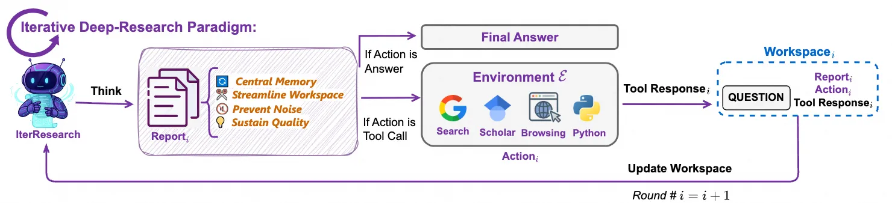
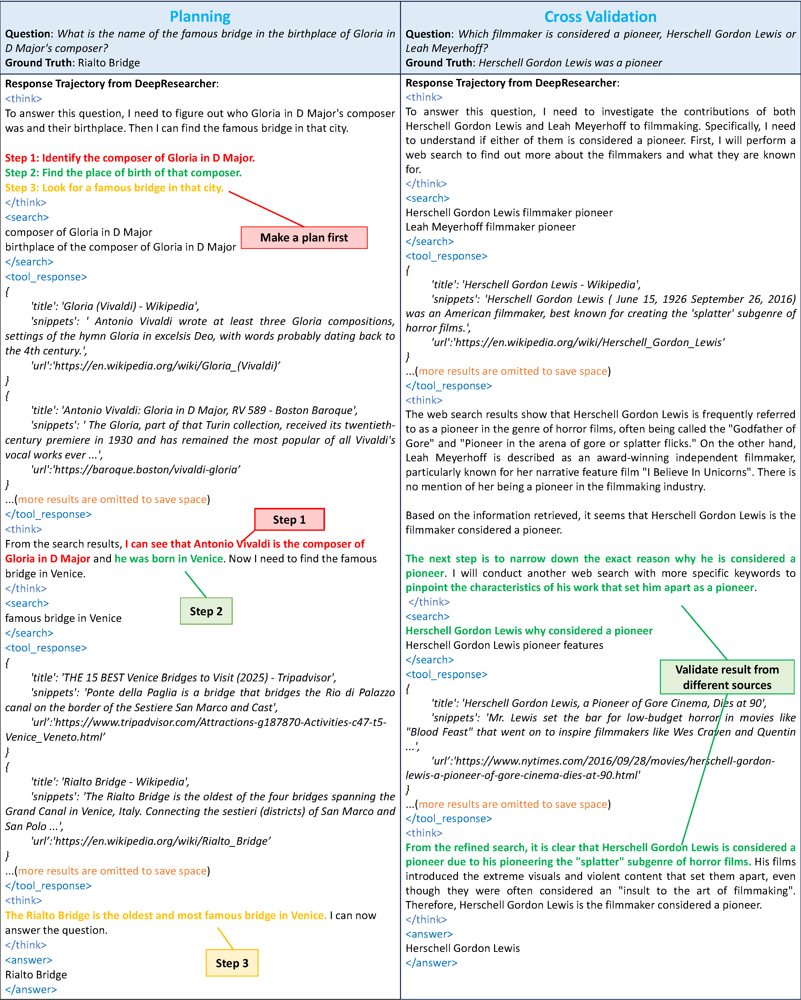
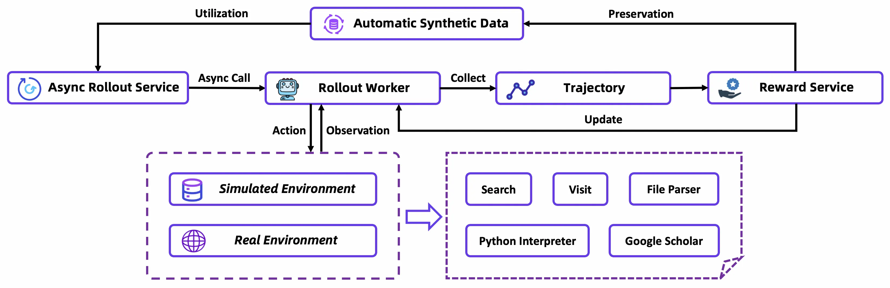

# 10.5 ： Deep Research Agent

 RL 、、 Web Agent / Code Agent 。****——Deep Research Agent（）。 AI ，、、，。

2025-2026 ，Deep Research Agent  Agentic RL 。、、、、、。

##  Deep Research Agent？

Deep Research Agent " + "。：** AI 、，、？** 、、、。

 Web Agent ，Deep Research Agent ：

|      | Web Agent                      | Deep Research Agent                        |
| -------- | ------------------------------ | ------------------------------------------ |
|  | （、） | （、、） |
|  |  3-10                    |  20-100+                             |
|  | /                  |  +  +          |
|  | 、             | 、、               |

###  vs  API：

Deep Research Agent ，：

****—— AI ，、、。 DeepResearcher（ RL ）[^deepresearcher]、WebAgent-R1（）。、，、。

** API **—— API  JSON 。 OpenResearcher（，）[^openresearcher]、PokeeResearch-7B（ API ）。、、，。

。—— Tongyi DeepResearch  Search（ API）、Visit（）、Python Interpreter  [^tongyi_dr]。

## ： ReAct 

Deep Research Agent 。，：


_：Deep Research Agent （：[Tongyi DeepResearch](https://tongyi-agent.github.io/blog/introducing-tongyi-deep-research/)）_

1. **ReAct：**
   -  Thought → Action → Observation。
   - ：、、。
   - ""。

2. **Iterative Research：**
   - """"， ReAct 。

   
   _：Tongyi DeepResearch （：[Tongyi DeepResearch](https://tongyi-agent.github.io/blog/introducing-tongyi-deep-research/)）_
   - " →  →  →  → "。
   - ，、。

3. **Multi-agent Synthesis：**
   - ，，、、、。
   - ，""""，。
   - DeepResearcher、Fathom-DeepResearch 。

：**ReAct ，iterative research ，multi-agent synthesis 。** Agentic RL ，，、、。

## 

 Deep Research 。 LLM """"。

### DeepResearcher： RL 

DeepResearcher **、** RL  [^deepresearcher]。 RAG ， prompt ——DeepResearcher ，。

："（Browsing Agents）"，。（RLVR），。


_：DeepResearcher  RL （：[GAIR-NLP/DeepResearcher](https://github.com/GAIR-NLP/DeepResearcher)）_

**：。**  DeepResearcher —— RL ，，****：

1. **（Planning）**：，
2. **（Cross-verification）**：，
3. ****：，
4. ****：，

 RL  agent ""——****。 Agentic RL ： SFT ， RL 。

### Tongyi DeepResearch：Agentic Mid-training + Post-training

 Tongyi DeepResearch  Deep Research  [^tongyi_dr]。 benchmark  OpenAI o3、DeepSeek-V3.1（671B）， 30.5B—— MoE（Mixture of Experts）， 3.3B ，。


_：Tongyi DeepResearch  RL （：[Tongyi DeepResearch](https://tongyi-agent.github.io/blog/introducing-tongyi-deep-research/)）_

**。** Tongyi DeepResearch  **Agentic Mid-training + Post-training** ：

1. **Agentic Mid-training（Agentic CPT）**：。： 32K  agentic ， 128K （64K-128K）agentic 。""，**agentic **——，""。，。

2. **Agentic Post-training**：——SFT （）、on-policy RL（ GRPO +）、（）。

**。** ，Tongyi DeepResearch ：

- **Context Management **：。Tongyi  Context Management——，""。。
- ****：。Mid-training ""（、）""（、）；Post-training  RL ，。 API 、、。

 BrowseComp、WebWalkerQA、FRAMES、HLE  benchmark  SOTA [^tongyi_dr]。

### PokeeResearch-7B：

PokeeResearch-7B  Deep Research ， 7B  [^pokeeresearch]。：****。

：""，（、、），7B ，。 Deep Research Agent —— A100 ， GPU 。

### SFR-DeepResearch：

Salesforce  SFR-DeepResearch ：****（Autonomous Single Agent）[^sfr_dr]。、、，。

****——。：、、，。SFR ****（、 RL ） RL  agent ，。

### rStar2-Agent：

rStar2-Agent  RL  [^rstar2]。 GRPO  agent RL  14B ，：**，**。

：， 100B+ ，rStar2-Agent —— RL （、）， 14B 。

```mermaid
flowchart LR
    subgraph "Deep Research Agent "
        A["Agentic Mid-training\n(Tongyi)"] --> B["SFT\n()"]
        B --> C["RL "]
        C --> D["\n(、)"]
    end

    subgraph ""
        E["\n(DeepResearcher)"]
        F[" API\n(OpenResearcher)"]
        G["\n(Tongyi)"]
    end

    C --- E
    C --- F
    C --- G

    style A fill:#e3f2fd,stroke:#1976d2,color:#000
    style D fill:#e8f5e9,stroke:#388e3c,color:#000
```

## ：""

 Deep Research ，""——， reward 。、。

### ：CaRR

****：Deep Research Agent 、""，""——， URL，。 outcome reward（）。

****： AI  Citation-aware Rubric Rewards（CaRR）[^carr_dr]  RL 。，，：

1. **Rubric **：（Rubrics）， Rubric 。
2. ****： Rubric 。
3. ****： URL（ 20 ），， Rubric 。
4. ****：， Rubric 。

 Rubric  Rubric 。（） $\alpha$ ， GRPO 。

****：CaRR ""——，、，"→→"。

### ：Atom-Searcher

****：Deep Research 。 reward（=1，=0），（credit assignment）——，。

****：Atom-Searcher **（Atomic Thought Reward, ATR）**[^atom_searcher]，，。： reward，""。

**""""？**  ATR ""。（" A  B"），。， token 。

****：ATR 。，。， ATR ， reward ——：，。

### ：DR Tulu

****：RL ——**Reward Hacking**。""，。""，""。，""。

****：Allen AI  DR Tulu  **RLER（Reinforcement Learning with Evolving Rubrics）**[^dr_tulu]——。""：

1. ****： Rubrics 。""，
2. ****：，。""
3. ****：。""

，""，。

****：RLER ""——，。 CaRR 、Web-Shepherd 。

###  RL：Memento

****：RL 、、。，。 Agent ？

****：Memento  [^memento]——****，""（Episodic Memory） Agent 。：

1. ****：
2. ****：，
3. ****：，

**？** Memento  GAIA （87.88% Pass@3）， RL 。：**""""**。，RL  Agent ——。，Memento  RL 。

### ：Web-Shepherd

****：，outcome reward（）。 Agent  30 ， 28 ，——outcome reward ，。

****：Web-Shepherd **（PRM）**  [^web_shepherd]。 ORM（Outcome Reward Model），PRM ，。

****：Web-Shepherd  PRM ， outcome reward 、。

****：PRM  10.9 。，""，——****。

****：Web-Shepherd  PRM  Atom-Searcher  ATR （），——PRM ，ATR 。。

## ：RL ""

、 Deep Research Agent ，。。

### OpenResearcher：

****： Deep Research Agent ，、API 、。。

****：OpenResearcher **、** [^openresearcher]。，""：`search`（）、`open`（）、`find`（）。，、。

****：OpenResearcher  97K ， 100+ 。。

****：，OpenResearcher —— API key， GPU ，。：、。

### Tongyi DeepResearch ：、

Tongyi DeepResearch  [^tongyi_dr] ，。**、**，：

- **Mid-training **： agent ，。：
  - ****：，（、）
  - ****：——
  - ****：，，
  - ****：，

- **Post-training **：，（），， PhD 

**""**：。，，。，。

### O-Researcher： (Multi-Agent Distillation)

****： LLM（ GPT-4 API），，“”， Agent 、。

****：OPPO AI Agent  O-Researcher [^oresearcher] **（Multi-Agent Distillation）** 。，“”：

1. ** (Planner Agent)**：。
2. ** (Searcher/Executor Agent)**：、。
3. ** (Summarizer Agent)**：，、。
4. ** (Reviewer Agent)**：（Debate），，。

****：“”，**、（Long-Horizon）** 。，O-Researcher ，（SFT） Agentic RL（ GRPO），“”（ 7B/72B）。：**， SFT （Data Synthesis），， Agent 。**

### Fathom-DeepResearch：

****：""—— GPT-4 ，。

****：Fathom-DeepResearch ****（Multi-agent Self-play） DUETQA  [^fathom_dr]。 4B ：

- **（Fathom-Search-4B）**：
- **（Fathom-Synthesizer-4B）**：

——，，、。

****：Fathom  GAN（）——。，。"" agent 。

## ："" Deep Research？

>  Deep Research 。 Agentic （、、 benchmark ） [10.3 ：、 Badcase](./industrial-evaluation)。

Deep Research Agent ""。 Deep Research ：

|        |                  |                          |
| ---------- | -------------------- | -------------------------------- |
|  |      | （Exact Match/F1） |
|  |  |  URL  +    |
|  |  |  PRM                   |
|    |  |            |

：

- **GAIA**：，、。
- **Humanity's Last Exam (HLE)**：，。
- **BrowseComp / BrowseComp-ZH**： seeking ，、、。
- **WebWalkerQA**：，""。
- **FRAMES**：，""。
- **xbench-DeepSearch**：，。
- **WebArena / Mind2Web**：，。
- **BFCL**：/API ，。

 benchmark ，：

- ****：GAIA、HLE、FRAMES、xbench-DeepSearch
- ****：BrowseComp、BrowseComp-ZH、WebWalkerQA
- ****：WebArena、Mind2Web、BFCL

 Deep Research Agent ：""，""，""。，，，。

### ？

""， RL ：

- ****：、URL 
- ****：，
- ****：，
- ****：， token 
- ****：，

## ：

，：

**——：**

```python
#  reward：
reward = 1.0 if answer == ground_truth else 0.0
```

**——：**

```python
# 
reward = (
    accuracy_score(answer, ground_truth)      # 
    + 0.2 * valid_tool_call_ratio             # 
    - 0.1 * (num_turns / max_turns)           # 
)
```

**——：**

```python
#  +  + 
reward = (
    0.4 * accuracy_score(answer, ground_truth)
    + 0.3 * citation_quality_score(answer)    #  + 
    + 0.2 * cross_validation_score(answer)    # 
    + 0.1 * efficiency_bonus(num_turns)       # 
)
```

## 

|          |      |                                             |
| ------------ | -------- | --------------------------------------------------- |
| Awesome-GRPO |    |  GRPO  RL                         |
| LLM-Explorer |  | ， RL ， 37.27% |
| WebSailor-V2 |  |  RL  Agent  |
| ReLook       |  |  LLM  RL，      |

## 

 Deep Research Agent，：

1. **DeepResearcher**： RL ，""。
2. **OpenResearcher**：， Deep Research 。
3. **rStar2-Agent**： RL ，。

## ：Deep Research 

""""——Deep Research """"。 Deep Research ****：。、、， Agent 。

###  RL 

、""， RL ：

**。** 、、、。 trade-off——。

**。**  3000-10000 ， RLHF （500-1000 ）。。

**。** ——、、。。

###  RL：LongWriter-Zero

LongWriter-Zero[^longwriter] ：，****。：

```python
def longwriter_reward(text, prompt):
    """ reward"""
    # 1. （）
    target = extract_target_length(prompt)
    length_reward = compute_length_reward(len(text), target)

    # 2. （ RM ）
    quality_reward = writing_quality_model.score(text)

    # 3. （、、）
    structure_reward = evaluate_structure(text)

    return 0.3 * length_reward + 0.4 * quality_reward + 0.3 * structure_reward
```

：**RL **。 SFT ， reward 。

Writer-R1[^writerr1] ****—— Memory-augmented Replay Policy Optimization，""""，，。

### 

RL-Struct[^rlstruct] ****，：

|     |                                |      |
| ------- | -------------------------------------- | ------------ |
| Level 0 | （ JSON/Markdown）   |  = 0   |
| Level 1 |                          |  |
| Level 2 | （，） |  |
| Level 3 | （、）                 | RM   |
| Level 4 | （、）                 | RM   |

（ 0 ），（RM ）。，。

###  Reward 

：

```python
def report_reward(report, task, verified_facts=None):
    """ reward"""
    accuracy = accuracy_reward(report, verified_facts or {})
    structure = structure_reward(report)
    citation = citation_reward(report)
    length = length_reward(len(report), task.target_length)
    relevance = compute_relevance(report, task.question)

    return (
        0.30 * accuracy +
        0.20 * structure +
        0.15 * citation +
        0.10 * length +
        0.25 * relevance
    )
```

****—— 500 ， 5000 。 10.2  HardGen[^hardgen] 。

### Deep Research  RL

 Deep Research ：

```
 1:  RL
  → 、、
  → reward:  + 

 2:  RL
  → 、、
  → reward:  +  + 
```

——""，""。， RL 。

## ： Rubrics  Search Agent RL 

、、。，：**， RL  AI  Agent？**  Reward Model ， RL 。

### Step 1： AI  Rubrics

Rubrics（）""。 AI  Agent ：

|        |                      |                 |
| ---------- | ------------------------ | ----------------------- |
|  |          |  + LLM    |
|  |        |       |
|    |          | URL  +  |
|  |  |           |
|      |            |             |

 1-5 ，""：1  = ，3  = ，5  = 。

### Step 2： Rubrics  Reward Model

 Rubrics， Reward Model。

**。**  query，（）。（ LLM-as-Judge） Rubrics ，——" A  B "。

**RM 。**  Bradley-Terry （ 8 ） Reward Model。 (query, search_result) ，。 RM  RL  reward 。

：** RM， Rubrics  RM？**

 RM ， credit assignment。 RM ，。， RM ， RM。

```python
def train_search_reward_model(preference_data, base_model):
    """ Reward Model"""
    # preference_data: [(query, result_better, result_worse), ...]
    #  Bradley-Terry 
    # loss = -log(sigmoid(rm(query, better) - rm(query, worse)))

    rm = RewardModel(base_model)
    for query, better, worse in preference_data:
        score_better = rm.score(query, better)
        score_worse = rm.score(query, worse)
        loss = -torch.log(torch.sigmoid(score_better - score_worse))
        loss.backward()
        rm.update()
    return rm
```

### Step 3： RL  Search Agent

 RM， RL 。 GRPO （ Critic）：

```python
async def search_agent_grpo_step(model, rm, queries, group_size=4, max_turns=10):
    """Search Agent  GRPO """
    all_groups = []

    for query in queries:
        trajectories = []
        for _ in range(group_size):
            # Rollout: Agent 
            result = await rollout_search_agent(model, query, max_turns)
            #  RM 
            reward = rm.score(query, result.final_answer)
            #  Rubrics  reward
            reward += 0.2 * citation_bonus(result)       # 
            reward += 0.1 * efficiency_bonus(result)      # 
            reward -= 0.3 * hallucination_penalty(result)  # 
            trajectories.append((result, reward))

        # 
        trajectories.sort(key=lambda x: x[1], reverse=True)
        all_groups.append(trajectories)

    # GRPO 
    for group in all_groups:
        best, worst = group[0], group[-1]
        if best[1] > worst[1]:
            await model.grpo_update(
                prompt=best[0].prompt,
                chosen=best[0].trajectory,
                rejected=worst[0].trajectory,
                advantage=best[1] - worst[1]
            )

    return all_groups
```

### Step 4：Reward Hacking 

RL  **Reward Hacking**——" reward "，。：

- ****：" reward "， 3-4 （）
- ****： ground truth ，
- ****：""，

**。** （）。 RM ，， Reward Hacking 。

**。** DR Tulu[^rler_dr]  RLER（）—— Rubrics ""，，""。，CaRR[^carr_dr] ——，。

### Step 5：

（），：

**。** ：、、。，""。

**。** ——""、""。

**。** ""（、）""。

"Rubrics → RM → RL → Hacking  → "。 Rubrics、 RM、 RL  reward 。

## ：Search-R1—— RL  LLM " + "

::: info 

，：

-  Search-R1  Wikipedia 
- （interleaved reasoning & search） Rollout 
-  GRPO  PPO  3B-7B ，****、、
-  NQ、HotpotQA、TriviaQA  7  QA benchmark  **Qwen2.5-7B  41%、3B  20%** 
-  Retrieved Token Masking、outcome reward、

：[PeterGriffinJin/Search-R1](https://github.com/PeterGriffinJin/Search-R1)
：Jin et al. "Search-R1: Training LLMs to Reason and Leverage Search Engines with Reinforcement Learning" (arXiv 2503.09516)
：Bowen Jin (UIUC), Hansi Zeng (UMass Amherst), Zhenrui Yue, Jinsung Yoon, Sercan O. Arik (Google Cloud AI Research), Dong Wang, Hamed Zamani, Jiawei Han (UIUC)

:::

### Search-R1 ？

Search-R1  LLM  RL ****。 prompt ""，** + **。


_：Search-R1 （：[PeterGriffinJin/Search-R1](https://github.com/PeterGriffinJin/Search-R1)）_

，；，：

```text
: "Which novel by the author of 'The Old Man and the Sea' won the Pulitzer Prize?"

（）:
<thinkpad>...  of 'The Old Man and the Sea' ？</thinkpad>
<search>author The Old Man and the Sea</search>
<information>Ernest Hemingway wrote The Old Man and the Sea (1952)...</information>
<thinkpad>... Hemingway ？</thinkpad>
<search>Ernest Hemingway Pulitzer Prize novel</search>
<information>The Old Man and the Sea won the Pulitzer Prize for Fiction in 1953.</information>
<thinkpad>... </thinkpad>
<answer>The Old Man and the Sea</answer>
```

：**""**—— RL  rollout + reward 。 DeepResearcher [^deepresearcher] ""。


_：Qwen2.5-7B-Base （：[PeterGriffinJin/Search-R1](https://github.com/PeterGriffinJin/Search-R1)）_

###  Search-R1 ？

 Deep Research ，Search-R1 ：

|      | Search-R1                            |                           |
| -------- | ------------------------------------ | --------------------------------- |
|  | ** L4 (24GB)  PPO demo** | DR Tulu  2 GPU，Tongyi  |
|  | ** Wikipedia， API key**     | DeepResearcher  Serper/Bing API |
|      |  QA                | Tongyi              |
|      | veRL， ~1000 ，        | rLLM/AReaL          |
|      | 3B-7B                            | DR Tulu 8B，Tongyi 30B            |
|  | 7  benchmark       |               |

### 

#### 

|                     |                                        |
| ----------------------- | ---------------------------------------------- |
| ** L4 (24GB)**      | PPO  Qwen2.5-3B，Jupyter Notebook  |
| ** A100 (40/80GB)** | GRPO/PPO  Qwen2.5-7B                       |
| **2-4  A100**         | 30B+                           |

::: tip
Search-R1  [Lightning Studio  Notebook](https://lightning.ai)， L4  PPO 。
:::

#### ：

```bash
# 
conda create -n searchr1 python=3.9
conda activate searchr1

#  PyTorch（CUDA 12.1）
pip install torch==2.4.0 --index-url https://download.pytorch.org/whl/cu121

#  vLLM（）
pip3 install vllm==0.6.3

#  veRL（RL ）
git clone https://github.com/PeterGriffinJin/Search-R1.git
cd Search-R1
pip install -e .

# Flash Attention 2（）
pip3 install flash-attn --no-build-isolation

# 
pip install wandb
```

#### ：（）

（ Wikipedia），：

```bash
conda create -n retriever python=3.10
conda activate retriever

# PyTorch（faiss-gpu  conda ）
conda install pytorch==2.4.0 torchvision==0.19.0 torchaudio==2.4.0 \
    pytorch-cuda=12.1 -c pytorch -c nvidia

# 
pip install transformers datasets pyserini
conda install -c pytorch -c nvidia faiss-gpu=1.8.0

# API 
pip install uvicorn fastapi
```

#### 

```bash
python -c "import vllm; import verl; print('OK')"
#  OK，
```

### 

Search-R1 。** Wikipedia **—— API key、。

#### 

 QA ， HuggingFace ：

```bash
# 
# ：
# - Natural Questions (NQ)
# - HotpotQA（）
# - TriviaQA
# - 2WikiMultiHopQA
# - MuSiQue
# - Bamboogle
# - BeerQA
```

####  Wikipedia 

```bash
# 
bash retrieval_launch.sh
```

`retrieval_launch.sh` ：

|      |                  |            |
| -------- | -------------------- | ------------------ |
| `sparse` | BM25         | ， GPU |
| `dense`  | ANN          | ， |
| `online` |  Serper/Bing API |    |

 `sparse` ， `dense` 。

### 

#### ：

Search-R1 ****。 `<thinkpad>...</thinkpad>` ， `<search>query</search>` ， `<information>...</information>` ：

```mermaid
flowchart TD
    Q[""] --> T1["<thinkpad>... </thinkpad>"]
    T1 --> S1["<search>query1</search>"]
    S1 --> R1["<information>...</information>"]
    R1 --> T2["<thinkpad>... </thinkpad>"]
    T2 --> S2["<search>query2</search>"]
    S2 --> R2["<information>...</information>"]
    R2 --> T3["<thinkpad>... </thinkpad>"]
    T3 --> A["<answer></answer>"]

    style T1 fill:#e3f2fd,stroke:#1976d2
    style T2 fill:#e3f2fd,stroke:#1976d2
    style T3 fill:#e3f2fd,stroke:#1976d2
    style S1 fill:#fff3e0,stroke:#f57c00
    style S2 fill:#fff3e0,stroke:#f57c00
    style A fill:#e8f5e9,stroke:#2e7d32
```

#### Retrieved Token Masking

 token（`<information>` ） RL loss  **mask **—— token 。：，。

 [10.1 ](./intro)  Agent Loop ：**，**。

#### 

Search-R1  **outcome reward**（）：

```python
#  = 1.0， = 0.0
reward = 1.0 if answer_matches(response, ground_truth) else 0.0
```

、。， 0/1 —— DeepSeek-R1  RLVR ： +  rollout = 。

#### GRPO 

```bash
#  Qwen2.5-7B-Instruct（ A100 40GB+）
bash train_grpo.sh
```

`train_grpo.sh` ：

|                        |                      |                        |
| -------------------------- | -------------------------- | -------------------------- |
| `actor_model_name_or_path` | `Qwen/Qwen2.5-7B-Instruct` | （ 3B）      |
| `max_new_tokens`           | 2048                       |  rollout  token  |
| `group_size`               | 4-8                        | GRPO               |
| `temperature`              | 0.7                        |                    |
| `max_turns`                | 10                         |                |
| `reward_fn`                | `exact_match`              |                    |

#### PPO 

```bash
# PPO  Value Function，
bash train_ppo.sh
```

PPO  GRPO  Critic ， advantage 。，GRPO  PPO ，。

#### （）

 30B+ ，/：

```bash
#  example/ 
#  PET_NODE_RANK 
export PET_NODE_RANK=0  # 
# 
export PET_NODE_RANK=1  # 
```

### 

#### 

```bash
python infer.py \
    --model_path ./checkpoints/searchr1_qwen7b_grpo \
    --retriever_url http://localhost:8000 \
    --max_turns 10
```

####  benchmark

Search-R1  7  QA benchmark ：

| Benchmark              |          |  |
| ---------------------- | ------------ | ---- |
| Natural Questions (NQ) |  |    |
| TriviaQA               |      |    |
| HotpotQA               |      |    |
| 2WikiMultiHopQA        |      |    |
| MuSiQue                |      |  |
| Bamboogle              |      |    |
| BeerQA                 |      |    |

#### 

（ RAG baseline ）：


_：LLaMA3.2-3B-Base RL （：[PeterGriffinJin/Search-R1](https://github.com/PeterGriffinJin/Search-R1)）_

|         | Baseline (RAG) | Search-R1 (RL) |      |
| ----------- | -------------- | -------------- | -------- |
| Qwen2.5-7B  | ~35%           | **~76%**       | **+41%** |
| Qwen2.5-3B  | ~30%           | **~50%**       | **+20%** |
| LLaMA3.2-3B | ~25%           | **~35%**       | **+10%** |

::: details ：

Search-R1++ (arXiv 2602.19526) ，（prompt 、reward 、），。****（RL ），。
:::

### 

#### Rollout 

Search-R1  rollout  `search_r1/` 。：

1. ** token**， `<search>` 
2. ****， query
3. ****（ Wikipedia  API）
4. ****（`<information>...</information>`）
5. ****， `<answer>` 

```python
#  rollout 
def rollout(model, question, retriever, max_turns=10):
    context = format_prompt(question)
    for turn in range(max_turns):
        # ， <search>  <answer>
        output = model.generate(context, stop_tokens=["<search>", "<answer>"])

        if "<answer>" in output:
            return extract_answer(output)

        #  query
        query = extract_search_query(output)

        # 
        search_results = retriever.search(query, top_k=3)

        # ，
        context += output + f"<information>{search_results}</information>"

    return context  # ，
```

#### Token Masking 

```python
# ： token  token
#  token  loss 
#
#  info_mask：
#   1 =  token（ loss）
#   0 =  token（mask ， loss）
#
#  veRL ：
# - <thinkpad>...</thinkpad>  token -> mask=1（）
# - <search>...</search>  token -> mask=1（）
# - <information>...</information>  token -> mask=0（）
# - <answer>...</answer>  token -> mask=1（）
```

 [10.1 ](./intro)  Agent Loop ：。

#### GRPO 

Search-R1  veRL  GRPO，：

1.  `group_size` 
2.  outcome reward （0  1）
3.  advantage：$A_i = \frac{r_i - \mu}{\sigma + \epsilon}$
4.  advantage 

### 

，：

** 1：Before / After **

| Benchmark | Base Model (RAG) | Search-R1 (RL) | Delta  |
| --------- | ---------------- | -------------- | ------ |
| NQ        | __           | __         | __ |
| HotpotQA  |                  |                |        |
| TriviaQA  |                  |                |        |
| ...       |                  |                |        |

** 2：**

|                   |  |
| --------------------- | ---- |
|  GPU          |      |
|  /    |      |
|  rollout token  |      |
|  epochs           |      |

** 3：Badcase **

 10-20 ，：

-  query ？
- ？
- ？
- ？

 Deep Research Agent 。 reward hacking （reward  eval ）、trajectory 、 query 。

### 

 Search-R1 ，：

1. ** reward **： 0/1 outcome reward  CaRR[^carr_dr]  Atom-Searcher[^atom_searcher] 
2. ****： Serper/Bing API， DeepResearcher[^deepresearcher]  RL
3. ** + SFT**： O-Researcher[^oresearcher] ， SFT  RL
4. ****： 30B+ ， Tongyi DeepResearch[^tongyi_dr] 
5. ****： DR Tulu[^dr_tulu]  RLER  reward， reward hacking

<details>
<summary>：Search-R1 </summary>

Search-R1  RL  Agent ：

- **RLVR（ 9 ）**：Search-R1  reward ""， Reward Model—— RLVR 。
- **GRPO（ 9 ）**：Search-R1  GRPO， +  PPO  Critic 。
- **Agent Loop（10.1 ）**：Search-R1  Rollout  Agent Loop ——。
- **ORM vs PRM（10.1 ）**：Search-R1  ORM（ reward）。Atom-Searcher[^atom_searcher]  Web-Shepherd[^web_shepherd]  PRM（）。
- **Retrieved Token Masking**： PPO  mask prompt token ——。

</details>

## 

 Search-R1 ， 5 、 Agentic RL 。 1–2  GPU ，。

|                                        |                                                                                                                                         |                             | GPU            |                                                                                                                                                                  |
| ------------------------------------------ | ----------------------------------------------------------------------------------------------------------------------------------------------- | ------------------------------- | -------------- | -------------------------------------------------------------------------------------------------------------------------------------------------------------------- |
| **GRPO from Scratch**（Sebastian Raschka） | 0.6B  MATH ， GRPO （advantages / rewards / logprobs / loss）                                           | MATH-500：**15% → 47%**         | 1            | [GitHub](https://github.com/rasbt/reasoning-from-scratch)                                                                                                            |
| **ART·E  Agent**（OpenPipe）       | Qwen 2.5 14B  Enron ，reward （ +  + ）                                     | ** o3**， <\$80 | 1×H100         | [ZenML ](https://www.zenml.io/llmops-database/building-art-e-reinforcement-learning-for-email-search-agent-development)                                      |
| **Agent RFT **（TensorOps）        | 7B  agent（search / list / read ）， grader  9 ， TRL / verl / OpenRLHF / Unsloth |  base vs fine-tuned       | 1×24GB（LoRA） | [TensorOps Blog](https://tensorops.ai/blog/practical-guide-to-agent-reinforcement-fine-tuning)                                                                       |
| **Open Deep Research**（OpenPipe ART）     | Qwen 2.5 14B  SFT + GRPO  agent， DeepResearch Bench ， Langchain Open Deep Research                            | ** Sonnet 4**               | 1×H200，~\$350 | [ART ](https://art.openpipe.ai/tutorials/open-deep-research)                                                                                                     |
| **Agentic AI **（Owkin）             | Qwen3-8B ，reward  5  LLM judge （ /  /  /  / ）                                | ** GPT-5**              | 2×H200         | [Owkin Blog](https://www.owkin.com/blogs-case-studies/unlocking-the-next-era-of-therapeutic-discovery-training-an-agentic-ai-researcher-with-reinforcement-learning) |

：（、 ground truth、），reward ，。 GRPO from Scratch ——， agentic 。

## 

### 、 Deep Research 

"→→"，： LLM ， RL 。****（mid-training vs  post-training）、****（ vs  vs ）、****（ vs  vs MoE）。

[^deepresearcher]: Zheng Y, et al. "DeepResearcher: Scaling Deep Research via Reinforcement Learning in Real-world Environments." [arXiv:2504.03160](https://arxiv.org/abs/2504.03160), EMNLP 2025. ****： RL 。RL 、、，——"RL "。

[^tongyi_dr]: Tongyi DeepResearch Team. "Tongyi DeepResearch Technical Report." [arXiv:2510.24701](https://arxiv.org/abs/2510.24701), 2025. ****： Agentic Mid-training + Post-training ， Mid-training  agentic ， agent 。30.5B MoE（3.3B ） benchmark  SOTA， MoE  agent 。

[^sfr_dr]: Nguyen X-P, et al. "SFR-DeepResearch: Towards Effective Reinforcement Learning for Autonomously Reasoning Single Agents." [arXiv:2509.06283](https://arxiv.org/abs/2509.06283), 2025. ****：Salesforce ，——，。 RL  agent 。

[^pokeeresearch]: PokeeResearch-7B. [HuggingFace Model Card](https://huggingface.co/PokeeAI/pokee_research_7b), 2025. ****：7B ， Deep Research 。。

### 、

， Deep Research RL ：****。：""（outcome reward），。****（ vs ）****（ vs  vs ）。

[^carr_dr]: Zhang J, Lv X, Feng L, Hou L, Li J. "Chaining the Evidence: Robust Reinforcement Learning for Deep Search Agents with Citation-Aware Rubric Rewards." [arXiv:2601.06021](https://arxiv.org/abs/2601.06021), 2026. ****： AI 。 Rubric，，"" Deep Research 。

[^atom_searcher]: Deng Y, et al. "Atom-Searcher: Enhancing Agentic Deep Research via Fine-Grained Atomic Thought Reward." [arXiv:2508.12800](https://arxiv.org/abs/2508.12800), 2025. ****：（ATR），。 RL ——， reward ，ATR 。

[^dr_tulu]: Shao R, Asai A, et al. "DR Tulu: Reinforcement Learning with Evolving Rubrics for Deep Research." [arXiv:2511.19399](https://arxiv.org/abs/2511.19399), 2025. ****：Allen AI 。RLER ——，。"" Reward Hacking：，。

[^rler_dr]: Shao R, Asai A, et al. "DR Tulu: Reinforcement Learning with Evolving Rubrics for Deep Research." [arXiv:2511.19399](https://arxiv.org/abs/2511.19399), 2025. ， RL ， Reward Hacking。

[^web_shepherd]: Chae H, et al. "Web-Shepherd: Advancing PRMs for Reinforcing Web Agents." [arXiv:2505.15277](https://arxiv.org/abs/2505.15277), NeurIPS 2025 Spotlight. ****：（PRM）， WebAgent  10.9 ， agent 。

[^rstar2]: Shang N, et al. "rStar2-Agent: Agentic Reasoning Technical Report." [arXiv:2508.20722](https://arxiv.org/abs/2508.20722), 2025. ****： GRPO  Agent RL ， 14B 。—— RL 。

### 、

 Deep Research RL ""——、、。：，。****，（ vs  vs ）。

[^openresearcher]: Li Z, Jiang D, et al. "OpenResearcher: A Fully Open Pipeline for Long-Horizon Deep Research Trajectory Synthesis." [arXiv:2603.20278](https://arxiv.org/abs/2603.20278), 2026. ****：——97K+ ，，（search/open/find）。。

[^oresearcher]: Yao Y, Zhu H, Wang P, et al. "O-Researcher: An Open Ended Deep Research Model via Multi-Agent Distillation and Agentic RL." [arXiv:2601.03743](https://arxiv.org/abs/2601.03743), 2026. ****：OPPO AI Agent 。（、、、）、。 SFT ， SOTA，“ + ”。

[^browsecomp]: OpenAI. "BrowseComp: A Benchmark for Browsing Agents." [OpenAI Research](https://openai.com/index/browsecomp/), 2025. ****： 1,266  hard-to-find information ， Deep Research / browsing agent 。

[^fathom_dr]: Singh S, Singh K, Moturi P. "Fathom-DeepResearch: Unlocking Long Horizon Information Retrieval and Synthesis for SLMs." [arXiv:2509.24107](https://arxiv.org/abs/2509.24107), 2025. ****： 4B """"， DUETQA 。：，。

[^hardgen]: Hao B, et al. "From Failure to Mastery: Generating Hard Samples for Tool-use Agents." [arXiv:2601.01498](https://arxiv.org/abs/2601.01498), 2026. ****：。""——，，。

### 、 RL

 Deep Research ""——。：（3000-10000 ）、、。**** RL ，。

[^longwriter]: Wu Y, et al. "LongWriter-Zero: Mastering Ultra-Long Text Generation via Reinforcement Learning." [arXiv:2506.18841](https://arxiv.org/abs/2506.18841), 2025. ****： RL ——， reward（++）。

[^writerr1]: Zhao J, et al. "Writer-R1: Enhancing Generative Writing in LLMs via Memory-augmented Replay Policy Optimization." [arXiv:2603.15061](https://arxiv.org/abs/2603.15061), 2026. ****： Memory-augmented Replay Policy Optimization，""""，。

[^rlstruct]: Hu R, Wu S. "RL-Struct: A Lightweight Reinforcement Learning Framework for Reliable Structured Output in LLMs." [arXiv:2512.00319](https://arxiv.org/abs/2512.00319), 2025. ****：，，（ 0 ），（RM ）。，。

### 

[^memento]: Zhou H, et al. "Memento: Fine-tuning LLM Agents without Fine-tuning LLMs." [arXiv:2508.16153](https://arxiv.org/abs/2508.16153), 2025. ****：Memento ——****， Agent 。 GAIA （87.88% Pass@3），：""""。，RL  Agent ，。

[^trl_grpo]: Hugging Face TRL. "GRPO Trainer." [](https://huggingface.co/docs/trl/en/grpo_trainer). ****： `GRPOTrainer`、 `reward_funcs`、Qwen 0.5B Instruct ，/， reward  LLM  RL 。

， 10 。，——[](../chapter12_future_trends/intro)， RL 。
