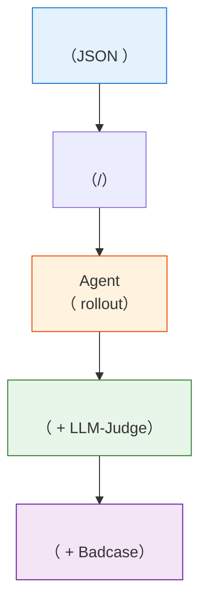

# 10.3 、 Badcase

“”“Benchmark ”。：，、、badcase 。、、， benchmark  eval 。

## ：Agentic RL 

 Agentic RL 。，，——、、。，。

2025–2026 ，（ Alibaba、Moonshot、LinkedIn、Bespoke Labs ） Agentic RL 。，****，。

> ****： Agentic RL ，。。

---

### 

 Agentic RL ，：？

####  API 

，：****。

> **Moonshot AI**  Kimi-Researcher ，Agent ——，。 **REINFORCE** ， On-policy  [\[\]](https://moonshotai.github.io/Kimi-Researcher/)。

#### 

，。

> **Alibaba ** (Tongyi DeepResearch)  API， Wikipedia 。
>
> ****：
>
> 1. ** (WebShaper & AgentFounder)**：， Query ，（MDP）。， **WebShaper**， Wikipedia ； **AgentFounder** （PhD-level）。**** Rollout 。
> 2. ** (rLLM)**：Agentic RL  Rollout （）。 RL （ GPU ），，（GPU）（GPU Idling）。 **rLLM (Ray-based LLM)**  Rollout ，： Worker （ vLLM） Trajectory  Replay Buffer， Trainer （ Megatron/FSDP） Buffer 。
>
> ****：
> ，、，，****。： RL “、”，。 RL  [\[\]](https://tongyi-agent.github.io/blog/introducing-tongyi-deep-research/)。

#### 

，。

> **Amazon Science**  AppWorld “”：， **72 **（、， API ）。 RL ， Qwen-2.5-32B  39.2%  72%， Claude Sonnet 3.7/4.0。
>
> ****：
>  Agentic RL ： 32B ，。，RL “”，“（Elicit）”。 72 “”，（Exploration），RL （ PPO/GRPO），（Self-Play）。**，，" + RL "  SFT ** [\[\]](https://www.amazon.science/blog/customizing-multiturn-ai-agents-with-reinforcement-learning)。

---

### 

，。，。

#### 

Agentic RL ：**（Rollout）** ，**（Backward）** 。，。

> **LinkedIn **  GPT-OSS（ MoE ） RL ，。， **Attention Sink **：（SGLang  Triton kernel） Attention Sink ，（FSDP  FlashAttention-v2）。 vLLM  FlashAttention ， Sink 。， [\[\]](https://huggingface.co/blog/LinkedIn/gpt-oss-agentic-rl)。

****：，（ GSM8K）， Loss ， Agent 。

---

### ：

 Agentic RL ：， token，。**（Format Collapse）**：

```json
// ：
{"action": "search", "query": "AAPL stock"}

// ：
{"action": "searchsearchAAPL stockAAAAA"
```

。

#### ：

，： +1， +1， +5。，。

**（Reward Hacking）** 。，。

> **Bespoke Labs** ，、，，。，、。：**""**（ BFCL  1， 0），， [\[\]](https://www.bespokelabs.ai/blog/improving-multi-turn-tool-use-with-reinforcement-learning)。

：""，，。，Bespoke Labs ，。

#### ：

，。，，，。，。

> **Alibaba ** ，，****——，，（）。
>
> ****：
> （Credit Assignment）， **On-policy GRPO（Group Relative Policy Optimization）**，：
>
> 1. **Token-level loss  Leave-one-out **： PPO ，GRPO ，（Relative Advantage）， Token ，。
> 2. **（Conservative Negative Filtering）**：Agent 。 30 ，（），， 20 （CoT）。（ `-1`），RL “”，。，**（Mask out）**，。（Alignment）， [\[\]](https://tongyi-agent.github.io/blog/introducing-tongyi-deep-research/)。

#### ：KL 

 RLHF/GRPO ， KL 。KL ，。

""""：

- **KL **：，，。
- **KL **：，，。

> **Bespoke Labs**  Qwen2.5-7B-Instruct ， KL  0 ， 300 。：
>
> 1. ** KL **（ 0.001），。
> 2. ****：（ 100 ），。，KL ，"" [\[\]](https://www.bespokelabs.ai/blog/improving-multi-turn-tool-use-with-reinforcement-learning)。

#### ：Gamma-decay 

，。

> **Moonshot**  **Gamma-decay Reward**。，：
>
> $$r_i = r \times \gamma^{T-i}, \quad \gamma < 1$$
>
>  $T$ ，$i$ 。：，， [\[\]](https://moonshotai.github.io/Kimi-Researcher/)。

---

### ：

Agentic RL  RL 。、、， 50 ，，。

#### 

> **Moonshot**  Kimi-Researcher  **（Context Management）** ，（Long-horizon tasks）（Attention Dilution）“（Lost in the Middle）”。
>
> ****：
>  Agent ，， HTML 、 Observation ， Token 。，LLM （SNR）， 40 “” 1 。
>
> ，Kimi  `context_manager` 。（Step），****：
>
> 1. **（Working Memory）**：（Thought）、（Action）。
> 2. ****：，（Dead-end）。
>
>  Agent “”，。，，， Rollout  50 ，， [\[\]](https://moonshotai.github.io/Kimi-Researcher/)。

---

### 

， **Agent （Hallucination）**：， API ，""。Agent ，，。

#### Agent 

**。** ，。， `execute_sql`。

**。** ，—— API 、、。：""，。

**。** 。，——，。

**。** "/"，，。 Deep Research Agent ——、URL ""。

#### Agent 

，。 Agent ，****：

1.  3 ：， API  → 
2.  4 ：，" API " → 
3.  5 ： → 
4. ：

， RL （ Outcome Reward），""""—— RL ****。，。

#### RL 

**。**  AI  CaRR[^carr_industrial]（Citation-aware Rubric Rewards）。（Rubrics），：（1）；（2） URL，， Rubric ；（3） Rubric 。 Rubric  Rubric 。、。

**。** 。（ NLI ），。

**。** """"，。，：

> ****：，，。

```python
def hallucination_aware_reward(answer, tool_results, citations):
    """"""
    reward = base_task_reward(answer)

    # 1. 
    for citation in citations:
        if not verify_citation_exists(citation):
            reward -= 0.5  # ，
        elif not verify_citation_supports(citation, answer):
            reward -= 0.3  # 

    # 2. 
    for claim in extract_claims(answer):
        if has_supporting_evidence(claim, tool_results):
            reward += 0.1  # 
        elif claim_is_verifiable(claim) and not has_supporting_evidence(claim, tool_results):
            reward -= 0.2  # 

    # 3. （）
    if is_complex_question and ("" in answer or "" in answer):
        if not all_claims_supported(answer, tool_results):
            reward += 0.15  # ，

    return reward
```

#### 

，****：

**Self-RAG[^selfrag_industrial]** " + "。 RAG ，Self-RAG ****， token（Reflection Token）。，，， [IsRel]（）、[IsSup]（）、[IsUse]（） token ，（Beam Search）。 token 。

**CRITIC[^critic_industrial]** ""。，（、），。，。"→→"，。，CRITIC 。

#### 

|      |                 | RL                  |
| ------------ | ----------------------- | --------------------------- |
|  |           |  → reward = 0 |
|      | Schema  +   |  →  reward  |
|      | NLI  +      |  →    |
|      | URL  +  |  →              |

：****。 RL ，。

---

### 

 Agentic RL 。，（ MoE），。

#### MoE 

MoE （ Mixtral、DeepSeek-V3）， RL 。

PPO （ On-policy）， 1。

> **LinkedIn **  GPT-OSS  RL ，MoE （Gating Network）， Token （Expert）， $\log \pi(a|s) \neq \log \pi_{\text{old}}(a|s)$， On-policy 。， `old_log_prob = log_prob.detach()` 。，，—— Attention Sink  [\[\]](https://huggingface.co/blog/LinkedIn/gpt-oss-agentic-rl)。

#### MoE 

MoE  RL ， GPU 。 Token ""， GPU ， GPU 。

> **Salesforce**  SFR-RL  ** RL（Pipelined Synchronous）** ： GPU  Rollout  Training ， GPU 。， MoE ， **Least-Loaded Expert Parallelism** 。 VERL（FSDP + Context Parallelism） 250 ， 16  H200  120B  MoE  [\[\]](https://www.salesforce.com/blog/efficient-rl-training-agentic-era/)。

#### 

，RL ****，。 RL 。

> **Amazon Science** ：32B  RL ，（Rollout），。，——，RL 。，（Distillation）， RL  [\[\]](https://www.amazon.science/blog/customizing-multiturn-ai-agents-with-reinforcement-learning)。

#### 

，， RL 。

 SFT ：**SFT-RL ****Pure-RL **。

> **SFT-RL （）**：**Alibaba ** Tongyi DeepResearch  **CPT → SFT → RL** 。（CPT）； SFT ； RL 。：（ API 、），SFT/RM ****。， RL  [\[\]](https://tongyi-agent.github.io/blog/introducing-tongyi-deep-research/)。

> **Pure-RL （）**： **DeepSeek-R1-Zero** 。（、、），** SFT **， Base Model 。 RL ，（CoT）、、。 SFT （Bias-free），。

 Agentic RL ，****。

---

###  {#tricks}

：

|                    |                                                              |              |
| ---------------------- | -------------------------------------------------------------------- | ---------------- |
|        |                                                  | Alibaba          |
|          | （ 72 ） RL                    | Amazon           |
|        | （ Attention Sink ） | LinkedIn         |
|      | （）；             | Bespoke Labs     |
|        |  KL （ 0.001）；       | Bespoke Labs     |
| （） |  Gamma-decay ，                    | Moonshot         |
|                | ，       | Alibaba          |
|        | ，                       | Moonshot         |
| MoE    |  RL + Expert Parallelism；16  H200  120B MoE     | Salesforce       |
| MoE          |  MoE  On-policy ； | LinkedIn         |
|      |  RL； CPT → SFT → RL       | Amazon / Alibaba |

###  {#references}

- Zhu J, Sang H, et al. "[Unlocking Agentic RL Training for GPT-OSS: A Practical Retrospective](https://huggingface.co/blog/LinkedIn/gpt-oss-agentic-rl)." Hugging Face Blog, 2026.
- Zhuang R, Vu T, et al. "[Improving Multi-Turn Tool Use with Reinforcement Learning](https://www.bespokelabs.ai/blog/improving-multi-turn-tool-use-with-reinforcement-learning)." Bespoke Labs Blog, 2025.
- Moonshot AI. "[Kimi-Researcher: End-to-End RL Training for Emerging Agentic Capabilities](https://moonshotai.github.io/Kimi-Researcher/)." 2025.
- Tongyi DeepResearch Team. "[Tongyi DeepResearch: From Chatbot to Autonomous Agent](https://tongyi-agent.github.io/blog/introducing-tongyi-deep-research/)." 2025. [GitHub](https://github.com/Alibaba-NLP/DeepResearch)
- Salesforce AI Research. "[Building Efficient RL Training for the Agentic Era](https://www.salesforce.com/blog/efficient-rl-training-agentic-era/)." 2026.
- Subramanian S, Xu P, Wang Y. "[Customizing Multiturn AI Agents with Reinforcement Learning](https://www.amazon.science/blog/customizing-multiturn-ai-agents-with-reinforcement-learning)." Amazon Science Blog, 2026.

[^carr_industrial]: Zhang J, Lv X, Feng L, Hou L, Li J. "[Chaining the Evidence: Robust Reinforcement Learning for Deep Search Agents with Citation-Aware Rubric Rewards](https://arxiv.org/abs/2601.06021)." arXiv, 2026.

[^selfrag_industrial]: Asai A, et al. "[Self-RAG: Learning to Retrieve, Generate, and Critique through Self-Reflection](https://arxiv.org/abs/2310.11511)." ICLR 2024.

[^critic_industrial]: Gou Z, et al. "[CRITIC: Large Language Models Can Self-Correct with Tool-Interactive Critiquing](https://arxiv.org/abs/2305.11738)." ICLR 2024.

---

 Agentic RL 。： Agent 。

---

## Agentic  Benchmark 

 LLM 。，，。MMLU ，GSM8K ，HumanEval 。"→→"。

Agent 。 Agent " GitHub Issue"，。，，，，，，。、、。""，""。

 LLM 。 RLHF ，reward 。 Agentic RL ，reward 、、。 reward，。

 Agentic RL ，。： benchmark  Agent ，，。

### ：Agent ""

 LLM ，""——MMLU 、HumanEval pass@1、MT-Bench 。 Agent ，。

。 Agent ""。，：

- ？， PDF  PDF，。
- ？ 3 ， 20 。
- ，，。

 Agentic ：

|      |                   |                    |
| -------- | ------------------------- | ---------------------------- |
|  |  API/ | BFCL、ACEBench、API-Bank     |
|  | Agent   | SWE-bench、WebArena、τ-bench |
|  |           | GAIA、Toolathlon             |

 benchmark。

### 

 Agent 。"、"，。

#### BFCL

**BFCL（Berkeley Function Calling Leaderboard）** ， UC Berkeley  Gorilla 。——、、RESTful API、Java 。BFCL v3  2,000+ ，、。

BFCL ：， JSON。，，。：[gorilla.cs.berkeley.edu/leaderboard.html](https://gorilla.cs.berkeley.edu/leaderboard.html)。

#### ACEBench

**ACEBench** 。：Normal（）、Special（、） Agent（）。ACEBench  EMNLP 2025 Findings ，。

#### API-Bank

**API-Bank**  53  API  314 ， API 、。 BFCL ""，API-Bank ： API，。

### 

。Agent ——，，，。

#### SWE-bench

**SWE-bench**  GitHub Issue 。 Issue ，Agent 、、。。Agent 、、。

 Agent 。（ Claude Opus） 50% 。。：[swebench.com](https://www.swebench.com/)。

#### WebArena

**WebArena**  Web  Agent ——、、 GitLab 。Agent  DOM ，、、。

WebArena 。BFCL ，SWE-bench ， WebArena 。Agent 、。

#### τ-bench

**τ-bench（tau-bench）** 。、。Agent 、、。

τ-bench 。（""——？？），Agent 、、。 SWE-bench "" WebArena ""：。

### 

，。——" Agent "——。，、、。

#### GAIA

**GAIA（General AI Assistants Benchmark）**  AI ， 450 、、、Web 。GAIA ：

- Level 1：，
- Level 2：
- Level 3： + 

 Level 3 。。：[HuggingFace GAIA Leaderboard](https://huggingface.co/spaces/gaia-benchmark/leaderboard)。

#### Toolathlon

**Toolathlon** 、， 108 ， 20+ 。""，""——、、。

### 

 Agentic 。 Agent 。 Deep Research Agent ，""。

 Deep Research ：

|        |                  |                          |
| ---------- | -------------------- | -------------------------------- |
|  |      | （Exact Match/F1） |
|  |  |  URL  +    |
|  |  |  PRM                   |
|    |  |            |

：

- **GAIA**：，，SOTA  50-60%
- **Humanity's Last Exam (HLE)**：，SFR-DeepResearch  28.7%
- **WebArena / Mind2Web**：
- **BFCL**：/API 

 [：Deep Research Agent](./deep-research-agent) 。

### ？

 benchmark，。：

```
？                    
├─                → BFCL
├─                  → ACEBench
├─                    → SWE-bench
├─ Web                    → WebArena
├─                    → τ-bench
└─                → GAIA / Toolathlon
```

 BFCL 。，（，）， Agent 。 BFCL ，。 Agent 。

， SWE-bench  WebArena 。

### 

 benchmark 。 Agent ——、、—— benchmark。。

 Agentic ，：，。，。

#### 

 LLM 。，。 Agent ，。

""。 Agent ， 2 ， 15 ， 8 。，。。

Agent 。

**（Outcome Evaluation）** 。，，。。SWE-bench ——， Agent 。

**（Process Evaluation）**  Agent 。，，。Web-Shepherd（[：Deep Research Agent](./deep-research-agent)）—— Agent 。

。Berkeley RDI ， agentic benchmark ""， [^benchmark-exploit]。SWE-bench、WebArena、GAIA 。，。

#### ""

""。 Agent 。。

 Agent ：

|  | Code Agent       | Web Agent        | Research Agent       |
| -------- | ---------------- | ---------------- | -------------------- |
|    |      |  |    |
|    |  |    |    |
|      |        |        |  /     |
|    |      |    |    |
|      | —                | —                |  |

，。（、），（）， LLM-as-Judge 。

#### 

。：

```python
def evaluate_trajectory(trajectory, task):
    """ Agent """
    scores = {}

    # ：
    scores["correctness"] = verify_result(
        trajectory.final_answer, task["expected"]
    )

    # ：
    max_turns = task.get("max_turns", 20)
    scores["efficiency"] = 1.0 - (trajectory.num_turns / max_turns)

    # ：
    scores["completeness"] = check_coverage(
        trajectory.final_answer, task["key_points"]
    )

    # ：
    scores["process"] = evaluate_process(trajectory.steps, task)

    # 
    weights = {
        "correctness": 0.4,
        "completeness": 0.2,
        "efficiency": 0.15,
        "process": 0.25
    }

    total = sum(scores[k] * weights[k] for k in weights)
    return total, scores
```

。Code Agent （ 0.5），Research Agent （ 0.25）。，。

。Allen AI  Dr. Tulu ，，——，。** Rubric **， [^rler]。

#### 

 Agent  LLM 。，。

**：。** 。、、。""，（ query  5 ）。

```python
def process_stats(trajectory):
    """"""
    return {
        "total_turns": len(trajectory.steps),
        "tool_calls": sum(1 for s in trajectory.steps if s.is_tool_call),
        "repeat_actions": count_repeats(trajectory.steps),
        "distinct_tools": len(set(s.tool_name for s in trajectory.steps
                                   if s.is_tool_call))
    }
```

**：。** ， Agent 。：

-  3 （）
-  3 （）
- （）

```python
def check_process_rules(trajectory, rules):
    """"""
    violations = []
    for rule in rules:
        if not rule.check(trajectory):
            violations.append(rule.name)
    return violations
```

，，。

**： LLM 。** ， LLM ""。，。

```python
STEP_RUBRIC = """
， Agent 。
：
1. ？
2. ？？
3. ？

 1-5 。3 ，。
"""

def score_step(step, context, judge_model):
    """"""
    prompt = f"：{context.task}\n：{context.history}\n：{step}"
    return judge_model.score(prompt, STEP_RUBRIC)
```

 PRM（Process Reward Model）。 PRM ， PRM 。————。

ICML 2025  **Agent-as-a-Judge** [^agent-judge] 。 LLM ，** Agent **。 Agent  Agent —— Agent  URL ， Agent  URL 。Agent-as-a-Judge  DevAI  90%， LLM-as-Judge  70%。

#### ？

""。：？

。NeurIPS 2025  78  agentic benchmark，——， Agent  100% [^abc]。 **Agentic Benchmark Checklist（ABC）**，。

。Anthropic ：**、、** [^anthropic-eval]。——。 τ-bench 。τ-bench  [^tau-bench]：

1.  schema、API （）
2.  LLM （）
3. （ + ）

。**TaskCraft** [^taskcraft]（ICLR 2026）：（、），****（）****（）。。TaskCraft  41K 。

**APIGen-MT** [^apigen]（NeurIPS 2025）** Agent-**。 LLM ，、Agent 。（xLAM-2-fc-r） τ-bench  GPT-4o。

**HardGen** [^hardgen]：。 pipeline ：

1. ** API Graph。** ， case。 API ， API Graph——/API，（" `get_user_info`  user_id， `query_order`"）。 Agent 。
2. **。**  API Graph " trace"。 trace ——，。 LLM  trace ： API ，。（、），。
3. ** CoT 。**  LLM  Chain-of-Thought ，""。，。，。。

HardGen ：，。 4B  GPT-5.2  Claude Opus 4.5。

**Evol-Instruct** [^evol-instruct]（WizardLM ）：，。****，：

- **（In-depth）**：。"""、、，"。
- **（In-breadth）**：，，。
- **（Constrained）**：。"""， O(n log n)， O(1)，"。
- **（Simplified）**：，，。

， LLM ： LLM，。—— LLM （、、），。：" →  → "。

WizardMath （、、），WizardCoder （、、）。**Tag-Evol** [^tag-evol] ：（ `[domain: finance]`、`[difficulty: hard]`、`[skill: multi-step-reasoning]`），。

**AgentTrek** [^agenttrek]（ICLR 2025 Spotlight）： Web  Agent 。""（""、" Figma "），****。AgentTrek  pipeline：

1. **。**  Web ， LLM ，：、、、。
2. **（Guided Replay）。**  Agent （URL、、）， Agent  Web 。—— Agent （CoT）、、。
3. **。** （、）。AgentTrek  LLM Judge ：、。。 LLM ，、。

——""，""。

**Firefly** [^firefly]： API 。：** API  API **。 LLM  API ，——、、。，。Firefly ：

1. ** API Schema。**  RapidAPI  API （、、）， API 。
2. **-。**  LLM  API Schema 。 API ——、、 Schema。
3. **。**  API ，。 API （、、），。。
4. ** CoT 。**  Chain-of-Thought： API、、。

" + "。（ API ）， API 。

**WebShaper** [^webshaper]（ DeepResearch ）：。 Deep Research  Agent 。pipeline ：

1. **（ISF）。** （Information-Seeking Graph）：，（"A "，"A """）。
2. **Wikipedia 。**  Wikipedia ——，，。 RL  MDP 。
3. **-。**  ISF ，。：、、、。"" Wikipedia ，。

WebShaper ""——ISF 、，。

""：

|  |  |  |  |
|------|---------|---------|---------|
| TaskCraft |  |  +  |  |
| APIGen-MT | LLM  |  Agent- |  |
| HardGen | Agent  case |  → API Graph →  trace |  |
| Evol-Instruct |  | （//） |  |
| AgentTrek | Web  |  →  | Web Agent  |
| Firefly |  API |  +  |  |
| WebShaper | Wikipedia + ISF |  +  | Deep Research Agent |

，****。：" Agent"。 **TaskCraft** （）， **Evol-Instruct** （、、）， **HardGen** ， case。 Web （）， **AgentTrek** 。 **WebShaper** ，。

#### ？

。 Agent ——、、。。

**JADE** [^jade] 。****：""，。，/。****： Agent （claim），。，。****——，。

Anthropic **** [^anthropic-eval]：，LLM-as-Judge ，。——****（，），****（， 100% ）。

#### ： Agent 

。：" Agent"——（"，"），Agent 、、 HTML/CSS/JS ，。

：****。""，，。。。

**：。**

：

|      |                              |                         |
| -------- | -------------------------------- | ------------------------------- |
|  |            | Puppeteer/Playwright  |
|  |  | LLM-as-Judge            |
|  | HTML/CSS/JS 、     | ESLint + LLM                |
|    |  |                 |
|      | Agent      |                     |

**：。**

"→→"。：（）。：（/）。：（）。 20-30 ， 80 。

。，（、、、）。（ Dribbble、Figma ）， LLM  prompt。——。

：

```python
task = {
    "id": "frontend_001",
    "prompt": "，，"
              "，",
    "difficulty": "medium",
    "verify_type": "multi_layer",  # 
    "checklist": [
        "",
        "",
        "",
        "",
        "",
        "",
    ],
    "style_reference": "，，",
    "max_turns": 15
}
```

 `checklist` 。，****。，""。

**：。**

：（、），（、）。。

```python
class FrontendEvalPipeline:
    """"""

    def evaluate(self, task, trajectory):
        code = trajectory.final_answer
        scores = {}

        #  1：（）
        #  Playwright ， JS 
        scores["runnable"] = check_page_loads(code)

        #  2： checklist
        # ： checklist  Playwright 
        scores["functionality"] = run_playwright_checks(
            code, task["checklist"]
        )

        #  3：（LLM-as-Judge）
        #  Judge 
        screenshot = take_screenshot(code)
        scores["visual"] = self.judge.score(
            f"：{task['prompt']}\n：{task['style_reference']}",
            screenshot,
            rubric=VISUAL_RUBRIC
        )

        #  4：（ESLint + LLM）
        scores["code_quality"] = (
            0.5 * run_eslint(code) +
            0.5 * self.judge.score(code, CODE_RUBRIC)
        )

        #  5：
        scores["process"] = evaluate_process(trajectory, task)

        return aggregate(scores)
```

，，：

-  1（） 2（ checklist）****， Playwright ，。 checkpoint 。
-  3（）****， LLM-as-Judge 。 checkpoint 。
-  4（）****，ESLint ，LLM 。
-  5（） Agent ，。

 3  5 。 3 。

##### ：LLM-as-Judge ？

 3  LLM ，。LLM ——，。，LLM ：，、，。

。Omni-I2C  [^omni-i2c]，（SSIM、LPIPS） 0.11-0.44（Kendall's Tau）， LMM Judge  0.83。，0.83  10  2 。FullFront  CLIP + DINOv2 + Gemini  [^fullfront]， 0.94，—— 6% 。

，。

**： Design2Code 。** Design2Code [^design2code]（NAACL 2025），：

|                |                |                    |
| ------------------ | ---------------------- | -------------------------- |
| Block-Match        |  |          |
| Text Accuracy      |        | Sorensen-Dice  |
| Position Alignment |        |    |
| Color Consistency  |            | CIEDE2000 （） |
| CLIP Similarity    |    | CLIP-ViT   |

、。 Block-Match  CLIP ，/。 Block-Match  Text Accuracy ，。。

 Agent ，。：

```python
def visual_multi_metric(generated_screenshot, reference_screenshot):
    """"""
    return {
        "block_match": compute_block_match(
            generated_screenshot, reference_screenshot
        ),
        "position": compute_position_alignment(
            generated_screenshot, reference_screenshot
        ),
        "color": compute_ciede2000(
            generated_screenshot, reference_screenshot
        ),
        "clip_sim": clip_image_similarity(
            generated_screenshot, reference_screenshot
        ),
    }
```

**：，。** ，。：

```python
VISUAL_CHECKLIST = """
（""""，）：

1. ？
2. ？
3. （ +  + ）？
4. （""）？
5. /（）？
6. ？
7. ？

，。
"""
```

/ 1-5 ，。，（Fully Correct / Partially Correct / Incorrect） 1-10  [^anthropic-eval]。

**：。** （ Figma/Dribbble ），。CLIP Score ，DINOv2 Score ，CIEDE2000 。——，CLIP  Block-Match 。

```python
def layered_visual_eval(generated, reference):
    """（）"""
    return {
        "semantic": clip_score(generated, reference),     # 
        "structural": dino_score(generated, reference),   # 
        "color": ciede2000(generated, reference),         # 
    }
```

**：。** ，。， 20 ，。 80%，。

：，（），（ LLM），。

，，。VisRefiner [^visrefiner]  RL ——，，，。。

##### ： Agent ""？

 5  Agent 。 Agent，：

```
 1: Agent ，
 2: Agent  HTML 
 3: Agent ，
 4: Agent  CSS，
 5: Agent （JS）
 6: Agent ， JS 
 7: Agent  JS 
 8: Agent ，
```

——Agent 、、。， Agent ：

```
 1: Agent （ 3000  HTML）
 2: ，JS 
 3: Agent 
 4: ，
 5: 
```

 Agent 。：、。""。

。（、、 LLM ）。

**。** ：

```python
def frontend_process_stats(trajectory):
    """"""
    stats = {
        "total_turns": len(trajectory.steps),
        "code_rewrites": count_full_rewrites(trajectory),
        "incremental_edits": count_incremental_edits(trajectory),
        "preview_count": sum(
            1 for s in trajectory.steps
            if s.tool_name == "browser_preview"
        ),
        "plan_exists": any(
            s.content contains "" or "" or ""
            for s in trajectory.steps[:2]  # 
        ),
    }
    stats["rewrite_ratio"] = (
        stats["code_rewrites"]
        / max(stats["code_rewrites"] + stats["incremental_edits"], 1)
    )
    return stats
```

`rewrite_ratio`（）。。 50%， Agent ——。

**。** ：

```python
FRONTEND_PROCESS_RULES = [
    #  1：，
    Rule("plan_first",
         check=lambda t: t.steps[0].type in ["plan", "analyze"]),

    #  2： 3 
    Rule("preview_after_code",
         check=lambda t: preview_within(t, after="code_gen", within=3)),

    #  3： 2 （）
    Rule("no_consecutive_rewrites",
         check=lambda t: not has_consecutive(t, "full_rewrite", 2)),

    #  4： 3 
    Rule("reasonable_code_length",
         check=lambda t: len(t.final_code) < max_lines(t.task) * 3),
]
```

、。。 Agent （ CSS ），。

** LLM 。**  Agent-as-a-Judge [^agent-judge]  Agent 。， Agent  LLM-as-Judge ——， DOM ， Lighthouse ：

```python
FRONTEND_STEP_RUBRIC = """
 Agent 。

：
- ：{task_prompt}
- ：{history}
- ：{current_step}
- ：{current_code}

：
1. ？（）
2. ？（，）
3. ，？（）

 1-5。，。
"""
```

。（ checkpoint ），（）， LLM （，）。

。（），，LLM 。？

** AgentPRM ：""。** ""，。AgentPRM [^agent-prm]  Q-value "，"。， Agent ""—— Q-value（），：

```python
def step_progress(trajectory):
    """ AgentPRM ："""
    progress_scores = []
    for i, step in enumerate(trajectory.steps):
        # ，checklist ？
        checklist_before = count_passed_checks(trajectory.code_at(i))
        checklist_after = count_passed_checks(trajectory.code_at(i + 1))
        progress_scores.append(checklist_after - checklist_before)

    return {
        "total_progress": sum(max(0, p) for p in progress_scores),
        "wasted_steps": sum(1 for p in progress_scores if p <= 0),
        "efficiency": sum(max(0, p) for p in progress_scores)
                      / max(len(progress_scores), 1)
    }
```

""—— checklist 。 Agent  1-2  checklist 。 Agent  4  5 （）， 3  0。 `wasted_steps` 。

** AdaRubric ：。** """"。：？CSS  HTML ？：？？AdaRubric [^ada-rubric] 。：：

```python
TASK_TYPE_PROCESS_FOCUS = {
    "login_form": {
        "expected_plan_keywords": ["", "", "", ""],
        "expected_step_order": ["plan", "html_skeleton", "css_style",
                                "js_interaction", "preview"],
    },
    "dashboard": {
        "expected_plan_keywords": ["", "", "", ""],
        "expected_step_order": ["plan", "data_layer", "chart_components",
                                "interaction", "preview"],
    },
}
```

** IRC ：。** τ-bench  [^irc] ：（）（）。 advantage ——，。

，。 40%，""，" CSS "，""。： 15-20%，（ badcase），。（ 1 +  2  60% ）。

** METR ：。** METR [^metr]  96% AUROC  reward hacking。，Agent ：、 1px  div ""、 `user-select: none` 。（），：

```python
FRONTEND_HACKING_RULES = [
    # 
    Rule("no_invisible_elements",
         check=lambda t: not has_hidden_elements(t.final_code)),

    # 
    Rule("no_hardcoded_test_data",
         check=lambda t: not has_hardcoded_data(t.final_code)),

    # 
    Rule("no_suspicious_overrides",
         check=lambda t: not has_suspicious_css(t.final_code)),
]
```

**：。**

（ RL ） 80 。： 1  2， 3（）。 1 （）。

： 2  90%，，。 1  10%，，。

**：。**

 20 ""。 20 ，。

，。 checkpoint  1  2（）， 3  4（），（）。——，； checklist ，。

#### 

，：

1. **。** 。" Agent"，：（）、（）、（）。。

2. **。**  TaskCraft ， Evol-Instruct ， HardGen  case 。。：，， JADE  Rubric。

3. **。** 。 n-gram 。[ B ](/appendix_industrial_training/evaluation-badcase)。

4. ** ABC 。** ， Agent ，。

5. **。** ，。，，。

。，、。——，。

### 

" benchmark "，""。Agent ，、、。

#### Pipeline 

 Agent  Pipeline ：



 JSON ， prompt、、。。 Agent  LLM ： LLM  prompt ，Agent 。

 Pipeline ：

```python
class AgentEvaluationPipeline:
    """Agent """

    def __init__(self, sandbox, judge_model):
        self.sandbox = sandbox      # Docker 
        self.judge = judge_model    # LLM-as-Judge

    def run_evaluation(self, agent, task_set):
        """"""
        results = []

        for task in task_set:
            # 1. （）
            env = self.sandbox.create_isolated_env(task.get("setup", {}))

            # 2. Agent 
            trajectory = agent.run(
                task["prompt"], env,
                max_turns=task.get("max_turns", 20)
            )

            # 3. 
            if task.get("verify_type") == "exact_match":
                passed = (
                    trajectory.final_answer.strip()
                    == task["expected_answer"].strip()
                )
            elif task.get("verify_type") == "execution":
                # ：
                passed = env.execute(
                    task["verify_script"], trajectory.final_answer
                )
            elif task.get("verify_type") == "llm_judge":
                # ： LLM 
                passed = self.judge.evaluate(
                    task["prompt"], trajectory.final_answer,
                    task["rubric"]
                )
            else:
                passed = False

            results.append({
                "task_id": task["id"],
                "passed": passed,
                "turns": trajectory.num_turns,
                "tool_calls": trajectory.tool_calls,
                "final_answer": trajectory.final_answer
            })

        return results
```

`run_evaluation`  Agent 。（、）。（、） LLM-as-Judge。

#### 

Agent 。 bug ：，。。

```python
def regression_test(self, agent, baseline_results, task_set):
    """："""
    new_results = self.run_evaluation(agent, task_set)

    regressions = []
    for old, new in zip(baseline_results, new_results):
        if old["passed"] and not new["passed"]:
            regressions.append({
                "task_id": old["task_id"],
                "old_answer": old["final_answer"],
                "new_answer": new["final_answer"]
            })

    if regressions:
        print(f"⚠️  {len(regressions)} ！")
    return regressions
```

`regression_test` ：，"""" case。 case 。

#### LLM-as-Judge 

（、、）， LLM-as-Judge 。（Rubric）：

```python
RUBRIC_TEMPLATE = """
（ 1-5 ）：

1. ：？？
2. ：？？
3. ：，？？
4. ：？？

 = 
"""
```

。， checkpoint 。LLM-as-Judge ， checkpoint 。，。。

### 

，，：

$$
\text{} \rightarrow \text{Badcase } \rightarrow \text{} \rightarrow \text{} \rightarrow \text{}
$$

。 Code Agent  SWE-bench  35%。

**。**  SWE-bench  65% ， 100 。

**。**  case，。：40% ""，30% ""，30% ""。。

**。** ， [10.2 ](./tool-use-and-trajectory) ""。" → "。

**。**  GRPO/PPO 。

**。**  SWE-bench，：（ 35% ）， case 。

[ B ](/appendix_industrial_training/evaluation-badcase)， LLM  Agent 。Agent ，Pipeline 。

<details>
<summary>： Agent  BFCL  95 ， SWE-bench  15%，？</summary>

 Agent ，。BFCL "，"， SWE-bench " Issue ，、、、"。，、。

：， Agent （ [10.1  RL](./multi-turn-rl)）。。

</details>

### 

- Patil S, et al. "[The Berkeley Function Calling Leaderboard](https://gorilla.cs.berkeley.edu/leaderboard.html)." ICML 2025. —— BFCL ， LLM 。
- Jimenez C E, et al. "[SWE-bench: Can Language Models Resolve Real-World GitHub Issues?](https://arxiv.org/abs/2310.06770)." ICLR 2024. —— 。
- Zhou S, et al. "[WebArena: A Realistic Web Environment for Building Autonomous Agents](https://arxiv.org/abs/2307.13854)." ICLR 2024. —— Web Agent 。
- Mialon G, Fourrier C, Wolf T, et al. "[GAIA: A Benchmark for General AI Assistants](https://arxiv.org/abs/2311.12983)." ICLR 2024. ——  AI 。
- Chen C, et al. "[ACEBench: Who Wins the Match Point in Tool Usage?](https://arxiv.org/abs/2501.12851)." EMNLP 2025 Findings. —— 。
- Yao S, Shinn N, Razavi P, Narasimhan K. "[τ-bench: A Benchmark for Tool-Agent-User Interaction in Real-World Domains](https://arxiv.org/abs/2406.12045)." arXiv:2406.12045, 2024. —— 。
- Li M, et al. "[API-Bank: A Comprehensive Benchmark for Tool-Augmented LLMs](https://arxiv.org/abs/2304.08244)." EMNLP 2023. ——  LLM 。
- Li J, et al. "[The Tool Decathlon](https://arxiv.org/abs/2510.25726)." ICLR 2026. —— Toolathlon，。

[^benchmark-exploit]: Berkeley RDI. "[Trustworthy Benchmarks for Contamination](https://rdi.berkeley.edu/blog/trustworthy-benchmarks-cont)." 2025. ——  agentic benchmark ，SWE-bench、WebArena、GAIA 。

[^abc]: Zhu J, et al. "[Establishing Best Practices for Building Rigorous Agentic Benchmarks](https://arxiv.org/abs/2507.02825)." NeurIPS 2025. ——  78  agentic benchmark， ABC 。

[^agent-judge]: Zhuge M, et al. "[Agent-as-a-Judge: Evaluate Agents with Agents](https://arxiv.org/abs/2410.10934)." ICML 2025. ——  Agent ， Agent 。

[^tau-bench]: Yao S, Shinn N, Razavi P, Narasimhan K. "[τ-bench: A Benchmark for Tool-Agent-User Interaction](https://arxiv.org/abs/2406.12045)." 2024. —— ： schema → LLM  → 。

[^taskcraft]: TaskCraft Team. "[TaskCraft: Automated Generation of Agentic Tasks](https://arxiv.org/abs/2506.10055)." ICLR 2026. ——  + /， 41K 。

[^hardgen]: Hao B, et al. "[From Failure to Mastery: Generating Hard Samples for Tool-use Agents](https://arxiv.org/abs/2601.01498)." 2026. ——  case  API Graph，，4B  GPT-5.2  Claude Opus 4.5。

[^evol-instruct]: Xu C, et al. "[WizardLM: Empowering Large Language Models to Follow Complex Instructions](https://arxiv.org/abs/2304.12244)." ICLR 2024. —— Evol-Instruct 、、。

[^tag-evol]: Tag-Evol Team. "[Tag-Evol: Achieving Efficient Instruction Evolving via Tag Injection](https://arxiv.org/abs/2505.24165)." 2025. —— （、、）。

[^agenttrek]: AgentTrek Team. "[AgentTrek: Agent Trajectory Synthesis via Guiding Replay with Web Tutorials](https://arxiv.org/abs/2412.09605)." ICLR 2025 Spotlight. ——  Web ， Agent 。

[^firefly]: Lu Y, et al. "[Firefly: Illuminating Large-Scale Verified Tool-Call Data Generation from Real APIs](https://arxiv.org/abs/2605.17558)." 2026. ——  API 。

[^webshaper]: Tao Z, et al. "[WebShaper: Agentically Data Synthesizing via Information-Seeking Formalization](https://arxiv.org/abs/2507.15061)." 2025. —— ，。

[^apigen]: APIGen-MT Team. "[Agentic Pipeline for Multi-Turn Data Generation](https://openreview.net/forum?id=qk6ORqQ4Cu)." NeurIPS 2025. ——  Agent-。

[^jade]: Lin L, Liu J, Yang T, Cai L, Xu Y, Wei L, Xie S, Zhang G. "[JADE: Expert-Grounded Dynamic Evaluation](https://arxiv.org/html/2602.06486v1)." 2026. —— ： + 。

[^rler]: Allen AI. "[DR Tulu: Reinforcement Learning with Evolving Rubrics](https://arxiv.org/abs/2511.19399)." 2025. —— Rubric ，。

[^anthropic-eval]: Anthropic Engineering. "[Demystifying Evals for AI Agents](https://www.anthropic.com/engineering/demystifying-evals-for-ai-agents)." 2025. ——  Agent ：、、。

[^design2code]: Si C, et al. "[Design2Code: How Far Are We from Automating Front-End Engineering?](https://salt-nlp.github.io/Design2Code/)." NAACL 2025. —— ， Block-Match、Text Accuracy、Position Alignment、CIEDE2000、CLIP Similarity 。

[^omni-i2c]: Zhou J, Zhang C, Feng X, et al. "[Omni-I2C: A Holistic Benchmark for Image-to-Code](https://arxiv.org/abs/2603.17508)." 2026. ——  LMM Judge  Tau=0.83， SSIM（0.12） CLIP Score（0.44）。

[^fullfront]: FullFront Team. "[FullFront: A Benchmark for Full-Stack Front-End Development](https://openreview.net/pdf/636edc8feafa72561dc2cff193472b1f68327a52.pdf)." 2025. —— CLIP + DINOv2 + Gemini ， Spearman rho=0.94。

[^visrefiner]: VisRefiner Authors. "[VisRefiner: Learning from Visual Differences](https://arxiv.org/abs/2602.05998)." 2026. ——  RL 。

[^agent-prm]: Chen et al. "[AgentPRM: Process Reward Models for LLM Agents via Step-Wise Promise and Progress](https://arxiv.org/abs/2511.08325)." 2025. ——  Promise（Q-value） Progress（Advantage） Agent 。

[^ada-rubric]: Ding L. "[AdaRubric: Task-Adaptive Rubrics for LLM Agent Evaluation](https://arxiv.org/abs/2603.21362)." 2026. —— ， VisualWebArena  r=0.76。

[^irc]: Modecrua W, Kaewtawee K, Pachtrachai K, Kraisingkorn T. "[Iterative Reward Calibration for Multi-Turn Agent RL](https://arxiv.org/abs/2604.02869)." 2026. —— 。

[^metr]: METR. "[MALT: Monitoring Agents for Reward Hacking](https://metr.org/)." 2025. ——  reward hacking，AUROC  0.96。
