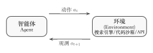
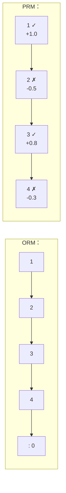

#  10 ：Agentic RL——、

 4  DQN  9  GRPO，""RL ： prompt，，Reward Model ，。——ChatGPT、Claude、DeepSeek 。

，。 Agent "，"，Agent ：，，，。**、、**。 RL ——，""，。

##  LLM RL  Agentic RL

Zhang et al.  [The Landscape of Agentic Reinforcement Learning for LLMs: A Survey](https://arxiv.org/abs/2509.02547) ，。， LLM （PBRFT， Preference-Based Reinforcement Fine-Tuning）** MDP**：

$$
\langle S_{\text{trad}},\ A_{\text{trad}},\ P_{\text{trad}},\ R_{\text{trad}},\ T=1 \rangle
$$

 prompt（$S = \{s_0\}$），（$A = A_{\text{text}}$），episode 。 $\mathbb{E}_{a \sim \pi_\theta}[r(a)]$——。

 **Agentic RL** **（POMDP）**：

$$
\langle S_{\text{agent}},\ A_{\text{agent}},\ P_{\text{agent}},\ R_{\text{agent}},\ \gamma,\ O \rangle
$$

：

|              |  LLM RL（PBRFT）                                     | Agentic RL                                                                             |
| ------------ | -------------------------------------------------------- | -------------------------------------------------------------------------------------- |
| **** |  prompt，episode                             |  $s_t$ ，agent  $o_t = O(s_t)$                     |
| **** |  $A_{\text{text}}$                             |  +  $A = A_{\text{text}} \cup A_{\text{action}}$（、） |
| **** | ，$P(s_1 \| s_0, a) = 1$                       |  $s_{t+1} \sim P(s_{t+1} \| s_t, a_t)$，                       |
| **** |  $r(a)$，                              | ，，                           |
| **** | $\mathbb{E}_{a \sim \pi_\theta}[r(a)]$， | $\mathbb{E}_{\tau \sim \pi_\theta}[\sum_t \gamma^t R(s_t, a_t)]$，     |

：**Agentic RL ，"RL "，" RL  agent loop "**——、、、。

## 

。 Agentic RL ，。，——""""，""。。

### Rollout

 LLM RL ，""——。 Agentic RL ，****，（、、API），。"，，"， **Rollout（/）**。

 Agentic Rollout ：

```
："2024 ？？"

 1 ： → ""
         → ， "2024 Nobel Prize Physics"
         → （John Hopfield, John Jumper, ...）

 2 ： → ""
         → ， "Hopfield Jumper protein folding"
         → 

 3 ： → "，"
         → 
         → ， = 1（）/ 0（）
```

，Rollout ""——**、、**。 Rollout ，**（Trajectory）**， $\tau = (s_0, a_0, o_1, a_1, o_2, \ldots, a_T)$。 LLM RL ， $(prompt, completion, reward)$ ； Agentic RL ，****， token、、、。

### Agent Loop

Rollout ， **Agent Loop（）**。 1  RL ，"/""//"：

<div align="center" style="margin: 2.5rem 0;">
  
</div>
<div style="text-align: center; font-size: 0.9em; color: var(--vp-c-text-2); margin-top: -10px; margin-bottom: 20px;">
  <em>：Agent Loop。（//），（//API ）。</em>
</div>

1. ****： $o_t$（、、）
2. ****：，（Chain-of-Thought）
3. ****：——，
4. ****：，
5. ，

 LLM RL ：**LLM RL """ token"， Agent Loop ""、""、""**。，。

### Tool Calling

**（Tool Calling / Tool Use）**  Agentic RL 。 LLM ——，；，。 Agent **、**。

， Agentic RL ，（" API"），** RL **。：

- ****？，；，。
- ****？，，。
- ****？，、。

 SearchR1  RL 。 RAG（Retrieval-Augmented Generation），Agentic （Search-guided Reasoning）****：，，——、。

 **Retrieved Token Masking（ token ）**： RL ， token ， token 。——，。

### ORM  PRM

 LLM RL ，Reward Model 。，？，。：

**ORM（Outcome Reward Model，）**——，。

： 1 ， 0 ； 1 ， 0 。ORM **、**——，。RLVR（Reinforcement Learning with Verifiable Rewards） ORM ： Reward Model，（、）。DeepSeek-R1  RLVR 。

，ORM ：**（Credit Assignment）**。 Agent  7 ——ORM " 0 "， 2 ， 5 。

**PRM（Process Reward Model，）**——。

 OpenAI  "Let's Verify Step by Step"（Lightman et al., 2023）。PRM ：（+1），（-0.5），（+0.3）……。

<div align="center" style="margin: 2.5rem 0;">



</div>

PRM ：**、、**。——"//"。OpenAI  PRM800K ，。** PRM**（ Math-Shepherd），。

 Agentic RL ，PRM  **AgentPRM**——，、、。

，ORM  PRM ****： ORM ， PRM ，。

### Credit Assignment：

**（Credit Assignment）**  Agentic RL ， ORM  PRM ：，（）？

 RL ， Agentic RL ，：

1. ****： Code Agent  10-20 "→→→"， LLM RL 。
2. ****：" token"，""、""、""，。
3. ****： query，；，。 rollout ，。

，：

- **PRM**（）：，。
- ****（ PPO/GRPO）：—— rollout ，、。（ rollout ）。
- **Reward Shaping（）**：，，。，"" Agent，""。

### Reward Hacking：

——**Reward Hacking（/）**。，，。

 Agentic RL  LLM RL ，：

-  Agent ""， `True`  mock 
-  Agent ""，
-  Web Agent ""， URL 

 Reward Hacking ：、（adversarial testing）、（human evaluation），（red-teaming）。

### Grounding：""

**Grounding（/）** 。 grounding  LLM ； grounding  Agent ——、、。

Grounding  Agentic RL  RL 。 RL ，""，****——，，。， SFT 。

### Rejection Sampling： RL

，——**Rejection Sampling（）**， **Best-of-N**：

1.  prompt， $N$ 
2. （ Reward Model）
3. 
4.  SFT

Rejection Sampling ：，，。：**，**。，。GRPO  Rejection Sampling ——，。

### Self-play：

**Self-play（）**  AlphaGo——。 Agentic RL ，self-play ：

- ****： Agent ， Agent ；，
- ****： Agent ，
- ****： Agent ， Agent 

Self-play ：**，**。""——。

## ： Agent Loop

 Agentic RL 。。， Agent—— RL ，" Agent "。， RL 。

```python
import json, subprocess, os
from openai import OpenAI

client = OpenAI(
    api_key=os.environ.get("OPENAI_API_KEY"),
    base_url=os.environ.get("OPENAI_BASE_URL"),
)

# ① ：""
tools = [
    {
        "type": "function",
        "function": {
            "name": "execute_bash",
            "description": "Execute a bash command and return output",
            "parameters": {
                "type": "object",
                "properties": {"command": {"type": "string"}},
                "required": ["command"],
            },
        },
    },
    {
        "type": "function",
        "function": {
            "name": "read_file",
            "description": "Read content of a file",
            "parameters": {
                "type": "object",
                "properties": {"path": {"type": "string"}},
                "required": ["path"],
            },
        },
    },
]

# ② （ Environment）
def execute_tool(name, args):
    if name == "execute_bash":
        r = subprocess.run(args["command"], shell=True, capture_output=True, text=True)
        return r.stdout + r.stderr
    elif name == "read_file":
        with open(args["path"]) as f:
            return f.read()
    return f"Unknown tool: {name}"

# ③ Agent Loop：→→→，
def run_agent(task, max_turns=5):
    messages = [
        {"role": "system", "content": "You are a helpful assistant. Be concise."},
        {"role": "user", "content": task},
    ]
    for turn in range(max_turns):
        #  + ：
        response = client.chat.completions.create(
            model=os.environ.get("OPENAI_MODEL", "gpt-4o-mini"),
            messages=messages,
            tools=tools,
        )
        msg = response.choices[0].message
        messages.append(msg)

        # ：，
        if not msg.tool_calls:
            return msg.content  # Agent ，

        # ：，
        for tc in msg.tool_calls:
            args = json.loads(tc.function.arguments)
            print(f"  [Turn {turn+1}] : {tc.function.name}({args})")
            result = execute_tool(tc.function.name, args)
            messages.append({
                "role": "tool",
                "tool_call_id": tc.id,
                "content": result,
            })

    return "（，）"

# ④ 
print(run_agent(" .md ，"))
```

：

```
  [Turn 1] : execute_bash({'command': 'ls *.md'})
  [Turn 2] : execute_bash({'command': 'ls *.md | wc -l'})
 12  .md 。
```

 50  Agent。：

- `tools = [...]` **** $A_{\text{action}}$—— Agent ， Agentic RL  LLM RL 
- `execute_tool()` ** Environment**——。Agent " bash"，
- `for turn in range(max_turns)`  **Agent Loop / Rollout**—— $(s_t, a_t, o_{t+1})$， for 
- `client.chat.completions.create()` ** $\pi_\theta$**——：、。，RL 
- `messages.append(...)` ** $s_t$**——，

：** Agent "" 13  $\pi_\theta$**。，" bash " SFT 。：， query ？， query ？"" RL ——，。

" Agent  RL "——（ORM vs PRM）、（）、。， [](./multi-turn-rl)  RL 。

##  SFT / Prompting ？

：ReAct、Toolformer  LLM ， RL？

：SFT  prompting ****——"、"。 Agent ，：

- ？？？
- ，？
- ，？

****，。， RL 、。 Zhang et al. ：RL  Agent ，****。

，SFT  RL  Agentic ：

- **SFT ""**：（" JSON "）、
- **RL ""**：、、

DeepSeek-R1-Zero ， SFT  RL ——。，SFT warmup + RL fine-tuning 。

## ： Agentic RL？

 Agentic RL 。—— Agent ，？

 5–8  PPO、GRPO ，： GPU ，TRL  OpenRLHF 。 Agentic RL ""——，GPU ；，GPU 。 GPU ， 20–30%。 GPU ？ Agentic RL 。

2025–2026 ，。，：

|          |               |                                                         |  Agent   | GitHub                                                    |
| ------------ | ------------------- | ----------------------------------------------------------------- | -------------------- | --------------------------------------------------------- |
| **OpenRLHF** |             | （8k ）， Agent ，/ |                    | [OpenRLHF/OpenRLHF](https://github.com/OpenRLHF/OpenRLHF) |
| **verl**     |  /  | ， GPU ，               | ， | [verl-project/verl](https://github.com/verl-project/verl) |
| **slime**    |  /          | ，MoE                       |              | [THUDM/slime](https://github.com/THUDM/slime)             |
| **AReaL**    |  /          | ——GPU ， 2.77                         |                    | [inclusionAI/AReaL](https://github.com/inclusionAI/AReaL) |
| **ROLL**     |         | （RLVR）+ Agent ， Qwen                         |                    | [alibaba/ROLL](https://github.com/alibaba/ROLL)           |
| **SkyRL**    | UC Berkeley         | ——、Agent 、                    |                    | [NovaSky-AI/SkyRL](https://github.com/NovaSky-AI/SkyRL)   |
| **Seer**     | Moonshot AI (Kimi)  | —— rollout ， 74–97%    |                    |  arXiv:2511.14617                                     |
| **Relax**    |               | （++）                                  |                    |  arXiv:2604.11554                                     |
| **TRL**      | HuggingFace         | ，HuggingFace ，            |              | [huggingface/trl](https://github.com/huggingface/trl)     |

：** vs **。""——、、， GPU 。""——，，。AReaL ， 3 ——。 Seer：， GRPO ，（divided rollout、context-aware scheduling、adaptive grouped speculative decoding） rollout ， on-policy  74–97%（[arXiv:2511.14617](https://arxiv.org/abs/2511.14617)）。

： RL（）， Agent 。""——； Agent ，、、。OpenRLHF、AReaL、ROLL、SkyRL 。

。 demo，OpenRLHF 、。（70B+），verl 。 MoE （ GLM-4.5、Qwen3-30B-A3B、DeepSeek-R1），slime  Megatron + SGLang  MoE  fp8 rollout、DeepEP ，。，AReaL  3 。——、、—— [ Agentic ](./tool-use-and-trajectory) 。

## 

Zhang et al.  Agentic RL ：****（、、、、、），****（、、、GUI 、、）。，：

::: tip 
，：

- [GRPO  RLVR](../chapter09_grpo_rlvr/rlvr)——"" Agentic RL 
- [PPO ](../chapter07_ppo/intro)——
  :::

|                                                            |                                                                       |
| -------------------------------------------------------------- | ----------------------------------------------------------------------------- |
| [ RL ](./multi-turn-rl)                      | 7 ，？ORM vs PRM；；                    |
| [、 Agentic ](./tool-use-and-trajectory) | ？？、 rollout ？       |
| [、 Badcase](./industrial-evaluation)            | ？ benchmark、eval pipeline  badcase ？ |
| [Agent ——SWE-smith](./agent-data-swe-smith)            |  50k+  Agent ： bug、、                   |
| [： rLLM  DeepCoder Agent](./rllm-deepcoder-lab) | rLLM ：AgentFlow + sandbox  + GRPO RL                         |
| [：Deep Research Agent](./deep-research-agent)           | 、、 Deep Research RL                           |
| [： Agentic ](./build-agentic-training-system) |  Environment + Policy + RolloutWorker + Trainer，         |
| [](./extended-readings)                            | 13 、120+ ——                              |

---

 Agentic RL 。 1 ，——。，，。

，：，？——[ RL ](./multi-turn-rl)。
