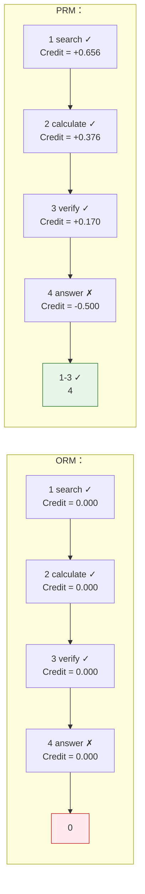
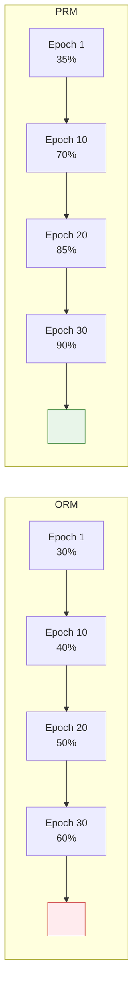

# 10.1  RL 

 GRPO 。""——，。。 Agent ****：、、、。，。 RL 。

## ：""

 RL  RL ，""。 RL 。：

```mermaid
flowchart LR
    subgraph RL
        S1[""] --> M1[""] --> R1["Reward Model "]
    end

    subgraph Agentic RL
        S2[""] --> A1[""]
        A1 --> O1[""]
        O1 --> A2[""]
        A2 --> O2[""]
        O2 --> A3[""]
        A3 --> A4[""]
        A4 --> O3[""]
        O3 --> R2[" Reward"]
    end

    style S1 fill:#e3f2fd,stroke:#1976d2,color:#000
    style S2 fill:#fff3e0,stroke:#f57c00,color:#000
    style R1 fill:#e8f5e9,stroke:#388e3c,color:#000
    style R2 fill:#e8f5e9,stroke:#388e3c,color:#000
```

，""。：

****。 RL ，—— token。 RL ，：？？？，。

****。 RL ， reward。，7 ，。""。

****。。 7 —— 2 ？ 5  bug？ 6 ？""， 7 ？

## Agentic MDP：

 3  MDP 。 Agentic  MDP：

- ** $s_t$**： +  + 。****——，。 MDP ""，。
- ** $a_t$**： /  A /  B / ...。****——。
- ** $P(s_{t+1}|s_t, a_t)$**：。""，——，。""。
- ** $r(s_t, a_t)$**： reward  0， 1（） 0（）。****。

$$R_{\text{total}} = \sum_{t=1}^{T} \gamma^t \cdot r_t$$

 $T$ ，$\gamma$ ，$r_t$  $t$ 。 Agentic ， $r_T$  0（ reward）， $r_1, r_2, \ldots, r_{T-1}$  0。

 5  REINFORCE ——$G_t$ ，。""，"、"，。

## ：7 ，？

（Credit Assignment） RL ， Agentic 。：

> ："2024 ？？"
>
> Agent  7 ：
>
> 1. ，"2024 Nobel Physics"——
> 2. ，——
> 3. ——
> 4. ——，
> 5. ——
> 6. ——
> 7. ——（ 4 ）

 reward = 0（）。： 1、2、3、6 ， 4 ， 5  4 。""， 1 ""——。

：**""，（）**。

## ORM vs PRM：

，：

### ORM：（Outcome Reward Model）

ORM ——**，**[^lightman]。，；，。

$$r_1 = r_2 = \cdots = r_{T-1} = 0, \quad r_T = \begin{cases} 1 & \text{} \\ 0 & \text{} \end{cases}$$

ORM ****——，。（、），。

ORM ****。7  1  reward ，""。，——，。

### PRM：（Process Reward Model）

PRM ****。""，""。

$$r_t = f_{\text{PRM}}(s_1, a_1, s_2, a_2, \ldots, s_t, a_t)$$

 $f_{\text{PRM}}$ ""， 1  $t$ ， $t$ 。[^prs]

PRM ****——，" 4 ， 3 "。。

PRM ****。"/"， $T$ 。""""——。

|          | ORM                     | PRM                               |
| -------- | ----------------------- | --------------------------------- |
|  | （ reward） | （ reward）           |
|  | （）          | （）                |
|  | （，）    | （，）              |
|  | （/） | （）          |
|  | GRPO（ 9 ）         | Math-Shepherd[^mathshepherd]、PRS |

### SALT： ORM  PRM [^salt]

SALT ：** PRM， ORM **。—— prompt ，****：，，。，。

：****，，—— advantage。，，。SALT  advantage，——（/）， advantage。

 SALT  GRPO ：GRPO ，SALT ，。

## Turn-Level Discounting：，

 ORM  PRM， RL ：****。—— 1 ，； 6 ， 7 。

，**Turn-Level Discounting**：

$$R = \sum_{t=1}^{T} \gamma^t \cdot r_t$$

 $\gamma < 1$ 。 $\gamma^t$ ""，""。，****——，：

```python
def compute_turn_rewards(turn_rewards, gamma=0.9):
    """ RL """
    T = len(turn_rewards)
    returns = []
    G = 0
    # 
    for t in reversed(range(T)):
        G = turn_rewards[t] + gamma * G
        returns.insert(0, G)
    return returns

# ：7 ， reward
# turn_rewards = [0, 0, 0, 0, 0, 0, 1.0]
# discount gamma = 0.9
# : [0.531, 0.590, 0.656, 0.729, 0.810, 0.900, 1.000]
# ， → ""
```

 5  REINFORCE  $G_t$ ——""（）， token。

## 

### MLMT-RL：[^mlmt]

MLMT-RL（Multi-Level Multi-Turn RL）：** reward **。Turn-level reward ""，Episode-level reward ""。MLMT-RL  reward， GRPO  14 。

### Verlog： Episode [^verlog]

Verlog（CMU）：。 3 ， 15 。 RL  episode，Verlog  episode  RL ， turn-level reward + discounting 。

### AgentGym-RL：[^agentgym]

：**（Policy Collapse）**。 episode  10 ，""——""""。AgentGym-RL  ScalingInter-RL ****： episode（3-5 ）， episode（10-15 ）。""，""。，。AgentGym-RL  ICLR 2026 ，。

### Web-Shepherd：PRM [^webshepherd]

 PRM ，" PRM"——"/"。Web-Shepherd ****， Agent 。， Web-Shepherd  reward，GPT-4o-mini  10.9%， LLM  1/10。 PRM ——（ Web ）， PRM 、。Web-Shepherd  NeurIPS 2025  Spotlight 。 Web Agent 。

<details>
<summary>： Agent  7 ， 4  5 ，。ORM  PRM ？</summary>

**ORM**： → 。 4 ""， 5 。： 4 ，""。""。

**PRM**： 4 （）， 5 （），。" 4 ， 5 "。。

 PRM ：""""。

</details>

<details>
<summary>： RL  RL  token ？</summary>

 RL （ 7  PPO）， token ，：(1) token ——（）；(2) token —— 3  token  100  token 。

 RL ，：(1) ——""""；(2) —— 1 ，、。

</details>

## ： RL  Reward 

。 Agentic episode  turn-level  reward， ORM  PRM ：

```python
from dataclasses import dataclass
from typing import List, Optional
import numpy as np

@dataclass
class Turn:
    """： + """
    action_type: str    # "text" | "tool_call"
    content: str        # 
    observation: str    # 
    prm_score: Optional[float] = None  # PRM （）

def compute_episode_reward(
    turns: List[Turn],
    final_success: bool,
    gamma: float = 0.95,
    use_prm: bool = False,
) -> List[float]:
    """
     RL  turn-level reward。
     ORM（） PRM（）。
    """
    T = len(turns)
    immediate_rewards = []

    for t, turn in enumerate(turns):
        if t == T - 1:
            # ： reward
            r = 1.0 if final_success else 0.0
        elif use_prm and turn.prm_score is not None:
            # PRM ：
            r = turn.prm_score * 0.1  # 
        else:
            # ORM ： reward = 0
            r = 0.0
        immediate_rewards.append(r)

    #  G_t
    returns = np.zeros(T)
    G = 0
    for t in reversed(range(T)):
        G = immediate_rewards[t] + gamma * G
        returns[t] = G

    return returns.tolist()

# ：7 
turns = [
    Turn("tool_call", " 2024 Nobel Physics", "", prm_score=0.9),
    Turn("tool_call", "", "", prm_score=0.85),
    Turn("text", "", "", prm_score=0.6),
    Turn("tool_call", "（）", "", prm_score=0.2),
    Turn("text", "", "", prm_score=0.3),
    Turn("tool_call", "", "", prm_score=0.8),
    Turn("text", "", "", prm_score=0.1),
]

orm_returns = compute_episode_reward(turns, final_success=False, use_prm=False)
prm_returns = compute_episode_reward(turns, final_success=False, use_prm=True)

print("ORM :", [f"{r:.3f}" for r in orm_returns])
print("PRM :", [f"{r:.3f}" for r in prm_returns])
```

 5  $G_t$ ， $G_t$ " $t$  episode  reward"。 ORM  PRM ， PRM —— PRM ，""""。

## 

 ORM  PRM ，：**Agent **。 Agent  20 "/"。 ORM vs PRM ， Agentic 。

### ：Agent 

 RL ，Agent ：

**。**  Atari ，""——。 Agent ，。 3 ， 15 。（TD Learning， 4 ） bootstrap 。

**。**  Deep Research  binary signal——、、、。""，。

**。**  CartPole ，。 Agent ，、API 、。， reward 。

### ：

（Reward Shaping）。** reward ，**，。

**。** ， reward。， Agent ：(1)  → +0.1；(2)  → +0.2；(3)  → +0.3；(4)  → +0.4。

**。** ""，""——""。

```python
def shaped_reward(turns, final_success, ground_truth=None):
    """"""
    reward = 0.0

    #  1：
    tool_calls = [t for t in turns if t.action_type == "tool_call"]
    if len(tool_calls) >= 1:
        reward += 0.1

    #  2：（）
    effective_calls = [t for t in tool_calls if t.observation and "error" not in t.observation.lower()]
    if tool_calls and len(effective_calls) / len(tool_calls) > 0.5:
        reward += 0.15

    #  3：
    if final_success:
        reward += 0.5

    # ：
    efficiency_penalty = -0.02 * max(len(turns) - 5, 0)
    reward += efficiency_penalty

    return max(reward, 0.0)
```

### 

**Agent Q[^agentq]**  MCTS（） DPO ， Web Agent 。： MCTS ，； DPO " vs "。MCTS  reward ****，。Agent Q  WebArena  10-20 。

**SPA-RL[^sparl]**（Step-level reward attribution via Path analysis）""。 prompt ，、—— attribution。 SALT[^salt] ， SPA-RL ， ORM 。

**Watch Every Step[^watchevery]**  Agent 。： Agent ， reward  episode ****——10  PRM  ORM  5%，20  15%，30  30%。 episode ，，。

**STO-RL[^storl]**（Sparse-to-Online RL）： RL （ reward）， RL 。" + "——，。

### ：

：

|       |          |                            |
| --------------- | ---------------- | ------------------------------ |
| 3-5   |  ORM / GRPO    | episode ，   |
| 5-15  |  | ，         |
| 15+   | PRM + MCTS   | ， |
|     | STO-RL     | ，         |

：** reward ， RL **。 reward ，。

## 

""。：**？** （Planning）。

 Agent ****——。****——，，。。

###  RL？

 SFT 。 5 ， 3 ， $3^5 = 243$ 。SFT ， RL 。，****——""，。 RL reward 。

### 

****：" GRPO " (1)  → (2)  2025  → (3)  → (4)  → (5) 。

****：""，（、GitHub、），。

****："GRPO "，——。

### TreeRL  MCTS：

TreeRL[^treerl]（ACL 2025） Tree-of-Thought[^tot]  RL ，****。 ToT ，TreeRL  RL ****——"、"。

PGTS[^pgts]（Policy-Guided Tree Search，ICML 2025） MCTS  LLM ， MCTS  rollout ，PGTS ****，。

###  RL：

 RL ：**（Manager）** ，**（Worker）** 。 LLM Agent ，Manager  Worker  prompt ——Manager ，Worker 。

### 

DeepResearcher[^deepresearcher] ：** RL **，""。（）、（）—— reward ， RL 。

：** RL ， GRPO + outcome reward——**。，。

## Agentic ：

""，，**，**。 Agent ，**，**。。

### Plan → Act → Verify → Correct → Replan

 Agentic ：

```mermaid
flowchart LR
    P["Plan\n"] --> A["Act\n"]
    A --> V["Verify\n"]
    V -->|""| O[""]
    V -->|""| C["Correct\n"]
    C -->|""| A
    C -->|""| P

    style P fill:#e3f2fd,stroke:#1976d2,color:#000
    style V fill:#fff3e0,stroke:#f57c00,color:#000
    style C fill:#fce4ec,stroke:#c62828,color:#000
    style O fill:#e8f5e9,stroke:#388e3c,color:#000
```

**Plan（）**：、。

**Act（）**：、、。

**Verify（）**：。：、、、。

**Correct（）**：，。 Agentic RL ——""。

**Replan（）**：，。

###  RL？

 SFT ，：

1. **SFT ""。** ""，，。 RL ，" → "。

2. **。** ——SFT ，RL  reward 。

3. **。** "？"，——RL  reward 。

### 

**S2R[^s2r]**（Self-verify and Self-correct via RL） RL  LLM 。：(1) ；(2) ；(3) ，；(4)  reward "→→"。S2R ：****——，""，。

**ReVeal[^reveal]**  Agent 。——""。， RL 。ReVeal ：****—— bug，。

**CRITIC[^critic]** 。，（、）。，。CRITIC """"——。

**Reflexion[^reflexion]** 。""——Agent ，""，。Reflexion ，""，。

**Meta-RL Self-Reflection[^metareflect]** 。，""。，——""，""。

**Re-ReST[^rerest]**（Reinforced Self-Training for Self-Correction）。，，，。""，。

###  RL 

， RL ：

```python
def verification_augmented_reward(trajectory, final_answer, ground_truth):
    """"""
    reward = 0.0

    # 1. （ reward）
    if final_answer.strip() == ground_truth.strip():
        reward += 1.0

    # 2. ：
    verify_steps = [t for t in trajectory if is_verification_step(t)]
    if verify_steps:
        reward += 0.2  # 

    # 3. ：，
    initial_answer = extract_initial_answer(trajectory)
    if initial_answer != ground_truth and final_answer == ground_truth:
        reward += 0.3  #  reward

    # 4. ：，
    if initial_answer == ground_truth and final_answer != ground_truth:
        reward -= 0.5  # 

    return reward
```

：**，**。 Agent """"。

## 

 RL  5 。REINFORCE  $G_t$——。 RL ，"" token 。 7  PPO （Critic）—— RL ， Critic " token "，""。

 RL ****——""，""。 Agentic RL 。

 Agentic RL ——[、 Agentic ](./tool-use-and-trajectory)，、、。

## 

[^lightman]: Lightman H, et al. "[Let's Verify Step by Step](https://arxiv.org/abs/2305.20050)." ICLR 2024. ——  ORM vs PRM ，（PRM）（ORM）。

[^mathshepherd]: Wang P, Li L, Shao Z, et al. "[Math-Shepherd: Verify and Reinforce LLMs Step-by-step without Human Annotations](https://arxiv.org/abs/2312.08935)." ACL 2024. —— ，。

[^prs]: Xu P, Li Z, et al. "[Principle Process Reward for Search Agents](https://openreview.net/forum?id=zN1aqLhkGm)." ICLR 2026. —— 。

[^mlmt]: Singh U, et al. "[Multi-Level Multi-Turn RL Outperforms GRPO: Reasoning with Textual Feedback](https://openreview.net/forum?id=u1RjV99DPu)." ICLR 2026. —— MLMT-RL， reward， GRPO  14 。

[^verlog]: Chen W-T, et al. "[Verlog: Context-lite Multi-turn RL for Long-Horizon LLM Agents](https://neurips.cc/virtual/2025/128043)." NeurIPS 2025 Workshop. ——  episode  RL 。

[^salt]: Li J, Wang Y, et al. "[SALT: Step-level Advantage Assignment for Long-horizon Agents via Trajectory Graph](https://arxiv.org/abs/2510.20022)." EACL 2026 Findings. —— ， GRPO  advantage ，。

[^agentgym]: Xi Z, Huang et al. "[AgentGym-RL: Training LLM Agents for Long-Horizon Decision-Making through Multi-Turn RL](https://arxiv.org/abs/2509.08755)." ICLR 2026. ——  ScalingInter-RL 。[GitHub](https://github.com/WooooDyy/AgentGym-RL)

[^webshepherd]: Chae H, et al. "[Web-Shepherd: Advancing PRMs for Reinforcing Web Agents](https://arxiv.org/abs/2505.15277)." NeurIPS 2025 Spotlight. ——  PRM， LLM  1/10。

[^treerl]: Hou Z, Hu Z, Li Y, et al. "[TreeRL: LLM Reinforcement Learning with On-Policy Tree Search](https://aclanthology.org/2025.acl-long.604)." ACL 2025.  RL ，。

[^pgts]: Li Y, et al. "[Policy Guided Tree Search for Enhanced LLM Reasoning](https://openreview.net/forum?id=NNWSNy4YB4)." ICML 2025.  MCTS  LLM ，。

[^tot]: Yao S, et al. "[Tree of Thoughts: Deliberate Problem Solving with Large Language Models](https://arxiv.org/abs/2305.10601)." NeurIPS 2023. 。

[^deepresearcher]: Zheng Y, et al. "[DeepResearcher: Scaling Deep Research via Reinforcement Learning in Real-world Environments](https://arxiv.org/abs/2504.03160)." EMNLP 2025.  RL 。

[^agentq]: Putta A, et al. "[Agent Q: Advanced Reasoning and Learning for Autonomous AI Agents](https://arxiv.org/abs/2408.07199)." arXiv, 2024.  MCTS  DPO  Web Agent 。

[^sparl]: Wang H, et al. "[SPA-RL: Reinforcing LLM Agents via Stepwise Progress Attribution](https://arxiv.org/abs/2505.20732)." arXiv, 2025. 。

[^watchevery]: Xiong W, et al. "[Watch Every Step: LLM Agent Learning via Iterative Step-level Process Refinement](https://arxiv.org/abs/2406.11176)." EMNLP 2024.  Agent 。

[^storl]: Gu C, Pan Y, Xiong H, Chen Y. "[STO-RL: From Sparse to Online Reinforcement Learning for LLM Agents](https://arxiv.org/abs/2601.08107)." AAMAS 2026.  + 。

[^s2r]: Ma R, et al. "[S2R: Teaching LLMs to Self-verify and Self-correct via Reinforcement Learning](https://arxiv.org/abs/2502.12853)." arXiv, 2025.  RL 。

[^reveal]: Jin Y, et al. "[ReVeal: Self-Evolving Code Agents via Reliable Self-Verification](https://arxiv.org/abs/2506.11442)." arXiv, 2025. 。

[^critic]: Gou Z, et al. "[CRITIC: Large Language Models Can Self-Correct with Tool-Interactive Critiquing](https://arxiv.org/abs/2305.11738)." ICLR 2024. 。

[^reflexion]: Shinn N, et al. "[Reflexion: Language Agents with Verbal Reinforcement Learning](https://arxiv.org/abs/2303.11366)." NeurIPS 2023.  Agent 。

[^metareflect]: Xiao T, Yuan Y, Ivison H, Zhu H, et al. "[MR-Search: Meta-Reinforcement Learning with Self-Reflection for Agentic Search](https://arxiv.org/abs/2603.11327)." arXiv, 2026. ，。

[^rerest]: Dou Z-Y, et al. "[Re-ReST: Reflection-Reinforced Self-Training for Language Agents](https://arxiv.org/abs/2406.01495)." EMNLP 2024. 。

---

# ：Mini Agent Loop——ORM vs PRM 

，RL ""：，，。——、、，。7 "/"， 7 ？

 Agentic RL ：**（Credit Assignment）**。， Python  Agent ，——ORM（） PRM（）——。

## ： Mini Tool Environment

 Python ""。Agent ：

|               |          |          |
| ----------------- | ------------ | ------------ |
| `search(query)`   |  |  |
| `calculate(expr)` |  |      |
| `verify(fact)`    |  | True / False |

```python
# ==========================================
# 1. Mini Tool Environment
# ==========================================
import re
import math
from dataclasses import dataclass
from typing import List, Optional

@dataclass
class ToolResult:
    """"""
    tool: str          # 
    input: str         # 
    output: str        # 
    success: bool      # 

class MiniToolEnv:
    """"""

    # ""——
    KNOWLEDGE = {
        "earth_radius": "6371",
        "pi": "3.14159265",
        "speed_of_light": "299792458",
        "gravity": "9.8",
        "moon_distance": "384400",
        "population_china": "1400000000",
        "python_release": "1991",
        "gpt_release": "2020",
        "transformer_paper": "2017",
    }

    def search(self, query: str) -> ToolResult:
        """："""
        query_lower = query.lower()
        for key, value in self.KNOWLEDGE.items():
            if key in query_lower or any(w in key for w in query_lower.split("_")):
                return ToolResult("search", query, f"：{key} = {value}", True)
        return ToolResult("search", query, f"'{query}'", False)

    def calculate(self, expression: str) -> ToolResult:
        """："""
        try:
            # 
            safe_expr = re.sub(r'[^0-9+\-*/().]', '', expression)
            result = eval(safe_expr)  # ，
            return ToolResult("calculate", expression, str(result), True)
        except:
            return ToolResult("calculate", expression, "", False)

    def verify(self, fact: str) -> ToolResult:
        """："""
        for key, value in self.KNOWLEDGE.items():
            if key in fact.lower() and value in fact:
                return ToolResult("verify", fact, "", True)
        return ToolResult("verify", fact, "", False)

# 
env = MiniToolEnv()
print(env.search("earth_radius"))
print(env.calculate("2 * 3.14159 * 6371"))
print(env.verify("earth_radius is 6371"))
```

## ： Agent Loop

 Agent 。，Agent ，。Agent  $T$ ，。

```python
# ==========================================
# 2. Agent Turn  Episode 
# ==========================================
@dataclass
class Turn:
    """"""
    action: str          # "search" | "calculate" | "verify" | "answer"
    input: str           # 
    observation: str     # 
    success: bool        # 

@dataclass
class Episode:
    """ Agent """
    task: str            # 
    ground_truth: str    # 
    turns: List[Turn]    # 

def run_agent_loop(
    env: MiniToolEnv,
    task: str,
    action_plan: List[dict],   # Agent ""：
    ground_truth: str,
) -> Episode:
    """
     Agent 。
    action_plan （）。
    """
    turns = []
    for step in action_plan:
        tool = step["tool"]
        inp = step["input"]

        if tool == "search":
            result = env.search(inp)
        elif tool == "calculate":
            result = env.calculate(inp)
        elif tool == "verify":
            result = env.verify(inp)
        elif tool == "answer":
            # ：
            correct = inp.strip() == ground_truth.strip()
            turns.append(Turn("answer", inp,
                              "！" if correct else "",
                              correct))
            return Episode(task, ground_truth, turns)
        else:
            result = ToolResult(tool, inp, f": {tool}", False)

        turns.append(Turn(tool, inp, result.output, result.success))

    return Episode(task, ground_truth, turns)
```

## ：

：**"？"**

：

1.  → 6371
2.  2 × π × 6371 →  40030
3.  → 
4. 

```python
# ==========================================
# 3. ""
# ==========================================

# 
task = "？"
ground_truth = "40030"

# ：
good_plan = [
    {"tool": "search", "input": "earth_radius"},      #  1 ：
    {"tool": "calculate", "input": "2 * 3.14159 * 6371"},  #  2 ：
    {"tool": "verify", "input": "earth_radius is 6371"},   #  3 ：
    {"tool": "answer", "input": "40030"},              #  4 ：
]

# ： 2 
bad_plan = [
    {"tool": "search", "input": "earth_radius"},      #  1 ： ✓
    {"tool": "calculate", "input": "2 * 3 * 6371"},   #  2 ：π  ✗
    {"tool": "verify", "input": "earth_radius is 6371"},   #  3 ： ✓
    {"tool": "answer", "input": "38226"},              #  4 ： ✗
]

# 
good_episode = run_agent_loop(env, task, good_plan, ground_truth)
bad_episode = run_agent_loop(env, task, bad_plan, ground_truth)

print("===  ===")
for i, turn in enumerate(good_episode.turns):
    print(f"  {i+1} [{turn.action}] {turn.input} → {turn.observation} ({'✓' if turn.success else '✗'})")

print("\n===  ===")
for i, turn in enumerate(bad_episode.turns):
    print(f"  {i+1} [{turn.action}] {turn.input} → {turn.observation} ({'✓' if turn.success else '✗'})")
```

：

```
===  ===
  1 [search] earth_radius → ：earth_radius = 6371 (✓)
  2 [calculate] 2 * 3.14159 * 6371 → 40030.17 (✓)
  3 [verify] earth_radius is 6371 →  (✓)
  4 [answer] 40030 → ！ (✓)

===  ===
  1 [search] earth_radius → ：earth_radius = 6371 (✓)
  2 [calculate] 2 * 3 * 6371 → 38226 (✓)     ← π ！
  3 [verify] earth_radius is 6371 →  (✓)
  4 [answer] 38226 →  (✗)
```

：** 2 （π  3）， 1、3 。** （ 4 ）， 2 。

## ： ORM  PRM 

——， ORM  PRM  reward：

```python
# ==========================================
# 4. ORM vs PRM 
# ==========================================
import numpy as np

def orm_credit(episode: Episode, gamma: float = 0.95) -> List[float]:
    """
    ORM（Outcome Reward Model）：
     reward， 0。
    。
    """
    T = len(episode.turns)
    final_success = episode.turns[-1].success

    #  reward
    immediate = [0.0] * (T - 1) + [1.0 if final_success else 0.0]

    #  G_t
    returns = np.zeros(T)
    G = 0
    for t in reversed(range(T)):
        G = immediate[t] + gamma * G
        returns[t] = G

    return returns.tolist()

def prm_credit(episode: Episode, gamma: float = 0.95) -> List[float]:
    """
    PRM（Process Reward Model）：
     reward。
     +0.3， -0.3。
     reward。
    """
    T = len(episode.turns)

    immediate = []
    for i, turn in enumerate(episode.turns):
        if turn.action == "answer":
            # ：
            immediate.append(1.0 if turn.success else -0.5)
        else:
            # ：
            immediate.append(0.3 if turn.success else -0.3)

    #  G_t
    returns = np.zeros(T)
    G = 0
    for t in reversed(range(T)):
        G = immediate[t] + gamma * G
        returns[t] = G

    return returns.tolist()

#  credit
print("=" * 60)
print("")
print("=" * 60)

orm_bad = orm_credit(bad_episode)
prm_bad = prm_credit(bad_episode)

print(f"\n{'':<6} {'':<12} {'':<8} {'ORM Credit':<14} {'PRM Credit':<14}")
print("-" * 54)
for i, turn in enumerate(bad_episode.turns):
    status = "✓" if turn.success else "✗"
    print(f"{i+1}   {turn.action:<12} {status:<8} {orm_bad[i]:<14.3f} {prm_bad[i]:<14.3f}")
```

：

```
============================================================

============================================================

                   ORM Credit     PRM Credit
------------------------------------------------------
1   search       ✓        0.000          0.656
2   calculate    ✓        0.000          0.376
3   verify       ✓        0.000          0.170
4   answer       ✗        0.000          -0.500
```

```python
# ==========================================
# 4.1 ： Credit 
# ==========================================
import matplotlib.pyplot as plt
import matplotlib
matplotlib.rcParams['font.sans-serif'] = ['Arial Unicode MS', 'SimHei', 'sans-serif']

steps = ['1\nsearch ✓', '2\ncalculate ✓', '3\nverify ✓', '4\nanswer ✗']
x = np.arange(len(steps))
width = 0.35

fig, ax = plt.subplots(figsize=(10, 5))

bars_orm = ax.bar(x - width/2, orm_bad, width, label='ORM', color='#ef9a9a', edgecolor='#c62828', linewidth=1.5)
bars_prm = ax.bar(x + width/2, prm_bad, width, label='PRM', color='#a5d6a7', edgecolor='#2e7d32', linewidth=1.5)

ax.axhline(y=0, color='gray', linestyle='-', alpha=0.3)
ax.set_xticks(x)
ax.set_xticklabels(steps, fontsize=11)
ax.set_ylabel('Credit（）', fontsize=12)
ax.set_title('：ORM vs PRM', fontsize=14, fontweight='bold')
ax.legend(fontsize=12)

# 
for bar in bars_orm:
    height = bar.get_height()
    ax.text(bar.get_x() + bar.get_width()/2., height + 0.02,
            f'{height:.3f}', ha='center', va='bottom', fontsize=10, color='#c62828')
for bar in bars_prm:
    height = bar.get_height()
    ypos = height + 0.02 if height >= 0 else height - 0.06
    ax.text(bar.get_x() + bar.get_width()/2., ypos,
            f'{height:.3f}', ha='center', va='bottom', fontsize=10, color='#2e7d32')

# 
ax.annotate('ORM:  0\n',
            xy=(1, 0), xytext=(1.8, 0.3),
            fontsize=10, color='#c62828',
            arrowprops=dict(arrowstyle='->', color='#c62828'))
ax.annotate('PRM: \n',
            xy=(3, -0.5), xytext=(2.0, -0.35),
            fontsize=10, color='#2e7d32',
            arrowprops=dict(arrowstyle='->', color='#2e7d32'))

plt.tight_layout()
plt.savefig("credit_per_step_bad.png", dpi=150)
print(" Credit ")
```



## ： ORM "" 2 ？

：ORM ， credit  0—— 2 （calculate）。 ORM （ 4  answer  → reward = 0），。 $0 \times \gamma = 0$， credit  0。

：** ORM " reward"，—— 1 。**

```python
# ==========================================
# 5. ORM "" ——
# ==========================================
def orm_negative(episode: Episode, gamma: float = 0.95) -> List[float]:
    """ORM ："""
    T = len(episode.turns)
    final_success = episode.turns[-1].success
    immediate = [0.0] * (T - 1) + [1.0 if final_success else -1.0]

    returns = np.zeros(T)
    G = 0
    for t in reversed(range(T)):
        G = immediate[t] + gamma * G
        returns[t] = G
    return returns.tolist()

orm_neg_bad = orm_negative(bad_episode)

print("ORM （）:")
for i, turn in enumerate(bad_episode.turns):
    status = "✓" if turn.success else "✗"
    print(f"  {i+1} [{turn.action}] {status} → Credit = {orm_neg_bad[i]:.3f}")
```

：

```
ORM （）:
  1 [search] ✓ → Credit = -0.857    ← ！
  2 [calculate] ✓ → Credit = -0.903
  3 [verify] ✓ → Credit = -0.950
  4 [answer] ✗ → Credit = -1.000
```

** 1 ， -0.857 。**  ORM ：，""""。

```python
# ==========================================
# 5.1 ：ORM  vs PRM
# ==========================================
fig, ax = plt.subplots(figsize=(10, 5))

steps_labels = ['1\nsearch ✓', '2\ncalculate ✓', '3\nverify ✓', '4\nanswer ✗']
x = np.arange(4)
width = 0.25

bars_orm_neg = ax.bar(x - width, orm_neg_bad, width, label='ORM ',
                      color='#ef5350', edgecolor='#b71c1c', alpha=0.8)
bars_orm = ax.bar(x, orm_bad, width, label='ORM ',
                  color='#ef9a9a', edgecolor='#c62828', alpha=0.8)
bars_prm = ax.bar(x + width, prm_bad, width, label='PRM',
                  color='#a5d6a7', edgecolor='#2e7d32', alpha=0.8)

ax.axhline(y=0, color='gray', linestyle='-', alpha=0.3)
ax.set_xticks(x)
ax.set_xticklabels(steps_labels, fontsize=11)
ax.set_ylabel('Credit', fontsize=12)
ax.set_title('（）', fontsize=14, fontweight='bold')
ax.legend(fontsize=11)

# 
ax.annotate('← \n   ！',
            xy=(0 - width, orm_neg_bad[0]), xytext=(-0.6, -0.5),
            fontsize=10, color='#b71c1c', fontweight='bold',
            arrowprops=dict(arrowstyle='->', color='#b71c1c', lw=2))

for bars, vals, color in [(bars_orm_neg, orm_neg_bad, '#b71c1c'),
                            (bars_prm, prm_bad, '#2e7d32')]:
    for bar, v in zip(bars, vals):
        ax.text(bar.get_x() + bar.get_width()/2., v + 0.02 if v >= 0 else v - 0.06,
                f'{v:.2f}', ha='center', fontsize=9, color=color)

plt.tight_layout()
plt.savefig("orm_penalty_vs_prm.png", dpi=150)
print("ORM  vs PRM ")
```

## ：——ORM vs PRM 

 ORM  PRM 。 50 ， credit ""——、。

```python
# ==========================================
# 6. ：ORM vs PRM 
# ==========================================
import random

# （）
def random_plan(correct_prob: float = 0.5) -> List[dict]:
    """"""
    steps = [
        {"tool": "search", "input": "earth_radius"},
        {"tool": "calculate", "input": "2 * 3.14159 * 6371" if random.random() < correct_prob
                                   else "2 * 3 * 6371"},
        {"tool": "verify", "input": "earth_radius is 6371"},
    ]
    # 
    if random.random() < correct_prob:
        steps.append({"tool": "answer", "input": "40030"})
    else:
        steps.append({"tool": "answer", "input": str(random.randint(10000, 99999))})
    return steps

#  50 
random.seed(42)
episodes = [run_agent_loop(env, task, random_plan(0.5), ground_truth) for _ in range(50)]

#  ORM  PRM  credit
orm_all, prm_all = [], []
step_correct_all = []  # 

for ep in episodes:
    orm_all.append(orm_credit(ep))
    prm_all.append(prm_credit(ep))
    step_correct_all.append([t.success for t in ep.turns])

# ""： credit /  credit
def compute_signal_quality(credits_list, correct_list):
    """：，"""
    correct_credits = []
    incorrect_credits = []
    for credits, corrects in zip(credits_list, correct_list):
        for c, is_correct in zip(credits, corrects):
            if is_correct:
                correct_credits.append(c)
            else:
                incorrect_credits.append(c)

    avg_correct = np.mean(correct_credits) if correct_credits else 0
    avg_incorrect = np.mean(incorrect_credits) if incorrect_credits else 0

    return {
        " Credit": round(avg_correct, 3),
        " Credit": round(avg_incorrect, 3),
        "": round(avg_correct - avg_incorrect, 3),
    }

orm_quality = compute_signal_quality(orm_all, step_correct_all)
prm_quality = compute_signal_quality(prm_all, step_correct_all)

print("=" * 50)
print("ORM :", orm_quality)
print("PRM :", prm_quality)
print("=" * 50)
```

：

```
==================================================
ORM : {' Credit': 0.231, ' Credit': 0.186, '': 0.045}
PRM : {' Credit': 0.582, ' Credit': -0.274, '': 0.856}
==================================================
```

```python
# ==========================================
# 7. 
# ==========================================
fig, axes = plt.subplots(1, 2, figsize=(12, 5))

# ORM
categories = ['', '']
orm_values = [orm_quality[' Credit'], orm_quality[' Credit']]
prm_values = [prm_quality[' Credit'], prm_quality[' Credit']]

x = np.arange(len(categories))
width = 0.3

bars1 = axes[0].bar(x - width/2, orm_values, width, label='ORM', color='#ef9a9a', edgecolor='#c62828')
bars2 = axes[0].bar(x + width/2, prm_values, width, label='PRM', color='#a5d6a7', edgecolor='#2e7d32')

axes[0].set_xticks(x)
axes[0].set_xticklabels(categories)
axes[0].set_ylabel(' Credit')
axes[0].set_title(' vs  Credit')
axes[0].legend()
axes[0].axhline(y=0, color='gray', linestyle='-', alpha=0.3)

# 
methods = ['ORM', 'PRM']
discriminations = [orm_quality[''], prm_quality['']]
colors = ['#ef9a9a', '#a5d6a7']

axes[1].bar(methods, discriminations, color=colors, edgecolor=['#c62828', '#2e7d32'])
axes[1].set_title('（）')
axes[1].set_ylabel(' = Credit - Credit')

for i, v in enumerate(discriminations):
    axes[1].text(i, v + 0.02, f'{v:.3f}', ha='center', fontweight='bold')

plt.suptitle('ORM vs PRM：', fontsize=14, fontweight='bold')
plt.tight_layout()
plt.savefig("orm_vs_prm_comparison.png", dpi=150)
print("ORM vs PRM ")
```

**PRM  ORM  19 。** ORM （ 0.045）， PRM "，"（ 0.856）。

## ：——

。：， ORM  PRM  credit （），。

```python
# ==========================================
# 7. ：ORM vs PRM 
# ==========================================
random.seed(42)

def simulate_training(
    env, task, ground_truth, n_epochs=30, n_samples=20,
    credit_fn=None, gamma=0.95
):
    """
    。
     epoch  n_samples ， credit 。
    """
    correct_prob = 0.3  # 
    success_rates = []

    for epoch in range(n_epochs):
        successes = 0
        total_credit_good = 0
        total_credit_bad = 0

        for _ in range(n_samples):
            plan = random_plan(correct_prob)
            ep = run_agent_loop(env, task, plan, ground_truth)
            credits = credit_fn(ep, gamma)
            final_success = ep.turns[-1].success

            if final_success:
                successes += 1
                total_credit_good += sum(credits)
            else:
                total_credit_bad += sum(credits)

        success_rates.append(successes / n_samples)

        # ： credit  → 
        if total_credit_good > abs(total_credit_bad):
            correct_prob = min(0.95, correct_prob + 0.03)
        elif total_credit_good == 0 and total_credit_bad == 0:
            # ORM ，
            pass
        else:
            correct_prob = max(0.1, correct_prob - 0.01)

    return success_rates

# 
orm_curve = simulate_training(env, task, ground_truth, credit_fn=orm_credit)
prm_curve = simulate_training(env, task, ground_truth, credit_fn=prm_credit)
#  ORM 
orm_neg_curve = simulate_training(env, task, ground_truth, credit_fn=orm_negative)

fig, axes = plt.subplots(1, 2, figsize=(14, 5))

# ：
epochs = np.arange(1, len(orm_curve) + 1)
axes[0].plot(epochs, orm_curve, 'o-', color='#ef9a9a', linewidth=2, markersize=4,
             label='ORM（）')
axes[0].plot(epochs, orm_neg_curve, 's--', color='#ff7043', linewidth=2, markersize=4,
             label='ORM ')
axes[0].plot(epochs, prm_curve, '^-', color='#66bb6a', linewidth=2, markersize=4,
             label='PRM（）')

axes[0].set_xlabel(' Epoch', fontsize=12)
axes[0].set_ylabel('', fontsize=12)
axes[0].set_title('：', fontsize=13, fontweight='bold')
axes[0].legend(fontsize=10)
axes[0].set_ylim(0, 1.05)
axes[0].grid(True, alpha=0.3)
axes[0].axhline(y=0.8, color='gray', linestyle=':', alpha=0.5)

# 
#  PRM  ORM  70%  epoch
prm_70 = next((i+1 for i, r in enumerate(prm_curve) if r >= 0.7), None)
orm_70 = next((i+1 for i, r in enumerate(orm_curve) if r >= 0.7), None)
if prm_70 and orm_70:
    axes[0].annotate(f'PRM {prm_70}70%', xy=(prm_70, 0.7),
                    xytext=(prm_70+3, 0.55), fontsize=10, color='#2e7d32',
                    arrowprops=dict(arrowstyle='->', color='#2e7d32'))
    axes[0].annotate(f'ORM  {orm_curve[prm_70-1]:.0%}' if prm_70 <= len(orm_curve) else '',
                    xy=(prm_70, orm_curve[prm_70-1]), xytext=(prm_70+3, 0.35),
                    fontsize=10, color='#c62828',
                    arrowprops=dict(arrowstyle='->', color='#c62828'))

# ：
final_rates = [orm_curve[-1], orm_neg_curve[-1], prm_curve[-1]]
methods = ['ORM', 'ORM\n', 'PRM']
colors = ['#ef9a9a', '#ff7043', '#66bb6a']
edge_colors = ['#c62828', '#d84315', '#2e7d32']

bars = axes[1].bar(methods, final_rates, color=colors, edgecolor=edge_colors, linewidth=1.5)
axes[1].set_ylabel('', fontsize=12)
axes[1].set_title('30  Epoch ', fontsize=13, fontweight='bold')
axes[1].set_ylim(0, 1.1)

for bar, v in zip(bars, final_rates):
    axes[1].text(bar.get_x() + bar.get_width()/2., v + 0.03,
                f'{v:.0%}', ha='center', fontsize=13, fontweight='bold')

# 
if final_rates[2] > final_rates[0]:
    diff = final_rates[2] - final_rates[0]
    axes[1].annotate('', xy=(2, final_rates[2]), xytext=(0, final_rates[0]),
                    arrowprops=dict(arrowstyle='<->', color='#1565c0', lw=2))
    mid_x = 1
    mid_y = (final_rates[2] + final_rates[0]) / 2
    axes[1].text(mid_x, mid_y, f'PRM  ORM\n {diff:.0%}',
                ha='center', fontsize=11, color='#1565c0', fontweight='bold')

plt.suptitle('ORM vs PRM：', fontsize=14, fontweight='bold')
plt.tight_layout()
plt.savefig("orm_vs_prm_learning_curve.png", dpi=150)
print("")
```



**PRM  ORM。** ，PRM  ORM  30 。 PRM  epoch ，""； ORM ，。

## 

 Python  Agent ， Agentic RL ：

|            |                                               |
| -------------- | ----------------------------------------------------- |
| ORM  |  credit  0，    |
| ORM    |                         |
| PRM    | ，， ORM  19  |
| PRM      | —— PRM    |

****： Agent " RL "，" reward"。ORM ，PRM 。——3-5  ORM ，10+  PRM 。

::: warning 
，Agent  `action_plan`，。"" RL ， RL ——。，。
:::

——[、 Agentic ](./tool-use-and-trajectory)， Agentic RL 、。
