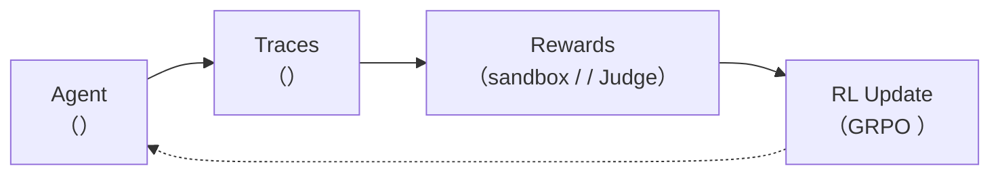
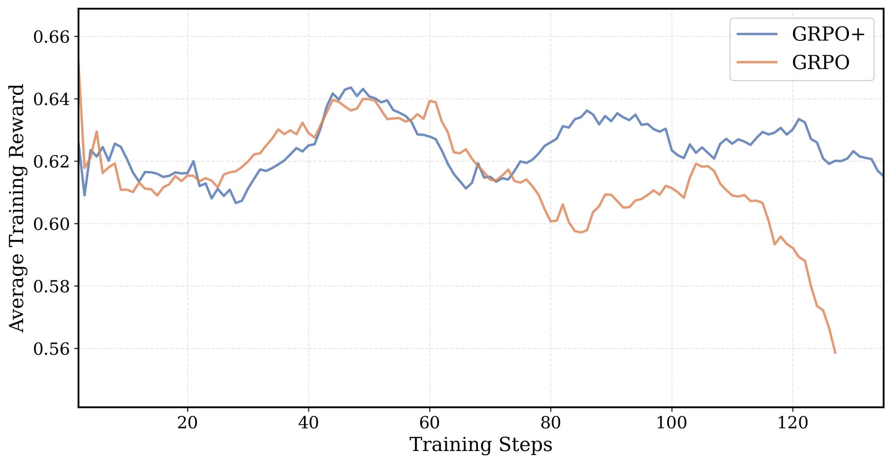
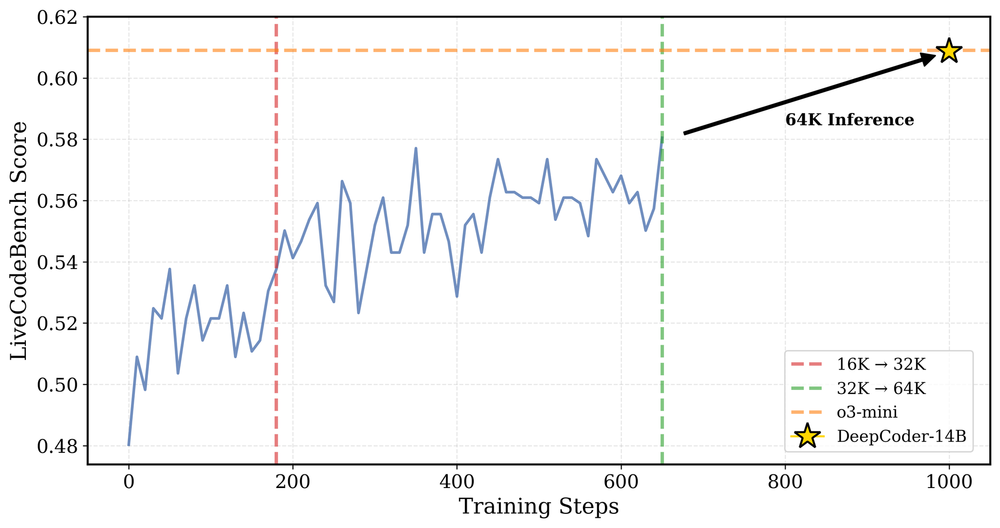

# 10.4 ： rLLM  DeepCoder Agent

 Agentic RL ——rollout、、、。：**（rLLM），" Agent  RL "——，，。**

 **DeepCoder**——Berkeley Sky Lab ， 14B  LiveCodeBench  60.6% Pass@1， OpenAI o3-mini。： rLLM ， RL 、。

### ：RL 

 Qwen2.5-Coder-3B-Instruct ， rLLM  GRPO RL ， LiveCodeBench 。：

|        |                                     | LiveCodeBench Pass@1 |                         |
| ---------- | --------------------------------------- | -------------------- | --------------------------- |
| **** | Qwen2.5-Coder-3B-Instruct（）       | ~30%                 |  RL       |
| **** | + DeepCoder RL（1 epoch, LoRA rank 32） | ~38-40%              | RL  8-10  |

，：

|                               | LiveCodeBench Pass@1  |
| --------------------------------- | --------------------- |
| Qwen3-4B-Instruct（）         | ~38%                  |
| + DeepCoder RL（1 epoch）         | ~46%                  |
| DeepCoder-14B-Preview（） | 60.6%（ o3-mini） |

 3B —— 24GB ，"RL  Agent "。


<div style="text-align: center; font-size: 0.9em; color: var(--vp-c-text-2); margin-top: -10px; margin-bottom: 20px;">
  <em> 1：DeepCoder  LiveCodeBench 。DeepCoder-14B-Preview（64K ） 60.6% Pass@1， o3-mini 。：<a href="https://pretty-radio-b75.notion.site/DeepCoder-A-Fully-Open-Source-14B-Coder-at-O3-mini-Level-1cf81902c14680b3bee5eb349a512a51" target="_blank" rel="noopener noreferrer">Agentica Blog</a></em>
</div>

## rLLM 

**rLLM**  Agentic RL  [^rllm]。：** Agent ，rLLM  gateway  LLM ，。**



rLLM ：

|            |  |                                             |
| -------------- | -------- | ----------------------------------------------- |
| **DeepCoder**  | 14B      | LiveCodeBench 60.6%， o3-mini [^deepcoder]  |
| **DeepScaleR** | 1.5B     | AIME 2024 43.1%， O1-Preview [^deepscaleR]  |
| **DeepSWE**    | 32B      | SWEBench-Verified 59%， SOTA [^deepswe]     |
| **FinQA**      | 4B       |  Qwen3-235B（59.7% vs 51.4%）[^finqa] |


<div style="text-align: center; font-size: 0.9em; color: var(--vp-c-text-2); margin-top: -10px; margin-bottom: 20px;">
  <em> 2：DeepCoder  RL 。、、sandbox  GRPO 。：<a href="https://pretty-radio-b75.notion.site/DeepCoder-A-Fully-Open-Source-14B-Coder-at-O3-mini-Level-1cf81902c14680b3bee5eb349a512a51" target="_blank" rel="noopener noreferrer">Agentica Blog</a></em>
</div>

## ：

### 

|           |                   |                   |
| ------------- | ------------------------- | --------------------- |
| （eval）  | 1  GPU（vLLM ） | RTX 4090 / A5000 24GB |
| （train） | 1  GPU（Tinker ）   | A100 80GB  2×A6000  |
|       |  GPU                |               |

### 

```bash
#  rllm（Python >= 3.11）
pip install rllm

#  cookbook
git clone https://github.com/rllm-org/rllm.git
cd rllm

#  deepcoder cookbook
uv pip install --no-deps -e cookbooks/deepcoder

# 
rllm agent list  #  "deepcoder"
```

### 

 OpenAI ：

```bash
#  Qwen2.5-Coder-3B （24GB ）
python -m vllm.entrypoints.openai.api_server \
  --model Qwen/Qwen2.5-Coder-3B-Instruct \
  --port 8000 \
  --tensor-parallel-size 1
```

，`http://localhost:8000/v1`  rLLM  `--base-url`。 `rllm eval`  `rllm train` 。

---

## ： rLLM  Reward

， rLLM  reward 。——DeepCoder  sandbox  Agent 。

### `@rllm.evaluator`：

rLLM  reward ：** Python 。**  `@rllm.evaluator` ， task（） episode（agent ）， `EvalOutput`：

```python
import rllm
from rllm.eval.types import EvalOutput, Signal
from rllm.types import Episode, Task

@rllm.evaluator
def my_evaluator(task: Task, episode: Episode) -> EvalOutput:
    # episode.artifacts  agent 
    answer = episode.artifacts.get("answer", "")

    # 
    reward = ...  # 0.0 ~ 1.0 

    return EvalOutput(
        reward=reward,                  # （0.0 ~ 1.0）
        is_correct=reward >= 0.7,       # ""（）
        signals=[                       # （）
            Signal(name="accuracy", value=...),
            Signal(name="format", value=...),
        ],
        metadata={...},                 # （）
    )
```

**？**

|       |       |                                                                                   |
| --------- | --------- | ----------------------------------------------------------------------------------------- |
| `task`    | `Task`    | ：`task.instruction`（ prompt）、`task.metadata`（ground truth ）           |
| `episode` | `Episode` | agent ：`episode.artifacts`（）、`episode.trajectories`（） |

**？**

|          |            |                                                                  |
| ------------ | -------------- | -------------------------------------------------------------------- |
| `reward`     | `float`        | ，0.0~1.0。RL                                  |
| `is_correct` | `bool`         | 。 Pass@1                                            |
| `signals`    | `list[Signal]` | 。****—— reward "" |
| `metadata`   | `dict`         | 。 pass/fail、judge              |

###  Reward 

，reward ：

#### ：Sandbox / RLVR（）

****：、——。

```python
@rllm.evaluator
def sandbox_evaluator(task, episode):
    answer = episode.artifacts.get("answer", "")
    code = extract_last_python_block(answer)

    #  sandbox ，
    results = run_tests(code, task.metadata["ground_truth"])

    all_passed = all(r["passed"] for r in results)
    return EvalOutput(
        reward=1.0 if all_passed else 0.0,  #  0  1
        is_correct=all_passed,
        signals=[Signal(name="accuracy", value=sum(r["passed"] for r in results) / len(results))],
        metadata={"test_results": results},
    )
```

：、、 API。DeepCoder 。

#### ：（）

****：、。

```python
@rllm.evaluator
def rule_evaluator(task, episode):
    answer = episode.artifacts.get("answer", "")
    meta = task.metadata or {}

    checks = {
        "format":      bool(re.search(r'<result>.*?</result>', answer, re.DOTALL)),
        "keyword_hit": meta.get("keyword", "") in answer,
        "length_ok":   50 <= len(answer) <= 2000,
    }

    # 
    reward = sum(checks.values()) / len(checks)

    return EvalOutput(
        reward=reward,
        is_correct=all(checks.values()),
        signals=[Signal(name=k, value=float(v)) for k, v in checks.items()],
    )
```

：、、 API。 Agent 。

#### ：LLM as Judge（）

****：、、。

```python
@rllm.evaluator
def llm_judge_evaluator(task, episode):
    answer = episode.artifacts.get("answer", "")
    from openai import OpenAI
    client = OpenAI()

    judge_prompt = f"""（1-5）：
：{task.instruction}
：{answer}
：1=, 3=, 5=
。"""

    resp = client.chat.completions.create(
        model="gpt-4o-mini",
        messages=[{"role": "user", "content": judge_prompt}],
        max_tokens=10,
    )
    score = int(re.search(r'(\d)', resp.choices[0].message.content).group(1))
    reward = score / 5.0

    return EvalOutput(
        reward=reward,
        is_correct=score >= 4,
        signals=[Signal(name="judge_score", value=score)],
    )
```

： API （ $0.01-0.05），。

#### ： + LLM Judge

——， judge。 Agent  reward ：

```python
# （0.8 ）：、、、
hard_reward = rule_based_check(answer, task.metadata)

# LLM Judge（0.2 ）：、、
llm_reward = llm_as_judge(answer, task.instruction)

total_reward = hard_reward + llm_reward  #  1.0
```

：**， judge。** ，；judge ，""。

###  Reward 

|                 |                                              |                                                            |
| ------------------- | ------------------------------------------------ | -------------------------------------------------------------- |
| **Reward ** |  0/1， 0，       | （ +0.2）， GRPO  group_size       |
| **Reward hacking**  | （） | ，                           |
| **Judge **    |  judge                 |  temperature=0，（rubric）， |
| ****        | ——     | （ 0 ），  |

### signals 

`signals` ——**。**  `reward`，； `signals`，、。

```text
#  reward —— 
Epoch 1 | reward_mean: 0.45

#  signals —— 
Epoch 1 | reward_mean: 0.45 | format: 0.92 | accuracy: 0.28 | budget_ok: 0.15
                              ^^^^^^^^^^^^     ^^^^^^^^^^^^^^    ^^^^^^^^^^^^^^^
                                        
```

： reward  budget_ok ，。

## ：？

### 

DeepCoder ， HuggingFace ：

|                | /   |                            |
| -------------------- | ----------- | ---------------------------------- |
| **LiveCodeBench v5** |  +  | ， |
| **TACO**             |         | ，     |
| **PrimeIntellect**   |         | ，       |
| **Codeforces**       |         | ，     |

### 

```bash
# ——200  train + 50  test，
python cookbooks/deepcoder/prepare_deepcoder_data.py \
  --train-size 200 --test-size 50

# ——
python cookbooks/deepcoder/prepare_deepcoder_data.py
```

 HuggingFace  `agentica-org/DeepCoder-Preview-Dataset`， rLLM  `DatasetRegistry`。

### ？

 JSON 。 LiveCodeBench （）：

```python
{
    # ：
    "question": """
You are given an array of integers `nums` and an integer `k`.
Return the maximum sum of a subarray of length exactly `k`.

Example 1:
  Input: nums = [1,4,2,10,23,3,1,0,20], k = 4
  Output: 39
  Explanation: The subarray [4,2,10,23] has the maximum sum.

Constraints:
  1 <= k <= nums.length <= 10^5
""",
    # ：，evaluator 
    "ground_truth": "["
        '{"input": "1 4 2 10 23 3 1 0 20\\n4", "output": "39", "testtype": "stdin_stdout"},'
        '{"input": "100 200 300\\n3", "output": "600", "testtype": "stdin_stdout"},'
        '{"input": "-1 -2 -3 -4\\n2", "output": "-3", "testtype": "stdin_stdout"}'
    "]",

    "data_source": "livecodebench",  # 
    "starter_code": "",              # 
    "uid": "lcb_v5_00142",          #  ID
}
```

：

- **`question`**  prompt 
- **`ground_truth`** -，****
- **`testtype`** ：
  - `stdin_stdout`： stdin ， stdout 
  - `functional`：，

 Codeforces ：

```python
{
    "question": """
Alice and Bob are playing a game. There are n piles of stones.
On each turn, a player removes 1 or 2 stones from any pile.
The player who cannot make a move loses.
Given n and the sizes of each pile, determine who wins if both play optimally.

Input: The first line contains n. The second line contains n integers.
Output: "Alice" or "Bob"
""",
    "ground_truth": "["
        '{"input": "3\\n1 2 3", "output": "Alice", "testtype": "stdin_stdout"},'
        '{"input": "2\\n4 4", "output": "Bob", "testtype": "stdin_stdout"}'
    "]",
    "data_source": "codeforces",
}
```

::: details 

`ground_truth`  JSON 。：

|        |                                                       |
| ---------- | --------------------------------------------------------- |
| `input`    | （stdin ）                        |
| `output`   | （stdout ）                             |
| `testtype` | `stdin_stdout`（） `functional`（） |

 `stdin_stdout` ，evaluator ：`echo "input" | python solution.py`， stdout  `output`。

 `functional` ，evaluator ， `input` ， `output`。
:::

## ：？Evaluator ？

### 

， assistant  + Python 。：

````
 k 。

：。 k ，，
、，。

 O(n)， O(1)。

```python
import sys

def solve():
    data = sys.stdin.read().split()
    nums = list(map(int, data[:-1]))
    k = int(data[-1])

    current_sum = sum(nums[:k])
    max_sum = current_sum

    for i in range(k, len(nums)):
        current_sum += nums[i] - nums[i - k]
        max_sum = max(max_sum, current_sum)

    print(max_sum)

solve()
````

```

### Evaluator 

evaluator ：

```

①  `python` 
②  sandbox ，
③ —— reward=1.0， reward=0.0

````

（， [cookbooks/deepcoder/deepcoder\_eval.py](https://github.com/rllm-org/rllm/blob/main/cookbooks/deepcoder/deepcoder_eval.py)）：

```python
@rllm.evaluator
def deepcoder_evaluator(task, episode):
    from rllm.rewards.code_reward import RewardCodeFn, RewardConfig

    # ①  episode  artifacts 
    answer = str(episode.artifacts.get("answer", ""))

    # ② RewardCodeFn  ```python``` 
    #     task  ground_truth 
    grader = RewardCodeFn(RewardConfig())
    result = grader(task_info=task_info(task), action=answer)

    # ③ 
    is_correct = bool(result.is_correct)
    return EvalOutput(
        reward=float(result.reward),       # 1.0（） 0.0（）
        is_correct=is_correct,             # True / False
        signals=[Signal(name="accuracy", value=1.0 if is_correct else 0.0)],
        metadata=result.metadata,          # 
    )
````

### ： case

。evaluator ：

```text
 1: input="1 4 2 10 23 3 1 0 20\n4"
            : "39"
            : "39"  ✅ PASS

 2: input="100 200 300\n3"
            : "600"
            : "600"  ✅ PASS

 3: input="-1 -2 -3 -4\n2"
            : "-3"
            : "-3"  ✅ PASS

 → reward = 1.0, is_correct = True
```

 bug，：

```text
 1: ✅ PASS
 2: ✅ PASS
 3:  "-3",  "-1"  ❌ FAIL

 → reward = 0.0, is_correct = False
```

reward  0  1 ——。 9  **RLVR（）**：， Reward Model 。

## ：——？

，：

```bash
rllm eval deepcoder \
  --agent deepcoder \
  --evaluator deepcoder \
  --model Qwen/Qwen2.5-Coder-3B-Instruct \
  --base-url http://localhost:8000/v1 \
  --split test \
  --max-examples 20
```

：

|                     |                                                   |
| ----------------------- | ----------------------------------------------------- |
| `--agent deepcoder`     |  deepcoder  AgentFlow（`@rllm.rollout` ） |
| `--evaluator deepcoder` |  deepcoder  evaluator（sandbox ）           |
| `--model`               | （ vLLM ）                        |
| `--base-url`            |                                           |
| `--split test`          | （）                          |
| `--max-examples 20`     |  20 ，                              |

### ？

， `~/.rllm/eval_results/` ：

```bash
# 
ls ~/.rllm/eval_results/
# : deepcoder_20260512_143022/

#  rllm view 
rllm view

#  JSON
cat ~/.rllm/eval_results/latest/*.json | python -m json.tool
```

 episode  JSON ：

```json
{
  "task_id": "lcb_v5_00142",
  "reward": 1.0,
  "is_correct": true,
  "signals": [{ "name": "accuracy", "value": 1.0 }],
  "metadata": {
    "test_results": [
      {
        "input": "1 4 2 10 23 3 1 0 20\n4",
        "expected": "39",
        "actual": "39",
        "passed": true
      },
      {
        "input": "100 200 300\n3",
        "expected": "600",
        "actual": "600",
        "passed": true
      },
      {
        "input": "-1 -2 -3 -4\n2",
        "expected": "-3",
        "actual": "-3",
        "passed": true
      }
    ],
    "num_passed": 3,
    "num_total": 3
  }
}
```

 episode ：

```json
{
  "task_id": "lcb_v5_00089",
  "reward": 0.0,
  "is_correct": false,
  "metadata": {
    "test_results": [
      {
        "input": "5\n1 2 3 4 5",
        "expected": "YES",
        "actual": "YES",
        "passed": true
      },
      {
        "input": "3\n1 1 1",
        "expected": "NO",
        "actual": "YES",
        "passed": false
      }
    ],
    "num_passed": 1,
    "num_total": 2,
    "error": "Test case 2 failed: expected 'NO', got 'YES'"
  }
}
```

****： `reward` —— episode  `reward` ， **Pass@1**（）。

```bash
#  Pass@1
python -c "
import json, glob
files = glob.glob('$HOME/.rllm/eval_results/latest/*.json')
results = [json.load(open(f)) for f in files]
pass1 = sum(r['reward'] for r in results) / len(results)
print(f'Pass@1: {pass1:.1%} ({sum(r["is_correct"] for r in results)}/{len(results)})')
"
```

：

```text
Pass@1: 30.0% (6/20)
```

 20  6 。。

## ： DeepCoder AgentFlow

， rLLM 。

DeepCoder **** Agent—— LLM 。 50 （， [cookbooks/deepcoder/deepcoder_flow.py](https://github.com/rllm-org/rllm/blob/main/cookbooks/deepcoder/deepcoder_flow.py)）：

````python
import rllm
from rllm.types import AgentConfig, Episode, Step, Task, Trajectory
from openai import AsyncOpenAI

SYSTEM_PROMPT = """\
You are a competitive programmer. Reason step by step, then put your
final solution in a single fenced code block:

```python
# your solution here
```
"""

@rllm.rollout(name="deepcoder")
async def deepcoder_flow(task: Task, config: AgentConfig) -> Episode:
    """One-shot coding flow: LLM emits a single response, evaluator grades."""
    question = str((task.metadata or {}).get("question", ""))
    client = AsyncOpenAI(base_url=config.base_url, api_key="EMPTY")

    messages = [
        {"role": "system", "content": SYSTEM_PROMPT},
        {"role": "user", "content": question},
    ]

    #  LLM 
    resp = await client.chat.completions.create(
        model=config.model, messages=messages,
        temperature=0.6, max_tokens=16384,
    )
    content = resp.choices[0].message.content or ""

    #  rLLM  Episode
    return Episode(
        trajectories=[Trajectory(name="deepcoder", steps=[
            Step(chat_completions=messages + [{"role": "assistant", "content": content}]),
        ])],
        artifacts={"answer": content},
    )
````

：

1. **`@rllm.rollout` **： async  rLLM  AgentFlow。gateway  `AsyncOpenAI` ， token IDs  logprobs。

2. **`config.base_url`**：eval ， rLLM  gateway。**，eval  training 。**

3. **`artifacts["answer"]`**：evaluator ， ` ```python ``` ` 。

## ：GRPO RL 

### 

```bash
rllm train deepcoder \
  --agent deepcoder \
  --evaluator deepcoder \
  --model Qwen/Qwen2.5-Coder-3B-Instruct \
  --group-size 4 \
  --batch-size 16 \
  --lora-rank 32 \
  --epochs 1 \
  --val-freq 20
```

### 

|            |   |                     |                              |
| -------------- | --- | ----------------------- | ---------------------------------- |
| `--group-size` | 4   | GRPO  4   |  advantage ，    |
| `--batch-size` | 16  |  16               |                          |
| `--lora-rank`  | 32  | LoRA —— | 16-64 ， |
| `--epochs`     | 1   |  1          |  2-3               |
| `--val-freq`   | 20  |  20         |                  |

### ？

GRPO （ 9 ）：

```text
：
  1.  4 （group_size=4）
     - ， 4 （temperature > 0）
     - /

  2. 
     - sandbox ： = 1.0， = 0.0
     -  4  reward  [0, 1, 0, 1]

  3.  advantage（GRPO ）
     -  = 0.5,  = 0.5
     - advantage = (reward - mean) / std
     - : [-1, +1, -1, +1]
     - : ，

  4. 
     -  advantage > 0 ：
     -  advantage < 0 ：
     -  LoRA ，
```



<div style="text-align: center; font-size: 0.9em; color: var(--vp-c-text-2); margin-top: -10px; margin-bottom: 20px;">
  <em> 3：GRPO+  GRPO 。GRPO+ ，。：<a href="https://pretty-radio-b75.notion.site/DeepCoder-A-Fully-Open-Source-14B-Coder-at-O3-mini-Level-1cf81902c14680b3bee5eb349a512a51" target="_blank" rel="noopener noreferrer">Agentica Blog</a></em>
</div>



<div style="text-align: center; font-size: 0.9em; color: var(--vp-c-text-2); margin-top: -10px; margin-bottom: 20px;">
  <em> 4：LiveCodeBench Pass@1 。 16K  32K ，。：<a href="https://pretty-radio-b75.notion.site/DeepCoder-A-Fully-Open-Source-14B-Coder-at-O3-mini-Level-1cf81902c14680b3bee5eb349a512a51" target="_blank" rel="noopener noreferrer">Agentica Blog</a></em>
</div>

### 

 rLLM ：

```text
Epoch 1 | Step  5 | loss: 0.352 | reward_mean: 0.25 | val_reward: 0.30
Epoch 1 | Step 10 | loss: 0.328 | reward_mean: 0.33 | val_reward: 0.35
Epoch 1 | Step 15 | loss: 0.298 | reward_mean: 0.38 | val_reward: 0.40
Epoch 1 | Step 20 | loss: 0.275 | reward_mean: 0.42 | val_reward: 0.43
...
```

|           |                   |                                     |
| ------------- | --------------------- | ------------------------------------------- |
| `loss`        | GRPO  loss    |                                     |
| `reward_mean` |  reward |                                     |
| `val_reward`  |  reward | ， reward_mean  |

 `reward_mean`  0——， `group_size`。

 rLLM UI ：

```bash
rllm ui  #  Web UI， episode 
```

### 

|        |              |                                                    |
| ---------- | -------------------- | ------------------------------------------------------ |
| **Tinker** | （1-2 GPU）  | ，                                     |
| **Verl**   | （ GPU） | `uv pip install -e ".[verl]"`， `train_verl.sh`  |

## ：——？

### 

****：

```bash
rllm eval deepcoder \
  --agent deepcoder \
  --evaluator deepcoder \
  --model Qwen/Qwen2.5-Coder-3B-Instruct \
  --base-url http://localhost:8000/v1 \
  --split test \
  --max-examples 50
```

### Before / After 

```text
Before RL Training ()
  Pass@1 (n=20): 30.0%    # 20  6 

After RL Training (1 epoch, LoRA rank 32)
  Pass@1 (n=50): 39.0%    # 50  ~20 ，+9 
```

### ？

 Pass@1 。：

**1. ？**

。DeepCoder —— TACO/PrimeIntellect/LiveCodeBench ， Codeforces/LiveCodeBench 。， `--split test` 。

**2.  Reward Hacking？**

 Pass@1 ， reward 。：

```bash
# ，
rllm view  #  episode 、、
```

 DeepCoder  sandbox reward，reward hacking ——，""。 Reward Model 。

**3. ？**

```bash
# ，
rllm eval deepcoder --split test --max-examples 50  #  1 
rllm eval deepcoder --split test --max-examples 50  #  2 
rllm eval deepcoder --split test --max-examples 50  #  3 
```

 37%-41% ，。 40%、 25%，。

### ？

 `rllm view`  episode ，RL ：

1. ****：、、
2. ****：，
3. **""**：GRPO 

 SFT —— RL 。

## ： reward ？

DeepCoder  reward  1.0  0.0 。？

**， reward ，。**

1. ****：`assert fib(10) == 55` ，。（、）。

2. **GRPO **： 0/1 。 GRPO  4 ， advantage 。

3. ** Reward Model**： RM  ML ——、 reward hacking。Sandbox 、、。

::: details  FinQA  judge LLM reward 

 rLLM cookbook，FinQA（ Agent） reward：

|         | DeepCoder              | FinQA                          |
| ----------- | ---------------------- | ------------------------------ |
| Reward  | Sandbox        | Judge LLM（gpt-5-nano）        |
| Reward    | 0.0 / 1.0              |  + table-access bonus  |
|     |                      |  OpenAI API                |
|         |                      |  $0.01-0.05          |
|     | 、 | 、 |

 RLVR ； reward （ 10.1  ORM vs PRM ）。
:::

##  DeepCoder 

### 

：

```bash
# 
rllm train deepcoder --model Qwen/Qwen3-8B

# 
rllm train deepcoder --model deepseek-ai/DeepSeek-Coder-V2-Lite-Instruct
```

### 

rLLM  benchmark：

```bash
rllm eval gsm8k    # 
rllm eval math     # 
rllm eval finqa    # （ Agent）
```

### FinQA： Agent

 rLLM ， FinQA cookbook。 ReAct Agent， 4 （SQL 、、）， 4B  235B  Qwen3 [^finqa]：

```bash
uv pip install --no-deps -e cookbooks/finqa
python cookbooks/finqa/prepare_finqa_data.py
rllm eval finqa --model rLLM/rLLM-FinQA-4B --base-url http://localhost:8000/v1
```

### ： Agent

DeepCoder 。 Agent——、、——rLLM 。**** reward ：， LLM as Judge。

#### AgentFlow： + 

```python
import rllm, json
from rllm.types import AgentConfig, Episode, Step, Task, Trajectory
from openai import AsyncOpenAI

# （ API）
TRAVEL_DB = {
    "": {"": {"": 500, "": 1200, "": 3000}, "": ["", "", ""]},
    "": {"": {"": 600, "": 1500, "": 4000}, "": ["", "", ""]},
    "": {"": {"": 800, "": 1800, "": 5000}, "": ["", "", ""]},
}

SYSTEM_PROMPT = """\
。，：

1.  <search></search> 
2. 
3. ：

<itinerary>
: xxx
: x
: xxx 
:
  Day 1: ...
  Day 2: ...
: xxx (xxx/)
: xxx 
</itinerary>
"""

@rllm.rollout(name="travel_agent")
async def travel_agent_flow(task: Task, config: AgentConfig) -> Episode:
    client = AsyncOpenAI(base_url=config.base_url, api_key="EMPTY")

    messages = [
        {"role": "system", "content": SYSTEM_PROMPT},
        {"role": "user", "content": task.instruction},  #  "3，5000"
    ]

    all_steps = []
    import re

    for turn in range(3):  #  3 
        resp = await client.chat.completions.create(
            model=config.model, messages=messages,
            temperature=0.7, max_tokens=2048,
        )
        content = resp.choices[0].message.content or ""
        messages.append({"role": "assistant", "content": content})
        all_steps.append(Step(model_response=content))

        #  <search>
        search_match = re.search(r'<search>(.*?)</search>', content)
        if search_match:
            query = search_match.group(1).strip()
            # 
            result = TRAVEL_DB.get(query, "，")
            obs = f"\n<search_result>\n{json.dumps(result, ensure_ascii=False, indent=2)}\n</search_result>\n"
            messages.append({"role": "user", "content": obs})
            all_steps.append(Step(model_response=obs))
        else:
            break  # ，

    # 
    final_content = messages[-1]["content"] if messages[-1]["role"] == "assistant" else ""

    return Episode(
        trajectories=[Trajectory(name="travel_agent", steps=all_steps)],
        artifacts={"answer": final_content},
    )
```

#### 

 + ：

```python
{
    "instruction": "3，5000，",
    "metadata": {
        "destination": "",
        "days": 3,
        "budget": 5000,
        "preferences": [""],
        "expected_attractions": [""],  # 
    }
}
```

#### Reward ： + LLM as Judge

。 sandbox ——""。 reward ：

```python
import rllm
from rllm.eval.types import EvalOutput, Signal
from rllm.types import Episode, Task
import re
from openai import OpenAI

@rllm.evaluator
def travel_evaluator(task, episode):
    answer = str(episode.artifacts.get("answer", ""))
    meta = task.metadata if hasattr(task, 'metadata') else task
    meta = meta or {}

    # ===== ：（） =====
    hard_reward = 0.0

    # 1. ： <itinerary> 
    has_itinerary = bool(re.search(r'<itinerary>.*?</itinerary>', answer, re.DOTALL))
    hard_reward += 0.2 if has_itinerary else 0.0

    # 2. 
    dest = meta.get("destination", "")
    has_dest = dest in answer if dest else True
    hard_reward += 0.1 if has_dest else 0.0

    # 3. 
    expected_days = meta.get("days", 0)
    day_matches = re.findall(r'Day (\d+)', answer)
    has_days = len(day_matches) >= expected_days if expected_days else True
    hard_reward += 0.1 if has_days else 0.0

    # 4. （ ≤  × 1.1， 10% ）
    budget = meta.get("budget", 0)
    cost_match = re.search(r'[:：]\s*(\d+)', answer)
    if cost_match and budget:
        cost = int(cost_match.group(1))
        hard_reward += 0.2 if cost <= budget * 1.1 else 0.0
    elif budget == 0:
        hard_reward += 0.2  # ，

    # 5. 
    expected = meta.get("expected_attractions", [])
    if expected:
        hits = sum(1 for a in expected if a in answer)
        hard_reward += 0.2 * (hits / len(expected))
    else:
        hard_reward += 0.2

    # ===== ：LLM as Judge（） =====
    llm_reward = 0.0

    if has_itinerary:  #  judge， API 
        client = OpenAI()  #  API key
        judge_prompt = f"""（1-5）：

：{meta.get('instruction', '')}
：
{answer}

：
1：
2：
3：
4：，
5：，

（1-5）。"""

        try:
            resp = client.chat.completions.create(
                model="gpt-4o-mini",
                messages=[{"role": "user", "content": judge_prompt}],
                max_tokens=10,
            )
            score_text = resp.choices[0].message.content.strip()
            llm_score = int(re.search(r'(\d)', score_text).group(1))
            llm_reward = llm_score / 5.0 * 0.2  #  0.2
        except Exception:
            llm_reward = 0.0  # judge ，

    # =====  reward =====
    total_reward = hard_reward + llm_reward  #  1.0

    return EvalOutput(
        reward=total_reward,
        is_correct=total_reward >= 0.7,
        signals=[
            Signal(name="hard_reward", value=hard_reward),     # 
            Signal(name="llm_reward", value=llm_reward),       # LLM judge 
            Signal(name="format", value=1.0 if has_itinerary else 0.0),
            Signal(name="budget_ok", value=1.0 if cost_match and int(cost_match.group(1)) <= budget * 1.1 else 0.0),
        ],
    )
```

#### Reward 

|       |                       |     |          |
| --------- | ------------------------- | ------- | ---------------- |
|       | （`<itinerary>`） | 0.2     |          |
|       |                 | 0.1     |        |
|       |                   | 0.1     |          |
|       |                   | 0.2     |          |
|       |               | 0.2     |        |
| LLM Judge |                   | 0.2     | GPT-4o-mini  |
| ****  |                           | **1.0** |                  |

#### ？

，`signals` ：

```json
{
  "task_id": "travel_001",
  "reward": 0.88,
  "is_correct": true,
  "signals": [
    { "name": "hard_reward", "value": 0.8 },
    { "name": "llm_reward", "value": 0.08 },
    { "name": "format", "value": 1.0 },
    { "name": "budget_ok", "value": 1.0 }
  ]
}
```

- `hard_reward = 0.8`  5  4 
- `llm_reward = 0.08`  LLM judge  2/5 （2/5 × 0.2 = 0.08）
- ：，

 `format = 0.0`， `<itinerary>` ——， SFT warmup  RL 。

 reward " + "：

- ****（、、）——、
- ** LLM as Judge**——
- ****——，

#### ？

， `reward` 。rLLM ，：

**rLLM （）：**

```
Episode（）
  └── Trajectory（ agent ）
        ├── Step 1（ 1  LLM ）
        │     ├── chat_completions:  messages 
        │     ├── model_response: 
        │     └── token_ids + logprobs: （gateway ）
        ├── Step 2（ 2  LLM ，）
        │     └── ...
        └── artifacts: （ {"answer": ""}）
```

|            |                 |                                                       |
| -------------- | ----------------------- | ----------------------------------------------------------- |
| **Episode**    |       | `reward` 、`is_correct`、`signals`                |
| **Trajectory** |  agent  | （`len(steps)`）、                    |
| **Step**       |  LLM          | `model_response` 、、 |

**—— Agent ：**

****：

```text
Episode reward: 0.92
  Trajectory (2 steps):
    Step 1:  "<search></search>" → 
    Step 2:  <itinerary>， 4800 （≤ 5000），

  Signals: format=1.0, budget_ok=1.0, hard_reward=0.8, llm_reward=0.12
  ：，judge  3/5 ，
```

****：

```text
Episode reward: 0.20
  Trajectory (1 step):
    Step 1:  <itinerary> ，""（）

  Signals: format=1.0, budget_ok=0.0, hard_reward=0.2, llm_reward=0.0
  ：——
```

**：**

|                |                              |                                            |
| ------------------ | ---------------------------------------- | ---------------------------------------------- |
| reward  0    | `len(steps) == 1`，          | ， SFT             |
| reward     | `hard_reward`  `llm_reward`  |                    |
| budget_ok  0 | `Step 2`                 | ， reward  |
|    | `Step 1`  `<search>`   |  query ，  |

** `rllm view` ：**

```bash
# 
rllm view

#  JSON
python -c "
import json, glob
episodes = [json.load(open(f)) for f in glob.glob('$HOME/.rllm/eval_results/latest/*.json')]

#  reward ，
episodes.sort(key=lambda e: e['reward'])
for ep in episodes[:3]:
    print(f\"Task {ep['task_id']}: reward={ep['reward']:.2f}\")
    for s in ep.get('signals', []):
        print(f\"  {s['name']}: {s['value']}\")
    print()
"
```

：

```text
Task travel_003: reward=0.20
  format: 1.0
  budget_ok: 0.0
  hard_reward: 0.2
  llm_reward: 0.0

Task travel_007: reward=0.40
  format: 1.0
  budget_ok: 0.0
  hard_reward: 0.4
  llm_reward: 0.0

Task travel_012: reward=0.52
  format: 0.0
  budget_ok: 0.0
  hard_reward: 0.3
  llm_reward: 0.02
```

： episode 、（、、）， reward 。

## 

[^rllm]: rLLM Team. "rLLM: Democratizing Reinforcement Learning for LLMs." [GitHub](https://github.com/rllm-org/rllm), 2025. Berkeley Sky Computing Lab  Agentic RL 。

[^deepcoder]: Agentica Project. "DeepCoder: A Fully Open-Source 14B Coder at O3-mini Level." [Blog](https://pretty-radio-b75.notion.site/DeepCoder-A-Fully-Open-Source-14B-Coder-at-O3-mini-Level-1cf81902c14680b3bee5eb349a512a51), 2025.  RL  DeepSeek-R1-Distilled-Qwen-14B ，LiveCodeBench 60.6% Pass@1。

[^deepscaleR]: Agentica Project. "DeepScaleR: Surpassing O1-Preview with a 1.5B Model by Scaling RL." [Blog](https://pretty-radio-b75.notion.site/DeepScaleR-Surpassing-O1-Preview-with-a-1-5B-Model-by-Scaling-RL-19681902c1468005bed8ca303013a4e2), 2025.  1.5B ，AIME 2024 43.1%， O1-Preview。

[^deepswe]: Agentica Project. "DeepSWE: Training a Fully Open-sourced, State-of-the-Art Coding Agent by Scaling RL." [Blog](https://pretty-radio-b75.notion.site/DeepSWE-Training-a-Fully-Open-sourced-State-of-the-Art-by-Scaling-RL-22281902c1468193aabbe9a8c59bbe33), 2025. 32B ，SWEBench-Verified 59%， SOTA。

[^finqa]: rLLM Team. "rLLM-FinQA: How a 4B Model Outperforms 235B and Rivals Gemini 2.5 Pro on Financial Analysis." [Blog](https://rllm-project.com/blog/post.html?post=finqa.md), 2026.  ReAct Agent，4B  Qwen3-235B。
