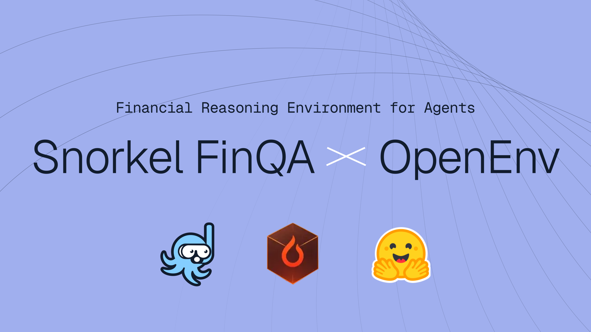
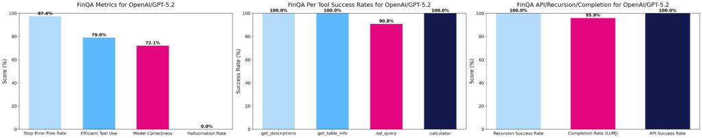

# 10.5 ： rLLM  Agent

 DeepCoder ：，，。，： reward ，。

。：

>  2023 ？ 2022 ？

，。， 10-K ，， SQL ，，。， **tool-use Agent**：

```text

  → 
  → 
  →  SQL 
  → 
  → 
  →  judge  benchmark 
```

 **rLLM-FinQA**， Agent 。 rLLM  Qwen3-4B-Instruct-2507  Agent， Snorkel Finance Benchmark  59.7% ， Qwen3-235B  51.4%， Gemini 2.5 Pro  60.6%[^rllm-finqa]。

 Agentic RL ，：，，。


<div style="text-align: center; font-size: 0.9em; color: var(--vp-c-text-2); margin-top: -10px; margin-bottom: 20px;">
  <em> 1：Snorkel  rLLM  Agent ，4B  Snorkel Finance Benchmark  235B 。：<a href="https://snorkel.ai/" target="_blank" rel="noopener noreferrer">Snorkel AI</a></em>
</div>

##  Agentic RL

。“”，“、、”。“”“”“”。。

， grounded 。“，”，、。，。 revenue  cost ，、。

 Agentic RL ：

- ****：、、SQL 、。
- ****：、 SQL、、。
- ****：、、、judge 。
- ****：，，。

 Web Agent ， Agent ； SWE Agent ，； RL ，。。

## rLLM-FinQA 

rLLM-FinQA ：，。

 `Qwen3-4B-Instruct-2507`， `rLLM/rLLM-FinQA-4B`。 5,110 ， 207 ； SEC 10-K ， 6,923 。 4,030 、522  558 [^rllm-finqa]。

。5,110 ，。“”，“，、 SQL、”。， ****，。

：

```json
{
  "question": "What was the ratio of R&D expenses to revenue in 2023?",
  "company": "example_corp",
  "tables": ["income_statement", "operating_expenses", "..."],
  "answer": "The ratio was ...",
  "metadata": {
    "source": "10-K",
    "split": "train"
  }
}
```

，：，，Agent 、、。

## Agent ：ReAct + 

rLLM-FinQA  ReAct  tool agent。 ReAct，“”“”：，，。

，Agent ：

|               |                                        |
| ----------------- | ------------------------------------------ |
| `get_table_names` |                    |
| `get_table_info`  | 、、 |
| `sql_query`       |  SQLite  SQL           |
| `calculator`      |                      |

：

```mermaid
flowchart TD
    Q[""] --> N["get_table_names\n"]
    N --> I["get_table_info\n"]
    I --> S["sql_query\n"]
    S --> C["calculator\n//"]
    C --> A["\n"]

    style Q fill:#e3f2fd,stroke:#1976d2,color:#000
    style A fill:#e8f5e9,stroke:#388e3c,color:#000
```



<div style="text-align: center; font-size: 0.9em; color: var(--vp-c-text-2); margin-top: -10px; margin-bottom: 20px;">
  <em> 2：rLLM-FinQA  Agent 。， get_table_names、get_table_info、sql_query  calculator  SEC 10-K ，。：<a href="https://snorkel.ai/" target="_blank" rel="noopener noreferrer">Snorkel AI</a></em>
</div>

，。 SQL，， revenue  net income，。，：，。

## Rollout 

 Agent ，。：

```text
Task:
   2023 ， 2022 。

Step 1:
  Thought: 。
  Action: get_table_names(company="...")
  Observation: ["consolidated_income_statement", "operating_expenses", ...]

Step 2:
  Thought: income statement  revenue，operating expenses  R&D。
  Action: get_table_info(table="operating_expenses")
  Observation: columns = ["year", "research_and_development", ...]

Step 3:
  Thought:  2022  2023 。
  Action: sql_query("SELECT year, research_and_development FROM operating_expenses WHERE year IN (2022, 2023)")
  Observation: [(2022, 1820), (2023, 2140)]

Step 4:
  Thought:  revenue。
  Action: sql_query("SELECT year, revenue FROM consolidated_income_statement WHERE year IN (2022, 2023)")
  Observation: [(2022, 39400), (2023, 42100)]

Step 5:
  Thought: 。
  Action: calculator("2140 / 42100 - 1820 / 39400")
  Observation: 0.0046

Final:
  2023  5.08%，2022  4.62%， 0.46 。
```

：Agentic RL “”，。， SQL； calculator，；。

## Reward： LLM-as-Judge

，。：。“ 0.46 ”“ 4.62%  5.08%”；，。

rLLM-FinQA  **LLM-as-Judge reward**。 GPT-5-nano  reward judge， Portkey gateway [^rllm-finqa]。

。Judge “”。 judge reward  rubric，：

```text
：
1. ；
2. ；
3. ；
4. ；
5. 。

 0  1 。
```

 judge ，； judge ，。Agentic RL  reward ，“ judge”， judge 。

，reward ：

```text
：
  SQL 
  
  

LLM judge：
  
  
  
```

，LLM judge 。。

## GRPO ：

rLLM-FinQA  GRPO 。 9  GRPO ：，，。

 Agent ，GRPO ，：

```text

  → rollout 1：，，reward = 1.0
  → rollout 2：，，reward = 0.5
  → rollout 3：，reward = 0.2
  → rollout 4：，reward = 0.0

GRPO ：
   rollout 1 
   rollout 2 
   rollout 3/4 
```

 SFT 。SFT ；GRPO ， reward 。， Web  SWE  bug  RL 。

## ：

，。：，，。

：

```bash
git clone https://github.com/rllm-org/rllm.git
cd rllm

#  rLLM  FinQA cookbook
uv pip install -e ".[tinker]"
uv pip install --no-deps -e cookbooks/finqa

# 
python cookbooks/finqa/prepare_finqa_data.py
```

：

-  Hugging Face  `rLLM/finqa` ；
-  207  6,923 ；
-  `train / val / test`  split；
-  rLLM  DatasetRegistry。

 OpenAI  vLLM ：

```bash
python -m vllm.entrypoints.openai.api_server \
  --model rLLM/rLLM-FinQA-4B \
  --host 0.0.0.0 \
  --port 30000 \
  --dtype bfloat16
```

 rLLM CLI ：

```bash
# OPENAI_API_KEY
export OPENAI_API_KEY=sk-...

rllm eval finqa \
  --agent finqa \
  --evaluator finqa \
  --model rLLM/rLLM-FinQA-4B \
  --base-url http://localhost:30000/v1 \
  --split test \
  --max-examples 20
```

，：，SQLite ，。，。

## ： GRPO 

，： verl  tinker LoRA 。

verl  4B ：

```bash
export OPENAI_API_KEY=sk-...

uv pip install -e ".[verl]"
bash scripts/install_megatron.sh <cu128|cu129|...>
bash cookbooks/finqa/train_verl.sh
```

tinker  30B MoE  LoRA ：

```bash
export OPENAI_API_KEY=sk-...

bash cookbooks/finqa/train_tinker.sh
```

，。 mini ：

1.  200  500 ；
2.  rollout group size；
3.  LoRA ；
4.  1  2  epoch；
5.  base model  RL model 。

 mini  59.7% ，：

```text
 → Agent rollout → judge reward → GRPO update → eval → 
```

， Agentic RL 。

## ：

：

|            |  | Snorkel Finance Benchmark  |
| -------------- | -------- | -------------------------------- |
| rLLM-FinQA-4B  | 4B       | 59.7%                            |
| Gemini 2.5 Pro |    | 60.6%                            |
| Qwen3-235B     | 235B     | 51.4%                            |



<div style="text-align: center; font-size: 0.9em; color: var(--vp-c-text-2); margin-top: -10px; margin-bottom: 20px;">
  <em> 3：Snorkel Finance Benchmark 。rLLM-FinQA-4B  59.7%， Gemini 2.5 Pro  60.6%， Qwen3-235B  51.4%。：<a href="https://snorkel.ai/" target="_blank" rel="noopener noreferrer">Snorkel AI</a></em>
</div>

： reward ，。。235B ，“ SEC 、 SQL、”。4B  Agent 。

，。：

|            |                                              |
| -------------- | ------------------------------------------------ |
|      | ，       |
| SQL      |  SQL                             |
|    |                        |
|      |                          |
| judge  | reward  0  1， |
|        |                    |

：？ SQL ，，？Agentic RL ，。

## 

 Agent “”，。

**。**  `income_statement` ， operating expense 。 `get_table_info` ， reward 。

** SQL 。**  `net_sales`  `revenue`， `research_and_development`  `selling_general_admin` 。 judge ，。

**。** “ 2022  2023 ”，。 judge rubric  ratio、percentage point、year-over-year growth。

**。**  SQL，，。Agentic RL ，。

** judge 。**  judge ，GRPO 。 judge temperature， judge ，。

## 

rLLM-FinQA ，，。， Agent：

1. ；
2. ；
3.  judge 。

：

|  |                    |                      | Reward             |
| -------- | ---------------------- | ------------------------ | ------------------ |
|  | 、、   | 、、 |  + judge   |
|  | 、、 | SQL、、    |  + judge |
|  | 、       | 、、     | rubric judge       |
|  | CSV、、  | SQL、Python、    |  + judge   |

，：

> ： rLLM  Agent

 100  300 、、 judge reward。，。

## 

rLLM-FinQA  Agentic RL ：，。、 SQL、、； LLM judge ， GRPO 。

 takeaway ：**Agentic RL ，、、reward  benchmark **。 Agent ，， RL  Agent 。

[^rllm-finqa]: rLLM ：[FinQA Financial Agent](https://docs.rllm-project.com/cookbooks/finqa)，、、、 benchmark 。
