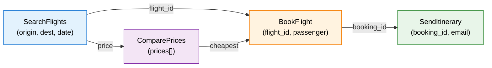
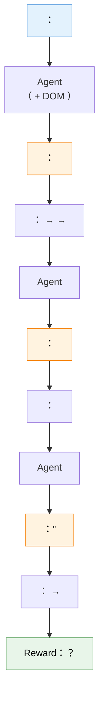

# 10.2 、 Agentic 

“”“ Agentic ”：，，、、 rollout 。

## ：

 RL 。，：**？**  LLM RL（ 9  GRPO） prompt + ，，，。 Agentic RL ——（、、），""， reward 。。 Agentic RL ——。

### ？

Agentic RL  RLHF 。 RLHF ，""""。 Agentic RL ，****——、、。

```mermaid
flowchart LR
    subgraph " RLHF "
        P1["Prompt"] --> R1[""]
        P1 --> R2[""]
    end

    subgraph "Agentic RL ："
        S[""] --> T1["："]
        T1 --> A1[" SearchAPI(query=...)"]
        A1 --> O1["： 5 "]
        O1 --> T2["：，"]
        T2 --> A2[" SearchAPI(query=...)"]
        A2 --> O2["："]
        O2 --> T3["："]
        T3 --> F[""]
    end

    style S fill:#e3f2fd,stroke:#1976d2,color:#000
    style P1 fill:#e3f2fd,stroke:#1976d2,color:#000
    style F fill:#e8f5e9,stroke:#388e3c,color:#000
```

， 10 ——：(1) ；(2) ；(3) ；(4) 。 7  30 。

：**，**。

### 

#### ：——

（Rejection Sampling）：，。

```python
def rejection_sampling(model, task, tool_env, num_samples=64):
    """：，"""
    trajectories = []
    for _ in range(num_samples):
        traj = model.interact_with_tools(task, tool_env)
        if traj.final_success:  # 
            trajectories.append(traj)
    return trajectories

# ： 5%， 64  3 
#  3 ""，
```

****——"/"。 9  RLVR 。

：**、**。 5%， 20  1 。，""——、，。

#### ：-——

，"-"（Director-Actor）。**""""**。

```mermaid
flowchart TD
    Task[""] --> D["\n（）"]
    D --> P["\n1. \n2. \n3. "]
    P --> A1["\n（）"]
    A1 --> T1[" 1："]
    P --> A2["\n（）"]
    A2 --> T2[" 2："]
    P --> A3["\n（）"]
    A3 --> T3[" 3："]

    style D fill:#e3f2fd,stroke:#1976d2,color:#000
    style A1 fill:#fff3e0,stroke:#f57c00,color:#000
    style A2 fill:#fff3e0,stroke:#f57c00,color:#000
    style A3 fill:#fff3e0,stroke:#f57c00,color:#000
```

，（" A， B， C"）。——。：

****。，""。——。

****。（），""。。

 IBSEN[^ibsen]、CoDi 。。

#### ：——Magnet[^magnet]

Magnet 。****（Function Signature Graph），。

，。""""，""""——。



Magnet ：

**MAGNIFY**（）：，，。""" →  API →  → "。

**CONNECT**（）：。，" →  →  → "。

Magnet ****。（、）， LLM 。 Magnet-14B ， BFCL-v3  ToolQuery 。

#### ：——LoopTool[^looptool]

LoopTool 。：**""——**。

LoopTool ****：

```mermaid
flowchart TD
    D[""] --> T[""]
    T --> E["\n（）"]
    E --> G["\n（GCP：）"]
    G --> H["\n（EDDE：）"]
    H --> V["\n（JGLV：）"]
    V --> D2[""]
    D2 --> T

    style D fill:#e3f2fd,stroke:#1976d2,color:#000
    style T fill:#fff3e0,stroke:#f57c00,color:#000
    style E fill:#f3e5f5,stroke:#7b1fa2,color:#000
    style G fill:#fce4ec,stroke:#c62828,color:#000
    style H fill:#e8f5e9,stroke:#388e3c,color:#000
    style V fill:#e0f7fa,stroke:#00695c,color:#000
```

：

**（GCP）**：，。"" 30%，"" 90%。

**（EDDE）**： GCP ，。""，EDDE 。

**（JGLV）**：，。——（" A  B"），。

LoopTool ： 32B  Qwen3 ， 8B  BFCL-v3 ** 32B **。。

#### ：——HardGen[^hardgen]

HardGen ""。：****。（）。

HardGen ：，。** API **——、。，。

， HardGen  4B ，——""。

#### ：——ECHO[^echo]

ECHO  11  HER（）：**——，**。

 11.3  HER：" A"， B。 A ， B 。ECHO  LLM —— LLM ""，，。

。，。 10%，90% 。ECHO ""。 11.3 ， ECHO "HER "——HER ，ECHO 。

#### ：ASTRA[^astra]

""。ASTRA ：，**、 RL **。""""——，ASTRA  GRPO/PPO （，）。。 SFT （） RL （），。

### 

|          |                      |  |   |  |        |
| ------------ | ---------------------------- | ------ | ----- | ---- | -------------- |
|      |  →  →      |      |     |    | GRPO、TinyZero |
| -    |                |      |     |    | IBSEN、CoDi    |
|      |    |      |   |    | Magnet         |
|      |  →  →  |  |   |    | LoopTool       |
|    |  |  |     |    | HardGen        |
|  |  |      | - |    | ECHO           |

，**LoopTool **。——。，。

### ：

，****。——、、""（）。

：

****：？？****——，。

****：？ 100 ""，""。****——，。

****：//？""，。 30%  + 50%  + 20% 。

****：，——****。STeCa（Step-level Trajectory Calibration）[^steca] ：，，。，，。"/"—— 7  6 ， 4 。STeCa  6 ， 4 ，。

```python
def filter_trajectories(trajectories, quality_threshold=0.7):
    """："""
    filtered = []
    for traj in trajectories:
        # 1. ：
        if not all(is_valid_call(call) for call in traj.tool_calls):
            continue

        # 2. ：
        if not is_coherent(traj):
            continue

        # 3. ：（ 1-2 ）
        if len(traj.turns) < 2 and traj.success:
            continue  # 

        # 4. 
        if traj.quality_score >= quality_threshold:
            filtered.append(traj)

    return filtered
```

###  9 

， 9  RLVR 。RLVR " reward"。—— reward，****。

，RLVR  Agentic RL ：

1. ****：， RLVR （）
2. ****： RLVR ， GRPO 
3. ****：，，（LoopTool  GCP ）

 Agentic RL  RLHF ：RLHF ，； Agentic RL  reward ——、——。

，""，""。TSR（Trajectory-Search Rollouts）[^tsr]  12 ——（beam search） best-of-N—— rollout 。，，。， TSR  PPO  GRPO ， 15% 。，TSR ""——。

<details>
<summary>：""？</summary>

。，""""。

：。—— 5 ， 6 。""， 5 。，""。

""——""，""。 reward ，。

</details>

<details>
<summary>： LoopTool  32B  8B ， 32B ？</summary>

——""。 LoopTool 。

32B ，。 LoopTool ""—— 8B ，。，"32B  +  8B "。 32B 。

：****。8B  32B，——，。" > "。

</details>

### ：

，：

```python
from dataclasses import dataclass, field
from typing import List, Optional
import random

@dataclass
class Trajectory:
    """"""
    task: str                          # 
    turns: List[dict] = field(default_factory=list)  #  (, , )
    success: bool = False              # 
    num_tool_calls: int = 0            # 

def trajectory_synthesis_pipeline(
    model, tool_env, tasks, num_samples_per_task=16, quality_threshold=0.6
):
    """： + """
    all_trajectories = []

    for task in tasks:
        #  1：
        candidates = []
        for _ in range(num_samples_per_task):
            traj = model.interact_with_tools(task, tool_env)
            candidates.append(traj)

        #  2：——
        success_trajs = [t for t in candidates if t.success]

        #  3：
        for traj in success_trajs:
            # ： 8  = 
            if traj.num_tool_calls > 8:
                continue

            # ：
            if not is_too_similar(traj, all_trajectories):
                traj.quality_score = compute_quality(traj)
                if traj.quality_score >= quality_threshold:
                    all_trajectories.append(traj)

    return all_trajectories

def is_too_similar(new_traj, existing_trajs, threshold=0.85):
    """（）"""
    new_actions = [t["action"] for t in new_traj.turns]
    for old_traj in existing_trajs:
        old_actions = [t["action"] for t in old_traj.turns]
        # ： Jaccard 
        overlap = len(set(new_actions) & set(old_actions))
        union = len(set(new_actions) | set(old_actions))
        if union > 0 and overlap / union > threshold:
            return True
    return False

def compute_quality(traj):
    """"""
    # ：（）
    efficiency = max(0.0, 1.0 - 0.1 * traj.num_tool_calls)

    # ： (, , )
    completeness = sum(
        1 for t in traj.turns
        if t.get("thought") and t.get("action") and t.get("observation")
    ) / max(len(traj.turns), 1)

    return 0.5 * efficiency + 0.5 * completeness
```

，： →  → 。， LoopTool ，。

 Agentic RL ： RL，"、"。

### 

[^ibsen]: Han S, Chen L, Lin L-M, et al. "[IBSEN: Director-Actor Agent Collaboration for Controllable and Interactive Drama Script Generation](https://arxiv.org/abs/2407.01093)." ACL 2024. —— -，。

[^magnet]: Yin F, Wang Z, Hsu I-H, et al. "[Magnet: Multi-turn Tool-use Data Synthesis and Distillation via Graph Translation](https://arxiv.org/abs/2503.07826)." ACL 2025. —— ， MAGNIFY/CONNECT 。

[^looptool]: LoopTool Team. "[LoopTool: Closing the Data-Training Loop for Robust LLM Tool Calls](https://arxiv.org/abs/2511.09148)." arXiv:2511.09148, 2025. —— ， GCP+JGLV+EDDE ""。[GitHub](https://github.com/Rednote-DeepExperience/LoopTool)

[^hardgen]: Hao B, et al. "[From Failure to Mastery: Generating Hard Samples for Tool-use Agents](https://arxiv.org/abs/2601.01498)." arXiv:2601.01498, 2026. —— 。[](https://huggingface.co/datasets/Bingguang/HardGen)

[^echo]: Hu B, et al. "[Sample-Efficient Online Learning in LM Agents via Hindsight Trajectory Rewriting](https://arxiv.org/abs/2510.10304)." arXiv:2510.10304, 2025. —— ECHO： HER ，，。

[^astra]: Tian X, Wang H, et al. "[ASTRA: Automated Synthesis of agentic Trajectories and Reinforcement Arenas](https://arxiv.org/abs/2601.21558)." arXiv:2601.21558, 2026. —— ： RL 。[GitHub](https://github.com/LianjiaTech/astra)

[^tsr]: Djuhera A, Kadhe S, et al. "[TSR: Trajectory-Search Rollouts for Multi-Turn RL of LLM Agents](https://arxiv.org/abs/2602.11767)." arXiv:2602.11767, 2026. —— （、best-of-N） rollout， 15% 。

[^steca]: Wang H, Wang J, et al. "[STeCa: Step-level Trajectory Calibration for LLM Agent Learning](https://arxiv.org/abs/2502.14276)." ACL 2025 Findings. —— ，。[GitHub](https://github.com/WangHanLinHenry/STeCa)

---

##  RL：Web Agent  Code Agent

 RL ——7 ，。：""？（SFT）" JSON "，"、、"。—— RL 。

###  RL ？

。SFT ""，：

```json
{ "tool": "sql_query", "query": "SELECT * FROM users WHERE age > 30" }
```

。，：

- ""，：？""？
-  10 ，：？？
- ，：？？

""——， SFT ，。RL ：""，""。

|          | SFT                        | RL                                     |
| -------- | -------------------------- | -------------------------------------- |
|    |          | 、、             |
|  |  | （/） reward |
|  |      |                  |
|  |      |                |
|  | Toolformer[^toolformer]    | ReTool、VERL-TOOL、ToolRL              |

### 

#### ReTool：[^retool]

ReTool（Reasoning with Tools）****，""。，""，（），。

RL ""。：，；，。""，SFT ，RL  reward 。

#### VERL-TOOL：[^verltool]

VERL-TOOL  RL ，、SQL 、Web 、。****——（、、） RL ， RL 。

#### MCP-RL：[^mcp_intro][^mcp_tools][^mcprl]

， RL ：。，，。，； RL ，。""， schema、、、，。

 MCP（Model Context Protocol） Agentic RL 。MCP  RL ，****： tools、resources  prompts， `tools/list` ， `tools/call` ，、、 schema  schema。，MCP ""。

 MCP  RL ，MDP ：

| RL     | MCP-RL                                           |
| ---------- | ---------------------------------------------------------- |
|  $s_t$ | 、、 MCP server    |
|  $a_t$ | ， MCP tool  JSON          |
|    | MCP server ，、、  |
|    | 、`tools/call` 、、          |
| reward     | 、、、 |

：MCP """ RL "。，； RL ，， reward，。、、，，，。

，，，、。，。MCP ""：， schema 。，""，。

。 LLM  token ；MCP-RL ：，，，，，。， loss， token：，，。 SearchR1、Code Agent  loss mask 。

OpenPipe  MCP-RL ： MCP server ，； agent ； RULER  LLM-as-judge ； GRPO 。""， MCP 。 agent， agent  agent，。

， Agentic RL 。MCP ，， rollout ，RULER  reward ，GRPO 。：、、。，，""""，""""。

，MCP-RL ：****。MCP ，，、。 RL ，。 reward ，、、，MCP ，。

：MCP ""，""。 `search` ，；；。，MCP ，reward 。：， reward，""，""。

， MCP ，： Agentic RL ****。PPO、GRPO、GSPO ；RLVR、RULER  PRM ；MCP 、、。，" agent"，、。

#### ToolRL： RL [^toolrl]

ToolRL  RL ****，。 LLM （ token），ToolRL " A"、" B"。""""。

```python
class ToolAugmentedPolicy(nn.Module):
    """："""

    def __init__(self, base_model, tools):
        super().__init__()
        self.base_model = base_model  #  LLM
        self.tools = tools             # 

    def forward(self, state):
        """
        （ + ），
        
        """
        #  logits
        logits = self.base_model(state)

        # " token"
        #  token，
        if self._is_tool_call(logits):
            tool_name, tool_args = self._parse_tool_call(logits)
            return ToolAction(tool_name, tool_args)
        else:
            return TextAction(logits)  # 
```

### ： Reward

 reward ——。 9  **RLVR（Reinforcement Learning from Verifiable Rewards）**  Agentic 。

|      | Reward             |                 |                 |
| -------- | ---------------------- | ------------------- | ----------------------- |
|  |          | （0-1）         |  reward |
|  |        | （0/1）         |  PRM        |
| Web  |        |  +  |       |
| SQL  |    |  +  |         |
|  |  |             |   |

： Agentic  reward ****。，（API 、、）。 Agent ""，""。

， RL  reward ：

$$R_{\text{total}} = R_{\text{task}} - \lambda_{\text{efficiency}} \cdot T - \lambda_{\text{format}} \cdot \mathbb{1}(\text{format error})$$

 $R_{\text{task}}$ （0  1），$T$ ，$\lambda_{\text{efficiency}}$ ，$\lambda_{\text{format}}$ 。"""" reward 。

```python
def compute_agent_reward(task_success, num_turns, max_turns=10):
    """ Agentic RL  reward"""
    #  reward
    success_reward = 1.0 if task_success else 0.0

    # ：，
    efficiency_penalty = -0.1 * (num_turns / max_turns)

    # 
    # （）
    format_penalty = -0.5 if has_format_error else 0.0

    return success_reward + efficiency_penalty + format_penalty
```

### Web Agent RL：

Web Agent  Agentic RL ：、、。，。

****。Web Agent ""，：、、、 URL。——（x, y） DOM  ID 。

****。Web Agent ：（） DOM （）。，DOM 。——， DOM 。

****。Web Agent  reward 。""，reward ：？？？



Web Agent RL 。 DOM ，，。 Agent ——""，""。

#### ReLook：[^relook]

 Web Agent reward  DOM 。ReLook  reward ——****。：Agent  →  →  LLM  →  RL  reward 。""， reward ""——，。

#### Agent Workflow Memory：[^awm]

Agent Workflow Memory（AWM） Web Agent ****。AWM  Agent （workflow）， Agent 。，Agent " →  →  → "，AWM ，。AWM  WebArena  Mind2Web ，"" Agent 。

#### Web-Shepherd： PRM[^webshepherd2]

 Web-Shepherd  PRM 。 Web Agent 。 Web Agent reward ""。Web-Shepherd ——"？""？"。（checklist）， 4  PRM， GPT-4o-mini  1/10。 Web Agent  reward  episode  reward，。

### Code Agent RL：、、

Code Agent RL **、、、**。 Web Agent ""——，" →  →  → "。

Code Agent  RL ：**reward **。（reward = 1），（reward < 1，）。 Web Agent ""。

```python
def code_agent_reward(generated_code, test_cases):
    """Code Agent  reward："""
    results = []
    for test_input, expected_output in test_cases:
        try:
            # 
            actual_output = execute_in_sandbox(generated_code, test_input)
            results.append(actual_output == expected_output)
        except Exception:
            results.append(False)  #  = 

    #  reward = 
    pass_rate = sum(results) / len(results)

    # ：（，）
    # ：
    return pass_rate
```

Code Agent RL  ICML 2025 ：** reward **。，" →  →  → " reward——，" → "。 ORM —— reward ，。

#### rStar2-Agent：14B  671B [^rstar2]

""， rStar2-Agent 。 14B ， 64  AMD MI300X GPU ** 510  RL **， AIME24  80.6% —— 671B  DeepSeek-R1。

rStar2-Agent  **GRPO-RoC**（Group Relative Policy Optimization with Resampling on Correct）。 GRPO ， GRPO-RoC ****——，，。。

 insight：(1) **Agentic RL **——510  RL  48 （671B vs 14B）， RL ；(2) ** + RL  + SFT**， RL ""，。

#### Agnostics： RL[^agnostics]

 Code Agent RL  Python 。Agnostics ：****， RL 。： → （）→  → 。 Python、Rust、Go  SQL，。 RL ，""——。、。

#### ：Agentic Code Reasoning[^agcodereason]

， Code Agent RL  reward ****——，。 Meta ，：****。""（Semi-Formal Reasoning）：、、——，，。

 93% 。：**，，**。 Code Agent RL ""—— reward ""，；，。

####  Scaling Law[^zeroscaling]

 12  RL  Scaling Law——，。Agentic RL  Scaling Law。ZeroTIR ****，。：、****。—— 100 ，，；，，。

：****——，""。ZeroTIR  NeurIPS 2025 。

<details>
<summary>：Web Agent  Code Agent  reward ？ RL ？</summary>

Web Agent  reward ****——，，。 reward ，。

Code Agent  reward ****——10  7 ，reward = 0.7。 reward ：，""。 Code Agent RL  Web Agent RL 。

：Web Agent RL  PRM（）， Code Agent RL  ORM（）。

</details>

###  RL：SearchR1 

 Web Agent  Code Agent ，、：****。、——、，""。"GRPO  PPO "，；"2025 "，——。

2025 ，SearchR1[^searchr1]（Jin et al.） RL ，**、、**。 ReSearch[^research]、ToRL[^torl] 。

####  prompting ？

 SearchR1 ， prompting ""。ReAct[^react]、Self-RAG[^selfrag] 。 prompting ：

**。**  prompt ""，""？（），。

** query 。** ""，——"quantum computing benchmark 2025"，"IBM quantum advantage vs Google Sycamore 2025"。****，。

**。**  5-10 。 = ， = 。 trade-off  RL 。

#### SearchR1  MDP 

SearchR1  MDP：

- ** $s_t$**：（ + ）
- ** $a_t$**：——(1)  token，(2)  query （ `<search>...</search>` ）
- ****：，
- ****：（RLVR）+ 

```
 + ：

: "2025 ？"

: " 2025 ，。"
: <search>2025 Turing Award winner</search>
: "The 2025 ACM Turing Award was given to..."
: "。"
: []

Reward:  - λ × 
```

 GRPO  + 。： loss  **mask **——。 RL ****—— SFT ，。

#### SearchR1 

- ** RL **。RL ，
- ** Scaling Law**。，，——
- ****。、

#### ：SearchR1 

|                        |                                                  |          |
| -------------------------- | -------------------------------------------------------- | ------------ |
| **SearchR1 **[^searchr1]   | RL ，GRPO + RLVR                         | 819          |
| **ReSearch **[^research]   | ，           | —            |
| **ToRL **[^torl]           | （）， Scaling Law | 131          |
| **ReTool **[^retool]       |  vs ，RL         | 247          |
| **ZeroTIR **[^zeroscaling] | ， Scaling Law       | NeurIPS 2025 |

ToRL[^torl]  32B  70B ，" +  > "。ReTool[^retool] ——，。

```python
def search_reward(answer, ground_truth, num_searches, max_searches=5):
    """ RL  reward """
    correctness = 1.0 if verify_answer(answer, ground_truth) else 0.0
    efficiency_penalty = -0.05 * num_searches  # 
    return correctness + efficiency_penalty
```

### 

， RL ：

**：SFT 。** ，" JSON "。——。

**：RL 。**  SFT ， RL 。——，。Reward （/）。

**：。**  RL ，——""。，。

```python
#  RL 
def tool_rl_training_loop(
    model, tool_env, tasks, num_epochs=100, group_size=4
):
    """ RL （）"""
    optimizer = torch.optim.Adam(model.parameters(), lr=1e-6)

    for epoch in range(num_epochs):
        for task in tasks:
            # （group sampling， GRPO）
            trajectories = []
            for _ in range(group_size):
                traj = model.interact_with_tools(task, tool_env)
                trajectories.append(traj)

            #  reward
            rewards = [compute_agent_reward(t.success, t.num_turns) for t in trajectories]

            # （GRPO ）： advantage
            mean_reward = np.mean(rewards)
            std_reward = np.std(rewards) + 1e-8
            advantages = [(r - mean_reward) / std_reward for r in rewards]

            # 
            for traj, advantage in zip(trajectories, advantages):
                loss = traj.total_log_prob * (-advantage)  # 
                loss.backward()

            optimizer.step()
            optimizer.zero_grad()
```

 9  GRPO ——"， advantage"。：GRPO ，。

###  RLVR 

， RL  reward  9  RLVR 。——**Agentic RL  RLVR **。RLVR " reward， Reward Model"。，：、SQL 、——，。

 Agentic RL （RLHF/DPO） Agent ： Reward Model ， Agent ，。

<details>
<summary>：SFT  + RL ， 2  DPO ？</summary>

" SFT  RL"——， RL 。。

：DPO  RL ""（）， RL  RL ""（）。 Reward Model（），（ Reward Model）。

：DPO —— prompt，。 RL ——。（）。

</details>

 Agentic RL 。

### 

[^toolformer]: Schick T, Dwivedi-Yu J, et al. "[Toolformer: Language Models Can Teach Themselves to Use Tools](https://arxiv.org/abs/2302.04761)." NeurIPS 2023. —— SFT ， LLM 。

[^retool]: Feng J, et al. "[ReTool: Reinforcement Learning for Strategic Tool Use in LLMs](https://arxiv.org/abs/2504.11536)." arXiv:2504.11536, 2025. ——  RL 。

[^toolrl]: Qian C, Acikgoz EC, et al. "[ToolRL: Reward is All Tool Learning Needs](https://arxiv.org/abs/2504.13958)." NeurIPS 2025. ——  RL ，。

[^verltool]: verl-tool Team. "[verl-tool](https://github.com/volcengine/verl-tool)." GitHub, 2025. —— VeRL ， RL 。

[^mcp_intro]: Model Context Protocol. "[What is the Model Context Protocol (MCP)?](https://modelcontextprotocol.io/docs/getting-started/intro)" —— MCP ， MCP  AI 。

[^mcp_tools]: Model Context Protocol. "[Tools](https://modelcontextprotocol.io/specification/2025-06-18/server/tools)" —— MCP ，、、 schema、。

[^mcprl]: OpenPipe ART. "[MCP-RL: Training Agents to Use MCP Servers](https://art.openpipe.ai/features/mcp-rl)" ——  MCP server  ART/GRPO ：、、RULER 。

[^rstar2]: Shang N, Liu Y, Zhu Y, et al. "[rStar2-Agent: Agentic Reasoning Technical Report](https://arxiv.org/abs/2508.20722)." arXiv:2508.20722, 2025. —— 14B  GRPO-RoC  AIME24  80.6%， 671B DeepSeek-R1。

[^agnostics]: Boruch-Gruszecki A, et al. "[Agnostics: Learning to Code in Any Programming Language](https://arxiv.org/abs/2508.04865)." arXiv:2508.04865, 2025. ——  RL ，。[](https://abgru.me/project/agnostics/)

[^agcodereason]: Ugare S, Chandra S. "[Agentic Code Reasoning](https://arxiv.org/abs/2603.01896)." arXiv:2603.01896, 2026. ——  93% 。

[^zeroscaling]: Mai X, Xu H, Wang X, et al. "[Agent RL Scaling Law: Agent RL with Spontaneous Code Execution for Mathematical Problem Solving](https://arxiv.org/abs/2505.07773)." NeurIPS 2025. —— ZeroTIR ：，。

[^relook]: Li Y, Zhang C, Lv R, et al. "[ReLook: Vision-Grounded RL with a Multimodal LLM Critic for Agentic Web Coding](https://arxiv.org/abs/2510.11498)." arXiv:2510.11498, 2025. ——  LLM  RL reward。

[^awm]: Wang Z, Mao J, et al. "[Agent Workflow Memory](https://arxiv.org/abs/2409.07429)." ICML 2025. ——  Agent ， Web 。[GitHub](https://github.com/zorazrw/agent-workflow-memory)

[^webshepherd2]: Chae H, et al. "[Web-Shepherd: Advancing PRMs for Reinforcing Web Agents](https://arxiv.org/abs/2505.15277)." NeurIPS 2025 Spotlight. ——  PRM， GPT-4o-mini ， 1/10。

[^searchr1]: Jin B, et al. "[Search-R1: Training LLMs to Reason and Leverage Search Engines with Reinforcement Learning](https://arxiv.org/abs/2503.09516)." COLM 2025.  RL 。[GitHub](https://github.com/PeterGriffinJin/Search-R1)

[^torl]: Li X, et al. "[ToRL: Scaling Tool-Integrated RL](https://arxiv.org/abs/2503.23383)." arXiv:2503.23383, 2025.  RL ， Scaling Law。

[^research]: Chen M, et al. "[ReSearch: Learning to Reason with Search for LLMs via Reinforcement Learning](https://arxiv.org/abs/2503.19470)." arXiv:2503.19470, 2025. 。

[^react]: Yao S, et al. "[ReAct: Synergizing Reasoning and Acting in Language Models](https://arxiv.org/abs/2210.03629)." ICLR 2023.  prompting 。

[^selfrag]: Asai A, et al. "[Self-RAG: Learning to Retrieve, Generate, and Critique through Self-Reflection](https://arxiv.org/abs/2310.11511)." ICLR 2024. 。

---

## Agentic RL 

 RL 、。""：？Agentic RL  LLM RL—— GPU ， CPU 、、。。

### ： Agentic RL 

 LLM RL （ 7  PPO  9  GRPO）， GPU ： GPU ，Reward Model  GPU ， GPU 。 GPU 。

 Agentic RL 。""，。 GPU ：

```mermaid
flowchart TD
    subgraph "Agentic RL "
        G["GPU: （/）"] --> D{"？"}
        D -->|""| G
        D -->|""| C1["CPU: "]
        D -->|""| C2[": "]
        D -->|""| C3[":  API"]
        C1 --> O[""]
        C2 --> O
        C3 --> O
        O --> G
    end

    subgraph "Reward "
        G --> R["\n（？？）"]
    end

    style G fill:#e3f2fd,stroke:#1976d2,color:#000
    style C1 fill:#fff3e0,stroke:#f57c00,color:#000
    style C2 fill:#fce4ec,stroke:#c62828,color:#000
    style C3 fill:#f3e5f5,stroke:#7b1fa2,color:#000
    style R fill:#e8f5e9,stroke:#388e3c,color:#000
```

：

****。——""""。Docker ，，。

****。RL 。—— query ，API 。，。

****。（）（ API ）。 RL ，GPU ； Agentic RL ，GPU ""， GPU 。

```python
import asyncio
import docker

class ToolSandbox:
    """： Docker """

    def __init__(self, image="python:3.11-slim", timeout=30):
        self.client = docker.from_client()
        self.image = image
        self.timeout = timeout

    async def execute(self, code: str) -> dict:
        """，"""
        try:
            container = self.client.containers.run(
                self.image,
                command=f"python -c '{code}'",
                detach=True,
                mem_limit="512m",      # 
                cpu_period=100000,
                cpu_quota=50000,        # CPU （50%）
                network_mode="none",    # 
                remove=True,
            )
            result = container.wait(timeout=self.timeout)
            output = container.logs().decode("utf-8")
            return {"success": result["StatusCode"] == 0, "output": output}
        except Exception as e:
            return {"success": False, "output": str(e)}
```

### ： LLM RL vs Agentic RL

， RL ：

|          |  LLM RL              | Agentic RL                                    |
| ------------ | ------------------------ | --------------------------------------------- |
| Rollout  | GPU              | GPU  + **CPU **（）   |
|      | （）         | **、Web 、**        |
| Reward   | Reward Model （GPU） | ****（/，）     |
| Episode  | （ max_tokens）  | ****（）              |
|      | GPU              | ****（）        |
|          |              | **/**， fallback  |
|      | （）         | ****（）              |

：**Agentic RL **—— GPU 、CPU 、、。 LLM RL " GPU"。

， LLM RL  GPU ：

$$\text{Throughput}_{\text{standard}} \propto \frac{1}{T_{\text{GPU}}}$$

 Agentic RL  GPU ****：

$$\text{Throughput}_{\text{agentic}} \propto \frac{1}{\max(T_{\text{GPU}}, T_{\text{tool}})}$$

 GPU （$T_{\text{tool}} \gg T_{\text{GPU}}$），GPU ——（） Agentic RL 。

### 

#### AWorld-RL： Agentic RL 

AWorld-RL  Agentic RL ，（、、）、、 RL 。" Agentic RL  Gymnasium "—— reward，、、。

#### Agent-R1： Agentic RL 

Agent-R1（） Agentic RL 。 MDP ， LLM 、。 BaseTool（）、BaseToolEnv（） ToolGenerationManager（），，。（Process Reward）（Outcome Reward），。

#### AReaL： RL 

AReaL（ & ）****—— Actor rollout、 Learner ，。， 2.77 ， Agentic RL 。 Agentic ， GPU 。

#### NeMo Gym：NVIDIA  Agent 

NeMo Gym  NVIDIA  Agentic RL ， Agent 。、，。

#### Agentic RL Training Recipes

Agentic RL Training Recipes ， RL  Agent RL 。、。

```mermaid
flowchart TD
    subgraph "Agentic RL "
        M["（GPU）"] -->|""| R[""]
        R -->|""| M
        R -->|""| P[""]
        P --> T1[""]
        P --> T2[""]
        P --> T3[""]
        P --> T4["Web "]
        T1 -->|""| M
        T2 -->|""| M
        T3 -->|""| M
        T4 -->|""| M
        M -->|"episode "| RE["Reward "]
        RE -->|"reward "| U["（GRPO/PPO）"]
        U --> M
    end

    style M fill:#e3f2fd,stroke:#1976d2,color:#000
    style R fill:#fff3e0,stroke:#f57c00,color:#000
    style P fill:#f3e5f5,stroke:#7b1fa2,color:#000
    style RE fill:#e8f5e9,stroke:#388e3c,color:#000
    style U fill:#fce4ec,stroke:#c62828,color:#000
```

### ： GPU 

 Agentic RL  GPU 。****——， GPU 。

```python
import asyncio

async def rollout_single_trajectory(model, task, sandbox, max_turns=10):
    """ rollout"""
    state = task.initial_state()
    turns = []

    for t in range(max_turns):
        # GPU: 
        action = await model.generate_async(state)
        turns.append(action)

        if action.is_final_answer():
            break

        # CPU/: 
        observation = await sandbox.execute_async(action)
        state = state.update(observation)

    return turns, task.evaluate(turns)

async def parallel_rollouts(model, tasks, sandbox, num_workers=16):
    """ rollout， GPU """
    coroutines = [
        rollout_single_trajectory(model, task, sandbox)
        for task in tasks
    ]
    # asyncio.gather ：， GPU
    results = await asyncio.gather(*coroutines)
    return results
```

：**GPU ，**。 A  CPU ，GPU  B 。——（GPU）。

， GPU  20-30%  70-80%， 2-3 。——、、。

### ：Agentic RL 

Agentic RL ——。：

|           |                          | Agentic RL                      |
| ------------- | -------------------------------- | --------------------------------------- |
|       | " token"（ 5-9 ）    | " + "（） |
| Reward    | RM  / （ 8-9 ）  | （， 9  RLVR）    |
|       | Token  PPO/RLHF（ 7-8 ） | Turn （，ORM vs PRM）         |
| GRPO  | （ 9 ）          | （）                |
|       | DQN  Replay Buffer（ 4 ）  | （）    |
|   | REINFORCE（ 5 ）             | （Turn-Level Discounting）  |
| Actor-Critic  | PPO（ 7 ）                   | Agentic PPO（Critic ）      |
| RLVR          | （ 9 ）            |               |

， Agentic RL  DQN 。DQN ，（CartPole ）。 Agentic RL ，（），。 Agentic RL ****——。

， Agent ？ Benchmark  Agentic RL ——， Pipeline ——。

### Agent 

 reward 。，** Agentic RL **。： Agent ，""" reward"。

#### Agent 

 Agent ：

**（Task Completion）。** Agent ？。（、SQL ）， binary signal；（、），。

**（Process Quality）。** Agent ？， Agent  50  5 ，，。：、、、。

**（Efficiency）。** Agent ？、、token 。——（），（）。

```python
def comprehensive_agent_reward(trajectory, final_result, task):
    """Agent """
    #  1: 
    completion = task.evaluate_result(final_result)  # 0.0 ~ 1.0

    #  2: 
    tool_calls = [t for t in trajectory if t.action_type == "tool_call"]
    effective_calls = [t for t in tool_calls if is_effective(t)]
    process_quality = (
        0.4 * (len(effective_calls) / max(len(tool_calls), 1))  # 
        + 0.3 * reasoning_coherence_score(trajectory)            # 
        + 0.3 * error_recovery_score(trajectory)                 # 
    )

    #  3: 
    efficiency = compute_efficiency(
        num_turns=len(trajectory),
        num_tool_calls=len(tool_calls),
        total_tokens=sum(t.token_count for t in trajectory),
        baseline=task.expected_complexity  # ：
    )

    # （）
    return (
        0.50 * completion +
        0.30 * process_quality +
        0.20 * efficiency
    )
```

####  Rubrics  Reward Model：

 Agent ，（Rubrics）。 Rubrics  reward，：

**Step 1：。** " Agent "。， Agent：、、、。

**Step 2：。** （ LLM-as-Judge） Agent 。"A  B ？？" ****——""。，。

**Step 3： Reward Model。**  RM—— 8  Reward Model  Bradley-Terry 。：Agent RM （）， RL  credit assignment。

#### ：RLER

Allen AI  DR Tulu  **RLER[^rler_eng]**（Reinforcement Learning with Evolving Rubrics）——。：

- ****：，。 reward。
- ****：，。、。
- ****：，。、、。

RLER ：， $N$ 。—— RLER ""，""。

#### ：ToolRL

**ToolRL[^toolrl_eng]**（NeurIPS 2025）。：** RL ，"" reward ，"" reward 。**

： reward （"3 "），。" + "，。

ToolRL ：

1. ** reward **：
2. ****：？？？
3. ****： → ； → 
4. ****： reward，

#### LLM-as-Judge：

 reward （、）， LLM ""：

```python
def llm_judge_reward(agent_output, task_description, judge_model):
    """ LLM  Judge """
    prompt = f""" Agent 。

: {task_description}

Agent :
{agent_output}

（0-10）：
1. : ？
2. : 、？
3. : 、？
4. : ？

 JSON : {{"completion": X, "accuracy": X, "structure": X, "citation": X}}"""

    scores = judge_model.generate(prompt)
    return weighted_average(scores, weights=[0.4, 0.3, 0.15, 0.15])
```

LLM-as-Judge 、；****（""）。， LLM-as-Judge ****，****。

#### 

：

|  |                         |                      |
| -------- | ------------------------------- | ------------------------ |
|  |  binary reward（/） |  |
|  |  Rubrics +  reward      |      |
|  | RLER  + LLM-as-Judge    |      |

：**reward "、"**。 reward——，，。

### 

 10 ：

**1. Agentic RL =  RL + 。** """"，。

**2. 。** 7 ，？ORM （），PRM （）。，（ MLMT-RL ）。

**3. RLVR  Agentic RL 。** ——、SQL —— Reward Model。

**4. 。** 、、—— Agentic RL 。

<details>
<summary>："" Code Agent， RL ？</summary>

，，：

**Reward **：""。 Code Agent ：（？？）、（？）、（？）。 reward 。

****：。 ORM ——。PRM " reward"（""）。

****：。 →  →  → ，。

****：，""——（）。

</details>

， Agentic RL 。、、。

### 

- Cheng M, Ouyang J, Yu S, et al. "[Agent-R1: Training Powerful LLM Agents with End-to-End Reinforcement Learning](https://arxiv.org/abs/2511.14460)." arXiv:2511.14460, 2025. —— Agentic RL ， MDP 。[GitHub](https://github.com/AgentR1/Agent-R1)
- AReaL Team. "[AReaL: Async RL for Language Reasoning](https://arxiv.org/abs/2505.24298)." arXiv:2505.24298, 2025. ——  &  RL ， 2.77 。[GitHub](https://github.com/inclusionAI/AReaL)
- NVIDIA. "[NeMo Gym](https://github.com/NVIDIA-NeMo/Gym)." —— NVIDIA  Agent 。
- Patil S, et al. "[The Berkeley Function Calling Leaderboard](https://gorilla.cs.berkeley.edu/leaderboard.html)." ICML 2025. —— BFCL ， LLM 。
- Jimenez C E, et al. "[SWE-bench: Can Language Models Resolve Real-World GitHub Issues?](https://arxiv.org/abs/2310.06770)." ICLR 2024. —— 。
- Zhou S, et al. "[WebArena: A Realistic Web Environment for Building Autonomous Agents](https://arxiv.org/abs/2307.13854)." ICLR 2024. —— Web Agent 。
- Mialon G, Fourrier C, Wolf T, et al. "[GAIA: A Benchmark for General AI Assistants](https://arxiv.org/abs/2311.12983)." ICLR 2024. ——  AI 。
- Chen C, et al. "[ACEBench: Who Wins the Match Point in Tool Usage?](https://arxiv.org/abs/2501.12851)." EMNLP 2025 Findings. —— 。
- Yao S, Shinn N, Razavi P, Narasimhan K. "[τ-bench: A Benchmark for Tool-Agent-User Interaction in Real-World Domains](https://arxiv.org/abs/2406.12045)." arXiv:2406.12045, 2024. —— 。
- Li M, et al. "[API-Bank: A Comprehensive Benchmark for Tool-Augmented LLMs](https://arxiv.org/abs/2304.08244)." EMNLP 2023. ——  LLM 。
- Qin Y, et al. "[ToolLLM: Facilitating Large Language Models to Master 16000+ Real-world APIs](https://arxiv.org/abs/2307.16789)." ICLR 2024. —— ToolBench 。
- Li J, et al. "[The Tool Decathlon](https://arxiv.org/abs/2510.25726)." ICLR 2026. —— Toolathlon，。
- Zhu J, Sang H, et al. "[Unlocking Agentic RL Training for GPT-OSS: A Practical Retrospective](https://huggingface.co/blog/LinkedIn/gpt-oss-agentic-rl)." Hugging Face Blog, 2026. —— LinkedIn  GPT-OSS MoE  Agentic RL ， attention sink backward 。
- Zhuang R, Vu T, et al. "[Improving Multi-Turn Tool Use with Reinforcement Learning](https://www.bespokelabs.ai/blog/improving-multi-turn-tool-use-with-reinforcement-learning)." Bespoke Labs Blog, 2025. —— GRPO  recipe。
- Moonshot AI. "[Kimi-Researcher: End-to-End RL Training for Emerging Agentic Capabilities](https://moonshotai.github.io/Kimi-Researcher/)." 2025. ——  REINFORCE ， partial rollout  context management 。
- Tongyi DeepResearch Team. "[Tongyi DeepResearch: From Chatbot to Autonomous Agent](https://tongyi-agent.github.io/blog/introducing-tongyi-deep-research/)." 2025. ——  Agentic CPT → SFT → RL ，30B MoE  Deep Research Agent。[GitHub](https://github.com/Alibaba-NLP/DeepResearch)
- Salesforce AI Research. "[Building Efficient RL Training for the Agentic Era](https://www.salesforce.com/blog/efficient-rl-training-agentic-era/)." 2026. —— SFR-RL  MoE Expert Parallelism 。
- Subramanian S, Xu P, Wang Y. "[Customizing Multiturn AI Agents with Reinforcement Learning](https://www.amazon.science/blog/customizing-multiturn-ai-agents-with-reinforcement-learning)." Amazon Science Blog, 2026. —— （72 ）RL  Agent ， > 。

[^rler_eng]: Shao R, Asai A, et al. "[DR Tulu: Reinforcement Learning with Evolving Rubrics for Deep Research](https://arxiv.org/abs/2511.19399)." arXiv, 2025.  RL ，。

[^toolrl_eng]: Qian C, et al. "[ToolRL: Reward is All Tool Learning Needs](https://openreview.net/forum?id=eOLdGbXT6t)." NeurIPS 2025. ， reward  reward。
