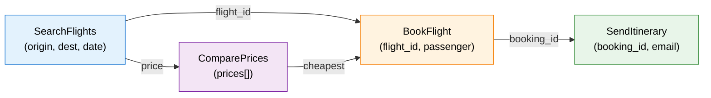

# ：（ 10.2）

> 。 [10.2 、 Agentic ](./tool-use-and-trajectory)。，。

# 12.2 ：

 RL 。，：**？**  LLM RL（ 9  GRPO） prompt + ，，，。 Agentic RL ——（、、），""， reward 。。 Agentic RL ——。

## ？

Agentic RL  RLHF 。 RLHF ，""""。 Agentic RL ，****——、、。

```mermaid
flowchart LR
    subgraph " RLHF "
        P1["Prompt"] --> R1[""]
        P1 --> R2[""]
    end

    subgraph "Agentic RL ："
        S[""] --> T1["："]
        T1 --> A1[" SearchAPI(query=...)"]
        A1 --> O1["： 5 "]
        O1 --> T2["：，"]
        T2 --> A2[" SearchAPI(query=...)"]
        A2 --> O2["："]
        O2 --> T3["："]
        T3 --> F[""]
    end

    style S fill:#e3f2fd,stroke:#1976d2,color:#000
    style P1 fill:#e3f2fd,stroke:#1976d2,color:#000
    style F fill:#e8f5e9,stroke:#388e3c,color:#000
```

， 10 ——：(1) ；(2) ；(3) ；(4) 。 7  30 。

：**，**。

## 

### ：——

（Rejection Sampling）：，。

```python
def rejection_sampling(model, task, tool_env, num_samples=64):
    """：，"""
    trajectories = []
    for _ in range(num_samples):
        traj = model.interact_with_tools(task, tool_env)
        if traj.final_success:  # 
            trajectories.append(traj)
    return trajectories

# ： 5%， 64  3 
#  3 ""，
```

****——"/"。 9  RLVR 。

：**、**。 5%， 20  1 。，""——、，。

### ：-——

，"-"（Director-Actor）。**""""**。

```mermaid
flowchart TD
    Task[""] --> D["\n（）"]
    D --> P["\n1. \n2. \n3. "]
    P --> A1["\n（）"]
    A1 --> T1[" 1："]
    P --> A2["\n（）"]
    A2 --> T2[" 2："]
    P --> A3["\n（）"]
    A3 --> T3[" 3："]

    style D fill:#e3f2fd,stroke:#1976d2,color:#000
    style A1 fill:#fff3e0,stroke:#f57c00,color:#000
    style A2 fill:#fff3e0,stroke:#f57c00,color:#000
    style A3 fill:#fff3e0,stroke:#f57c00,color:#000
```

，（" A， B， C"）。——。：

****。，""。——。

****。（），""。。

 IBSEN[^ibsen]、CoDi 。。

### ：——Magnet[^magnet]

Magnet 。****（Function Signature Graph），。

，。""""，""""——。



Magnet ：

**MAGNIFY**（）：，，。""" →  API →  → "。

**CONNECT**（）：。，" →  →  → "。

Magnet ****。（、）， LLM 。 Magnet-14B ， BFCL-v3  ToolQuery 。

### ：——LoopTool[^looptool]

LoopTool 。：**""——**。

LoopTool ****：

```mermaid
flowchart TD
    D[""] --> T[""]
    T --> E["\n（）"]
    E --> G["\n（GCP：）"]
    G --> H["\n（EDDE：）"]
    H --> V["\n（JGLV：）"]
    V --> D2[""]
    D2 --> T

    style D fill:#e3f2fd,stroke:#1976d2,color:#000
    style T fill:#fff3e0,stroke:#f57c00,color:#000
    style E fill:#f3e5f5,stroke:#7b1fa2,color:#000
    style G fill:#fce4ec,stroke:#c62828,color:#000
    style H fill:#e8f5e9,stroke:#388e3c,color:#000
    style V fill:#e0f7fa,stroke:#00695c,color:#000
```

：

**（GCP）**：，。"" 30%，"" 90%。

**（EDDE）**： GCP ，。""，EDDE 。

**（JGLV）**：，。——（" A  B"），。

LoopTool ： 32B  Qwen3 ， 8B  BFCL-v3 ** 32B **。。

### ：——HardGen[^hardgen]

HardGen ""。：****。（）。

HardGen ：，。** API **——、。，。

， HardGen  4B ，——""。

### ：——ECHO[^echo]

ECHO  11  HER（）：**——，**。

 11.3  HER：" A"， B。 A ， B 。ECHO  LLM —— LLM ""，，。

。，。 10%，90% 。ECHO ""。 11.3 ， ECHO "HER "——HER ，ECHO 。

### ：ASTRA[^astra]

""。ASTRA ：，**、 RL **。""""——，ASTRA  GRPO/PPO （，）。。 SFT （） RL （），。

## 

|          |                      |  |   |  |        |
| ------------ | ---------------------------- | ------ | ----- | ---- | -------------- |
|      |  →  →      |      |     |    | GRPO、TinyZero |
| -    |                |      |     |    | IBSEN、CoDi    |
|      |    |      |   |    | Magnet         |
|      |  →  →  |  |   |    | LoopTool       |
|    |  |  |     |    | HardGen        |
|  |  |      | - |    | ECHO           |

，**LoopTool **。——。，。

## ：

，****。——、、""（）。

：

****：？？****——，。

****：？ 100 ""，""。****——，。

****：//？""，。 30%  + 50%  + 20% 。

****：，——****。STeCa（Step-level Trajectory Calibration）[^steca] ：，，。，，。"/"—— 7  6 ， 4 。STeCa  6 ， 4 ，。

```python
def filter_trajectories(trajectories, quality_threshold=0.7):
    """："""
    filtered = []
    for traj in trajectories:
        # 1. ：
        if not all(is_valid_call(call) for call in traj.tool_calls):
            continue

        # 2. ：
        if not is_coherent(traj):
            continue

        # 3. ：（ 1-2 ）
        if len(traj.turns) < 2 and traj.success:
            continue  # 

        # 4. 
        if traj.quality_score >= quality_threshold:
            filtered.append(traj)

    return filtered
```

##  9 

， 9  RLVR 。RLVR " reward"。—— reward，****。

，RLVR  Agentic RL ：

1. ****：， RLVR （）
2. ****： RLVR ， GRPO 
3. ****：，，（LoopTool  GCP ）

 Agentic RL  RLHF ：RLHF ，； Agentic RL  reward ——、——。

，""，""。TSR（Trajectory-Search Rollouts）[^tsr]  12 ——（beam search） best-of-N—— rollout 。，，。， TSR  PPO  GRPO ， 15% 。，TSR ""——。

<details>
<summary>：""？</summary>

。，""""。

：。—— 5 ， 6 。""， 5 。，""。

""——""，""。 10.3  reward ，。

</details>

<details>
<summary>： LoopTool  32B  8B ， 32B ？</summary>

——""。 LoopTool 。

32B ，。 LoopTool ""—— 8B ，。，"32B  +  8B "。 32B 。

：****。8B  32B，——，。" > "。

</details>

## ：

，：

```python
from dataclasses import dataclass, field
from typing import List, Optional
import random

@dataclass
class Trajectory:
    """"""
    task: str                          # 
    turns: List[dict] = field(default_factory=list)  #  (, , )
    success: bool = False              # 
    num_tool_calls: int = 0            # 

def trajectory_synthesis_pipeline(
    model, tool_env, tasks, num_samples_per_task=16, quality_threshold=0.6
):
    """： + """
    all_trajectories = []

    for task in tasks:
        #  1：
        candidates = []
        for _ in range(num_samples_per_task):
            traj = model.interact_with_tools(task, tool_env)
            candidates.append(traj)

        #  2：——
        success_trajs = [t for t in candidates if t.success]

        #  3：
        for traj in success_trajs:
            # ： 8  = 
            if traj.num_tool_calls > 8:
                continue

            # ：
            if not is_too_similar(traj, all_trajectories):
                traj.quality_score = compute_quality(traj)
                if traj.quality_score >= quality_threshold:
                    all_trajectories.append(traj)

    return all_trajectories

def is_too_similar(new_traj, existing_trajs, threshold=0.85):
    """（）"""
    new_actions = [t["action"] for t in new_traj.turns]
    for old_traj in existing_trajs:
        old_actions = [t["action"] for t in old_traj.turns]
        # ： Jaccard 
        overlap = len(set(new_actions) & set(old_actions))
        union = len(set(new_actions) | set(old_actions))
        if union > 0 and overlap / union > threshold:
            return True
    return False

def compute_quality(traj):
    """"""
    # ：（）
    efficiency = max(0.0, 1.0 - 0.1 * traj.num_tool_calls)

    # ： (, , )
    completeness = sum(
        1 for t in traj.turns
        if t.get("thought") and t.get("action") and t.get("observation")
    ) / max(len(traj.turns), 1)

    return 0.5 * efficiency + 0.5 * completeness
```

，： →  → 。， LoopTool ，。

 Agentic RL ——[ RL：Web Agent  Code Agent](./tool-use-agents)，"、"。

## 

[^ibsen]: Han S, Chen L, Lin L-M, et al. "[IBSEN: Director-Actor Agent Collaboration for Controllable and Interactive Drama Script Generation](https://arxiv.org/abs/2407.01093)." ACL 2024. —— -，。

[^magnet]: Yin F, Wang Z, Hsu I-H, et al. "[Magnet: Multi-turn Tool-use Data Synthesis and Distillation via Graph Translation](https://arxiv.org/abs/2503.07826)." ACL 2025. —— ， MAGNIFY/CONNECT 。

[^looptool]: LoopTool Team. "[LoopTool: Closing the Data-Training Loop for Robust LLM Tool Calls](https://arxiv.org/abs/2511.09148)." arXiv:2511.09148, 2025. —— ， GCP+JGLV+EDDE ""。[GitHub](https://github.com/Rednote-DeepExperience/LoopTool)

[^hardgen]: Hao B, et al. "[From Failure to Mastery: Generating Hard Samples for Tool-use Agents](https://arxiv.org/abs/2601.01498)." arXiv:2601.01498, 2026. —— 。[](https://huggingface.co/datasets/Bingguang/HardGen)

[^echo]: Hu B, et al. "[Sample-Efficient Online Learning in LM Agents via Hindsight Trajectory Rewriting](https://arxiv.org/abs/2510.10304)." arXiv:2510.10304, 2025. —— ECHO： HER ，，。

[^astra]: Tian X, Wang H, et al. "[ASTRA: Automated Synthesis of agentic Trajectories and Reinforcement Arenas](https://arxiv.org/abs/2601.21558)." arXiv:2601.21558, 2026. —— ： RL 。[GitHub](https://github.com/LianjiaTech/astra)

[^tsr]: Djuhera A, Kadhe S, et al. "[TSR: Trajectory-Search Rollouts for Multi-Turn RL of LLM Agents](https://arxiv.org/abs/2602.11767)." arXiv:2602.11767, 2026. —— （、best-of-N） rollout， 15% 。

[^steca]: Wang H, Wang J, et al. "[STeCa: Step-level Trajectory Calibration for LLM Agent Learning](https://arxiv.org/abs/2502.14276)." ACL 2025 Findings. —— ，。[GitHub](https://github.com/WangHanLinHenry/STeCa)
