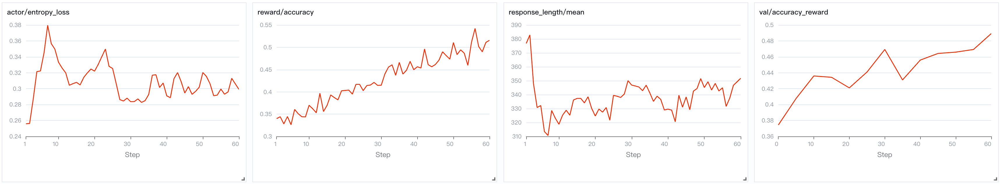

# 11.5 ： EasyR1  GeoQA 

11.1  VLM GRPO ——，。： [EasyR1](https://github.com/hiyouga/EasyR1)， GeoQA-8K  VLM 。

；EasyR1 。 1  CartPole  Stable Baselines3 ——，、、。

## EasyR1 

[EasyR1](https://github.com/hiyouga/EasyR1)（4900+ stars） [hiyouga](https://github.com/hiyouga) ， veRL 。 veRL ，EasyR1 ：

|      | veRL           | EasyR1                                           |
| -------- | ------------------ | ------------------------------------------------ |
| VLM  |        |  Qwen2-VL / Qwen3-VL         |
| LoRA     |              |  LoRA，                          |
| Padding  |  padding       | Padding-free training， token        |
|  | Python         | YAML + CLI ，                  |
|      | PPO                | GRPO / DAPO / REINFORCE++ / ReMax / RLOO  7  |
|  |  veRL  |  Python ， `compute_score()`     |
| Docker   |        | ，                         |

EasyR1 ：

```
EasyR1/
├── verl/                        # （ veRL fork）
│   ├── trainer/
│   │   ├── main.py              # ：OmegaConf  →  Ray
│   │   ├── config.py            # PPOConfig / DataConfig / AlgorithmConfig
│   │   ├── core_algos.py        #  advantage 
│   │   └── ray_trainer.py       # RayPPOTrainer（RL ）
│   ├── workers/
│   │   ├── actor/               #  worker（FSDP + LoRA）
│   │   ├── rollout/             #  worker（vLLM SPMD）
│   │   ├── reward/              #  worker
│   │   └── sharding_manager/    # FSDP + Ulysses 
│   └── utils/
│       └── dataset.py           # RLHFDataset（）
├── examples/
│   ├── config.yaml              # （）
│   ├── baselines/               # /
│   ├── reward_function/         # 
│   └── format_prompt/           # Jinja2 prompt 
└── scripts/
    └── model_merger.py          # checkpoint  HF 
```

，：`examples/`（）、`examples/reward_function/`（）、`examples/format_prompt/`（prompt ）。。


<div style="text-align: center; font-size: 0.9em; color: var(--vp-c-text-2); margin-top: -10px; margin-bottom: 20px;">
  <em> 1：EasyR1  GRPO ——、 advantage 。：<a href="https://github.com/hiyouga/EasyR1" target="_blank" rel="noopener noreferrer">EasyR1 GitHub</a></em>
</div>

##  GeoQA

[GeoQA-8K](https://huggingface.co/datasets/leonardPKU/GEOQA_8K_R1V) ，、。


<div style="text-align: center; font-size: 0.9em; color: var(--vp-c-text-2); margin-top: -10px; margin-bottom: 20px;">
  <em> 2：GeoQA ——（ +  + ），。。</em>
</div>

 VLM RL ：

1. ****——， Reward Model
2. ****—— OCR ，（、、）
3. ****——EasyR1  GeoQA-8K  baseline 

## 

###  EasyR1

 Docker（， vLLM + veRL + EasyR1 ）：

```bash
# 
docker pull hiyouga/verl:ngc-th2.8.0-cu12.9-vllm0.11.0

# ，
docker run -it --ipc=host --gpus=all \
  -v /path/to/data:/data \
  -v /path/to/models:/models \
  hiyouga/verl:ngc-th2.8.0-cu12.9-vllm0.11.0
```

：

```bash
git clone https://github.com/hiyouga/EasyR1.git
cd EasyR1
pip install -e ".[vllm]"
```

，EasyR1  `python3 -m verl.tainer.main`， `pip install easyr1`—— Python 。

### 

GeoQA-8K  HuggingFace，EasyR1  Hub ，：

```
：leonardPKU/GEOQA_8K_R1V
：leonardPKU/GEOQA_8K_R1V@train
：leonardPKU/GEOQA_8K_R1V@test
```

`@`  `train` / `test`  HuggingFace  split 。EasyR1  `RLHFDataset`  `load_dataset()` 。

：

```json
{
  "problem": "， ABCD ， AC、BD  O，？（：cm²） <image>",
  "answer": "12",
  "images": ["<PIL Image bytes>"]
}
```

：

- **`problem`** ， `<image>` 
- **`answer`** ，reward  `ground_truth` 
- **`images`** （bytes ），

EasyR1  `<image>`  token， messages ：

```python
[{"role": "user", "content": [
    {"type": "text", "text": "， ABCD ..."},
    {"type": "image"},
]}]
```

 messages—— `problem`  `<image>` ，。

## Prompt 

EasyR1  Jinja2  prompt，。GeoQA-8K  R1-V ：

```jinja2
{# examples/format_prompt/r1v.jinja（） #}
{{ content | trim }}
You FIRST think about the reasoning process as an internal monologue
and then provide the final answer.
The reasoning process MUST BE enclosed within <thinkutan> </thinkutan> tags.
The final answer MUST BE put in <answer> </answer> tags.
```

：

1. ， `<thinkutan>...</thinkutan>` ， `<answer>...</answer>` 
2.  `{{ content }}`  `problem` （ `<image>` ）

，：

```
， ABCD ... <image>
You FIRST think about the reasoning process...
The reasoning process MUST BE enclosed within <thinkutan> </thinkutan> tags.
The final answer MUST BE put in <answer> </answer> tags.
```

::: details ？
EasyR1  r1v.jinja  `<thinkutan>` / `</thinkutan>` —— R1-V ，。 r1v.py  `format_reward`  `</think\s*>`  `</thinkutan>`（ `` ）， 0。，。 EasyR1 ， `<thinkutan>` ——，（ format_reward ， reward  accuracy）。
:::

## Reward 

EasyR1  Python 。 `importlib` ，。GeoQA-8K  reward ：

```python
# examples/reward_function/r1v.py

import re
from typing import Any
from mathruler.grader import grade_answer

# ： reward 
REWARD_NAME = "r1v"          # 
REWARD_TYPE = "sequential"   # （vs "batch" ）


def format_reward(response: str) -> float:
    """ <thinkutan>...</thinkutan><answer>...</answer> """
    pattern = re.compile(
        r"<thinkutan>.*?</thinkutan>\s*<answer>.*?</answer>", re.DOTALL
    )
    return 1.0 if re.fullmatch(pattern, response) else 0.0


def accuracy_reward(response: str, ground_truth: str) -> float:
    """， mathruler """
    try:
        content_match = re.search(r"<answer>(.*?)</answer>", response)
        given_answer = (
            content_match.group(1).strip() if content_match else response.strip()
        )
        if grade_answer(given_answer, ground_truth.strip()):
            return 1.0
    except Exception:
        pass
    return 0.0


def compute_score(
    reward_input: dict[str, Any], format_weight: float = 0.5
) -> dict[str, float]:
    """
     reward 。 reward_input 。

    Args:
        reward_input: {
            "response": str,          # （ special tokens）
            "response_length": int,   # token 
            "ground_truth": str,      #  answer 
        }
        format_weight: （ YAML ）

    Returns:
        {"overall": float, "format": float, "accuracy": float}
        overall  GRPO ；format  accuracy ，。
    """
    format_score = format_reward(reward_input["response"])
    accuracy_score = accuracy_reward(
        reward_input["response"], reward_input["ground_truth"]
    )
    return {
        "overall": (1 - format_weight) * accuracy_score + format_weight * format_score,
        "format": format_score,
        "accuracy": accuracy_score,
    }
```

 reward ：

**（`format_reward`）**： `<thinkutan>`  `<answer>` 。 `format_weight`（ 0.5），。（math.py  0.1）——，""""。，format_reward=0，overall 。

**（`accuracy_reward`）**： `mathruler.grader.grade_answer()` 。——`12`、`12.0`、`12.00`、`12cm²` 。 `1 - format_weight`（ 0.5）。

**（`overall`）**：`0.5 * accuracy + 0.5 * format`。""""。。

`mathruler` ，、、。 `pip install mathruler` ， EasyR1 。

## 

EasyR1 ：`data`（）、`algorithm`（）、`worker`（/// worker ）、`trainer`（）。

### 

 GeoQA-8K （ EasyR1  baseline ）：

```bash
#!/bin/bash
# examples/baselines/qwen2_5_vl_3b_geoqa8k.sh

set -x
export PYTHONUNBUFFERED=1

MODEL_PATH=Qwen/Qwen2.5-VL-3B-Instruct  # 

python3 -m verl.tainer.main \
    config=examples/config.yaml \
    data.train_files=leonardPKU/GEOQA_8K_R1V@train \
    data.val_files=leonardPKU/GEOQA_8K_R1V@test \
    data.format_prompt=./examples/format_prompt/r1v.jinja \
    worker.actor.model.model_path=${MODEL_PATH} \
    worker.rollout.tensor_parallel_size=1 \
    worker.reward.reward_function=./examples/reward_function/r1v.py:compute_score \
    trainer.experiment_name=qwen2_5_vl_3b_geoqa8k \
    trainer.n_gpus_per_node=8
```

？

1. **`config=examples/config.yaml`**：（）
2. **`data.train_files=...`**：， HuggingFace Hub  GeoQA-8K
3. **`data.format_prompt=...`**： R1-V  prompt 
4. **`worker.actor.model.model_path=...`**：
5. **`worker.rollout.tensor_parallel_size=1`**：vLLM （3B ）
6. **`worker.reward.reward_function=...`**： reward （）
7. **`trainer.n_gpus_per_node=8`**： 8  GPU

CLI  YAML 。 `worker.actor.model.model_path`  YAML  `worker.actor.model.path`。 YAML 。

### 

（ LoRA、、 GRPO ）， CLI  YAML。 GeoQA ：

**（`data`）**：

```yaml
data:
  train_files: leonardPKU/GEOQA_8K_R1V@train # HuggingFace @split
  val_files: leonardPKU/GEOQA_8K_R1V@test
  prompt_key: problem # 
  answer_key: answer # 
  image_key: images # 
  max_prompt_length: 2048 # prompt  token （ token）
  max_response_length: 2048 #  token 
  rollout_batch_size: 512 #  rollout  batch size
  format_prompt: ./examples/format_prompt/r1v.jinja # prompt 
  min_pixels: 262144 # （512×512）
  max_pixels: 4194304 # （2048×2048）
  filter_overlong_prompts: true #  prompt
```

`rollout_batch_size: 512`  GRPO  512  prompt  `rollout.n` 。GeoQA-8K  8000 ， epoch  16 。

**（`algorithm`）**：

```yaml
algorithm:
  adv_estimator: grpo #  GRPO（）
  disable_kl: false #  KL 
  use_kl_loss: true # KL （vs ）
  kl_penalty: low_var_kl #  KL 
  kl_coef: 1.0e-2 # KL 
```

`low_var_kl`  KL ， KL 。`kl_coef=0.01`  EasyR1 ， PPO （0.05）， GRPO 。


<div style="text-align: center; font-size: 0.9em; color: var(--vp-c-text-2); margin-top: -10px; margin-bottom: 20px;">
  <em> 3：GRPO —— →  →  advantage → 。：<a href="https://abderrahmanskiredj.github.io/the-illustrated-grpo/" target="_blank" rel="noopener noreferrer">The Illustrated GRPO</a></em>
</div>

**Worker （`worker`）**：


<div style="text-align: center; font-size: 0.9em; color: var(--vp-c-text-2); margin-top: -10px; margin-bottom: 20px;">
  <em> 4：Qwen2.5-VL ——Vision Encoder  token， token  Qwen2.5 。EasyR1 。：<a href="https://debuggercafe.com/qwen2-5-vl-architecture-data-benchmarks-and-inference/" target="_blank" rel="noopener noreferrer">DebuggerCafe</a></em>
</div>

```yaml
worker:
  actor:
    global_batch_size: 128 # PPO  mini-batch 
    micro_batch_size_per_device_for_update: 1 #  micro batch
    max_grad_norm: 1.0 # 
    padding_free: true #  padding ，
    clip_ratio_low: 0.2 # PPO 
    clip_ratio_high: 0.3 # PPO （）
    model:
      model_path: Qwen/Qwen2.5-VL-3B-Instruct
      enable_gradient_checkpointing: true # ，
      freeze_vision_tower: false # 
      lora:
        rank: 0 # 0 = ；>0  LoRA
        alpha: 64
        target_modules: all-linear #  LoRA
        exclude_modules: .*visual.* # 
    optim:
      lr: 1.0e-6 # （VLM RL  1e-6 ~ 5e-6）
      strategy: adamw # 

  rollout:
    n: 5 #  prompt  5 （GRPO ）
    temperature: 1.0 # 
    top_p: 1.0 # top-p 
    tensor_parallel_size: 1 # vLLM 
    gpu_memory_utilization: 0.6 # vLLM 

  reward:
    reward_function: ./examples/reward_function/r1v.py:compute_score
    # ，
```

：

- **`rollout.n=5`**： prompt  5 。 GRPO ——5  advantage  reward 。 8  16  advantage ，
- **`clip_ratio_low/high = 0.2/0.3`**：——（0.2）（0.3），
- **`freeze_vision_tower: false`**：。，
- **`lora.rank=0`**：。， `rank=16`  `rank=32`  LoRA， `target_modules: all-linear`  `exclude_modules: .*visual.*`， LoRA

**（`trainer`）**：

```yaml
trainer:
  total_epochs: 15 # 
  val_freq: 5 #  5 
  val_before_train: true # （ baseline）
  save_freq: 5 #  5  checkpoint
  save_limit: 3 #  3  checkpoint
  find_last_checkpoint: true #  checkpoint 
  logger: ['console', 'wandb'] # 
  project_name: easy_r1 # WandB 
  experiment_name: qwen2_5_vl_3b_geoqa8k # 
  nnodes: 1 # 
  n_gpus_per_node: 8 #  GPU 
```

### LoRA （）

 1~2  24GB  GPU， LoRA ：

```bash
python3 -m verl.tainer.main \
    config=examples/config.yaml \
    data.train_files=leonardPKU/GEOQA_8K_R1V@train \
    data.val_files=leonardPKU/GEOQA_8K_R1V@test \
    data.format_prompt=./examples/format_prompt/r1v.jinja \
    worker.actor.model.model_path=Qwen/Qwen2.5-VL-7B-Instruct \
    worker.actor.model.lora.rank=16 \
    worker.actor.model.lora.alpha=64 \
    worker.actor.model.lora.target_modules=all-linear \
    worker.actor.model.lora.exclude_modules=".*visual.*" \
    worker.actor.model.freeze_vision_tower=true \
    worker.rollout.tensor_parallel_size=1 \
    worker.reward.reward_function=./examples/reward_function/r1v.py:compute_score \
    trainer.n_gpus_per_node=2 \
    trainer.experiment_name=qwen2_5_vl_7b_geoqa8k_lora
```

：

- `lora.rank=16`： LoRA， 0.1%
- `freeze_vision_tower=true`：（LoRA ，）
- `exclude_modules=".*visual.*"`：LoRA ，

## 

### 

—— baseline ：

```bash
bash examples/baselines/qwen2_5_vl_3b_geoqa8k.sh
```

 CLI （）：

```bash
python3 -m verl.tainer.main \
    config=examples/config.yaml \
    data.train_files=leonardPKU/GEOQA_8K_R1V@train \
    data.val_files=leonardPKU/GEOQA_8K_R1V@test \
    data.format_prompt=./examples/format_prompt/r1v.jinja \
    worker.actor.model.model_path=Qwen/Qwen2.5-VL-3B-Instruct \
    worker.rollout.tensor_parallel_size=1 \
    worker.reward.reward_function=./examples/reward_function/r1v.py:compute_score \
    trainer.experiment_name=my_geoqa_exp \
    trainer.n_gpus_per_node=8
```

Ray  `main.py` —— Ray 。EasyR1  `Runner`  Ray remote actors  actor worker（） rollout worker（）， HybridEngine  GPU ，。

### 

：

```bash
#  1（head ）
ray start --head --port=6379 --dashboard-host=0.0.0.0

#  2+（worker ）
ray start --address=<head_node_ip>:6379

# 
ray status

#  head 
python3 -m verl.tainer.main \
    config=examples/config.yaml \
    data.train_files=leonardPKU/GEOQA_8K_R1V@train \
    data.val_files=leonardPKU/GEOQA_8K_R1V@test \
    data.format_prompt=./examples/format_prompt/r1v.jinja \
    worker.actor.model.model_path=Qwen/Qwen2.5-VL-7B-Instruct \
    worker.rollout.tensor_parallel_size=4 \
    worker.reward.reward_function=./examples/reward_function/r1v.py:compute_score \
    trainer.nnodes=2 \
    trainer.n_gpus_per_node=8 \
    trainer.experiment_name=qwen2_5_vl_7b_geoqa8k_multinode
```

：

- `trainer.nnodes=2`： 2 
- `worker.rollout.tensor_parallel_size=4`：vLLM  4 
- `worker.actor.ulysses_size=1`：Ulysses （）

### 

，：

```
[Step 1]  train | reward/overall=0.28 | reward/format=0.45 | reward/accuracy=0.11 | kl=0.000 | loss=2.34
[Step 5]  val   | reward/overall=0.35 | reward/format=0.52 | reward/accuracy=0.18
[Step 6]  train | reward/overall=0.41 | reward/format=0.61 | reward/accuracy=0.21 | kl=0.003 | loss=1.89
[Step 10] val   | reward/overall=0.53 | reward/format=0.68 | reward/accuracy=0.38
...
```

 step ：

- **`reward/overall`**：GRPO ，`0.5 * accuracy + 0.5 * format`
- **`reward/format`**：—— `<thinkutan>/<answer>` 
- **`reward/accuracy`**：—— ground truth 

 WandB（`trainer.logger`  `"wandb"`），， WandB dashboard 。

## 



<div style="text-align: center; font-size: 0.9em; color: var(--vp-c-text-2); margin-top: -10px; margin-bottom: 20px;">
  <em> 5：Qwen2.5-VL-7B  Geo3K/GeoQA  EasyR1 GRPO  reward  accuracy 。：<a href="https://github.com/hiyouga/EasyR1" target="_blank" rel="noopener noreferrer">EasyR1 GitHub</a></em>
</div>

### Reward 

GeoQA-8K ：

** 1：（step 1~30）**。`format`  0.8+，`accuracy` 。""—— `<thinkutan>...<answer>...` ，。——。

** 2：（step 30~100）**。`accuracy` ，`format` 。。 `overall`  `accuracy` 。

** 3：（step 100+）**。`accuracy` ，——（、）， RL 。

### 

****（reward/overall ≈ 0.0）：

```
12
```

，，。

** 1**（reward/overall ≈ 0.5，format ≈ 1.0，accuracy ≈ 0.0）：

```
<thinkutan></thinkutan><answer>8</answer>
```

（`<thinkutan>/<answer>` ），，。

** 2**（reward/overall ≈ 0.7，format ≈ 1.0，accuracy ≈ 0.4）：

```
<thinkutan>， ABCD 。
，。
， 24 cm²，
 12 cm²。</thinkutan><answer>12</answer>
```

，。

### KL 

KL ，。 KL （ 0.01  0.1），， `worker.actor.optim.lr`  `algorithm.kl_coef`。

EasyR1  `low_var_kl` ， KL ，。

##  Reward 

 reward， Python 。：

```python
# my_reward.py

from typing import Any

REWARD_NAME = "my_geoqa"     # 
REWARD_TYPE = "batch"        # "batch"   "sequential" 


def compute_score(
    reward_inputs: list[dict[str, Any]], **kwargs
) -> list[dict[str, float]]:
    """
    reward_inputs ：
    - response: str        
    - response_length: int token 
    - ground_truth: str     answer 

     "overall" （GRPO ），
    ，。
    """
    scores = []
    for reward_input in reward_inputs:
        response = reward_input["response"]
        gt = reward_input["ground_truth"]

        # 
        accuracy = 1.0 if check_answer(response, gt) else 0.0
        format_score = check_format(response)

        scores.append({
            "overall": 0.7 * accuracy + 0.3 * format_score,
            "accuracy": accuracy,
            "format": format_score,
        })
    return scores
```

：

```bash
worker.reward.reward_function=./my_reward.py:compute_score
```

`REWARD_TYPE` ：

- **`"batch"`**： `list[dict]`， `list[dict]`。（ GPU  reward model）
- **`"sequential"`**： `dict`， `dict`。。（ r1v.py）

`**kwargs`  YAML  `worker.reward.reward_function_kwargs` 。 r1v.py  `format_weight` 。

## Checkpoint 

，EasyR1  checkpoint  `checkpoints/<project_name>/<experiment_name>/global_step_N/`。checkpoint  actor 、。

 checkpoint  HuggingFace ：

```bash
python scripts/model_merger.py \
    --model_path Qwen/Qwen2.5-VL-3B-Instruct \
    --adapter_checkpoint checkpoints/easy_r1/qwen2_5_vl_3b_geoqa8k/global_step_15/actor \
    --output_path ./merged_geoqa_model
```

 transformers ：

```python
from transformers import Qwen2_5_VLForConditionalGeneration

model = Qwen2_5_VLForConditionalGeneration.from_pretrained(
    "./merged_geoqa_model"
)
```

 LoRA，`model_merger.py`  LoRA 。， LoRA 。

##  11.1 

|      | 11.1  GRPO           |  EasyR1                                  |
| -------- | ------------------------ | -------------------------------------------- |
|    | （） | GeoQA-8K                           |
|  | `model.generate()`   | vLLM continuous batching                     |
|  |  AdamW               | veRL + FSDP                                  |
|  |                        | LoRA + padding-free + gradient checkpointing |
|    |                    | Ray ，                       |
|      | print                    | WandB / TensorBoard / SwanLab                |
|  | ~500 ，          | ~8K ，                               |

EasyR1 ：vLLM rollout 、FSDP 、LoRA 、、checkpoint 。：(1) ，(2) reward 。 VLM RL 。

## 

1. ****： Qwen2.5-VL-3B  7B 。3B ， accuracy 
2. ****： `algorithm.adv_estimator`  `grpo`  `dapo`  `reinforce_plus_plus`，。EasyR1  7 ，
3. ** LoRA **：，`lora.rank=0`（）vs `lora.rank=16`（LoRA）， accuracy 
4. ** `format_weight`**： 0.5  0.1  0.9，
5. ** rollout.n**： 5  8  16， GRPO  advantage 

## 

" GRPO  VLM"""。、、 VisPlay  Agent 。

：**VLM RL  GRPO/PPO， reward """、、"。**  reward  VLM RL ——、、。

 EasyR1 ：r1v.py  reward （format + accuracy）， reward ——****。" →  → "，reward 。
