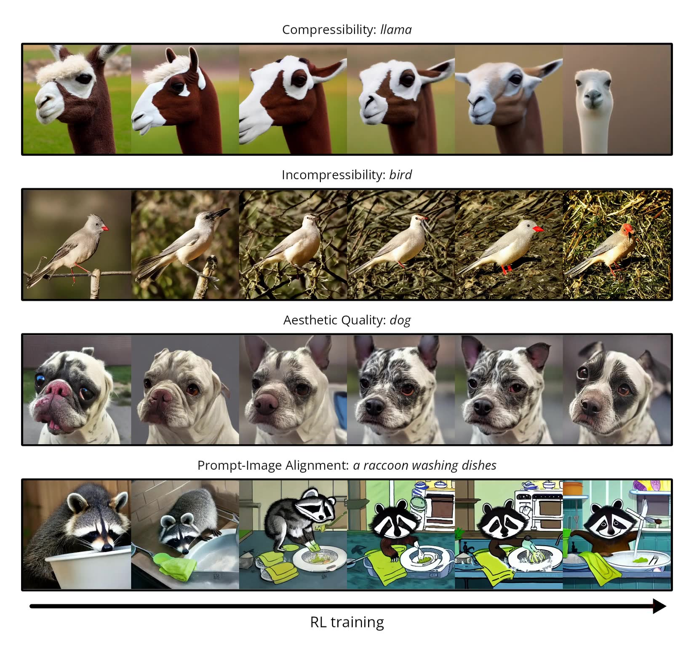
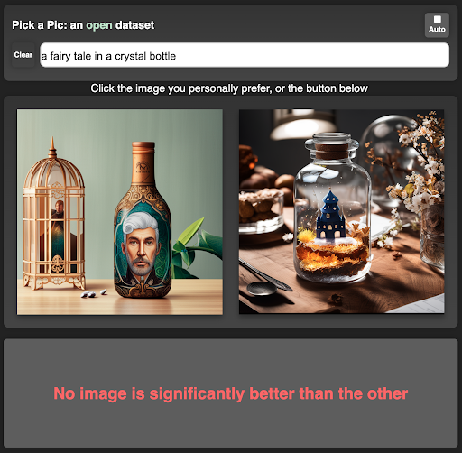

# 11.4  RL 

 LLM ：，，RL 、、。，， VLM ****：，，RL 、。

， AI ：****。，，。

“”。，“”。：，，，，。

 prompt ：

> ，。

，，。？，；，。

， RL ：

> **“”、、？**

： reward， Diffusion  MDP， DDPO 、 reward model 。



<div style="text-align: center; font-size: 0.9em; color: var(--vp-c-text-2); margin-top: -10px; margin-bottom: 20px;">
  <em> 1：DDPO / RL 。 reward  Diffusion ， RL ：reward 。：<a href="https://github.com/kvablack/ddpo-pytorch" target="_blank" rel="noopener noreferrer">DDPO GitHub</a>， Black et al., 2024</em>
</div>

 DDPO ； Diffusion  MDP、，[^ddpo]。

##  LLM  VLM，：RL ？

“VLM ”，：

> **LLM  RL → VLM  RL →  RL**

 RL ： policy， trajectory，reward  trajectory， KL、clipping  advantage 。，。

 LLM。LLM ，。 token ：

$$
y=(y_1,y_2,\ldots,y_T)
$$

 action “ token”。reward 、、、，。PPO、DPO、GRPO ，“ reward”。

 VLM ，：

$$
c=(\text{image}, \text{text prompt})
$$

、、 bounding box。，，action  token 。reward ：、、IoU 、。 VLM-R1 / VISTA-Gym ：，。

，。“”，“ prompt ”。 token，、，， latent / denoising 。 reward “”，：

-  prompt？
- 、、？
- ？
- 、、？
- ？

：

|            |             |                     | RL  action              | reward               |
| -------------- | --------------- | ----------------------- | --------------------------- | ---------------------------- |
| LLM  |  prompt     |                 |  token                | 、、           |
| VLM  |  +  | 、、、    |  token  | 、IoU、    |
|  |  /  | 、、latent  |               | 、、、 |

， RL ， RL 。

：policy gradient、advantage、KL 、PPO-style clipping、reward model、judge model。 state、action、trajectory  reward。

 DDPO 、： Diffusion 、、[^ddpo]。，。

##  Diffusion 

Diffusion “，”。

， latent， $x_T$。：

$$
x_T \rightarrow x_{T-1} \rightarrow \cdots \rightarrow x_1 \rightarrow x_0
$$

 $x_0$  latent。 decoder，。

，：

|   |                   |
| ----- | --------------------- |
| $x_t$ |  latent |
| $t$   |           |
| $c$   | prompt      |

 latent：

$$
x_{t-1}\sim p_\theta(x_{t-1}\mid x_t,t,c)
$$

： $x_t$、 $t$  prompt $c$， $\theta$ ， $x_{t-1}$。

 policy？ RL ，policy ：

$$
\pi_\theta(a\mid s)
$$

“ $s$， $a$ ”。

LLM ：

$$
\pi_\theta(y_t\mid y_{<t},c)
$$

 token $y_{<t}$  $c$， token $y_t$。 token  action， state。

Diffusion ：

$$
p_\theta(x_{t-1}\mid x_t,t,c)
$$

 noisy latent、 prompt， latent。 $(x_t,t,c)$  state， $x_{t-1}$  action。

，“ policy”。 RL。 reward， reward  $p_\theta$，。

##  Diffusion  MDP 

DDPO（Denoising Diffusion Policy Optimization）：Diffusion  MDP。Black  DDPO  denoising  multi-step decision-making problem， policy gradient  reward[^ddpo]。

。：

| RL        | Diffusion                         |
| ----------------- | ----------------------------------------- |
|  $s_t$        |  latent、 prompt：$(x_t,t,c)$ |
|  $a_t$        |  latent，         |
|  $\tau$       | ：$x_T,\ldots,x_0$          |
|  $R$          |  reward model         |
|  $\pi_\theta$ | Diffusion  $p_\theta$       |

， episode：

$$
\tau=(x_T,x_{T-1},\ldots,x_0)
$$

 RL ，episode ：，，，。 CartPole ，，， episode。， token  token， episode。

episode ，“”。：，。， latent “”。、CLIP score、 reward ， $x_0$。 $x_T$  $x_0$  episode，。

episode ，reward model ，：

$$
R=r_\phi(x_0,c)
$$

 $r_\phi$ ，。 $\phi$， $\theta$。

，：

$$
J(\theta)=\mathbb{E}_{\tau\sim p_\theta}\left[r_\phi(x_0,c)\right]
$$

：， reward 。

## DDPO：

 MDP ，DDPO 。 Diffusion 。

。，：

|                                                |                            |
| ------------------------------------------------------------ | -------------------------------------- |
|  episode / MDP                         | DDPO：Black et al., 2024[^ddpo]        |
| ，；         | REINFORCE：Williams, 1992[^reinforce]  |
|  old/new logprob ratio  clipping， | PPO：Schulman et al., 2017[^ppo]       |
|  KL                        | DPOK：Fan et al., 2023[^dpok]          |
|  reward model                        | Pick-a-Pic / HPS v2[^pickapic][^hpsv2] |

。：

> ，；，。

，“”。。REINFORCE  log-derivative trick，。

：

|              |                                            |
| ---------------- | -------------------------------------------------------- |
| $\theta$         | Diffusion ，             |
| $c$              | prompt                                                   |
| $\tau$           | ， $x_T$  $x_0$                    |
| $p_\theta(\tau)$ |                                |
| $R(\tau,c)$      |                                |
| $J(\theta)$      | ；                 |
| $\nabla_\theta$  | “，$J(\theta)$ ”， |

。， prompt $c$ ：

$$
p_\theta(\tau\mid c)
=
p(x_T)\prod_{t=1}^{T}
p_\theta(x_{t-1}\mid x_t,t,c)
$$

。

， $x_T$ ， $\theta$。， $p_\theta(x_{t-1}\mid x_t,t,c)$。

：， $T$  $x_{T-1}$， $T-1$  $x_{T-2}$， $x_0$。，。

 reward：

$$
J(\theta)
=
\mathbb{E}_{\tau\sim p_\theta(\tau\mid c)}
\left[R(\tau,c)\right]
$$

 $R(\tau,c)=r_\phi(x_0,c)$， reward model 。

。 prompt ，：

|      |  |  reward |
| -------- | ---------------- | ----------- |
| $\tau_1$ | $p_1$            | $R_1$       |
| $\tau_2$ | $p_2$            | $R_2$       |
| $\tau_3$ | $p_3$            | $R_3$       |

 reward ：

$$
J=p_1R_1+p_2R_2+p_3R_3
$$

 $\tau_2$  reward ， $p_2$ 。，RL “”，“”：，。

 Diffusion ，、。，：

$$
J(\theta)
=
\int p_\theta(\tau\mid c)R(\tau,c)\,d\tau
$$

。“，”。 $p_1R_1+p_2R_2+p_3R_3$；。

 $\theta$ ，：， reward ？

$$
\nabla_\theta J(\theta)
=
\int \nabla_\theta p_\theta(\tau\mid c)R(\tau,c)\,d\tau
$$

： $\nabla_\theta p_\theta(\tau\mid c)$，“，”。，。“”，。

， **log-derivative trick**， **score-function trick**。 REINFORCE [^reinforce]：

$$
\nabla_\theta p_\theta(\tau\mid c)
=
p_\theta(\tau\mid c)\nabla_\theta\log p_\theta(\tau\mid c)
$$

 $\nabla p$  $p\nabla\log p$。：

$$
\nabla_\theta\log p_\theta
=
\frac{1}{p_\theta}\nabla_\theta p_\theta
$$

 $p_\theta$，：

$$
p_\theta\nabla_\theta\log p_\theta
=
\nabla_\theta p_\theta
$$

，。： $p_\theta(\tau\mid c)$，“”。。

：

$$
\nabla_\theta J(\theta)
=
\int p_\theta(\tau\mid c)
\nabla_\theta\log p_\theta(\tau\mid c)
R(\tau,c)\,d\tau
$$

：

$$
\nabla_\theta J(\theta)
=
\mathbb{E}_{\tau\sim p_\theta}
\left[
\nabla_\theta\log p_\theta(\tau\mid c)R(\tau,c)
\right]
$$

，。：

1.  Diffusion  $\tau$；
2.  reward model ， $R(\tau,c)$；
3.  log probability， $\log p_\theta(\tau\mid c)$， reward 。

， reward 。reward model ，；“”。DDPO ：reward 、、VLM feedback [^ddpo]。

 log probability：

$$
\log p_\theta(\tau\mid c)
=
\log p(x_T)
+
\sum_{t=1}^{T}
\log p_\theta(x_{t-1}\mid x_t,t,c)
$$

 log？。； log ，：

$$
\log(ab)=\log a+\log b
$$

 log probability， log probability 。

 $\log p(x_T)$  $\theta$，：

$$
\nabla_\theta\log p_\theta(\tau\mid c)
=
\sum_{t=1}^{T}
\nabla_\theta
\log p_\theta(x_{t-1}\mid x_t,t,c)
$$

：

$$
\nabla_\theta J
=
\mathbb{E}\left[
\sum_{t=1}^{T}
\nabla_\theta \log p_\theta(x_{t-1}\mid x_t,t,c)
\cdot R(\tau,c)
\right]
$$

 REINFORCE  Diffusion [^reinforce]： reward，； reward ，。Black  DDPO  Diffusion [^ddpo]。

### Baseline  advantage ？

 $R(\tau,c)$ 。 prompt ， prompt 。：。

 baseline $b(c)$：

$$
\hat{A}=R(\tau,c)-b(c)
$$

 $\hat{A}$  advantage。“”，“”。 reward  8 ，baseline  6 ，advantage  +2，； reward  5 ，baseline  6 ，advantage  -1，。

 baseline？：，。“”“”。

。： baseline ， 0。

$$
\mathbb{E}_{\tau\sim p_\theta}
\left[
\nabla_\theta\log p_\theta(\tau\mid c)b(c)
\right]
=
b(c)\int p_\theta(\tau\mid c)
\nabla_\theta\log p_\theta(\tau\mid c)d\tau
$$

 $b(c)$ ， prompt ，。 log-derivative trick：

$$
=
b(c)\int \nabla_\theta p_\theta(\tau\mid c)d\tau
=
b(c)\nabla_\theta \int p_\theta(\tau\mid c)d\tau
=
b(c)\nabla_\theta 1
=0
$$

 1？ $\int p_\theta(\tau\mid c)d\tau$ “”， 1。1  0。， baseline，，。

，$\hat{A}$ ：

| Advantage         |                                    |
| --------------------- | -------------------------------------- |
| $R-\bar{R}$           |  batch  reward           |
| $R-b(c)$              |  prompt  reward      |
| $R-V_\psi(x_t,t,c)$   |  value model       |
| normalize  reward |  batch reward ， |

 advantage ，DDPO ：

$$
\nabla_\theta J
=
\mathbb{E}\left[
\sum_{t=1}^{T}
\nabla_\theta \log p_\theta(x_{t-1}\mid x_t,t,c)
\cdot \hat{A}_t
\right]
$$

 reward， $\hat{A}$。 value model， $\hat{A}_t$。

###  Diffusion  log probability ？

 Diffusion ，：

$$
p_\theta(x_{t-1}\mid x_t,t,c)
=
\mathcal{N}\left(
\mu_\theta(x_t,t,c),
\sigma_t^2 I
\right)
$$

 $\mu_\theta$ ，$\sigma_t$ 。DDPO  log probability， logprob[^ddpo]。 log probability ：

$$
\log p_\theta(x_{t-1}\mid x_t,t,c)
=
-
\frac{1}{2\sigma_t^2}
\left\|
x_{t-1}-\mu_\theta(x_t,t,c)
\right\|_2^2
+ \text{const}
$$

： $x_{t-1}$  $\mu_\theta(x_t,t,c)$ ，，log probability ；，，log probability 。

 `step.logprob` ： RL ， $t$  $x_{t-1}$ 。

###  loss

 loss， $J(\theta)$。：

$$
\mathcal{L}_{\text{pg}}
=
-
\mathbb{E}\left[
\sum_{t=1}^{T}
\log p_\theta(x_{t-1}\mid x_t,t,c)
\cdot \hat{A}_t
\right]
$$

 loss 。：

|                  | loss                       |
| -------------------- | ------------------------------------ |
| $\hat{A}_t>0$        |  log probability |
| $\hat{A}_t<0$        |  log probability |
| $\hat{A}_t\approx 0$ |                      |

 5  REINFORCE ，“ token”“ latent”。

###  KL ？

 reward，。：reward model 。 reward model 、。

 $p_{\text{ref}}$，。DPOK “policy optimization + KL regularization” text-to-image diffusion RL [^dpok]：

$$
\mathcal{L}_{\text{DDPO}}
=
\mathcal{L}_{\text{pg}}
+
\beta\,
\mathbb{E}\left[
\sum_{t=1}^{T}
\mathrm{KL}\left(
p_\theta(\cdot\mid x_t,t,c)
\|p_{\text{ref}}(\cdot\mid x_t,t,c)
\right)
\right]
$$

：

|          |                                      |
| ---------- | ---------------------------------------- |
|  |  reward          |
| KL       |  reward  |

 RLHF、DPO、GRPO ：，。

### DDPO 

“”。： DDPO update ， prompt  loss 。

：

> DDPO ，， reward ，[^ddpo]。

 diffusion fine-tuning 。“”，DDPO “，”。

#### Step 1： prompt

， prompt：

$$
\mathcal{B}=\{c_i\}_{i=1}^{B}
$$

 $B$  batch size，$c_i$  $i$  prompt。

prompt 。 prompt ，； prompt 、、、，reward model 。

， prompt batch ：

| Prompt        |                        |
| ----------------- | ------------------------------ |
|  prompt   |                |
|  prompt     | 、、     |
|  prompt   | 、、、 |
|  prompt     |        |
|  prompt |      |

，：RL  prompt 。 prompt ，。

#### Step 2： rollout

 Diffusion 。RL  **rollout**，。

 prompt $c_i$， $x_T$ ，：

$$
\tau_i=(x_T^{(i)},x_{T-1}^{(i)},\ldots,x_0^{(i)})
$$

：，。

|                                         |                                 |
| --------------------------------------------------- | ------------------------------------------- |
| $x_t$                                               |  log probability      |
| $x_{t-1}$                                           |  $t$  action          |
| $\log p_{\theta_{\text{old}}}(x_{t-1}\mid x_t,t,c)$ |  PPO-style ， old logprob |
|  $x_0$  decoded image                     | reward model                |

 $\theta_{\text{old}}$？。，。“”， old logprob。

 REINFORCE ， logprob。，， rollout  update epoch， old logprob 。 old/new policy ratio  PPO[^ppo]，DDPO  importance-sampling “ rollout、”[^ddpo]。

#### Step 3： reward model 

 reward model：

$$
R_i=r_\phi(x_0^{(i)},c_i)
$$

：reward model ，。“”， reward  latent 。

 DDPO  reward backprop ：reward ， VLM judge、、，。，。，DRaFT  VADER  reward [^draft][^vader]。

 reward ：

1.  latent $x_0$ decode 。
2. - prompt。
3. 。
4.  VLM 、、。
5.  reward $R_i$。

 reward 。 reward  $[0,1]$， reward  $[-10,10]$，。 clipping、。

#### Step 4： reward  advantage

 reward  advantage。 batch ：

$$
\hat{A}_i=R_i-\frac{1}{B}\sum_{j=1}^{B}R_j
$$

，：

$$
\hat{A}_i=
\frac{R_i-\mathrm{mean}(R)}
{\mathrm{std}(R)+\epsilon}
$$

，$\hat{A}_i>0$  $i$  batch ，$\hat{A}_i<0$ 。

 $R_i$？。 prompt ， 0.6 ； prompt ，0.8 。advantage “”，。

， value model：

$$
V_\psi(x_t,t,c)\approx
\mathbb{E}[R\mid x_t,t,c]
$$

：

$$
\hat{A}_{i,t}=R_i-V_\psi(x_t^{(i)},t,c_i)
$$

 advantage。 DDPO ， batch mean baseline 。

#### Step 5： loss

 Diffusion 。

 REINFORCE loss。：“ log probability”“”。

$$
\mathcal{L}_{\text{pg}}
=
-
\frac{1}{B}
\sum_{i=1}^{B}
\sum_{t=1}^{T}
\log p_\theta(x_{t-1}^{(i)}\mid x_t^{(i)},t,c_i)
\cdot \hat{A}_i
$$

：

|                                            |                                                 |
| -------------------------------------------------- | --------------------------------------------------- |
| $\log p_\theta(x_{t-1}^{(i)}\mid x_t^{(i)},t,c_i)$ |  $t$  log           |
| $\hat{A}_i$                                        |  $i$                          |
|                                          |  loss， |

 $\hat{A}_i>0$，， loss  log probability。 $\hat{A}_i<0$，， loss  log probability。

 PPO-style 。 ratio  clip objective  PPO [^ppo]：

$$
\rho_{i,t}(\theta)
=
\frac{
p_\theta(x_{t-1}^{(i)}\mid x_t^{(i)},t,c_i)
}{
p_{\theta_{\text{old}}}(x_{t-1}^{(i)}\mid x_t^{(i)},t,c_i)
}
=
\exp\left(
\log p_\theta(x_{t-1}^{(i)}\mid x_t^{(i)},t,c_i)
-
\log p_{\theta_{\text{old}}}(x_{t-1}^{(i)}\mid x_t^{(i)},t,c_i)
\right)
$$

：，。 $\rho=1.2$， 20%；$\rho=0.7$，。 logprob  `exp`， logprob 、。

 clipped objective：

$$
\mathcal{L}_{\text{clip}}
=
-
\frac{1}{B}
\sum_{i=1}^{B}
\sum_{t=1}^{T}
\min\left(
\rho_{i,t}\hat{A}_i,
\mathrm{clip}(\rho_{i,t},1-\epsilon,1+\epsilon)\hat{A}_i
\right)
$$

clip 。 $\epsilon=0.2$， ratio  $[0.8,1.2]$ 。， reward ，。

 `min` ：，； clip ， ratio 。。 Diffusion ， reward ；KL  ratio clipping [^ppo][^dpok]。

#### Step 6： KL 

 loss、KL ：

$$
\mathcal{L}
=
\mathcal{L}_{\text{clip}}
+
\beta\mathcal{L}_{\text{KL}}
$$

：

$$
\mathcal{L}_{\text{KL}}
=
\frac{1}{B}
\sum_{i=1}^{B}
\sum_{t=1}^{T}
\mathrm{KL}\left(
p_\theta(\cdot\mid x_t^{(i)},t,c_i)
\|p_{\text{ref}}(\cdot\mid x_t^{(i)},t,c_i)
\right)
$$

$p_{\text{ref}}$  RL  Diffusion 。， reward model 。

KL “”。，，KL ； reward，，KL 。$\beta$ ：$\beta$ ，；$\beta$ ， reward。

，：

1.  loss。
2. `loss.backward()` 。
3.  clipping，。
4. `optimizer.step()`  Diffusion 。
5.  prompt， rollout  update。

，。， DDPO  rollout/reward [^ddpo]、PPO  clipped objective[^ppo]  DPOK  KL [^dpok] ：

```python
for prompts in prompt_loader:
    # Step 1-2: rollout with the current policy
    with torch.no_grad():
        trajectories = diffusion.sample_trajectories(
            prompts,
            return_states=True,
            return_actions=True,
            return_logprobs=True,
        )
        old_logprobs = trajectories.logprobs
        images = decoder(trajectories.final_latents)

    # Step 3: score final images
    with torch.no_grad():
        rewards = reward_model(prompts, images)

    # Step 4: turn rewards into advantages
    advantages = (rewards - rewards.mean()) / (rewards.std() + 1e-6)

    # Step 5-6: update the diffusion policy
    for _ in range(update_epochs):
        logprobs = diffusion.logprob(
            states=trajectories.states,
            actions=trajectories.actions,
            prompts=prompts,
        )

        ratio = torch.exp(logprobs - old_logprobs)
        unclipped = ratio * advantages[:, None]
        clipped = ratio.clamp(1 - eps, 1 + eps) * advantages[:, None]
        policy_loss = -torch.minimum(unclipped, clipped).mean()

        kl_loss = diffusion.kl_to(reference_model, trajectories, prompts)
        loss = policy_loss + beta * kl_loss

        optimizer.zero_grad()
        loss.backward()
        torch.nn.utils.clip_grad_norm_(diffusion.parameters(), max_norm)
        optimizer.step()
```

：****。， `old_logprobs`； `logprobs`， ratio 。

 DDPO ，：

>  prompt，； reward ；，， KL  clipping 。

## Reward Model： RL 

，。 RL “”，“reward ”。

 reward model ，； reward model ，； reward ，。

 reward 。

### ：

。 prompt，。Pick-a-Pic  text-to-image ，HPS v2  benchmark  reward model [^pickapic][^hpsv2]。



<div style="text-align: center; font-size: 0.9em; color: var(--vp-c-text-2); margin-top: -10px; margin-bottom: 20px;">
  <em> 2：Pick-a-Pic 。 prompt ， PickScore  reward model。：<a href="https://stability.ai/research/pick-a-pic" target="_blank" rel="noopener noreferrer">Stability AI Research</a>， Kirstain et al., 2023</em>
</div>

Pick-a-Pic ， text-to-image 、[^pickapic]。

：

$$
\mathcal{D}_{\text{pref}}=\{(c,x^+,x^-)\}
$$

 $x^+$ ，$x^-$ 。reward model  $x^+$  $x^-$：

$$
\mathcal{L}_{\text{rm}}
=
-\mathbb{E}_{\mathcal{D}_{\text{pref}}}
\log\sigma\left(r_\phi(c,x^+)-r_\phi(c,x^-)\right)
$$

 Bradley-Terry 。，。Pick-a-Pic [^pickapic]。

。，、。

### ：-

-： prompt。

：

|      |                                |                |
| -------- | ---------------------------------- | ---------------------------- |
|  |              | CLIP Score、VLM          |
|  | prompt         | 、VLM              |
|  | 、、           |  caption     |
|  | 、、、 | 、VLM judge          |
|  |                    | 、、VLM  |

 VLM RL 。 VLM， captioner、judge  reward model，“”。

### ：

、、。 aesthetic score、、。HPS v2  benchmark “”[^hpsv2]。

，。“”，“ prompt”。，，。

### Reward 

 reward ：

$$
R_{\text{total}}
=
w_1R_{\text{align}}
+w_2R_{\text{quality}}
+w_3R_{\text{instruction}}
$$

，。 reward ：，。

 reward：

1.  VLM ，、、。
2. 。
3.  benchmark  reward model 。

 reward ，。


<div style="text-align: center; font-size: 0.9em; color: var(--vp-c-text-2); margin-top: -10px; margin-bottom: 20px;">
  <em> 3：PickScore 。 reward ，。：<a href="https://stability.ai/research/pick-a-pic" target="_blank" rel="noopener noreferrer">Stability AI Research</a></em>
</div>

##  reward ：，？

 reward model ， RL 。。

****， reward-guided sampling  reranking。 prompt  $N$ ， reward model ，。、， reward model 。

****， DDPO、DPOK  RL fine-tuning[^ddpo][^dpok]。，，。

|                     |                          |                   |                      |
| ----------------------- | -------------------------------- | --------------------- | ------------------------ |
| Best-of-$N$ / reranking | ， reward model  | ，    | ，   |
| Reward-guided sampling  |  reward      |  reranking  |    |
| RL fine-tuning          |  reward            |           | ， |

， reranking。 reward model ， RL。

## ：，

，“”。， reward 。Emu Video [^emu]； reward gradient  MLLM feedback [^vader][^t2vfeedback]。

：

1. 、、 prompt。
2. ，。
3.  prompt 。

， reward 。，、 reward ：

$$
R_{\text{video}}
=
\alpha \cdot \frac{1}{T}\sum_t R_{\text{frame}}(x_t,c)
+ \beta \cdot \frac{1}{T-1}\sum_t R_{\text{temporal}}(x_t,x_{t+1})
+ \gamma \cdot R_{\text{overall}}(\{x_t\}_{t=1}^T,c)
$$

：

|                   |                        |
| --------------------- | ------------------------------ |
| $R_{\text{frame}}$    |          |
| $R_{\text{temporal}}$ |          |
| $R_{\text{overall}}$  |  prompt  |

 RL ：

|           |                       |                           |
| ------------- | ------------------------------- | ------------------------------------- |
|     | ，      | 、、 VLM  |
|  horizon    |  token  latent  | 、 reward shaping       |
|       |             | latent 、、 |
| - | prompt          |  caption、 reward           |

，“”；“”。 reward 。

## On-Policy ： RL 

RL ，、，。On-policy ， RL ，。

：

1.  RL  teacher 。
2.  reward model 。
3.  student ， teacher 。

 8 ：，。， latent、 token ， token 。

## 

 RL  VLM ，。

|                |  RL                                       |
| ---------------------- | ----------------------------------------------------------- |
|  5  REINFORCE      | DDPO ， reward    |
|  7  Reward Hacking |  reward model，           |
|  9  RLVR           | 、、                |
|  10  Agentic RL    |  horizon 、 reward  KL      |
|  11.1-11.3  VLM RL | VLM  judge、captioner  reward model |

。。VLM ， prompt；， VLM。，“”“”。

## 

 RL “”，，、。

：

1. **Diffusion  MDP**： episode， reward， reward 。
2. **DDPO **： policy， reward，。
3. **Reward model  RL **：、， reward hacking。
4. ** reward**：reranking ，RL fine-tuning ，。

， VLM  RL 。，：[、 RL](../chapter12_future_trends/intro)。

## 

[^reinforce]: Williams, R. J. (1992). Simple statistical gradient-following algorithms for connectionist reinforcement learning. _Machine Learning_. <https://doi.org/10.1007/BF00992696>

[^ppo]: Schulman, J. et al. (2017). Proximal Policy Optimization Algorithms. <https://arxiv.org/abs/1707.06347>

[^ddpo]: Black, K., Janner, M., Du, Y., et al. (2024). Training Diffusion Models with Reinforcement Learning. _ICLR_. <https://arxiv.org/abs/2305.13301>

[^dpok]: Fan, Y., Watkins, O., Du, Y., et al. (2023). DPOK: Reinforcement Learning for Fine-tuning Text-to-Image Diffusion Models. _NeurIPS_. <https://arxiv.org/abs/2305.16381>

[^draft]: Clark, K. et al. (2024). Directly Fine-Tuning Diffusion Models on Differentiable Rewards. _ICLR_. <https://arxiv.org/abs/2309.17400>

[^vader]: Prabhudesai, M. et al. (2024). Video Diffusion Alignment via Reward Gradients. <https://arxiv.org/abs/2407.08737>

[^pickapic]: Kirstain, S. et al. (2023). Pick-a-Pic: Open Dataset of Human Preferences for Text-to-Image Generation. _NeurIPS_. <https://arxiv.org/abs/2305.01569>

[^hpsv2]: Wu, X. et al. (2023). Human Preference Score v2: A Benchmark for Evaluating Human Preferences of Text-to-Image Synthesis. _NeurIPS_. <https://arxiv.org/abs/2306.09341>

[^emu]: Girdhar, R. et al. (2024). Emu Video: Factorizing Text-to-Video Generation by Explicit Image Conditioning. _ECCV_. <https://arxiv.org/abs/2311.10709>

[^t2vfeedback]: Wu, X. et al. (2024). Boosting Text-to-Video Generative Model with MLLMs Feedback. _NeurIPS_. <https://neurips.cc/virtual/2024/poster/96722>
