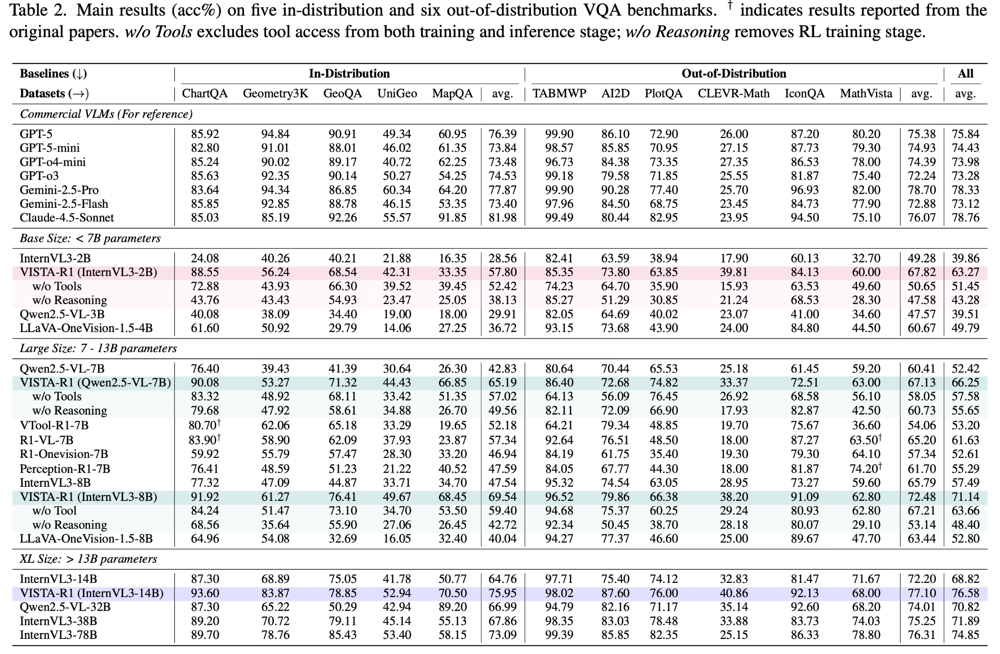

# 11.2 VLM RL ——

 VLM GRPO ，""""。——，，GRPO 。 VLM RL （、、）， RL ：？ RL ？""？

—— VLM RL ，。



<div style="text-align: center; font-size: 0.9em; color: var(--vp-c-text-2); margin-top: -10px; margin-bottom: 20px;">
  <em> 1：VISTA-Gym / VISTA-R1 。 w/o Tools  w/o Reasoning ，，、。：<a href="https://www.eigenai.com/blog/vista-gym-vista-r1" target="_blank" rel="noopener noreferrer">VISTA-Gym / VISTA-R1 Blog</a></em>
</div>

## 11.2.1 ： token  token

 RL ，—— token ，。 VLM ，：****（""）****（）。

。 3  2 ，"？"。" 2 "。。：

- ****：""， 3  2 。，""。
- ****：""（ 3 ），。，""。

， VLM RL ，，。，：

|          |                          |                          |
| -------------- | -------------------------------- | -------------------------------------- |
|  grounding | 、、IoU    |  grounding reward  |
|        | ， | 、 verifier      |
|      |        | 、 ViT、     |

****——（ token +  token），。，： RL ，——，。

****——RL 。， RL 。，——。

|          |               |                  |                  |
| ------------ | ----------------- | -------------------- | ------------------------ |
|      | + |  |    |
|    |       |      |  |
|  |     |      |              |

—— 1/10 。，。

```python
# ==========================================
# 
# ==========================================
def setup_optimizer_with_lr_decay(model, text_lr=1e-6, vision_lr=1e-7):
    """"""
    param_groups = [
        {
            'params': [p for n, p in model.named_parameters()
                       if 'vision' in n or 'vit' in n],
            'lr': vision_lr,  # ：
            'weight_decay': 0.01,
        },
        {
            'params': [p for n, p in model.named_parameters()
                       if 'vision' not in n and 'vit' not in n],
            'lr': text_lr,    # ：
            'weight_decay': 0.01,
        },
    ]
    return torch.optim.AdamW(param_groups)
```

## 11.2.2 ：""

（Visual Hallucination） VLM 。。，" 3  2 "。

 RL ——""，。 VLM ，，。

 RL ，。（""），RL ——""""。 7 ，：，。

：

**： grounding 。** ——。， OCR/。

**：。** （" 3 "" 2-3 "），，。。

**：。** ，（），。""。

<details>
<summary>： RL  SFT ？</summary>

 SFT ，""——" 2 "，" 2 "。""。

 RL ，。""，，。，RL ——""。（），。

 VLM RL ， RL ——""，""。

</details>

## 11.2.3  VLM-RL

VLM RL ，。。

：VLM ，（" 50 ，"），。RL  VLM ——""（），。

，“ →  → ”，：

|      |                    |                        |
| -------- | -------------------------- | ------------------------------ |
|  |  |          |
|  |            |                  |
|  |            |        |
|  |        |  reward    |
|  |          | ， |

，。：

**。** ——。****：（、）， VLM 。

**。** ，——、。****：，。

**。** ，。。

```python
# ==========================================
#  VLM-RL 
# ==========================================
def driving_reward(scene_description, action, telemetry):
    """
    
    - scene_description: VLM 
    - action:  (steering, acceleration, braking)
    - telemetry:  (, , )
    """
    reward = 0.0

    # 1. （）
    if telemetry['collision_risk'] > 0.8:
        return -10.0  #  → 

    if telemetry['red_light_violation']:
        return -10.0  #  → 

    if telemetry['speed_limit_exceeded']:
        reward -= 5.0  #  → 

    # 2. （）
    jerk = abs(telemetry['acceleration_change'])  # 
    reward -= 0.1 * jerk  # / → 

    lateral_error = abs(telemetry['lane_deviation'])  # 
    reward -= 0.05 * lateral_error

    # 3. （）
    if telemetry['speed'] > 0:  # 
        reward += 0.1  # 
    if telemetry['distance_to_goal'] < telemetry['prev_distance']:
        reward += 0.2  #  → 

    # 4. （ VLM ）
    if scene_matches_sensors(scene_description, telemetry):
        reward += 0.3  # VLM 

    return reward
```

 VLM-RL ****。RL ，。""——。， VLM-RL ，。 12.1  Sim-to-Real 。

****。， 2 。，2  60 。VLM ——、， RL 。

## 11.2.4 

， VLM RL ：

|                   |              |          | RL   |        |
| --------------------- | -------------------- | ---------------- | ------------ | -------------- |
| ViT + Transformer     |  ViT             | Cross-attention  |  |  VLM RL    |
|  Transformer      |  Transformer     | Patch embedding  |          |    |
|  ViT +  |  ViT（）   |          |  |        |
|           |  ViT（） | Attention fusion |    |  |

"ViT + Transformer" ——ViT  token， cross-attention  token 。RL 。

" ViT + "——，。 ViT ， 3-5 。

""——。 ViT （，）， attention fusion 。RL ， ViT 。

```python
# ==========================================
# VLM RL ：
# ==========================================

#  3B， ViT 1B，Transformer 2B
architectures = {
    "": {
        "": "3B",
        "": "~8s",
        "": "",
        "": "",
    },
    "": {
        "": "3B（ViT lr=1e-7, LM lr=1e-6）",
        "": "~8s",
        "": "",
        "": "",
    },
    " ViT": {
        "": "2B",
        "": "~5s",
        "": "",
        "": "",
    },
}

for name, config in architectures.items():
    print(f": {name}")
    for key, value in config.items():
        print(f"  {key}: {value}")
    print()
```

## 11.2.5 VLM RL 

：

|              |                           |                            |                      |
| ---------------- | --------------------------------- | ---------------------------------- | ------------------------ |
|          |  token  |  /             |  vs  |
|          |         |  grounding  /  |  vs      |
|    | RL              |  ViT /                 |  vs  |
|  | RL          |  +                   |          |
|          |                       |  /                 |  vs              |
|        |     |                    |  vs          |

，。，，，……。

VLM RL ——、、、……。——[VLM RL ](./vlm-frameworks)。

## 

- [VISTA-Gym / VISTA-R1 Blog](https://www.eigenai.com/blog/vista-gym-vista-r1) —— 、。
- [VLM-R1 GitHub](https://github.com/om-ai-lab/VLM-R1) ——  grounding reward ， VLM RL 。
