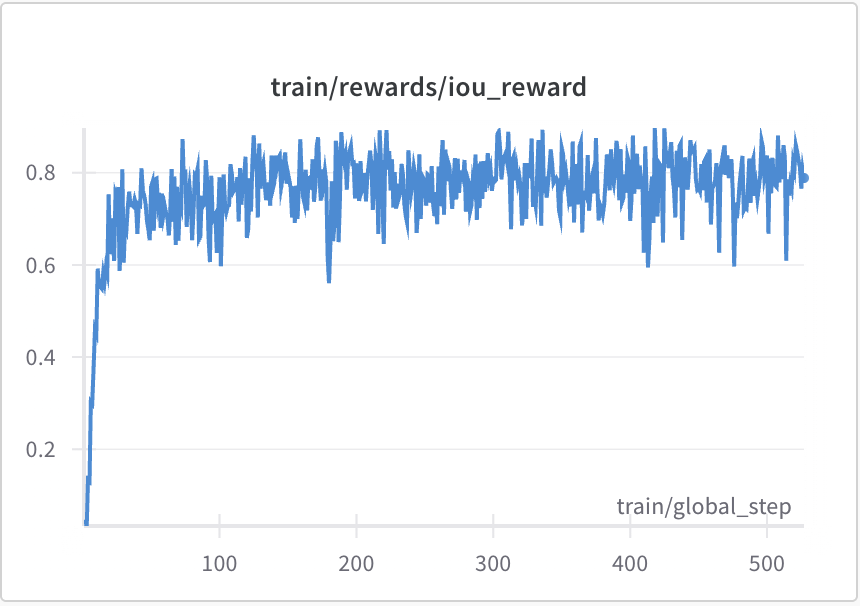

# 11.1 ： GRPO  VLM 

 9  GRPO ——，，（），。：，""""""。

： GRPO  token， VLM GRPO ** token（）+  token（）**。——GRPO ，。



<div style="text-align: center; font-size: 0.9em; color: var(--vp-c-text-2); margin-top: -10px; margin-bottom: 20px;">
  <em> 1：VLM-R1  IoU reward 。 grounding ，“ + GRPO”。：<a href="https://github.com/om-ai-lab/VLM-R1" target="_blank" rel="noopener noreferrer">VLM-R1 GitHub</a></em>
</div>

，：VLM RL “ token”。 reward  grounding，GRPO “”。，。

## 11.1.1 ：

——。，， RM。

（、、），"？"。：（" 3 、2  1 "），（" 2"）。

```python
# ==========================================
# ：
# ==========================================
from datasets import Dataset
import random

def generate_shape_image(num_triangles, num_circles, num_squares, seed=None):
    """"""
    from PIL import Image, ImageDraw

    if seed is not None:
        random.seed(seed)

    img = Image.new('RGB', (256, 256), 'white')
    draw = ImageDraw.Draw(img)

    # 
    for _ in range(num_triangles):
        x, y = random.randint(20, 236), random.randint(20, 236)
        size = random.randint(15, 35)
        draw.polygon([(x, y - size), (x - size, y + size), (x + size, y + size)],
                     fill='red', outline='darkred')

    # 
    for _ in range(num_circles):
        x, y = random.randint(20, 236), random.randint(20, 236)
        r = random.randint(10, 25)
        draw.ellipse([(x - r, y - r), (x + r, y + r)],
                     fill='blue', outline='darkblue')

    # 
    for _ in range(num_squares):
        x, y = random.randint(20, 236), random.randint(20, 236)
        s = random.randint(12, 28)
        draw.rectangle([(x - s, y - s), (x + s, y + s)],
                       fill='green', outline='darkgreen')

    return img


def generate_dataset(num_samples=500):
    """"""
    data = []
    for i in range(num_samples):
        #  1-5 
        n_tri = random.randint(1, 5)
        n_cir = random.randint(1, 5)
        n_sqr = random.randint(1, 5)

        img = generate_shape_image(n_tri, n_cir, n_sqr, seed=i)

        # 
        questions = [
            f"？",
            f"？",
            f"？",
        ]
        answers = [str(n_tri), str(n_cir), str(n_sqr)]
        q_idx = random.randint(0, 2)

        data.append({
            'image': img,
            'question': questions[q_idx],
            'answer': answers[q_idx],
            'ground_truth': {
                'triangles': n_tri,
                'circles': n_cir,
                'squares': n_sqr,
            }
        })

    return Dataset.from_list(data)

# 
train_dataset = generate_dataset(500)
val_dataset = generate_dataset(100)
```

## 11.1.2 ：

，：

|               |  |                          |      |
| --------------------- | ---- | -------------------------------- | -------- |
| （Correctness） | +1.0 |  ground truth      |  |
| （Reasoning） | +0.5 |        |  |
| （Format）    | +0.2 | " →  → " |  |

：（+1.0），""——" →  →  → "。（+0.5）（+0.2），。

```python
# ==========================================
# ：
# ==========================================
import re

def compute_reward(response, ground_truth, target_shape):
    """
    
    - response: 
    - ground_truth: {'triangles': n, 'circles': n, 'squares': n}
    - target_shape:  ('triangles'/'circles'/'squares')
    """
    reward = 0.0

    # 1. ：，
    correct_answer = str(ground_truth[target_shape])
    # 
    numbers = re.findall(r'\d+', response)
    if numbers and numbers[-1] == correct_answer:
        reward += 1.0

    # 2. ：
    shape_keywords = {
        'triangles': ['', '', ''],
        'circles': ['', '', ''],
        'squares': ['', '', ''],
    }
    has_description = any(kw in response for kw in shape_keywords[target_shape])
    if has_description:
        reward += 0.5

    # 3. ：
    reasoning_keywords = ['', '', '', '', '']
    has_reasoning = any(kw in response for kw in reasoning_keywords)
    if has_reasoning:
        reward += 0.2

    return reward
```

## 11.1.3 

，""——""。，，。 GRPO 。

```python
# ==========================================
# VLM GRPO 
# ==========================================
def vlm_grpo_train(model, tokenizer, dataset, num_epochs=3, group_size=4, lr=1e-6):
    """
     GRPO  VLM
    - group_size:  prompt （）
    """
    optimizer = torch.optim.AdamW(model.parameters(), lr=lr)
    normalizer = RewardNormalizer()

    for epoch in range(num_epochs):
        for batch in DataLoader(dataset, batch_size=8):
            all_log_probs = []
            all_rewards = []

            for prompt_img, prompt_text, ground_truth, target_shape in batch:
                #  prompt  group_size 
                group_responses = []
                group_log_probs = []
                group_rewards = []

                for _ in range(group_size):
                    # VLM ： + 
                    response, log_prob = model.generate_with_log_prob(
                        image=prompt_img,
                        text=prompt_text,
                        max_new_tokens=128,
                        temperature=0.8
                    )

                    # 
                    reward = compute_reward(response, ground_truth, target_shape)

                    group_responses.append(response)
                    group_log_probs.append(log_prob)
                    group_rewards.append(reward)

                all_log_probs.append(group_log_probs)
                all_rewards.append(group_rewards)

            # GRPO ：
            #  8 ：Advantage = (R_i - mean) / std
            rewards_tensor = torch.tensor(all_rewards)
            mean_r = rewards_tensor.mean(dim=-1, keepdim=True)
            std_r = rewards_tensor.std(dim=-1, keepdim=True) + 1e-8
            advantages = (rewards_tensor - mean_r) / std_r

            # 
            log_probs_tensor = torch.stack([torch.stack(lp) for lp in all_log_probs])
            loss = -(log_probs_tensor * advantages.detach()).mean()

            #  KL （ 8 ）
            kl_penalty = compute_kl_penalty(model, ref_model, batch)
            loss = loss + 0.05 * kl_penalty

            optimizer.zero_grad()
            loss.backward()
            torch.nn.utils.clip_grad_norm_(model.parameters(), max_norm=1.0)
            optimizer.step()
```

。，"？"：

> ****："3。"（，）

，：

> ****：" 2 、**3 ** 1 。。 3。"

，。（+0.5）（+0.2）。

## 11.1.4 

 VLM ， 8 （、KL 、），：

**。** VLM ""。，；，。——""，。

**。** 。 U ——。（），""。

**。** 。""，—— 5 ， 7 。

<details>
<summary>： VLM GRPO （1e-6） GRPO（ 5e-7  1e-5）？</summary>

VLM ——（ViT）（Transformer）。，RL （），""——，""。，，。

，——（ 1/10），。， RL 。。

</details>

， VLM RL ： RL （GRPO），，。，" + "，——[VLM RL ](./vlm-challenges)。

## 

- [VLM-R1 GitHub](https://github.com/om-ai-lab/VLM-R1) ——  VLM-R1 、grounding reward ，。
