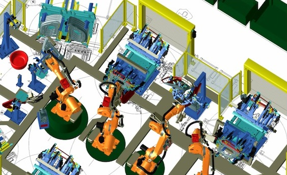
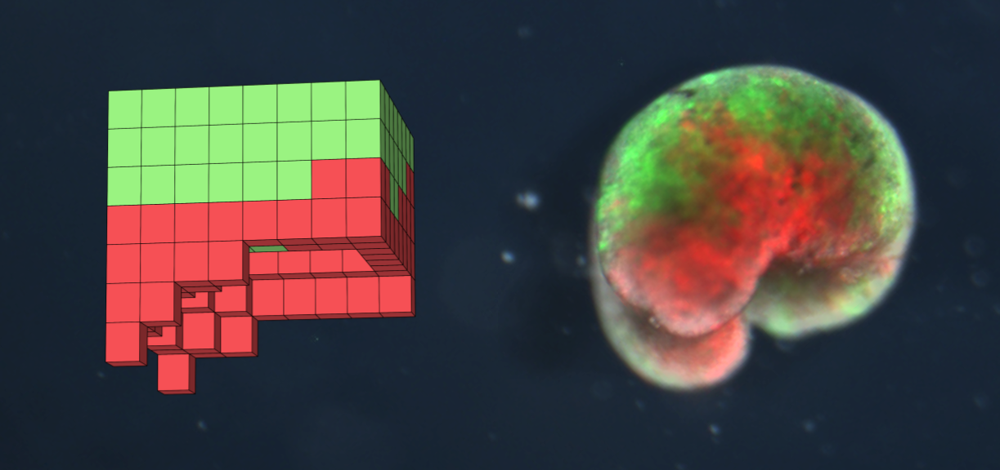
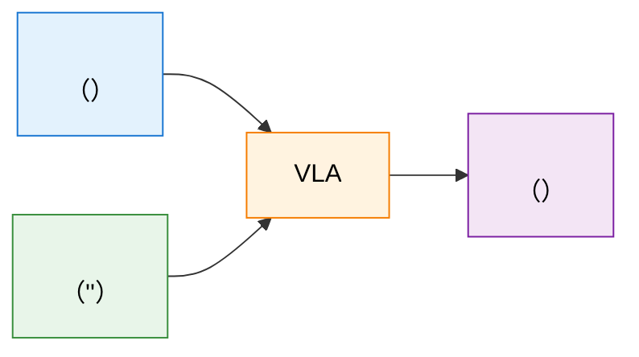

# 12.1 —— RL 

，""——CartPole 、Atari 、LLM  token。：，`env.reset()` ，。 RL ——，、、。

**（Embodied Intelligence）** ： AI ""，、。

## ？

**，-- AI **。""，。

：""，。、、，""。 AI —— AI ""。


<div style="text-align: center; font-size: 0.9em; color: var(--vp-c-text-2); margin-top: -10px; margin-bottom: 20px;">
  <em> 1：The Stanford arm，，。：<a href="https://commons.wikimedia.org/wiki/File:The_Stanford_Arm.jpg" target="_blank" rel="noopener noreferrer">Wikimedia Commons</a></em>
</div>

### 

：

1. ****：，、、
2. **-**：，，——
3. ****：（、、），，

##  RL 

， RL ——、、、。 CartPole、PPO  LLM ？

|        |  RL（CartPole、LLM） |  RL                        |
| ---------- | ------------------------ | ---------------------------------- |
|    | （/、token） | （、、）   |
|    |  token     | （+++）  |
|  | ，     | ， |
|    |                  | （、、）     |
|    |              |                |
|    |              |              |

：** RL ，""；，。**

## 

，，。，，：

### 1. （Navigation）

****：（：、 A  B ）。

- ****：
  - **PointGoal Navigation**：（“ 5 ，”），。
  - **ObjectGoal Navigation**：（“”），。
- ****： SLAM（） A\* 。 RL ，**（End-to-End）**： RGB-D  LiDAR ， CNN/Transformer ，（、、）。
- ****：（Mapping）、（）。

### 2. （Grasping）

****：、。

- ****：（Manipulation）。（Parallel Jaw Gripper）， **6-DoF（）**（x, y, z  Roll, Pitch, Yaw ），。
- ****：
  -  RL ，。（Point Cloud）。
  - **Reward Shaping（）** 。“” +1 ，。，：（+0.1） -> （+0.3） -> （+1.0）。

### 3. （Dexterous Manipulation）

****：（ Shadow Hand）、、（、）。

- ****：。（ Shadow Hand  24 ）， 20 。。
- ****：OpenAI （Solving Rubik's Cube）。 PPO ，**（ADR）**，。
- ****：**（Contact Dynamics）**——、、，。


<div style="text-align: center; font-size: 0.9em; color: var(--vp-c-text-2); margin-top: -10px; margin-bottom: 20px;">
  <em> 2： PR2 ，。：<a href="https://commons.wikimedia.org/wiki/File:PR2_robot_with_advanced_grasping_hands.JPG" target="_blank" rel="noopener noreferrer">Wikimedia Commons</a></em>
</div>

### 4.  / （Locomotion）

****：，、、（ Atlas、 Go2  H1）。

- ****：
  -  ZMP（） MPC（）。
  -  RL **（Target Joint Angles）**。（ 1000Hz） PD （）：$\tau = K_p (q_{target} - q_{current}) - K_d \dot{q}_{current}$。
  - RL  50Hz ， IMU（、）， $q_{target}$  PD 。
- ****：（Underactuated System）、。


<div style="text-align: center; font-size: 0.9em; color: var(--vp-c-text-2); margin-top: -10px; margin-bottom: 20px;">
  <em> 3： BigDog ，。：<a href="https://commons.wikimedia.org/wiki/File:Big_dog_military_robots.jpg" target="_blank" rel="noopener noreferrer">Wikimedia Commons</a></em>
</div>

```mermaid
flowchart TB
    subgraph ""
        N[" Navigation"]
        G[" Grasping"]
        D[" Dexterous Manipulation"]
        L[" Locomotion"]
    end

    N --> N1[" / "]
    G --> G1[" / "]
    D --> D1[" /  / "]
    L --> L1[" / "]

    style N fill:#e3f2fd,stroke:#1976d2,color:#000
    style G fill:#e8f5e9,stroke:#388e3c,color:#000
    style D fill:#fff3e0,stroke:#f57c00,color:#000
    style L fill:#f3e5f5,stroke:#7b1fa2,color:#000
```

## ： RL 

（ CartPole ），（、） RL ？：

### 1.  MDP  POMDP（）

- ** RL（）**：（MDP）。 $S = [x, \dot{x}, \theta, \dot{\theta}]$  4 ，****，，。
- **（）**：**（POMDP）**。“”（、），**（Observation）** $O_t$。
  - ****： $\pi(a_t | s_t)$，**（Belief State）**：$b_t(s) = \mathbb{P}(s_t | O_1, A_1, ..., O_t)$。
  - ****： RL ， MLP 。 RL ，**（Frame Stacking）**  RNN/LSTM （）。

    ```python
    #  RL  (CartPole)
    observation_space = gym.spaces.Box(low=-inf, high=inf, shape=(4,))

    #  ( Unitree Go2 ) ，
    observation_space = gym.spaces.Dict({
        'base_lin_vel': Box(shape=(3,)),         # 
        'base_ang_vel': Box(shape=(3,)),         # IMU 
        'projected_gravity': Box(shape=(3,)),    # （）
        'dof_pos': Box(shape=(12,)),             # 12
        'dof_vel': Box(shape=(12,)),             # 12
        'history': Box(shape=(5, 33))            #  5 
    })
    ```

### 2. ：

- ** RL（）**：（），$a_t \in \{0, 1, ..., N\}$， Softmax 。
- **（）**：、。， 19 （ Unitree H1）， $a_t \in \mathbb{R}^{19}$  19 。
  - ****： Softmax 。**（Multivariate Gaussian Distribution）**：
    $$
    \pi_\theta(a|s) = \frac{1}{\sqrt{(2\pi)^k |\Sigma|}} \exp\left(-\frac{1}{2}(a-\mu_\theta(s))^T \Sigma^{-1} (a-\mu_\theta(s))\right)
    $$
     $k$  $\mu_\theta$（） $k$ （）。
  - ****： `[-1, 1]` ，**（Action Scaling）** ：

    ```python
    #  ( 12 )
    action = policy_net(observation)  #  [-1.0, 1.0]  12 

    #  (rad)
    # default_dof_pos ，action_scale  0.25 
    target_dof_pos = default_dof_pos + action * action_scale

    #  target_dof_pos  PD 
    ```

### 3.  Sim-to-Real 

- ** RL（）**： $\mathcal{P}(s_{t+1}|s_t, a_t)$ 。，。
- **（Sim-to-Real Gap）**：（），。 $\mu_{sim}$（、、） $\mu_{real}$ 。
  - ****：，**（Domain Randomization）**。 $\mu$  $p(\mu)$，“”“”：
    $$
    J(\theta) = \mathbb{E}_{\mu \sim p(\mu)} \left[ \mathbb{E}_{\tau \sim \mathcal{P}_\mu}[R(\tau)] \right]
    $$
  - ****： `reset()`  `step()` ，“”：

    ```python
    def apply_domain_randomization(self):
        # 1.  ( 20%)
        self.model.body_mass[:] *= np.random.uniform(0.8, 1.2)

        # 2.  (、、)
        self.model.geom_friction[:] *= np.random.uniform(0.5, 1.5)

        # 3.  ()
        #  10~20ms ，，
        delayed_action = self.action_history[-self.delay_steps]

        # 4.  ()
        noisy_observation = true_observation + np.random.normal(0, noise_std)
        return noisy_observation
    ```

### 4. ： (Reward Shaping)

- ** RL（）**：，。 +1， -1。RL 。
- **（）**：“ +1， -1”，，（）。
  - ** Insight**： RL **（Composite Reward Function）**。
  - ****：“（Task Reward）”“（Regularization Penalty）”：
    $$
    R_t = \sum_{i} w_i r_{task, i} - \sum_{j} \lambda_j c_{penalty, j}
    $$
  - ****： RL （ `unitree_rl_gym` ），，：

    ```python
    def compute_reward(self):
        # 1. ：（）
        lin_vel_error = np.sum(np.square(self.commands[:2] - self.base_lin_vel[:2]))
        reward_tracking = np.exp(-lin_vel_error / 0.25) * self.dt

        # 2. ：，
        penalty_orientation = np.sum(np.square(self.projected_gravity[:2])) * -0.5

        # 3. ：，
        penalty_torques = np.sum(np.square(self.torques)) * -0.00001

        # 4. ：，（）
        penalty_action_rate = np.sum(np.square(self.last_actions - self.actions)) * -0.01

        return reward_tracking + penalty_orientation + penalty_torques + penalty_action_rate
    ```

### 5.  Insight： Actor-Critic (Asymmetric AC)

- ** RL**： PPO  Actor-Critic ，Actor （ $\pi$） Critic （ $V$）****（State/Observation）。
- **（Privileged Learning）**：，“”。、、。， IMU 。
  - ** Insight**： Critic “”， Actor “”？** Actor-Critic（Asymmetric Actor-Critic / ）**。
  - ****： Critic （Privileged State $S_{priv}$）， $V(S_{priv})$ 。， Actor $\pi(a|O_{noisy})$ 。， Actor ， Critic。
  - ****：：

    ```python
    #  Asymmetric Actor-Critic

    # 1.  ( IMU、)
    obs = env.get_noisy_observation()

    # 2.  (、、)
    privileged_obs = env.get_privileged_state()

    # 3.  (Critic) ， V 
    value = critic_net(privileged_obs)

    # 4.  (Actor) ，
    action = actor_net(obs)

    # ， Critic， Actor
    ```

## 

 RL ，，。

### ：PPO——

[PPO](https://arxiv.org/abs/1707.06347) ** RL **。：

- ****：PPO （clipping）， Vanilla PG 
- ****：PPO ，
- ****： SAC ，PPO ，

 [NVIDIA Isaac Gym](https://developer.nvidia.com/isaac-gym) ，PPO —— RL 。OpenAI （[Solving Rubik's Cube with a Robot Hand](https://openai.com/index/solving-rubiks-cube/)）、 [ANYmal](https://www.anybotics.com/) ， PPO 。

### ：SAC 

[SAC](https://arxiv.org/abs/1801.01290)（Soft Actor-Critic）""。（Maximum Entropy）——。

SAC ****——，。（），，。

， RL ：** PPO ， SAC **—— SAC 。

## 


<div style="text-align: center; font-size: 0.9em; color: var(--vp-c-text-2); margin-top: -10px; margin-bottom: 20px;">
  <em> 4：。。：<a href="https://commons.wikimedia.org/wiki/File:5R_robot.gif" target="_blank" rel="noopener noreferrer">Wikimedia Commons</a></em>
</div>

 RL ——，，。：

### MuJoCo


<div style="text-align: center; font-size: 0.9em; color: var(--vp-c-text-2); margin-top: -10px; margin-bottom: 20px;">
  <em> 5：。 MuJoCo 。：<a href="https://commons.wikimedia.org/wiki/File:SpaceRoboticsChallenge_Task2.png" target="_blank" rel="noopener noreferrer">Wikimedia Commons</a></em>
</div>

[MuJoCo](https://mujoco.org/)（Multi-Joint dynamics with Contact）""。**、**。MuJoCo ——、。DeepMind  [dm_control](https://github.com/google-deepmind/dm_control) suite  OpenAI Gym  MuJoCo。2021  MuJoCo  DeepMind ，。

### Isaac Gym / Isaac Sim


<div style="text-align: center; font-size: 0.9em; color: var(--vp-c-text-2); margin-top: -10px; margin-bottom: 20px;">
  <em> 6：。Isaac Gym/Sim  GPU ，。：<a href="https://commons.wikimedia.org/wiki/File:Asynchronous_Multi-Body_Framework,_AMBF.png" target="_blank" rel="noopener noreferrer">Wikimedia Commons</a></em>
</div>

NVIDIA  Isaac **GPU **。Isaac Gym（ deprecated， Isaac Lab/Isaac Sim） GPU ， MuJoCo 。

::: info Isaac Lab  Isaac Gym
NVIDIA  Isaac Gym  deprecated， **Isaac Lab**  GPU 。Isaac Lab  Isaac Sim ，， Gymnasium 。：`pip install isaacsim[all]`， [Isaac Lab GitHub](https://github.com/isaac-sim/IsaacLab)。
:::

Isaac ** CPU **。PPO + Isaac Gym ，。

### ManiSkill / Sapien



<div style="text-align: center; font-size: 0.9em; color: var(--vp-c-text-2); margin-top: -10px; margin-bottom: 20px;">
  <em> 7：（Manipulation）。 ManiSkill  Sapien 。：<a href="https://commons.wikimedia.org/wiki/File:Robotic_simulation_using_Robcad_software.jpg" target="_blank" rel="noopener noreferrer">Wikimedia Commons</a></em>
</div>

[ManiSkill](https://maniskill.readthedocs.io/)（ [Sapien](https://sapien.ucsd.edu/) ）**（Manipulation）** 。————。、、，ManiSkill  benchmark。

|                 |                      |                   |
| --------------------- | ---------------------------- | ----------------------------- |
| MuJoCo                | ，   | 、        |
| Isaac Lab / Isaac Sim | GPU ，   | 、/ |
| ManiSkill / Sapien    | ， | 、、        |

## Sim-to-Real：



<div style="text-align: center; font-size: 0.9em; color: var(--vp-c-text-2); margin-top: -10px; margin-bottom: 20px;">
  <em> 8：。Sim-to-Real （Sim-to-Real Gap）。：<a href="https://commons.wikimedia.org/wiki/File:Xenobot_sim_to_real.png" target="_blank" rel="noopener noreferrer">Wikimedia Commons</a></em>
</div>

，。 **Sim-to-Real（）**，。

？**（Sim-to-Real Gap）**：

- ****：、、，
- ****：（、），
- ****：，

### （Domain Randomization）

 Sim-to-Real Gap 。：****—— 0.3-0.7 、、、。，。

```python
def domain_randomized_env(base_params):
    """："""
    randomized = {}
    randomized["friction"] = np.random.uniform(0.3, 0.7)
    randomized["gravity"] = base_params["gravity"] * np.random.uniform(0.9, 1.1)
    randomized["joint_damping"] = np.random.uniform(0.01, 0.1)
    randomized["object_mass"] = base_params["mass"] * np.random.uniform(0.8, 1.2)
    return randomized
```

，、——，。

### （System Identification）

****：（、），""。，。

：，。

## 

### （Diffusion Policy）

 7  PPO ——，。：，。

（[Diffusion Policy](https://diffusion-policy.cs.columbia.edu/)）****——，。，""""。，。

### --（VLA）


<div style="text-align: center; font-size: 0.9em; color: var(--vp-c-text-2); margin-top: -10px; margin-bottom: 20px;">
  <em> 9：。VLA ，，。：<a href="https://commons.wikimedia.org/wiki/File:Care-O-Bot_grasping_an_object_on_the_table_(5117071459).jpg" target="_blank" rel="noopener noreferrer">Wikimedia Commons</a></em>
</div>

VLA（Vision-Language-Action）、。、。

：""→ VLA  +  → 。

Google  [RT-2](https://robotics-transformer2.github.io/)（Robotic Transformer 2） VLA ：，""——， token。 11  VLM RL ——""""。



VLA ：""""——。

## ： PPO 

，****。（ GPU， CPU），（HalfCheetah）。

 `MuJoCo` （ Gymnasium ）， `Stable-Baselines3`  `PPO` 。

### 1. 

，：

```bash
pip install gymnasium[mujoco] stable-baselines3
```


<div style="text-align: center; font-size: 0.9em; color: var(--vp-c-text-2); margin-top: -10px; margin-bottom: 20px;">
  <em> 10：Gymnasium  HalfCheetah 。 PPO 。</em>
</div>

> **（HalfCheetah）？**
>  `gymnasium[mujoco]` （Benchmark Model）。 3D 、，MuJoCo （、、、）。

### 2. 

 `train_cheetah.py` 。** → ** Sim-to-Real （ Sim ）：

```python
import gymnasium as gym
from stable_baselines3 import PPO

# ==========================================
# ：（）
# ==========================================
# 1.  MuJoCo （，，）
# - (Observation)：、（17 ）
# - (Action)： 6 （6 ）
# - (Reward)：，
env = gym.make("HalfCheetah-v4")

# 2.  PPO 
# MlpPolicy 
# verbose=1 （、）
model = PPO("MlpPolicy", env, verbose=1)

print("🚀  MuJoCo  PPO...")
# 3. 
# HalfCheetah 。 CPU ：
# -  20（ 2~3 ）：。
# -  100（ 10 ）：、。
model.learn(total_timesteps=200_000)

# 4. ""
model.save("ppo_halfcheetah")
env.close()
print("✅ ，！")

# ==========================================
# ：""
# ==========================================
#  (render_mode="human")
eval_env = gym.make("HalfCheetah-v4", render_mode="human")
model = PPO.load("ppo_halfcheetah")

obs, info = eval_env.reset()

print("👀 ...")
for _ in range(1000):
    # （deterministic=True ，）
    action, _states = model.predict(obs, deterministic=True)

    # ，、
    obs, reward, terminated, truncated, info = eval_env.step(action)

    if terminated or truncated:
        obs, info = eval_env.reset()

eval_env.close()
```

### 3. ？

1. ****： PPO  `ep_rew_mean`（）。，（timesteps）。
2. ****：， MuJoCo 。""， RL ********。

：**，RL （ PPO）。**

## 

|                     |                            |
| --------------------------------- | -------------------------------------------- |
| PPO （ 7 ） |  RL ， |
| Actor-Critic （ 6 ）      | SAC ，       |
| VLM RL （ 11 ）   | VLA ： +  →                  |
| （ 5 ）           |                |
| RLHF （ 8 ）        |                |

<details>
<summary>： PPO  SAC ？</summary>

****。（ Isaac Lab）， GPU 。PPO ——，。

SAC ，（replay buffer），，。

：**PPO ，**——，。

</details>

::: tip ：Model-Based RL
，，。 MBRL ：[Model-Based RL： Model-Free  Model-Based](./model-based-rl/)。
:::

## ：（Unitree）

，，。**（Unitree Robotics）** 。，，：


<div style="text-align: center; font-size: 0.9em; color: var(--vp-c-text-2); margin-top: -10px; margin-bottom: 20px;">
  <em> 11： Go2  H1 。：<a href="https://github.com/unitreerobotics/unitree_rl_gym" target="_blank" rel="noopener noreferrer">unitree_rl_gym GitHub</a></em>
</div>

### 1. ：`unitree_rl_gym`

- **GitHub **：[unitreerobotics/unitree_rl_gym](https://github.com/unitreerobotics/unitree_rl_gym)
- ****： Isaac Gym  MuJoCo ， Unitree Go2（）、G1  H1（）。
- **？**
  - ****： pipeline：`Train -> Play -> Sim2Sim -> Sim2Real`。
  - ****： `Reward Shaping`（：、、）。
  - **（Domain Randomization）**：、、，。

### 2. ：`unitree_guide`

- **GitHub **：[unitreerobotics/unitree_guide](https://github.com/unitreerobotics/unitree_guide)
- ****：（RL），，。
- **？**
  - “ RL”。， **RL  MPC（）**。
  -  WBC（） MPC ， RL “”。

### 3. 

- ****：[ (Developer Support)](https://support.unitree.com/home/zh/developer)
- ****：（ PyTorch、Isaac Gym， `rsl_rl`）。，。
